# RHCE红帽认证全套入门教程：P16：3.02-find查找及grep过滤

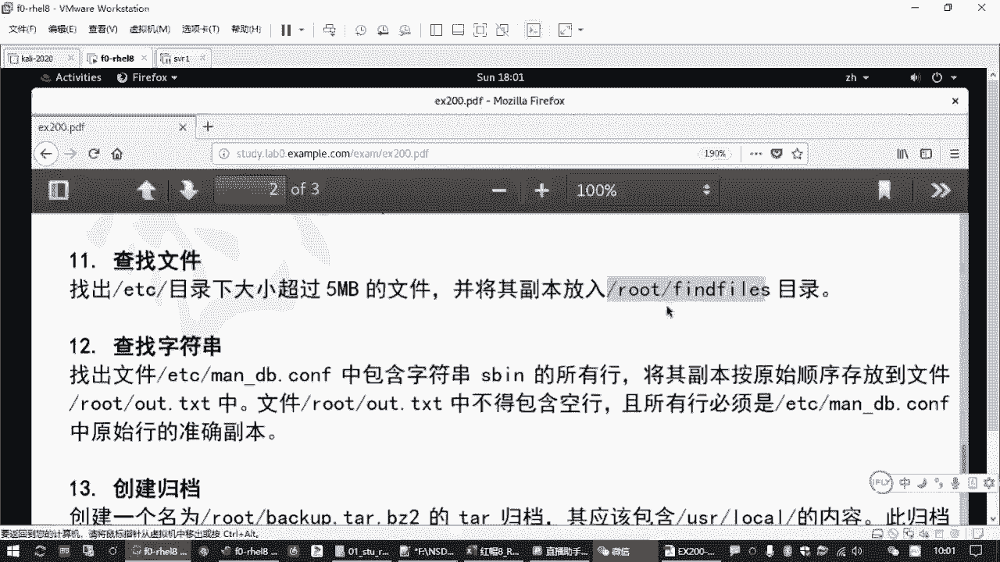

在本节课中，我们将要学习两个在Linux系统中非常核心的命令：`find`和`grep`。`find`命令用于在文件系统中查找符合条件的文件，而`grep`命令则用于在文本内容中过滤出包含特定字符串的行。掌握这两个命令是进行系统管理和日常操作的基础。

## 查找文件：find命令

上一节我们介绍了课程概述，本节中我们来看看如何使用`find`命令查找文件。

`find`命令的基本格式是：
```bash
find [目录范围] [查找条件]
```
*   如果不指定目录范围，则默认在当前目录下查找。
*   如果不指定查找条件，则默认查找所有文件。

以下是`find`命令常用的几种查找条件：

*   **按名称查找**：使用 `-name` 选项。例如，`find /etc -name "resolv.conf"` 查找`/etc`目录下名为`resolv.conf`的文件。可以使用通配符，如 `find /boot -name "vmli*"` 查找以`vmli`开头的文件。
*   **按类型查找**：使用 `-type` 选项。常见类型有：常规文件 `f`，目录 `d`，链接文件 `l`，块设备 `b`，字符设备 `c`。例如，`find /dev -type b` 列出`/dev`目录下的所有块设备文件。
*   **按大小查找**：使用 `-size` 选项。可以用 `+` 表示大于，`-` 表示小于。单位需注意：`k` 表示KB（小写），`M` 表示MB（大写）。例如，`find /etc -size +5M` 查找`/etc`目录下大小超过5MB的文件。
*   **按修改时间查找**：使用 `-mtime` 选项。数字表示天数，`+n` 表示n天以前，`-n` 表示n天以内。例如，`find . -mtime +30` 查找当前目录下30天以前修改过的文件。
*   **按用户/组查找**：使用 `-user` 或 `-group` 选项。例如，`find /home -user alice` 查找`/home`目录下属于用户`alice`的文件。

多个条件可以组合使用：
*   **与关系**：使用 `-a` 或直接连接（默认就是与关系）。例如，`find /etc -size +5k -a -name "file*"` 查找大小超过5KB且名字以`file`开头的文件。
*   **或关系**：使用 `-o`。例如，`find . -name "*.txt" -o -name "*.log"` 查找当前目录下所有`.txt`或`.log`文件。

## 处理查找结果

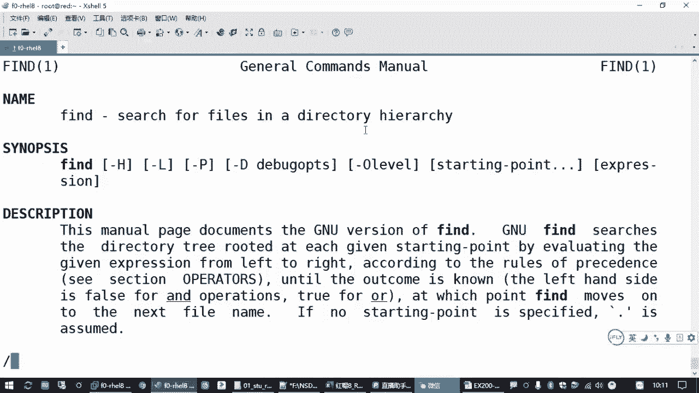

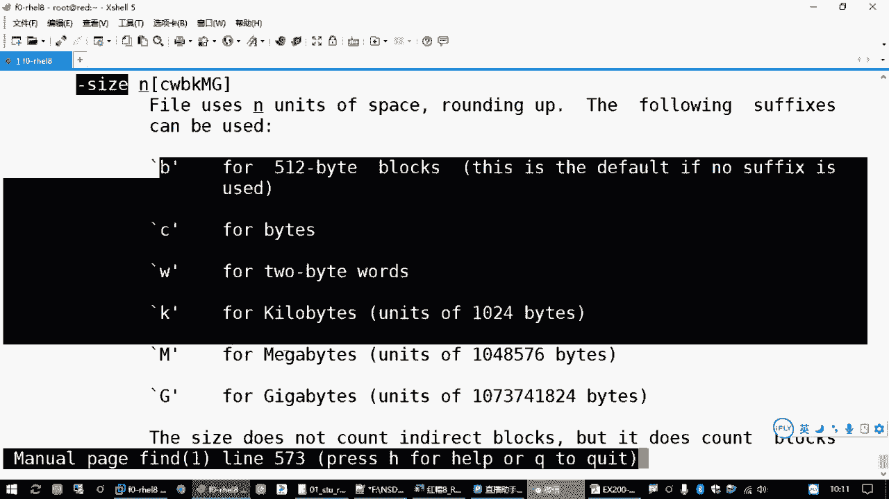

上一节我们介绍了如何查找文件，本节中我们来看看如何对查找结果进行处理。

`find`命令找到文件后，我们经常需要对这些文件执行进一步操作。`-exec` 选项可以让我们对找到的每一个文件执行指定的命令。

其基本语法为：
```bash
find [目录] [条件] -exec 命令 {} \;
```
其中，`{}` 是一个占位符，代表`find`命令找到的每一个文件路径。命令末尾的 `\;` 是必需的，表示`-exec`操作的结束。

例如，要查看`/etc`目录下所有超过5KB的文件的详细信息，可以执行：
```bash
find /etc -size +5k -exec ls -lh {} \;
```
这条命令会为每一个找到的文件执行一次 `ls -lh` 命令。

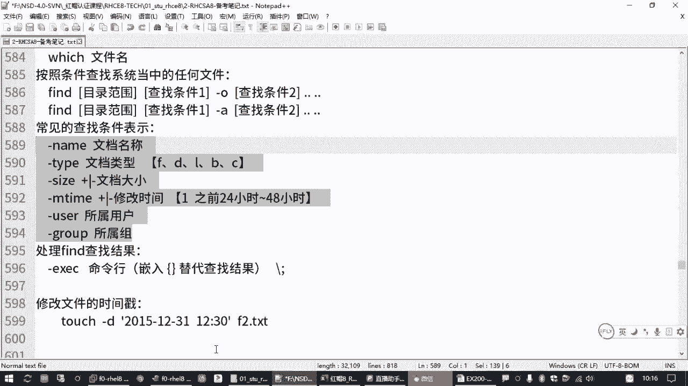

## 实战：查找并复制文件

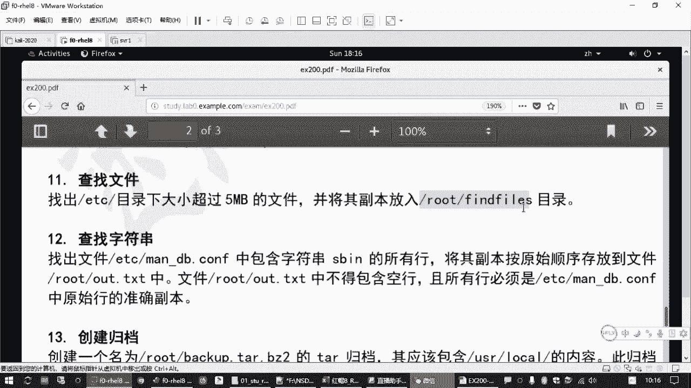

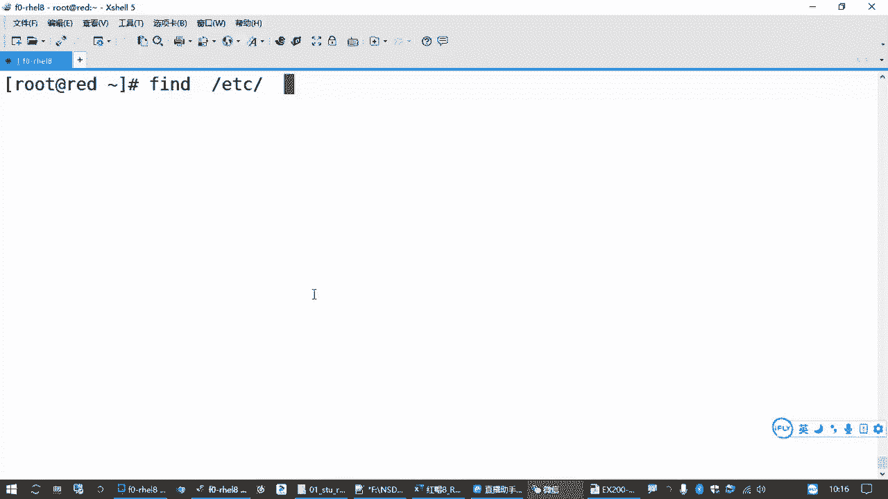

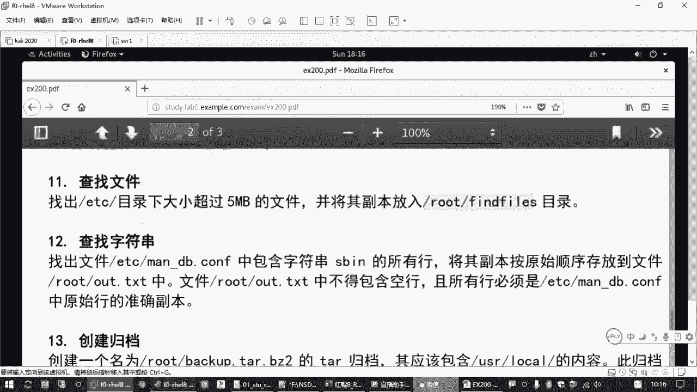

现在，让我们应用所学知识来解决一个实际问题：在`/etc`目录下查找大小超过5MB的文件，并将它们复制到`/root/findfiles`目录中。

首先，创建目标目录（如果不存在）：
```bash
mkdir /root/findfiles
```
然后，使用`find`命令查找并复制：
```bash
find /etc -size +5M -exec cp -p {} /root/findfiles \;
```
最后，验证结果：
```bash
ls -lh /root/findfiles
```

## 过滤文本：grep命令

上一节我们学习了查找文件，本节中我们来看看如何使用`grep`命令过滤文本内容。

`grep`命令用于在文本中搜索包含指定模式（字符串）的行。它有两种主要用法：

1.  **在文件中搜索**：
    ```bash
    grep [选项] “关键词” 文件名
    ```
    例如，`grep “127” /etc/hosts` 在`/etc/hosts`文件中查找包含“127”的行。

2.  **对命令输出进行过滤**：
    ```bash
    命令 | grep [选项] “关键词”
    ```
    例如，`ip addr show | grep ‘inet ‘` 在`ip addr show`命令的输出中，过滤出包含“inet ”（注意空格）的行。使用管道 `|` 将前一个命令的输出传递给`grep`处理。如果关键词包含空格等特殊字符，建议用引号括起来。

以下是`grep`命令的一些常用选项：

*   `-v`：反向选择，即输出**不包含**关键词的行。
*   `-i`：忽略大小写进行匹配。
*   `-n`：显示匹配行在原文件中的行号。
*   `-o`：仅显示匹配到的关键词本身，而不是整行。
*   `-E`：启用扩展正则表达式。也可以使用等效命令`egrep`。

例如：
*   `grep -v “localhost” /etc/hosts` 输出`/etc/hosts`文件中不包含“localhost”的行。
*   `grep -i “error” /var/log/messages` 在日志文件中查找“error”，不区分大小写。
*   `egrep “127|localhost” /etc/hosts` 查找包含“127”**或**“localhost”的行。

## 实战：过滤并保存结果

现在，我们来解决另一个问题：在`/etc/man_db.conf`文件中，查找所有包含字符串“SB”的行，并将结果**原样**保存到`/root/output.txt`文件中。

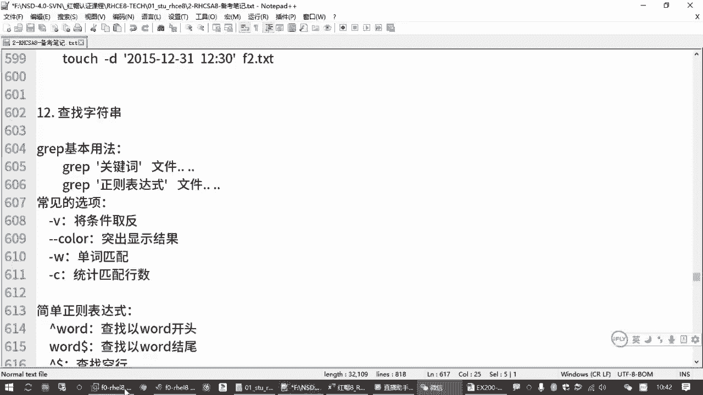

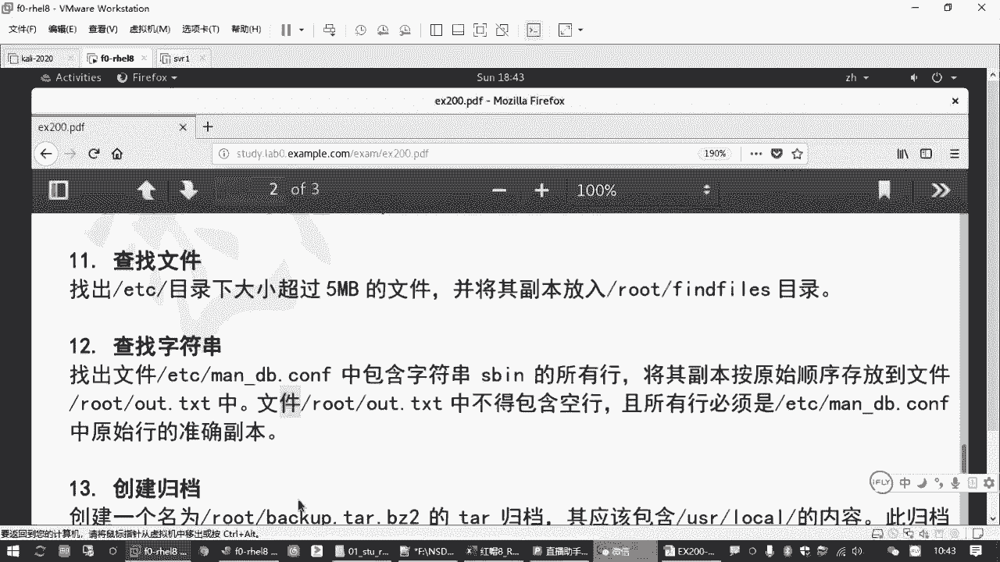

最可靠的方法是使用输出重定向，而不是手动复制粘贴：
```bash
grep “SB” /etc/man_db.conf > /root/output.txt
```
这里，`>` 是输出重定向符号，它会将命令的标准输出（即屏幕显示内容）写入到指定文件中。如果文件不存在则创建，如果存在则覆盖。

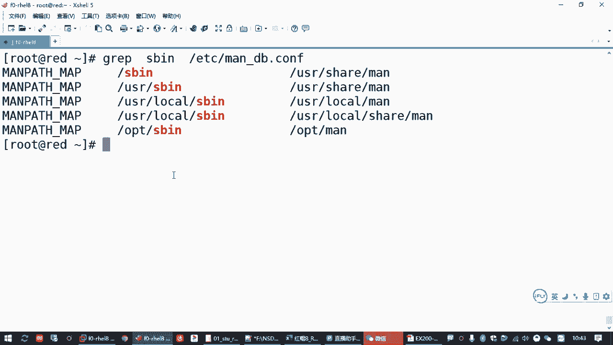

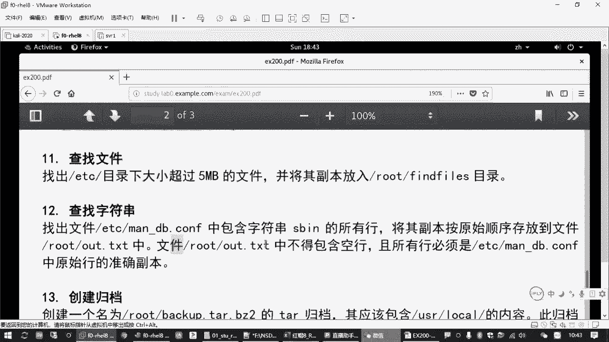

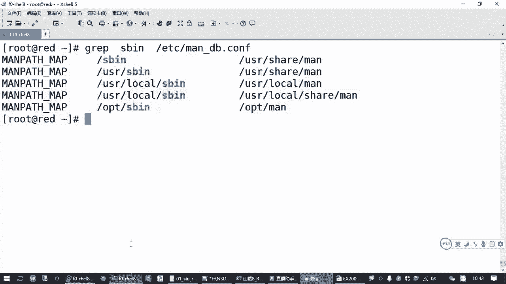

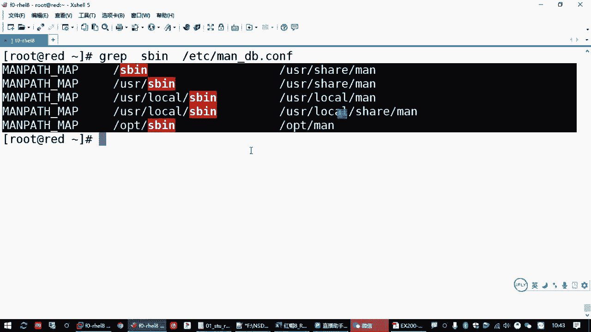

要验证结果，可以使用`cat`命令查看文件内容：
```bash
cat /root/output.txt
```

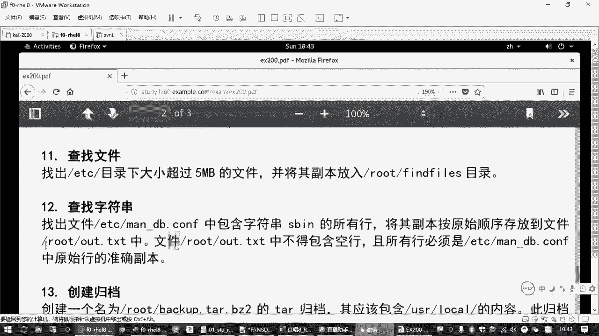

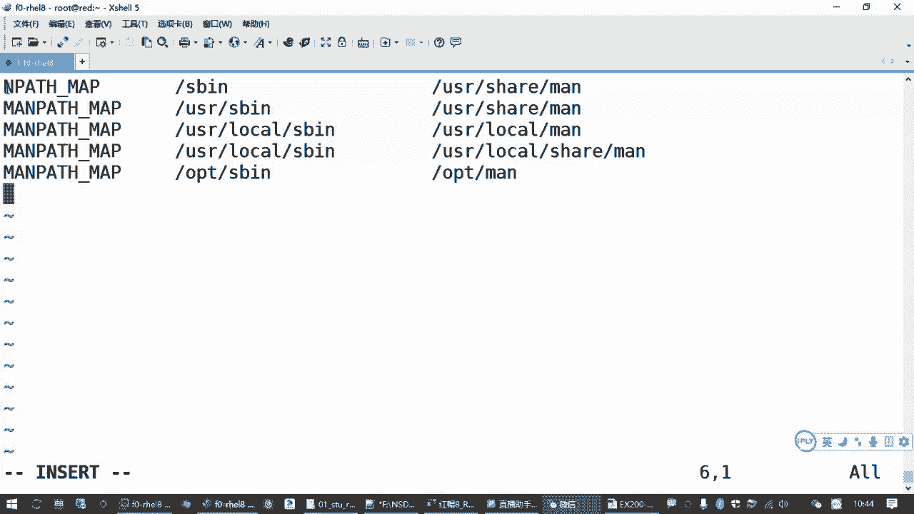

## 课程总结

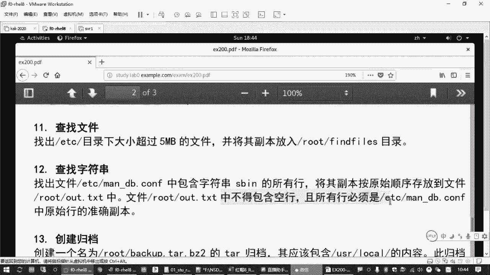

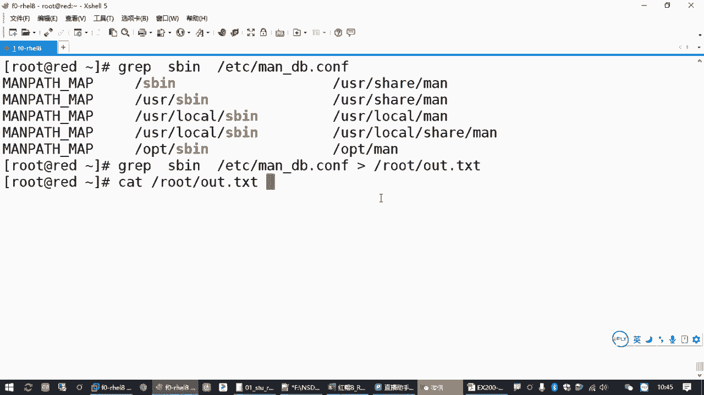

本节课中我们一起学习了Linux系统中两个强大的工具：`find`和`grep`。

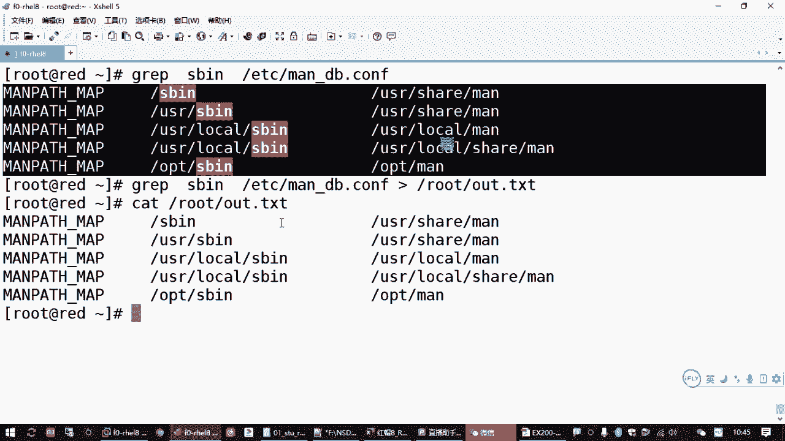

*   **`find`命令**：用于在目录树中查找文件，可以根据名称、类型、大小、时间等多种属性进行精确查找，并能通过`-exec`选项对找到的文件执行操作。
*   **`grep`命令**：用于在文本内容中进行模式匹配和过滤，可以从文件或命令输出中快速提取所需信息，并支持多种选项实现灵活搜索。

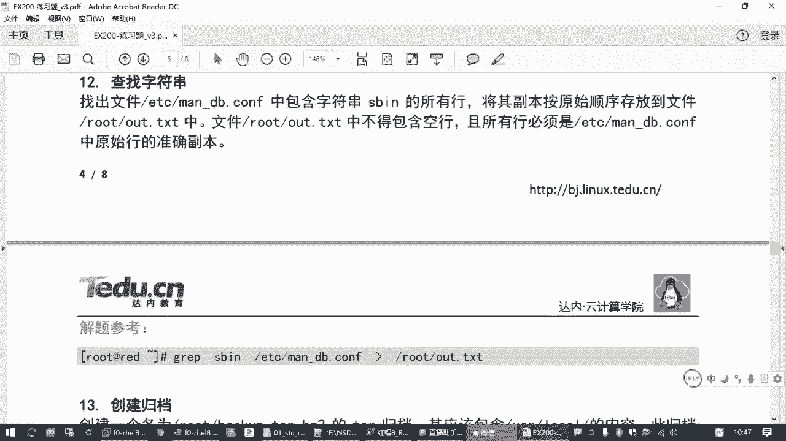

通过结合输出重定向（`>`），我们可以轻松地将命令结果保存到文件中。熟练掌握`find`和`grep`，将极大地提升你在Linux环境下的工作效率和问题排查能力。