# RHCE红帽认证全套入门教程：P19：3.05：重置root密码 🔑

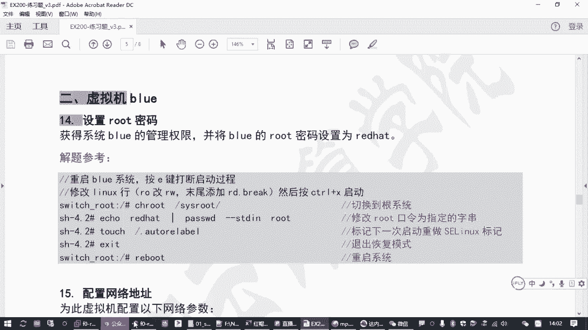

在本节课中，我们将学习如何重置红帽企业版Linux 8系统中忘记的root用户密码。这是系统管理员必须掌握的一项关键技能，尤其是在考试或紧急恢复场景下。我们将通过修改系统启动参数进入恢复模式，从而绕过密码验证并完成密码重置。

上一节我们介绍了基本的系统管理任务，本节中我们来看看如何在不知道当前密码的情况下，获取系统的管理员权限并重置root密码。

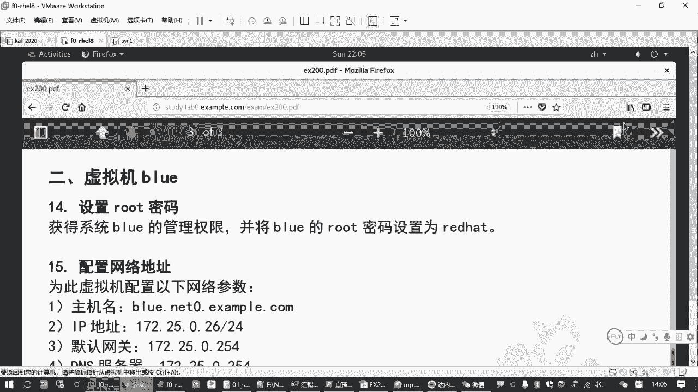

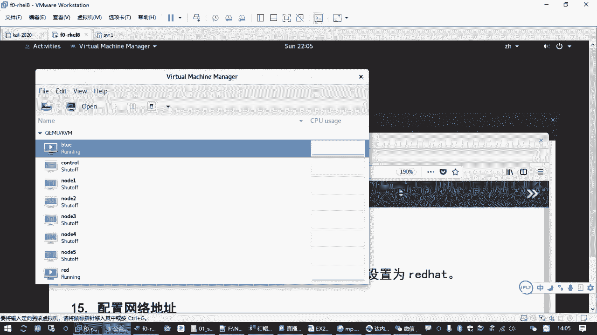

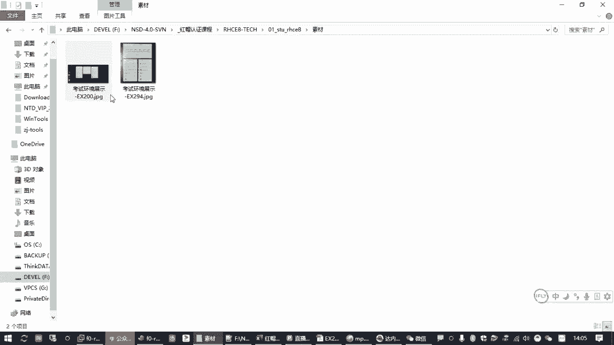

## 核心概念与操作流程

重置密码的核心在于中断正常的系统启动流程，进入一个特殊的恢复模式。在此模式下，系统不会要求输入密码，允许我们挂载并修改原始的系统文件。主要流程涉及以下关键步骤：

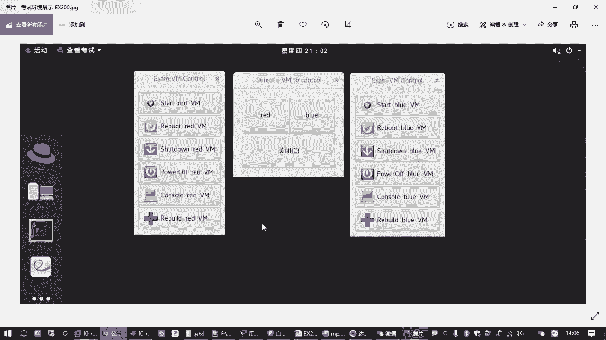

1.  **中断启动**：在系统启动初期，通过按键进入启动菜单。
2.  **修改内核参数**：编辑启动项，添加 `rd.break` 参数并修改根文件系统挂载方式。
3.  **切换根环境**：进入恢复模式后，将真实的系统根目录挂载并切换过去。
4.  **修改密码**：使用 `passwd` 命令更改root密码。
5.  **处理SELinux**：如果系统启用了SELinux，需要创建标记文件以在下次启动时重新标记安全上下文。

以下是详细的操作步骤。

## 详细操作步骤

### 第一步：重启并进入启动菜单

首先，确保目标虚拟机（例如 `blue`）处于关机状态。如果已开机，请先将其关闭。

```
# 在虚拟机控制界面执行关机操作
poweroff
```

关机后，立即启动虚拟机，并迅速点击打开其控制台（Console）。在启动画面出现时，快速**连续按两次 `e` 键**。
*   第一次按 `e` 键是为了显示被隐藏的启动菜单。
*   第二次按 `e` 键是为了编辑默认选中的启动项。

### 第二步：编辑内核启动参数

成功中断后，你会看到以 `linux` 开头的一行配置。使用方向键将光标移动到这一行。

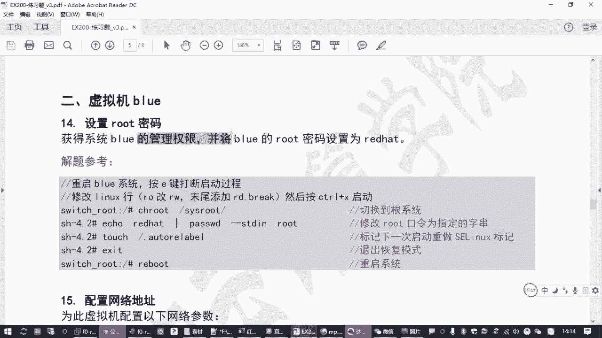

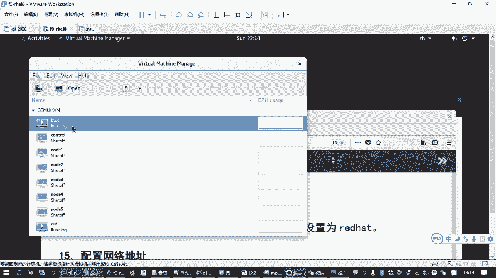

1.  找到该行中的 `ro`（read-only，只读）参数，将其修改为 `rw`（read-write，可读写）。
2.  将光标移动到行末，添加参数 `rd.break`。
    *   这个参数告诉内核在启动初期中断，进入一个临时的恢复Shell，从而绕过身份验证。

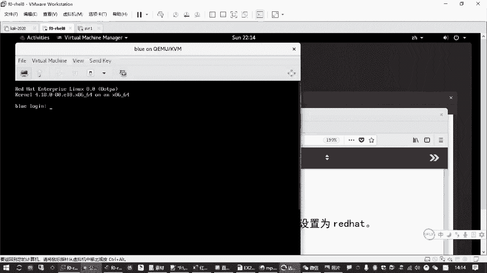

编辑完成后，按 `Ctrl+X` 组合键（根据屏幕提示）使用修改后的参数启动系统。

### 第三步：切换根环境并修改密码

系统将进入一个临时的恢复Shell，提示符类似 `switch_root:/#`。此时根文件系统是以只读方式挂载在 `/sysroot` 下的。

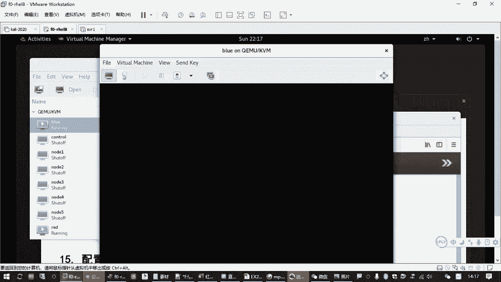

1.  重新以读写方式挂载 `/sysroot`：
    ```
    mount -o remount,rw /sysroot
    ```
2.  使用 `chroot` 命令切换到真实的系统根环境：
    ```
    chroot /sysroot
    ```
    执行后，提示符将变为 `sh-4.4#`。
3.  现在可以修改root密码了：
    ```
    passwd root
    ```
    根据提示输入两次新密码（例如 `redhat`）。

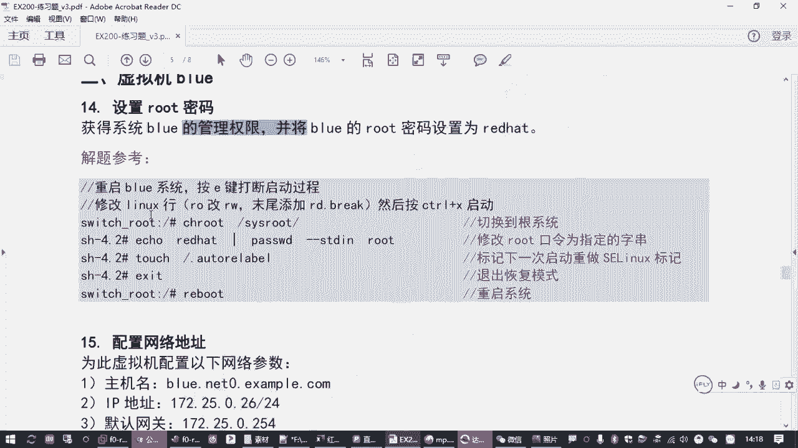

### 第四步：处理SELinux上下文（关键步骤）

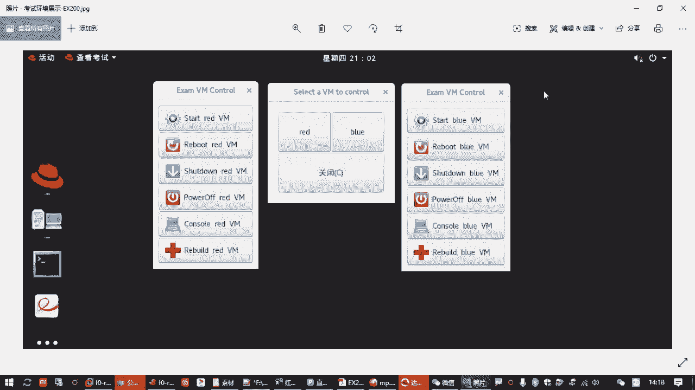

如果系统启用了SELinux（默认是启用的），直接重启会导致登录失败，因为SELinux检测到关键文件被修改，认为系统不安全。

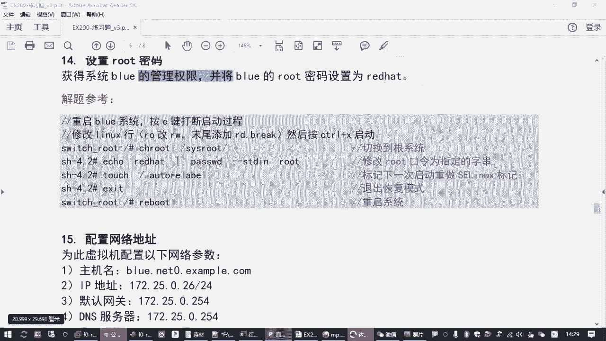

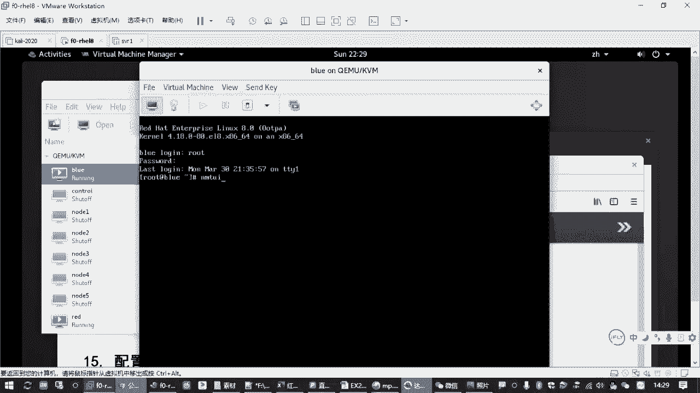

1.  在真实的根环境下，创建一个空文件作为标记：
    ```
    touch /.autorelabel
    ```
    这个文件告诉系统，在下次启动时自动重新为所有文件打上SELinux安全标签。

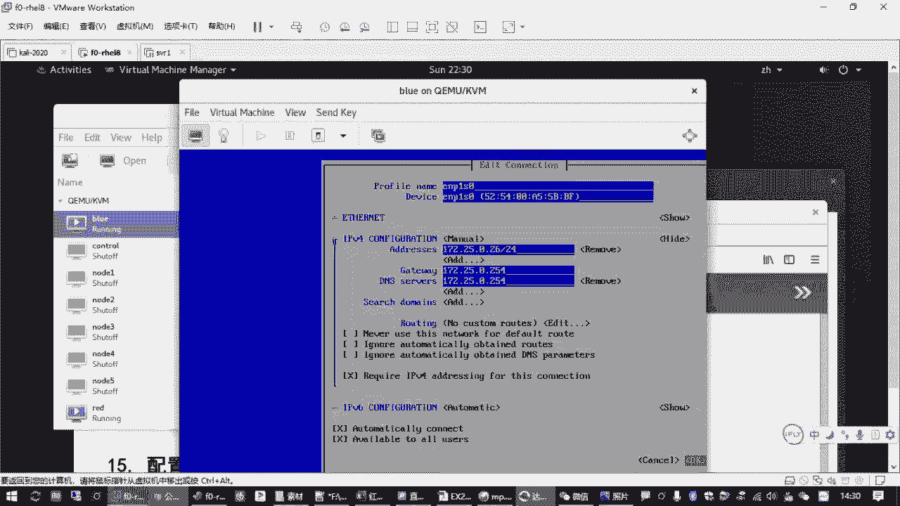

2.  退出 `chroot` 环境并重启系统：
    ```
    exit
    reboot
    ```

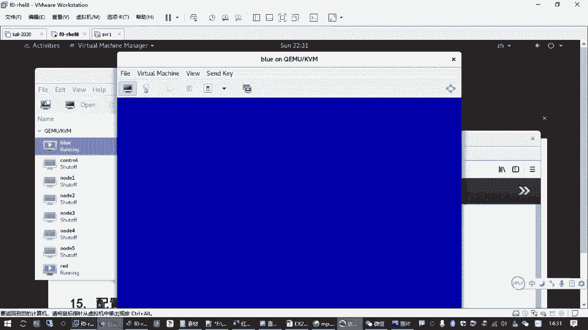

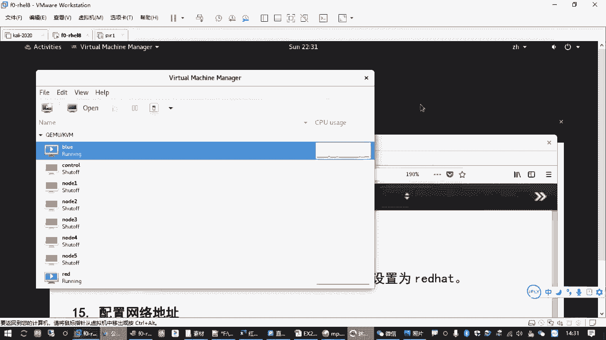

系统重启后，SELinux会进行完整的重新标记（这可能需要一些时间），之后你就可以使用新设置的root密码登录了。

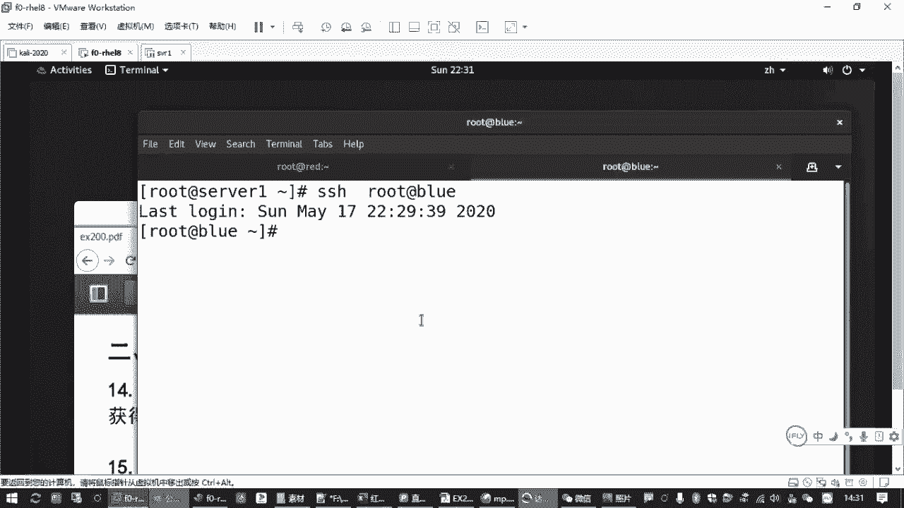

## 后续配置（示例）

成功登录 `blue` 虚拟机后，通常还需要完成一些基础配置，例如设置网络和Yum源。

*   **配置网络**：可以使用 `nmtui` 命令工具图形化配置IP地址、网关、DNS和主机名。
*   **配置Yum源**：可以从已配置好的另一台机器（如 `red`）直接拷贝配置文件，这是最高效的方法：
    ```
    # 在red机器上执行，将yum源文件拷贝到blue机器
    scp /etc/yum.repos.d/*.repo root@blue:/etc/yum.repos.d/
    ```
*   **安装常用工具**：配置好Yum源后，可以安装如 `vim-enhanced`、`bash-completion`、`nmtui` 等常用软件包。

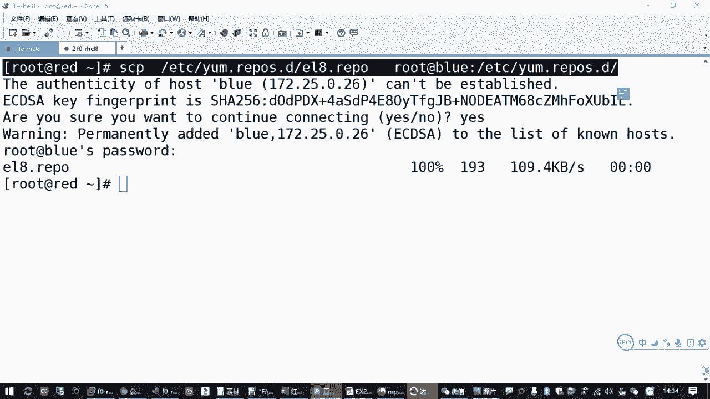

本节课中我们一起学习了在红帽Linux 8系统中重置root密码的完整流程。我们掌握了通过中断启动、修改内核参数进入恢复模式的方法，并理解了在启用SELinux的环境下必须创建 `/.autorelabel` 文件的重要性。这项技能是系统故障恢复和RHCE认证考试中的关键环节，请务必熟练掌握。