# 全网最全RHCE红帽认证全套入门教程：P23：3.09-RHCSA考前串讲

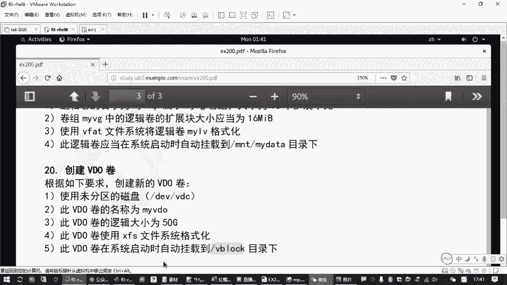

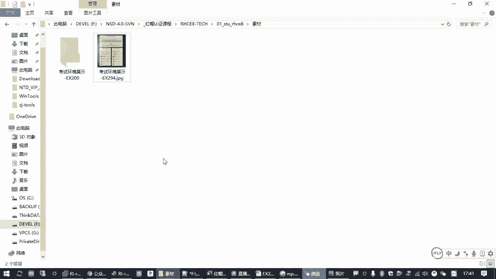

在本节课中，我们将对RHCSA认证考试进行全面的考前串讲，梳理考试环境、流程、注意事项以及核心题型的解题要点，帮助大家做好最后的准备。

## 考试环境与界面概览 🖥️

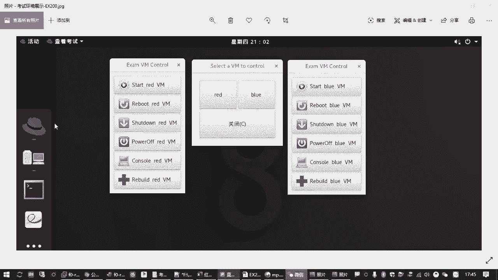

上一节我们介绍了RHCSA的各个知识点，本节中我们来看看考试的真实环境。每位考生会有一台真实的物理机作为考试终端。

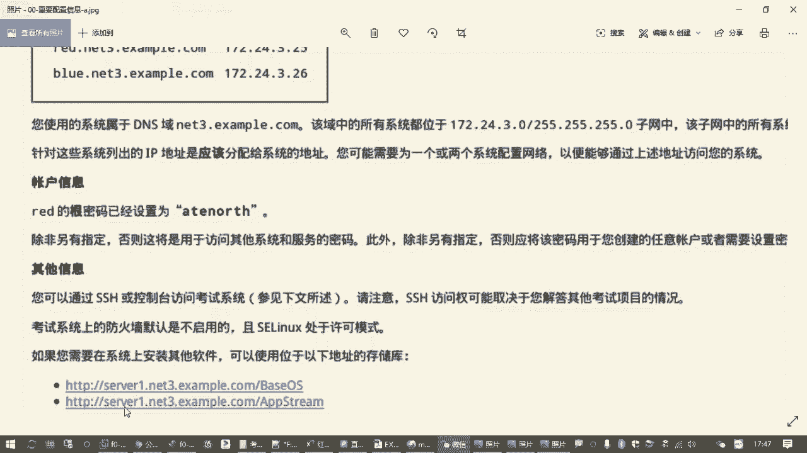

考试时，你登录物理机后看到的桌面界面如上图所示。在这个环境中，你几乎只需要使用以下三个图标：
*   **红帽图标**：点击查看详细的考试要求和说明。
*   **虚拟机控制器图标**：用于控制考试用的虚拟机（开机、关机、重启等）。
*   **终端图标**：用于打开命令行终端。

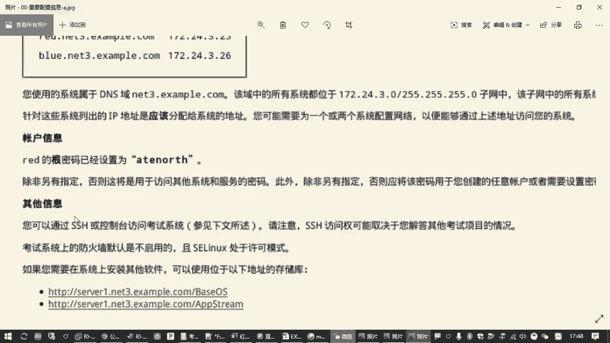

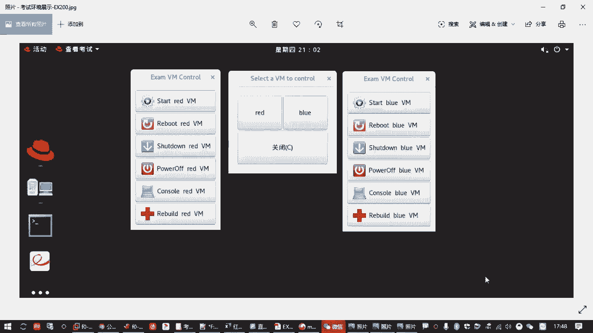

**注意**：在物理机桌面环境中，你是普通用户，没有管理员权限。所有与考试相关的操作都将在虚拟机中完成。

## 重要配置信息解读 📋

点击红帽图标后，会打开一个浏览器页面，其中包含“重要配置信息”部分。这是你答题的基础，必须仔细阅读。

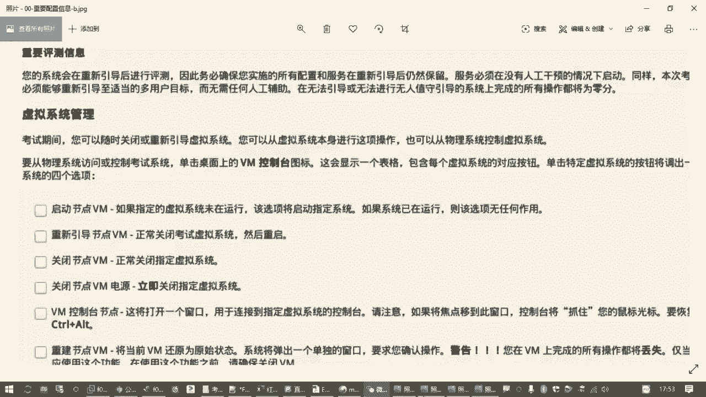

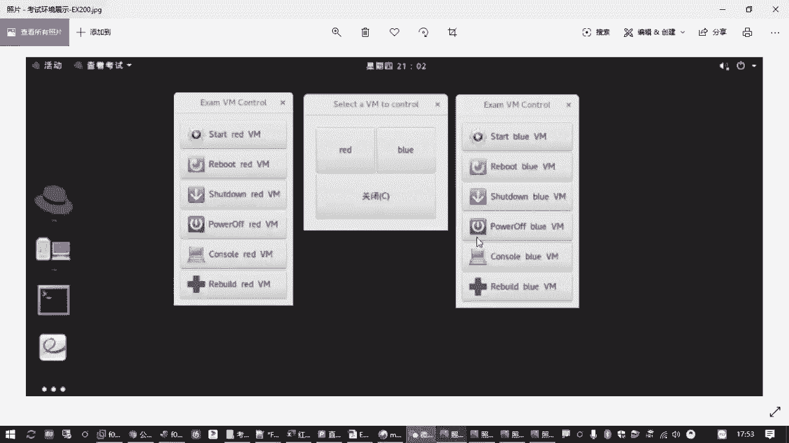

以下是关键信息点：
*   **虚拟机信息**：会明确告知你将使用几台虚拟机、它们的主机名和IP地址。**注意**：IP地址网段（例如`172.24.3.0/24`）和主机名（如`servera`, `serverb`）与练习环境不同，务必以考试信息为准。
*   **管理员密码**：会提供虚拟机的root密码。除非题目另有要求，否则此密码适用于所有需要root权限的操作。
*   **访问方式**：推荐使用SSH从物理机终端远程连接到虚拟机，这样可以方便地复制粘贴题目中的命令或路径。
*   **防火墙与SELinux**：考试系统防火墙默认不启用。SELinux状态不定，需根据题目要求处理。
*   **软件源**：信息中会提供软件包仓库的URL。**无论题目是否明确要求配置yum源，只要需要安装软件包，你就必须自行配置**。考试环境无法访问互联网，只能使用提供的软件源。

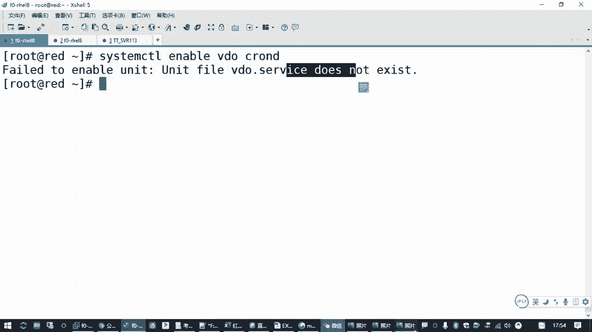

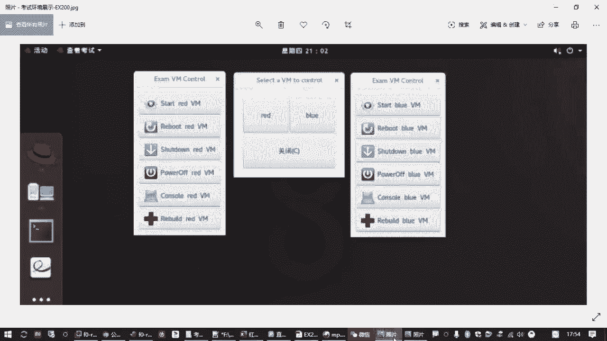

## 虚拟机管理与答题策略 ⚙️

通过虚拟机控制器，你可以对考试用的两台虚拟机进行管理。

控制器提供以下功能按钮：开机、重启、关机、强制关机、显示控制台、还原虚拟机。
*   **慎用“还原”**：除非虚拟机出现严重故障且时间充裕，否则不要轻易使用“还原”功能，因为它会将虚拟机重置到初始状态。
*   **答题顺序建议**：建议先完成可能影响系统启动的题目（例如：第二台虚拟机的分区、LVM、破解root密码等）。这样如果操作失误导致系统无法启动，还有时间利用“还原”功能重做。
*   **区分虚拟机**：题目会明确要求每道题在哪台虚拟机上完成。务必看清题目要求，避免在错误的机器上操作。

## 核心题型与解题要点 🔑

考试题目分为两大部分，分别对应两台虚拟机。以下是对核心难点的梳理：

**在第一台虚拟机上的难点：**
*   **SELinux排错**：这是相对复杂的题目。标准解题流程如下：
    1.  在SELinux强制模式下，启动服务（如`httpd`）会失败。
    2.  根据错误日志安装排错工具包：`yum install setroubleshoot-server -y`
    3.  再次尝试启动服务，系统会生成更详细的SELinux拒绝信息。
    4.  使用命令 `sealert -a /var/log/audit/audit.log` 分析日志，或直接根据错误信息提示执行修复命令（通常形如 `semanage port -a -t http_port_t -p tcp 82`）。

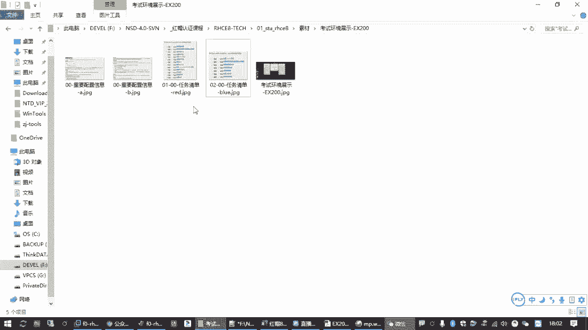

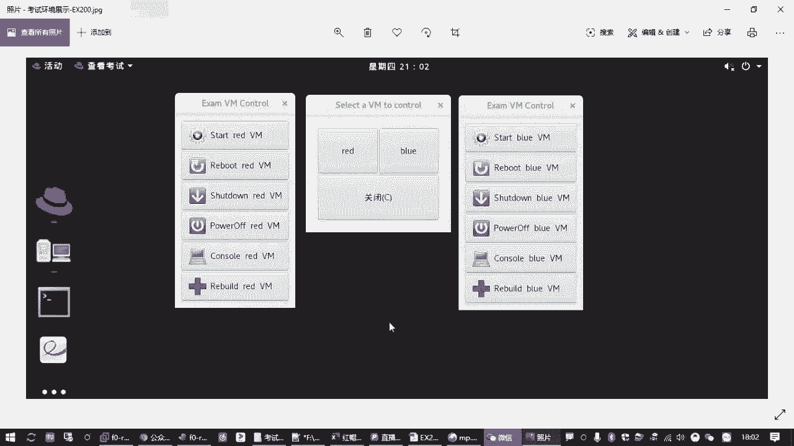

**在第二台虚拟机上的重点与难点：**
*   **破解Root密码**：必须熟练掌握。关键是在内核启动参数中加入 `rd.break`，然后通过 `chroot /sysroot` 切换根环境进行密码修改。
*   **磁盘分区与LVM**：操作需谨慎，避免破坏系统原有分区导致无法启动。
*   **配置VDO卷**：创建和格式化VDO卷后，在 `/etc/fstab` 中挂载时，必须添加 `,_netdev` 或 `x-systemd.requires=network-online.target` 参数，以确保网络就绪后再挂载。
*   **AutoFS自动挂载**：理解其工作原理是监控指定目录，当访问时自动挂载远程或本地设备。

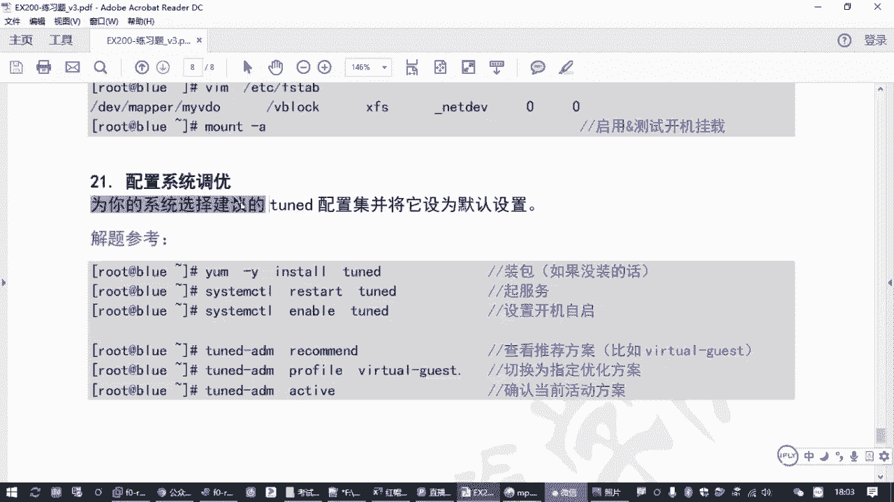

**通用重要原则：**
*   **配置持久化**：所有服务（如`httpd`、`VDO`挂载）都必须设置为开机自启（`systemctl enable`）。所有系统配置（如网络、yum源）必须在重启后依然有效。
*   **最终检查**：完成所有题目后，**务必手动将两台虚拟机关机，再重新启动**。然后通过SSH重新登录，逐项检查所有题目的要求是否在重启后依然满足。这是考试通过的关键。

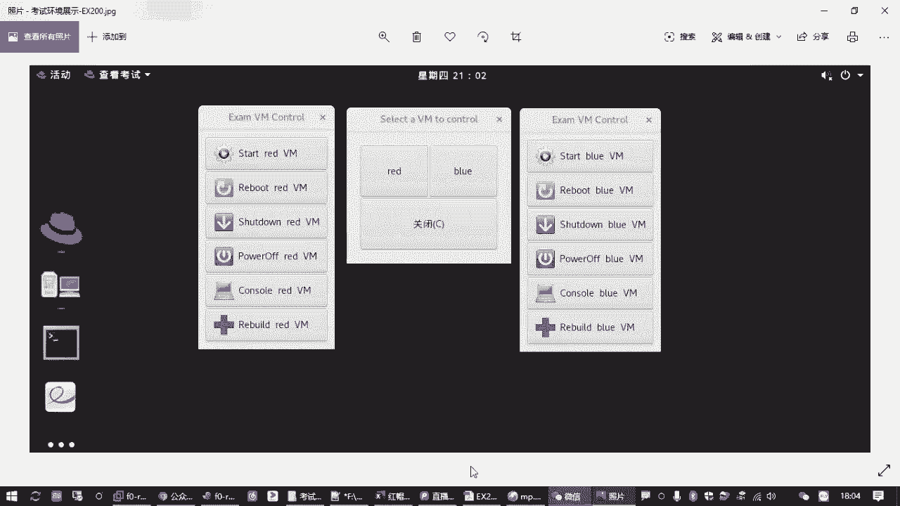

## 考试流程与考场纪律 📝

以下是考试当天的完整流程和注意事项：
1.  **考前**：携带身份证，考场会提供笔和草稿纸。手机、包、资料等不得带入考试区域。
2.  **考中**：仔细阅读“重要配置信息”和题目要求。合理分配时间（RHCSA部分共2.5小时）。题目界面有“完成”、“复查”勾选框，供自己标记进度。
3.  **交卷**：没有直接的“交卷”按钮。当你确认完成后，可以告知考官。考官会运行脚本收集你虚拟机上的答题结果进行评分。
4.  **考后**：草稿纸必须留在考场。离开后不得与任何人讨论考试内容，红帽对此有严格的保密规定，违者可能面临禁考处罚。

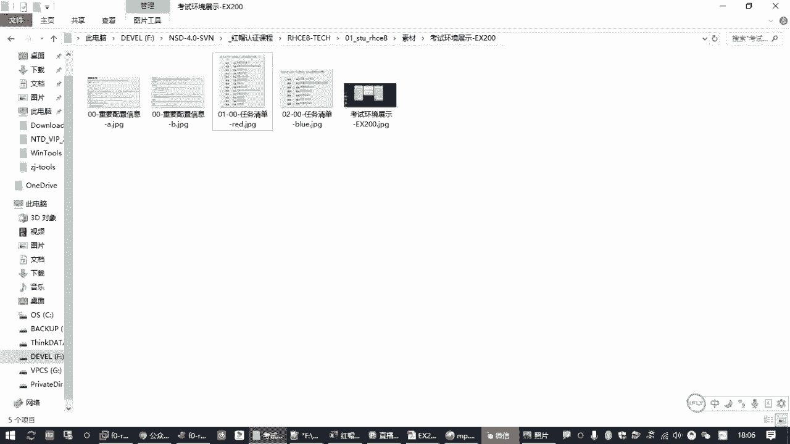

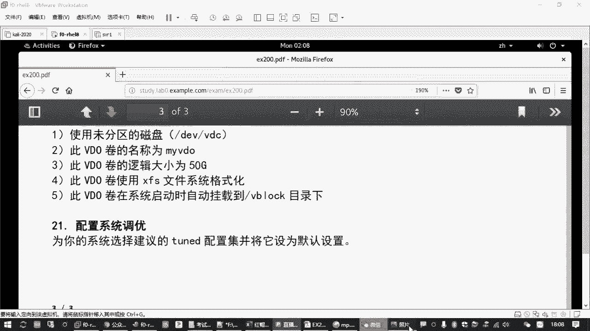

## 模拟考试与自我评测 🔍

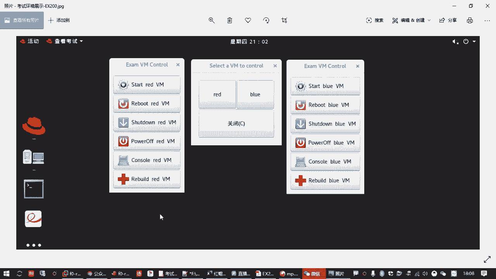

为了有效备考，可以进行模拟考试：
1.  使用练习环境，在不查看资料的情况下，严格按照题目要求完成所有操作。
2.  使用评测脚本检查结果。脚本文件通常名为 `RHT-lab-check-CSA`，运行后可以检查每道题的完成情况。
3.  目标：连续多次模拟，能在1小时内完成所有题目，且评测脚本显示全部为绿色对勾（通过）。

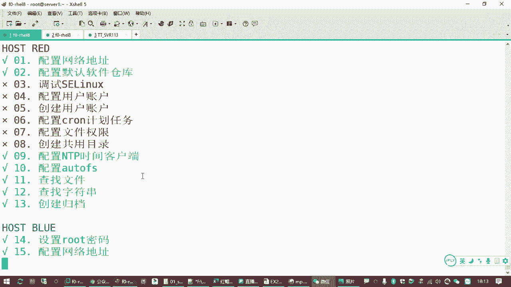

**成绩发布**：考试结束后约3个工作日（美国工作日），你会收到红帽官方发送的考试成绩邮件。

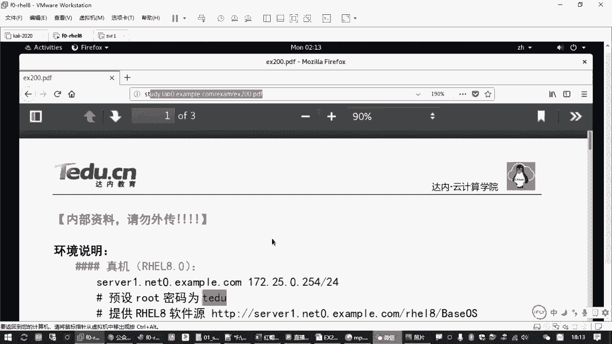

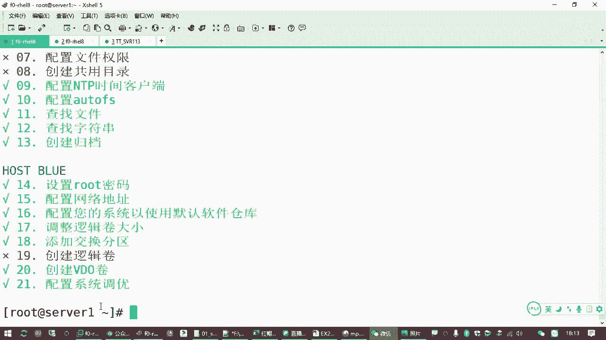

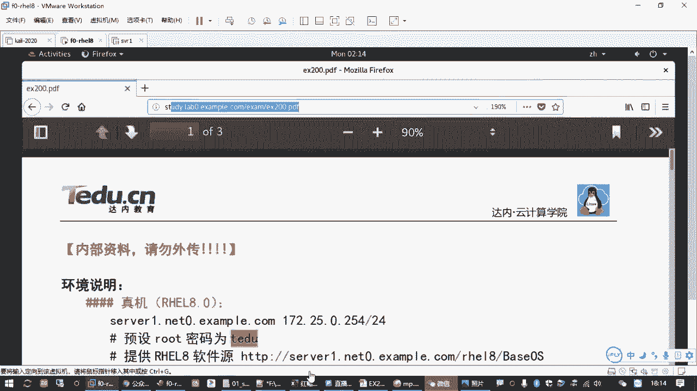

---

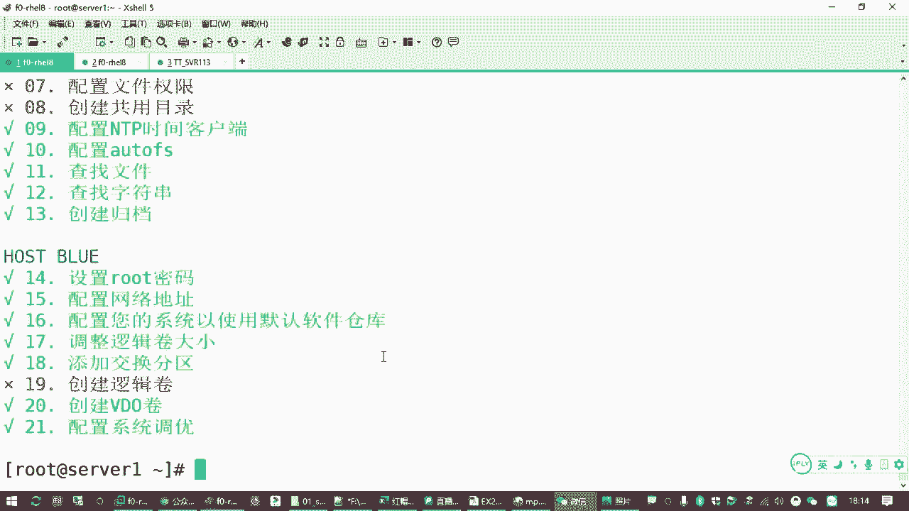

本节课中我们一起学习了RHCSA考试的完整流程、环境操作、核心题型解法以及重要的考场注意事项。请务必熟练操作可能影响系统启动的题目（如密码破解、分区），并牢记“配置持久化”和“重启验证”两大原则。预祝大家考试顺利！