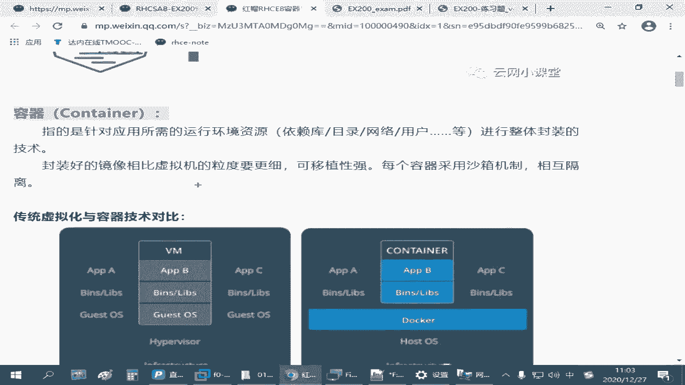
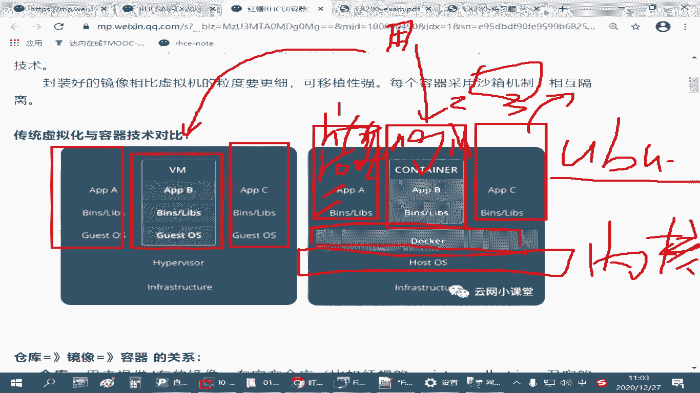
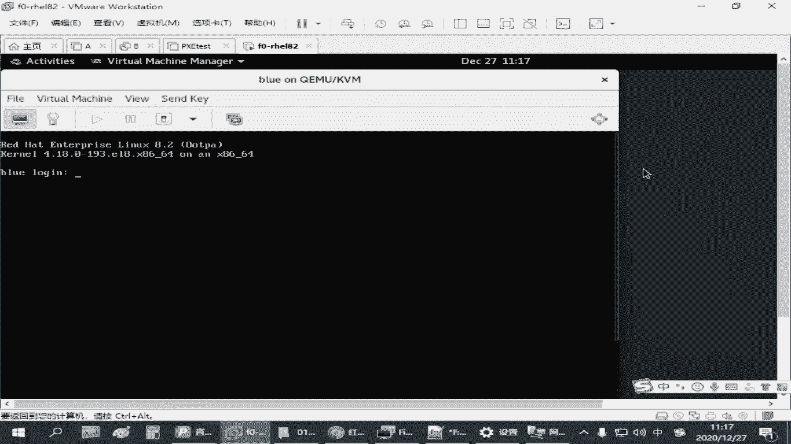

# 红帽认证RHCE入门教程：P24：4.01-容器技术介绍 🐳

在本节课中，我们将要学习容器技术的基本概念。容器是一种轻量级的应用封装和交付技术，它可以帮助我们更高效地部署和管理应用程序。我们将了解容器与虚拟机的区别、核心组件（镜像、容器、仓库）以及它们之间的关系。

## 容器技术概述

容器技术是红帽8系统中用于管理应用环境的核心工具。它使用 `podman` 作为管理工具，可以替代 `docker` 命令。大部分操作是兼容的，但 `podman` 功能更完整，执行效率更高。容器技术被整合到更高级的云架构中，如 OpenStack 和 Kubernetes，便于在云计算环境中进行迁移和部署。在 RHCE 考试中，主要考察单主机上的容器管理，核心命令是 `podman`。

`podman` 的名称来源于 “Pod”（豆荚）。一个 Pod 可以包含多个容器，就像一个豆荚包含多颗豆子。`podman` 就是管理这些“豆荚”的工具。

## 容器是什么？📦

容器是一种封装技术。它将某个应用运行所需的系统环境、依赖软件包、目录结构、网络配置、用户账号等资源封装为一个独立的单元。

为了便于理解，通常会将容器与虚拟机进行对比。

上一节我们介绍了容器的基本概念，本节中我们来看看它与虚拟机的具体区别。

以下是两者的核心对比：

*   **虚拟机**：提供完整的操作系统环境。每个虚拟机拥有独立的操作系统内核、软件包和配置。它运行在虚拟化平台之上，占用资源较多，但隔离性非常强。
*   **容器**：共享宿主机的操作系统内核。每个容器只封装应用及其直接依赖，如特定的软件包、函数库和配置文件。它更加轻量，启动更快，资源利用率更高。

两者的最终目标相同：为用户提供服务（例如，运行一个 Nginx 网站）。但容器通过共享底层内核，避免了重复的操作系统开销，从而实现了更高的密度和效率。

容器的封装粒度介于单个软件包和完整虚拟机之间。它比安装配置单个软件包更便捷，又比运行整个虚拟机更节省资源。这种设计简化了应用的交付和部署。

## 镜像与容器：静态与动态 🔄

理解了容器是什么之后，我们需要区分两个核心概念：**镜像**和**容器**。

*   **镜像**：是容器的**静态模板**。它包含了运行应用所需的所有文件系统内容和元数据，但处于静止、可存储和传输的状态。你可以将镜像理解为虚拟机的“安装光盘”或软件包的“rpm文件”。
*   **容器**：是镜像的**运行实例**。当镜像被加载并运行时，它就成为了一个容器。容器是动态的、可操作的实体，就像虚拟机开机后的状态。

简单来说：**镜像是蓝图，容器是根据蓝图建好并投入使用的房子**。要运行容器，必须先有对应的镜像。

## 仓库：镜像的来源 🗄️

既然运行容器需要镜像，那么镜像从哪里来呢？答案是通过**仓库**获取。

仓库是集中存储和分发镜像的服务器，有时也称为注册表。它的作用类似于 Linux 系统中的软件包仓库。

以下是常见的仓库类型：

*   **官方仓库**：例如红帽的 `registry.redhat.io`，提供经过认证的镜像，部分可能需要订阅。
*   **公共仓库**：例如 Docker 官方的 `docker.io`，拥有海量的开源应用镜像。`podman` 与 Docker 兼容，可以使用这些仓库。
*   **私有仓库**：企业或个人自行搭建的仓库，用于存储内部镜像。在考试或实验环境中，通常会提供一个内部仓库地址供学员使用。

镜像、容器、仓库三者的关系，可以通过下图清晰地展示：

以下是它们之间的关键操作：

*   **拉取**：从仓库下载镜像到本地。命令：`podman pull <镜像名>`
*   **运行**：基于本地镜像启动一个容器。命令：`podman run <镜像名>`
*   **导出**：将本地镜像保存为文件（如 `.tar` 格式），便于分享或备份。命令：`podman save`
*   **导入**：将镜像文件加载到本地镜像列表中。命令：`podman load`
*   **控制容器**：对运行中的容器执行启动、停止、重启等操作。命令：`podman start/stop/restart <容器名或ID>`

## 总结

本节课中我们一起学习了容器技术的基础知识。我们了解到容器是一种轻量级的应用封装方式，它通过共享宿主机内核，实现了比虚拟机更高的效率和密度。我们明确了三个核心概念：**镜像**是静态的模板，**容器**是动态的运行实例，而**仓库**是镜像的存储和分发中心。理解这三者的关系是掌握容器技术的关键。在接下来的课程中，我们将开始学习如何使用 `podman` 命令来具体操作这些组件。