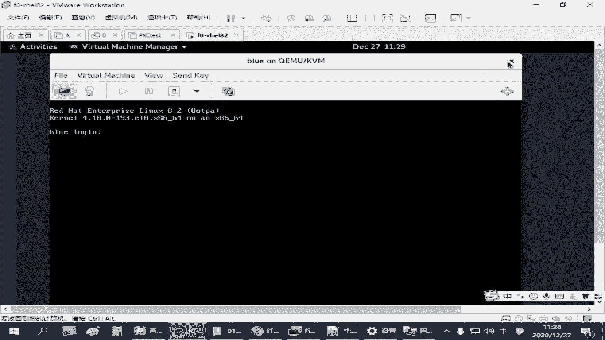
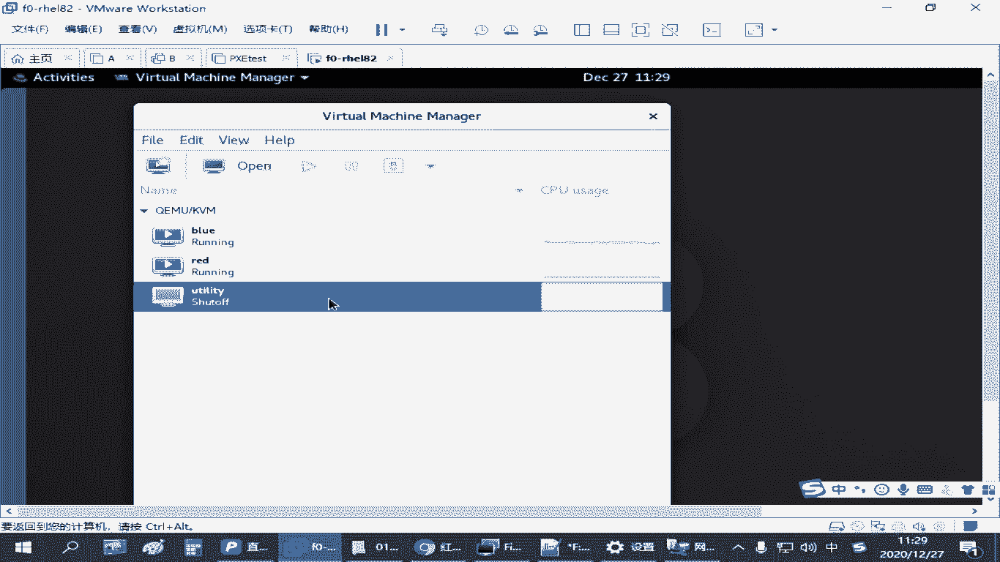
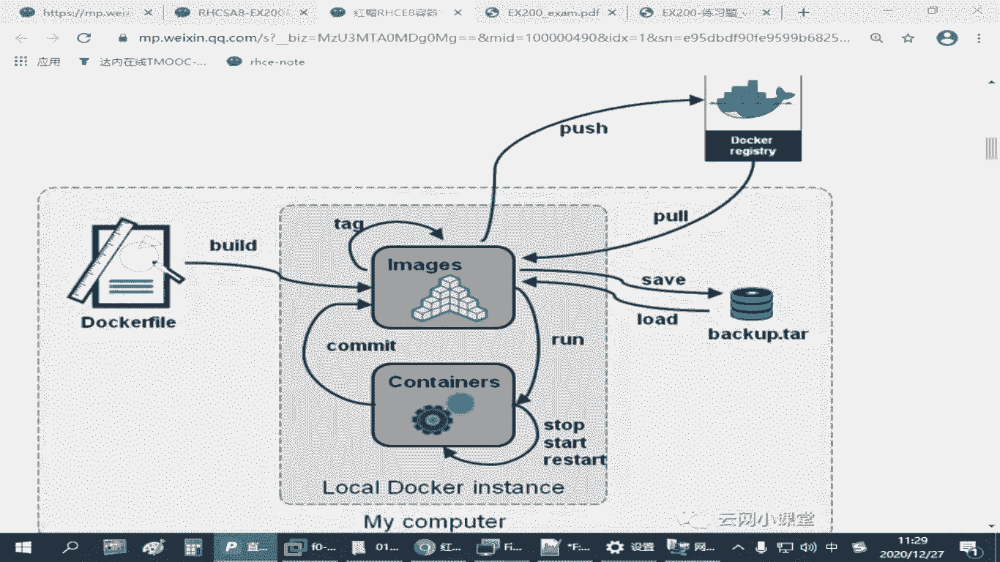
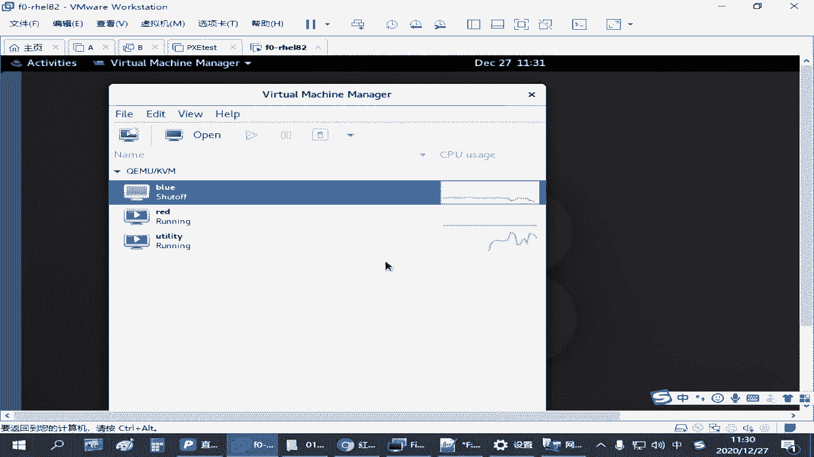
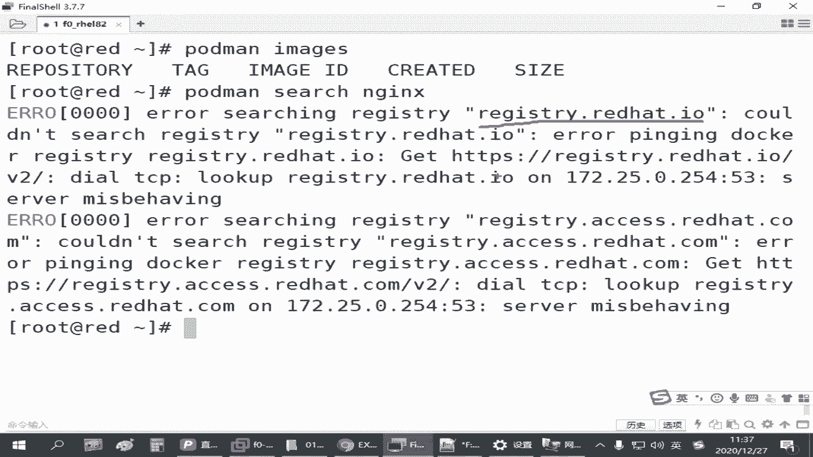
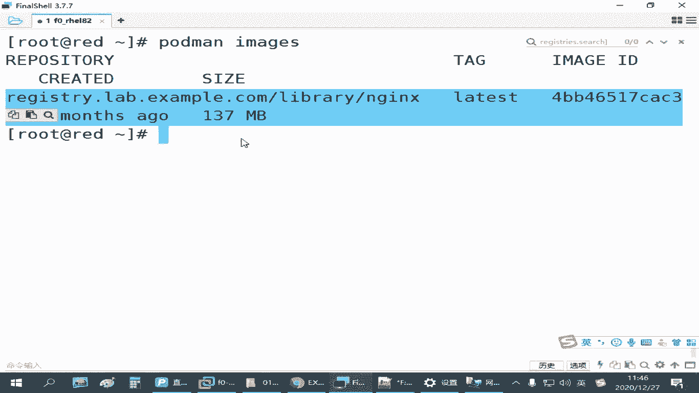

# RHCE红帽认证全套入门教程：P25：4.02-仓库环境配置 🛠️







在本节课中，我们将学习如何在红帽练习环境中配置和使用私有容器仓库。这是管理容器镜像的基础，也是后续容器操作的前提。

## 练习环境准备 🖥️



上一节我们介绍了容器的基础概念，本节中我们来看看如何配置仓库环境。在红帽练习环境中，已经为大家准备了一个名为 `uttt` 的虚拟机。这个虚拟机专门用于提供私有容器仓库服务，请不要删除或重置它。

这个虚拟机默认是关闭的，因为它会占用较多系统资源（约4GB以上）。当你需要练习容器相关操作或下载镜像时，才需要启动它。练习完成后，可以将其关闭以节省资源。如果您的物理机性能足够，可以忽略此建议。

## 配置容器主机 🔧

为了在红帽主机（例如 `red` 主机）上练习容器管理，我们需要先安装必要的软件包。首先，请确保您已正确配置了系统的YUM软件源。

以下是安装容器环境的命令：
```bash
yum module install -y container-tools
```
这个命令会安装容器工具模块及其相关依赖。如果您习惯使用Docker命令，还可以安装一个兼容工具（考试非必需）：
```bash
yum install -y podman-docker
```
但请注意，在RHCE考试中，我们主要使用 `podman` 命令。

## 连接私有仓库 🔗

安装好环境后，我们需要配置 `podman` 以连接我们自己的私有仓库，而不是默认的公共仓库。

首先，启动提供仓库服务的 `uttt` 虚拟机。然后，在练习主机上修改 `podman` 的仓库配置文件。




配置文件路径为：`/etc/containers/registries.conf`

您需要修改其中两个部分：

1.  **指定搜索仓库**：找到 `[registries.search]` 部分，将其中的仓库地址修改为练习环境提供的地址，例如 `registry.lab.example.com`。如果有多个地址，用引号括起来并用逗号分隔。
2.  **允许不安全仓库**：由于练习环境的仓库可能使用自签名证书，`podman` 默认会拒绝连接。找到 `[registries.insecure]` 部分，将仓库地址（例如 `registry.lab.example.com`）添加进去，以告知 `podman` 允许连接此不安全的仓库。

修改并保存配置文件后，`podman` 就能正确连接到我们的私有仓库了。

## 搜索与下载镜像 🔍

配置好仓库后，我们就可以搜索和下载镜像了。首先，使用 `podman images` 命令查看当前主机上已有的镜像，初始状态下应为空。

以下是管理镜像的核心操作：

*   **搜索镜像**：使用 `podman search` 命令。例如，搜索名为 `nginx` 的镜像：
    ```bash
    podman search nginx
    ```
    此命令会列出仓库中所有包含 `nginx` 关键词的镜像及其信息。

*   **下载镜像**：使用 `podman pull` 命令。下载时需要指定完整的镜像地址，格式通常为 `仓库地址/镜像名:标签`。例如，下载我们搜索到的 `nginx` 镜像：
    ```bash
    podman pull registry.lab.example.com/nginx:latest
    ```
    其中 `latest` 是标签（Tag），代表最新版本。

下载完成后，再次运行 `podman images`，就可以看到已下载的镜像列表。镜像会存储在系统的 `/var/lib/containers/` 目录下。

**关于镜像名称和标签**：
一个完整的镜像标识通常由仓库地址、镜像名和标签三部分组成，用 `/` 和 `:` 分隔。例如：`registry.lab.example.com/nginx:1.18`。标签用于区分同一镜像的不同版本，您可以在同一台主机上同时存在 `nginx:1.18` 和 `nginx:1.20` 等多个版本的镜像，这比传统的RPM包管理要灵活得多。

## 总结 📝



本节课中我们一起学习了容器仓库环境的配置。我们首先了解了练习环境中私有仓库虚拟机的用途与管理方法。然后，在练习主机上安装了 `container-tools` 模块，并修改了 `podman` 的配置文件，使其能够连接并信任我们的私有仓库。最后，我们掌握了使用 `podman search` 搜索镜像以及使用 `podman pull` 下载镜像的基本操作，并理解了镜像名称与标签的构成。这些是进行容器镜像管理的基础步骤，请务必熟练掌握。