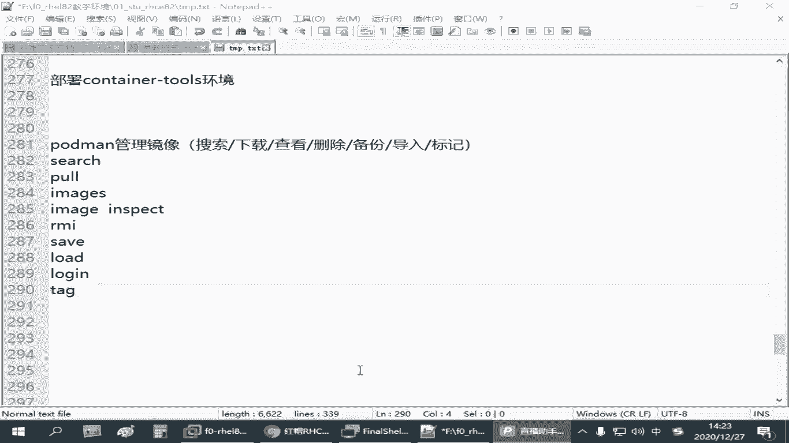
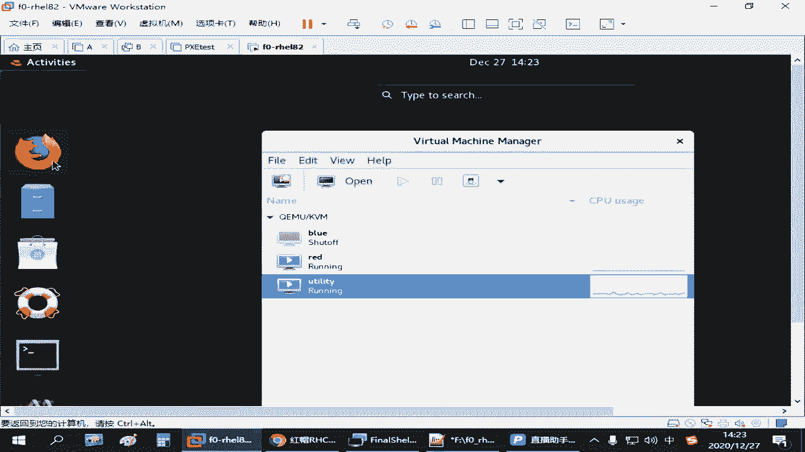
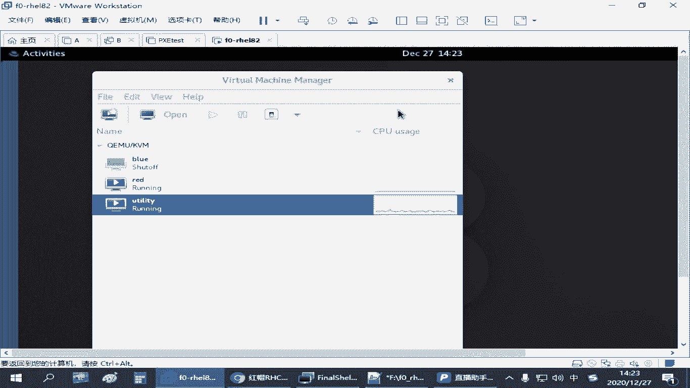
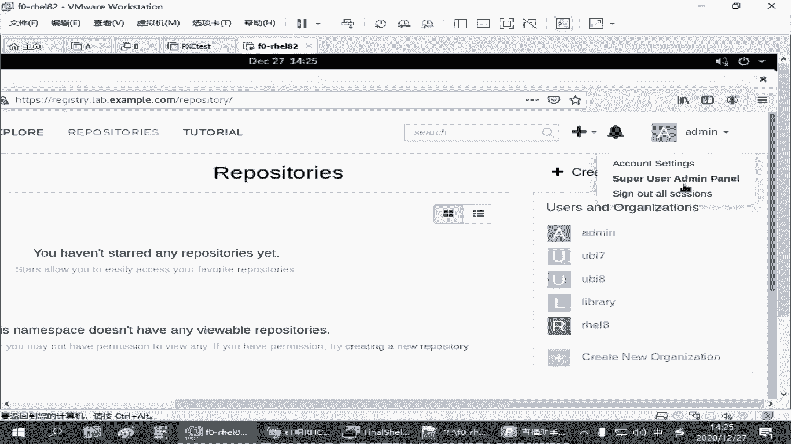

# Podman容器管理：4.03：Podman镜像操作 🖼️

在本节课中，我们将学习如何使用Podman管理容器镜像。我们将涵盖从搜索、下载、查看、删除到备份和导入镜像的全套操作，帮助你掌握容器镜像的基本管理技能。

---

## 镜像仓库登录 🔑

上一节我们介绍了Podman的基本概念，本节中我们来看看如何与镜像仓库进行交互。如果镜像仓库需要身份验证，则必须登录后才能进行上传或下载等操作。

登录镜像仓库的命令格式如下：
```bash
podman login [仓库地址]
```
执行命令后，系统会提示输入用户名和密码。例如，在练习环境中，用户名为`admin`，密码为`redhat321`。登录成功后，即可与仓库进行交互。如果仓库允许匿名下载，则此步骤并非必需。

---

## 搜索镜像 🔍

以下是搜索公共镜像仓库中可用镜像的方法。

使用`podman search`命令，后跟关键词，即可搜索相关镜像。
```bash
podman search nginx
```
该命令会列出所有包含关键词“nginx”的可用镜像。

---

## 下载镜像 ⬇️

搜索到所需镜像后，可以使用`podman pull`命令将其下载到本地环境。

下载镜像的命令格式如下：
```bash
podman pull registry.access.redhat.com/ubi8/nginx-120
```
此命令会从指定地址下载Nginx镜像。

---

## 列出本地镜像 📋

下载完成后，可以使用`podman images`命令查看本地已存在的所有镜像。

执行以下命令列出镜像：
```bash
podman images
```
该命令会显示镜像的名称、标签、ID、创建时间和大小等信息。

---

## 查看镜像详细信息 🔎

如果想查看某个镜像的详细配置信息，可以使用`podman image inspect`命令。

查看镜像详细信息的命令如下：
```bash
podman image inspect nginx
```
该命令会输出镜像的完整定义，包括其基于的操作系统、创建时间、环境变量等配置信息。

---

## 删除镜像 🗑️

当某个镜像不再需要时，可以使用`podman rmi`命令将其从本地删除。

删除镜像的命令格式如下：
```bash
podman rmi nginx:latest
```
为了准确删除，建议使用完整的镜像名称和标签。如果本地只有一个名为“nginx”的镜像，也可以简写为`podman rmi nginx`。

---

## 备份与导出镜像 💾

为了迁移或备份镜像，可以将其导出为一个压缩文件。

使用`podman save`命令将镜像导出：
```bash
podman save -o /root/nginx_backup.tar nginx:latest
```
此命令将名为`nginx:latest`的镜像保存到`/root/nginx_backup.tar`文件中。

---

## 导入镜像 📥

拥有镜像备份文件后，可以在其他环境中使用`podman load`命令将其导入。

导入镜像的命令如下：
```bash
podman load -i /root/nginx_backup.tar
```
导入时，可以为其指定新的名称和标签：
```bash
podman load -i /root/nginx_backup.tar nginx:new
```
如果导入的镜像层与现有镜像冲突，系统会提示跳过已存在的层。

---

## 修改镜像标签 🏷️



镜像下载或导入后，可以使用`podman tag`命令修改其名称和标签。



修改镜像标签的命令格式如下：
```bash
podman tag nginx:1.1 nginx-new:latest
```
此命令将镜像`nginx:1.1`重新标记为`nginx-new:latest`。修改后，使用`podman images`可以看到新的镜像条目。



---

## 通过Web界面访问仓库 🌐

除了命令行，还可以通过浏览器直接访问镜像仓库的Web界面进行查看和管理。

例如，访问`https://registry.lab.example.com`，使用相同的凭据（`admin`/`redhat321`）登录后，可以浏览所有可用的镜像。某些受保护的镜像可能需要额外授权才能访问。

---



本节课中我们一起学习了Podman镜像的核心管理操作，包括登录仓库、搜索、拉取、查看、删除、备份、导入以及修改镜像标签。掌握这些命令是有效管理容器化应用的基础。