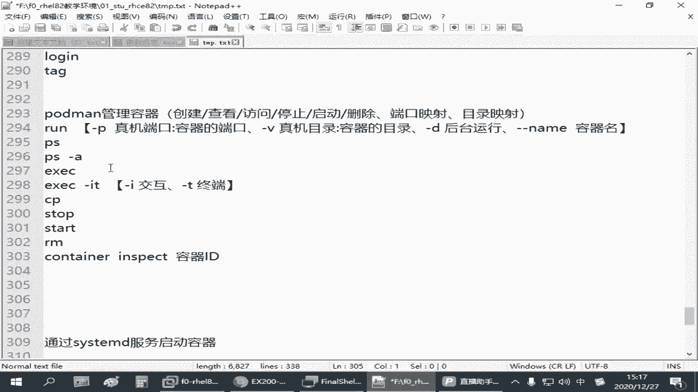
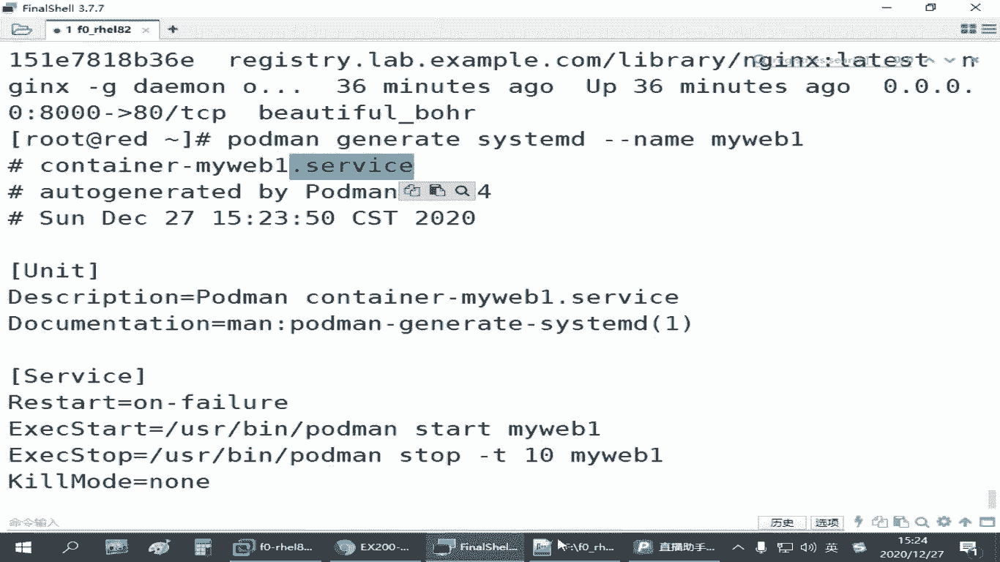
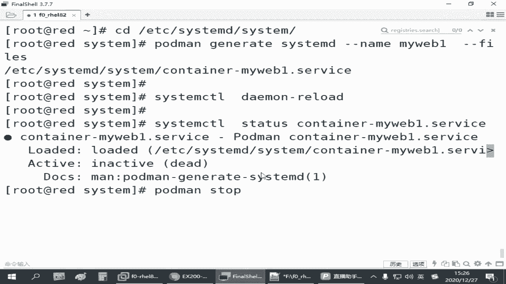

# 容器管理：4.05：容器服务化 🚀



在本节课中，我们将学习如何将手动运行的容器配置为系统服务，从而实现容器的开机自启动和便捷管理。

上一节我们介绍了容器的基本操作，包括从仓库拉取镜像、运行容器并提供服务。然而，手动运行的容器是临时的，主机重启后需要再次手动执行命令来启动，这在实际工作中非常不便。本节中我们来看看如何实现容器的“服务化”，使其能够像系统服务一样被管理和自动启动。

## 容器服务化的核心概念

将容器作为系统服务启动，主要涉及以下两个方面：
1.  **系统服务配置**：了解 Linux 系统中由 `systemd` 管理的服务配置文件存放位置。
2.  **配置生成与管理**：学习如何快速生成容器服务的配置文件，并启用该服务。

## 系统服务配置文件位置

Linux 系统中 `systemd` 服务的配置文件通常存放在两个主要目录：
*   `/usr/lib/systemd/system/`：存放系统预装服务的配置文件。
*   `/etc/systemd/system/`：**建议将管理员自定义的服务配置文件放在此目录**。

服务配置文件通常以 `.service` 作为后缀。我们需要在 `/etc/systemd/system/` 目录下为容器创建对应的 `.service` 配置文件。

## 生成容器服务配置

手动编写服务配置文件较为复杂。`podman` 提供了一个便捷命令，可以根据正在运行的容器自动生成服务配置。

以下是生成服务配置的步骤：


1.  **切换到目标目录**：首先进入自定义服务配置的存放目录。
    ```bash
    cd /etc/systemd/system/
    ```

2.  **生成配置文件**：使用 `podman generate systemd` 命令，基于一个已运行的容器来生成配置。`--name` 参数用于指定容器名，`--files` 参数表示将配置保存为文件。
    ```bash
    podman generate systemd --name myweb1 --files
    ```
    此命令会生成一个名为 `container-myweb1.service` 的配置文件。



## 启用并管理容器服务

生成配置文件后，需要通知系统重新加载配置，然后即可像管理其他系统服务一样管理该容器。

以下是启用和管理服务的步骤：

1.  **重新加载系统配置**：让 `systemd` 识别新添加的服务文件。
    ```bash
    systemctl daemon-reload
    ```



2.  **停止手动运行的容器**：**注意**，这里是停止(`stop`)，而非删除(`rm`)容器。如果删除，服务将找不到对应的容器。
    ```bash
    podman stop myweb1
    ```

3.  **通过服务启动容器**：使用 `systemctl` 命令来启动服务。
    ```bash
    systemctl start container-myweb1.service
    ```

4.  **设置开机自启**：启用服务，使其在系统启动时自动运行。
    ```bash
    systemctl enable container-myweb1.service
    ```

5.  **验证服务状态**：可以随时检查服务的运行状态。
    ```bash
    systemctl status container-myweb1.service
    ```

完成以上步骤后，即使主机重启，容器也会自动启动。你可以通过访问容器的服务端口（例如 `curl http://localhost:8001`）来验证服务是否正常运行。

## 总结


本节课中我们一起学习了如何将容器服务化。关键步骤包括：进入 `/etc/systemd/system/` 目录，使用 `podman generate systemd --name <容器名> --files` 命令生成服务配置文件，执行 `systemctl daemon-reload` 重载配置，最后通过 `systemctl` 系列命令来启动、启用和管理容器服务。这大大简化了容器在生产环境中的运维管理。