# 全网最全RHCE红帽认证全套入门教程：P29：4.06-rootless无根环境

## 概述
在本节课中，我们将要学习容器技术中的“rootless无根环境”。这个环境主要针对非root用户，探讨他们如何在没有管理员权限的情况下运行和管理容器，以及如何配置用户级别的系统服务。

---

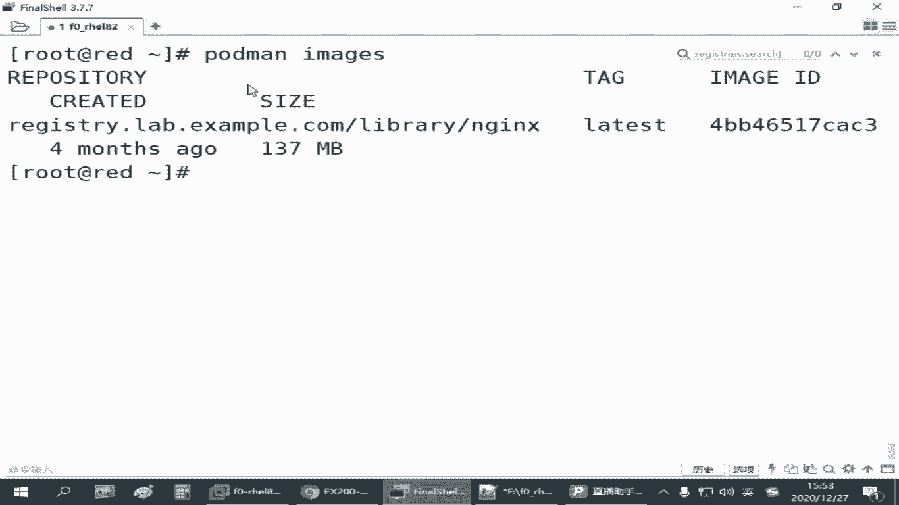

## 无根环境的核心概念
上一节我们介绍了管理员如何管理容器。本节中我们来看看普通用户如何操作。

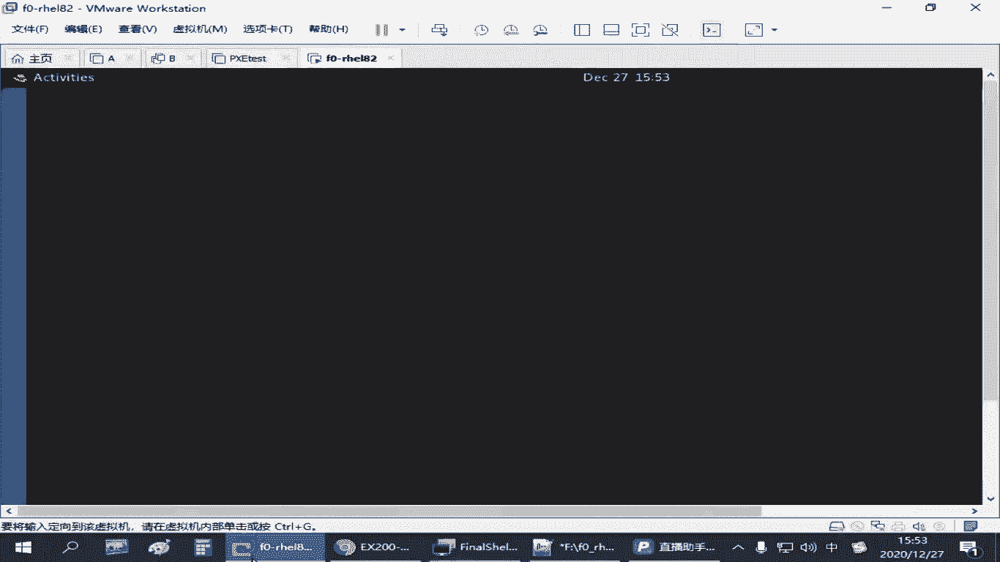

“rootless无根环境”指的是在没有管理员权限时，也能运行和管理容器。这主要针对非root用户，解决他们如何通过系统服务来启用和管理容器的问题。

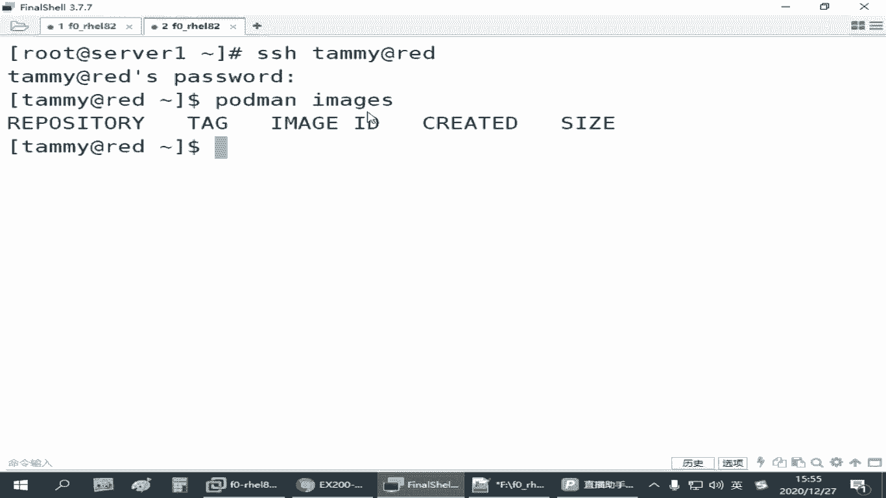

普通用户操作容器与管理员操作有一些区别。

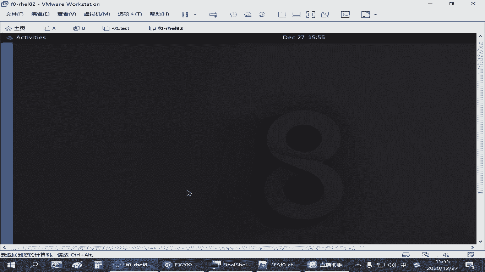


以下是主要区别点：
*   **端口限制**：普通用户默认只能开启1024以上的端口。1024以下的端口是系统保留范围。
*   **容器运行**：普通用户默认可以运行容器，因为容器设计为提供隔离环境。
*   **服务配置**：普通用户需要在自己的家目录下配置系统服务，路径是 `~/.config/systemd/user/`。
*   **服务隔离**：用户创建的系统服务与管理员创建的服务是隔离的，彼此不可见或无权管理。
*   **命令差异**：普通用户管理自己的服务时，需要在 `systemctl` 命令后加上 `--user` 参数。
*   **存储隔离**：用户的容器镜像和存储空间位于家目录下的 `~/.config/containers/`，与管理员的空间分开。

这意味着管理员下载的镜像（如nginx），普通用户无法直接使用，需要单独下载。

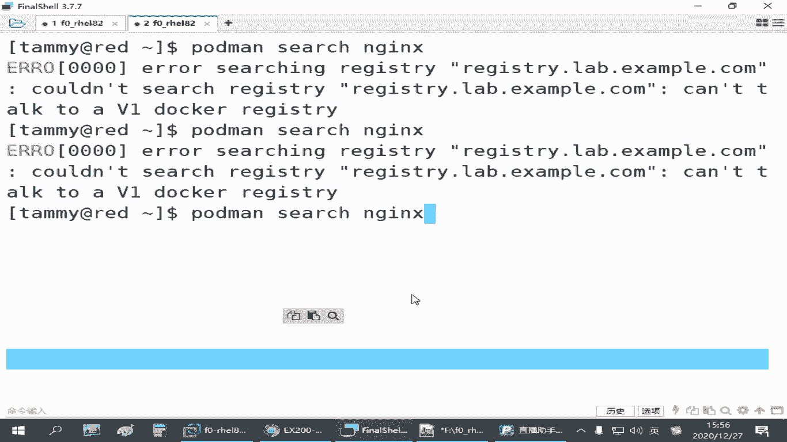

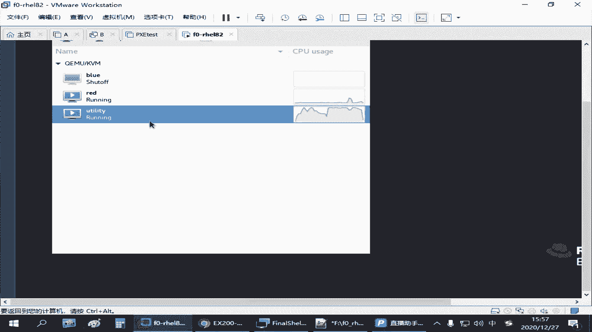


---

## 实践：配置普通用户的容器服务
上一节我们了解了概念区别，本节中我们通过实际操作来配置。

首先，需要以SSH方式直接登录到一个普通用户。使用 `su -` 切换用户的方式可能无法正确启用相关资源。

1.  **创建测试用户**：
    ```bash
    useradd tmy
    passwd tmy
    ```

2.  **登录并下载镜像**：
    以 `tmy` 用户身份登录后，需要从仓库下载镜像。这依赖于管理员配置的仓库源。
    ```bash
    podman search nginx
    podman pull nginx
    podman images
    ```

3.  **准备网页文件并运行容器**：
    ```bash
    mkdir ~/container-web-server
    echo "tmy's web" > ~/container-web-server/index.html
    podman run -d -p 8080:80 -v ~/container-web-server:/usr/share/nginx/html --name myweb3 nginx
    ```
    此时可以测试访问宿主机的8080端口，验证容器运行成功。

---

## 将容器转换为用户系统服务
容器运行成功后，我们来看看如何将其设置为系统服务，以便于管理。

普通用户的系统服务配置文件需放在特定目录下。

1.  **创建服务配置目录与文件**：
    ```bash
    mkdir -p ~/.config/systemd/user/
    cd ~/.config/systemd/user/
    podman generate systemd --name myweb3 --files
    ```

2.  **重新加载并启用服务**：
    操作普通用户的服务必须加上 `--user` 参数。
    ```bash
    systemctl --user daemon-reload
    systemctl --user stop myweb3
    systemctl --user start myweb3
    ```
    再次测试8080端口，服务应正常运行。

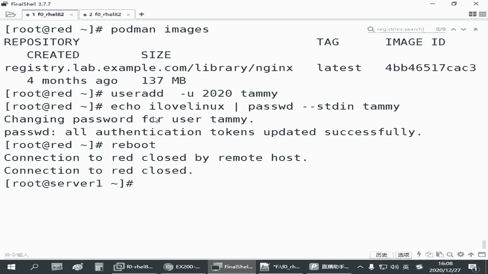

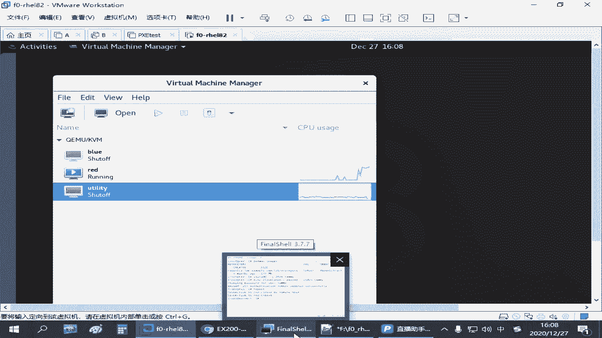

3.  **设置开机自启的挑战**：
    与管理员服务不同，仅使用 `enable` 可能无法让普通用户的服务在开机后自动运行，因为用户可能未登录。
    *   **方法一（官方）：启用 linger（逗留）**
        ```bash
        sudo loginctl enable-linger tmy
        sudo loginctl show-user tmy | grep Linger
        ```
        若输出 `Linger=yes` 则表示已为用户启用。但此方法在某些环境下可能不生效。
    *   **方法二（备用）：通过计划任务启动**
        如果上述方法无效，可以为用户添加一个开机执行的计划任务。
        ```bash
        crontab -e
        ```
        在编辑器中添加以下行：
        ```
        @reboot /usr/bin/systemctl --user restart myweb3.service
        ```
        这条命令会在每次系统启动时，以该用户的身份执行服务重启操作。

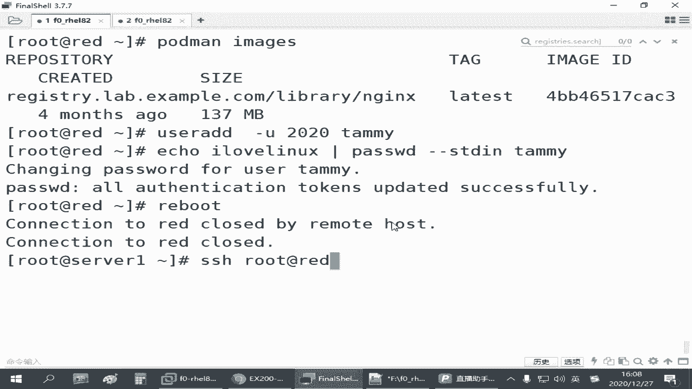

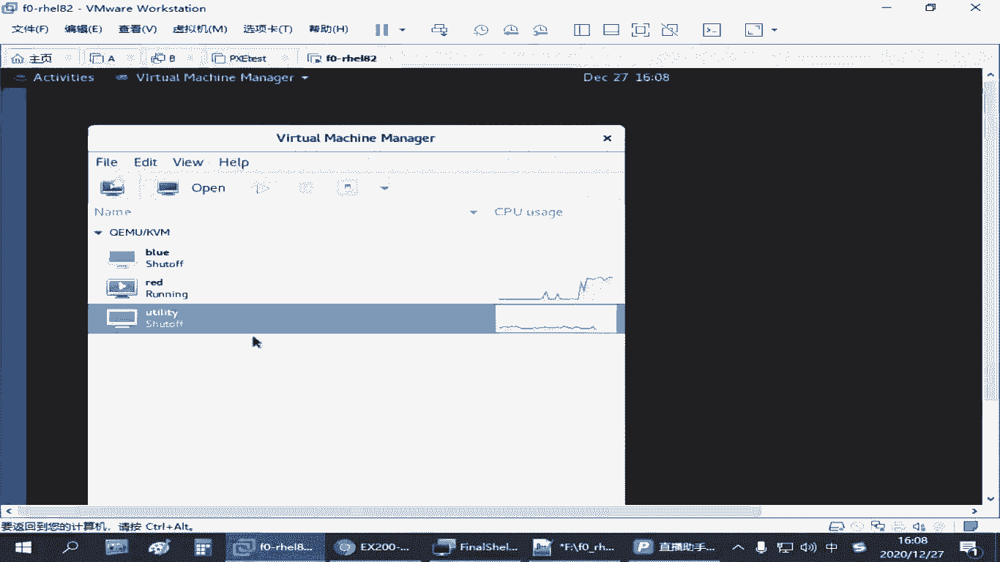

---

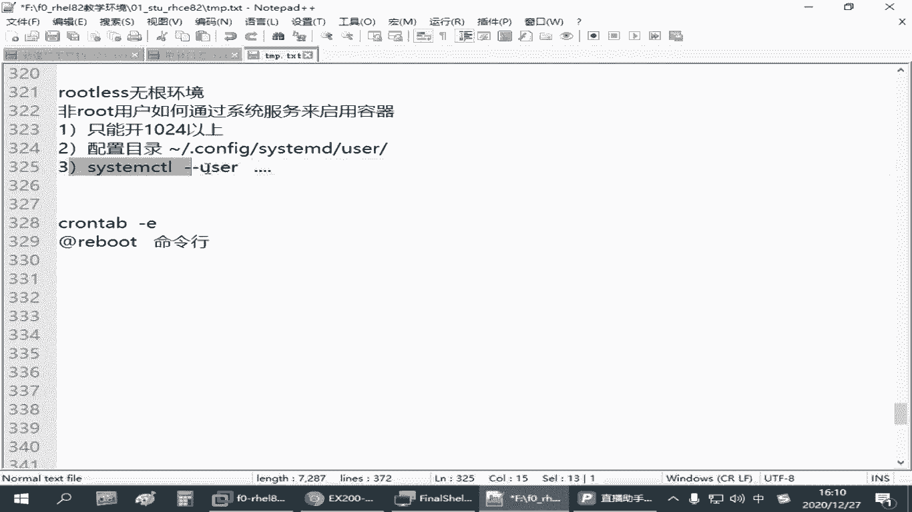

## 总结
本节课中我们一起学习了“rootless无根环境”的配置与管理。关键点在于理解普通用户与管理员在操作容器和系统服务时的路径、命令及权限差异。核心步骤包括：在用户家目录下创建服务配置、使用 `systemctl --user` 管理服务、以及通过启用 `linger` 或配置计划任务来实现用户服务的开机自启。掌握这些内容，你就能在非root权限下有效地运行和维护容器服务了。