# RHCE红帽认证全套入门教程：P2：1.01-Linux命令基础

在本节课中，我们将要学习Linux命令行的基础知识。这是后续所有学习的基础，掌握这些概念和基本操作，能帮助你更顺利地理解和使用Linux系统。

## 命令行概述

上一节我们介绍了课程的整体结构，本节中我们来看看Linux命令行的基本概念。命令行是管理员输入的一串字符，用于完成特定的系统任务。例如，输入 `ip address list` 可以查看网络接口的IP地址信息。

为了让Linux系统能“听懂”我们输入的字符，需要一个特殊的程序来翻译，这个程序就是**解释器**，通常被称为**Shell**。Shell是包裹在Linux内核外的一层“外壳”，负责将用户能理解的命令（如 `ls`）翻译成内核能理解和执行的二进制指令。

Linux系统的核心是**内核**，它负责管理CPU、内存、磁盘等硬件资源。Shell作为用户与内核之间的桥梁，使得我们无需直接与复杂的二进制指令打交道。

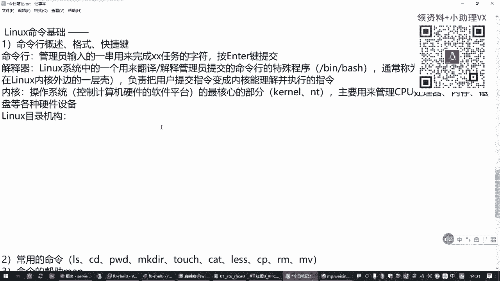

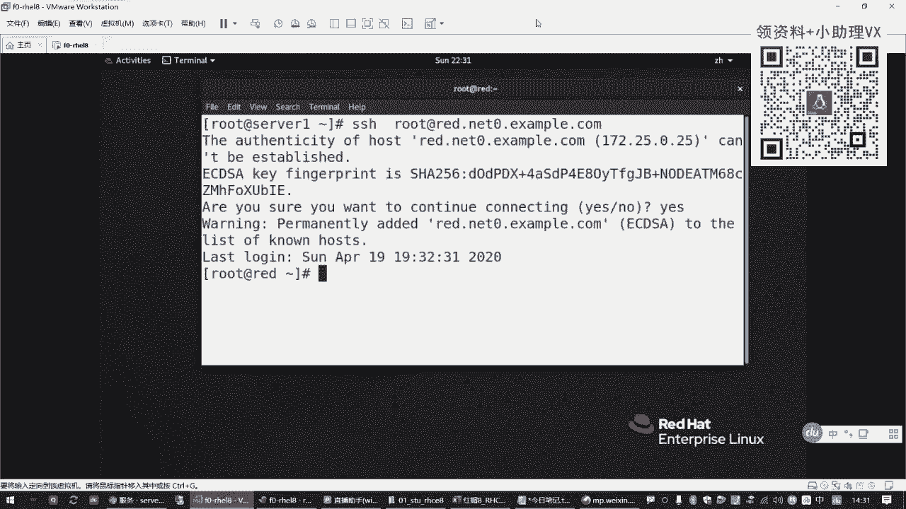

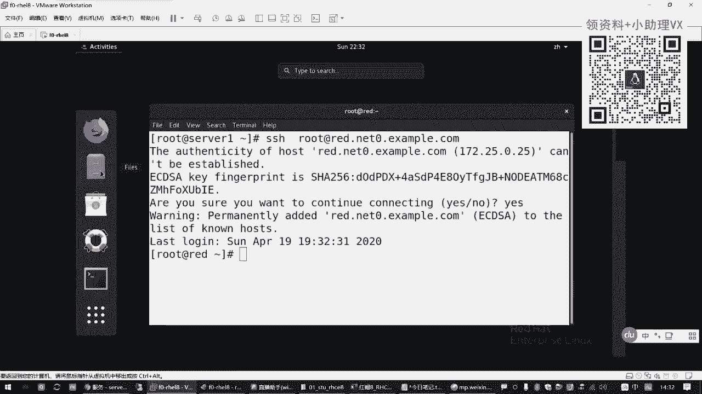

## Linux目录结构

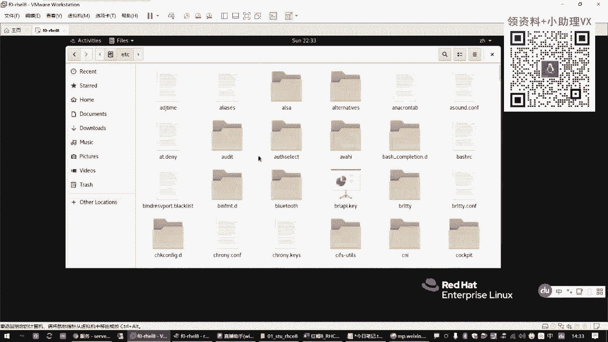


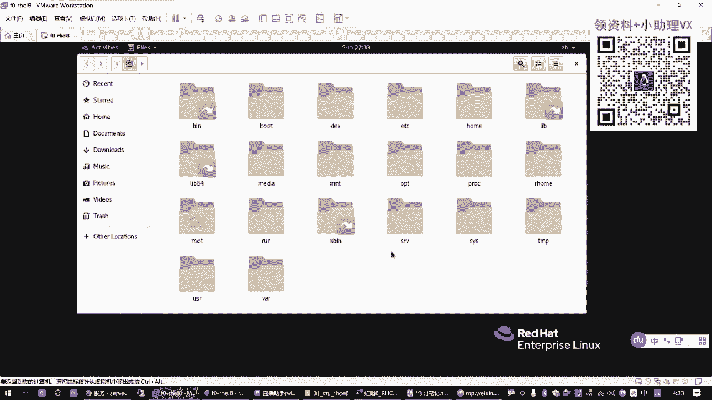

理解了命令如何被解释后，我们需要了解命令操作的对象——文件和目录。Linux的目录结构采用树形层次结构，与Windows类似，但表示方式不同。

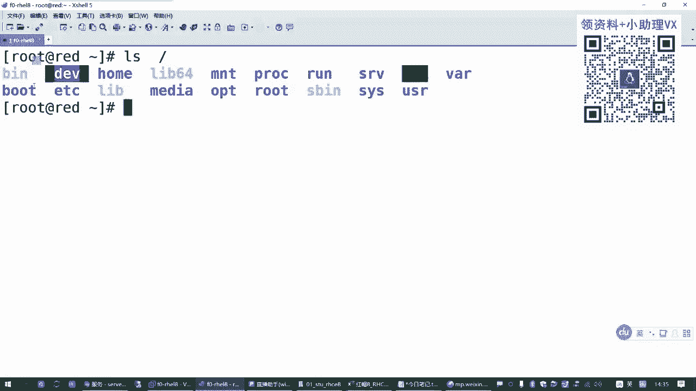


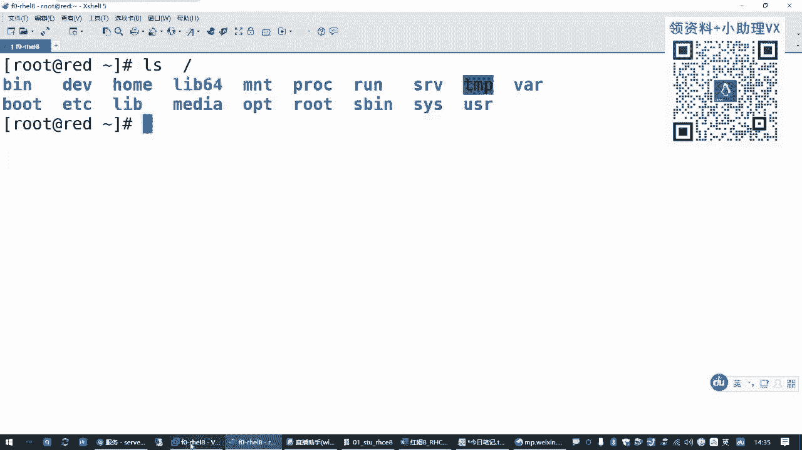

在Linux中，路径层次使用**斜杠（/）** 进行分隔。最顶层的目录称为**根目录**，用一个单独的斜杠（`/`）表示。所有其他目录和文件都位于根目录之下。

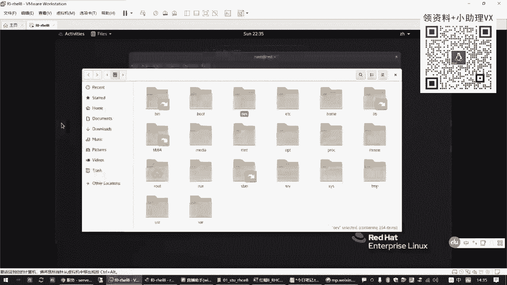

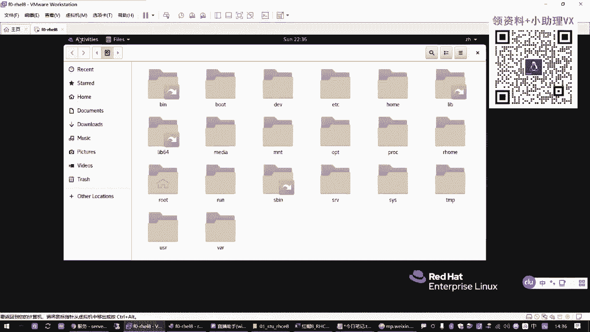

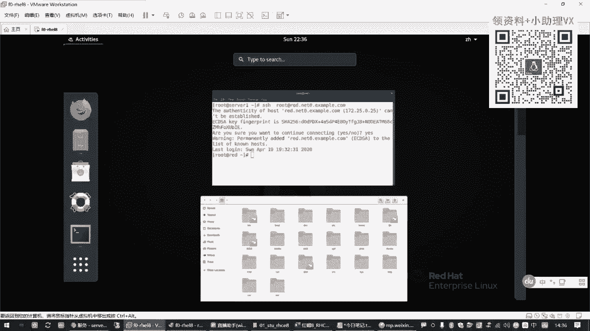

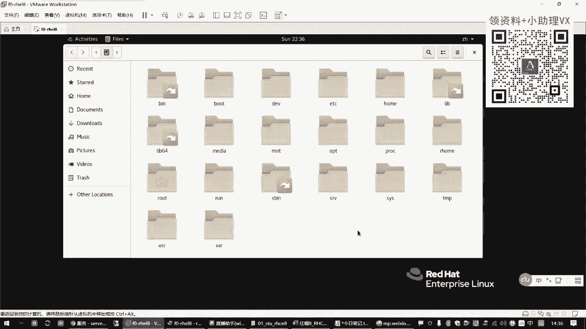


以下是Linux系统中一些常见的一级目录及其用途：

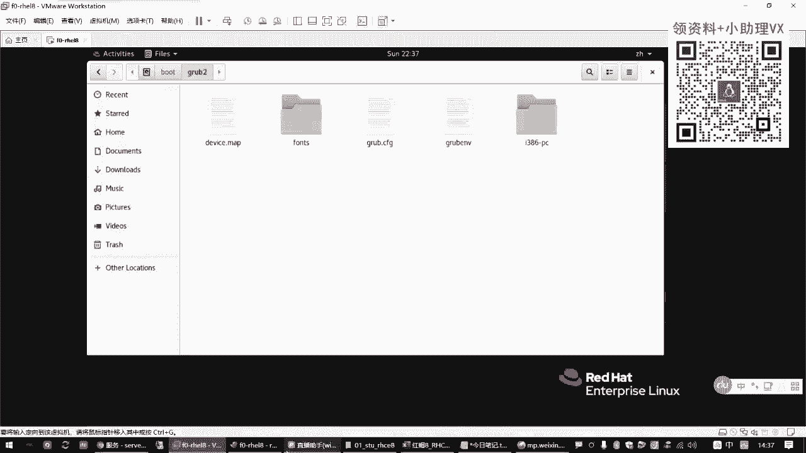

*   **`/bin`** 与 **`/sbin`**：存放可执行的程序文件。`/sbin`下的程序通常需要管理员权限才能执行。
*   **`/dev`**：存放设备文件，代表系统中的各种硬件设备（如磁盘、光盘）。
*   **`/home`**：存放普通用户的主目录。例如，用户`zhangsan`的主目录通常是 `/home/zhangsan`。
*   **`/root`**：系统管理员（root用户）的主目录。
*   **`/boot`**：存放系统启动所需的文件（如内核）。切勿随意删除此目录。
*   **`/etc`**：存放系统的各种配置文件。
*   **`/tmp`** 与 **`/var`**：`/tmp`存放临时文件；`/var`存放经常变化的数据，如系统日志、邮件等。
*   **`/mnt`** 与 **`/media`**：用于手动或自动挂载外部存储设备（如U盘、光盘）的目录。

## 命令行的基本格式

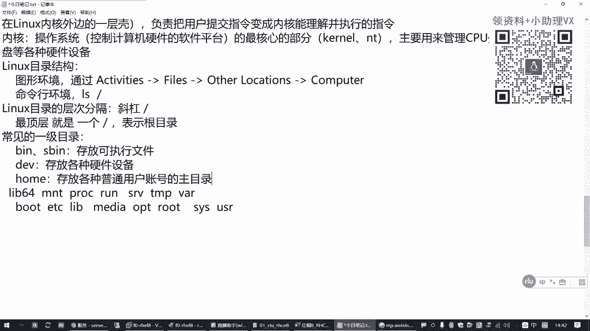

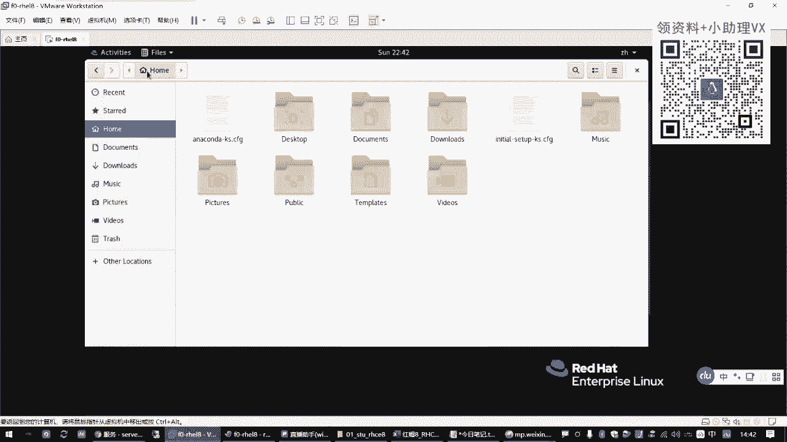

了解了操作环境后，我们来看看命令本身如何书写。一条完整的Linux命令通常遵循以下基本格式：

```
命令字 [选项] [参数]
```

*   **命令字**：必须存在，指要执行的操作，如 `ls`（列出目录内容）。
*   **选项**：用于控制命令的执行方式和效果，通常以短横线（`-`）开头，后跟一个字母。多个单字母选项可以合并，例如 `-l -h` 可以写成 `-lh`。
*   **参数**：命令操作的对象，通常是文件或目录的路径。

**示例：**
*   `ls`：仅列出当前目录下的文件名。
*   `ls -l`：使用长格式列出当前目录下文件的详细属性。
*   `ls -lh /home`：以人类易读的格式（如KB、MB）列出 `/home` 目录下文件的详细属性。

## 常用快捷键

熟练使用快捷键可以极大提高命令行操作效率。以下是几个最常用的快捷键：

*   **Tab键**：命令/路径自动补全。输入命令或路径的前几个字符后按Tab，系统会自动补全或列出所有可能的选择。
*   **Ctrl + c**：中断当前正在运行的任务。
*   **Ctrl + l** 或 **`clear`命令**：清空当前终端屏幕。
*   **Esc + .**：快速粘贴上一条命令的最后一个参数。

## 总结


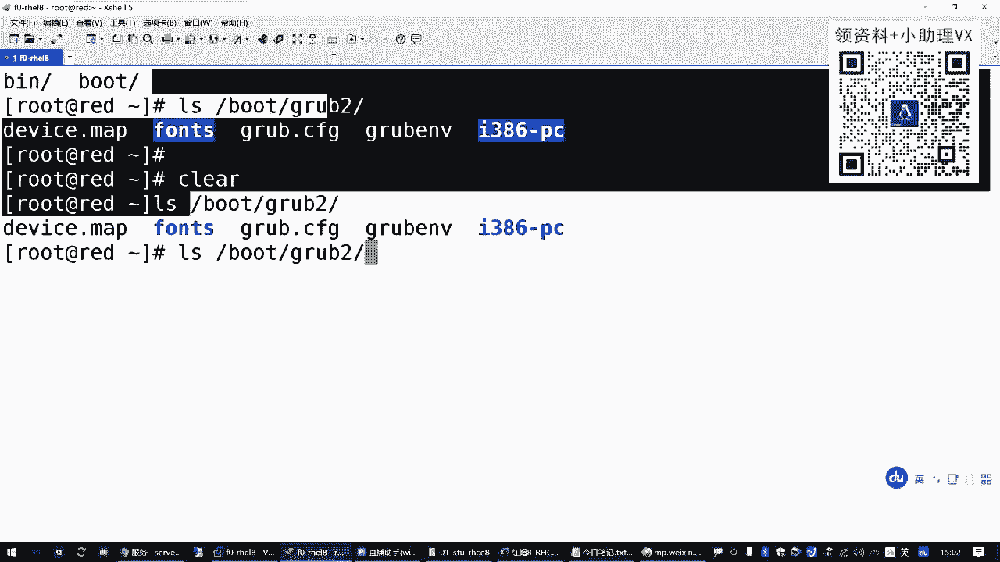

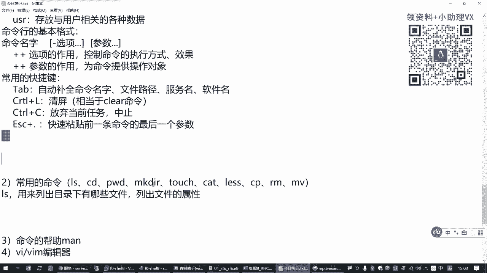

本节课中我们一起学习了Linux命令行的基础。我们首先了解了命令行、Shell解释器和内核之间的关系。然后，我们熟悉了Linux的树形目录结构及其常见的一级目录。接着，我们掌握了命令行“命令字 [选项] [参数]”的基本格式。最后，我们学习了几种能提升操作效率的常用快捷键。这些知识是后续深入学习更复杂命令和系统管理的基础。