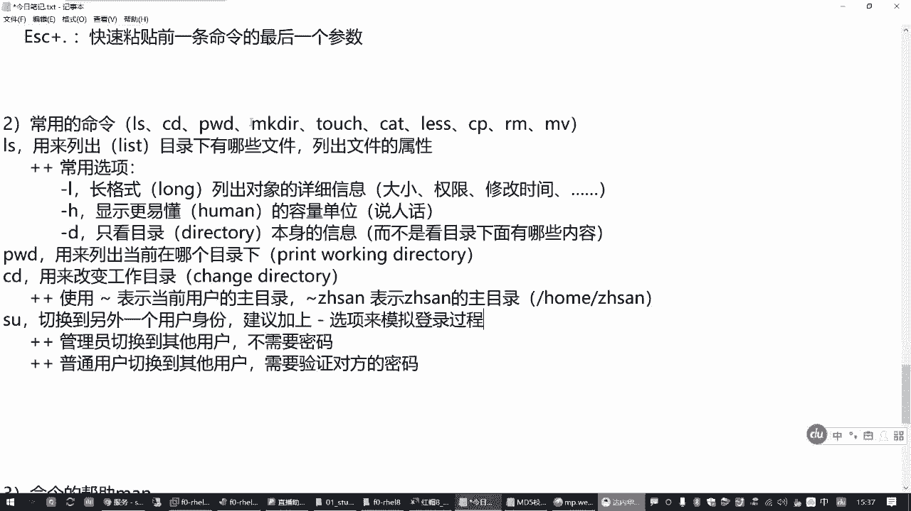
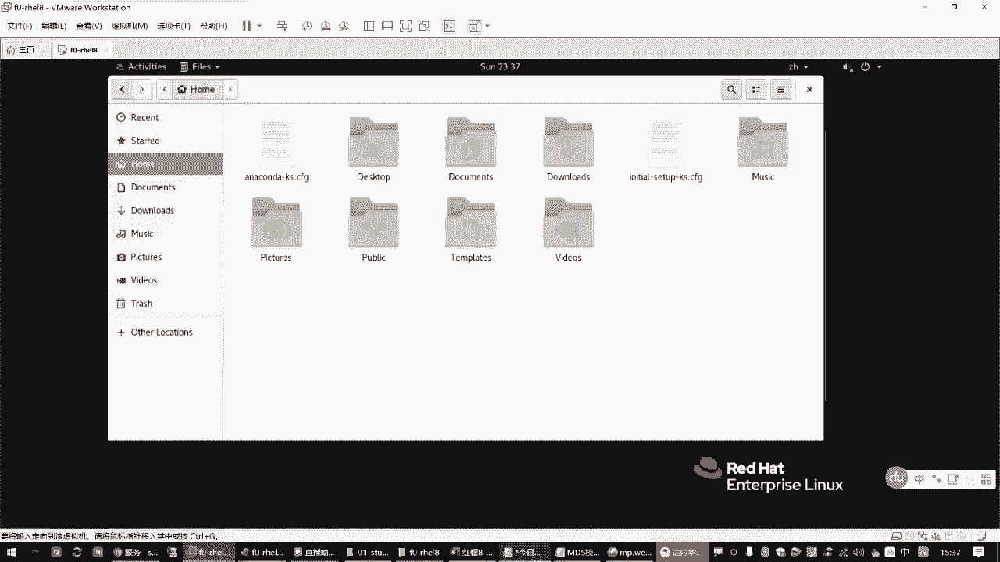
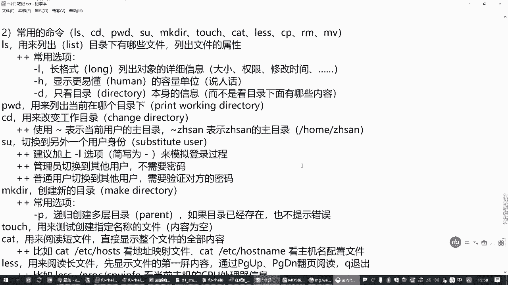
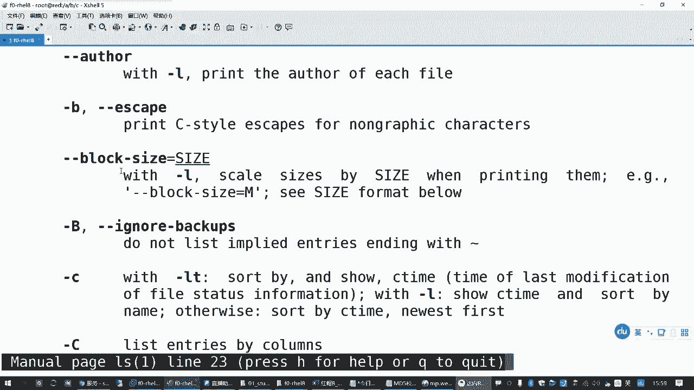
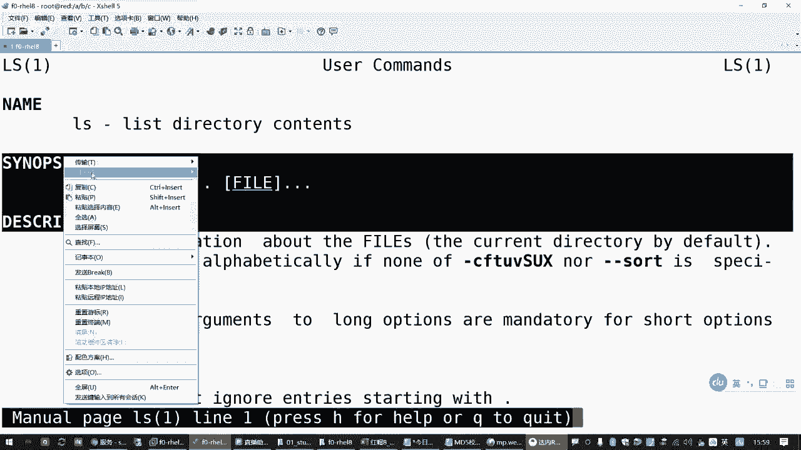
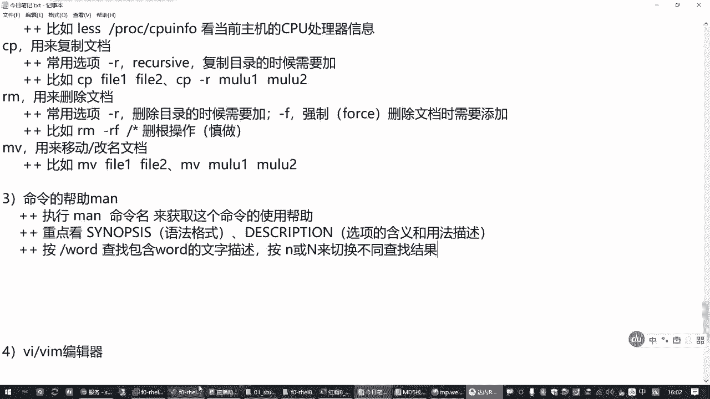
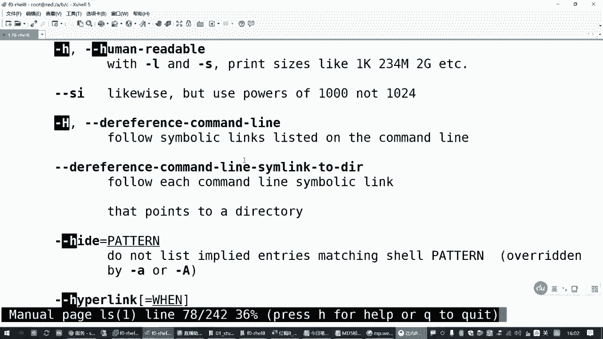

# 全网最全RHCE红帽认证全套入门教程：P3：1.02-文档管理常用命令

## 概述
在本节课中，我们将学习Linux系统中最基础且最常用的文档管理命令。这些命令是操作Linux系统的基石，掌握它们对于后续的学习至关重要。我们将从目录的查看与切换开始，逐步学习如何创建、查看、复制、移动和删除文件与目录，并了解如何获取命令的帮助信息。

## 目录探索三剑客
上一节我们介绍了Linux命令行的基本格式和目录结构。本节中，我们来看看如何探索和定位目录。在Linux中，有三个命令常被合称为“目录探索三剑客”。

### `ls` 命令
`ls` 命令用于列出目录下的文件和子目录，也可以查看文件或目录的详细属性。其基本格式为 `ls [选项] [目录或文件]`。

以下是 `ls` 命令的常用选项：
*   **`-l`**：以长格式列出详细信息，包括权限、所有者、大小和修改时间等。
*   **`-h`**：与 `-l` 选项结合使用，以更易读的单位（如K、M、G）显示文件大小。
*   **`-d`**：仅显示目录本身的信息，而不是其内部的内容。

例如，`ls -lh /boot` 会以易读的长格式列出 `/boot` 目录下的内容。

### `pwd` 命令
`pwd` 命令用于显示当前所在的工作目录。当你需要确认自己位于哪个目录时，直接输入 `pwd` 即可。

### `cd` 命令
`cd` 命令用于改变当前的工作目录。其基本格式为 `cd [目标目录]`。

以下是 `cd` 命令的特殊用法：
*   **`cd`** 或 **`cd ~`**：直接返回当前用户的家目录。
*   **`cd -`**：返回上一次所在的目录。
*   **`cd ..`**：返回上一级目录。

例如，`cd /etc` 会切换到 `/etc` 目录。

## 用户切换与目录操作
了解了如何查看和切换目录后，我们有时需要以不同用户的身份进行操作，或者创建新的目录结构。

### `su` 命令
`su` 命令用于临时切换用户身份。其基本格式为 `su - [用户名]`。选项 `-` 或 `-l` 表示模拟完整的登录过程，加载新用户的环境变量。

例如，`su - alice` 会切换到用户 `alice`。管理员切换到任何用户通常不需要密码，而普通用户切换则需要输入目标用户的密码。

### `mkdir` 命令
`mkdir` 命令用于创建新的目录。其基本格式为 `mkdir [选项] 目录名`。

以下是 `mkdir` 命令的常用选项：
*   **`-p`**：递归创建多层目录。如果父目录不存在，则会一并创建。

例如，`mkdir -p /a/b/c` 会一次性创建 `/a`、`/a/b` 和 `//a/b/c` 三层目录。

## 文件操作基础
现在我们已经可以在目录间自由穿梭并创建新目录了。接下来，我们学习如何创建、查看和操作文件。

### `touch` 命令
`touch` 命令的主要用途是创建新的空文件，或更新已有文件的时间戳。它常被用来快速创建测试文件。其基本格式为 `touch 文件名`。

例如，`touch file1.txt` 会在当前目录下创建一个名为 `file1.txt` 的空文件。

### `cat` 命令
`cat` 命令用于连接文件并打印到标准输出设备上，适合查看内容较短的文本文件。其基本格式为 `cat 文件名`。

例如，`cat /etc/hostname` 可以查看本机的主机名配置。

### `less` 命令
`less` 命令用于分页浏览内容较长的文本文件。它不会一次性加载整个文件，而是允许用户逐页或逐行查看。其基本格式为 `less 文件名`。

在 `less` 的浏览界面中，可以使用以下按键：
*   **空格键** 或 **Page Down**：向下翻一页。
*   **Page Up**：向上翻一页。
*   **`/关键词`**：在文件中搜索指定关键词，按 `n` 查找下一个，按 `N` 查找上一个。
*   **`q`**：退出浏览。

例如，`less /proc/cpuinfo` 可以分页查看CPU的详细信息。

## 文件与目录的复制、移动和删除
掌握了文件的创建和查看后，我们来看看如何对它们进行管理：复制、移动（重命名）和删除。

### `cp` 命令
`cp` 命令用于复制文件或目录。其基本格式为 `cp [选项] 源文件 目标文件` 或 `cp [选项] 源目录 目标目录`。

以下是 `cp` 命令的常用选项：
*   **`-r`** 或 **`-R`**：递归复制整个目录及其子目录中的所有内容。

例如，`cp file1.txt file2.txt` 复制文件，`cp -r dir1/ dir2/` 复制整个目录。

### `mv` 命令
`mv` 命令用于移动或重命名文件与目录。其基本格式为 `mv 源文件 目标文件` 或 `mv 源目录 目标目录`。

*   如果目标位置与源位置在同一目录，则为**重命名**操作。
*   如果目标位置是另一个目录，则为**移动**操作。

例如，`mv oldname.txt newname.txt` 是重命名，`mv file.txt /tmp/` 是移动文件到 `/tmp` 目录。

### `rm` 命令
`rm` 命令用于删除文件或目录。**这是一个危险命令，请谨慎使用**。其基本格式为 `rm [选项] 文件或目录`。

以下是 `rm` 命令的常用选项：
*   **`-r`** 或 **`-R`**：递归删除目录及其下的所有内容。
*   **`-f`**：强制删除，不进行任何确认提示。

**警告**：组合使用 `rm -rf` 命令时务必小心，错误的路径可能导致数据丢失。例如，`rm -rf /` 会尝试删除根目录下的所有文件（现代系统通常有保护机制阻止此操作）。

## 获取命令帮助
面对众多的命令和选项，我们不可能全部记住。Linux系统提供了强大的内置帮助系统。

### `man` 命令
`man` 命令是查看命令详细手册页的标准工具。其基本格式为 `man 命令名`。

查看手册时，请重点关注以下两部分：
1.  **SYNOPSIS（语法格式）**：展示了命令的标准用法和选项位置。
2.  **DESCRIPTION（描述）**：详细解释了命令的功能以及每个选项的具体作用。

在 `man` 的浏览界面中，可以使用和 `less` 命令相同的按键进行翻页（空格、Page Up/Down）、搜索（`/关键词`）和退出（`q`）。

例如，输入 `man ls` 即可查看 `ls` 命令的完整手册，在其中搜索 `-h` 选项可以快速定位到它的解释。

## 总结
本节课中我们一起学习了Linux文档管理的基础命令。我们从探索目录的 `ls`、`pwd`、`cd` 三剑客开始，学习了如何切换用户身份（`su`）和创建目录（`mkdir`）。接着，我们掌握了文件的基本操作：创建空文件（`touch`）、查看短文件（`cat`）和长文件（`less`）。最后，我们深入了解了文件与目录的复制（`cp`）、移动/重命名（`mv`）和删除（`rm`），并学会了在遇到疑问时如何使用 `man` 命令获取官方帮助。这些命令是日常使用Linux系统的基础，请务必多加练习以熟练掌握。