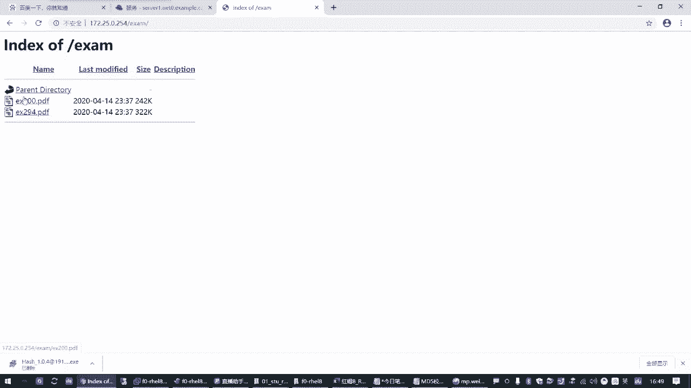
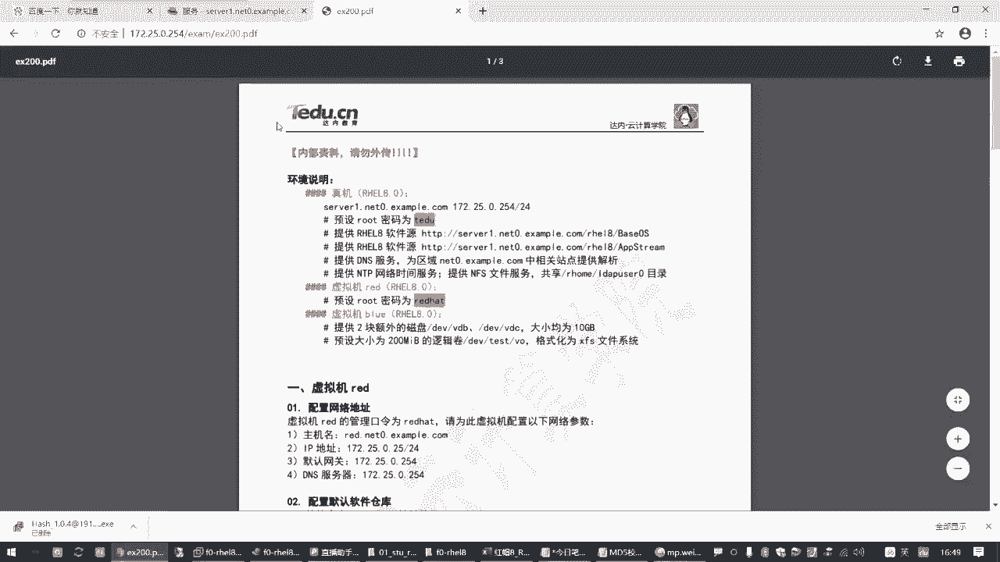
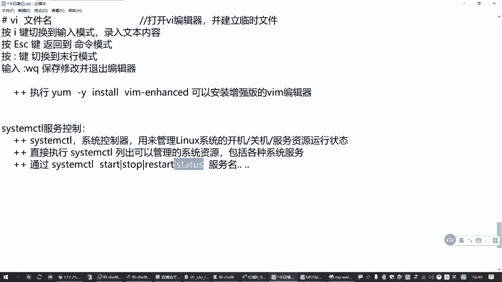
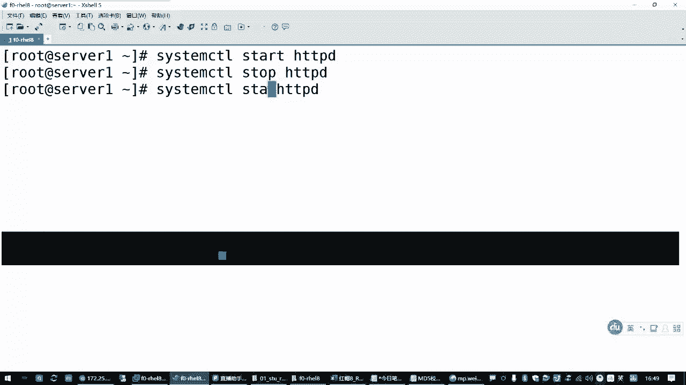
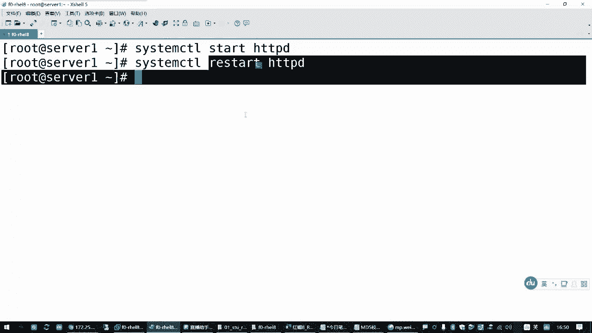
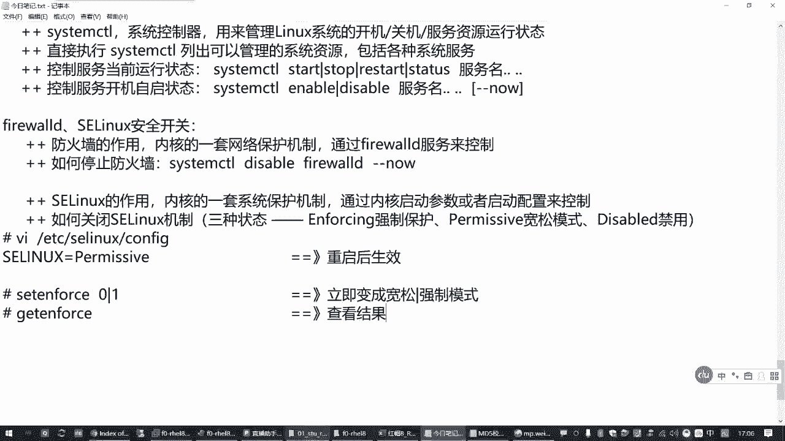
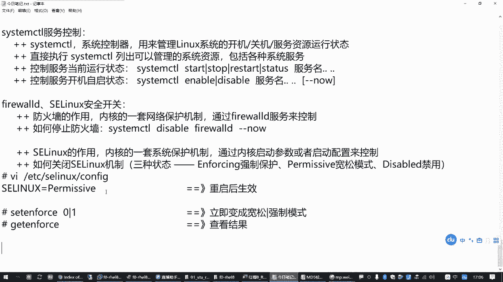
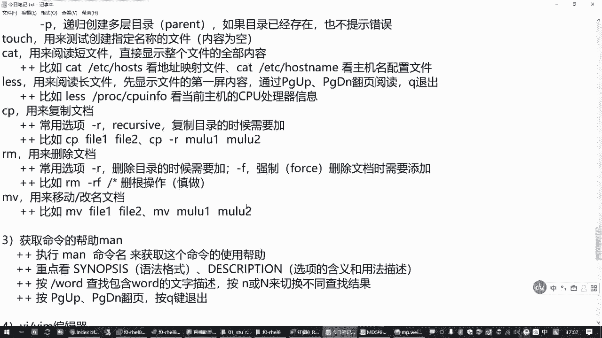
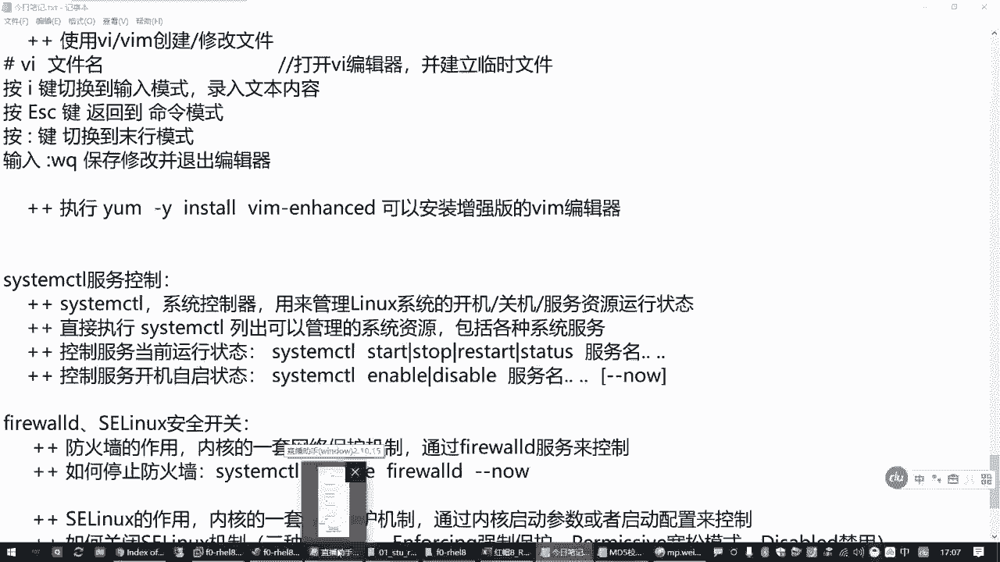

# 全网最全RHCE红帽认证全套入门教程：P5：1.04-服务控制和安全开关 🔧

在本节课中，我们将学习Linux系统中的服务控制和安全开关。主要内容包括如何使用`systemctl`命令管理系统服务，以及如何临时关闭防火墙和SELinux以简化初期的学习环境。这些是后续学习和实验的基础操作。

## 服务控制：systemctl 🛠️

上一节我们介绍了Linux的基础命令，本节中我们来看看如何管理系统服务。系统服务是计算机运行后，为提供网站、游戏等资源而运行的后台程序。在RHEL 7和8系统中，管理这些服务的核心工具是`systemctl`（系统控制器）。

它的主要作用是管理Linux操作系统的开机关机，以及控制各种系统服务的运行状态。

### systemctl基本用法

以下是`systemctl`命令最常用的几种操作，用于控制服务的**当前运行状态**：



*   **启动服务**：`systemctl start <服务名>`
*   **停止服务**：`systemctl stop <服务名>`
*   **重启服务**：`systemctl restart <服务名>`
*   **查看服务状态**：`systemctl status <服务名>`



> **注意**：`restart`操作会先停止服务再启动，可能导致服务短暂中断，在生产环境中需谨慎使用。





例如，我们的实验环境中有一个提供练习题访问的网站服务`httpd`。启动它后，即可通过浏览器访问练习题。

```bash
# 启动httpd网站服务
systemctl start httpd
# 查看httpd服务状态
systemctl status httpd
# 停止httpd网站服务
systemctl stop httpd
```



执行`status`命令后，需重点关注 **`Active:`** 一行，它会显示服务是`active (running)`（活动）还是`inactive (dead)`（未活动）。

### 设置服务开机自启

除了控制当前状态，我们还需要管理服务在**开机时是否自动启动**。以下是相关命令：

*   **设置开机自启**：`systemctl enable <服务名>`
*   **禁止开机自启**：`systemctl disable <服务名>`
*   **设置开机自启并立即启动**：`systemctl enable --now <服务名>`

`enable`和`disable`操作影响的是下次开机的行为，不会改变服务当前的状态。如果希望设置后立刻也让服务运行起来，可以加上`--now`选项。

## 安全开关：防火墙与SELinux 🛡️

在初学阶段，为了减少配置复杂度，我们可以暂时关闭系统的安全防护机制，主要包括防火墙和SELinux。请注意，在生产环境中，应根据需要谨慎配置它们。

### 防火墙 (firewalld)

防火墙（`firewalld`）是内核的一套网络保护机制，通过`firewalld`这个系统服务来控制。它的作用是保护计算机免受外部网络攻击。

**如何关闭防火墙？**

由于`firewalld`本身就是一个系统服务，因此可以直接使用`systemctl`命令来关闭它。

```bash
# 禁止防火墙开机自启，并立即停止它
systemctl disable --now firewalld
```

如果想重新启用防火墙，只需将`disable`替换为`enable`即可。

### SELinux

SELinux（安全增强式Linux）同样是内核的一套系统保护机制，但它不通过某个服务管理，而是通过内核启动参数和配置文件控制。它更侧重于操作系统内部的资源访问控制。

**SELinux的三种运行模式：**

1.  **`enforcing`**：**强制模式**。严格执行安全策略，阻止违规操作。
2.  **`permissive`**：**宽容模式**。记录违规操作但不阻止，仅发出警告。
3.  **`disabled`**：**禁用模式**。完全关闭SELinux功能。

**如何关闭或修改SELinux模式？**

**方法一：修改配置文件（永久生效，需重启）**
编辑SELinux的配置文件`/etc/selinux/config`，修改`SELINUX=`后面的值为`permissive`或`disabled`。

```bash
# 使用vim编辑器修改配置文件
vim /etc/selinux/config
# 将 SELINUX=enforcing 改为 SELINUX=permissive
```

**方法二：使用命令临时切换（仅限`enforcing`和`permissive`之间）**
如果不想重启系统，可以临时在强制模式和宽容模式之间切换。

```bash
# 查看当前SELinux模式
getenforce
# 临时设置为宽容模式
setenforce 0
# 临时设置为强制模式
setenforce 1
```




> **注意**：`setenforce`命令无法切换到`disabled`模式，要禁用SELinux必须通过修改配置文件并重启系统。



## 总结 📝


本节课中我们一起学习了Linux系统中两个非常重要的管理部分：





1.  **服务控制**：我们掌握了使用`systemctl`工具来启动(`start`)、停止(`stop`)、重启(`restart`)服务，查看服务状态(`status`)，以及设置服务开机自启(`enable`/`disable`)的方法。
2.  **安全开关**：我们了解了防火墙(`firewalld`)和SELinux的基本概念，并学会了如何暂时关闭它们以方便初期的学习与实验。这包括使用`systemctl`控制防火墙服务，以及通过修改配置文件或`setenforce`命令来调整SELinux的运行模式。


这些命令和操作在后续的RHCE学习和实验中将频繁使用，请务必熟练掌握。对于初学者，建议在实验环境中先关闭这些安全机制，待理解其工作原理后再学习如何配置。