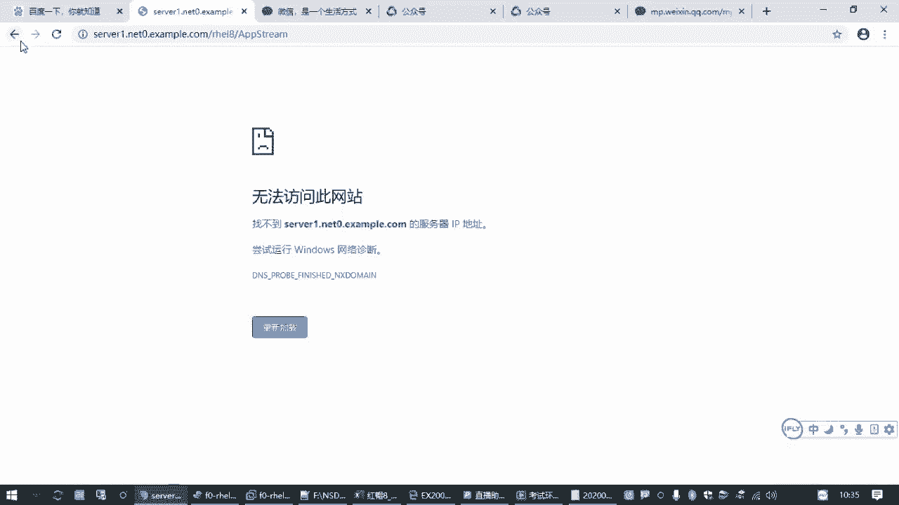
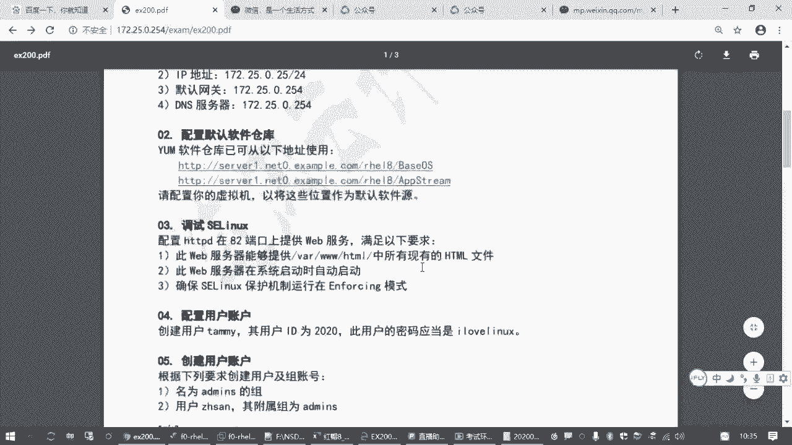
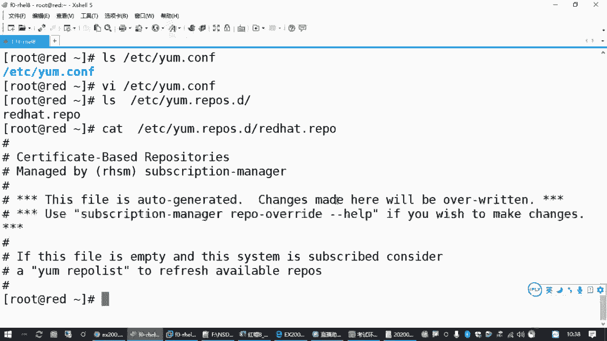
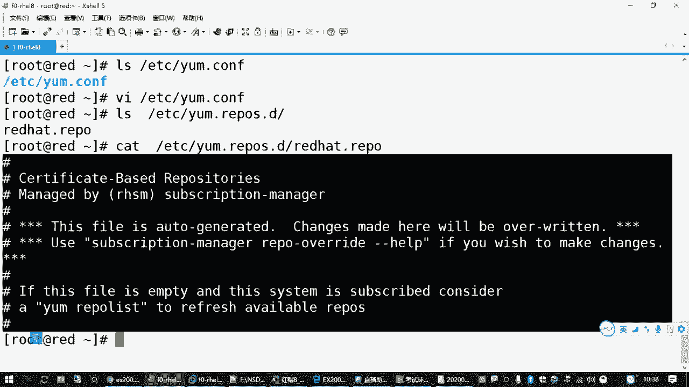
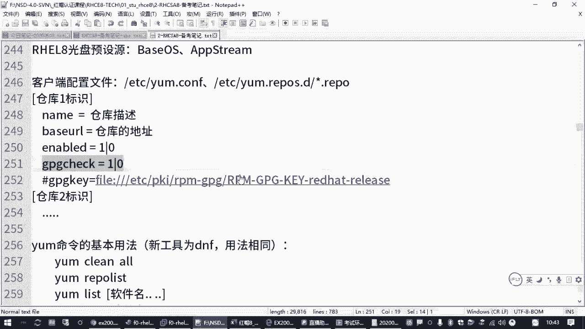
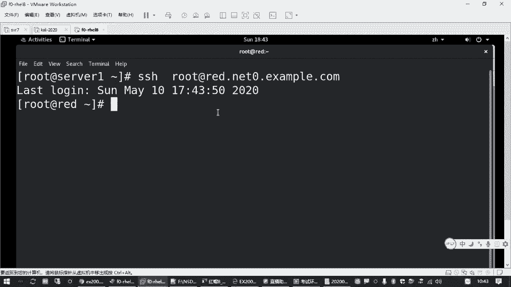
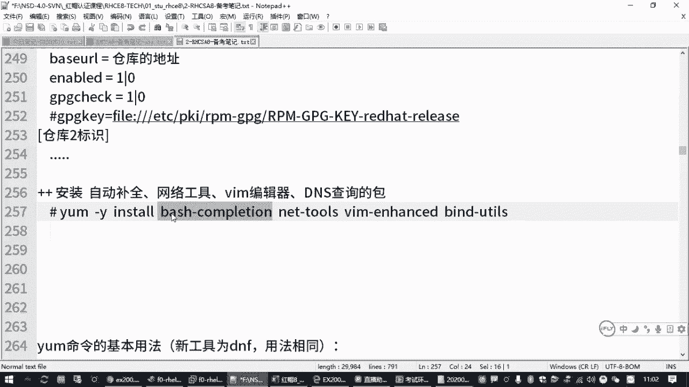

# RHCE红帽认证全套入门教程：P7：2.02-配置yum源 🛠️


在本节课中，我们将要学习如何在红帽企业版Linux系统中配置yum软件源。软件源是系统安装和更新软件包的来源，正确配置它是进行后续软件管理操作的基础。

## 软件源概述

上一节我们介绍了如何配置网络地址，本节中我们来看看如何配置软件源。在红帽Linux系统中，安装软件包通常使用`yum`命令（红帽8中也可使用其替代命令`dnf`）。无论使用哪个命令，都需要首先指定软件包的来源位置，即软件仓库。





## yum配置文件结构

yum命令的配置文件主要位于两个位置。全局行为配置文件是`/etc/yum.conf`，它控制yum的默认设置，例如是否进行软件包签名检查。

更关键的是仓库配置文件，它们位于`/etc/yum.repos.d/`目录下。该目录中的文件扩展名必须是`.repo`，每个文件可以定义一个或多个软件仓库。



## 创建仓库配置文件



以下是创建仓库配置文件的基本步骤和格式。

首先，进入仓库配置目录并创建一个新的`.repo`文件。
```bash
cd /etc/yum.repos.d/
vi el8.repo
```

在文件中，每个仓库的配置需要包含以下核心部分：
*   `[repository_id]`：仓库的唯一标识，不能重复。
*   `name`：仓库的描述信息。
*   `baseurl`：软件仓库的具体访问地址，这是必须提供的核心信息。
*   `enabled`：是否启用此仓库，`1`为启用，`0`为禁用。
*   `gpgcheck`：是否进行GPG签名验证，`1`为检查，`0`为不检查。如果设为`1`，则需配合`gpgkey`指定密钥地址。

一个基础的仓库配置示例如下：
```bash
[BaseOS]
name=BaseOS Repository
baseurl=http://content.example.com/rhel8.0/x86_64/dvd/BaseOS
enabled=1
gpgcheck=0
```



## 配置考试要求的软件源



根据题目要求，我们需要配置两个软件源地址。以下是具体的操作流程。

1.  编辑或创建仓库配置文件。
2.  在文件中添加第一个仓库的配置。将`baseurl`替换为题目提供的第一个地址。
    ```bash
    [BaseOS]
    name=BaseOS Repository
    baseurl=题目提供的第一个网址
    gpgcheck=0
    ```
3.  在下方添加第二个仓库的配置。将`baseurl`替换为题目提供的第二个地址，并确保`[repository_id]`不同。
    ```bash
    [AppStream]
    name=AppStream Repository
    baseurl=题目提供的第二个网址
    gpgcheck=0
    ```
4.  保存并退出编辑器。

## 验证与测试

配置完成后，必须验证仓库是否可用。

执行以下命令列出所有已启用的仓库：
```bash
yum repolist
```
如果配置正确，你将看到两个仓库的ID、名称和软件包数量。

验证通过后，即可使用yum安装软件包。这是一个同时测试软件源和补充常用工具的好机会。
```bash
yum -y install bash-completion net-tools vim bind-utils
```
*   `bash-completion`：提供命令自动补全功能。
*   `net-tools`：提供传统的网络诊断命令（如`ifconfig`）。
*   `vim`：增强的文本编辑器。
*   `bind-utils`：提供DNS查询工具（如`host`, `nslookup`）。

安装完成后，退出当前终端并重新登录，即可体验命令自动补全等功能。

## 总结



本节课中我们一起学习了配置yum软件源的全过程。我们了解了yum配置文件的存放位置，掌握了`.repo`文件的基本结构，并完成了添加指定软件源、验证配置以及安装测试软件包的操作。正确配置软件源是高效管理系统软件的基础，请务必熟练掌握。