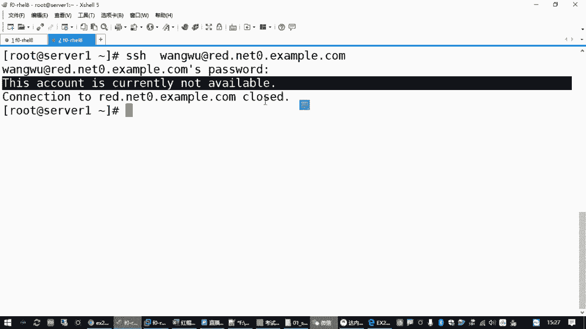
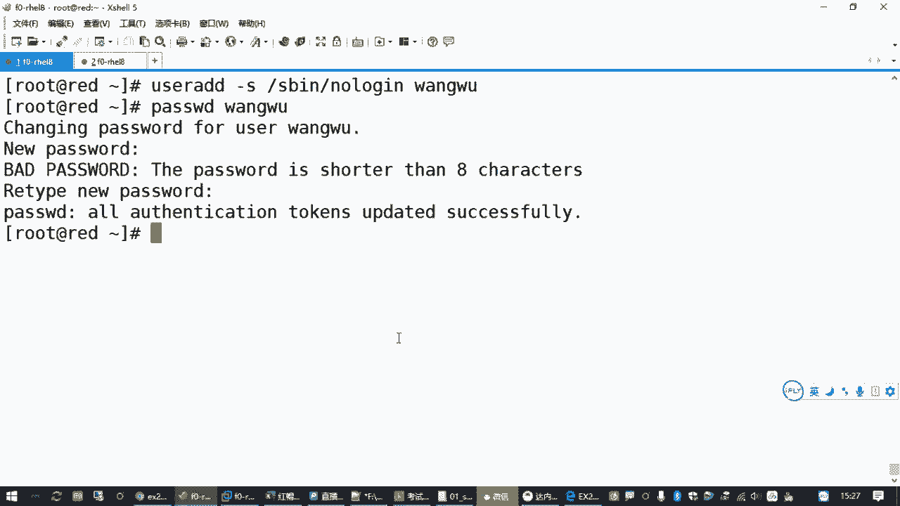
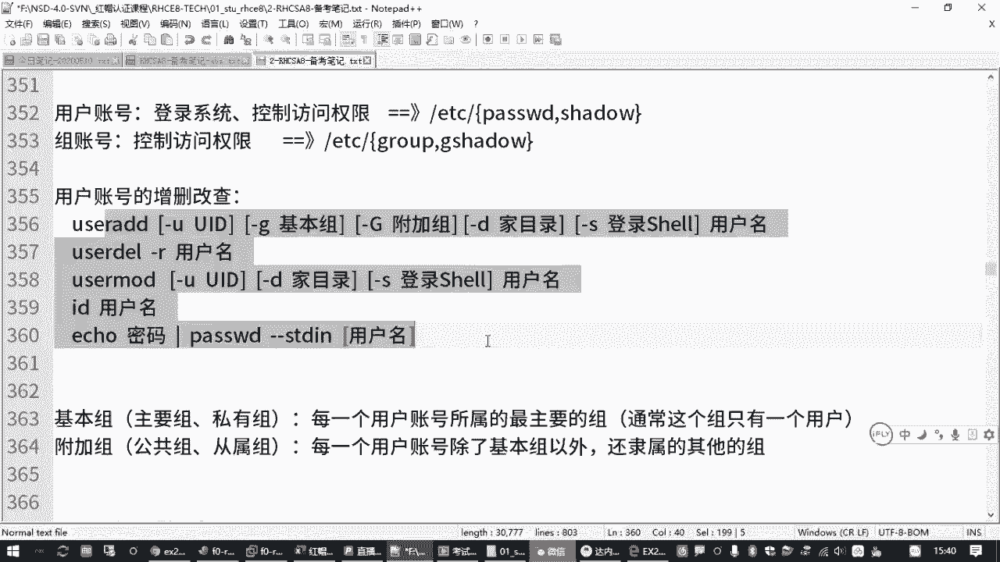
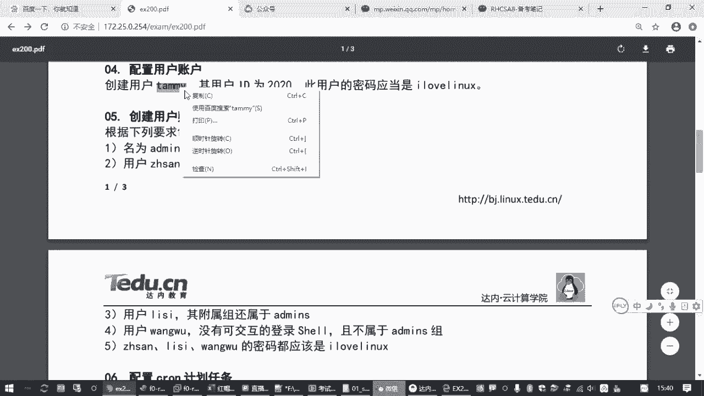

# 全网最全RHCE红帽认证全套入门教程 - P11：2.06-账号管理 - 达内-程序猿 - BV1f64y1q7b5

那接下来我们用户账号管理这一块的话呢，大概有两道题目左右吧，啊大概两道题目左右呃，其中的用户账号管理这个题目啊，考试的时候还是蛮容易的啊，就是大家你要知道用户管理相关的一些基本的一些操作，呃。

一方面呢就是怎么样怎么样去添加用户账号，再一方面呢怎么样去给他设置密码，然后呢嗯要学会怎么样把一个用户账号添加到某一个组对吧啊，就大概就是这些内容啊，呃那关于用户账号管理这一块的话呢。

我们来了解一下相关的一些知识啊。

呃对于linux主机来说，用户账号主要就是用来控制一个呃使用计算机的人啊，或者说使用linux的人是吧啊，它有什么样的一个权限去操作我们的一些文件啊，一些程序等等等等。

这个就是我们用户账号吧啊那另外一方面呢，用户账号在控制权限的时候怎么控制的呀，是根据你这个文档属于谁的，然后用户能能够对你这个文件有什么样的一个权限。

所以其实用户也是在呃决定我们能对一个文件做什么样的一个操作，在这个环节当当中呢起到一个非常关键的一个作用，所以我们接下来两节课呢就先看用户账号啊，再看我们的归属和权限呃，那用户账号的话呢。

它除了控制权限以外，它第一个还有一个很大的作用，就是登录系统对吧，像我们平时用的windows系统一样啊，它其实系统里边分成用户账号和主账号啊。

但是呢更常见的我们最关心的也是最常接触到的就是这个用户账号，因为它可以根据你的用户名和密码来登录到你一台主机啊，最基本的就是你知道他的ip地址，知道它的端口，然后验证的时候你要用那个用户名和密码吧是吧。

所以登录和控制权限呃，linux系统里面呢，它的用户账号信息都是存在我们etc下面的password文件和seed文件啊。

这两个啊这两个文件呢就是大家了解一下，你要知道啊是吧，考试的时候也不考啊，呃我们系统里面有一个文件是在cat看一下，一个是在etc下的一个password。

这个文件里面记录了每一个用户，然后我们看第一行吗，记录了每一个用户的用户名，然后它的密码，然后它有一个每一个用户有一个id数字的标记，然后它属于哪一个组是吧，有个基本组的，有一个i d有个主的标记。

然后他的全名，然后他的逐鹿啊，主目录啥意思啊，就每一个用户你进到一个系统之后，操作系统都会给你分配一个目录，你对这个目录呢是有完全控制权限的啊，这叫主目录啊，或者叫加目录是吧啊。

最后呢是你这个用户进来之后，你要执行命令，它会有一个命令行环境，这个命令行环境呢是有一个程序来组成的，这上次我们讲过的吧，就叫半性命令行解释器，那默认你如果没有做过设置，就是并下的代谢啊，啊就是这个。

所以在这个文件里面会有所记录，你添加一个账号。

它就会有一条记录啊，这是password文件的一个作用，另外还有一个文件呢叫shadow，现在叫影子文件，刚才我们前面讲过password文件呢看起来好像是记密码的是吧，但是在很多很多年之前哈。

linux系统的密码就不存在这个文件里面了，那为了安全起见呢，它的密码呢在这个password文件里面的密码都用一个x来表示，那啥意思呢。

就表示他真正的密码就加密的那个密码啊，是放在我们这个影子文件里面。

就这个影子文件呢就是是和我们password文件相对应的，就是你人一走路，那个影子是跟着你走的是吧，所以是一一对应的，但是影子文件它的密码控制非常严格，一般的用户是开不了的，只有管理员能看啊对吧。

这个要注意，所以这是密码的管理和存储一种机制。

那在下载文件里边呢啊我们也可以看一下是吧。

你看root用户，那他的密码就是加密的这一长串啊，咱也不知道他密码是多少是吧，反正你看加密的，你是看不出来的，那后面还有一堆就是关于这个密码的什么有效期呀是吧，最近什么时候改过的呀，一堆乱七八糟的东西。

那这里咱们也不展开说了啊。

嗯但是大家要知道用户账号管理有这两个文件啊，你要知道一个是password，一个是shadow，你最终影响用户用户在这个账号呀登录啊，总目的在哪里啊，都是在这两个文件里面记录的啊。

当然啊咱们管理账号的时候，你不需要直接去改这个文件啊，那要不然多麻烦是吧，呃另外一块除了用户账号以外呢。

就好像是把我们linux主机上的用户分成几个小群是吧，分成几个小团队，那比方说我们在公司里边，公司所有的用户啊，员工账号我们都添加了，然后开发部就作为一个部门，这一个部门我就可以给它设一个组啊。

因为开发部呢可能对某一个那个文档，某一个目录它是需要有相同的权限的，那你一个一个的给他给员工，开发部的每一个同事，你都给他分一个权限，这么麻烦嘛是吧，所以就是为了方便啊。

我们可以把一堆它的权限相同的这些用户，或者说它的属性类似的这些用户啊，为了方便起见，我们可以把它放到同一个组啊，所以有个叫主账号对吧，就是把用户做做分类的啊，那主账号的话呢也有etc。

还要e t c下面有个什么gloop，还有什么g shadow啊，作用和上面这个password和下载的内饰，就是文件换了个名字，这是账号的属性，它存在呢啊，那如果我们要设置用户账号的时候呢。

那我们还要知道用户账号它的一个基本属性，一般我们在添加用户账号的时候啊，就是用户账号的管理啊，增删改查有这么几个命令啊，这个大家要了解的是吧啊，有那么几个命令，那一个命令呢就是增加账号。

增加用户账号就是u在a d d，u在a d d，然后使用这个命令的时候呢。

那你想要添加一个用户，最简单的方法是什么，就是在后面再跟上用户名，对不对，这个用户名就是用户登录的时候使用的那个登录名啊，这个名字不要用数字啊，不要用数字，或者说你不要用数字开头，也不要用纯数字。

因为我们在linux主机里边，他用户专门有一个数字的id，然后为了避免混淆，你要会用个数字的话，这个不是个好习惯啊，有时候linux内核它会分不清楚，所以不要不就是不要用纯数字吧，也不要用数字开头哈。

那这个u的add就是最简单的添加用户的方法，用户账号添加之后，它有密码吗，没有你没给他设呀，对不对，所以你还要给他设密码之后，他才能够去正常使用呃，设置密码的操作呢就是password好。

就是pass word，那你要给要给这个张三改密码，就是password张三，然后根据提示你输入几次密码，输两次对吧，当然这两次密码呢如果你是普通用户，改密码的时候，就给自己改密码的时候。

你还还要去验证原来的密码，再输两次新的密码，而且密码不能太简单啊，要多少在八位以上，要符合一定的复杂性复杂度嗯，但是呢你现在是管理员是吧，你是管理员，那这个那个系统，那你对你无可奈何。

所以他虽然有个提示，说这密码不对呀，这密码太短了，我写了13456是吧，最后还是设置成功了啊，这是最简单的创建账号设置密码，那这个账号密码设置完成之后呢，呃其实你比方说我另外再开一个终端啊。

在你的收获一这个环境，我从收到一我就可以用s s h的方式，注意刚刚我们添加的这个账号登录过去啊，代入到哪到red，对吧，登录过去之后呢，根据提示输入对方的密码，123456是不是就登录过来了。

那刚才给大家看到的就是最简洁的啊，最省事的添加账号和密码的方法，那这样添加好的这个账号呢是使用的是默认的一些属性啊，默认的一些属性，比方说它的主目录是放在home下边，给我们这个用户名同名的啊。

再比方说他的那个用户的id i d，你可以这个用户自己查一下，他的id可能是从1000开始的，因为低于1000的认为是系统账号，那个id是零的，就是管理员自己啊，你root用户自己看一下对吧。

i d是零用户的id啊，是零就是管理员，然后普通用户在红毛八开始，一般默认是从1000开始的对吧啊，然后呢用户使用的那个登录环境就是你用户登录进来之后，你看他一方面才能登录。

登录进来之后他也能执行命令对吧，也能执行这些命令啊，所以这是默认的情况，我们添加一个用户账号的一个属性啊，但是在某些情况下呢，我们就不希望用这种默认的属性啊，那怎么办，我们要去改啊。

所以我们在添加用户账号的时候呢，有很多时候我们就不希望用u在a d d张三这么简单的这种方法，我们在中间可能要控制它的属性，比方说我要添加一个账号，我不想用这个1000多id，我想用1234，对不对。

或者我就想用一个另外的第一个数字号，比方说我要添加一个李四，我就想他的id号是666，行不行，对不对，而且这个数字很特别吉祥哈，那怎么办呢，这个时候要加一个选项叫杠u，这就是使用指定的id号啊。

后面再跟上用户名对吧，这也可以，那这样的话呢我们可以去检查这个李四的id，如果你是管理员，你可以用id去跟上一个用户账号去看这个用户的id号是多少啊，你看这是666对吧啊，普通用户能不能查，我试一下啊。

id李四哎呀，能查是吧，等一下张三可以查李四的i d就检查，我就不改是吧，查一下还是可以的，可以知道它是666，所以这个就是在添加用户账号的时候去控制他的ui d啊，一般叫u i d啊。

叫用户的数字标记叫u i d，那添加账号的时候，除了改id还可以改什么呢，还可以改它属于哪一个组啊，还可以改它属于哪一个组，那那大家看这个账号属性的时候啊，i d就是用来检查账号的属性。

看他的那种数字标记，那你可以发现它有一个u i d，这叫用户的id，还有一个g d，这叫主的i d，那你还会发现后面还有个给路，那主i d和group是啥意思啊，大家这里要区分一个概念啊。

主的i d其实对应到一个主叫李四是吧，那个路不是后面你看也有个类似。

这有啥区别是吧，那这里有个概念叫做什么呢，叫做基本组，还有一个叫附加组啊，基本组指的是啥意思呢，附加组又是啥意思呢，基本组指的是每一个用户账号，你在linux系统里边啊。

你创建的每一个用户账号必须属于一个组啊，必须属于一个组所属的最主要的组，所以有时候也叫做主要组，那大多数情况下，这个组里面只有一个用户啊，通常这个组只有一个用户，所以大多数情况下呢。

这个基本组就是和我们这个用户账号同名的，就好像我们公司招一个员工，你这个员工进了公司之后呢，我也不知道你放到哪个部门，那我就给你成立一个部门，就只有你一个人对吧，这个方便管理啊，因为在这个编制上。

就好像我给你写公牌的时候，你工牌上必须属于一个部门，在没有给你分配到属于哪个部门的时候，那你至少有一个有一个基本的部门是吧，这个就是和用户同名的，这叫基本组啊，也正因为这个主通常只有这一个用户啊。

所以呢有时候我们把它叫做四有主啊，或者叫主主要的主啊，或者叫主主有点绕口哈，主要的主叫法有很多啊，但是一般最常见的就是基本组啊，这个知道是吧，但是当你一个账号添加好了之后，用着用着。

有些时候我就希望你这个账号要加到别的别的组啊，比方说咱们老师啊，有时候属于教学部，那可能要做一些研发工作，可能要属于研发部，那谁也不能说我一个用户只能在一个部门干活是吧，那我既然在多个部门干活。

那有时候我就需要去访问多个部门的一些资源，那这个时候怎么办，我怎么方便去给你分权限呀，那这个时候出来一个概念叫附加组啊，就是附加组指的是啥意思呢，就是相对每一个用户账号来说啊，除了，基本组以外的啊。

除了猪基本组以外，意外不是意外，还属属于的啊，还利索的其他的组，那么这个组对这个用户来说呢，就叫附加组额外的嘛是吧，那可能我的编制在教学部，但是我同时又有研发部的权限啊，又有那个运维部的权限是吧。

那么运维部分和那个研发部就是对我来说，他就是我的副家族，那我的基本组可能就教学部啊，明白这意思吧是吧啊，有这两个东西啊，那如果我在添加账号的时候要管理这个啊。

添加账号的时候一般有两个选项杠小写的歌哈，或者叫g是吧，这是指定你属于哪个基本组，但是呢基本组一般我们很少去用啊，很少去用，就大家要了解，因为很正常情况下，就是你用户是叫啥名字。

就自动给你创建一个基本组，很少会去改啊，但是附加组呢那有时候我们就会去设置你这个用户账号添加的时候，我就跟你说啊，那来我们公司我就直接让你加到呃，那个什么研发部对吧，可以通过一个大写的g去指定啊。

用这个去指定啊，然后用户账号呢加目录可以用杠d去指定，如果你不指定，那默认就是home下，然后按用户名起一个名字，建一个目录呃，附加组呢你如果不指定，那你不属于任何别的组，只有一个基本组啊。

基本组如果不指定，就是核心用户名同名的对吧，具有这几个选项啊，然后杠s指定的是用户的登录器，什么叫登录项。

就是你这个用户账号登录到linux主机之后，哪一个程序负责帮你解释这个命令，大家还记得我们讲过的那个命令解释器的概念吧是吧，那刚才我们在这个录制账号这里边给大家看过我们的etc password。

在这个文件里面第一行不就是root账号的信息吗，最后这一个部分就是登录器，正因为有他在啊，所以我们就能够执行命令。

它是不能够远程登录的啊，不允许它的远程登录的，那可能有些同学觉得奇怪，你不允许我登录，你借我干嘛呀，是不是啊啊，大家可能不了解，那还有一些用户呢。

它只是在服务器上用来跑一些服务程序用的啊。

用来跑一些服务程序用的，比方说阿帕奇，我们在运行我们这个网站的时候，需要它有一个普通用户的身份，但是这个用户它不允许登录，你看后面有个叫s b no no in，一方面我没有给他设密码。

另一方面就算你给他设了密码，他也登不上来，因为他他不需要执行命令啊，他只需要去运行一些程序，由管理员告诉他，你现在的身份是阿帕奇，你的责任就是跑一个网站对吧，有一堆用户啊。

那除了我们平时讲到的正常的命令行解释器。

就是那个bb型，那另外还有一个比较常用的叫rs并下的那个in，这个就是专门用来禁止一个用户登录的啊，通常来说就是用来添加一些特殊的系统用户账号啊，因为你不想让他登录吗。

那如果我们要设置怎么办呢，还是刚才我们讲到了这个user add这个命令，然后后面加一个杠s。

指定你用哪一个项，所以如果你想再加一个账号啊，user add来我们指一个杠s，后面写上s并下的no log in，加一个王五对吧，然后你也给他设一个密码，王5123456，123456。

那么这个用户呢他是登不上的啊，登不上的啊，你怎么试呢，这是帮助大家理解啊，考试是不考这个考的是另外一个用户啊，来我们退出去测试一下，我们刚刚张三是不是能登进来啊，因为它默认是用的正常的需要环境啊。

就正常的那个命令行解释器啊，那现在我们换成王五也输密码，123456，你是不是登不上，你会看到一个提示，this account is currently not available。

就当前账号现在不可以用啊，你登不进啊。

登不进不允许你远程登录的啊，好这是刚才我们说到的添加用户账号的时候啊。

u的a d d这个操作，那一般建议大家直接创建账号的时候，就把你想要的这些属性给修改好，那如果我忘记了呢，也没关系，你可以用user m o d m o d就是修改。

你可以用uzm o d啊去修改一个用户，把他的这个登录shell啊，用户名啊，uid啊，再去改也是可以的。

来举个例子，刚才我们的那个用户李四是吧，他的ui d是不是666啊啊我觉得6666不行，我现在又喜欢888了是吧，那咋办呢，你可以用u的m o d g u去跟上我们的啊，刚又要跟上要改的那个ip号。

最后跟上你要操作的这个用户账号回收确认，是不是就改过来了对吧，就改过来了嗯，那uza d d是添加用户账号，uer m o d是修改用户账号啊。

刚才我们在添加用户账号的时候使用到了这些属性，那大家在使用u m o d的时候一样可以用，意思就是说你可以先加账号，加完我再改，那当然这里要画两步是吧，如果你能在添加账号的时候，同时就指定这是最省事的。

一步到位一步到位啊，这是创建账号啊，然后呢，呃我们改密码的操作啊。

咱们考试的时候来回头看一下这个题目啊。

你看这个用户账号，你是不是给他设密码呀，啊然后底下呢又有几个账号。

是不是都要给他设密码呀，而你每次都设密码，刚才我们给大家讲的操作呢是password吧，跟一个用户名，如果你是管理员啊，你可以这么做啊，如果你是普通用户，你没权限，普通用户不能改别人密码。

只能改自己密码，只要你pass word空格后面跟一个名字，系统就不让你看哈哈，你是管理员可以啊，然后你根据提示输几次密码啊，输两次嘛是吧，验证，因为你是管理员，但是考试的时候呢，这样速度不够快不够快。

因为你是一次密码，你得敲两次，你万一两次敲的不一致了，你还得再敲好几次，所以给大家推荐一个简单的方法啊，有什么方法呢，有个工具可以连接两条命令，我要给这个王五用户设置密码的时候。

我密码可以在前面用另外一条命令，直接把密码告诉他，这叫a口a和英文单词反应过来，翻译过来就是回血的意思，就是你在后面显示一段什么话，他就显示在屏幕上对吧，这是a和命令的一个作用啊，你随便写啥。

他照着照着给你输出一遍啊对吧，这叫a的命令，那我现在是用a的命令来显示密码，那后面我们加个竖杠，啥意思啊，这个竖杠在linux系统里面叫管道，就一个水管一样，我把一根水管呢连连接这头和那头。

你可以从这头上装一个老鼠进去，老鼠从这个管子这头进去，从管子那头出来对吧，那我现在把123456这串密码从管子这边输进去，就不在屏幕上显示了啊，不在屏幕上显示，而是从管道输进去。

交给管道右边的另外一条命令password，然后跟上一个用户账号。

这个意思就是说我们要用这个密码交给password这个命令来用。

去设置王五这个账号啊，当然啊password这个命令他本来是不理你给他的密码的啊，你给这么给他密码，人家是不理会你的，你如果希望他接受你管道给他的密码，说你别让管理员敲了啊。

我我通过管道我把密码给你要干嘛呢，在红包七系统里面，然后在红木七或者八或者六都是啊，呃在红帽的系统里面呢，我们可以加一个杠杠s t t e就表示那那行，你管道给我个密码也行，那我就不麻烦管理员了是吧。

这个操作是快速改密码啊，快速改密码，那如果你想再改李四的密码是吧，你再往上一条呗，然后把后面这个用户删了，换成李四，这多省事是吧，你改多个用户密码，上线头掉出来，一改用户名就改完了吧，这是改密码操作啊。

好那刚才我们讲过增加用户账号，查看用户账号，修改用户账号啊，包括设置密码，查看用户账号是不是就是i d是吧，就看账号的属性，那还有时候账号我不想要了，怎么办，删除那user add是添加啊。

m o d是修改，那delete就是删除user，delete gr会不会跟一个用户名，比方说我们跟一个张三那高r的选项呢，表示递归啊，就斩草要除根啊，就我们不仅要把张三用户删除。

我还要把他家的房子也退了，就他这个总目录，他的邮箱全部都给干掉啊，这叫彻底删除一个用户，当工作的时候呢，大家要小心，就实际工作当中啊，删除一个账号，你要确认这个用户的那些文件已经做好备份了啊。

要不然你这么一删他的那个主目录下的东西全没了是吧，有点危险，这是删除，删除之后你再来看张三没了吧，对不对，那你要删除李四也是彻底删除，要三王五也是啊对吧，都没了，你删除用户之后，这些用户就用不了了啊。

用不了了啊，这是添加用户账号，添加户账号，嗯那刚才我们讲过添加用户账号的时候，如果要指定它属于哪一个组，怎么办呢，那我们重新再添加一个uo的a d d，给大家演示一下相关的一些用法啊。

那如果你要指定它属于一个组，我们说我们说的那个基本组很少用是吧，一般用的最多的就是这个杠大气啊，指定它属于附加的哪个组，那我们添加两个账号对比一下啊，我们默认的方式添加一个用户账号叫s t u01 。

然后呢我再加一个杠大写的g啊，来让这个用户账号属于root组，系统里面默认有个root组啊啊换个用户名s t u02 ，那么添加s t u02 属于root组，那看这两个用户账号有什么区别吗是吧。

这是s t u01 ，这是s t u02 ，区别在哪里，就第二个用户账号的话呢，他也有个基本组，和他名字是同名的，但是除了基本组以外，它是不是另外又属于一个新的组啊是吧，这就叫附家族啊，附加组。

好那我们工作当中有时候说我不想放root，主要我想成立一个我们自己的，主要是不，你说你那个市场部不好听，我换个名字叫营销部行不行对吧，我另外要成立一个新的主，那这个涉及到主账号的管理啊。

那主账号的管理的话呢和用户账号管理类似，但是呢比我们用户账号管理呢要简单多了啊，要添加一个组gloop a d d啊，这不是又在a d d了啊，后面跟上组的名字，如果你这个组不想要了。

给loop delete删除组，那其实下面呢你还可以把一个用户账号添加到一个组，如果你没有添加的话，专门有个命令叫gp word杠a用户名再加上一个组名，那咱们考试的时候，这个大家如果记不住。

一般不用这个命令啊，为啥我们用的a d d添加用户账号的时候，不是可以直接杠g附加组嘛是吧，就可以指定这个用户发到一个组，这个开关键你习惯啊，你如果愿意呢。

你用这个gp word杠a就是添加a d d嘛，杠d delete删除可以从一个组里边啊，删除一个添加一个用户和删除一个用户都行啊，你要查一个用户属于哪些组合，可以用那个group对吧。

这个所以账号管理这个命令有很多啊，比方说你用右侧a d用那个ut mod啊，ut mod也可以把一个账号添加到一个组，但是呢他用法就有点别扭啊，有点别扭，就在一个用户已经建好了。

我要重新把它加到主要么呢，你用奇葩sword杠a把这个用户加的主要么呢，你可以用ut mod去更改杠g主的名字，用户名对吧，这是更改这个用户所属的附加组，但是大家记住啊，如果这个用户原来属于研发部。

属于那个呃技术部，你如果再添加在修改这个账号属性的时候，你不加杠a那么这个用户你说u的mod杠计财务部跟上这个用户名，那么这个用户呢他的附加组就只有财务部啊，他之前属于什么研发部，技术部啊，不管用。

你都把它给抹抹抹除了，所以呢有个叫追加模式，就要加个杠a啊，这种模式呢就这个用户它原来属于哪些组，不管啊，还不受影响，我现在给你增加一个组啊，增加一个负数组，属于某一个组对吧，有这些啊。

就比方说你看我们刚刚这个s t u01 现在是不是已经有了，它现在不属于root组，对不对，那也不属于别的组，那我想让这个s t u01 属于哪个组，怎么办呢，有好几种方法啊，好几种方法。

那如果我们用u的m o d这种方式对吧，你可以直接杠杠大写的g去添加，让它属于路的组，然后后边跟上你的cpu 01这个用户这样是可以的啊，然后呢你也可以再来一个。

让它属于再给它加一个属于user组默认的，默认的主要就是那这样的话你再去看s t u01 是不是属于三个组了，哎但是大家注意你如果这个杠a杠g你中间没有加杠a，它是什么效果啊。

啊又在m o d直接gg对吧，我写一个a d b a d m r s t u01 再去看，你如果没有加杠a这个账号呢，你改他的负数组是不是就只属于这一个组了，他原来本来属于uc是属于root就没了是吧。

那这样不行了哈，所以大家如果你想用这种，用着用着末端的方式去把一个账号增加到一个组啊，又不影响原来的组，请添加杠a，请停下杠一，啊然后呢，那如果刚才我们讲到了，如果要增加新组怎么办。

来测试一下格洛普a d d起个名字呀，啊a b c或者叫技术部tag，这不就增加一个新组吗，然后你就可以把这个账号了，然后把这个s t u01 杠a增加到我们的t e c h这个组。

你再用i d去检查s t u01 他是不是属于tag这个组了对吧，就这样，添加账号就是直接用杠单机啊，u的m o d杠a跟单机啊，这是增加一个用户到一个组。

当然你也可以用这个gp是word杠a添加一个用户s t u0 ，把s t u02 这个用户呢也添加到t e c h的图对吧，你去检查s t u02 ，那这个用户它也是属于这个组的，没问题吧。

好给大家讲了一堆哈。

主要是关于我们这个用户账号的管理。

大家要熟悉我们的用户账号的增删改查和我们的主账号的增删改查。

这些基本的操作啊，要理解我们的基本组和附加组它的一个概念啊对吧。

那这些了解了之后呢，那这个题目就很简单啊，来我们看题目操作啊。

再过一遍答案啊，参考答案配置用户账号，创建一个用户账号，ti用户id 2020，密码是i love linux对吧，那这个命令你看创建一个用户账号，i d是不是一条命令就搞定了，改密码是另外一条命令。

那怎么办，你可以把这个用户名复制出来。

记住他的id 2020，你看考试的时候肯定会变啊，呃那操作的时候呢，u在a d d你要记住改i d呢是杠u2020 ，然后写上这个用户名好了吧，改密码，因为考试的时候好几道题啊。

都要就是要添加好几个用户，所以呢大家就刚才我们讲过这个方法，echo，然后他要求的这个密码啊，注意别写错了是吧，i love linux管道啊，就把这个密码先显示出来。

然后通过这个管道符号交给我们的password命令去处理，杠杠s t d e接受这个密码，然后去设置timmy的密码，是不是就搞定了。

那这是这道题目，那另外一个题目呢要求我们创建一堆用户和主张号，创建一个名为add me的主用户，张三要属于这个组附属组啊，用户李四也要属于这个组，那当然如果练习的时候，大家做个这个。

你把那个用户先删了吧，重新来，省得你分不清楚啊。

然后用户完五没有可登录器，是不是那个no no in那个是吧，而且不属于这个组，你创建一个账号，你没有说让他属于这个组，他不会属于这个组的对吧，然后张三李四王五密码都改成指定的值。

所以这个操作呢你一条一条照着往下写就行了，这loop add添加一个组叫add means，这个吧，然后又在a d d添加一个账号，大写的g它的附属组属于a的miss，然后用户名呢叫张三，对不对。

然后再添加一个用户账号呢，他叫李四，还要添加一个用户账号，不属于这个组，去掉吧，然后他要属于他要使用那个s b一下的no no个in，这个吧是吧，就这个路径啊，大家知道它是干嘛的啊。

这个一般就对应到我们题目的没有可交互的登录器，就是你登录不了啊。

你没法去给他发指令对吧，那用到的就是我们s变一下的no那个音啊，这比较规范的做法啊，啊换个用户叫王五是吧，那添加第三个用户。

然后改密码的时候，考试的时候一般这个密码和你上面那个密码都是一样的啊。

所以大家操作的时候呢，就会就可以很快应用上箭头把命令调出来，改密码不就是这个吗，你把后面的用户名换一下，换成张三，再调出来。

把用户名换成李四，再调出来，把它换成王五。

好，这两道题目就搞定了对吧，就咱们两个练习题。

