# 全网最全RHCE红帽认证全套入门教程 - P13：2.08-附加权限 - 达内-程序猿 - BV1f64y1q7b5

来咱们接着来哈，嗯然后当时你听咱们这几天课应该有有有所感觉哈，我们讲的时间都挺长，在练习的时候呢，你发现这个题目就那么一两条，两三条命令是吧，呃所以呢呃可能咱们原来有经验的同学啊。

你可能觉得这个讲的有点慢啊，但是没有经验的同学呢就感觉讲的时间挺长，那如果大家原来没有接触过linux的同学啊，啊建议大家呢你回头好好看这个回放的视频，然后把这些相关的点再琢磨琢磨啊。

嗯因为中间我给大家讲这个知识点的时候呢，也做了很多的演示对吧，大家把这个知识点吃透了，然后你在考试的时候，你哪怕考试题目有点变化，你也不怕啊，ok吧，呃因为你如果只是考试的话，那其实太太简单了。

而且哪怕背也背下自己的命令了哈，刚刚我跟他讲了，快快快40 40多分钟是吧，那结构答题就这么几条啊，但是大家把这个关系搞明白了啊，其实你任何其他的那些呃点啊，这个权限呀，归属呀怎么变都无所谓啊。

你换文件啊都都行吗，那刚才我们说过的呃文件权限和归属嗯。

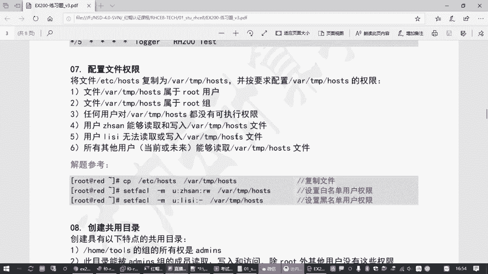

那刚才我们讲那个特别是讲那个访问控制列表的时候啊，它解决的是什么问题啊，解决的是我们文档的归属，它分类只分了用户组和其他人，只分了这三类吧，所以这三类分的太笼统了是吧，所以不够用吗，不够用。

于是呢出了一个访问控制列表，对不对，是这个样子的啊，然后呢那除了这种体制机制以外，我们在看我们这个文档权限的标记的时候，我们再看一下啊，l s杠l d h，我们刚才说你注意一下，我们说归属类别不够。

然后加了一种访问控制列表，你会发现后面那个点数变成了加厚了啊，这就说明这个文档他用额外的访问控制列表啊，所以大家用这个get fs l，你去看的时候哎你能看到不一样是吧，除了用户主其他人以外。

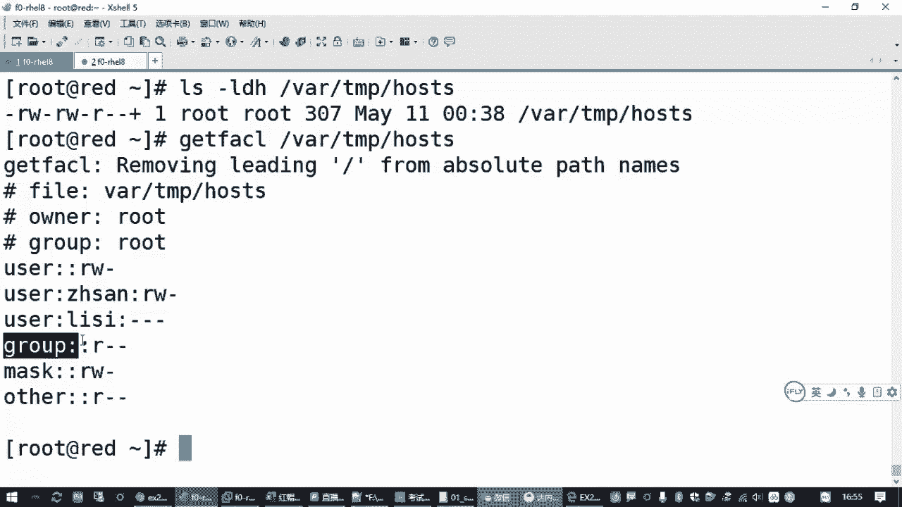

还会多了个别的用户或者个别的组啊。

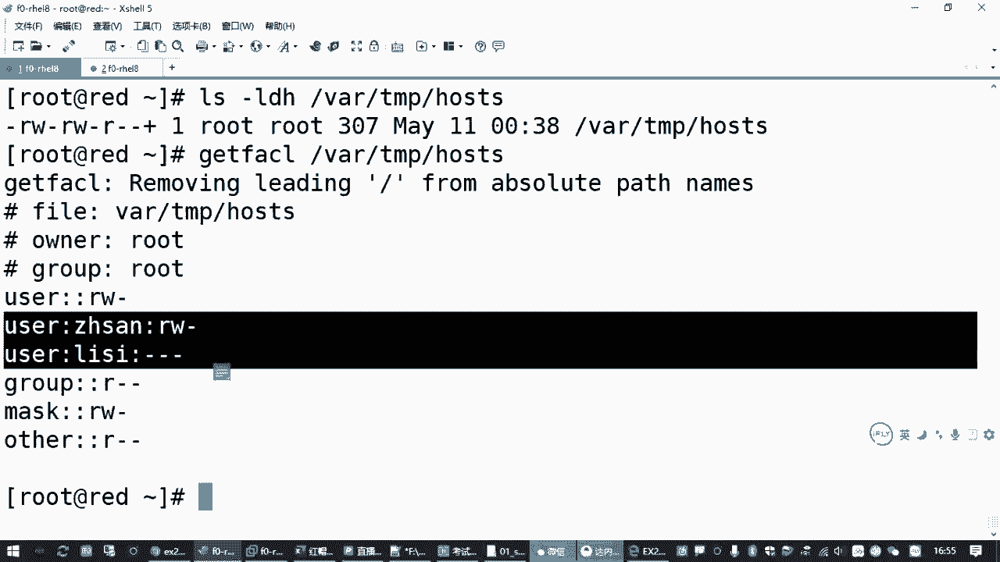

那除了这种操作以外，现在是针对归属的啊，归属分类太笼统，所以加了访问控制列表，那我权限是不是也分的太笼统了，只有读写执行，我有没有别的一些特殊的权限啊，答案是有的啊，因为在另一个系统里边。

你控制这个文档的访问的方式，那我们说rw x就是就是在控制访问方式。

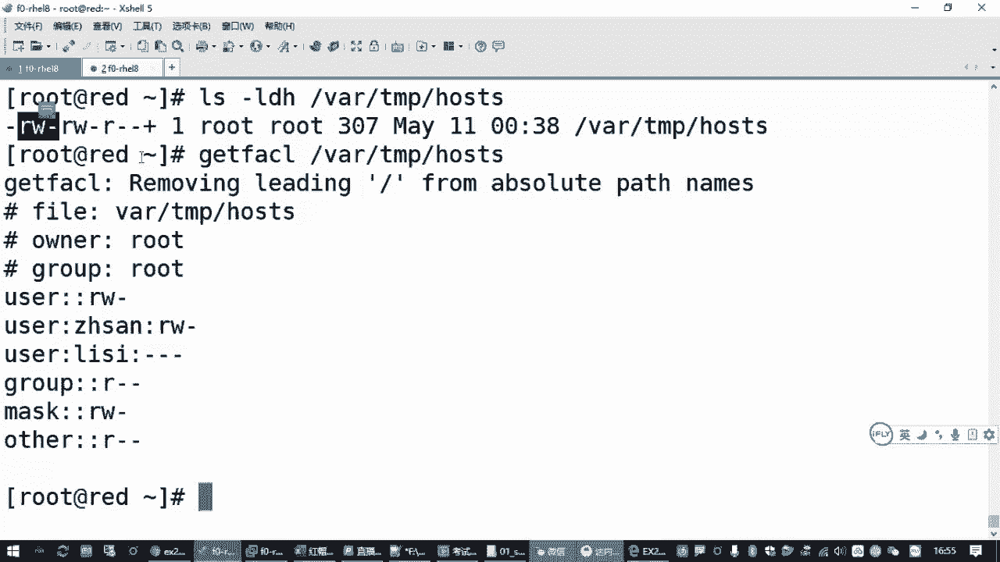

就在决定你这个用户对这个文件能做什么样的一个操作嘛是吧，你看我们说rw x虽然都叫r，但对目录和对文件它能做的操作是不是不一样的，含义不一样，那除了这些以外呢，那还有一些其他的特殊的权限啊。

还有一些特殊的权限，那特殊的权限有这么几种啊，来了解一下啊，这个笔记里写的比较多啊，所以我不能给你一个一个敲，那有一种特殊权限，什么意思呢，它可以让我们的一个程序文件，如果这个程序文件是属于张三的。

那你是在用张三的这个文件的时候，也能够拿到张三的权限，就是我家的钥匙，我给你，你是不是就可以开我家的房子了对吧，因为它类似于这个啊，上面刻皇帝的那个印章，开个标记上去说这就是尚方宝剑。

让别人拿到这套这把尚方宝剑，是不是就具有皇帝的一部分权利了，那我们linux系统里边有一些程序，它也需要有这样的一个特殊的能力，那这个时候呢我们一个有一个叫附加权限，这种特殊的复杂权限啊，叫什么呢。

叫seru i d啊，叫sert u r d，它的一个特点就是因为它没地方表示了啊。

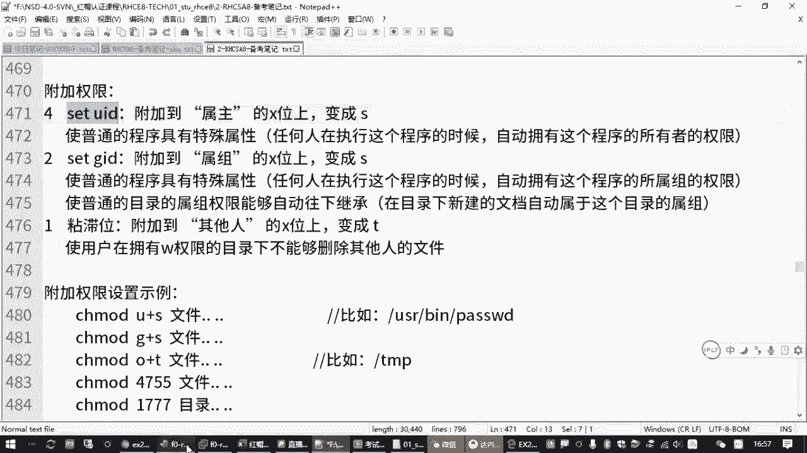

那我们刚才讲过了，这个表示权限的标记，从左到右不是九个标记吗，都已经在码了，那你说你这个文件要让用这个文件的人有别的权限要怎么办啊，没地方加了，就加到这个地方，加到rw x，我让这个x变得不一样啊。

变成啥呢，变成一个s，就刚才我们说的。

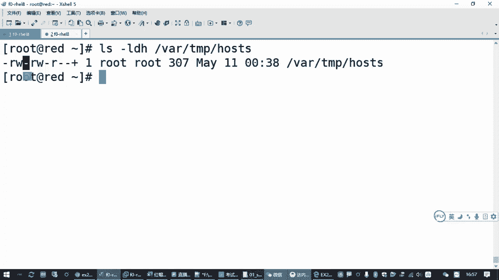

他可以把这个x位变成一个小小的s，它就具有了一个特殊权限，这是可以扩展我们一个程序的一个功能啊。

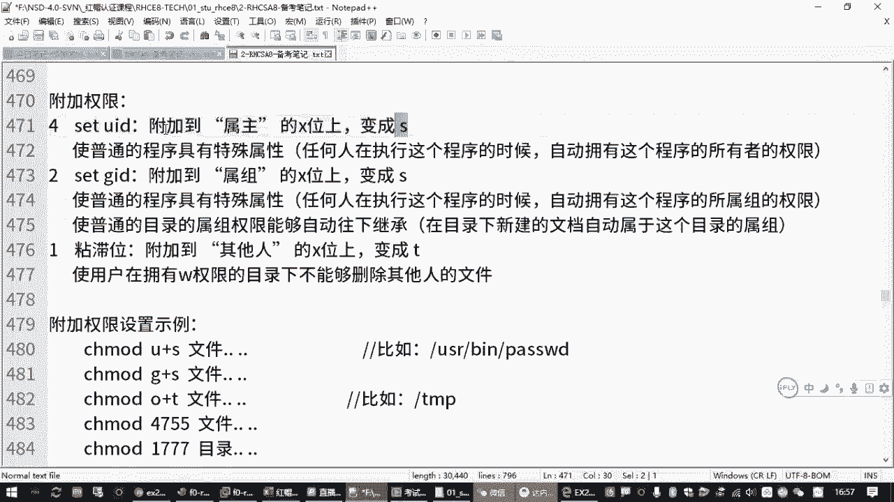

举个例子，这个不考啊，一会另外第二种权限要考啊，啊这个特殊权限呢我给大家说一下什么意思啊，比方说如果你是普通用户，我现在是李四，他是不是可以去改自己的密码password，你可以执行password。

然后先输入你原来的密码，然后再根据提示输入新的密码对吧，输入两次密码，如果正确输入密码就改对了，那李四他为啥能改自己的密码呀，有些同学说，那为啥不能改自己密码，本来不就应该能改吗，我告诉你实际上不是的。

那我们检查一下，我开始给大家讲过用户账号的密码是不是存在dc下的shadow里面，这个文件你看一下李四有权限吗，没有吧，你看root自己都没权限是吧，那李四他凭什么能有权限改密码了呢。

因为他改过的密码要存到这个文件里面去的呀，所以普通用户他是改不了的，那为什么普通用户用password能改啊，这是因为password这个程序他就是一把尚方宝剑啊，我们来看一下password程序呢。

在这个地方你看一下password这个命令程序的权限是什么样子，你会发现诶这个颜色都不一样是吧，你看它的权限，这个password这个命令属于root用户root组，但是和x位变成了一个s啊，啥意思啊。

就普通用户用这个程序的时候，它能够具有这一块对应的用户的权限，这叫具有执行权限啊，具有root用户的可执行权限对吧，那他获得了管理员的一部分能力，就好像皇帝把一把尚方宝剑给一个一个大臣一样。

说你拿到这把尚方宝剑，除了不能杀皇帝是吧，你其他的人都可以上对吧，那为啥你为什么你有这个权限，因为管理员给了你这个权限，因为管理员这个保健上有皇帝的标记对吧，所以这个叫s要加到这个地方，那我们怎么加。

那很简单啊，大家刚刚不是学过吗，清姬墨子，你要给一个程序加了s权限，就是u加s就完了啊，用户的权限加一个特殊标记，后边跟上user b password，当然这是默认的情况啊。

系统里面默认有一个这个程序有这个权限对吧，这个好理解吧，那你说我们能捏能不能验证一下，你把这个s去掉，我普通用户是不是就不能改密码，这个好说嘛是吧，咱们就把他的s去掉，u减s。

你看看这个是不是变成了一个普通的可执行程序了，linux系统里面你看的时候，如果是个绿色的，就是普通的文件，你有x权限，也是个普通的x权限，那这个普通的程序它不能改我们的下载文件啊，不能改下载文件。

但没有权限，除非你管理员自己自己用，那你你是去用来再来试一下，输入他现在的密码对吧，再输新的密码，回车再输入新的密码，你再看他能改成功吗，不一样吧，你看上面那个改的是successfully啊。

叫成功的，现在你改的时候是操作失败啊。

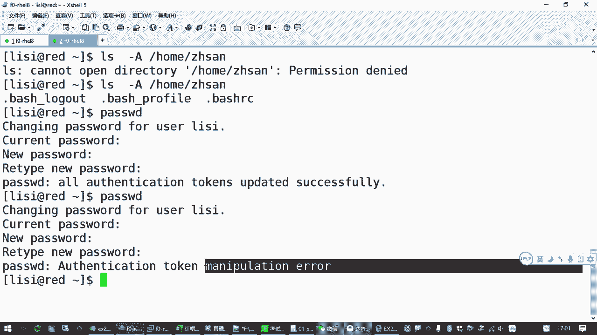

操作错误不行吧，这就是特殊权限的含义啊，这个权限一般要慎用，你如果给一个vim编辑器，给他一个suv，那么任何普通用户都能够使用vm编辑器改你系统里的任何文件，所以这个权限咱们不考啊，不考。

因为是系统有特殊用途的，但是我通过这个例子呢，是希望大家能理解这种特殊的标记权限，是可以通过修改这个文档的特殊的位置，把它改一下来实现的，那linux系统里面呢有三种特殊标记。

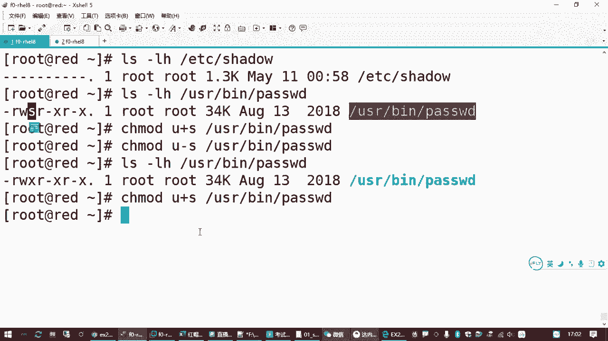

刚才我们讲的是第一种，叫附加到用户的那个x位上，叫sert u i d，它的作用就是让用这个程序的人，能够拿到这个程序的所有者的一部分权限，那如果我把这个权限不标记到用户这里。

标记到主的这里边，有什么权限，有什么能力呢，那这个权限一般不标记，不标记在程序文件上。

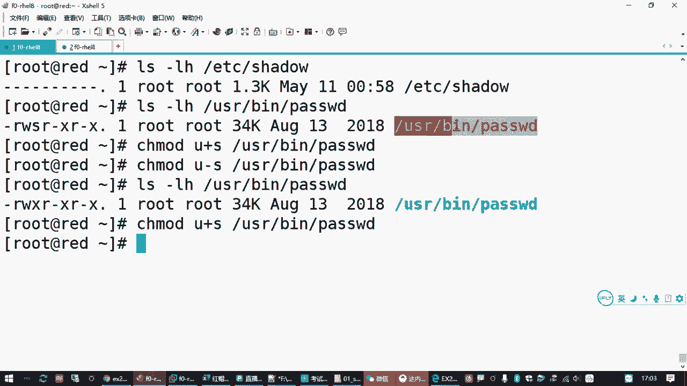

如果你是改组的xv，把它改成s这个选项叫sj i d，如果你要标记的程序上也行，那类类似的啊，和su i d是类似的，但是如果你把sg i d标记到目录上，那么它有一个特殊的很神奇的功能。

如果这个目录属于那个，比如麦当老祖是吧，如果这个目录属于麦当劳组，你给他加一个色彩加i d，那么在这个目录下增加了任何的文件，自动属于麦当劳主啊，就具有这样一个能力。

所以使普通的目录的主的权限能够往下继承，就好像我们有家房子，那个房子是我的，那你把你的手机放在这个房子里边，你不管了，那个那你的手机，那个手机就是我的对吧，具备这样一种能力，当然这个能力你要标记一下。

你不标记的话，你不能你带个手机进了一下我的屋子，你手机就归我了，那谁也说不过去啊是吧，你管理员管理管理员呢要声明一下啊，怎么声明呢，你只要给目录添加一个x权限就可以了，哦，不是添加一个sert权限啊。

就把原来的普通的x变成一个特殊的权限。

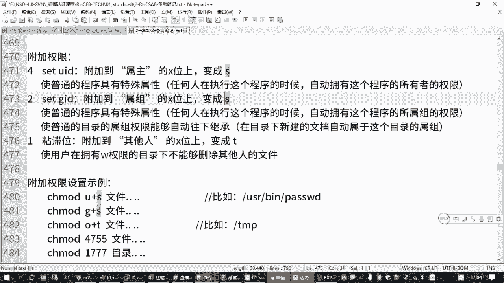

怎么操作呢，那就清姬末的g加s吗，刚才我们讲的是又加s是吧，那就g加s那就可以了啊，那就可以了。

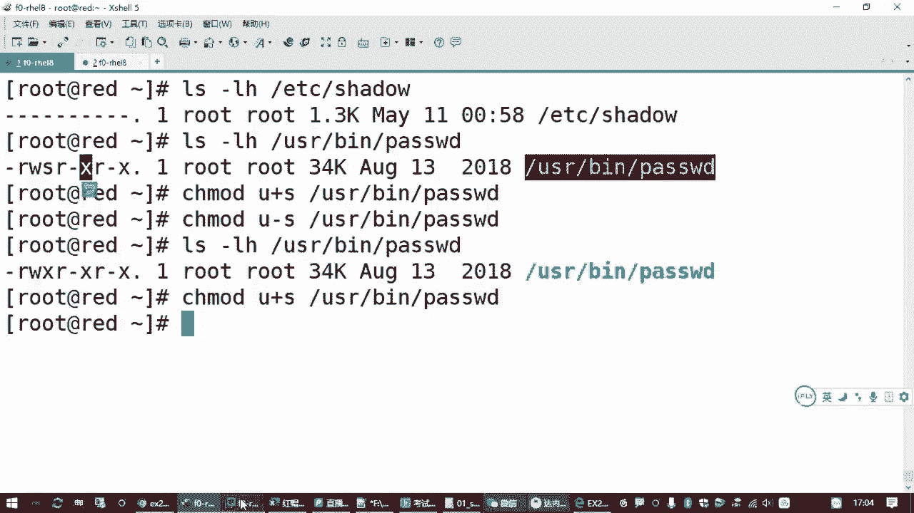

那这个有一道题目就是咱们的创建公用目录，创建公用目录，那这个题目的话呢，那我们来看一下，比方说toos是要创建一个目录，这个组的所有权要属于i的m，然后这个目录呢要被艾特命组的成员读取写入访问。

又来设权限了，最后这一条在这个目录下创建的文件组的所有权自动属于a的min 4组，那这一条就得通过刚刚我们给大家讲过的这个sgi d来完成，来我们看例子。

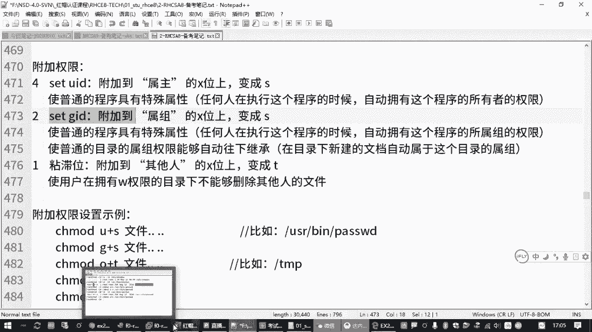

先看需求是吧，你要创建目录吧，这个没跑是吧，对不对，你要创建一个这个目录啊，所以呢我们来看一下mic dr创建一个目录吧，home下的tools，然后呢然后呢这个目录你创建完成之后，按x看一下它的权限。

你管理元件的吧，属于露台用户，属于露台主。

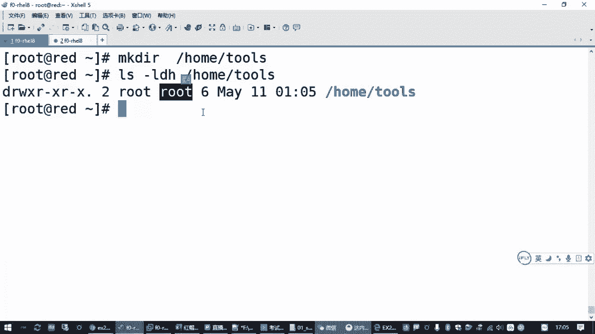

然后默认权限是这个样子的啊，你看看要怎么调整权限。

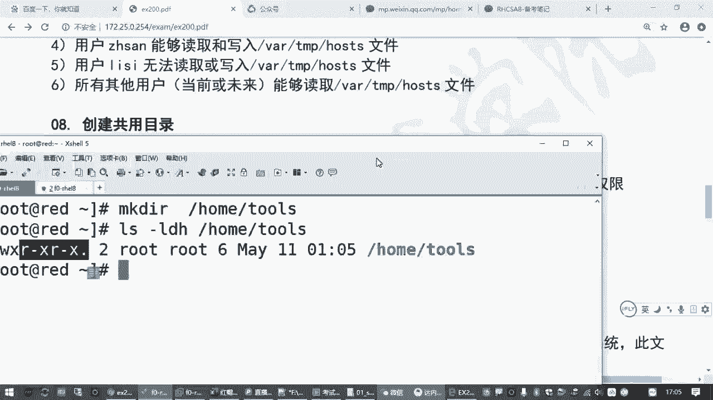

来看一下，对照一下啊，能被admin组的成员读取，要属于admiss组吧是吧。

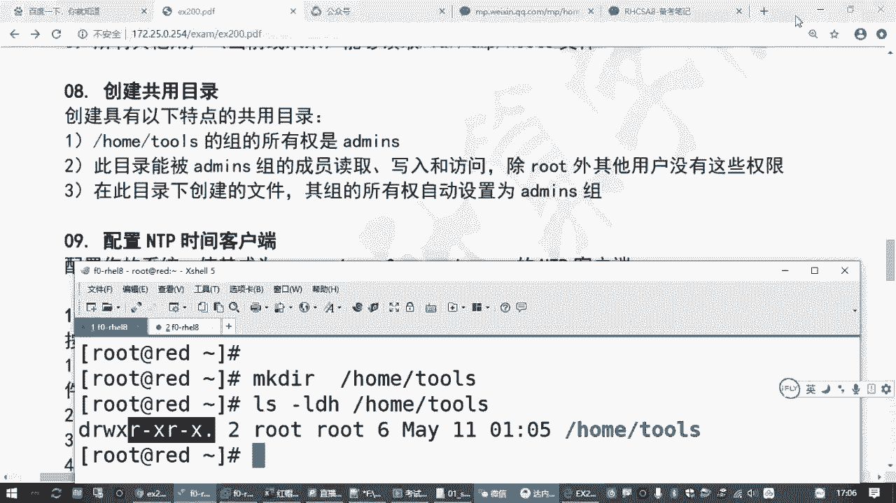

来先把它的归属改一下，需要改吧是吧，你不改不行吗，change oro冒号，按照mess组啊，这个组是之前用户用户管理那道题做的啊，改成属于这个组，然后刚刚这个目录改完之后，再确认一下。

现在属于i的in是这个组啊，然后这个组的成员呢要能读能写，能访问，默认呢不能写入吧，你是不是给他加w权限，然后除了录制以外，其他的用户没有读，没有写，没有访问权限吧，对不对，那你什么权限都没有啊。

那其他人的这三个权限要去掉，你说吧还要去找。

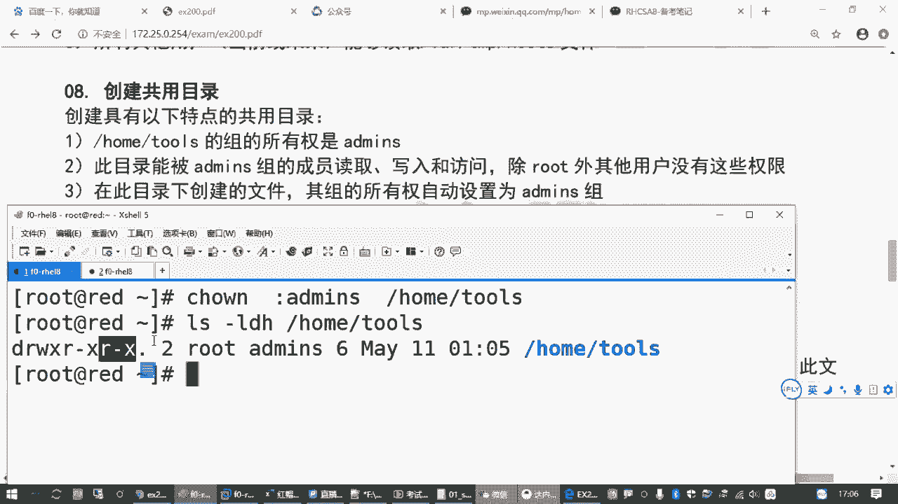

然后呢，然后我们先把这两个搞定，第二条啊，趁机摸到同组的人是不是要加上w g加w，你如果你懒得去验证原来的权限，那就是同组的人等于或者加都行啊，rw是不是这意思啊，能读能写能访问嘛。

然后其他人什么权限都不能有吧，去掉rw x再变成这个目录权限，是不是应该是这个样子的，这样的话呢，add means组的用户才能读能写的访问吧，其他人除了管理员以外啊，管理员例外，这是特殊用户啊。

其他人不能读，不能写，不能执行，搞定了吧，然后第三条这个目录下创建的文件要自动属于i的mix组，那如果你不设置的话，它没有这个能力啊，比方说你管理员去home tools这个目录下面呢去创建一个文件啊。

叫root一点，tmd这个文件属于谁呢，来我们看一下属于谁呀，你管理员建的当然是属于管理员呢，谁建的属于谁呀是吧，不符合题目要求吧，题目要求你创建的文件呢自动属于按照面是这个组啊。

你现在看还是属于root组对吧，那如果希望他能够具备这个能力怎么办，你要把这个home tools这个目录这个x权限要加成s怎么加呢，去进末的g加s啊，然后跟上这个目录，让这个目录具备这种特殊的能力。

你再来看是不是r w x变成了rw x，你加完这个之后，是不是真的就有这个神奇的功能呢，咱们再touch一个文件啊，用touch去创建一个文件啊，他写命令呢其实就是创建空文件的意思啊。

本身的意思呢就是mv吧，就摸一下那个文件在不在这个文件，如果没在自动创建这个文件啊，来touch root 2点tx t对吧，然后我们再去看这个文件，root 2这个文件啊能能看到吧。

属于i的mean是这个组啊，那么这个题就搞定了，ok吧就搞定了，那这是刚才我们给大家讲到的创建公用目录，那这个题目的话呢，呃其实刚才我们讲了几个操作啊，来整理一下，从前面的给你处理一下啊。

我们直接把这个目录删除，重新来一遍是吧，那答这个题的时候呢，第一个首首先是创建目录，从这个开始的吧啊然后第二个改归属关系近几oh no是吧，这是第二条命令，第三条命令改权限，我刚才给他演示的时候。

是不是做了这几个这个吧，改权限第四条我们是不是改了一个单独为g加了一条，这个好像不能在这里直接写r w s，你可以试一下，然后给你试一下，直接写一个等于rw s行不行啊，这样还行。

就是你可以做这一条这一条这一条可以吧，三个操作三条命令啊，创建目录，然后呢改权限，然后改归属下载命令吧，确认一下结果就知道了哈，你看还不对还不对，那还是得四条命令啊。

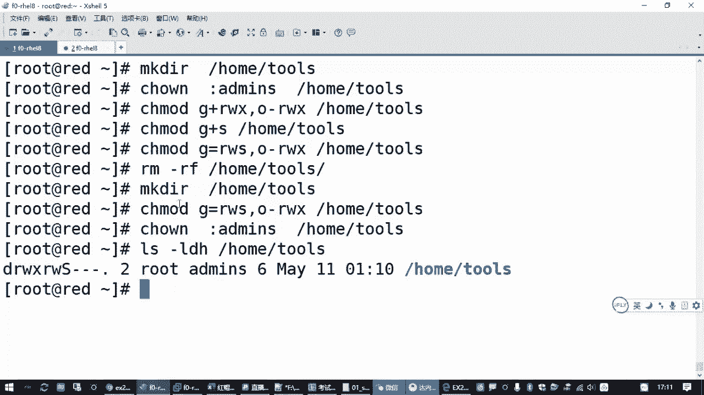

就这四条命令是吧。

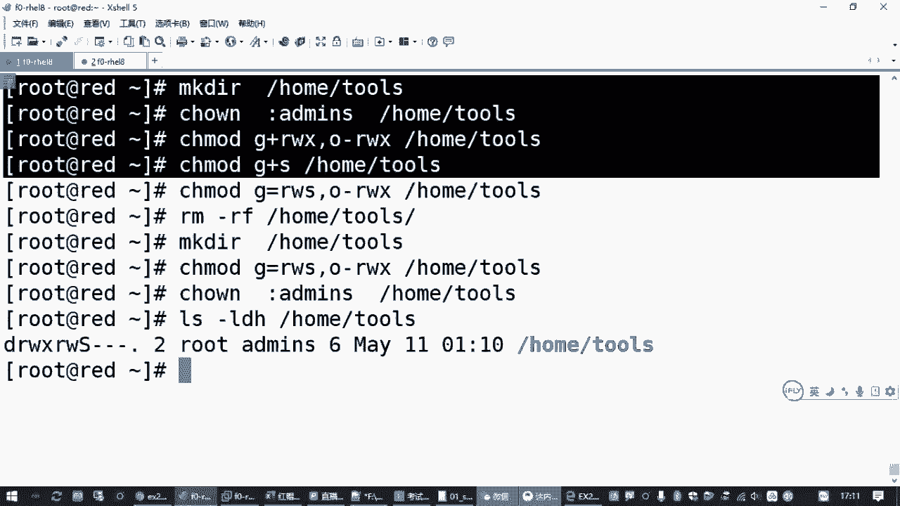

他这个大s不行啊，大s相当于没有x权限啊，不行，你还得分着来啊，建议大家分着来，所以这个s是在x的基础之上再加了一个s啊。

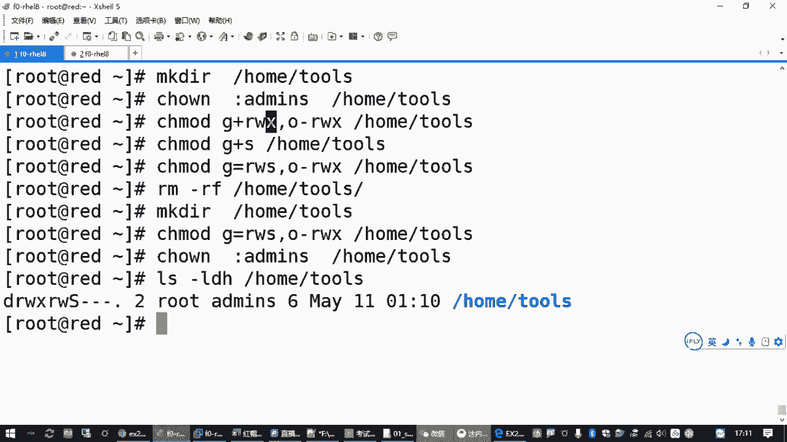

ok吧，那这是刚刚共用目录这个题目呃。

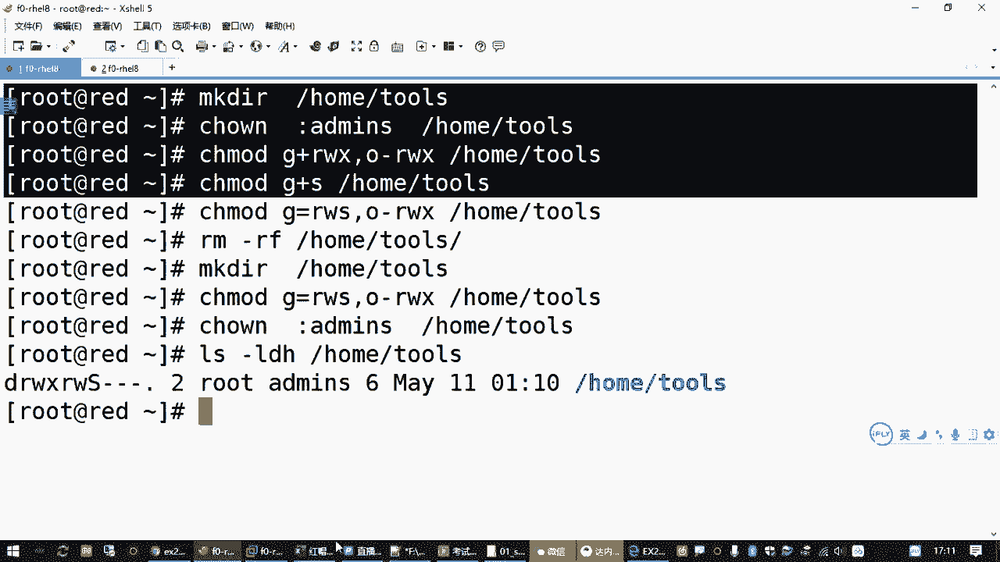

然后关于权限这一块的话呢，有一个叫数字标记啊，八进制的数字标记，这个呢咱们考试的时候你不会也没关系，因为有些同学是刚接触linux没多长时间，那如果大家已经会这个二进制标志嗯，八进制标志的话呢。

可能你做题目更容易，但这个不太好理解啊，我在这里给大家说一下啊。

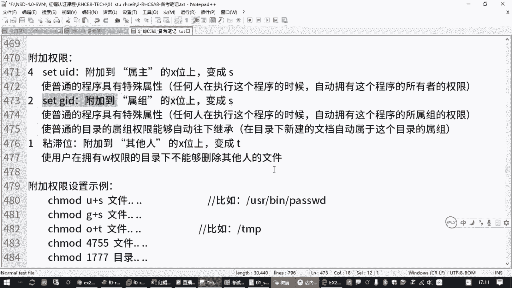

说一下啥意思呢，就是我们说这个数字的标记啊。

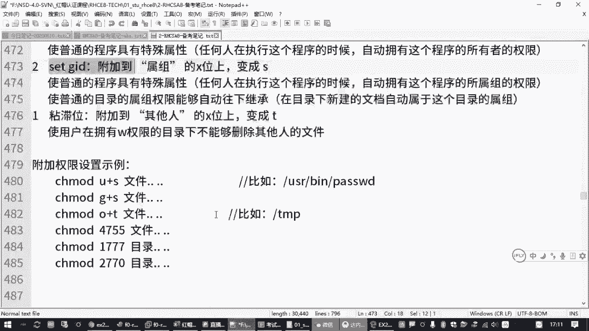

其实说实话就是管理员偷懒啊，就管理员偷懒，就比方说我们在设置一个目录的权限的时候，你看像这种权限，我们要把它改一个权限，是不是有九个标记都要做呀，啊用户的权限组的权限，其他人的权限都改到麻烦吗。

所以呢啊然后我们linux机制里面有一种表示方式，就是我们把这个r用八进制的数字四来表示，嗯w呢用八进制的数二来表示，按x用一来表示，所以r w x就是421，然后针对用户的权限。

比方说所有的所有者的权限，我们把这三个数可以加到一块，从左到右421，然后所属主的权限也是421是吧，然后other的权限也是421，那如果你有这个权限呢，这个数字就加上，如果没有这个权限，那就是零。

那你像这种的啊，rw减是不是相当于4+2 x曲线，没有什么加零啊，那这一块就变成六，中间这个选项呢叫r杠杠，只有读选项，那就只加一个四，那其他什么权限都没有，那0+0+0嘛。

这样的话呢简写的方法就是640对吧，就640，同样的如果是这种方式，那rw x3 个都加起来就4+2+1就是七，那4r杠x那就4+0+1就是五，所以这种标记呢就可以用三个数字来表示755对吧，1755。

所以你像刚才我们说了这种权限，你要把它纠正的话，其实用权限表表示表示啊，用那个数值数字的方式表示，其实就是清静默的这个r w x是不是就是七呀，然后同组的i的mix用户是不是也要有权限啊。

是不是也应该是rw x也是七，然后最后a的什么权限都没有，是不是一个零啊对吧，你得表示成这样子，然后后面再跟上这个目录，这是表示基本权限就是这个样子的啊，但是呢这个s我们刚才是不是没动对吧。

那这个特殊权限是不是也不能能不能引用数字表示，还答案是能啊，那刚才我们表示的是基本权限啊，就三种归属的基本权限是用这种三种数字表示现在，但是这个这个表示方式呢，你没有影响到这个s，没有影响到这个s。

所以如果你直接用数字表示呢，这个s你表示表示不上去，那要表示上去怎么办，特殊的权限。

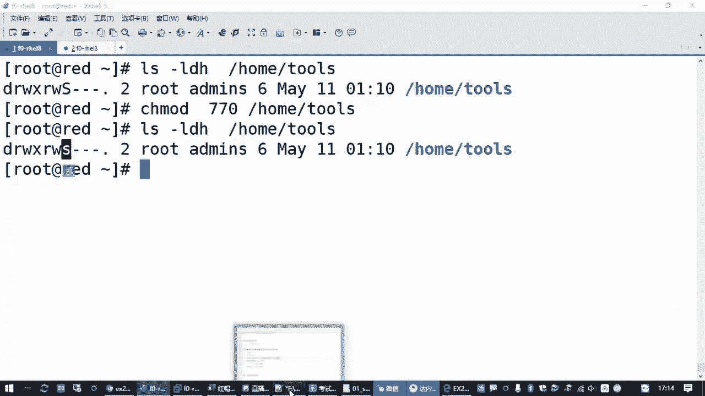

刚才我们讲过两个共用的呃，创建公用目录set的ui d也是4g i d l啊，那咱们表示呢要在刚刚这三个数字的基础之上在前边加一个数啊，第一个数如果你想去掉这个权限，你这个也去不了是吧，增加可以啊。

减没减去，我给你还原一下，先来一个g减s是吧，那它默认的选项呢是这个样子的对吧，那其实呢你要增加特殊权限，现在是没有的是吧，你要加到哪呢，要加了这三个数之前啊，怎么加呢，如果你要加到这个地方。

用户的这个xv要写个四，如果你要加的是这个位置，你要把它变成一个二，如果你要同时加呢，要写个六这种方式去讲，所以你要设计一个g加s就是2770啊，你看加上了吧对吧，你是一个这样的啊，哦对吧。

这是用数字表示啊，这不好理解啊，特别是初学的同学，对这个地方呢就很难琢磨啊啊，然后刚才我们讲共用权限的时候，还有个地方，我们不是讲了两种吗，su i d还有一个设的g i d，另外一个年之位。

年之位这一块的话呢，这叫年制位啊，什么叫年制位啊，就跟吃口香糖那个口香糖嚼完之后，那个粘在你手上甩不掉一样的啊，那他可以拖住一个特殊权限，让别人不能轻松的去用，拖住啥呢。

比方说他可以附到一个目录的阿泽的x位上，把它变成一个t英文单词叫sticky啊，就是爱爱手爱脚的蹑手蹑脚的啊，就拖后腿的，怎么个拖后腿呢，它可以让一个用户即使对这个目录有w权限写入权限吗。

用户如果对一个目录有写入权限，那么它可以改这个目录的内容是吧，什么叫赶目录的内容，它可以删除目录底下的东西，删除目录底下的东西，就是改目录的内容，改目录内容的一种嘛，但是如果你这个目录有t权限。

它就不能删啊。

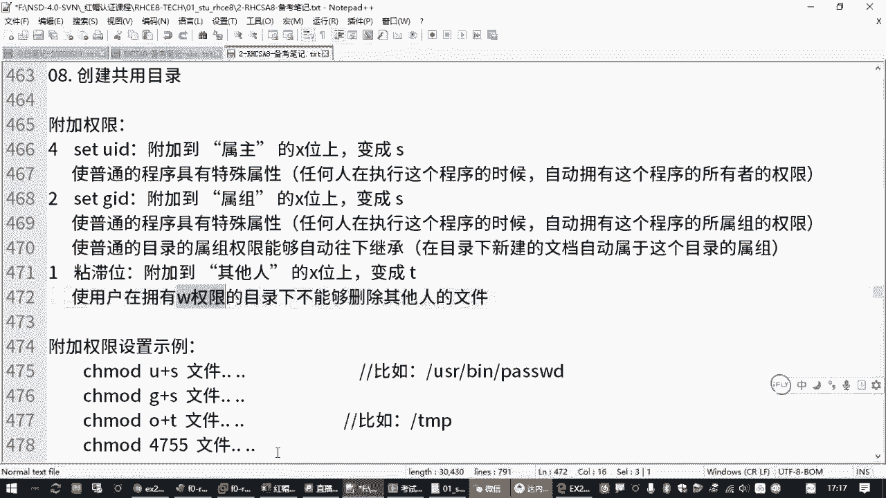

啥意思啊，举个例子，这个咱也不考啊，再给你说一下，补充一下，比方说咱们系统里头有个特殊的目录，根下的tm b，诶这个东西现在没有那个权限了，是不是都没有了，那现在不用了吗，啊都没有了啊。

我举个例子吧是吧，那以前呢是tm b这个目录，他原来是所有人都能写的，好，看错了，应该加个d是吧，这个看目录本身啊，有有有别给误导了，就看这个目录本身啊。

刚刚忘了加了个d加上那t m p这个目录是不是所有人都能读，能写能执行啊，那么普通用户都能去这个目录下面去创建子目录，创建新的文件，他也能去这个目录下面去删除别人的东西，那这不是乱套了吗。

你管理员刚刚跑一个程序里面建了一个临时文件，来张三跑过来吧唧一下，把他给删了，不行吧，所以虽然我给你公开这个权限，但是我要有序的去管理，还因此呢加了一个什么，加了个t。

所以你管理员在tmb下面建一个文件点txt来写一个root。data，那么你张三你是删不掉的啊，李四也删不掉，你想去删除tb下面的root这个文件被拒绝了吧，但是如果你把这个题去掉试试哈哈。

如果你把这个t权限去掉，怎么去呢，清姬墨子a则减t tmp再看没有了吧，那现在失去了这一层保护，这个秩序就乱了啊，你看分分钟李四就把root这个文件给干掉了对吧，这很危险吧。

所以但凡linux系统的tm p这些目录一般都会给它添加上这个年制位权限，意思就是说我管理员给你普通用户能让他在这个tm p下边有写入权限，但是你只能写你自己的文件，你写三root的文件不行啊。

但是呢你可以去自己创建你的文件都没问题，你具体的文件你可以删，但是别人的文件你别想好。

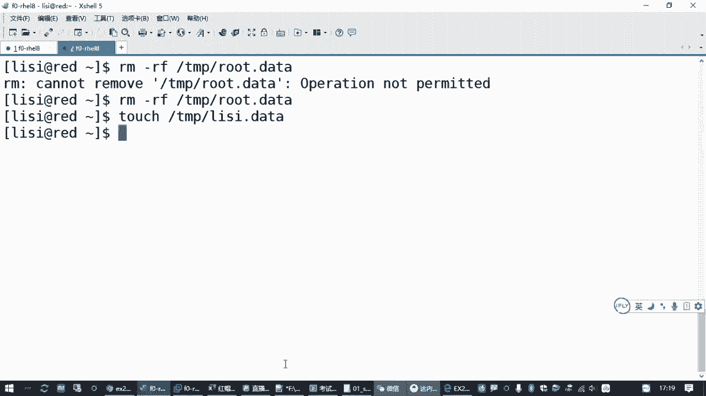

再给大家补充了一个年之位，因为它都是都是属于一类的啊。

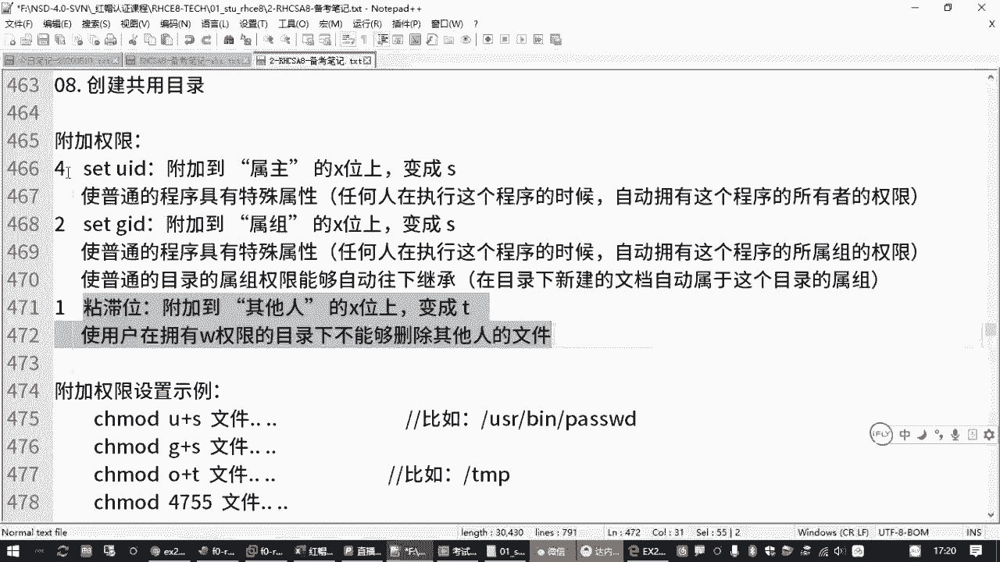

你看这叫附加权限，附加在哪，就附加在一个文件或者目录的用户的xv或者主的x y，或者a着的x v来实现一些特殊的功能。

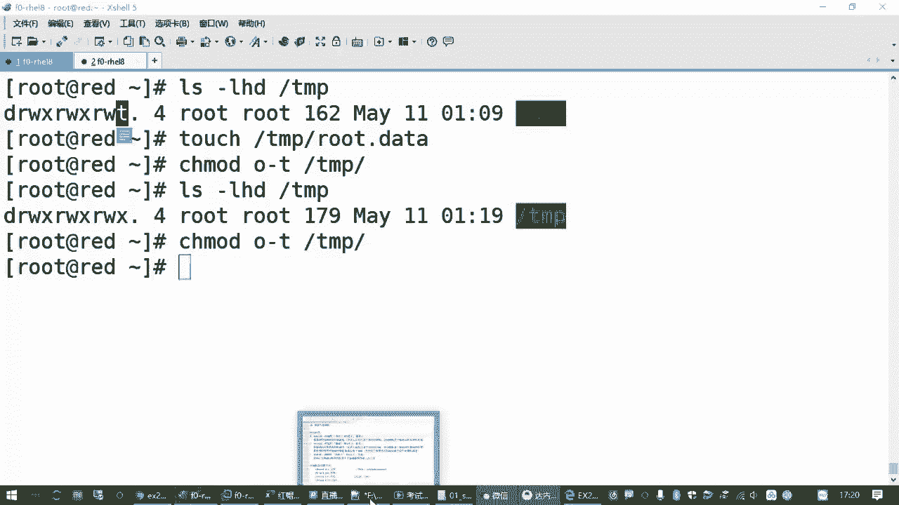

咱们上午的考试就考试的g d让这个目录的主权限能够往下继承。

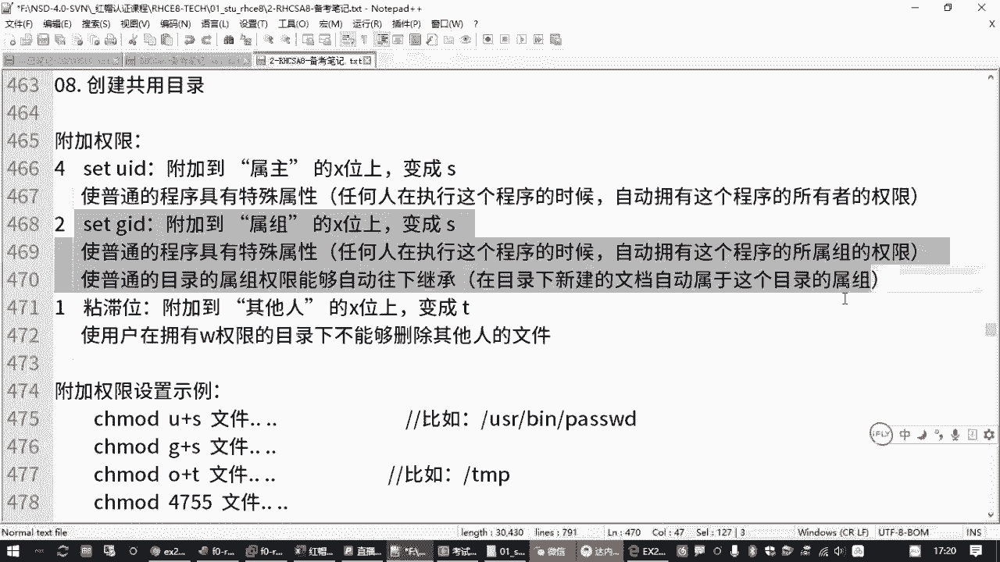

ok吧。

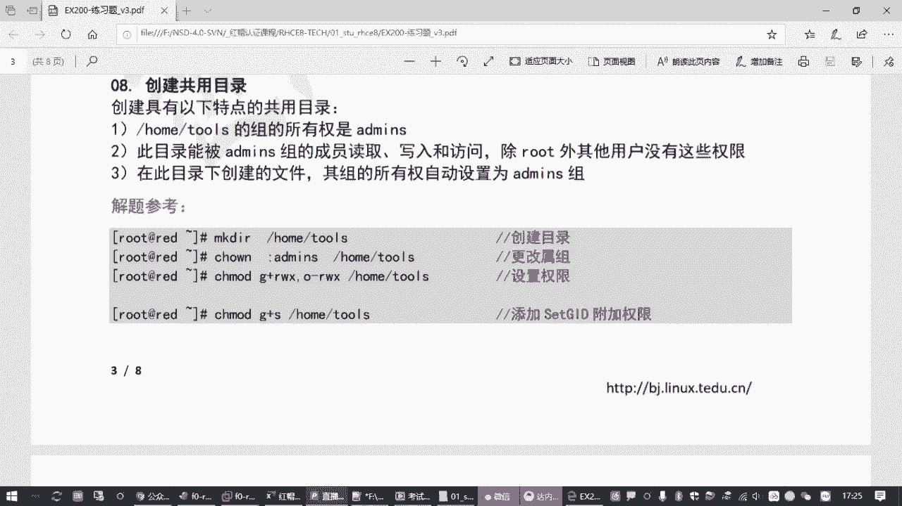