# 全网最全RHCE红帽认证全套入门教程 - P15：3.01-NTP时间同步 - 达内-程序猿 - BV1f64y1q7b5

就是在咱们的练习练习环境里面啊，大家可以访问我们的呃study。lab，零点am a com是吧，然后exam啊，你打开这个可以看到我们那个练习题还记得吧。

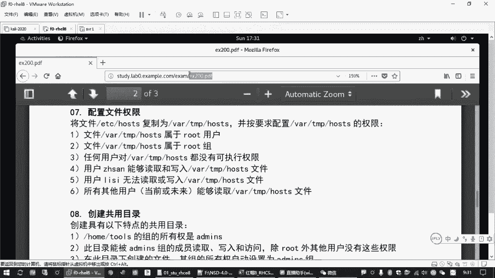

那打开之后呢，后面有个ex 200啊，你看到是这样的嘛是吧，里面有个ex 200是我们那个上午的练习题目。

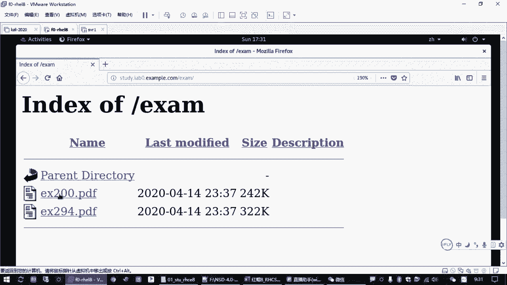

那打开之后呢嗯再看根据这些题目我们去练习就好了啊，呃那上次前两次课，我们分别是给大家讲了我们的红帽八操作系统的一些基本环境啊，包括我们的一些基础命令。

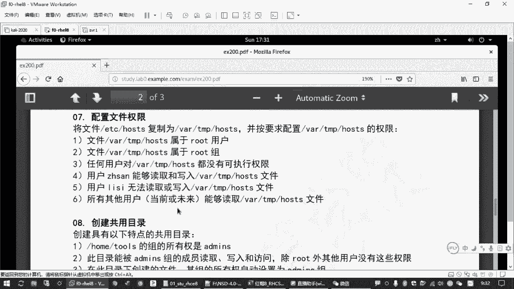

那上一周的时候呢我们讲过了前面的这些部分吧是吧，就针对我们那个red这台主机呃。

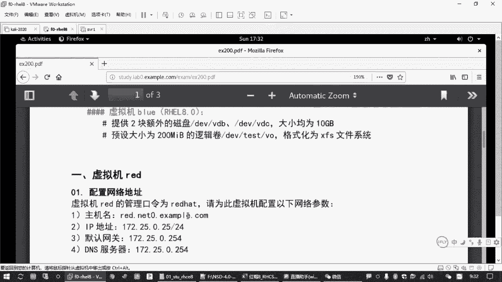

应该是讲了我们的软件仓库配置啊，clinux调试啊。

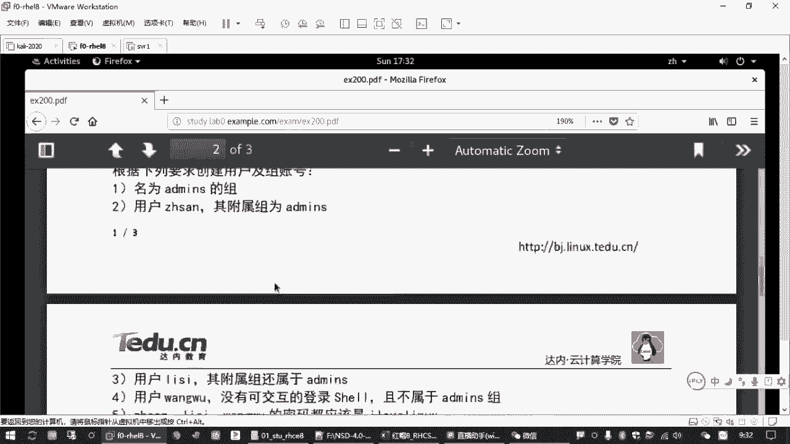

用户账号管理是吧，计划任务权限啊等等等等啊，那今天呢我们继续往后看呗啊啊然后有一道题目呢是。

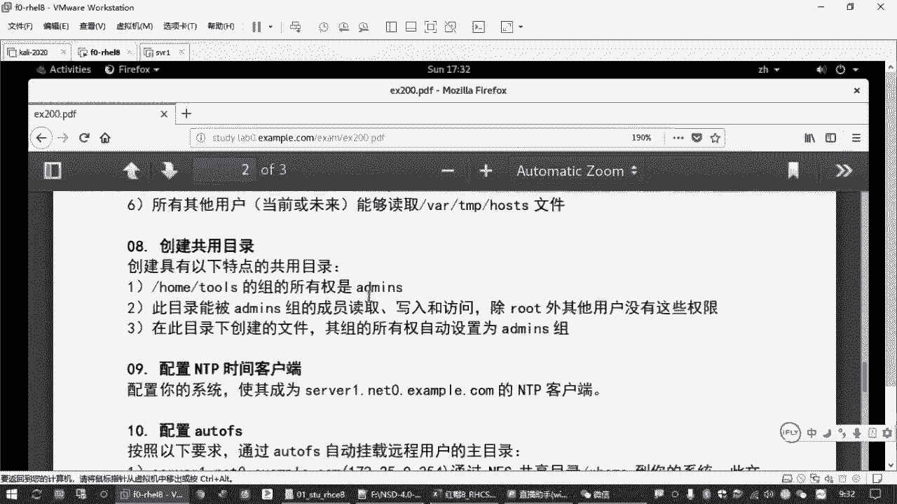

配置nt p时间客户端啊，一到这个题目。

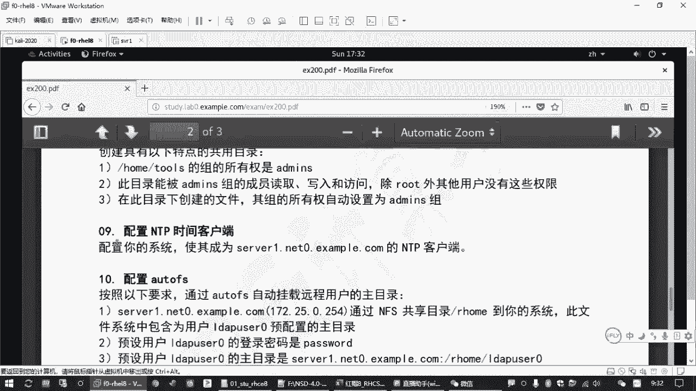

那这道题目的话呢，它总共等大家考试的时候，你会发现他总共其实就一句话呃，要求在你的虚拟机上去做相关的一个配置，让它成为我们server一这台主机的nt p的一个客户端啊。

正式考试的时候呢啊这个域名可能会换啊，反正大概意思就是说他会给你一个域名啊，这个域名呢是一台n tp服务器，它要配置你的系统作为这台nt b服务器的一个客户端对吧，所以你要答这个题的话呢。

大家大概理解我们n t b是个什么东西呃，然后我们的客户端怎么去配置啊，把这个理解了。

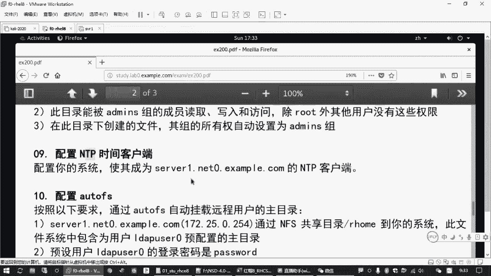

这个题其实就很容易啊，嗯那我们讲的nt p的话呢，呃其实它指的是叫network time protocol啊，叫网络时间协议呃，通俗一点说呢，就是通过这个协议。

我们可以把一个标准的时间推送给一堆计算机，那其中呢提供标准时间的这台机器叫mtb服务器端，然后使用这个标准时间的那些客户机呢，那就是nt b的客户端对吧，就这个呃。

那其中呢我们通常说mtb把它叫做时间同步，那指的就是说我们一堆机器都要和你提供实践的那台服务器的时间，保持一致，啊咱们有很多同学是工作过的啊，可能之前用过一个做时间同步的服务，叫n t p d对吧啊。

那其实从我们红包七开始啊，嗯他就换了一个服务啊，就下面这个叫chloe软件包也换了一下啊，叫clay，那我们考试的这个点呢，其实是让大家呢要知道chring这个b它的一个配置啊，这个保险装完之后呢。

对应的一个系统服务叫ctrl d，那那这个服务的话呢啊其实它既可以作为ntb的服务端，也可以作为我们的客户端啊，都是可以的啊啊当然咱们考试的时候。

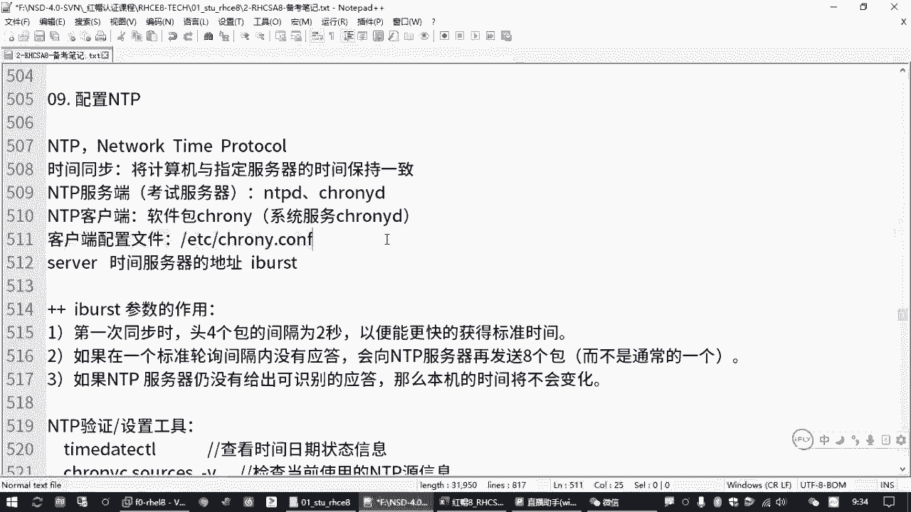

刚刚大家也看到了是吧，它是要求我们作为nt b的时间客户端啊，做服务端咱也不用管啊，就你只要知道你作为客户端怎么去找这台服务器来要标准时间，然后你能确认结果不就好了嘛是吧。

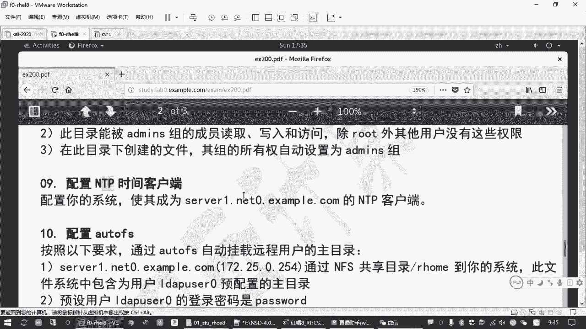

呃那如果我们作为n t p客户端的话啊，那基本的配置过程其实就是装包配置起服务啊三个步骤，而且大多数情况下这个包默认是装好的啊，啊cloning这个包默认是装好的，那如果没有装的话，你装一下不就完了吗。

啊很简单啊，那它的配置文件呢是在etc底下有个叫ring。c o n f啊，有个这个，对吧，那比如说我们考试的时候啊。

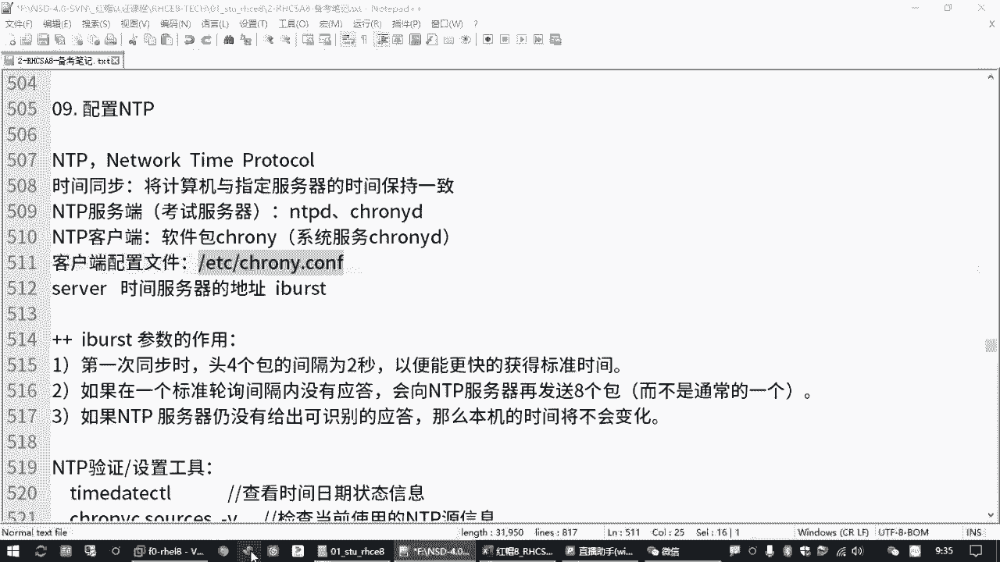

我把环境连一下，那考试的时候呢，从我们的增肌s加做的方式，用root账号连接到我们的要求配置的那台训机，嗯，然后前面我们不是已经把那个样子什么都配好了嘛是吧，那我们可以让我告白。

install是安装cli，嗯那这个包的话呢在考试的时候90%以上的可能性，他是已经帮我们装好的啊，这跟那个计划任务有点类似，就系统它需要有这个包啊，来确保这个时间同步。

嗯但是呢他找哪一个地方是同步的那个默认的时间那个圆啊，来源可能不是我们要的是吧，那肯定要改啊，所以这第一步一般情况下我们不用做啊，但是大家要去确认啊，那万一他给你埋个坑放的是吧。

好这里他告诉我已经装好了是吧，嗯那我们再来去改它的配置，那在改配置文件的时候呢，是vm去找我们的好，etc下面的cloning。c o n f好改这个文件，这个文件打开之后呢。

你可以发现它里面有很多现成的配置，嗯，基本上呢就在第三行左右吧，它有个时间服务器的一个地址池啊，地址池的一个配置，这个是我们装好包之后啊，它默认是指向和ntp。o r g有在一个网站，它里面有一堆啊。

有一个域名是吧，他给我们设置的是一个这个啊，这是就是说你如果不配，但是你这个机器呢如果能联网的话，他也可以找我们互联网里的这台服务器去同步时间，但是实际是实际上使用的时候啊。

你访问这个服务器不一定速度很快啊是吧，这是国外的一个网站，那工作当中呢我们可能要把它改成我们自己的服务器，那考试的时候呢。

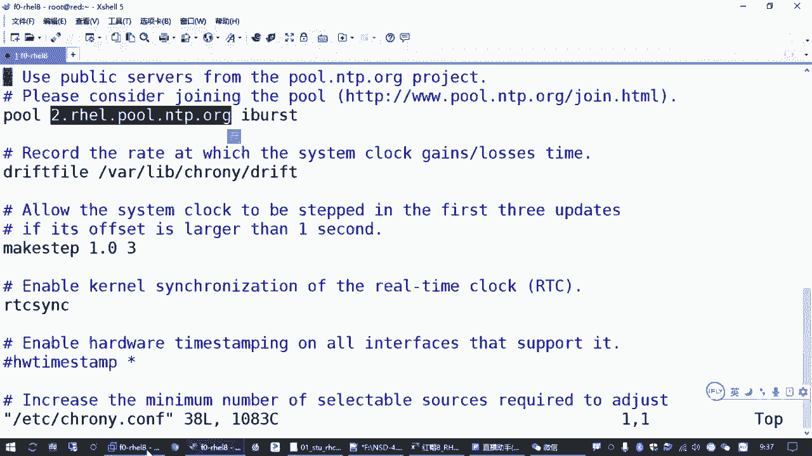

他就要求我们把它改成so为这个吧是吧啊，要改这个啊。

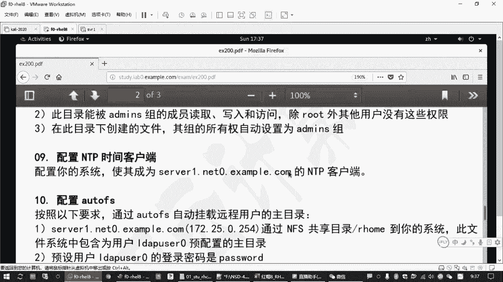

所以其实我们要达到效果的话，最简单的一个做法，我们只要把这个中间这个域名改成题目要求的这个域名就可以了，啊就是从效果上来说啊，从效果上来说，你只需要把它改成题目要求的。

正确的那个nt p服务器的域名骑士能够达到效果啊，但是不是特别规范啊，为什么呢，呃因为我们这个破这个设置啊。

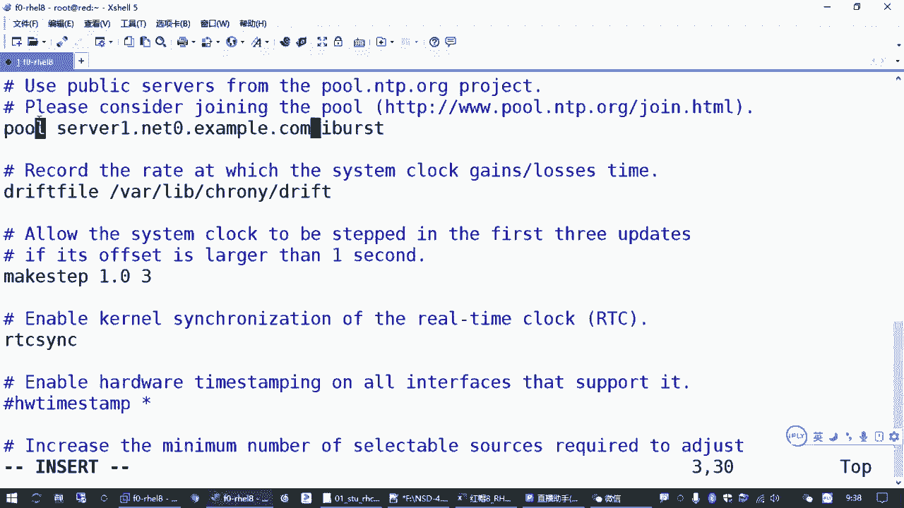

就给你写了是吧，啊没有，我给你加一下啊，就是我们在配置这个配置文件的时候，有两种写法，一种呢就用那个sl来写，还有一种呢是用破号叫p o o l是吧，这下面一个地址池，那这个设置呢它是针对一堆服务器啊。

给你解释一下是吧，其实也能用啊，就是说pl后面它这个时间服务器一般指的是，一般我们都设置的是域名啊，这个也是域名写的更准确一点是吧，那这种情况呢，后面这个域名，在dns服务器上，它会解析为一堆ip地址。

这样的话呢那我们的客户端你只需要用这一个域名就行啊，你后面那个时间服务器他换了无所谓，他只要换了个解析记录就行，你反正这个域名呢始终是可用的，这种情况下呢，一般才推荐大家用破是吧。

你像它默认的n t b官方提供的是吧，那一个域名呢那好像有七八个服务器嗯，但是像我们考试这种情况，更规更规范的做法实践，大家用so啊，这个图更靠谱啊，那这种情况适用于这个域名解析为单个ip地址。

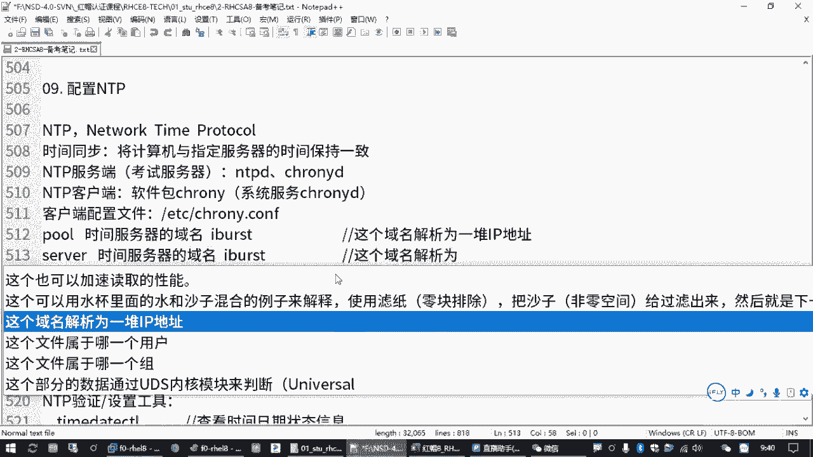

这个是加个叫mtp服务器的是吧，所以这个地方区分一下啊，区分一下，啊两种情况，两种情况一般建议大家用下面这种啊，咱们考试的时候就一个服务器吧，这也就一个ip是吧，改成搜索就行啊。

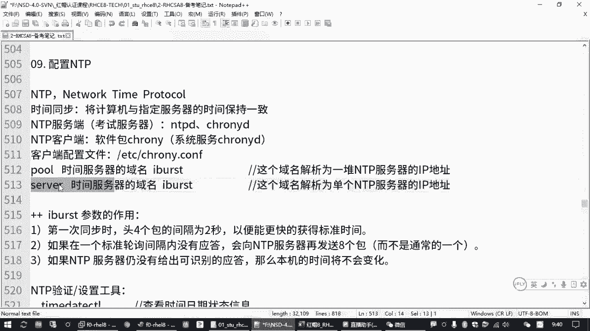

那大家如果你要增加一行啊，增加一行solo也是可以的，但是请大家把之前那个破那一行给注释掉，为啥因为他连不上是吧，那按照顺序来连不上，他先找那个连不上的服务器，他连不上的时候呢。

他就没有办法去同步时间啊，这个你要知道啊，所以要把它去改一下啊，这最好的改完之后呢，我们保存退出，其实配置mtp服务器就这一行，那中间有个ibs的建议，大家保留好。

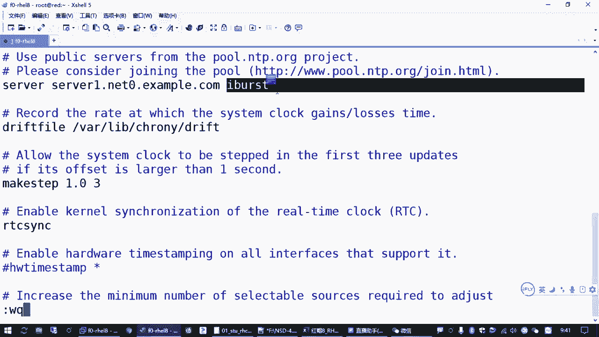

建议大家保留呃，这个是起什么作用呢，这个是我们在同步时间的时候，客户端其实就是我们这个一会要起一个服务，这个服务呢它有一个叫iboss的这个参数在找我们。

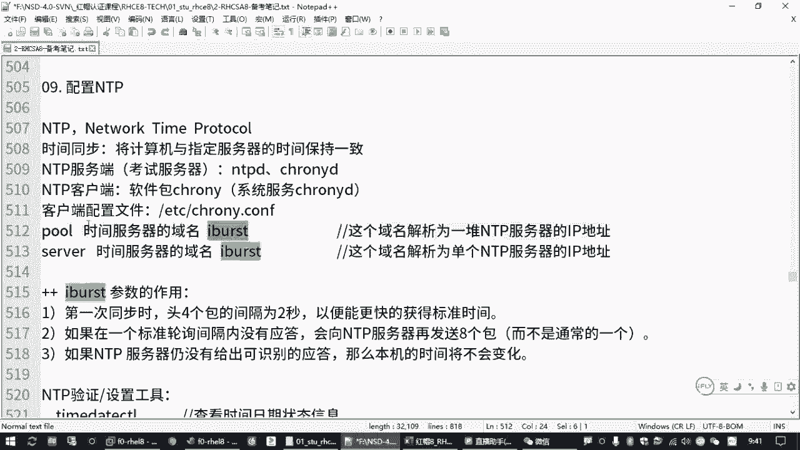

在在找我们这个时间服务器的时候，然后叫i boss啊啊他的一个作用是在第一次同步的时候，他投四个包，还有个间隔是吧，是两秒钟，然后呢呃为为啥就是说我在找那个服务器。

我一开始我要更快的找这个服务器去同步时间，看这个服务器能不能联系上是吧，它会有一个这个人群的一个间隔啊，这个了解一下就行啊，然后在指定的一个标准间隔里面，如果没有获得应答，他会快速的再发育对攻啊。

再发一堆包，那发这一堆包是为了啥，是为了找我们这个服务器确认他能联系上，那如果联系不上的话呢，他觉得你这个时间没有必要同步是吧，他本地的时间不会做更改的啊，就起这个作用的啊，啊所以咱们考试的时候。

你不是就是为了要快速看到效果吗，那这个时候呢就在家加上这个，所以大家如果你考试的话。

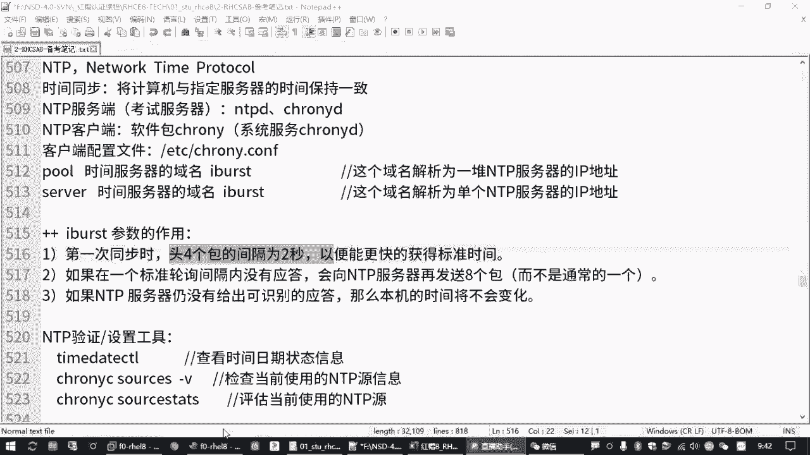

其实你就不用改嘛，你也不用删是吧，你留着就行了，就是关于这个参数的一个解释啊，嗯那一旦保存啊，改完这个配置保存好之后，我们就可以把这个服务给启动一下啊，sixty control啊。

然后你可以restart啊，或者来了个enable，是吧，rnd有个杠杠now是吧，你把这个服务给重启啊，并且呢把它设置成开机之后自动运行，基本上就做完了啊，当然你做完之后呢，你要去检查结果吧。

那检查结果的时候呢，这个方法有很多啊，嗯有一个mini呢叫做time date control，好，time data control，那主要看哪里呢，看我们的这个mtp server。

看它是否是活动的对吧，如果是活动的，说明这个服务运行正常，那另外一方面呢你看当前这个系统的时间是否已经做过同步，那现在是不是这个no啊啊，这就是你服务启动完成之后呢，还没有做完第一次同步啊。

那你看到的是no是吧，那这个博物馆啊，那如果大家想看到这个时间同步的话呢，一般是建议大家把这个时间你改成一个错误的时间，然后你重启一次服务以后就就归他管了，那如果你这个时间差别不大的话。

它其实没有必要做同步是吧，你可能没有那么快就看到他告诉你已经同步过了是吧，他可能没有那么快啊对吧，你看这个地方可能是一直是弄啊，这是第一种方式啊，用time date control，那另外一种方式呢。

就你可以用date，你就去改一个时间，改个错误的，然后你重启服务之后，你看它能不能同步吗，或者你不重启服务，已经重启过了，你可能要等一段时间啊，它才能同步，因为这个同步的间隔是由你那个符位来控制的。

干嘛是吧，嗯那改时间呢在考试的时候一般就比较麻烦，一般就不建议大家改，你要改的话也可以啊，有个叫date杠s，我可以临时把当前系统的时间呢啊，比如说我们改成一个过去的时间。

那date命令高尔s这是设置啊，就是临时设置当前的系统时间是2002年2月2号啊，那如果你想看一下当前时间设置多少呢，就敲一个that对吧，然后你等一段时间之后发现这个时间变成正常的。

2020年是不是就对了，那你服务启动过之后，你现在看没那么快啊，我们再试一下，重启一下服务，看看能不能快一点，服务的名字叫corond corond啊，一样你把这个服务重新启动完成之后呢。

可能也要等一小会是吧，然后你再看时间是不是变成2020年了是吧，唉这个也能验证你这个时间服务器好使，那另外啊考试的时候呢，有时候你看这些方式啊，改时间再来去验证很麻烦是吧。

还有一个呢你刚刚用那个time date去看，也是一种方式，就是刚刚我们讲的第一种嘛，如果你系统同步过时间，这里面是有个e让你时间差别比较大，重启完服务，他做过同步，这就会是一个yes啊。

但是这个考试的时候你都可以不做，都可以不做啊，这两个验证都可以不做啊。

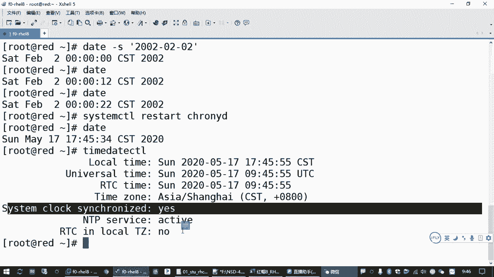

有一个最简单的验证方法就是检查你的配置，对不对，可不可用，还有个什么呢，有个叫cloning c啊，canonic sc就相当于时间那个客户端一样啊，刚才我们说ctrl d是服务端的一个工具是吧。

那cc呢是用来检测你的n t b服务器的一个设置的一个工具啊，那这个工具的话你可以直接执行ctrl c后面有个命令叫做sources，可能c sources，那这个命令是检查你当前这台red的这台主机。

它设置的nt b的时间源是什么样一种情况啊，那如果你设置好了正确的圆，你在下边这个列表里边应该能够看到，比如说你这里可以看到so一它的一个域名，对吧啊，当然这个时间的原子这个域名啊，它有可能有多个名字。

假设设为一，还有好几个域名，你这个显示的不一定是设为一，就可能是另外一个别名，但是你要知道，其实就是你这台机器你能确认这一点就ok，所以这这是你能看到这个服务器地址，在这个服务器地址能不能用呢。

你要看前面有两个标记，这两个标记正常的一个状态啊，应该是一个编号，一个星号，这两个表示什么意思呢。

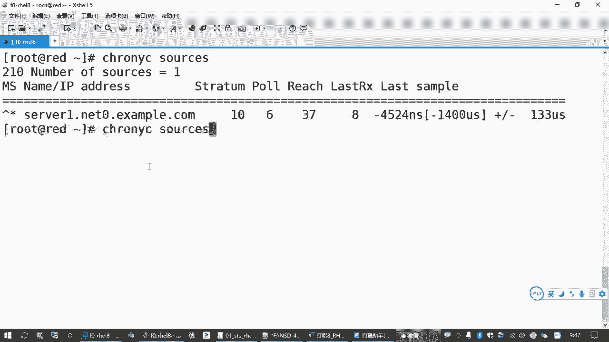

我们加一个杠v，它有解释啊，就是canonic sources杠v显示更详细的内容，那前面这个m s你看m往上沿着它这个箭头找是吧，这叫圆的一个模式，这个s呢state嘛圆的一个状态嗯。

那如果圆的这个模式呢是间号，表示你设置了一个正确的设置了一个指定的一个服务器，嗯如果是一个新号的话呢，表示你当前已经同步过的是吧，那这就说明你这个nt p服务器是可用的，但是如果你是个编号一个问号啊。

那就是有问题的啊，那可能代表你设置了一个圆，但是呢这个圆它连不上，连不上。

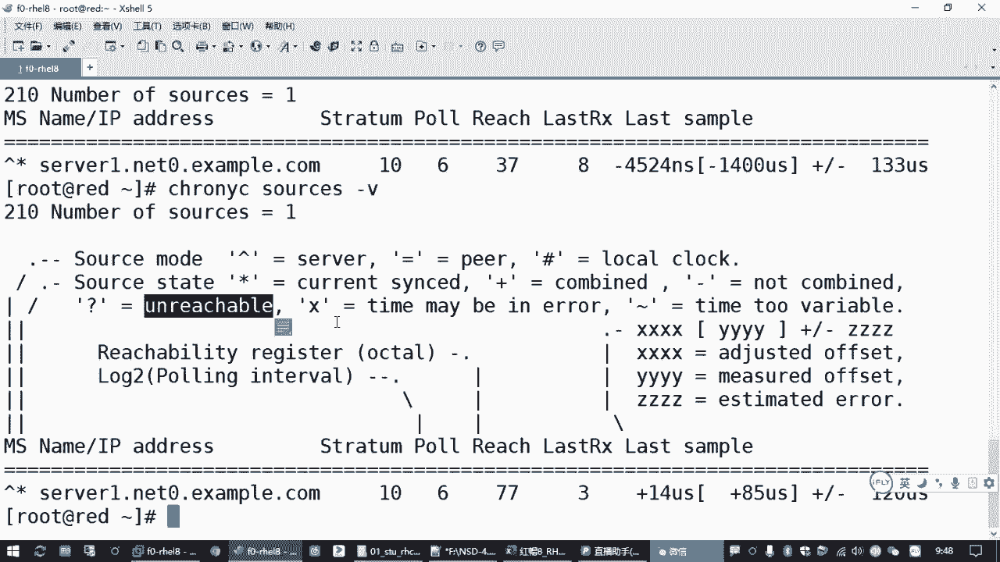

有可能有什么情况，有可能你当前这个主机你的dns设置是错误的。

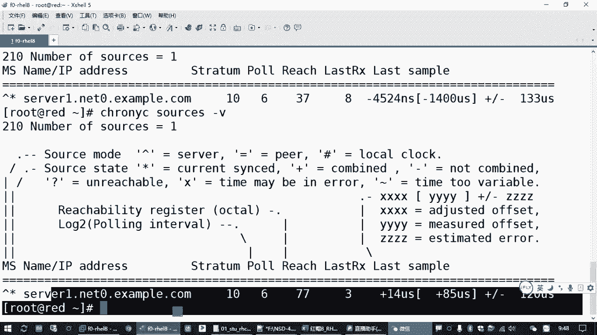

或者你的ip地址设置错误的，或者你指定了这个ntb的服务器的地址，你写错了都可能导致这里出了一个问号，那就不管用是吧啊，还有如果你看这个结果的时候，下面根本就没有这一行记录，那你就没有指定任何源嘛是吧。

他找不着啊。

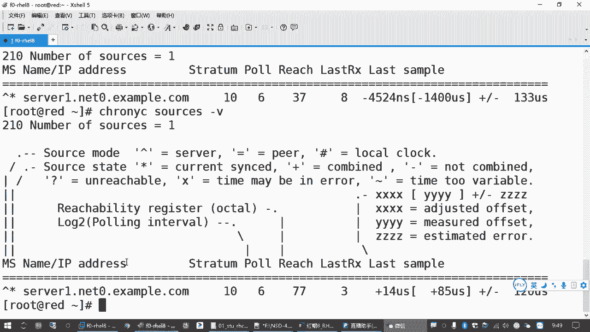

这是验证的方法啊，这是验证的方法，那这就是我们n t b时间服务啊。

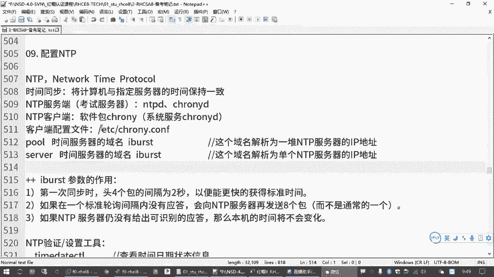

时间客户端啊，哎咱们因为上午的考试就是配置你的机器，找另外一个n t b服务器来同步时间，所以要求我们配置一下客户端啊，基本的操作就是装包配置起伏，其他没了是吧，嗯还有一个硬件时间同步的。

这个有个工具叫hw clock，你同步完时间之后呢，你可以把你刚才正确的时间去更改你的主板时间啊，这个叫bus时间啊，那操作呢是hw clock杠w啊，这补充的啊。

在考试的时候用不着就可以把你系统的时间，就你觉得正确的去更改你的主板的时间啊，就硬件时间是吧，hw clock跟w，然后杠s的话是根据你的硬件时间来重新设置你的系统时间。

这个工作当中呢大家有时候会用到啊，那考试的时候一般不用管这个。

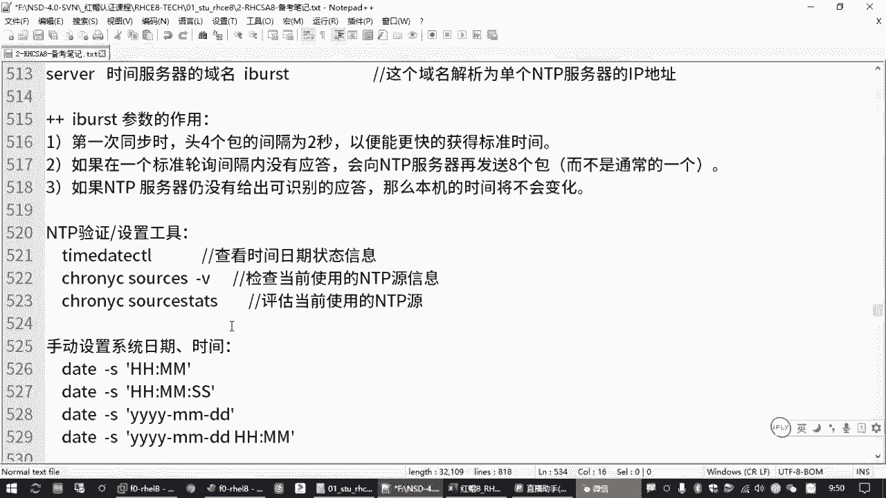

ok吧来大家花几分钟时间啊，把我们刚才这道题目啊，配置n t b时间客户端啊，把这道题目给做一下好吧，其实建筑。

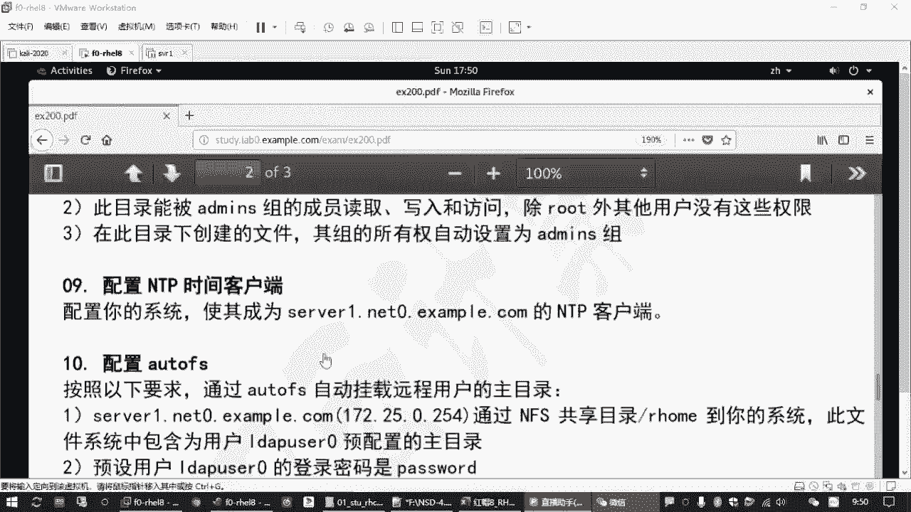

iboss的轮询时间间隔，这个自定义可以自定义啊，但一般不建议自己去改啊，嗯大家如果你想了解那个配置文件的具体的一些说明的话。

建议大家你可以执行一下那个慢啊，你去看一下那个corony。c o n f这个配置文件的一个帮助啊。

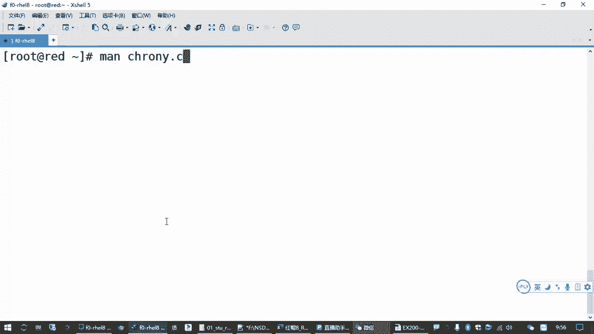

这里有说明，就是你要是说配那种时间间隔的话。

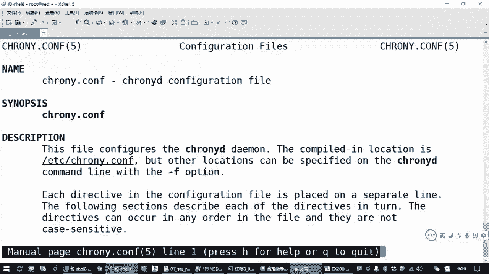

有好多参数就可以慢慢的去去调整一下，这里有个什么m i m pro啊是吧，就指定它的间隔时间对吧。

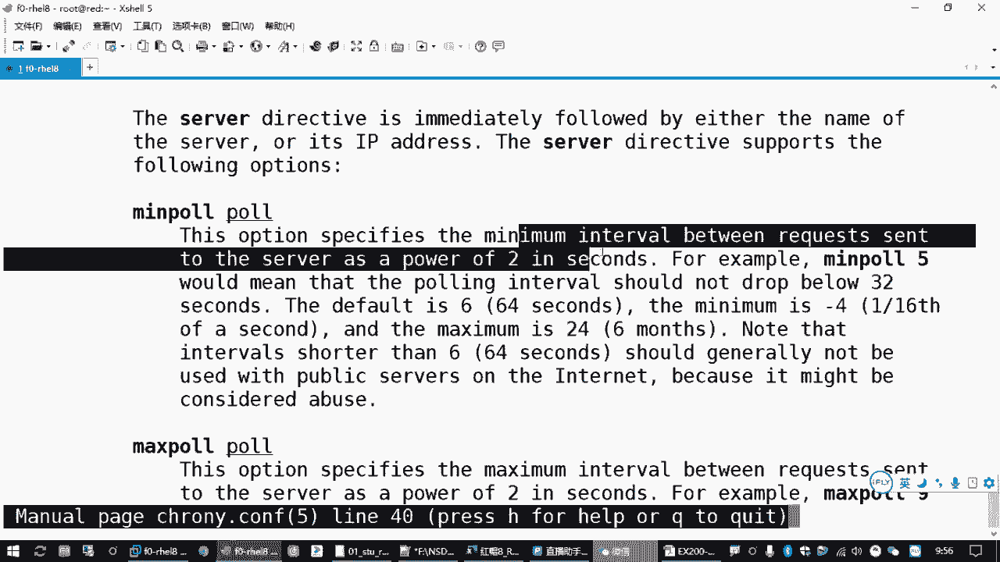

有个最小的一个最大的啊，这个咱们考试的时候不涉及到这么多啊，但是呢你刚刚有同学问到了是吧，大家可以去了解一下啊。

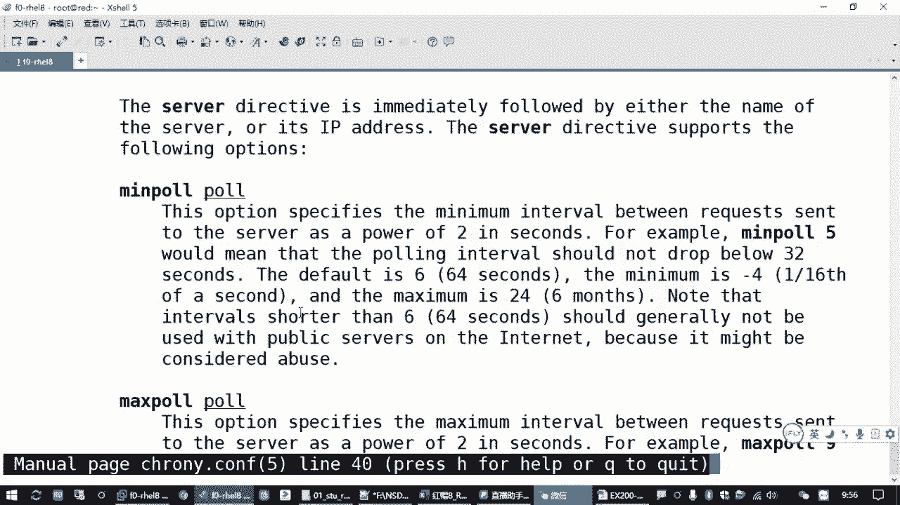

你包括那个i boss是吧，包括了server，包括那个什么p啊，这些都有解释嗯，默认情况下按boss的话呢，它这个你看是两秒钟的一个间隔，两秒钟的间隔啊，如果你没有这个的话呢，它默认就是那个最小的吗。

有个你看这不是一个意思吗，使用了代替这个了是吧，就是说你可以是可以控制的，可以控制的，在考试的时候没有要求他这么细啊，考试的时候不会要要求这么多的啊，看帮助的话，直接敲麦啊。

跟上我们时间同步的这个配置文件，好吧啊，后来那个同学3001，要改一下，它不是加所有的一行，是把第三行打开这个文件之后，把第三行破，原来有一个服务器地址。

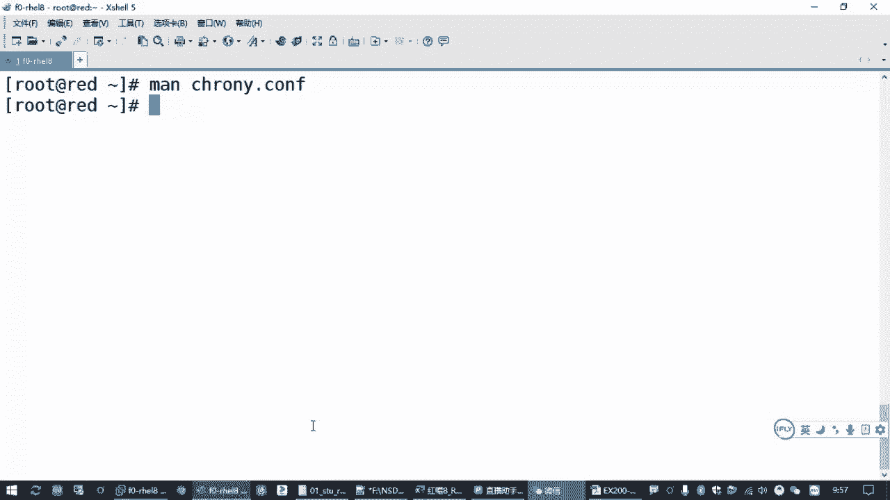

然后把它改成我们搜过这一行啊，来那咱们接着来吧哈，那刚才我们做的是mtv时间客户端啊，这道题目，那这道题目呢大家在配置的时候其实就是装包配置起服务啊，按这个思路去理解呃，装包的话呢。

因为大多数情况下那个包是默认装好的啊，所以这个大家要知道啊，那正常我们考试答题的时候，我们只需要去修改一下etc底下的chloe，点c o n f啊，然后把这个文件里面就在开头的部分啊。

他原来有个p o o l，然后是一个服务器的地址，再加一个aost呃，是建议大家把前面那个p o o l破啊，把它改成sl，然后中间这个域名改成题目要求的这个域名对吧，这个配置就做完了啊，然后保存退出。

重新启动我们的cli这个服务，考试的时候要节省时间啊，你重启完成之后把它设成开机自启，其实这两个好像也是默认是好的哈，叫你重启一下服务就好了，嗯然后检查你的原设的是否正确啊。

是大家可以执行这个cc后面有个指令叫sources啊，要看详细信息呢，你可以加个杠v，这样的话呢呃注意标记啊，看他下面那个标记有一个间号星号，那个星号表示你已经同步过对吧。

建号的话呢表示你设置的是一个指定的一个服务嘛。

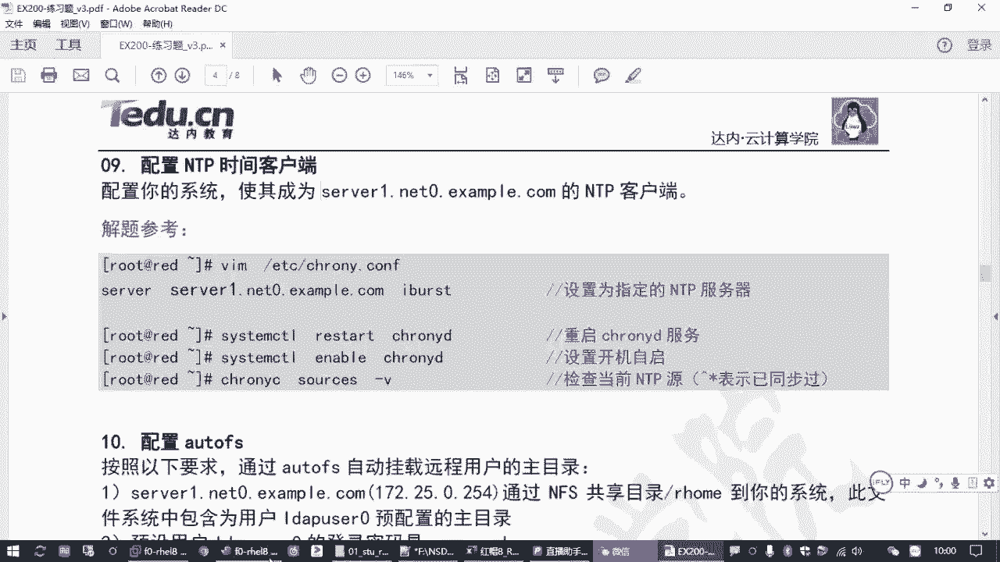

conomic sources岗位对吧，注意看这个这个部分啊啊如果你能看到，基本上你就心里就踏实了。

