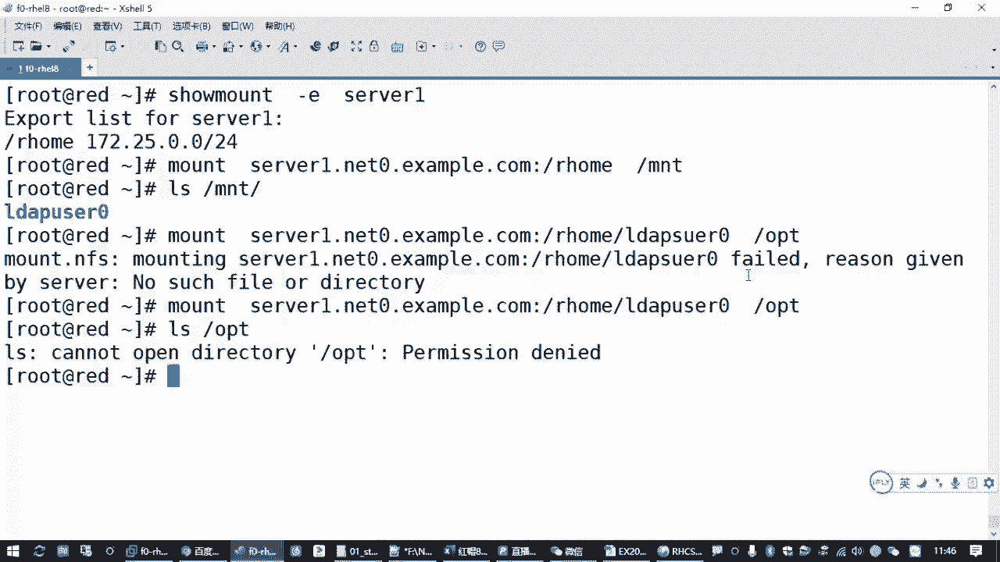
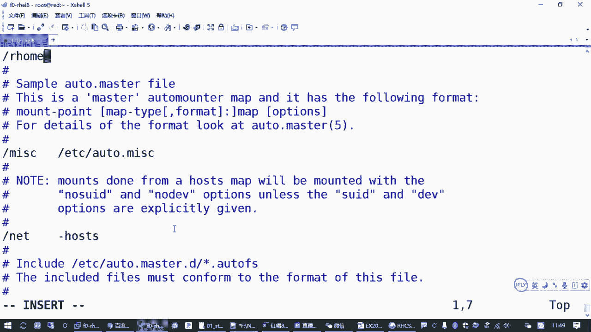

# 全网最全RHCE红帽认证全套入门教程 - P18：3.04-autofs自动文件系统 - 达内-程序猿 - BV1f64y1q7b5

来那接下来我们看一下我们的奥特fs的那道题目嗯。

那aut s的题目的话呢，在考试的时候是要求我们去配置配置auto fs，能够自动挂载远程用户的一个主目录，那这里涉及到一个机制啊，叫l d a p，那考试的时候呢，它会在我们一个服务器上。

像这里的我们练习环境就是练习环境，就是这个设备一，它会在这个服务器上呢给我们提供一个用户账号，而且这个用户账号就是配完了，配完之后，你在你的虚拟机上是可以通过这个用户账号去登录的。

他可能会告诉你要验证的时候呢，是可以用l d l w的零去登录到你的训机。

那意思就是你就是说你这个right这台机器啊，你到时候是可以直接竖杠到l def u c0 对吧，是可以这样的啊，但是要注意咱们练习环境没有啊，咱练习环境没有，所以咱们练习环境呢没有。

这个用户以前在红毛期的考试里面，是我们需要去配置这个l db客户端的，但是在八个考试里面，这个客户端在考试的时候，他已经帮你配好了，配好了之后你可以直接用啊，直接用，但是这个用户呢你直接用之后。

你可以树刚登过去，但是他没有将路，所以红毛八的考试考点里边。

他要求我们做的是什么啊，是要求我们配置一个otbs，能够为这个账号呢准备好加目录啊。

当然这个用户账号呢它本身就不是在你的这台机器上的。

它是由考试环境里面，考试服务器帮我们提供的，所以它的用户账号密码都存在考试服务器上，他的家目录也存在考试服务器上，现在呢他已经帮你配好了，你能够用这个账号登录了，但是加工都没有。

那怎么办呢，考试的时候他会把这个加目录通过nfs共享给你啊，这里有一个叫做网络文件系统是吧，叫nfs，他会在这个服务器上提前把这个目录共享给你的这台训机，那我们要做啥。

我们要做的就是你要配置一个叫all fs自动文件系统，当这个用户一登录的时候，它能够有他自己的家目录，那这个问题就解决了，所以只要这个用户呢一登录它的价目中就会有，这个考试的时候是这样的啊。

那咱们练习的时候我们不是说了吗。

你这个账号是没有的是吧，我们也没有在sl一上配置一个那个叫什么l d a p啊，没有配一个那个东西啊，但是这道题目本身就是给大家介绍一下这个环境啊，但是我们在用的时候呢，你需要知道什么呢。

一方面就是我们要知道关于这个文件系统有个叫nfs，我们平时我们在本机访问我们的根本区域啊，啊v d a一啊是吧啊，你看我们这里有同学应该接触过是吧。

f s t a b这个文件记录了你本机挂载的这个根分区是哪个设备是吧，这些文件系统啊，你用的x fs也好啊，那个什么交换分区也好，这些文件系统都是存在你本地的磁盘上的。

e x t4 或者什么x fs，或者什么fx 32呀是吧，或者什么我那个swife呀，你准备的这些设备啊，都是在本地磁盘上的，这个叫本地文件系统，那另外还有一个叫nfs，这个叫网络文件系统啊。

网络文件系统的意思，就是说你这你的这些资源不放在你本机的磁盘上啊，是放在互联网上，当然很多时候其实不是互联网，就是你继续否机房内网服务器之间的一个网络，他共享给你一个存储，这叫有一个啊类型叫nfs。

叫网络文件系统，当然其他的还有那个什么300呀也算是吧，这个我们现在用不多了，这个算法共享的话呢，其实就是兼容我们微软的那个windows系统的windows共享，那跟那个就是一个东西啊。

linux系统里边如果你要用windows的共享，那其实就是三把有相关的客户端，相关的服务端，那我们现在考的讲的是n8 s。

那再回到题目，他是告是不是告诉我在这个服务器上，已经给我们把这个资源共享给你的讯息了，而且它共享的目录呢是a home啊，他告诉你一个目录叫这个，而且这个目录下面呢已经包含了这个用户的主目录。

但你也要想办法干嘛，你要想办法把这个目录呢放到你的机器上，要能用怎么用啊，看第三条，第四条，这个目录在你搜唯一的这个主机上，它的地址是他共享给你的r home下面有一个子目录叫l w u的零。

然后在你的主机上应该怎么办呢，应该自动挂载到一个叫r home下载l加b的零，就是在sol 0上，在sol一上的这个目录应该出现在你的地图上，这个目录只有你做完这个操作之后，那么这个用户l w等零。

他一登录，他才能够用他自己的主目录，它才有权限去写入，ok吧，这是题目的要求啊，但是咱们练习环境呢，因为他没有这个账号是吧，但是我们配置的要点是能做的，我们一样需要去配置一个audibs，能够实现。

当我们需要访问这个用户主目录的时候，它能够自动出现就ok了嘛，虽然不能实现这个用户登录区写入，但是你只你可以用l l s命令去看一下，如果你l s命令一看这个目录，这个目录就有了。

那么这个题就算那个考点你就掌握了，那这个考点我们刚才讲过的这个奥特fs指的又是啥呢，那刚才我们讲的第一个点，你要知道怎么去访问nfs资源，第二个点你要知道怎么样去配置ow f s。

让all tfs实现自动挂载啊，自动挂载这个自动过程讲的是啥呢，就是当我需要用一个目录的时候，他能够把那个资源给拿过来，但我不需要用这个资源的时候，这个资源自动就自动就消失了，跟那个流线变魔术一样是吧。

马上快中午了，我想吃个排骨，那你手一伸，空中就过来一盘排骨对吧，那你吃那个排骨被你吃完了，你往外一丢盘子就消失了对吧，这这个叫自动挂载啊，自动挂载呢跟我们埋地雷一样啊。

我们埋设的地雷这个引爆点就是你本机的r home l w等零，你在这个地方埋颗雷，只要你用脚一踩它就能爆，是吧啊，当然我们这不是真的去财报，我们是需要用我们的程序或者我们的命令。

只要你去访问一下这个目录，然后这个目录下面呢就自动有服务器上这个目录下的资源，这就相当于把那个地雷给踩爆了。

但是你没访问的时候是没有的，举个例子，现在你去找这个目录肯定是没有的，home下载l w的零没有吧是吧，甚至呢你去看这个阿home这个目录都是没有的，但是你配完or的反思之后会有，这就是我们要做的对吧。

那我们从刚才这两个点来看啊，那一方面如果我们要知道你服务器上共享的这个资源在哪啊。

刚说兽医从我们的客户机来说啊，你要拿到我们nfs的一个资源检查的方式。

一般就是修m杠一，这是查找对方导出有哪些资源，一个叫ex破输出杠一，去找我们的收购一这个服务器是吧，找这台机器，但是你执行这个操作的时候，你发现又报错了是吧，缺命令，咱们练习环境的最小安装也少个包。

所以我们要少一个包，装一个什么包呢，这个包叫nfs杠ut，这是支持访问nfs文件系统的一些软件，一些命令啊，都是由这个包提供的啊，你哪怕你要提供共享，也是用这个包啊，所以要装一下这个包。

装好这个包之后呢，那如果我再来检查是吧，so much杠一去检查，你就可以看到诶这个服务器共享的一个目录叫阿home，允许我们要下2。二五点点零这个网段来访问，那正常我们想如果想把它永久挂载的话啊。

怎么办对吧，你要去改配置文件啊，叫永久挂载，如果你想临时挂载的话呢，就直接用mt命令去挂载也可以，那被挂载的资源呢其实就是这个目录对吧，是哪个服务器，这个目录安装fs文件服务器。

这个服务器呢你要写上服务器的地址，或者他的ip都行，用冒号分隔写上它的目录，你比方说把它的目录挂载到我们的m t，这是linux系统里面去装载一个分区，装载一个网络资源的一种方式吧是吧。

有个命令叫mt中文翻译过来叫挂载吗，这就是把服务器上的一个共享目录装到我们本地的一个目录里面来啊，你如果安装安装成功是吧，这个目录或者说一个设备啊，它做成功再去看，你就可以看到它下边有个录，对不对。

可以用这种方式啊，当然如果你明确的知道他下面有一个这个目录，你在挂载的时候可以直接在后面写上这个目录的名字，你可以挂载到另外一条路，然后你挂载的时候在你发现失败了是吧，l l d a p啊，写错了。

u转零啊，u s e r对吧，这也是可以的，你去看o p t，你看o p t下面是吧啊，有东西的啊，只不过现在你没权限，l w b又在零，它挂载有东西的，但是你没权限，因为这个目录呢只属于l w等于零。

这个用户他告诉你没权限，还没有告诉你没有这个目录吧对吧，这是挂载成功的，这是手动去挂载啊，所以其实在我们linux系统里边啊。

你要使用一个存储设备，要使用一个共享的资源，要挂载一个东西的话呢，有好几种方式，如果你要挂载的是本地的资源，手动挂载直接操作，包括你挂载一个目录啊，都是这样的，那如果是呃另外一种方式呢。

除了手动挂载以外，你还可以实现开机挂载是吧，那你要改一个ftp文件里面写一条配置，你可以参考我们那个配置文件里面其他的跟分区的一些挂载啊，改一改就好了，那还有一种方式呢，你如果在配置文件里面已经有东西。

已经有这个配置东西了啊，你也可以直接手动用半自动挂载啊，这叫半自动挂载，就你mt只要写一个设备就可以对吧，这个后面我们讲存储的时候还会给大家再讲这个文件的啊，但是现在我们考点在里边啊。

考的不是在这种方式。

考的是一个叫触发挂载，或者叫自动挂载，或者说叫按需自动挂载，用的就是alt f s啊。

那是啥意思呢，就是说我不需要用mart mini直接把这样一个设备挂载到我们的一个目录，因为你一旦你冒着挂载成功之后呢，除非你手动把它给取下去，或者你关机重启。

那这样的话呢你o b d这些目录，md这些目录这些挂载的资源呢会一直都在不安全吧。

是吧啊，那我们自动化的有个好处，就是默认有个五分钟的一个时间，一旦它挂载上去，你五分钟你不用它，它自动就消失了啊，那个目录知道就消失了，而且挂载的时候呢是当你去用它的时候，它才会有啊。

再回到刚才我们讲过的那个，然后我们那个地方来啊，我本地需要有一个目录叫a home是吧，rw是零，现在是没有的，你啥时候看啥事也没有，因为你没配置，要么你手动用帽子去挂载，要么你配auto fs。

那如果你要做我的fs呢，装包配置起服务啊，要有三个东西啊，装软件包的话呢，这个软件包就叫alt f4 ，所以要装一个auto fs的一个包啊，这个包装好之后，你要去配置配置是干嘛。

就你告诉他来看我们这个题目。

其实就是你得告诉他这个美女放在哪个地方，告诉他这个没埋在哪是吧，然后这是第一个点，那第二个点如果有人踩了这个雷会怎么样，是不是你也得告诉他，那我们这里就是如果有人踩了这个雷，要去挂载一个资源啊。

那这个没埋在哪呢，就是这个目录啊，你要用来装这个共享资源的这个目录在哪，你要告诉他上一层目录是什么位置，然后这个地雷那个引爆点就是这个l w的零，好l在640，相当于我们配置的时候。

你要说我打算在你的当前系统的r home下面埋一颗雷啊，那个酶的那个引爆器呢叫l l w是零，如果有人一踩爆这个引爆器一访问这个目录是吧，那么请帮我们把这个目录创建好。

并且呢自动把服务器上的这个资源挂载过来，这就是奥特fs他干的事，这些目录呢你只要只需要通过配置文件告诉他就可以，你不需要去提前创建啊，只需要告诉他应该在什么地方出现这个雷达。

那配置的时候怎么去配置啊，vm去找etc下面有个文件叫auto。must啊，这个这是最主要的一个配置文件，这个配置文件里面的，你往里面增加一行基本的格式，在哪一个目录下边埋雷。

那我们现在是不是要按后面这个要按题目去啊。

题目说你要把这个资源挂载到你本机的某一个目录，你把目录的底下来一层，不要上面这一层就是你买没买了一个那个房间啊，把那个房间号写上啊。

home然后具体怎么埋雷呢，你后面要写一个文件，这个文件名随便啊，一般就放到e t c下面，比方说起个名字叫a home的，入这个扩展名没有，要求啊你写个a b c d也无所谓，为啥呢。

这个文件是我们接下来你要创建的这个文件，你让他叫啥名字，叫叫啥名字啊，因为你一会要用vim编辑器创建这个文件，这个文件干嘛呢，那这行配置在干嘛呢，这行配置语句是告诉奥特莱斯说，从现在开始。

你要帮我盯着这个目录，如果有人访问这个目录下的某一个文件或者某一个目录，目录目录，如果有人要访问这个目录下的一个子目录，你怎么办呢，你按这个文件里的要求去做，就你要这么去告诉奥特反思，那具体怎么做呢。

要请听下回分解是吧，那就请看这个文件里面怎么告诉你，那这个配置就做完了，所以这个文件里边你只需要配置这一行，告诉他一个目录，然后给他一个策略文件啊，叫策略文件啊，怎么叫都行啊，保存退出。

然后把你刚刚复制的这个策略文件的路径，用vim编辑贴出来是吧，这个文件在这个文件里面，你要告诉他。

如果有人踩了l w的零这个雷，请帮我们把资源挂载过来是吧。

就有要爆炸的啊，就触发嘛，怎么写呢，把那个地雷的引爆器写到这l o w f u t0 ，如果有人访问叫这个名字的，那个子目录，然后中间有个挂载参数，你需要把我们服务器上的这个资源挂载到刚刚这个位置对吧。

到时候你要把这个复制对吧，复制粘贴过来啊。

就这啊，那中间你是不是要挂载过了之后，你要加一些参数啊，你要告诉他们这个文件系统类型是网络文件系统，如果你还觉得有必要了，你可以加个可读可写啊，逗号啊，w但是其实这个你默认如果不写也是可以的。

因为服务器共享给我们的已经是可写的，你默认不写，不说可读可写，那么默认就是可读可写，你可以指定一个文件系统类型啊，叫nfs，那这两个文件一组合就搞定了，来第一行我们配了两个文件啊，第一个呢是在alt点。

master加了一个这个设置，然后在我们后面这个策略文件里面呢是加了一个挂载的设置，这两个文件组合起来啊，就实现了一个效果，当用户访问r home目录下的l d a p u在零这个地雷的时候。

auto fs他会提前创建这个目录，创建这个子目录，并且把这个资源按照nfs文件系统的类型挂载到这个位置，就可以了是吧，这就是配置，那配置做完之后呢，你让它生效，你得把这个服务给启动啊。

来enable alt f s杠杠，那启动成功之后，我们先看一下r home这个目录，你看有了是吧，然后你看一下r home下面的，但你现在看啊，home下面是不是没东西啊，空的吗。

刚才我们开不是空的吗，然后我们再去看一下l r home底下有个目录叫l d a p u的零，看一下有没有，如果你看到有个提示告诉你permission denied啊，就说明成功了，怎么个意思呢。

那你换一个目录看看有什么区别啊，我找一个单一，你是不是发现提示不一样啊，l o w u的一它是没有这个目录啊，但是l w p u的零它有这个目录，只是你没权限啊，为啥呢，来我们再看上一层。

我们加一个杠l看一下，你会发现它下面是不是有个l代表的零，刚刚前面我们没有看的时候，是不是没有啊，你直接看r后底下是空的，你现在加一个r home下的l w的零，哎现在出来了，怎么出来的，管理员。

你告诉奥特fs，奥特fs帮你建立出来的啊，你们说吧，但是呢因为他没有，就你现在用的用户对这个目录没有x权限，进不去啊，它默认的权限服务器端给我们设置的，没有给其他人类的权限和x权限，所以你进不去。

所以他报错了，明显dn，但是你的触发挂载已经成功了啊，已经成功了，这就ok了，那这个目录呢你现在看是在的，你等五分钟之后，你不用这个目录就会消失，如果你等不及呢。

那咱们可以直接stop或者race start auto fs，你再去看目录没了对吧，那这个叫初八发财啊，其实你这个只要你用它，它就会出现l o w u等零对吧，再看有了吧，这叫触发挂载啊，叫触发挂载。

那我们考试的时候就是这样的。

大家考试的时候呢，按我们刚才讲到的，你直接用s去把这个雷踩爆，可以的，没问题啊，l l s也可以引发这个触发挂载。

当然你按考试的题目要求呢，你直接竖杠到这个用户，看他有没有加目录，能不能写入也是可以的，但是咱们练习环境，咱们练习环境和考试环境有点小区别，还没有这个账号是吧。

所以你只能用l到s去确认，如果你能够看到这个目录告诉你权限被拒绝，也算做成功了，考试的时候这样也算做成功了啊，没问题吧，好当然啊，那其实考试的时候呢，如果你还需要有别的用户，那你可能要继续加配置对吧。

要继续加配置，那其他就没了啊。

这个地方有点绕啊，有点绕，大家理解的点比较多，那就是alt f s这个操作的时候呢，其实就是装个包建一个配置文件，然后重启服务就完事了，那就没了啊，剩下的这些呢就是验证的一个操作啊，打个比方的话啊。

其实这个地方呢就相当于呃，我们管理员为这台linux主机请了一个管家回来一样，你让这个管家呢去盯着一个目录，如果有人访问这个目录，就提前帮他把这个目录准备好对吧，你做做管家的话。

人家知道你那个主家有什么要求，你要提前想到哎，我们这个题其实就是这样的，就是当用户需要访问他的主目录的时候，然后o3 fs就提前想到了，提前把这个总目的给挂载过来，他为啥能提前想到。

是因为你管理员已经提前告诉他了，只不过呢我们管理员不用守在这个机器前面。

