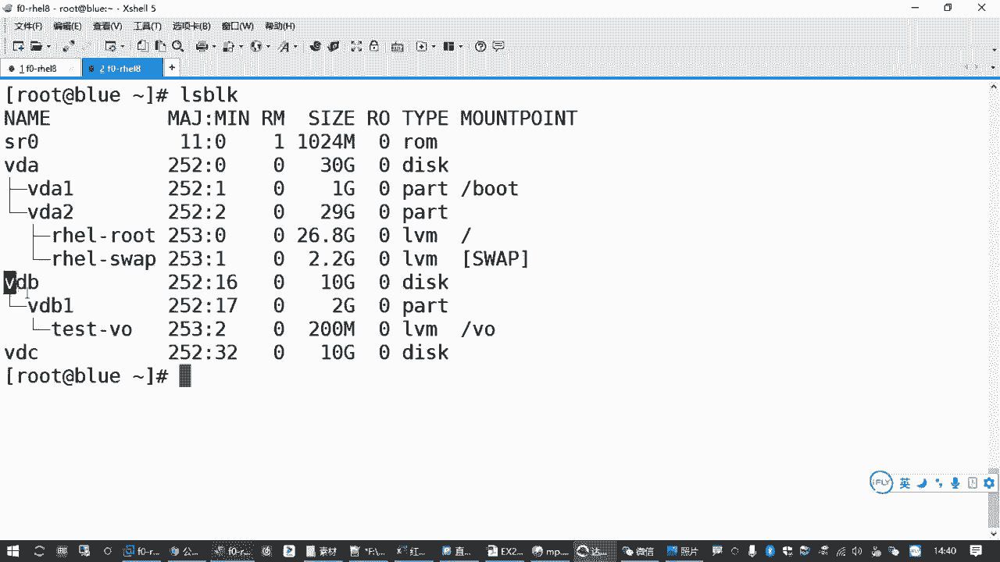
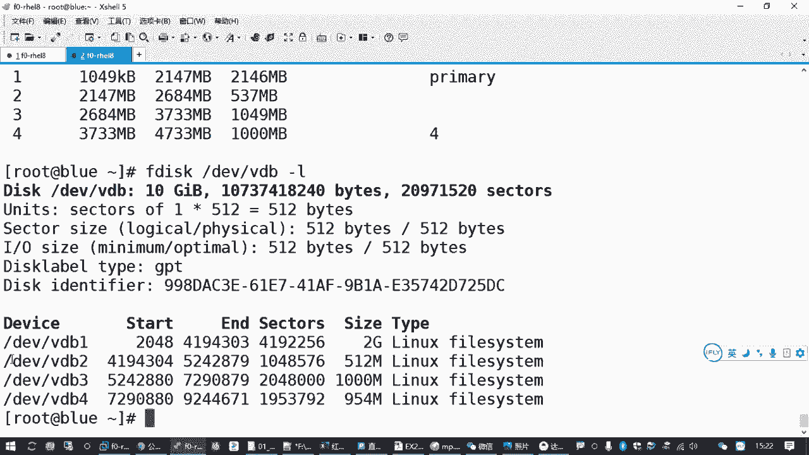

# 全网最全RHCE红帽认证全套入门教程 - P20：3.06-磁盘分区及格式化 - 达内-程序猿 - BV1f64y1q7b5

来，那我们再往下看其他的题目啊。

其他的还有几个往下走。呃，调整逻辑卷啊，然后呢添加交换分区创建逻辑卷。然后还有1个VDO券，这几个都是和我们磁盘分区有关系的啊。那这个的话呢，所以我们。先得讲一些基础知识啊，要不然你没有办法直接去讲。

啊，那这基基础知识包括什么呢？呃，就是你要涉及到磁盘的分区格式化，对吧？挂载啊等等等等啊，这些相关的。

呃，然后在我们下午的考试环境里边。大家注意啊，在这个磁盘上呢，我先给你介绍一下考试环境，这跟我们练习环境差不多。啊，我们可以执行一个命令叫L block。到时候你们考试的时候，也建议大家先去确认一下。

呃，下午的就是那个上午的考试啊，就我们那个HCSA第二个训拟机啊，刚才是我们说的是说成下午了啊，第二个虚拟集啊，那第二个虚拟机它正常情况下会给我们准备3块磁盘。😊，其中呢第一块磁盘就是这个VDA嘛。

第一块虚拟磁盘VDA里边有我们的启动分区啊，然后呢有我们的一个。有一个叫做卷组的东西是吧？卷组里边呢有两个逻辑卷，一个是用来做我们的根分区的，还有一个呢是用来做我们的交换分区的啊。

这是第一块磁盘的一个使用情况。那第一个磁盘呢，其实就是你现在不录这台机器的一个操作系统啊，咱就不用管了，是吧？你就放一边去。😊。

啊，然后呢他另外还会给我们准备两个。

磁盘啊一个磁盘呢叫VDB。那这个磁盘的话呢，在这个磁盘里面有一个现成的。有个VDBE有个分区，这个分区呢用来做了一个叫卷组的东西啊。那卷组里面呢画了一个逻辑卷。可能叫tt杠啊，一个叫tt的卷轴。

卷轴里面有个逻辑卷呢叫VO，它是只有200兆空间。考试的时候不一定200兆啊，我就说这意思啊，就是这个是专门给我们。

做题目的啊，有一道题目叫什么呢？调整螺辑间大小。那考试的时候也是一样的啊，他会给我们提供一个现成的VO逻辑卷。这个逻辑卷呢它是已经格式化过的啊，你千万别再去给它格式化。你一旦把这个逻辑卷你格式化过。

这个题你就白做了。😡，因为他要求什么呢？要求你这个文件系统里的内容保持不变。你都把人家格式化了，那内容能不变吗？是吧？所以千万别格式化，但是他的要求是你要把它大小呢，一般来说是要调大一点。

它原来这个逻辑卷呢存储的空间大概只有200兆啊，反正不到这个大小，让你增加，对吧？那这就是考试环境里面，它会给我们准备一个这样的一个环境，😊。

啊，VDB这个磁盘里面会有一个需要我们去扩容的。这样一个存储设备。那另外一方面呢，下面还有一道题目。

添加交换分区。那添加交换分区的时候呢，它会要求我们另外分一个分区出来。比方说这个题目。是不是要求我们添加1个512兆的一个交换分区啊？那这个呢你就得去找一个空闲的磁盘，或者说磁盘里有空闲空间的。

然后你给它做各种设置是吧，最会来实现增加一个新的交换分区。那这个题目。

大家要听好了哈啊这个题目的话呢。😊，因为我们除了VDA系统分区这个磁盘以外。还有VDB还有VDC。那交换分区这道题目呢，正常情况下应该是和我们逻辑卷扩容这道题目是在一个磁盘上啊，是在一个磁盘上啊。

那那大家不要说唉，我这我用VDC行不行啊？😡，啊，这就是容易踩坑的啊。以前我们语老师第一次考的时候，就是他头一次做这个题，哎，一开始按照顺序去答题是吧？哎，一看这个做到这个交换分区的时候。

说要添加1个512兆的交换分区。啊，他也没说在哪个磁盘上呀，是吧？😊。

好，那好，那他就直接就到我们的这个VDC上去做去了。😊。

哎，VDC是一个空磁肪啊，它都没用了啊，全部都是空闲的。但一个空闲这么多，那不随便用吗？😡。

好，这个题做完之后呢，结果他发现再往后看，最后有一个题目叫创建VDO券。这个卷子有个明确的要求，使用未分区的磁盘来做。意思就是说在考试的时候，专门有一块空磁盘啊，VDC。

是专门用来给你做下面这道题目的。所以你之前的这个什么交换分区啊，逻辑卷，你别用VDC。

啊，知道这意思是吧？就这个那个分区呢，你要单独啊那个磁盘啊，VDC这个磁盘呢，你要单独腾出来啊，专门用来答那个VDO那的题目。😊。

啊，那再一个。VDB除了刚才我们说有一个要扩容的是吧？然后要增加一个分区，用来做交换分区。那另外呢还会有一道题目，要求我们再创建一个新的逻辑键。

那这个逻辑卷原来是系统里面没有的，而且它对应的卷轴也是没有的。所以你要准备一部分空间来答案逻辑卷这道题目。你像这里50个单位，一个单位16兆是吧，大概是800兆，对吧？你要算这个空间。

那这个题也是在我们的VDB这个磁盘上去做。

对吧也是在这个词环上去做。

那因此呢大家在打补这台机器的时候，你要综合考虑。这两个磁盘怎么去用吧？特别是VDB。

因为VDP根据我们刚才啊看了所有这些题目的一个需求之后，那我们能想到的最少要添加两个分区。

一个分区用来做那个交换分区，一个呢用来做我们的单独的那个逻辑卷。是吧所以我们就涉涉及到我们的磁盘的分区。然后你要做交换分析也好，要做其他的也好，肯定要做格式化。啊。

格式化之后的那些设备你才能够正常去使用嘛，啊才能够去往里面存东西嘛，对不对？所以呢我们后边啊有一块知识呢是关于我们的。磁盘和分区格式化这些操作。那我们简单看一下。嗯，对于linux主机来说啊。

那我们在使用一块磁盘存储设备的时候，需要有这么几个过程。嗯，首先是linux系统开机的时候啊呃lininux系统开机的时候，它的内核要识别到磁盘，这个一般都不用我们管啊，你开机。

lininux内核它会找到你这个磁盘。因为磁盘作为一个基本的存储设备，这个驱动在内核里边都是带了的啊，所以他能找到你这个磁盘。就像现在我们看到的，你只要做1个LSb，你就可以知道哎。

这里有哪几个磁盘是吧？第一个是那个相当于光驱光驱设备啊，然后VDA第一块虚拟磁盘VDB第2块虚拟磁盘对吧？VDC第3块，然后再往下滑VDA1这是第一块磁盘内的第一个分区对吧？是这样一个层次关系啊。😊。

那识别到这个磁盘之后呢，我们在用的时候是需要去对它做分区的。除非你把这个磁盘整个的拿来做什么逻辑卷呀，做磁盘阵列呀，是吧？否则的话呢很多时候我们是要给它做分区，这个时候就需要用到一些分区的工具。😊，呃。

分好区之后呢，再针对这个分区呢去做格式化。那这个时候我们还需要用个格式化的工具。对不对？那格式化好之后呢，你才有文件系统。比方说你格式化成那个EXT3的呀，或者什么叉FS的呀，是吧？要做格式化。😊，嗯。

格式化完成之后再去挂载。就我们前面讲到的这个MOUNT啊mount。对帽子是挂载啊。最后挂载成功之后啊，你把这个分区格式化完成，装到某一个目录，这是挂载的含义嘛。啊挂载成功之后呢。

你才能够通过你装这个系统的那个啊装这个设备的那个目录。去往里面存东西，从里面读东西是吧？它完整的过程基本上就是经过这些啊。那在这个过程当中呢，识别磁盘。刚才我们是不是讲过1个LS block。

或者你用FD个杠L也行啊，这个是专门用来检测磁法的。嗯，FD杠L回车，这个可以列出你所有的它当前已经发现的这些磁盘的信息，包括每一个磁盘的它的分区表容量啊等等等等啊，都在这里。

对吧你看这个VDA的，然后再往下这VDB的啊，VDA30GBVDB呢10GB。

这是用来检测磁法嘛？是吧？然后VDC10GB下面是分区表，这没有吧，还就没有。

然后你分好那些区呢，它下边还有详细的信息，慢慢看。😊。

哎，但你如果觉得no呢，你就直接L block。对吧这个比较简洁啊比较简洁，也可以看到不同的磁盘设备和它对应的这些大小啊啊都是可以的。所以识别磁盘检查磁盘的分区表，大家可以用这些工具。呃。

那如果要对这个分区做分都要对一个磁盘做分区的话，要更改一个分区的话，这个用什么呢？啊，用F disk或者part啊，一般建议大家用这这几个。但其实红帽八系统里面还有一个工具。叫Gdi是吧？

你看这好像没有。可能可能要装啊，看F disk个啊，这个有是吧啊，那咱就省事一点。呃，那其中呢Fdi呢，它在分区的时候，受到我们之前那个比较古老的一个分区模式的一个限制啊，有个模式呢叫MS dos。啊。

这种方式在利用一颗一块磁盘的时候。他有些缺陷。比方说它最多只支持4个主要的分区。如果你想把一块石盘分成5个区，6个区。他默认了的模式是不行的。那你必须从四个主分区里边拿一块出来。把它变成一个叫扩展分区。

对吧那扩展分区呢，然后再划分更多的那个叫逻辑分区，对吧？就有点折腾啊。但是一般你不超过4个，其实也挺挺简单的啊。而且MS倒s分区模式，它最多大概只能支持2。2个TB左右，有限制是吧？

所以现在用的磁盘呢大多数情况下啊，我们用的都是那种比较新的一个叫。嗯，什么全局唯一的什么什么UID的一个编号的一个分区表，也叫GPT用这种模式，这种模式呢它就比较进步了一点啊。

支持的空间呢可以超过2个T。😊，啊，另外呢它的主分区一般理一般理论上来说，从GPT这个技术上来说啊，它主分区的数量是没有太大的限制的啊，那个数字是个天文数字。啊，当然对于操作系统来说啊。

windows或者lininux一般是最多128个。那你一个磁方你发划分这么多区域也足够了嘛，是吧？所以这个呢能满足我们现在主流的企业应用基本上都能满足啊。这两种分区模式。那为什么说你这两种分区模式呢？

我们有不同的分区工具。那其中FD。😊，它只能操作MS到这个模式，它不支持GPT啊，不支持GBT。呃，后来我们这个呃红包八。😊，原来7的时候，它专门有一个工具叫Gdi啊，叫Gdi。

那红包八里面的现在默认是不是没装呀，是吧？那有可能集成到我们这个FD里面去了。😊，啊，有可能集升到这里去了。我给你测试一下啊。因为它的这个系统在不断的升级是吧？我看一下有没有做那个。哎，M。啊。

你看他加了一个选项啊，一个叫歌是吧？G啊，你加一个这个选项，才可以手动去创建1个GPT的那个分区表的一个布局，对吧？加一个这个。所以刚才给大家正好提了一下，以前在汽的系统里边呢，它要单独有一个工具。

叫Gdi。🎼对吧单独用这个，你如果要把一个磁盘按GPD的方式来用，你得需要单独加一个GD这个命令。啊，当然这个FD也在慢慢的进步是吧？他现在不是刚才我们说它有个歌的一个选项嘛，也可以支持是吧？😊。

但是我总感觉他应该还有一个包查一下啊。😊，对吧它单独有个包，你看它没装。你如果想直接用一个Gdis也是可以的啊。你只要装这包，那你用Gdi也行。但是大家不要混用啊不要混用是吧？那记第四课的话呢。

它就是专门支持我们的。这个GPT啊这种方案。既然不怎么用，我就不写了哈，我就跟大家一说啊，讲到了我就提一下。😊，呃，那FD呢只支持MS dos，现在可能你要加点选项，也能支持Gdi是吧？呃。

还有一个呢叫partypart啊。part呢它在分区的时候，既支持MS dos，也支持GPT对吧？都可以支持。所以工作当中呢很多时候我们会用这个part。😊，但是大家注意呃。

如果我们用Fdi去分区分区的操作。如果你只是看分区表，可以加杠L。但如果你要真正的去分区。你要真的去分区的话啊，直接跟上设备。你上面这个FD是杠L，你要看某一个磁盘，也可以加到上倍啊。你不加的话呢。

是列出所有的翅膀，对吧？你加不加都行啊。Yeah。啊，但是呢F disk分区。它会进入到一个交互界面。你你可以做各种分区的操作啊，练习呀都行。但是呢在你退出之前。需要执行一个指令叫W。才能保存分区更改。

如果你不执行W，但默认有另外一个操作叫扣，那叫退出。这个是W保存分区，并且。退出。你如果不执行W直接退出，你分区就白分了是吧？所以这个适合我们新手。当是对磁盘分区不是特别了解的时候啊，新手你可以随便练。

直到你确认没有问题之后，你再IW保存。所以它适合这个分区不太熟练的啊。适合新的新的学习者是吧？新手呃，那下面这个工具的话呢，那就适合老手呗，是吧？😊，适合有经验的啊。这个运维工程师。啊，为啥？

因为你做了分区更改，他马上就生效。😡，你如果增加一个分区，它马上就增加好了。你把一个分区删除，它马上就删除了啊，分区更改。😡，会立即伸上。也正因为如此，这个是不是比较危险啊？对吧比较危险啊。

那上面这个呢就比较轻松一点，你反正不确认我不保存呗。😡，我确认好了，改好了，我再保存呗，是吧？那叫Fdi。😊，咱们考试的时候，咱们的磁盘啊，一般情况下是上面这种模式MS dos。

只是大家你学会用Fdi就可以了。当然你要用pay的也行，就两种界面一会都给大家介绍一下，是吧？😡，呃，那当大家把一个磁盘的分区表改了之后，你可能要去。让这个分区表生效吧啊。

刚才我们说party的分区更改马上生效，指的是对词旁它会起作用，会受影响啊。但是lininux内核它不知道你这个磁盘分区表发生变化了。那这个时候怎么办？你分完去之后。

你还要告诉一下你的lininux操作系统。😡，怎么告诉他呢？最好的方式就是重启啊，这是最彻底的。如果你在分一个磁盘的，为一个磁盘划分分区的时候。这个磁盘原来有别的分区或者有正在使用的分区。

一般建议大家直接执行reboot重启一次。对吧这个是比较彻底的。😡，嗯，那当你考试的时候呢，有时候我们就想偷懒是吧？我就不想重启，那重启一次，那可能要一分多钟是吧？那考试的时间时间多宝贵啊。😊，啊。

如果你分区的是一块比较新的磁盘，或者是个空磁盘，有时候我们可以不用重启。但是如果你发现重不重启出问题了，那还是要重启一次啊。😊，呃，如果不重启的话呢，有个操作叫partb啊，这叫刷新检测检测分区嘛。

是吧会被跟上你想检查的这个磁盘。😊，检测的结果，它会通知当前正在运行的linux内核，对吧？可以执行一个这个操作，或者你用这个part X杠A去检测也一样啊。这两个命令差不多啊差不多。

你看有哪个命令就用哪个命令。对吧这叫分区。呃，那比方说分区操作我们讲完之后，那接下来就是格式化来吧，那格式化的操作的话呢啊基本上就是我们make FS。😊，就好像你买一块U盘回来。

那U盘里U盘里面中病毒了是吧？你想把这个U盘重新整理一下，重新格式化。那不是有个你插入一块U盘之后，右键是不是有个格式化，跟这个格式化差不多。😊，呃，格式化的意思呢就是把我们一个存储设备里边。

把这个整理一下这个磁盘空间啊，然后我们也好放好往好往里面放东西是吧？这叫格式化。那格式化的时候呢，不同的类别啊。😊，它存数据的方式不一样，所以有这种叫分区格式，或者叫文件系统类型。啊。

另那ux是系统里面的那就有很多了，是吧？😊，像我们的EXD3啊，EFD4，还有什么叉FSVfi呀等等等等，是吧？这个现在考试一般不不需要指定什么16位、32位了。😊，啊，这个杠F可以不写啊。

如果有要求就写，如果没要求就不用写。这是格式化的操作。当是如大家如果用的时候呢，你忘记了makeFS table一下。这后面这些工具是不是都给你列出来了？😡，对吧那题目让你格式化哪一种类型的。

你就用哪一种工具就好了啊。😡，这个很简单啊这个很简单。😊，Okay。格式画好之后再挂载啊，对吧？就是刚才我们所说的啊这几个过程啊，那这个过程里面我们怎么去用呢？来我们先找我们的磁盘练练手是吧？😊。

嗯，比方说。刚才我们讲到我们是不是有个VDB磁旁啊，要添加一个交换分区吧，512兆的。然后呢，还有一道题目呢，要求我们准备1个50乘以16，可能800兆的。那你看这个两个题是吧，那我们就需要去针对。

我们刚给大家讲过了1个L block是吧？VDBE这个磁盘呢它有10个G，但是它现在只用了2个G对吧？VDB那还剩8个G。这8个G就可以用来给我们做了两道题目。那做题目之前呢，你首先要分区啊。😡。

那一个是512兆的，一个是800兆的是吧？那后面这个逻辑卷啊，因为我们再讲逻辑卷，你可以稍微比它空间多一点没关系，但是交换分区呢，这个你可以就就是就正好的啊就正好的那怎么操作呢？😊。

F disk啊，找我们的第一位VDB。这是要针对VTB去做分区，然后回车。啊，我们可以进到一个。😊，交互式的一个环境。在这个环境，大家一定要熟练了啊，因为你上午的考试这个要分区，把这个功西要用熟练了。

如果你忘记怎么用，它下面有个提示，你可以打一个MM for help是吧？就获取帮助来挑一个M回车，那他就会告诉你。啊，你如果要分区，那这里面怎么做啊，是吧？有些指令。嗯，你比方说。啊。

这是针对GPD模式的是吧？😊，啊，这是GBT模式的一个指令啊。然后我们看下边常规的啊，常规的话呢，如果我们要新创建一个分区，有个N啊，添加一个新的分区。然后呢呃如果你要删除一个分区呢，就是用D。

就你打了这个指令之后啊，你根据他的一个问题，一个一个回答就好了哈。😊，如果你想看现有的分区表，用用1个P字母P。对吧这几个比较常用的。😡，啊，P是看分区表，N是添加嗯，D的是删除。

如果大家之前没有用过这个工具啊，不建议大家用D来删除分区。如果你分错了，请你按那个扣退出去备个扣嘛，退出。如果要保存是按W。所以不要用地区删除，删除容易出问题啊。

你万一不小心把那个系统分区里面原原有的一些资料给删没了是吧？那麻烦了哈。😊，所以比方说那我们做的操作，首先做一个字，按一个键P，就那个print嘛，是吧？

你看一下当前的分区表。下面是有一个列表啊，这里表你看到只有1个VDB1。那现在我要增加1个512兆的，用来做交换分区的新建分区就是N啊。字母N。

说一个N回车。他会告诉你有个问题，请你指定分区编号叫partition number。这个分区编号呢，你因为原来有一个分区啊，原来有一个分区了，所以他给你直接自动选了2，你说那按就按吧是吧？

人不按就行了，你数字按就无所谓啊，所以你直接回车确认就行了啊。你觉得二用的不爽，你可以改成三啊，你懒得改就直接二啊，按编号来就行。嗯，再往下一个问题呢，他会问你这个分区从哪开始啊，他的单位叫扇区啊。

从第几第几个扇区开始。😊，默认呢是从剩余空间的第一个扇区开始。那咱不纠结是吧，你就从这开始呗，回车。😡，第三个问题，那你到哪个地方结束啊？😡，哎，这个时候就有讲究了是吧？😊。

那你说我512兆从第一个山区到多少个地方才是512兆呀，你是不是还得去算呀？那你得算一下那个数字是多少，这一个上去呢是512个字节，那谁有功夫算这个下是吧？

所以他给我们提供了另外一种方式来指定你分区的结束位置。😡，就是从你的起始位置开始，你提供一个容量啊。你比如说这里有个描述加size啊。就你告诉他你要加多大。😡，起始位置默认结束位置呢。

你告诉他写一个加号512大M。是。能看到是吧？这加512啊，如果你写错了，你按contl U撤销啊。canU把这一行前面你你你选择了把它给清除，再重新写啊，写到呃就写对了啊，就加512兆，然后再回车啊。

这样的话呢就创建了一个分区啊，然后呢它的大小是512兆，对吧？那创建成功之后呢，你可以按一下字母键P回收。你看有1个VDVDB2吧，这就建好了啊。😊，那再然后再创建一个分区。嗯。

刚才我们是不是有1个50乘以16，大概800兆是吧？这个我们下节课再讲那个逻辑卷的事啊，就是你需要准备一下这个容量，准备一个这个分区，这个可以比它多啊，因为你还考虑到这个换算的关系。😊。

那不是最好的是吧？那50乘以16大概800，我可以给他1000。一会我们讲完逻辑卷呃，讲完那个卷轴你就知道了啊，LVM嗯，你可以多一点面试，只要你有空间啊，我们给他1000。来。

等会新建分区的先输编号是吧？直接回车啊，3再回车选择默认的起始位置。然后再问你nt second，这就是最后一个扇区嘛，上么结束位置来再加上1000大M啊，1000兆回车。分好之后，这第三个分区分好了。

再按字母键P。你看VDB123，刚我们增加的是VDB2VDB3。你看后面那个大小512兆和1000兆。对吧你如果觉得这个没问题，按W保存。啊，需要IW保存。如果你觉得这个有问题，不要去删除啊。

你毫不犹豫按扣退出啊这么些扣回车退出对吧？重新来一遍如果你觉得没问题呢，就按W保存。是吧那保存之后，这个分数就分好了。啊，如果你要通知那个linux内核，就做一个part pull up。第一V下的。

VDB。检查检查一下这个磁盘啊，其实最稳妥的方式就是重启一次啊，reboot。重新完成之后，你再重新连过来，看分区还在就OK了。那去吧。来，这是我们刚才给大家讲的分区的操作啊，分区的操作。

那大家可以把这个先。😊，练习一下，咱们休息十0分钟啊，大家一会回来让你把这个练习做一下，做好之后我们再来讲具体的题目。😊，因为这个题目呢是刚刚说分区的这个操作，涉及到好几道题目啊。

所以这个这个大家必须会是吧，必须会。啊，用Fdi进去做分区啊，做分区。如果你忘记了。就是在这个交互界面里面啊，按M获取帮助。具体的操作过程啊，大家还是要去练一遍啊，才能记得住。

嗯，那刚刚我们给大家讲过的是我们的。Fdi这个工具是吧？哎也让大家呢你把这两个分区先建好。呃，那另外有一个呢工具呢，就是刚才我们讲到的一个叫party。嗯，这个呢呃大家了解一下吧。

因为我们考试的时候也不用这个啊。呃，如果要用这个party去分区的话，操作方法和我们的FD差不多。嗯，你可以直接执行一个party，然后跟上DV下的VDB对吧？啊，这样去进入到一个交互界面。

那在这个交互界面里边呢，如果你想了解它相关的一些操作，你可以直接打一个help。就不像刚刚那个FD是打一个M是吧？那help里面他会告诉你怎么去分区。啊，比方说你要创建一个新的分区布局。

那应该是一个make table啊，make number或者make table table都行啊。呃如果你要创建一个分区的话呢，是make part，然后分区的类型。然后是文件系统类型。

从哪开始到哪结束，是不是这样的？要看分区表，print。要退出口语I信。但是大家要知道的是，你如果用party的去分区啊。你创建一个分区，它马上就生效，只要它的你指定的参数是对的啊。

要删除一个分区也马上生效。那正常创建一个新的分区表的时候，一般我们是直接执行那个mactable，你后面写1个GPT对吧？是这样的。啊，当然我这不能做，我一做刚刚的就排分了哈。😊。

你相当于把原来那一套分区表推倒重来，这它会会提示你，告诉你这个磁盘分区表。将会被破坏是吧？你原来东西将会被丢失，所以我们再加一个no啊，这是在空磁盘里边啊，你创1个GPT类型的，你可以加这一步操作。

你否则的话默认就是那种老的方式啊。呃，那如果你在老的方式那种分析表里边，你想看一下，就打一个print。啊，我觉得好像可以简写啊，哎哎可以简写是吧？就打一个P也行啊，就是列出当前的分区表。😊。

一个P这个按键啊或者print，你可以看到现在有哪些分区是吧？嗯，那如果我们要增加一个分区怎么办呢？啊，刚才我们看帮助的时候，你大家有没有发现老长了是吧？你看创建一个分区，macpa这么老长了。😊，啊。

分区类型文件系统类型，什么起始位置是吧？啊，然有简单的办法啊，也是交互式的，我们可以直接执行一个make part回收，它会让你起一个分区的名字，对吧？我们写一个4，然后文件系统类型默认EID2吧。

咱们看一下EID4是否支持。啊，然后再再问你从哪开始？从哪开始呢？你就看他原来的分区从哪开始呢，到1049。那我们可以怎么样？你可以从那个就从1049接着后边来呗，是吧？你写个1049。啊，不对。

不是这个按那个结束位置啊，看起始位置和结束位置。你看从1049到2147是第一个分区，2147到2684是第二个分区是吧？2684到3733是第三个分区。那咱第四个分区呢，可以从3733开始MB。

是吧然后到哪结束，你比方说要分1个1000兆的那就是4733MB。对吧这就分好了，然后再打一个print。这就第四个分区吧。是吧你用这个工具也行，但就是这个呢它有点危险啊，为啥你分完之后马上就生效。

你删分去也是，然后你再去删了，那就很麻烦。😡，所以大家考试的时候呢，自己自己选啊，这个分区你做完之后，你不需要去有什么单独的保存啊，直接退出就行。也一样pa block是吧？第一位下的VDB。好。

这是使用我们那个。party的这个分支工具啊。呃，如果你是在外边啊，要看VDB的分区表，就是party的跟上这个磁盘设备，会会跟上一个P或者print。这是看分区表。如果你用FD呢，就是FD跟上。

第一位下载VDB，但是它的选项呢放中间是吧？😊，放后面是不是也行？对吧也行，对吧？这是查看分析表，所以两种工具大家自己选。啊，随便选一个啊。呃，那分区做好之后，然后就是该咋用咋用呗，对不对啊。

那我们看题目啊我们看题目。😊。

Yeah。What。那为了帮助大家熟悉这个格式化，我们先看简单的题目，就是这个添加交换分区啊，添加交换分区。那添加交换分区的话呢，它的题目的要求是为您的系统额外添加1个512兆的交换分区。呃。

然后说这个交换分区呢，应该在系统启动的时候自动挂载。😊，啊，不能删除或以任何的方式改动系统上原有的交换分区。要增加一个交换分区啊，那在我们的linlinkux系统里边，交换分区啊，它其实它的一个作用。

类似于我们windows里边的那个虚拟内存的一个作用啊。呃，windows里边一般有一个叫什么页面文件，就存在你C盘或者D盘是吧？有个页面文件啊，那叫做虚拟内存啊。😊，那我们在另令系统里面呢。

把它叫交换分分区，或者叫交换空间啊。那这样的一个设备它是用来干嘛的？是用来当你的真实的内存不够用的时候，它可以用磁盘的空间模拟成内存来使用，所以叫虚拟内存嘛。啊，缓解我们物理内存不足的情况。

因此呢大部分情况下一般有一个规则，就是啊建议设置成你的物理内存的1到2倍。不是固定的啊不是固定的啊，就一般是这种建议。比方说你增机的那个就lininux增机，它的内存可能是8个G啊。

那你这台lininux系统呢，建议大家你给它设一个啊，比方也设一个8个G的。😊，虚拟内存啊虚拟虚交换分序啊啊，当然你说哎我磁盘空间没那么多，你给他一个，我有8G的物理内存，我给了4G够不够啊，也行是吧？

这看自己啊，这不是绝对的啊。😊，嗯，那正常情况下一般不超过16个GB啊一般不超过16个GB。如果你的linux主机啊，如果你的lininux主机呢内存很多，那像咱们有些服务器啊可能。

100多G的内存是吧？甚至1000多个G的内存啊，一个T的对吧？啊，那种高端服务器啊，高配的。那你甚至没有交换分区也是可以的啊，这多余的啊，所以它的作用是缓解我们物理内存不足的一个情况啊。

当然交换分区它的本质上。它的本质其实就是在。使用磁盘空间啊。模拟成内存设备。它虽然模拟成内存，它不是真正的内存了，是吧？所以它需要有一个格式化处理的一个操作。磁码就是磁码嘛，是吧？你要把它当成内存用。

需要有个格式化的一个处理。格式化交换空间的一个操作呢，就叫make swipeMK spe。所以你像我们刚刚这个。我们准备好的不是有个第一V下的VDBR吗，是吧？我们刚才看的时候不是有个这个吗？

第一位下载VDB。VDBR我们是准备了无倍2知嘛，是吧？打算用它来做交换分式的。但是呢你不能直接用来做交换分区，因为现在你用的话，它只是一个空的分区，什么操作都没做，你不能直接用来做虚拟空间啊。

那怎么办呢？我们需要一个make swipe啊，去做一个格式化。第一V下载VDB啊。啊，这就是把VDB2这个分区把它格式化处理做成我们的模拟的啊那种内存，所以叫交换空间嘛。啊。

当然在这个格式化之前和之后呢，大家可以对比一下。😊，我们可以用Lblock啊，不是有个工具叫block IDD。😊，你去检查一下你的第一位下载VDB啊。去看一下。那现在你看一下VDPR呢。

它有1个ID是吧？但是它没有任何的说你这个分区是什么系统类型的没有吧，因为你还没有做过格式化。那如果要格式化去处理一下这个交换空交换分区啊。麦克swa。再跟上DEV下的。VDB啊。这就格式化处理。

处理完成之后，你再去检查一下。它就有一个类型呢。是。那这就是你你才才能够啊这格式化处理完成之后，你才能够去把它当成交换空间使用。那怎么使用呢？😡，有个工具啊叫swipe嗯。这是启用我们的交换分区。

那1外方的话呢，后面有几个选项，有分别有不同的作用啊，有个杠S是检查当前有哪些交换分区。你可以看到现在有一个叫DV下面有一个叫DM杠1是吧？啊，它的大小呢，这大概是两个G。默认单位是KB啊。

你后面去掉三位，就说多少兆嘛，是吧？

所以大概是两个G啊，那题目告诉我，你要在。系统现有的基础之上额外添加一个交换分区是吧？那如果你想启用刚刚我们格式化好的那个分区。

那还是swipe啊，后面啥也不用跟啊，就不用跟选项。但是你要指定你把哪一个分区作为交换分区。VDB2吧。前提条件啊，这个你要先用mac sWAP用这个先处理完毕，你才能够再去启用。啊，这要记住。

来启用一下，启用完成之后，我咋知道启用了呢？再执行1外方案杠S，你会发现唉多了一个。是吧到1个512兆的吧，是吧，那它约等于512兆啊，这个就启用了。😊，那按照题目要求。

增加了一个交换分区。但是呢它后面还有一个这个交换分区呢，应该在系统启动的时候自动挂载啊。

启动的时候自动挂载。但是我们现在挂载的这个呃这个操作，其实就是把这个户交互分区的已经启用了。但是你系统一重启这个VDBR呢，它不会给你自动启用的。如果你希望它自动启用怎么办呢？你需要去改它的那个。

有个开机挂载的一个配置文件，这个是我们刚刚前面讲那个。2特FS的时候。里面笔记里边我们写在这里啊，这里一个开机自动挂载，包括交互分区啊。那这一块的话呢，我们需要去更改ETC下的FSTAB文件。

通过这个文件来实现你某一个设备开机的时候自动去加载。它基本的格式就是你要把哪一个设备或者一个分区。装到哪一个目录？😡，是吧然后呢，文件系统类型就是格式是什么类型，什么格式的？然后后面是一堆参数。

这个参数一般照着写就行啊。😊，如果你不知道写啥，就写那个defforce是吧，默认的啊。😡，所以这个要了解一下我们开机挂载配置文件ETC下的FSTAB。打开之后呢，它原来有一些现成的。你可以参考一下。

比方说你找这个根分区，比方说你找他原来的这个交换分区是吧，怎么样？最简单啊，如果挂在交换分区，你就找它交换分区这一行。你看按一下，你就复制呗，是吧？😡，VIM你可以YY复制一行啊。

或者你鼠标脱了复制都行。😊，粘贴到下一行，然后改一下。干啥就把前面这个设备呢改成我们自己的刚刚准备好的DV下的VDB啊。是不是就可以了，然后保存退出。那能不能挂得上呢？我们可以rebo重启。

重启完成之后，你再执行那个swipe on杠S。如果你发现这个DEV下的VDBR仍然通过swipe on杠S能看到，那么交换分区这道题就做完了。是吧啊，当然咱们这里呢我就来偷个懒哈，不重启了啊。

我不想重启，我也想看效果，看这个交换分具能不能挂得上怎么办呢？😊，我们可以先手动swipe off。swipe on是启用嘛，swipe off呢就是停用啊，把VDBR先停停了啊。啊。

然后如果你想检测一下你这个配置文件对不对是吧？检查这个配置文件里边的那个开机挂载的交换分区能不能挂载上？😊，来先看一下它的数据统计，看状态只有一个。然后检查怎么检查呢？要加一个杠A。

这个操作呢是通过swipe on这个命令，自动去找ETCFSTB这个文件，看里边自动配置的那些开机挂载的那些交换分区。如果有尝试自动挂载啊。那做一下。那如果成功了。

我们再次执行此外方刚还是是不是应该看到有个VDBR啊？哎，如果有，那这个就就搞定了。OK吧是吧啊，这是有这样一个操作啊，这是我们的交换分区这道题目。😊。

交换分区啊。来，大家把这个。

你来做一下呗。操作其实。1234是吧，就是格式化处理一下，然后建一个开机挂载的一个配置文件，添加一行这样的一个记录。然后交换分区呢，它的一个挂在点目录啊，就是挂在点啊，它因为没有它是当内存用的嘛。

没有目录啊，所以直接是照着写写个写1个SWI就行。所以写完之后呢，是外方案杠A检查呃启用，然后室外方案杠S检查如果有就没问题了。啊，这个是分区这里边比较简单的一个题目啊啊大家也操作一遍吧，好吧。

