# 全网最全RHCE红帽认证全套入门教程 - P23：3.09-RHCSA考前串讲 - 达内-程序猿 - BV1f64y1q7b5

最后把我们上午的这个IHCSA的考试啊给大家汇总一下。

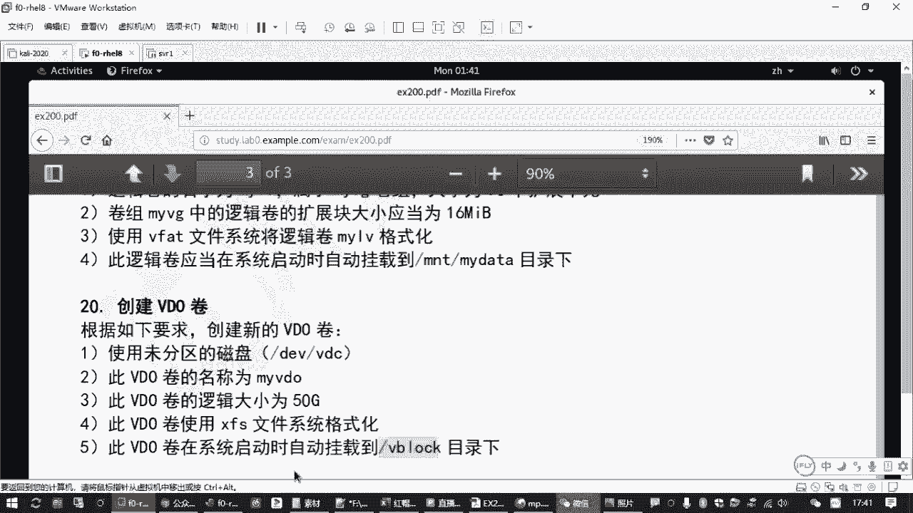

其实关于考试环境的一个介绍啊，我们之前已经给大家提过了。

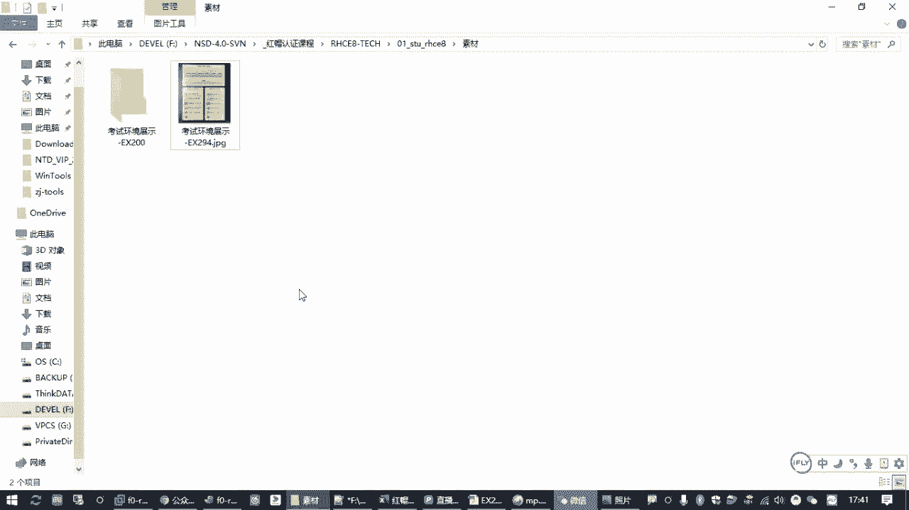

也就说呢我们每个同学呢会有一个真实的机器。现在大家看到的这个图片，就是你正式考试的时候真机的一个画面。那你进到这个真记的画面之后呢。你要看考试的要求，就是点红帽这个图标。你要控制讯拟机。

就点红帽底下有一个虚拟控讯机控制器的这个图标。如果你想用那个终端，就用终端这个图标。除了这三个图标以外，考试的时候在征绩的环境里边，你几乎用不到别的工具啊。因为在征集的环境里边，你没有管理员权限。

等你填完各种信息之后啊，登录进去也其实不用登录啊，就点完确认之后就进到这个桌面了。你是一个普通用户，那所有的操作都是在我们的虚拟机里边来完成的啊。那如果你点开红帽图标就看考试要求。

考试要求里边也会告诉你这个训机怎么去控制。对吧然后再去答题。上午的考试呢，IHCSA的部分只需要操作两台虚拟机。其中一个虚拟机。做的是比较简单的一堆题目。然后还有一个训迹呢。

是做的和磁办分区相关的破密码相关的这一堆题目。对吧是这个样子的。嗯。当然啊这两个机器呢它的名字不一定叫read，也不一定叫blue。这个大家你要记住啊，你别到时候考试的时候说老师我这没有read呀。

怎么办？那考试的时候，谁给你保证这个一定叫read呀，不是啊。😊，可能是两个跟颜色完全没关系的。两台主机。但是你放心一定是两台机器啊，两个虚拟机。题型和我们讲过的都差不多，但是名字叫啥IP叫啥？

用户名是什么？密码是什么是吧？那些肯定会变的嘛。😡，那再一个呢大家操作这些虚拟机的时候，你要知道这些按钮是干嘛的。你点开一个root按钮，出来root虚拟机的控制，点开bl录的按钮。

出来bl录虚拟机的控制。对吧嗯，然后从上往下这些按钮各自的作用你要非常清楚。因为咱们以前有个同学，他从来没有，因为咱们讲题也不讲这种真实的环境，这个红包是不让讲的是吧？你知道这意思吧？就正式考试的时候。

这是你要现场去看的。😡，我们是这个相当于是给大家剧透了。😊，就是避免大家，因为咱们人多，避免大家你到考场的时候一下慌了，是吧？😡，以前有过这种情况，那那个同学给吓坏了，感觉知道吗？

进去之后一看这个这好的这个环境都没见过，完全很陌生是吧？这心里心里就有压力，然后那你先气的考试，进去之后，密码都不知道咋破了，待了半个小时出来了，那密码没破成功，哎，准备补考去了，那不考了。😊。

所以大家呢你见过这个图之后呢，你别慌是吧？啊，还有一点啊，你点开这个readot之后，这个按钮不是排在左边的啊，那不知不一定出在哪，反正这这个桌面上。😡，对吧。呃，然后呢你点开之后，你看这个红帽子图标。

打开就看考试要求啊。

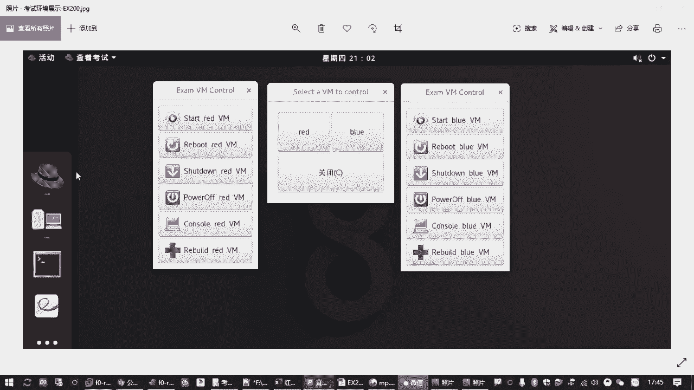

呃，那具体什么样子呢？😡，打开红帽的图标之后呢，你大概能够看到一个浏览器，在浏览器页面里边大概会有这样一段话。上面有一个标记叫重要配置信息。重要配置信息里边会告诉你你将会用到哪几台讯拟机。

这些虚拟机主机名叫什么？IP地址叫什么？现在大家看到的这是不是一个叫172。24。3。5呀？咱们练习环境是不是叫172025。0。25呀，对吧？你那IP不一样啊。你别到时练习的时候练习惯了。

上去考试上来就敲172。25点几几几啊，网段会不一样。考试的时候也不一定叫172D24啊，也可能是别的。那你做到3号机器，一般第三段啊就是三做到4号机器，第三段是4。😊，OK吧。

然后你当前这个主机属于哪一个区域，他也会告诉你，只要属于这一个网状的，都属于这个区域。详细说明啊。然后呢，他下面会告诉你。😡，比方说这里。第一个瞬期的管理员密码叫跟密码。大家现在看到你考试的时候。

看到这种消息啊。在你的红帽图标打开之后，就这个。

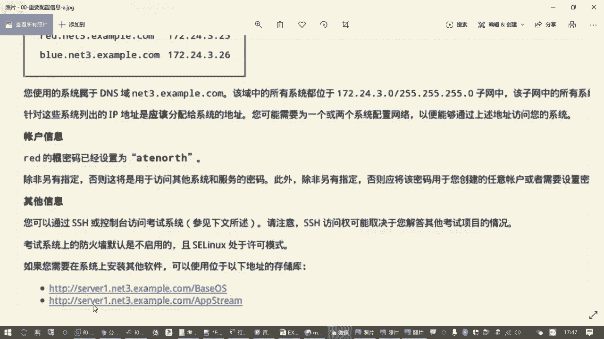

打开一个浏览器，它左边会有一个语言选择界面。叫lan问题啊，好像默认就是中文的。你要是觉得中文看着不爽呢，你可以选英文啊，没毛病吧。😡。

。然后这个信息里面会告诉你第一个瞬息管理员密码是多少。如果。除非有些题目有另外的一些一些要求，否则的话呢这个密码也是你其他的系统一些提的一些密码啊。当等你真正考试的时候，这个密码不是这个啊。

你说这个密码你不用背，背了也没用。你真正考试的时候，那个密码，你看你的题目要求。😡，对吧。は。啊，然后。😊，其他信息在下面告诉你，你可以通过S3H或者控制台去访问你的考试系统。

所以我们推荐大家用SSH嘛，是吧？你从题目里边复制一些呃访问地址啊。😊，那然后那些用户名啊、目录的路径啊是吧？你通过SSH的方式，你才方便去复制。如果你通过我们的这个控制台界面，consl这个打开。

不能复制粘贴啊，不能复制粘贴。所以大家记住你的虚拟机呢，请大家提前把它的IP配好。然后从你真机通过终端远程连过去。

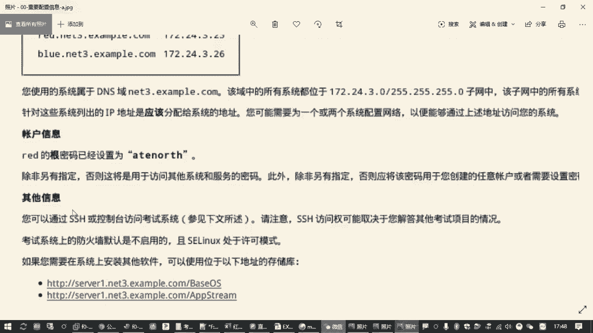

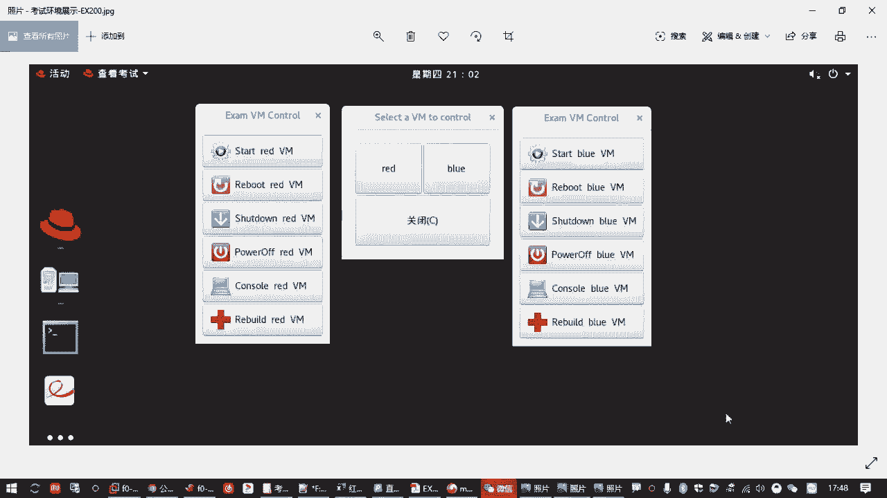

然后你可以复制粘贴，OK吧。然后考试系统上的防火墙默认是不启用的。其实除非你上午的考试有要求，否则防火墙你不需要开啊。你万一他自己开的，你就把它关了。😡，然后slinux可能是开启的，这个不是固定的啊。

你到时候看题目要求去。然后呃那个软件源，如果你需要在你的系统上装软件包。他在重要配置信息里边，就这一栏，他会告诉你软件包资源在哪？他只会给你两个网址，你能不能用，那就看你自己的了是吧？

比方说你的网络地址，你DNS配置不对，然后你的那个。😡，网光什么配错了呃，掩码配错了是吧？你连不上，那是你的事。考试环境准备的这个资源都是可以用的。😡，你训机要配好啊要配好。

然后在上午的题和呃就是那个第一个训机和第二个训机。可能有一个虚拟机，他会明确告诉你，你要配软件源。另外一个虚拟机，他不会告诉你说你要配软件源。但是如果你想装软件包，你自己去配一下。尽管他没有要求你配。

但这是也是考试的一部分。他题目没有要求，但另外有题目让你装软件包，那你不会员，你上哪装软件包去，是吧？😡，所以不管他有没有要求，重要配置信息里边已经告诉你了。😡，你要是找不到软件包，你不能怪考官，对吧？

考试环境这个志愿都已经给你了。在考试环境，你只能访问他这个考试系统给你的这些链接。😡，上不了网，你还不了互联网啊，这个要知道，这个是重要信息的一部分。那另外呢。你还可能看到另外一部分的重要重要信息啊。

比方说重要评测信息，你答完题交完卷，考官之后，等所有的同学都交完卷之后，他会运行一个命令去收取所有同学的成绩啊，其实就是你答题结果啊不叫成绩。因为答题结果呢，他收完之后要发给红茂总部。

洪茂总部那边呢会评分数。对吧那要求是什么呢？在收成绩之前，那个脚本会把你的虚拟机重新关机，有关机之后重新开启啊。你的机器死机了，它也会给你重新断电啊，强制断电啊，然后重新开。所以你的系统上它有一个提示。

你要保障你的两台虚拟机在关机重新开之后，你的答题结果还在。如果考官把你的熏机关机重新开。好，你结果没了。啊，比方说你那个VDO券然没挂上，比方说你上面那个网站82那个端口，你没开启。😡，那没用是吧。

那那你白配了是没用啊，所以要确保你所有的配置和服务。在重新引导之后，要仍然能够有效。呃，也正因为如此，所以我们用到的各种服务。像我们前面讲到的那些什么VDO啊，是吧？你都别忘了要把它设成。😊，开机自洗。

是吧你哪怕你交卷之前了，你重新补一下。😡，啊，包括我们前面讲到的什么calon D呀，你两台机器该启的都行嘛，没毛没毛没嘛，是吧？你别忘了啊，如果你记得呢，就把它都加上啊，都加上。😊，呃。

这个我们re的机器没有V丢是吧，最后告诉告诉我不存在没装包嘛。所以这个就是你我要提醒一下大家是吧？你别忘记了啊。😊，呃，另外呢所有的服务。然后各种设置你不能需要有人工去辅助，你不能跟考官说啊。

考官一一会帮我把那个红色讯机先帮我起一下呀，那是省省人家没空啊，所以你要自己去保障你的机器重启之后，所有的答题结果还在。呃，然后瞬机的管理，它下面有一堆描述啊，这个我就不说了。

这就是刚才我们给大家已经讲过的，就这个图标这一排按钮是吧？

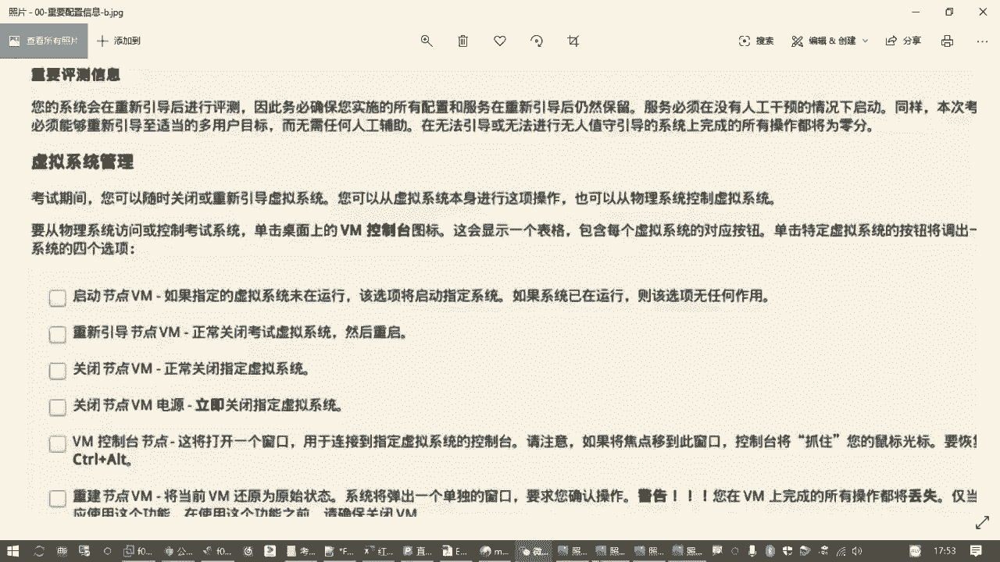

怎么去操作？啊，分别是开机重启。啊，然后关机强制关机，看那个显示界面还原。如果你的虚拟机被你自己搞挂了，时间还来得及，你可以把虚拟机的还原重新再做一遍。😡，对吧那你闲着没事，那，一般就不要去还原啊。

尽量不要还原。你如果瞬机要搞挂的，要么就别挂，要挂就早点挂。😡，所以建议大家。😊，建议大家呢，你可以把那种。

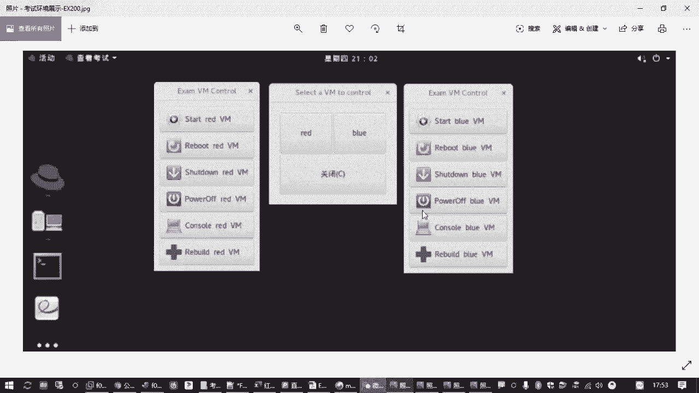

呃，容易把机器搞惯的题目呢先做啊，啥意思啊？就你先把那个blue那个机器，你先做的也行啊，是吧？你先把两个机器，你可以把那个什么IP啊语原啊先配好。然后bl那个机器呢。

你把我们今天讲到的那些分区啊那个先做啊，如果你没把握的话，对吧？😊，你先做做完之后，如果还能起还能开机，你心里就踏实了嘛？你万一开不了机，你还可以重新再来，对吧？你别到最最后做到快交卷的时候。

只有10分钟了，是吧？把机器搞挂了。😊，那这个考试基本上就挂了啊。你只要有一个机器起不来，基本上你通过的难度就很大，基本上就挂了啊。所以两个机器一定要能开机。这是叫重要信息啊重要信息。所以大家要了解。

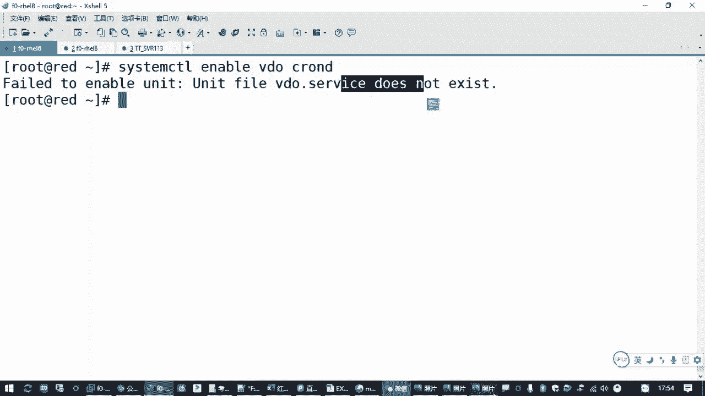

嗯，那后面答题的时候呢，具体的题目呢基本上都给大家讲完了啊，无非就是这些啊，你看到的界面呢可能是这个样子的来一排。😊。

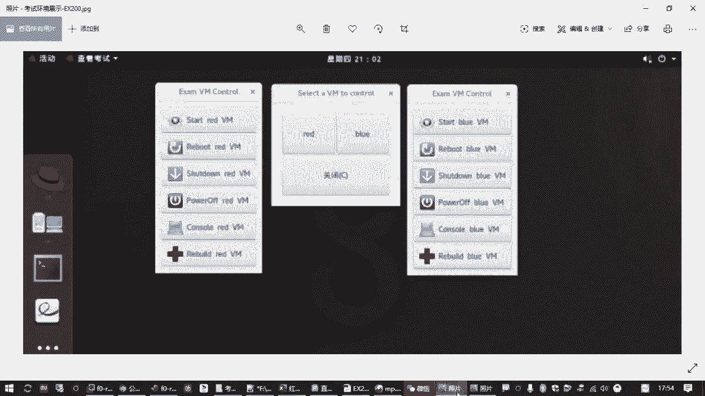

我们挨个给大家过了一遍啊，他那个题目里面会分两两。😊，16吧一长6，然后他会要求你在乐的这台机器上做什么啊，另外在。b录那个机器上又做什么？大家仔细看清楚啊，到时候你考试的时候。

你别人家要求你在那个ro的机器上做的，你跑到补录机器上去做，那就白做了啊，懂这意思吧？比方说我们讲的这个系统调优那可能就是在第二台机器上做的那你非得跑到第一个机器上做，对吧？

那其实从操作上来说是没用的啊，当然我们说调优这道题其实你不做也行，是吧？那这是送分题啊，但是你说这个逻辑卷。😊，啊，然后破露台密码。😡，你要看好是哪个机器啊，你别做错机器了，做错机器了。

衣服真的是白做啊，真的是白做啊，一定要看好了啊。😡，不是。那整体来说呢，那我们上午的考试应该还是难度不大啊，难度不大。呃，对于我们第一个root这个机器呢，稍微有点难的应该就是那个调试slin是吧？

slin排错。那slin排错那道题目的话呢，我们是不是给大家讲过，你要给它设置一个错误，在slin强制启用的情况下。你是不是要重启那个服务是起不来的，就正在你没改策略的时候是起不来的啊，起不来之后呢。

你再去根据这个提示。😊，这是最简单的办法啊，你如果能记住这个命令，那那更好。记不住的话呢，你就起服务起服务之后呢，根据这个提示去执行这个操作。😡，执行这个操作之后呢，它内容很多，你要按左右箭头去翻页。

左右屏幕去翻，上下可以上下键去翻啊，直到找到你的那个提示为止。对不对？然后你找这个提示的时候呢。😡，他默认之会告诉你，无法绑定到82端口。😡，那你还需要装一个包吧，还记得吗？😡，一确。

你是不是要装一个包啊，装一个包叫什么？叫那个。😡，嗯，S一tro short是吧？老长了啊。你如果记不住怎么样？在你牙母原配好的时候，你要学会去查找啊，查找SETR开头的，你拼不全，前面这几个字母。

你还是记得住的吧。😡，是吧去查找一下，哎，基本上寄到这个地方就可以了。😊，你复制这一段或者准确的应该是这一段是吧？你这个排错的符器。😡，然后你要把这个包给装上啊。这是上午稍微复杂一一点的地方，是吧？😡。

装上这个包之后，然后你再去重新起服务。如果你的slinux是开启的，它会报错。在这种情况下。你再来执行就那ctrl杠差E。然后它才会出现。这样一个提示吧，就如果你想允许slinux开启82端口。

它会有一个命令，对吧？你用这种方式去查找。这语音。那有些同学可能记得住这个命令是吧？直接敲，但是大家也要把这个安装包的这一步要做啊，要做啊。你如果装包这一步你不做的话呢。

那其实离题目的要求还有一点点差距啊，为啥？😡，人家考你的考点就是slin排错。结果你连人家排错的包你都不装，你这不是太不给人家面子了嘛？对不对？你这个包要装上啊。

他要在相关的文件里边能找到排错的一些记录，对吧？一些提示，这才是合适的。😡，啊，这是刚才我们讲过的这个那其他的呢上午的考试应该就。问题不大是吧？啊。

还有一个alFSauFS呢啊大家到时候呢看我们今天的一个笔记啊，再去琢磨琢磨。其实他就是问我们管理员，你管理员把altoFS请回来啊，就让他帮你盯着一个目录。这个目录呢。😊，如果有人访问那个目录。

他就自动去找一个设备吧。😡，这是今天的讲到的一个点是吧？这个。呃，然后呢这里边提到的预设用户L0登录密码是什么？这个操作不是让我们去设置密码，它是告诉你这个用户的密码是password。

如果你想用这个账号登录到你这个虚拟机，那你用这个密码去验证，比方说你可以SSH去连呀，对吧？然后这个账号的话呢，在你的机器上你不用管，他已经帮你配好的这个账号实际上由这个设会一考试的时候。

一般就是考试专门有台服务器，由这台服务器提供啊。对吧所以你这个你别想太多。😡，那练习的时候一般我们是就不用去登录了嘛，直接LS去看它的主目录。如果有就OK了吧，是吧？考试的时候练习的时候。

我们讲的这个方法一样管用。如果你有时间呢啊你可以去登录一下，检测一下，写入权限。没时间，你只要LS看到那个目录在啊。就算成功了。对吧这是前面这个。其他的没啥了是吧？😡，就是创建目录啊，改权限这一堆啊。

那再一个。补录这个机器，这就今天刚讲过的。补录这个机器呢一定要把这个破密码啊，破露成密码，这个操作你一定要熟练。😡，因为今天开到好像有同学破密码的时候，刚刚在群里有问的是吧？练习的时候练习一遍不够是吧？

加了个RD点break就加错地方了嘛，加错地方了，开机进不去是吧？那不行吧，是吧？所以这一块呢要记住怎么操作啊，一定要练熟练的啊。😊，因为你不录这个机器，你要是密码都破，你破件都搞不定，进不去啊。😡。

进不去就相当于你后面这1234567道道题全都放弃了。那一共才多少道题是吧？你这一大半题就没了啊，那不行啊。😊，再一个就是分区这些操作，就是小心，你别把那个系统给搞破坏了，你别分完区之后，重启起不来了。

是吧？😡，然后还有一个容易把你的机器搞坏的，就是VDO券。嗯，VTO券呢虽然操作简单是吧？嗯，但是呢刚才我们也讲过，你在挂载的时候啊，要加上我们的。😊，啊，加个什么东西啊，就挂载那个配置参数。

开机挂载要写上nettDV。或者是我们笔记上给他写的这个叉杠stemD点request啊。啊，工作当中呢建议大家写这个规范一点。啊，考试的时候呢，你就看呗，你写这个那个第一位，这个省事一点，好记一点啊。

😊，写完之后你重启一下啊，自己测试一下。这是答题的时候注意的一些要点。那大家最后所有的题目都答完之后。建议大家把你两个讯机，你自己关机一次啊。因为考官以后给你关机，那干嘛我们不自己关一次。😡。

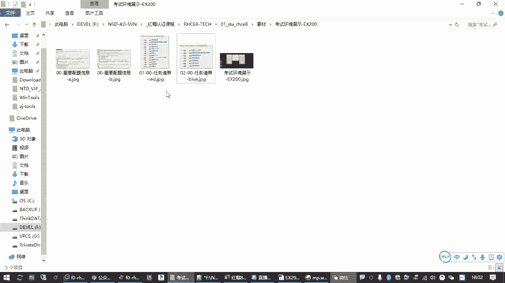

你自己打开这个控制工具，按pll off，把这个read关闭，再按p off，把这个blue关闭，关闭之后呢，重新把这两个循机开机。😡，开完机之后，再次通过你的远程登录连过去，再针对所有的题目查一遍。

如果所有的题目答案都对。

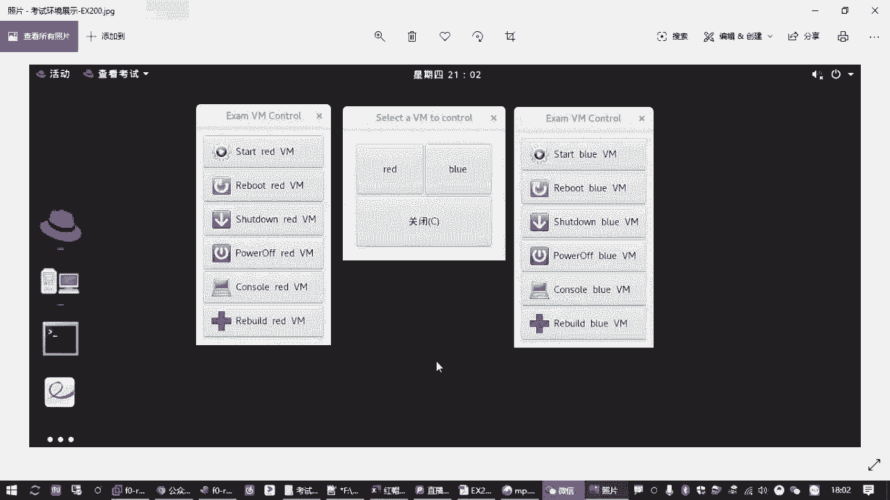

是吧怎么查啊，就看题目要求嘛，题目要求的这些条件。😡，你看都在啊，那就行了。😡，你真机不用关啊，你直播关你虚拟机就行。😡。

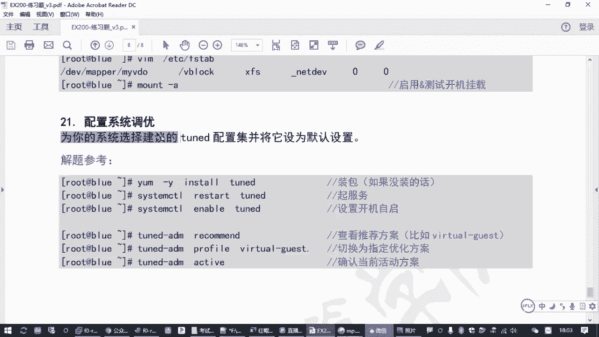

对吧你把讯机关完之后，重启再检查。检查完这之后呢，你再跟考官说，然后我交卷了是吧？😊，因为考试的时候呢，大家要把你的身份证摆在你的那个座位前面，考官随时要查的啊，然后只能带一支笔。

然后考场会发一发一张草稿纸。交卷之后，你的草稿纸不允许带出去。如果你把草稿纸带出考场，考光来检查你的个成绩，检查你的工位，在你这个检查你那个座位，在你座位上找不到草稿纸。那你的成绩可能会被算零分啊。

这个还是比较严格的啊。嗯，然后你离开离开考场的时候呢，你身份证笔可以带走考试过程当中，你的手机呀、包啊各种资料不允许出现啊，只要有出现，考官有权利给你记零分啊，明白这意思吧？😊，严格禁止作弊啊。

不要作弊。最后你交卷之前呢，你的讯拟机是关闭的还是开启的无所谓，反正考官之后会把你的虚拟机关机再开开了之后，如果能连上，能收成绩，那就正常。如果重新开连不上，那你这个机器就白做了，对吧？这个要注意啊。

😊。

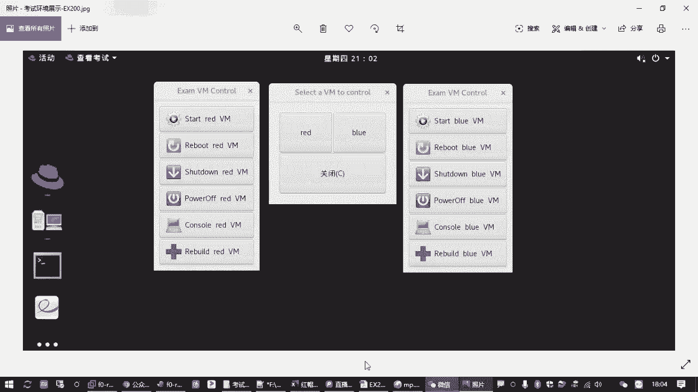

嗯，然后。其他的就没啥了，但是交完卷之后呢，出考场之后不要交头结啊啊，也不要和其他的同学去讨论考试题目。这个红帽的保密要求还是蛮严格的啊，最严重的处罚是终身禁考啊。如果违规比较严重，终身禁止考红帽。

你后面考红帽架落师啊什么什么都那就没戏了，是吧？轻一点的话呢，3年之内禁考是吧？那也不值当的啊，不值当的。嗯，刚刚有同学问到的是复杂是吧？😊，嗯，大家看考试题目的时候，它前面会有。😊。

有几个这个圆圈是吧，这个是给你自己做标记的，你查不查无所谓。😡，就是说你做完一道题目之后呢，你可以在王城这里边打个勾。这个是告诉你啊，我这个题做完了，我一定对，绝对不用查再查了啊，就给你自己看的啊。😊。

呃，然后有些题目呢，你可能心里你还没谱，然后我一会儿要检查一下呀，你在复查这里标记一下啊，所以这个就是给自己看的啊。😊，OK吧。😊，就是给自己看的，你标不标无所谓。😡，Okay。是。

然后大家今天看到的这些画面。今天课下不要和任何人说啊，不要和任何人说啊，就你们自己知道就行了。等你考完通过之后呢，就忘记哈。😊，Yeah。好，这是咱们上午的考试啊。就RHCSA的部分，其实就这么多啊。

考试是中文的啊，你放心吧啊，你要是你可以切换语言，可以选英文啊，其他的什么日文啊都行。继续。来，大家看看还有没有其他的问题。Yeah。没有交卷的功能啊没有交卷的功能，就你做完题之后。

那个题答题的结一个结果不是存在你的虚拟机里面吗？最果你交完卷之后，考官收成绩是有一个脚本，直接去检查检查你的两台讯机答题的结果。比方说你查找文件呀，不是都要保存下来吗？是吧？你装软件包要也有结果的呀。

开机挂载它会检查你开机挂载有没有挂上，对吧？

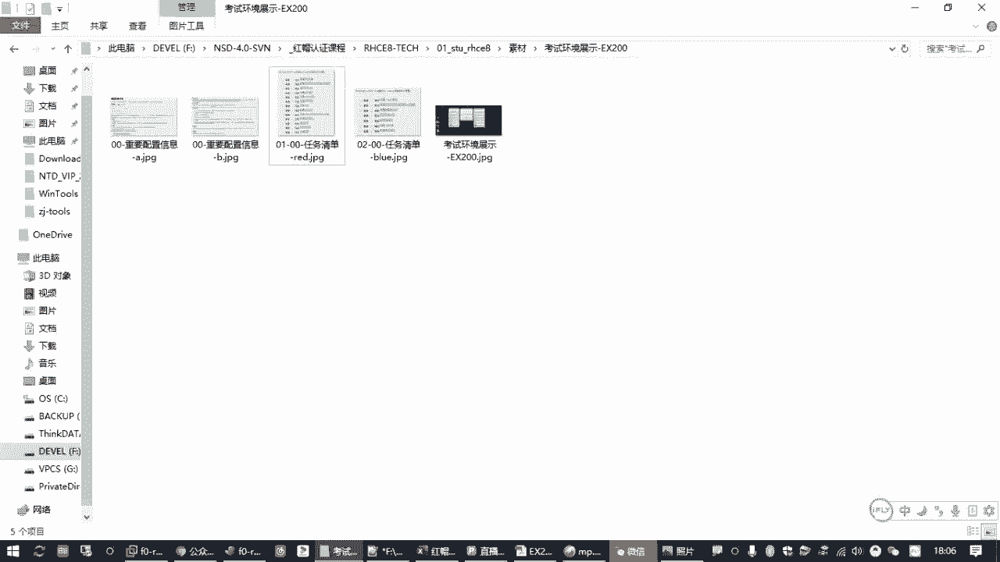

还有啥问题？嗯，就说成绩是吧，成绩我们第一天就讲过了，一般是正常是三个工作日啊，美国的工作日啊，三个工作日。你会收到邮件。呃，一科考试呢会有一封邮件。你按照邮件里的提示去做就行了。

只能在真机上SSH才能复制粘贴。是的，因为你如果是。通过这个界面cl这个控制台进去，这是瞬机啊，训机里边你没法没法从真机直接贴进去啊，你需要通过SSH远程连接，这有一个。

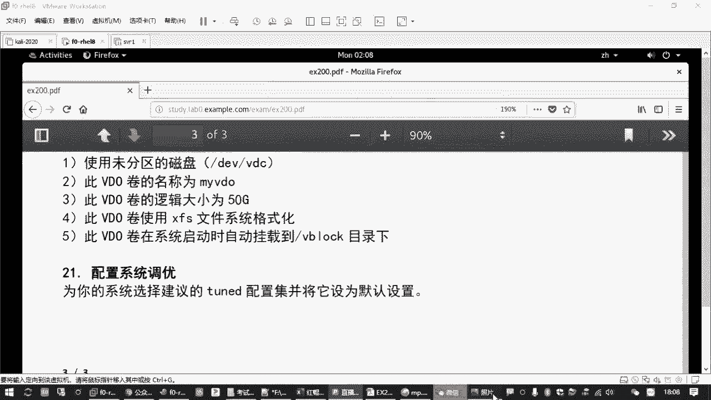

你那阴阳两隔嘛是吧？你瞬肌和你真肌怎么阴阳两隔嘛，你是不能直接通的，你总间得找一个通灵的人是吧？谁通灵啊，就是SSH。你从你真机开一个终端SSH远程到虚拟机啊，然后就好了。

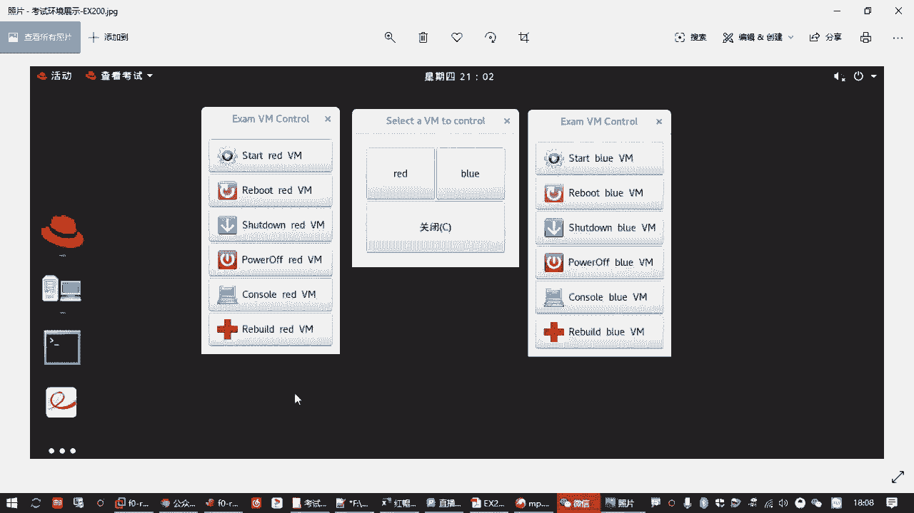

啊，对啊，模拟考试是吧。来说一下模拟考试的问题啊。😊，上午的考试是2个半小时啊，150分钟。呃，那模拟考试的话呢，其实就是大家用的这个练习环境。那大家做完题之后呢。在咱们那个QQ群里边有一个文件。

我上次传到那个群里面有一个文件，这个文件呢叫做有个叫RHT杠lab check杠8啊，有个压缩包。这个压缩包里边呢，你它里面有个瑞的密啊，大家可以看。😊，就你把这个压缩包呢传到你的虚拟机里面去。

直接从真机复制粘贴就好了啊。贴进去之后呢，解包解包完成之后呢，在你的root目录下。😊，会有1个IHTcheck杠CE，还有1个IHT。check杠CSA那大家做完题之后呢。

就是建议大家你模拟考试的时候，你先把所有的信息都还原是吧？然后你再答题，答完题之后呢，你就可以执行这个脚本。啊，来去检查IHT check CSSA。那这个脚本呢会帮助大家去检查你哪个题做的是对的。

哪个题做的是不对的。啊，当然这个检查的方式啊是参考我们练习题。啊，是参考我们的练习题啊，就我们一直讲题的过程当中给大家讲的这个啊study点lab0这个文件，你按照这个文件的要求去做啊，就可以了。

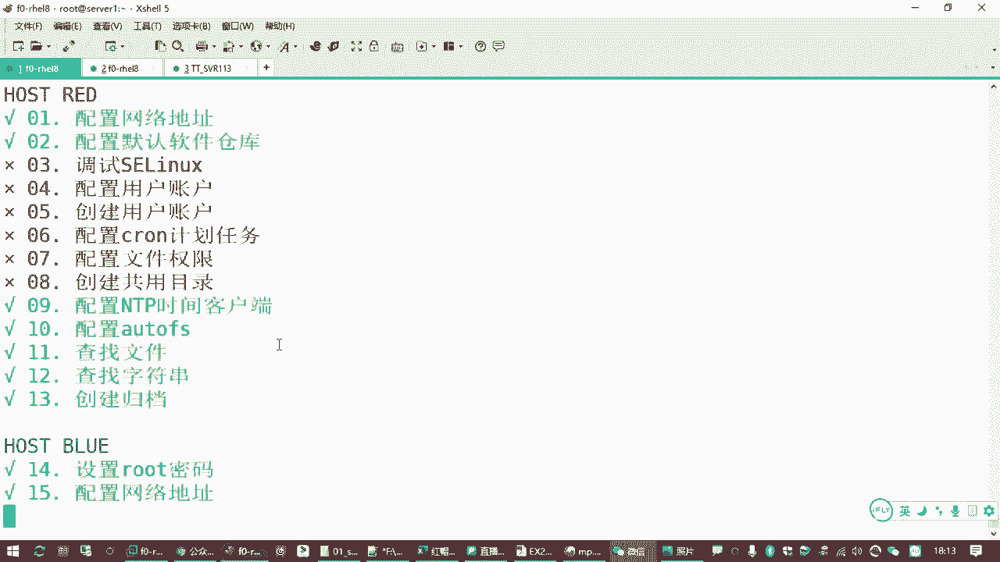

啊，另外一方面呢。

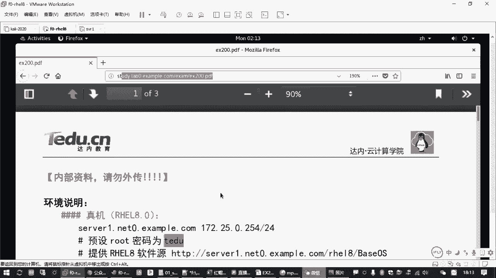

这个评测的结果仅供参考。正常情况下。你可以选择相信这个脚本是吧？你除非你对这个知识点特别精通啊，否则的话呢，如果这个脚本告诉你这个题做的不对，那98%以上的概率，那就是你这个题差某一个部分啊。

做的不完善。😊，然后有极小的概率，可能是因为这个脚本不是特别完善是吧？这个脚本平的有偏差，那也是有也是正常的，还情有可原啊。所以大家按照这种方式去检查。如果你发现所有的题都是对的。😊。

你模拟考试要做到什么程度啊？😡，你不能看资料是吧？你就只看我们练习环境这个题目，然后你去答题。答题做完之后呢，你评测。😡。

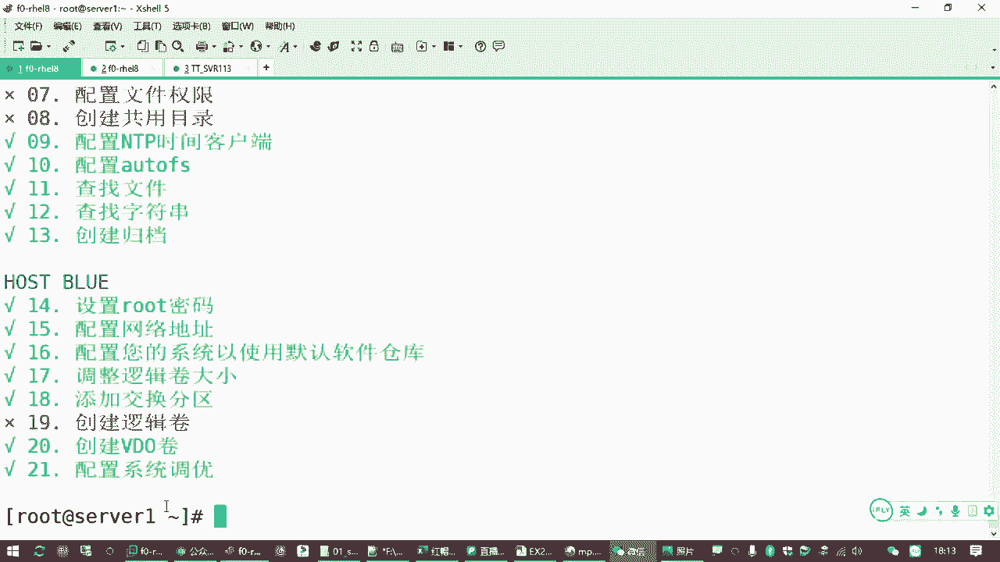

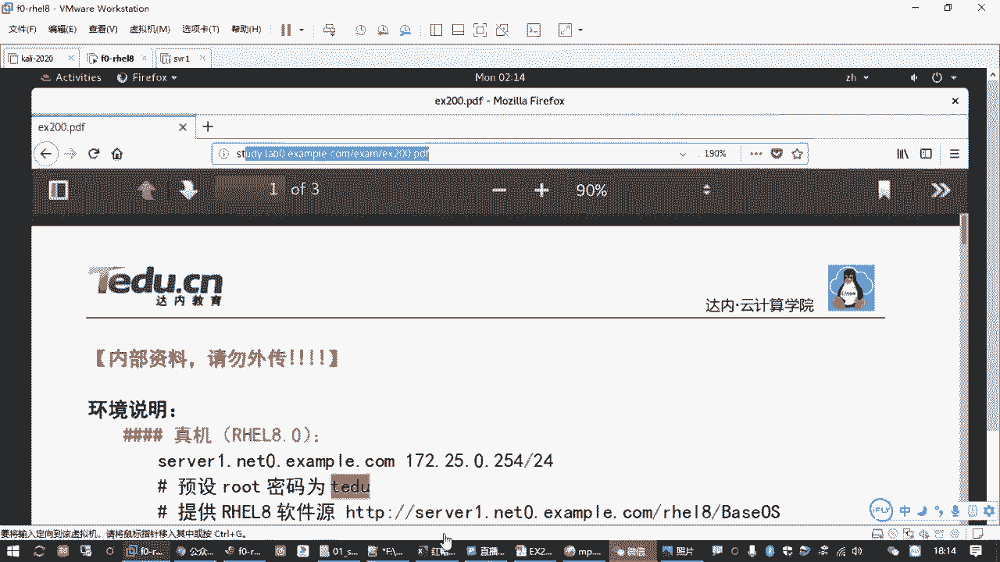

正常的结果应该所有这个都是红，都是绿色的。都是打对勾的那基本上说明你练的还算比较不错是吧？你如果每次你可以做完一遍之后，你重新还原再来一遍。你要是连续做三遍。😡，上午的考试啊。

你每一次都能够在一个小时之内搞定，每一个题都是绿色的对勾。那你就算是炉火纯青了，是吧？你基本上就不用担心上午的考试的问题了啊。好吧，这是关于考试模拟测试。那下午的考试就有另外一个脚本啊。

这个到时候我们讲到那个科目的时候再说。啊，这是模拟测试，和模和那个模拟评测。啊，咱们中信的班主任老师呢一般会建议大家你要做一个模拟评测，当你所有的结果都对，他才建议你去报考。

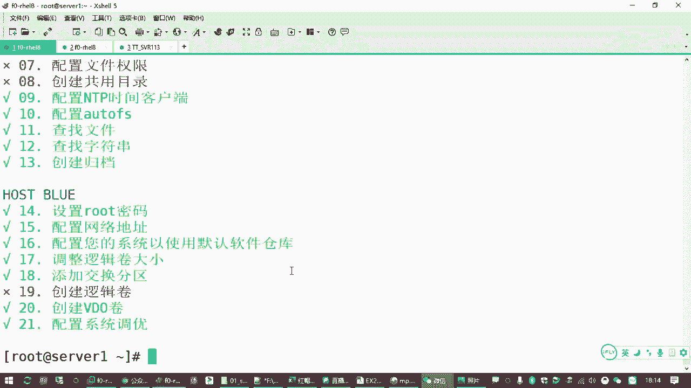