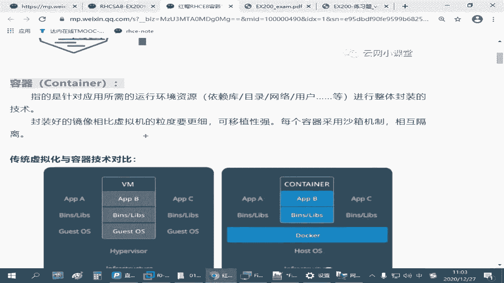
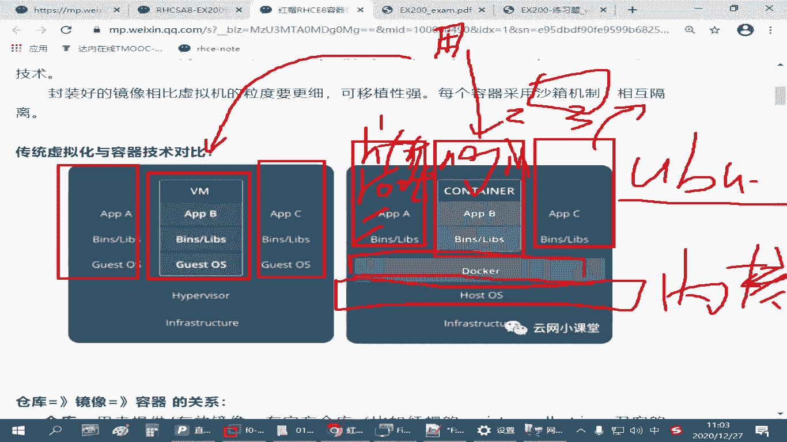
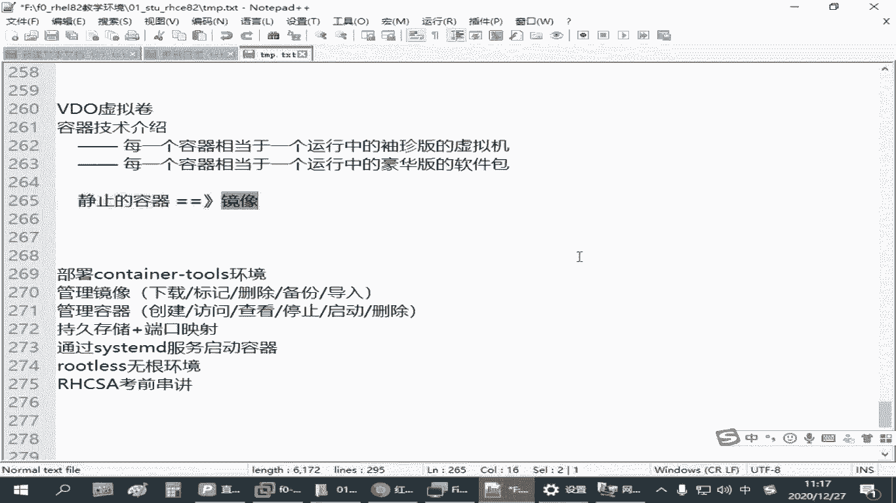
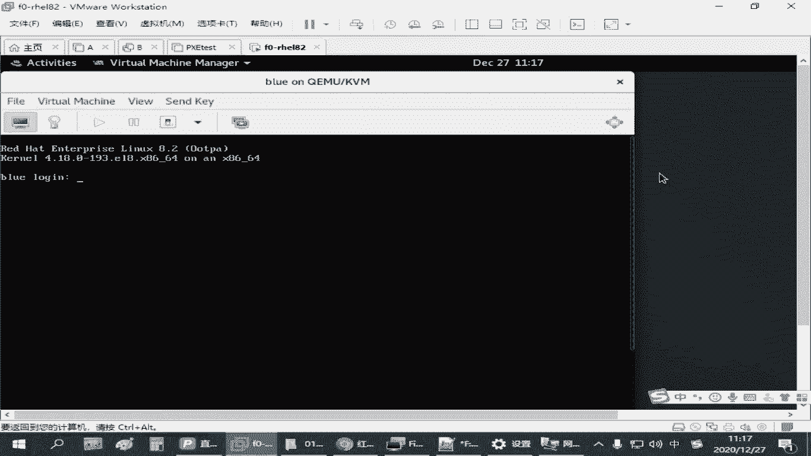

# 全网最全RHCE红帽认证全套入门教程 - P24：4.01-容器技术介绍 - 达内-程序猿 - BV1f64y1q7b5

那容器技术呢呃实际上在红木八里边啊，它用到的这个pdman管理工具，他官方的资料介绍的是呃，简单的说你可以认为pdm它是可以用的，用来代替我的doa的，如果你以前用刀客这个命令去管理我们这些容器。

那你现在用pdm也一样，就把这个命令名字给换一下就行了，大部分的操作是兼容的啊，是兼容的，但是它的功能会更加完整，可能说执行的效率会更高，同时呢红毛八的系统里面。

这个容器技术它会整合就在我们更高级的这种云架构里面，像open sf这样啊，库巴s一样，它都是利用利用这种技术来做的是吧，他可能在迁移的时候做云计算架构部署的时候会更加方便，当然咱们考试的考试的时候啊。

c一的考试它不会考这么个更深入的东西，基本上就是我们在一个红毛八的主题上，相当于做一个单主机的容器模型，所以那这个地方呢我们最后后面啊要学会的一个最核心的命令，就是叫p o d m a n啊。

叫pd pdman，其实是叫pd的一个管理啊，名字来源呃，p o d呢它的英文单词的含义应该叫什么豌豆是吧，还有那个什么飞船的那个叫什么飞分离舱啊，啊如果叫豌豆的话，那像那种他在家里吃过那种豆子是吧。

那豆子长在那个里面是一个一个的一颗一颗的，是不是长了一排的啊，这个形状的，那其中的这一个豆子我们就可以理解成是一个容器，那一个pod呢就相当于一个豆荚一样，豆荚里面是可以放很多容器的，那关键在哪里。

关键就在于我们这个容器市场了是吧，那核心的工具叫pdman，是这叫这个叫豆荚管理器，那其中的一个豆子叫一个容器的容器又是啥呢是吧，我们说的容器啊，嗯大家如果第一次接触这个概念。

可能你会觉得不太好理解是吧，其实我们说容器的话啊，它指的是我们针对某一种某一种应用，它把需要用到的系统环境依赖的软件包，需要具备的往那种那种目录目录结构，网络ip地址端口，用户账号等等等等啊。

把它封装在一个整体的单位里边，所以容器那就我们说瓶子一样嘛是吧，你就能装东西的啊，那么容器它也是封装的一种技术，那原来在刀客的资料里边啊。

一般会拿容器和我们的虚拟化做对比，那左边这个是虚拟化，右边这个是容器，那最终我们说一个虚拟机也好啊，一个容器也好，那我们拿它用来做什么呢，都是用来对我们的用户来提供服务的，比方说我们要做一个网站。

是不是，那你要做一个网站的话，假如我要有一个n阶x，假设我们用虚拟机来做，你像左边这个啊，中间我们要跑一个虚拟机，那这个虚拟机呢我们是在我们的虚拟化平台上来发动，那我们需要有底层的硬件是吧。

底层的硬件上面你需要有虚拟化的环境，不管是那种企业企业版的虚拟化平台，还是我们现在在windows里面装的vm啊，不管哪种方式，那中间呢我们需要去在这个虚拟化平台上安装一个一个的虚拟机，是不是在哪。

这叫训机，那这一个一个的虚拟机呢，它相对来说就是独立的啊，就是主力走怎么个独立法呢，第一个虚拟机我可以装一个36s7 ，第二个虚拟机我可以装一个红包八，第三个虚拟机我可以装一个windows。

没问题吧是吧，那每一个瞬间呢，其实我可以给他准备独立的操作系统，既然有独立的操作系统，那它就可以有独立的软件包，我可以给他建独立的配置，给他准备独立的ip地址，没问题吧是吧，所以这个是一个完整的啊。

基于操作系统环境的封装，这个我们把它叫虚拟机，那容器基于我们刚才讲的一个目标啊，还是为我们的用户提供一个n，这个是一个网站，那如果我们用容器技术来做的话呢，我们不需要这么麻烦，因为容器技术它封装的密度。

密度呢会更小，容器技术它只需要包括，只需要包括它用到的软件包和为了运行这个软件包，它所需要用到的依赖的软件包，一些函数库，还有一些目录，刚才我们讲到的网络啊，用户啊这些。

那其他的比方说linux操作系统内核，它不需要，那每一个容器它也不需要有独立的操作系统啊，但是它能够达到我们相同的目标，就是最终呢我们可以假设外面有个用户啊，那用户呢要访问我们的一个n这个是一个网站。

我可以访问我们的一台虚拟机，在虚拟机里面装了一套按揭，装了数据库是吧，跑了一个网页没问题，我们用户也可以来访问我们一个容器，它同样也可以访问我们的那n gx，可能按n gx里也有数据库。

访问他的网页也没问题，但是它的好处在哪里，容器它的底层是和我们linux系统是够用的，同样底下需要有硬件设施啊，上边有操作系统，容器技术所基于的操作系统环境，目前为止就是linux啊。

所以没有windows平台的啊，就是linux linux平台上跑一个刀客，或者我们现在要讲的这个虹猫巴黎的容器技术，基于这个容器技术往上面提供一个一个的这种小盒子，这个小盒子叫容器。

它对比我们的虚拟机来说，这个容器它封装占用的空间会更小，因为它的底层linux系统的内核啊，和那些共用的部分是重复的，如果你这些不同的容器，它底层相同的内容它可以除用，啊它是可以重用的，那你每一个容器。

比方说，假设我在这个呃容器服务器上啊，我需要有个操作系统，像假假设我需要有一个乌班图是吧，我可以单独准备一个乌班图的东西，那么差不多他只需要把乌班图独有的那些东西给你准备好就行。

那假设你有一个班的乌班图的容器了，你上面再想跑一些其他的资源，那你只要基于这个容器的基础之上，在上面再封装另外一层就行，可以一层一层的叠加的啊，这个跟剥洋葱一样，一层一层往上挪是吧。

所以它这个封装的力度就很细，你可以有基于操作系统的这种容器，我们也可以有基于n gx的容器啊，那我们也可以有基于http的容器，甚至你ngx的容器呢，你可以跑好几个。

你这个左边这个容器和右边这个容器之间呢，它的环境是相对封闭的，虽然它不需要有具有底层的整个完整的内核代码，但是它上层的应用，只要我们愿意，你可以把它分开，意思就是说你在第一个容器里边啊。

左边的第一个右边那个中间那个第二个在右边是第三个，这三个容器里面它都可以有独立的管理员账号root，它可以有独立的根目录，可以有独立的那个网络设备，可以有独立的程序对吧，这个环境是分开的啊。

其实他这种区分的方式跟我们虚拟机差不多，就是独立，这叫什么杀相机是吧，就隔离的啊，隔离的这种方式呢就可以让我们的管理员啊在部署一个，比方说你要搭一个网站，你要快速交付一个网站，你就会很方便。

那正常情况下，比方说我们有一个linux服务器，你说你要部署一个基于n gx的环境的网站，那我们是不是要去装n gx的包对吧，装好包去配相关的配置文件，准备网页资料，然后再配置ip地址端口。

然后往外发布，但是如果你有一个ngx容器的话，你只要一条命令，启用一个n gx的一个容器，在启用这个容器的过程当中，你告诉他你应该建立什么端口，应该用哪个网页目录，马上就可以了，这个包不需要我们装。

因为ngx这个容器里边已经把它运行，这个ngx网站程序所需要的那些依赖的包都已经准备好了，甚至我们都不用去考虑这个包的版本啊，就是那个圆呀是吧，那容器就是基于这个目的诞生的啊。

要简化我们做应用交付它的一个难度啊，那你刚刚用ngx发布了一个网站，那假设我现在又要做一个tm cat，那你现在在平时训机这个技术来做的话，你可能要单独做一个虚拟机，如果是正常的增肌。

你还得单独去找他们看是吧，再换句话说，那我同样基于n gx，我可能要准备两套或者三套网站，它用到的那个端口不一样，或者像是ip地址不一样，域名不一样，都有可能实现的，那如果你在我们的真真实机平台上。

或者你通过不同的讯息来实现，都会特别麻烦，你一套机器用一套n gx，你的配置虚拟主机，然后一旦这个n gx是坏了，那所有的虚拟主机都发不了，是不是啊，那如果你要是每一个虚拟机虚拟机来做啊。

那第一个虚拟机提供一套ng，第二套虚拟机提供另一套ange，这这个代价太大了是吧，成本太高了，但是基于容器很方便，一条命令起第一个另外一条命令，其第二个，很快就可以开启不同的n这个服务器。

所以这个就是我们容器技术给我们带来的好处啊。

那么换句话说我们说的容器，正好昨天我们跟那个有个拓展板做穿甲是吧，打了个比方，你可以把它理解成啊，如果他觉得不好理解的话，它相当于什么呢，相当于一个更加秀整版的啊，或者是迷你版的，更加袖珍版的虚拟机啊。

每一个容器相当于一个，相当于一个袖珍版的虚拟机，我们指的容器指的都是正在运行当中的啊，运行中的休整版的虚拟，那从另外一个角度来说，和我们单独去装一个ngx或者什么某某某软件包对比。

它又相当于一个运行当中的豪华版的软件包，也就是说容器它是封装在一起的一个整体，它比我们虚拟机它的力度要小是吧，要细啊，更加细致，但是呢它比我们这单个的软件包呢比较大，是不是啊，你说我要装一个n gx。

你肯定不只装一个不要配置很多东西的创一赖包呀，是准备网页目录了，发不好的东西，是不是啊，但是呢那容器比单个的软件包呢它的力度要大，是鉴于我们的虚拟机和我们的软件包中间的一个单位啊，唉这叫容器是吧。

所以它可以解决我们通过装单个软件包，再一个一个来配置，这个很麻烦，但是也很灵活是吧，那就很费劲，他把那个很多的包装组装到一起啊，封装成一个整体，让我们用户呢更加简单，但是呢它又不像我们虚拟机那么大。

那训机呢其实它也很方便，但它占的空间太大，比方说大家下载了我们这个红帽的练习环境，那十好几个g呢是吧，很方便啊，大家只要把这个环境下载回去之后，你看我们那么热爱的普通顺序不都有了吗。

但是你在迁移的时候不方便吧是吧，你运行起来就很吃力啊，你在我们这个真机上，你跑一个红帽的环境跑一个没问题，你再跑两个呢，可能就就跑不动了，是不是你像我们那些虚拟机能重启之后呢，可能就花屏了。

他就是这种情况，但是你跑容器的时候，那每一个容器它运行运行的时候，其实其实就相当于一组多个程序把它开开启，并不需要有独立的操作系统啊，所以他比较节省资源，你如果只是在做应用交付，那其实很很简单的啊。

这就是它的一个关键点啊，那这个关键点理解了之后，后面还有一个概念啊，大家要理解的，刚才我们强调了每一个容器，它相当于一个正在运行当中的虚拟机或者是运行状态的软件包，那一定还有一个没有运行的吧。

就静止状态的，我可以下载，我可以用u盘拷贝的这个状态啊，就是静止的这个容器的一个状态啊，叫什么呢，叫镜像啊，你肯定有一个静态的东西嘛是吧，静止的容器，这个一般我们把它叫做镜像啊。

你如果再给我们平时用的那种环境打比方的话啊，这个镜像就好像我们给大家分享在网盘里这个东西是吧，红帽练习环境网盘里那一个压缩包，什么f02 h e l l82 是吧。

然后一个120201207这样的点zip，那个叫镜像啊，那是容器呢真正运行起来之后啊，这个容器他就好像大家你把这个镜像下载回来之后，解剖完成，并且开机是吧，这个状态就是我们所说的容器啊。

但对我们用户来说，这个容器才有价值，你一个镜像的好像没用，他一定是跑起来是不是才有用啊是吧，所以很多时候我们就简称简称容器技术啊，但是你要用容器，你必须先有镜像，你如果没有镜像，你那个容器没法跑。

你如果不从网盘里面下载那个那个那个咱们那个练习环境，或者你没有拿u盘拷贝，你要打开我们这个虚拟机环境。

是不是也没有啊，那这是不可能的吧，不能凭空生成啊。

所以我们跑容器也一样，需要先有镜像啊，那这个关系你要理解关系的话，就得把它倒过来是吧，先有镜像，你把它运行起来之后，再成为一个容器，所以这是一个叫运行中的啊，运行状态的叫乱态是吧，运行中等。

或者说起码你不管在内存里面状态是否正在使用，它一定是在和内存里面有一个地方把这个记录的啊，记录下来的，它是可以使用的一个状态，活动的一个状态啊，但是镜像呢是静止的，可以存储的啊。

静止的可以存储传递的是吧，传输的容器这个呢就是动态的啊，运行中可以使用的两个概念啊，一个镜像，一个容器，这两个概念理解完成之后再理解这个概念，那这个镜像谁来给我呀是吧，谁给我提供这个镜像呀。

你如果把它当虚拟机对比，那这个虚拟机咋来的，要么我们自己创建一个虚拟机，重新装系统，一步一步给做一个镜像可以吧是吧，要么那老师给你朋友给你或者找一些网站下载可以吧，所以你需要有一个来源啊，一个途径。

你如果拿它和软件包做对比也一样，平时我在我的这个linux环境，我要装一个n gx的一个包呃，要么杠y in store或者误判处环境a b c各杠y in store是吧，那你是不是要提前配一个圆啊。

你配好圆之后，你才能够装那个包啊，如果你是手动装包，你是不是在找网站上下载那个扩展名是rpm的那个文件，或者你要去下载乌班图环境那种点db的那种文件视频才能装这个包，那我们现在要用容器这个镜像。

你也得找一个地方来获取，那从哪获取呢，你也可以一样啊，找别人打好的包，直接给你提供，这是没问题的，那咱们在我们给大家提供这个网盘里面啊，给大家提供了一个叫破的破的一面几杠n g x点套。

这个就是打包好的一个技巧，如果大家在你们自己家里练习的时候，你那个真机跑不动，你可以直接找一个正常的linux红包八或者3~28的主机，你把这个镜像下载回去导入也可以练习，没问题吧，这个大概100多兆。

但是我们考试的环境的时候呢，你没法拿这种方式去考呀是吧，所以考试环境呢它会给我们一个叫什么呢，叫仓库啊，叫仓库服务器，仓库服务器啊，我们可以通过仓库服务器来下载，用来跑容器的这个镜像啊。

这个仓库服务器呢就是提供镜像的啊，提供镜像资源的，它可以让我们下载镜像，如果你在这个仓库服务器上，你注册了一个账号，人家给你这个权限的话，你还可以上传镜像，把你自己准备的镜像呢给传上去。

你从这个仓库下载的镜像，我们后面是可以改的，你改完之后你可以提交存到这个仓库服务上去，这个英文名称呢一般叫那个什么叫registry啊，另外写一行啊，这个仓库服务器有时候也叫做注册表注册表服务器啊。

这是翻译的问题啊，一般叫什么呢，叫regtree啊，镜像的话那叫image啊，容器叫container对吧，这样的，所以这三个关系啊要理解一下，那其中的其中的这个仓库服务器啊，常见的仓库服务器。

这个仓库可以有官方的仓库啊，像红包的仓库的话呢，叫logic点点red hat。com，这个我们去测试过啊，有可能需要去订阅啊，有些特殊的镜像是你需要去订阅红包的服务，你才能够去下载的对吧。

那也有一部分是公开的，可以免费下载的，然后还有一个第三方的，原来是一个叫刀客，刀客等i o i o啊，原来那个刀刻刀刻的镜像，我们今天用的这个破特曼和刀客是兼容的，说你如果自己在家练习的时候。

你把仓库服务器指向刀客点io也能用，ok吧，就你没有一个镜像文件也能练习啊，没问题啊，当然这些是官方的或者第三方的这些仓库服务器啊，那除了这些仓库服务器以外呢，我们还可以有私有仓库啊。

私有仓库就是我们自己建的啊，如果你咱们自己会部署这种镜像，会制作镜像，我们可以把它放到仓库服务器里面是吧，去发布也是可以的，比方说咱们那个考试环境，好生环境，那你不能上互联网啊是吧。

他会他会给我们提供这样一个仓库，那个仓库呢叫l就是去点l a b点啊，一个example去看，这是在我们练习环境才能用的啊，在外边用不了是吧，很内部的，上面这两个呢是叫官方的啊，官方红包，官方的。

当然也有一些其他的一些官方的是吧，嗯后面这个是刀客的啊，一般中文翻译成这个啊啊刀客那个官方网站提供一个仓库也有，还可能还有那种第三方的开源的，所以这个仓库服务器你现在看我们写的这一堆换软件包的那个。

打个比方的话，有点像我们这样，原是不是要美元，不就是给我们提供那种软件包的吗，那软件包的话，我们平时你也可以用红帽官方的圆呀，也可以用36s的圆呀，也可以用我们国内的阿里巴巴的圆呀是吧。

目的三方的也一大堆，所以你这么一比较的话，那就更加要了解我们这个容器技术，就是一个豪华版的软件包，封装的更多啊，装了很多个软件包在里面，它可以直接运行啊，啊这它的好处啊，那其中呢，仓库服务器镜像和容器。

那在我们那个微信笔记上呢，下面有个图片，这也是来自于docker的啊，可以更好地阐述他们之间的一个关系啊，刚才我们讲的这个镜像，就中间这一块这个镜像，这是静止的啊，这个镜像呢我们可以呃下载，从哪下载呢。

从那个仓库右上角，这是仓库这刀客的那个registry是吧，仓库下载的动作叫破啊，p u l l l，如果你在这个仓库上有账号，你可以上传或者这个镜像呢下载的时候有要求授权是吧，那你也要提供账号。

提供账号密码，如果要上传上传的操作，那叫push啊，就是往上推，不是往下拉是吧，你下载镜像下载回来之后呢，你就可以离线使用，一旦你从仓库里面把这项下载回来，你说暂时我不想用这个仓库了。

你就可以不上网也能用啊，就在你这个机器上不上网也能用，因为你看这个叫my computer吗，就你这台机器后面这个仓库呢是另外一台机器啊，网上的上传下载镜像啊，上传咱不用管，在考试的时候下载。

你一定得会因为考试环境它会给你一个这样的一个服务器，告诉你仓库地址，告诉你账号名和密码，那你得下载完下载一个指定的镜像到你的这个主机上，然后你才有条件去运行容器，明白这意思吧是吧，那有了镜像之后。

我们就可以把它跑起来，你看来乱啊，把它运行起来之后啊，它就变成了容器，这叫运行的状态，其中在正在运行状态的这个容器呢，我们在控制的时候很灵活，这个时候你可以把它当成我们跑到一个进程一样。

正在进行当中的一个程序啊，你可以给它控制它的一个呃启动可以暂停是吧，可以重启暂停啊，说他有三个控制指令，一个叫stop，一个叫start啊，还有个叫瑞士start，对吧。

这是你去控制这个运行当中的这个容器啊，这叫容器嗯，其中呢我们在管理镜像的时候，比方说你下载完了一个镜像，这个镜像，因为你下载的操作是直接和仓库联系的，这就好像我们平时用亚门装包一样，你要么装包了。

你可能我们并不关注你这个软件包在哪里，但是我不希望我每一次我要装这个包，我都去联网，因为有时候我想离线安装呀是吧，这个时候怎么办，我是希望把这个包存下来的，那我们下载完的这个镜像呢，我想把它导出来。

方便拷到我的u盘里面，方便分享给别人是吧，这个时候可以有个操作叫c啊，这叫备份，可以把镜像导出，导出之后呢，默认的格式是扩展名是点它啊，你只要做一个image导出啊，c它就自动生成一个点t文件。

要用重定向那个大于号啊，那如果别人分享你一个镜像，比方说刚才我们给大家讲的，在网盘里边，不是给大家提供一个镜像嘛是吧，那那个镜像你们拿回去之后，你怎么用呢，那这个时候就算你没有这个仓库没关系。

你可以导入啊，就跟note，所以大家学会怎么把这个镜像导入导入到你这个环境之后，我们就可以用这个镜像来运行容器也是可以的，左边这个是我们用来制作镜像的啊，这个咱们不讲考试也不考。

如果我们想从零开始生成一个镜像，需要做一个制作清单啊，然后根据这个清单呢去提供我这个容器，容器里面要包含哪些东西，可以一步一步的，然后把这个跑起来就可以生成一个镜像是怎么制作的。

咱们暂时先不涉及到这一块啊，这会麻烦一点，ok吧。

