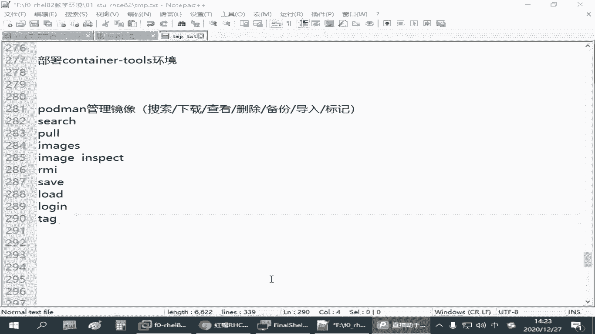

# 全网最全RHCE红帽认证全套入门教程 - P26：4.03-podman镜像操作 - 达内-程序猿 - BV1f64y1q7b5

但是大家不说好了，我们这个容器环境之后啊，如果单独来管理我们这个镜像的话，我们需要学到powder man指令这么几种用法呃，要搜索镜像呢，直接用sch就可以是吧啊pdman sch啊，什么什么啊在用。

那如果我们要去下载镜像的话，那用的是货啊，其实要上传的话，用的是那个嗯拓析吧，但我们没讲那个上传的应用，因为你需要有账号是吧，还有权限才行啊，查看镜像啊，直接执行email件事，删除镜像，rm i啊。

就是rm remove i就是image备份镜像用到的是save啊，导入相当于是相当于是恢复啊，导导入一个已经打包好的一个镜像文件是note，那查看镜像这个地方的话呢。

呃如果你要单独去查看某一个镜像的配置文件啊，其实在emage是后面呢啊，还可以有一个，好像叫inspect啊，就这个这个一般我们看镜像配置文件很可能用的不多啊，但有时候大家想了解一下他是怎么去定义的。

还可以去知道一下，那直接敲一个面积，算是列出这个镜像，当前这个环境里面有哪些镜像法，他是做这个操作的啊，嗯我们看一下啊，特别是有几个没讲到的是吧，嗯可能中间还会大家遇到一个什么问题呢。

就是你在上传镜像的时候，或者下载镜像的时候，有一个叫做那个in啊，破特曼那个音啊，正好刚刚有同学问到啊，我们给大家那个资料里面也有，考试的时候，他也会给你一个账号，一个密码。

那如果我们那个仓库它需要你去验证用户身份的话，那这个时候我们需要去登录，但是如果他不需要验证用户身份的，那你不用登录了，这不是必须打，来我们看一下刚才我们讲过的啊，如果要登录的话。

你看我们前面其实你不登陆的时候下载也能下是吧，如果要登录的话，那你打一个ne啊，奥特曼log in后边跟上你的仓库的那个地址啊，然后它会提示你输入用户名，这个时候呢输入用户名，咱们那个练习环境的啊。

那个用户账号呢是个密，密码是red hat 321啊，如果它提示你成功，那么后边你在和这个仓库交互的时候啊，你就可以上传啊，下载啊之类的是吧，只要仓库再给你这个权限啊，但是大多数情况下呢。

一般我们只是下载的话呃，这种常规的这些镜像仓库啊，一般都可以直接下吧，可以不用登录啊，可以不用登录，好这个也提了一下，那么搜索的时候呢，我们讲到的这个色系啊，是受气后面跟上一个关键词，如果能他能查到。

那么他就给你列出来啊，那下载的时候我们用的是那个破特曼破是吧，那如果你这个镜像已经有了，那你要是要去看的话呢，就是用那个image啊，这是看到已经有了，那如果你没有的话，那你可以直接去下载啊。

根据这个地址人把这个拖下来啊就可以了，这个前面正好已经操作过了是吧，下载镜像，列出镜像啊，呃如果我们想看这个镜像它的配置文件啊，就这个镜像在这个环境里面他怎么去使用的。

所以有个叫pdman image啊，你看后面跟一个inspect，因此他后面跟上你这个镜像的名字，那后边我们只记下了名字的时候呢，如果你通过这个镜像，就最后这个名字能够唯一定位一个镜像。

你直接写n gx就行啊，如果不能唯一定义啊，你可能要把前面这个线呢，就把前面这些东西都写上，那这个后面看到的是关于这个镜像文件的一些资源定义的东西啊，它里面的好多是吧，包括你可以看到它的一些系统环境。

你像这个n gx是基于什么五版土木的来做的是吧，创建的时间啊等等等等，还有一堆啊，这个一般大家可能不太关注是吧，刚才我们讲过的是s这个没有啊，叫image inspect啊，pdman空格。

image空格inspect跟上镜像的名称，那如果这个镜像我不想要了是吧，用了一段时间之后呢，刚才我们看到一个image有一个这个镜像，这个镜像我不想用的时候呢，我们可以把它删除啊。

删除的时候呢也是pdnr m i或者mi mi啊，这这个叫删除镜像，删除镜像的时候一样，我们可以跟上这个名称啊，你把这个全写上，后面打个冒号，再跟上一个nt也是可以的，这是完整的写法，可以有简单写法。

就写个n gx就行，因为我这里就一个镜像啊，这个删除了啊，删除了之后呢，我们再去看书就没了，对吧啊，没了之后呢，要么导入啊，要么又重新下载，如果仓库还在，那又回顾一下我们刚才讲过这个操作或者慢佛啊。

把我们刚刚前面那个搜索到哪，所以有时候你就记不住嘛，我就搜索是吧，嗯同样啊我们下载的时候也是指定它的名称啊，pdman跟上这个仓库地址路径和名称啊，这是推荐的做法，推荐的做法，那刚才讲了几个了。

搜索下载列出镜像，查看镜像定义，然后呢删除镜像啊，log in也讲是吧，其实都是一个平面的操作啊，这几个用法呢大家会问你会用就行了，那再看备份啊，备份和导入啊，就导出导入啊，来下载完成之后。

image看一下，有一个呃，要导出的话呢，有个pad pdman save也一样，可以把这个，定义这个镜像呃，如果要导出的话呢，会不会打一个大于号，比方说我把这个文件呢发到我们的root目录下啊。

起个名字叫for the image ang格式点，好是啊，这是我自己备份的一个名字啊，相当于是啊，网盘里给大家分享的不就有个这个吗，那等它导出之后，我们可以按时去看一下。

所有有一个这样的一个包文件是吧，这就导出去的一个包文件啊，那如果你有这个报文件之后呢，我想导入，我现在可能不方便去连我们我们的仓库，我想把那个导进来怎么办，是吧啊，那个就用那个l o a d啊。

load啊，加载，那导入之前呢，我们可以获得慢去看一下啊，现在是我们刚刚下的，只有一个，那导入的时候呢，我们可以怎么办呢，可以用powder man nol o a d，然后用杠i啊。

杠i指定你可能要从别的地方传到这个呃，当前这个环境下的，你做好备份的那个文件，for the image index。co，然后导入的时候呢，一般很多时候是建议大家给它起个新的名字的啊。

给它起个新的名字，你如果就写一个简单的名字，不写他的一个路径的话呢，呃一般他会自动根据它原始的那个传过来的那个镜像，那个路径给你起名字，那我们可以试一下，给它用一个长名字看行不行啊，导入这种方式啊。

起个长名字，但是你要和原来的区分是区分开的话呢，我们就可以加一个冒号，那几个你可以换名字啊，可以换名字啊，可以加个版本也行啊，1。1，那这是导入是吧，导入因为我在导入的时候，因为原来有一个那个镜像了啊。

这个它会有冲突，因为它中间有一些一层一层的资源是已经存在的啊，他不告诉你已经跳过去了吗，对会有这个提示，那你原来如果没有冲突的话，那就是直接导入，导入之后呢，我们再看一下。

就是你看我们下面会多了一个是吧，这个1。1啊，这就是我们自己定义的，那其实前面这个名称呢我们是可以改的啊，我们下载完镜像之后，我们在管理这个镜像的时候，这个标记我们可以变啊，可以重新改啊。

这个我们考试考试的时候用不到啊，你如果要改他的标记的话呢，其实还有个叫什么叫tg啊，tag就给他打标记，改版本都行，这个是在管理镜像的时候，管理我们镜像的那个名称和版本，可用一个t a g。

那现在你看我们改的其实主要就是这个是吧，那比如说啊如果要改它的标记的话，应该有个port man tag啊，我要改这个，1。1啊，我把它改成什么呢，改成一个新的angex杠六啊，起个名字。

后面版本不加版本也行啊，加个版本也行啊，版本呢给它标记成latest，试一下，改完之后我们再pdman image再看，你会发现又多一个是吧啊，又多了一个，人家多会多了一个ngx杠new啊，内地是。

是不是啊，这就是第三个镜像了啊，那你改完之后呢，原来那个名称之下我们再手动点删除啊，我们可以删除的时候呢，用pdman rm i删除镜像，我们说拣选的时候啊，比方说我们想删除一个叫n gx的。

那这个时候呢你看他找到了什么，找到了我们第一个and ex nt，所以这种删除呢有时候就不准确啊，那大家完整的删除的时候呢，应该是跟上这么长一串名字，再加个冒号，再跟上后面这个标记是吧，这个会更准确。

所以其实你你看我们刚刚这个带领大家删除的，你就把我们原来那个第一个导入的那个镜像给删除了，把这个nt的最终版的是吧，那孩子们，r m i啊，再把这个新的这个删除啊。

最准确的应该后面再加上一个mattest是吧，对应到了这个标记，把这个删除又删了一个，在上边还可以算一个什么，刚刚那个叫1。1的，1。1n x的，portman images没了吧是吧啊，没了。

来重新再导入啊，同志们啊，load杠i指定，刚才我们放到root下的for the image gn jx，点tp后边指一个名字，我们还用刚刚那个名字啊，这是最新版是吧，你看这一次导入的时候。

它没有存在以及冲突的那些资源是吧，他就没有说那个呃什么什么已经跳过去了，所以这是刚才我们讲到的关于容器的一些基本管理啊，啊大家可以把这个练习一下啊，简单的练习一下，大家登录的操作。

你就是相当于在你本机标明的一个身份啊，就标明你和仓库互相沟通的时候，他就连接了一个身份。

这个大家在我们练习环境，你可以去这么去验证，你可以打开咱们浏览器啊。

可以打开浏览器直接去访问。

就不需要用pdman去访问，比方说你在浏览器里面直接访问那个刚才讲过的那个registration lab，点一个example，点com是吧，你是可以看到这样一个界面的，那这个界面你想进去查询。

你想干嘛，我都得登录嘛，是不是你这个web界面你不登录没法用啊，首先让你登录，这个时候你属于一个等于说一个red hat 321啊，就可以进来，这是一个这样的一个一个一个web界面。

在这里你可以看到这些常见的这些镜像都在这是吧，还有什么u b i a8 呀什么的，ub i7 啊，这些通用的一些镜像，然而在这个lib的下面是一个按键上，我们刚刚搜索了，不是说了，收到了这个按键的时。

那下面还有一个h t t p d呢是吧，还有个mad b，那这些又要加锁的是吧，加锁的有可能是下不了，那这个时候你就得登录嘛是吧，或者说还有些需要订阅的，那你也可能没法用，那就需要进一步的授权的啊。

但是咱们现在练习的用的这个难度是开放的话，就不登录也能用，所以我们说这个登录呢它不是说必须的，你要看情况，如果你发现你搜索不了，下载不了了是吧，那到时候你要要说要登录啊，那就登。

如果你发现直接就下载下来了，那还等个啥，不不等等等。

