# 全网最全RHCE红帽认证全套入门教程 - P27：4.04-podman容器操作 - 达内-程序猿 - BV1f64y1q7b5

前面我们讲了这个容器的操作的话呢，啊他就是在把这一项给运行起来是吧，那这个时候呢有时候我们把它定向给跑起来啊，把它叫做一个创建创建容器，那创建容器呢呃跟在pdman后面的话，那个指令叫rua。

这个其实翻译过来政治就要好起来是吧，叫乱啊，那怎么样把一个镜像让它跑起来啊，有好多方式啊，因为我们再说，那查看你当前已经创建好的容器，有个指令叫ps，就跟我们管理进程一样啊。

有个p ps可以列出你当前正在处于启动当中的容器，如果你容器已经被你停止了啊，那我们需要用一个ps，后边跟个杠a啊，这是列出当前已经创建好了所有的东西，呃如果要访问当前正在运行的容器的话。

那你就只能叫e x c c e x e c执行啊，就你运行一个容器之后，我想用它里面的东西啊啊用一个ex c c，呃然后你已经创建好的容器啊，我如果想把它停止，那就是用stop已经停止的容器。

我想把它启动就用start啊，当然也可以有类似达的重启对吧，所以类似类似的跟我们管理的系统服务时的类似类似的那种操作啊，那如果要删除容器的话呢，是rm啊。

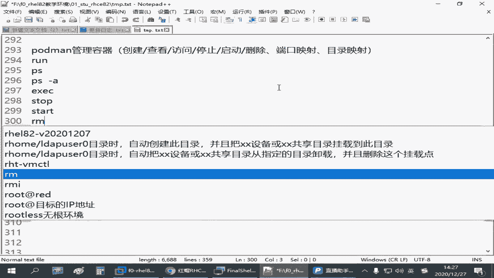

刚才我们前面讲rm i这是删除镜像啊，你把这个i去掉就是删除容器。

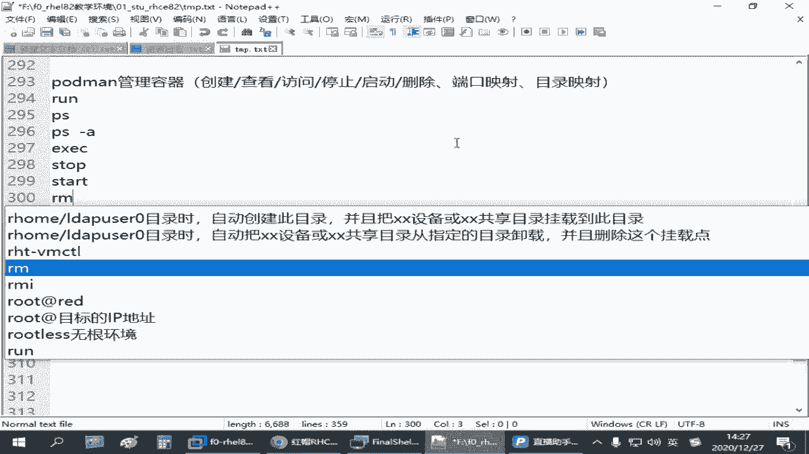

那run呢是把镜像变成一个正在运行的，在内存里边能控制到这种状态啊，这叫容器，那如果rm的话呢，就相当于从内存里把那个东西给拿走，其实有些时候你停止的时候，它可能不在内存里面。

是在你有一个运行的一个目录上保持那种状态啊，就跟他做快照似的啊，你只要你想运行的时候呢，你编一个start，它马上就能起来是吧，你stop它又变成暂停的状态，但是你一旦你做一个rm啊。

那个容器那个状态的保持数据就没了啊，这叫删除容器，那后面我们讲的这个端口映射和目录映射啊，主要指的是我们这个乱它的一些用法，这个还是比较常用的啊，呃run的用法里边呢，如果要，写两个用户放后面啊。

如果要把你的，跑容器的这台机器，它的一个端口映射到我们容器里边的一个端口啊，我们可以用一个选项叫杠p gp，就是你增肌的端口冒号分隔在写容器的端口啊，这叫映射端口啊啊啥意思呢，啊，刚刚不是说。

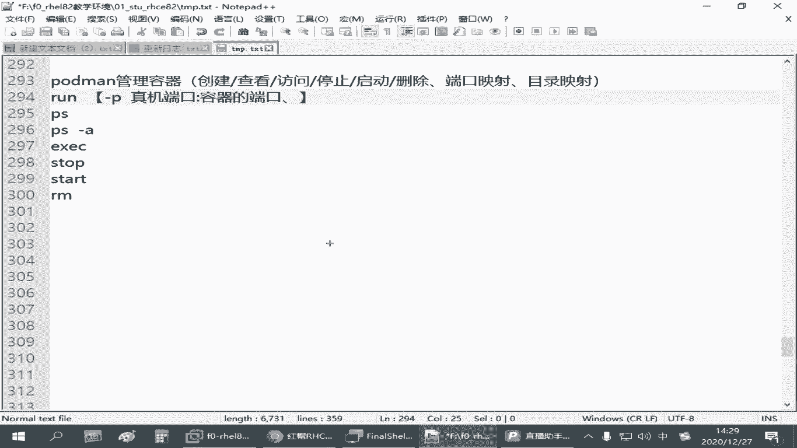

来看刚刚那个图片吧。

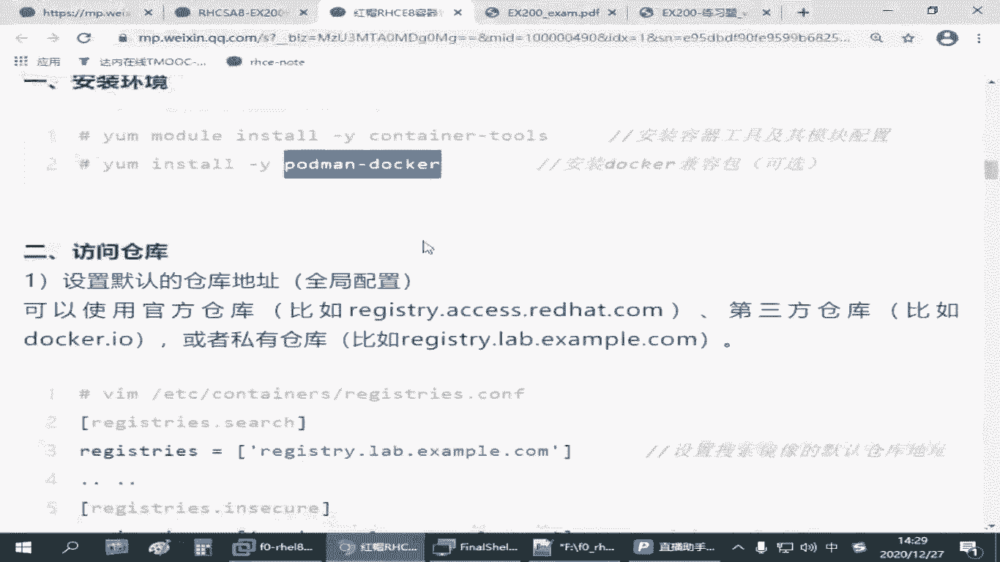

看这个图片，那我们中间这个是不是我们的一台计算机啊是吧，那计算机上面呢我们有镜像，镜像把它跑起来是个容器，假设这里呢我们跑了一个容器，是那个n gx的啊，那n这个时候他搭了一个网站。

但这个n这个是它的一个网站，我们可能另外有一些客户机可能要来访问他的，是不是啊，那这个客户就要访问这个容器的话，怎么访问，你对外是没有直接的接口的，所以我们其他的机器作为web web客户啊。

他最重要访问的是不是还是在访问我们这个计算机啊，你这个真机啊，那这个蒸汽对外它要坚定的是什么端口呢，比方说他坚定的可能是我可以让他坚定8000端口，所以从浏览器可能找的是他啊客户机。

那你增肌这个8000端口，怎么样对应到我们这个n这个容器里面的端口呢，那这个时候就需要一个映射啊，每一个容器你像我们n gx这个容器，它的端口能默认默认在这个容器里边，就制作容器的那个人。

他已经帮我们定义好了，端口就是八零，除非我以后再改啊，你要不改的话，他那口就是800，所以我们需要有一个映射映射的操作，就是用杠p啊，8000冒号管理。

这样的话我们的客户端就可以通过访问你这台真机的8000端口，来访问你n gx提供的玩意，没意思啊，这叫端口映射啊，那还有刚才我们下面要讲的这个目录映射，目录映射呢有时候也叫做那个容器数据的一个持久存储。

因为我们说像这里的index这个容器啊，它运行的过程当中其实是在动态变化的，它和你增肌的那个目录呢其实是没有没有绝对的必然联系的，它是一次性的啊，一旦启用它就在那里，一旦把它停止删除了就没了是吧。

那假设我这跑了一个n这个网站，那有用户要访问这个网站的一些数据呢，那用户可能提交了一些数据，那跑哪去了是吧，那一旦这个容器删了，用户的网页就没了，所以这种情况下我们要嗯就这个容器可以删啊，没关系。

但我的那些网页数据呢，我想你在使用这个网站的过程当中还有保留的，那这种情况下，我们一般会在我们这台真机上面用一个目录啊，假设证据上有个目录是a是吧，目录是a那容器里边用到那个目录上，可能是一个目录b。

就存到我们真机的a目录里面去，这个是可以实现的啊，我们只要在启用这个容器的时候加一个目录映射，也是冒号分隔啊，真集的目录，冒号容器里面的目录，这就可以实现你增肌的目录和容器里边的目录的关系。

一个一一对应的关系啊，这个关系叫目录映射啊，或者叫持久存储，这种时候你这个n这个是容器，你跑了一段时间之后，就算你删了没关系，你刚刚使用的操作的b目录的数据都在你真集里的a里面存着，这种映射。

就好像你建一个链接一样是吧，把它对应起来了啊，当然如果你真机准备的目录和序和这个容器里面的目录是一模一样的，那就更更好理解了是吧，就更好理解的，但这个不是必然的，它可以不一样啊。

如果你证据里面还开了s s1 linux，那有些时候呢可能要考虑到那个s1 linux的一个权限的问题啊，你把证件的目录给虚拟机里，给那个容器里边，它不一定让你这么用啊，所以这个要注意啊，这个要注意呃。

映射目录的话用的那个选项呢是杠v。

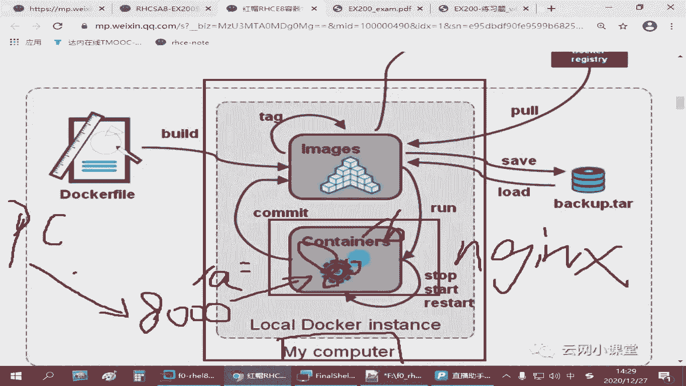

映射容器的话呢是杠p啊，这样的，这是在我们启用容器的时候啊，可以使用这些东西啊，这刚刚我们讲到的这个映射端口，杠p映射目录的话呢，杠v啊是增肌的目录，冒号分隔容器的目录啊。

这样就可以把你增肌目录和容器的目录呢建立一个关联啊，嗯甚至，如果有时候你真记里面那个s1 linux属性啊，你需要去保存的话，一般你还可以在后面加一个杠大g，但是我们工作当中一般就不用这个了是吧。

一般就是把s linux给关闭了，这个又没有，无所谓啊，我们把这个线去掉了啊，你们正用的是最多的，那除了这些以外呢，后边我们运行的容器，如果我们要访问它，有个指令叫什么叫有个选项啊。

杠i和杠t两个选项嗯，杠a和杠t的话，你可以不加这个啊，你可以加这个这个杠a和杠t，其中的杠i呢表示的是需要有终端啊，需要对应啊，需要对应的那个交互会中断交互，需要和我们的管理员做交互的。

然后杠t的话呢指的是我们需要有终端，所以会用的时候啊，一般我们去访问一个容器，最后要跟一个b a s h跟一个半血啊，我要执行命令的是吧，进入到一个交互式的命令行的一个环境啊，另外除了这几个以外呢。

还有一个叫什么呢，就是有时候我不想用杠v去建立一个持久的长期的关系，我仅仅是简单的想把我们征集里的一个文件给给，传递到我们的容器里面去，这有个操作叫cp啊，复制科比，好记住啊。

我们下面下面列出的这些指令啊，都是跟在破的慢，后面的话，你别把它当成正正常，那什么力啊，是跟着pdm后面的好，我们讲了一堆是吧，那还得看例子，大家才要理解啊，我们来看怎么操作啊。

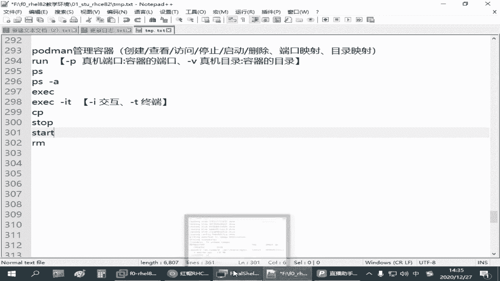

来先看，那现在我们有一个，叫做n g x的容器了啊，有进项了啊，那如果我们要跑跑这样的一个镜像啊，我们可以用rua把它跑起来，那在跑起来之前呢，我们可以用modemp先检查一下你当前有哪些容器。

这是列出你当前运行的那个呃，就是那个容器列表啊，现在是没有任何的容器啊，你看它有容器的id啊，对应的进项容器里面执行的什么命令是吧，状态是什么啊，使用的端口是什么名称，叫什么都有啊，所以在这里呢。

那我们现在是没有任何的东西啊，我要跑一个的话，奥特曼，同样啊你要跑一个容器，你会不会可以拼一长串的名字吧，这咱就一个镜像，咱就偷个懒哈，直接写一个n gx回车。

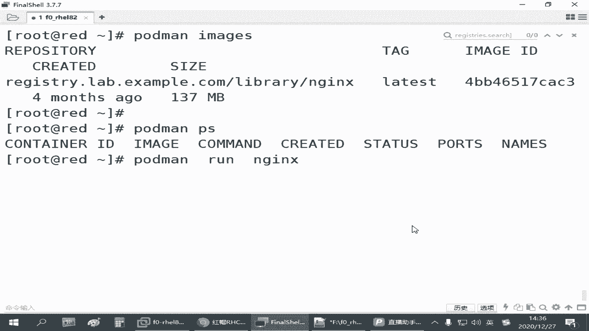

然后这个容器就跑起来了，但是这种方式呢大家会觉得不方便啊，为什么呢，这个容器跑起来之后，它要占用你当前这个前台的啊，你这个界面你再用别的命令就不方便了是吧。

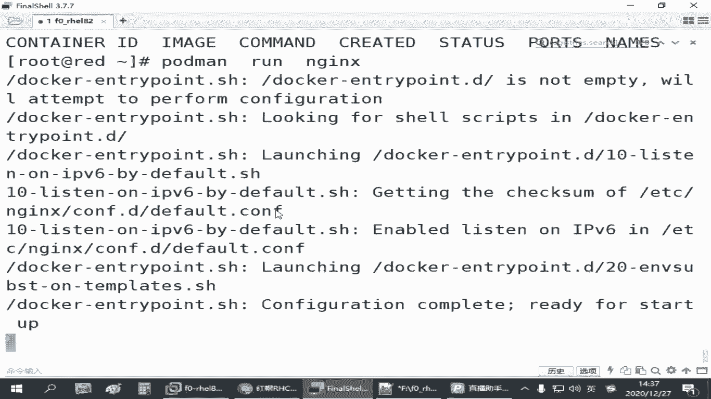

他一直挡在这里啊，所以这种方式呢如果我们是那种提供服务的性质的容器啊，一般不这么用，这没有，这个这是我刚刚开始挡着，我按了一下ctrl c啊，把这个停止了。

但是停止之后我们再来pdman检查一下破特曼p s，你发现没有，是不是啊，让我们再彻底检查一下，加个杠a，你会发现其实有啊，只不过被我ctrl c给退出了是吧，他没有启用啊，没有启用。

如果我要起一个启用一个容器在后台运行啊，不要挡着我去执行别的命令，这个时候呢是pdman在运行的时候可以加一个杠d啊，杠定就表示在后台运行一个容器啊，你看它运行完成之后呢，直接告诉我诶有个i d啊。

这容器的一长串的一个i d啊，这个时候已经运行了一个容器，这个容器我们在执行pdman的时候。

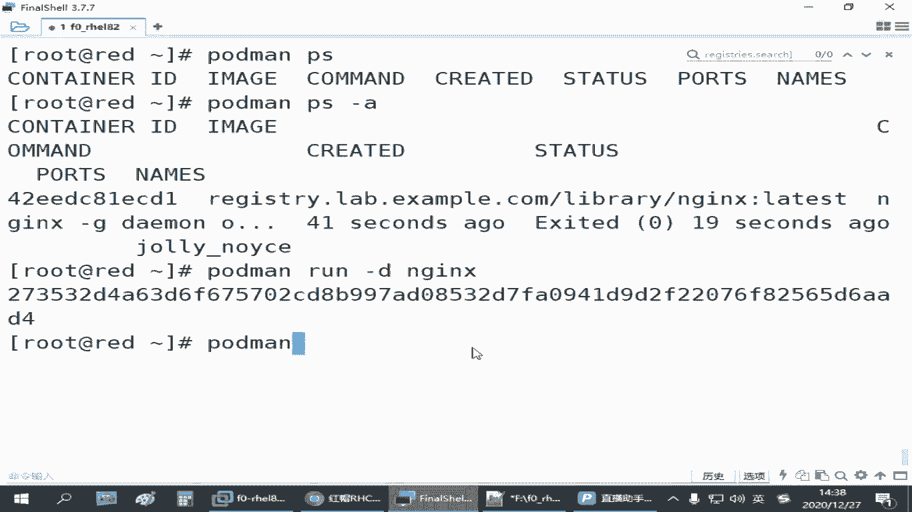

p啊，跟你说这个这个指令，你马上就可以看到这个容器的状态，你看2735这一串，就刚刚它提示的这一串啊，他当前的状态是正在运行的啊，正在运行的，但是前面这个东西呢它是退出来的，已经退出的容器啊。

处于这种状态的容器，你直接敲pdmp，看不见，我们再敲一个pdmp杠a啊，才能看见，是不是啊，你看，那一个启用状态啊，一个是退出状态啊，好这是在启用容器的时候，我们刚才又讲了一个操作啊。

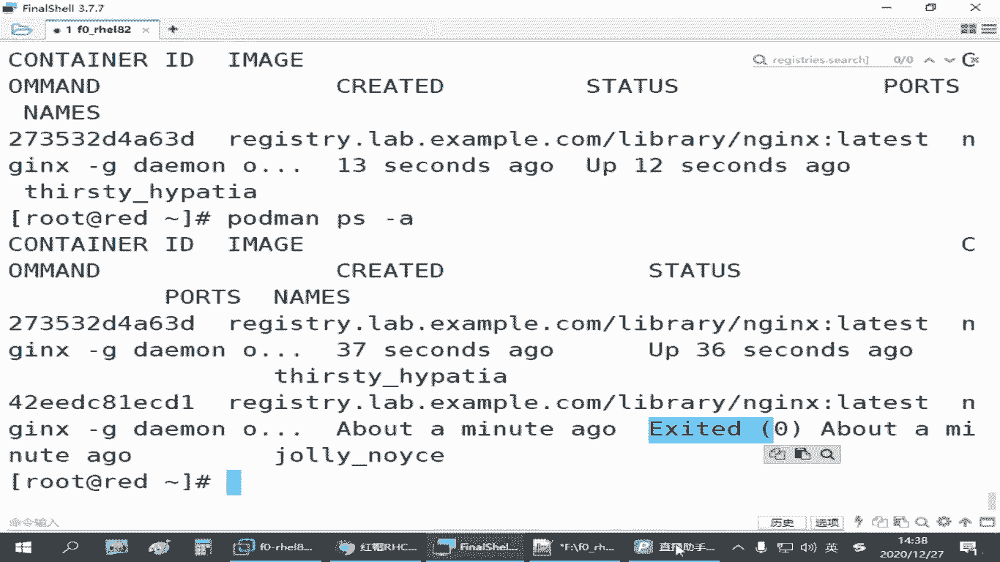

乱合并，杠b啊，这叫后台运行啊，那除了这个以外呢。

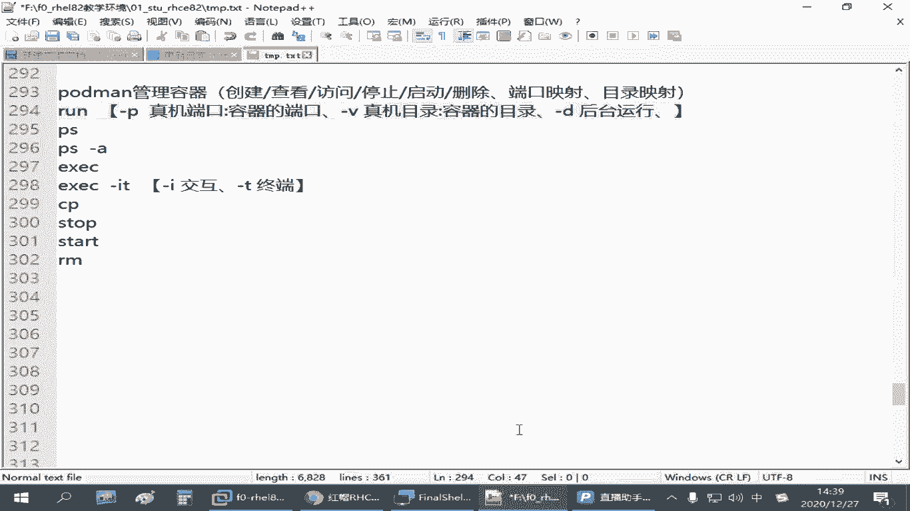

大家再关注一下刚才我们启用的这个容器，你观察这个列表啊，呃最后有一列叫内蒙啊，是容器的名字，容器的名字我在运行的时候并没有给他指定，你这个容器叫啥名字，其实我每一个容器在运行的时候。

我都可以给它起一个名字，做一个标记，因为我们考试的时候会用到这个名字啊。

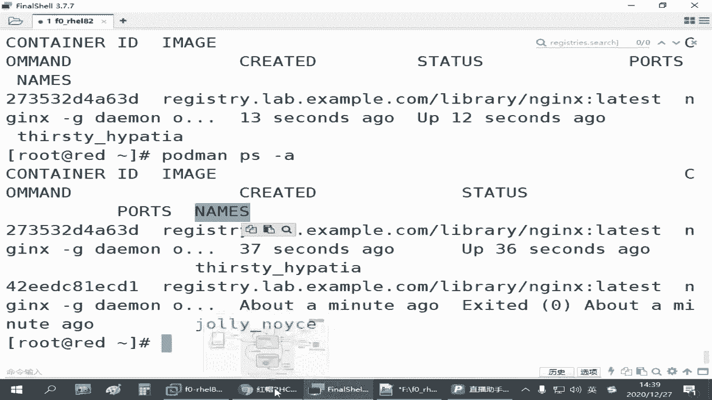

那咱们有个题目，咱们有个题目啊，利用仓库服务器上面的某某某某基金项创建一个名，为什么什么的容器是吧。

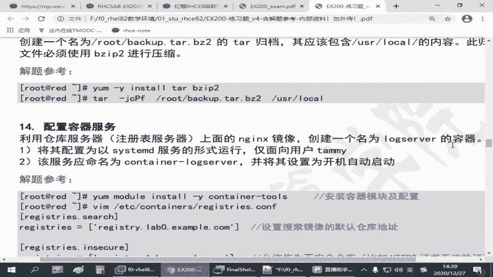

那怎么指定这个名字呢，需要有一个选项叫刚刚内容啊，这个是用来指定容器的名称的对吧，所以你可以指定名称，那如果我们没有指定名称，它会怎么样呢。

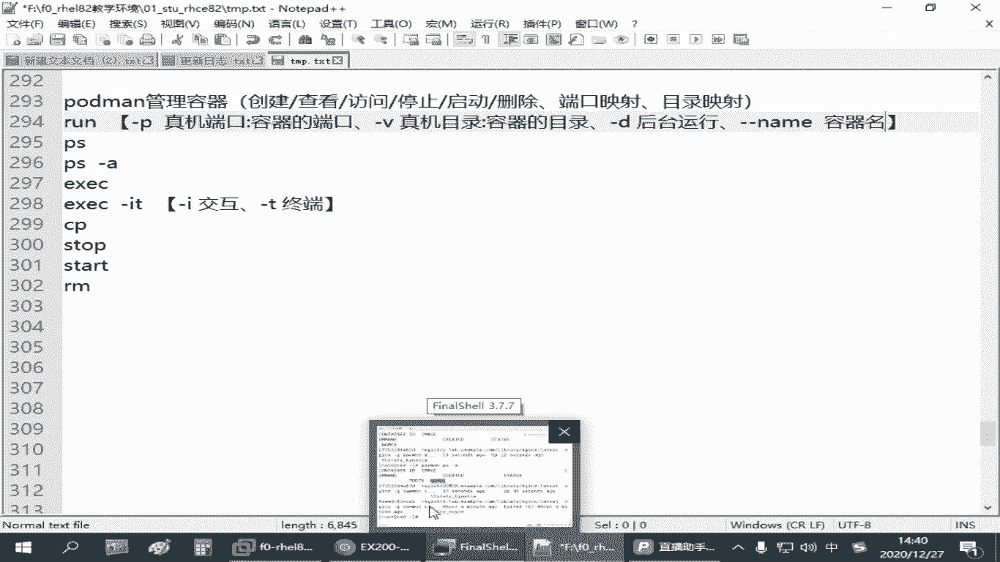

它会随机随机的给我们自己，他会帮我们自己起一个名字啊，在哪里呢，你看name这一列啊，这个什么thirty害怕他是吧，这个下边有什么就理论啊，是这个阵容就不好是吧，你就不可控啊，如果想指定名称呢。

啊我们是可以在运行这个容器的时候啊。

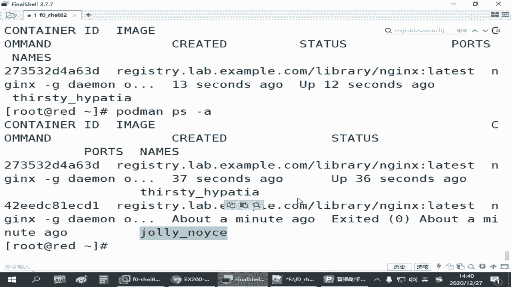

pdman，run杠低啊，angx，我们可以指定一个杠杠类目啊，起个名字，比方说叫my web 1，对吧，那这个时候呢我们再put the main image，啊啊啊不能。

pdderman p杠a列出所有，现在其实跑了三个了，然后你看最刚刚最新的那个了，拿去了，唉名字好像没起上是吧，啊这这这是运行的时候，但是好像名字不对，名字叫这个啊，那不对，那用法不对啊。

那是不是要放前面吗，你调换一下啊，来卖外部啊，angex。

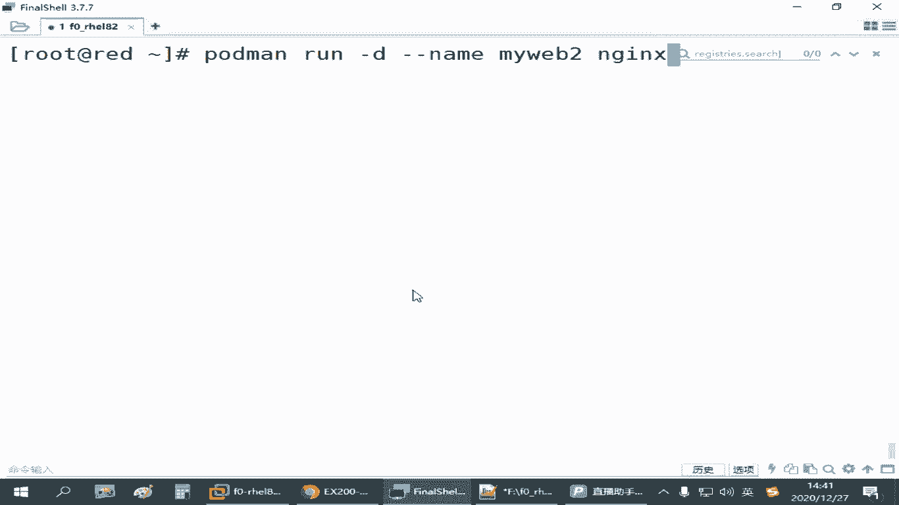

啊对容器那个标记要放最后啊，容器标记放最后来，这一次你看是不是对了啊，这就对应到我们这个名称啊，其容器的名称呃，让大家运行这种容器的时候，如果指定名称啊，呃杠杠内蒙什么什么放前面啊，刚刚一下偷懒了啊。

所以把这个容器你要起起哪个镜像，那个镜像的名字到最后前面都是你控制这个镜像在运行的时候，他的一些选项啊是吧，还有一些参数啊，做这个的好，这是启用容器的一些比较常见的一些方法，那另外还有一个就是这些容器。

如果我发现起多了，有些我不用的是吧，也包括像我们刚才前面有一个不是已经退出的吗，这些容器我们是可以把它给删除了，删除之后就不用，不会占用你的那个存储空间了，要不他虽然停了，它也是保持在那里的嘛。

那删除的操作用pdman rm不要加i加i是删除镜像，我们限制删除容器就是rm就行了，那删除容器的时候呢，后边我们要跟上什么呢，跟上这个容器的i d啊，跟上容器的i d，因为这个id每一期一个容器。

它的id都是独一无二的，不会重复啊，当然这个id太长了是吧，我也不知道完整的id是多少，所以这个时候呢一般我们写一部分就行了，只要能区分开就行了，它支持这种简简单的写法，可以跟上这个对吧。

你看就删除了，删除完成之后，我们再来p杠a啊，这是刚刚是删除id，你4211开头的这个东西啊。

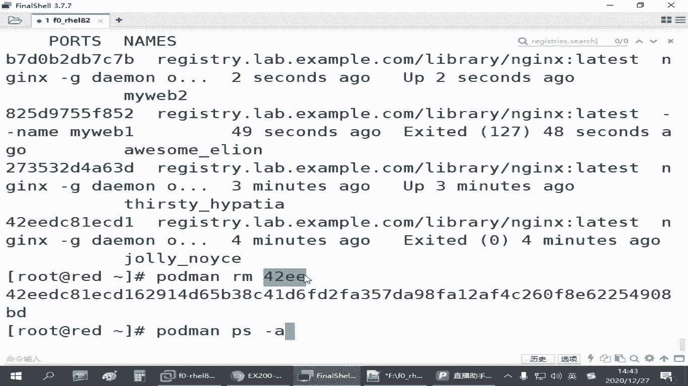

看刚刚那个四二开头的一个这一次那个状态头说没了，刚才中间那个我们那个操作写错了的啊，它这个运行异常不是也退出了嘛是吧，那这种容器我们都可以用pdmc去把它删除。

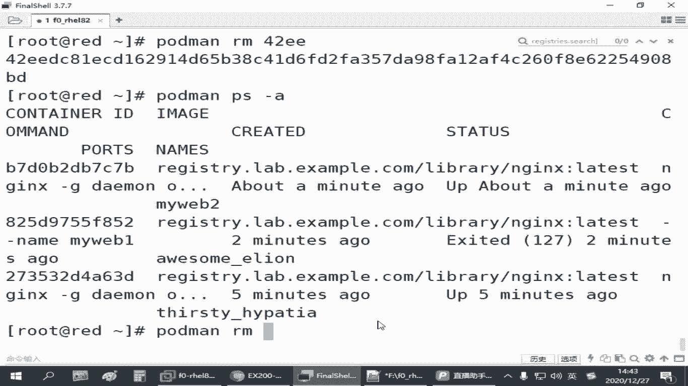

825d啊对吧，也删除了，在看啊，现在还剩两个，那现在还有两个呢是正在运行状态当中的啊，我们也破的慢，rm就删除2735，那这个时候呢一般它是不不让我们删的啊，因为这个容器正在用，正在使用当中是吧。

他现在的状态呢是up，所以这个时候你要删除的时候，它会提示你can not be remove的，后面有一句话叫围绕out force，就如果你不强制删除是不行的，当然你想强制删除。

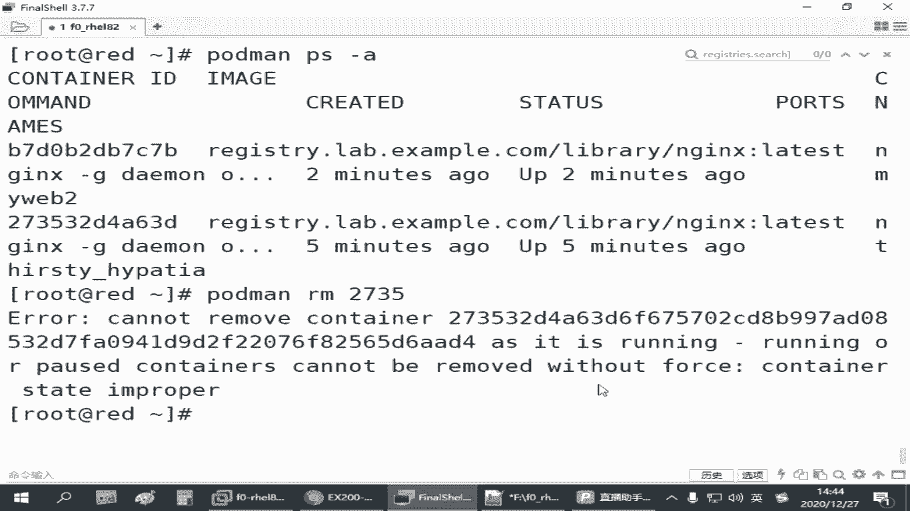

可以后面价格杠f跟我们三文件差不多是吧，rm杠f啊，哎这个可以删除。

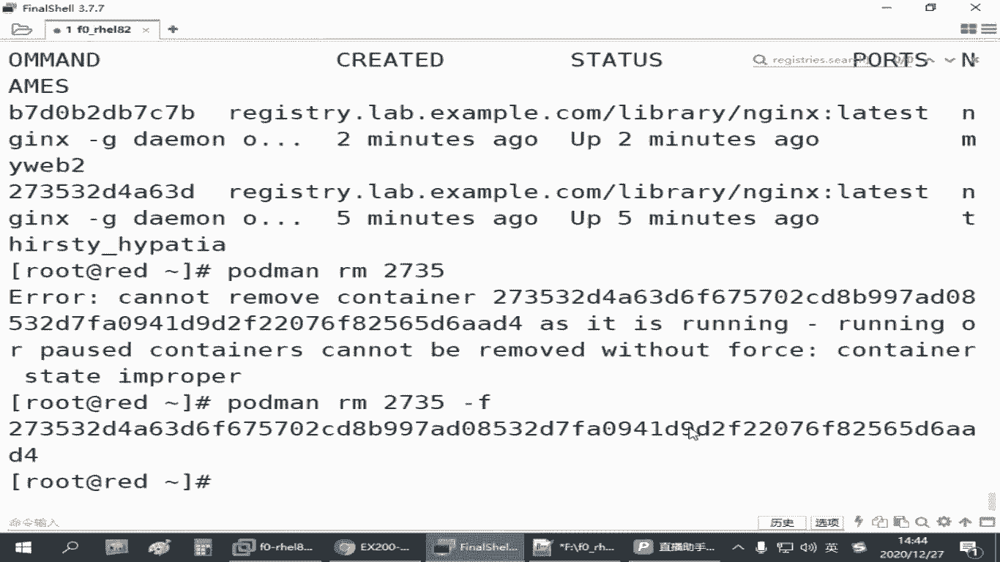

这个删除之后你再来看是不是没了，就剩一个了啊，剩一个了，那这一个我们也可以直接画得慢杠波特曼rf rm啊，杠f强制删，然后还有一个偷懒的用法啊，我们有时候在管理这个容器的时候，刚才不是说了。

是通过这个i d去标记它们是吧，那有些时候我们最近可能就一个容器了，那我还是去找这个i d的，那老麻烦了，所以有一个操作叫什么叫杠，这个杠l呢，相当于是，就找你最近的那个容器啊。

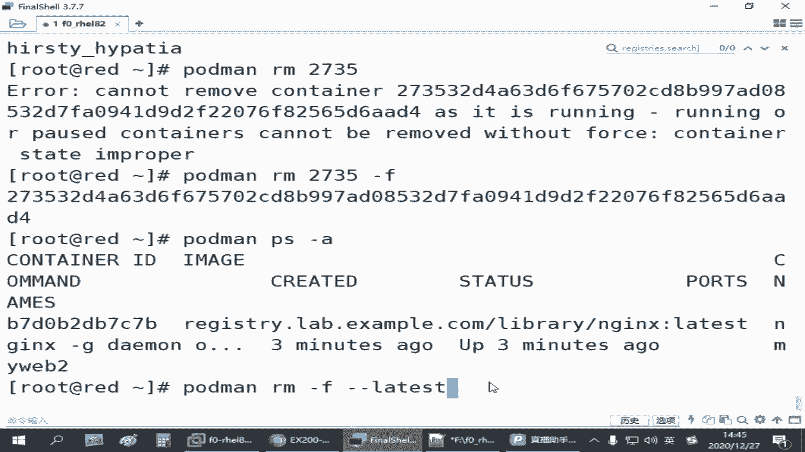

它就偷懒的一个用法啊，你可以直接用一个高，你就不用去找id了啊。

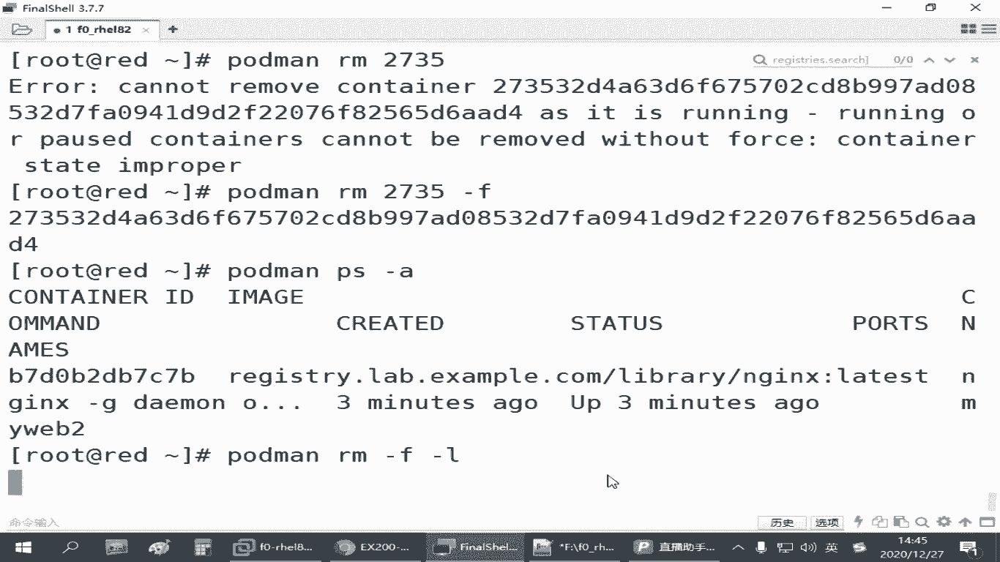

那他也会把这个容器给删除，那一个东西都没有了，ok吧是吧，这就全没了。

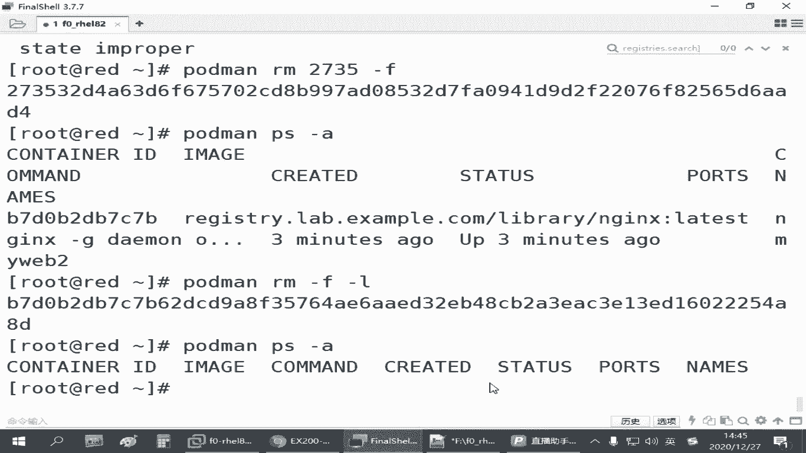

那我们再给大家把刚刚其他的一些用法看一下啊，比方说绿色端口的啊，在映射目录的啊，这些还有怎么去访问容器的啊，我们pdman啊在乱杠低，在后台跑一个容器，如果我希望这个容器呢是提供一个网络，一个网站服务。

我后面要通过真机端口去访问他的啊，那就加一个杠p，假设我们是8000端口，对应到容器里面的八零端口，因为容器里面的那个端口是容器作者写好的啊，所以这个你不能改，但你真记这个端口呢，你可以随便改是吧。

你作为管理员，你想用哪个端口就行，只要你别和别的容器那个对外服务的端口冲突就行了，后边跟上antx啊，暂时咱咱就不起不起名字了，就先这样啊，那这样的话呢又跑了一个容器是吧，那这个容器如果想访问它。

因为这是个n，这个是这个容器，你只要把它给启动起来啊，pdman ps，只要他当前是up的啊，默认他会开一个网站服务，默默认会开一个网站，那开一个网站之后，我怎么去访问他呢。

你可以在你的真金用浏览器去访问啊，命令行的话呢，我们可以用c u r l去测试怎么去访问到这个容器里的网页呢，啊我们要访问我们的真机，他的8000端口啊，这个我们就可以看到容器里面提供的网页资源啊。

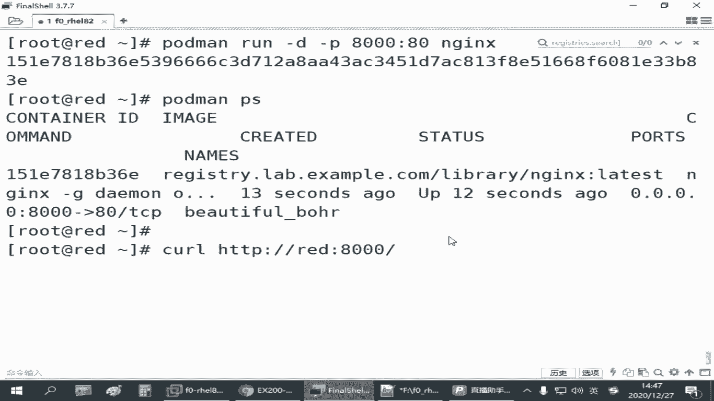

你看其实里面有个welcome to angx，欢迎访问ngx啊，那刚才我们是起的时候是这么起的是吧，访问的时候呢，用c u l访问真机的这个端口，你就可以拿到容器里面的资源，这叫端口映射啊。

好那这个大家回来之后，我们再来看一遍，那我们说这个n gx它不是相当于一个袖珍版的虚拟机吗，那我能不能有一个界面，我去用它里面的那些资源，我直接去进去看不好吗，是不是，但能不能给我们提供一个命令行环境。

那是有的啊，那不是所有的容器都有，但是大多数容器都有，比方说恩杰x啊，那我如果想进入到这个容器里面去看看它的环境，我们可以用pdman e x e c，这叫执行啊，执行的方式怎么执行呢。

如果我们要指定这个容器，像是刚刚我们说偷懒就是杠了是吧，调用最近的容器啊，或者你就得看他的那个i d啊，调用最剂的容器，然后后面呢要它执行一个命令，假设我执行的命令呢是一个cat命令。

我想看一下你这个n这个容器里边的操作系统环境，你可以cat etc下的os release，那你看那么这个时候后边这条命令，相当于是你进到容器里边去执行的啊，不是你征集的啊。

你略的这个现在你这个乱的就相当于增值是吧，那他可以告诉我，你看angex对应的这个系统版本啊，是一个叫david啊，linux 10是不是好，那这个就是我们访问我们的容器啊，来执行一个命令啊。

当然刚刚我们又说了这个杠，你如果你同时跑了很多容器啊，有时候为了避免混淆，还是建议大家用那个id，就是你可以先破的慢。

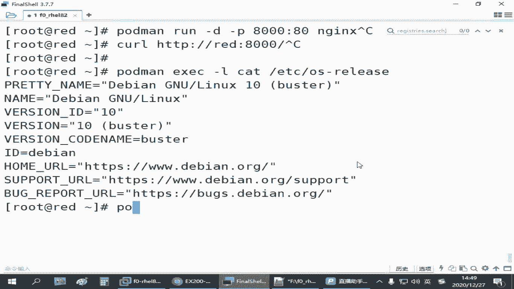

ps看，然后根据id去执行它里边的某个秘密。

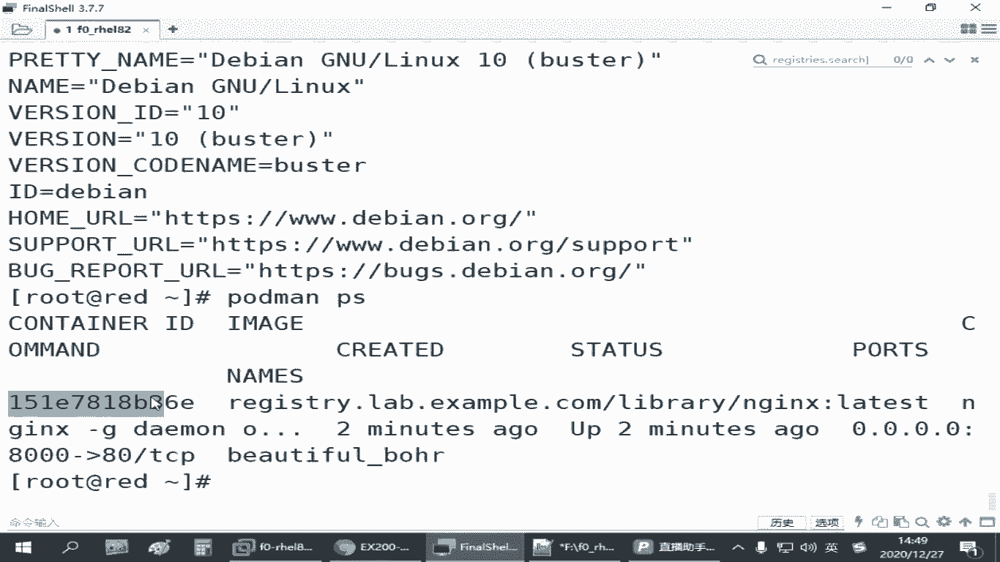

好像这里的e51 e是吧，就刚刚这个操作呢我们可以把它换成这里是高l换成1511。

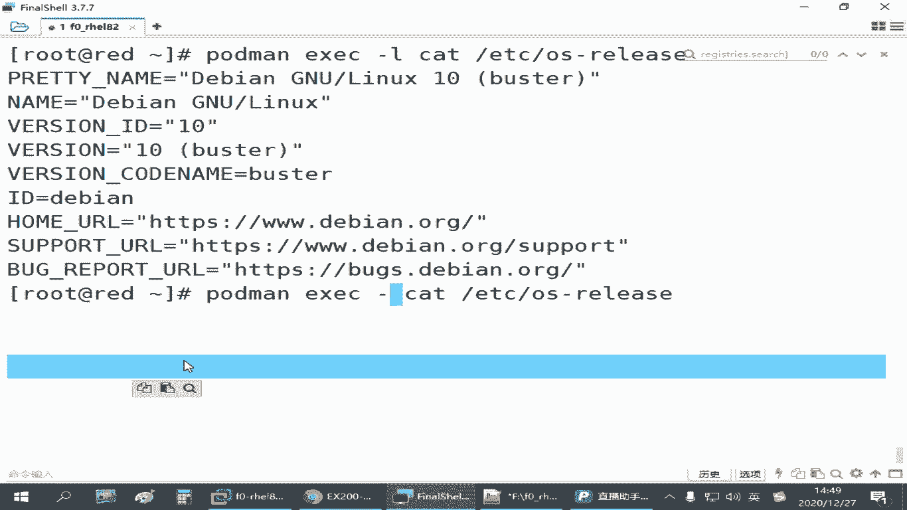

其他的id一样的，慢着两种用法啊，那后面可能我们有时候偷懒就用一个杠杆了啊，好那这个会了之后，我们再换一个，假设，我想执行的不是一个cat命令，我想进入到一个交互的模式。

这个球一般建议大家执行代这个大家都知道是吧，这linux系统的默认的命令行解释器啊，那执行这个的时候呢，你如果希望进入到一个交互的模式啊，执行的时候我们加一个杠a杠t啊，杠i交互杠t终端。

这个时候你会进入到一个容器里边的环境，停在这个地方啊，你在这个里边呢，其实我们就可以执行，那你看一下我们里面的里面那个环境，你可以执行p w d，你看里边是不是也有一个独立的目录结构。

这就相当于一个迷你版的一个linux系统一样啊，当然它不能和我们真正的那个linux系统对比，它不是完整的嘛，所以它有些命令有，有些命令没有啊，这是正常的。

比方说你在这个环境里面就不能够用我们正常的与真实机的，就这个容器服务器那个平台的升级传送，你用这个命令，这是没有的，在这个n gx这里面，你要看它的服务有个收入是吧。

然后n jx stus他告诉我index正在运行是吧，那其实n dex呢这个容器里面它提供的网页默认是放在user shell n jx html，在这个底下有一个网页叫index。html。

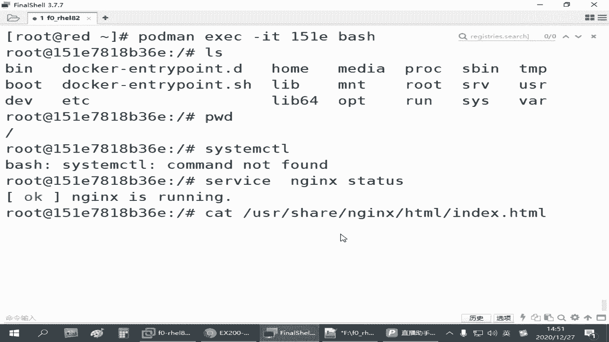

那这个网页呢它就是刚刚我们从外面访问到的这个网页啊，是不是，那刚才我们是通过这种方式去看的这个容器里边看到的啊，假设我想更改antx给我们提供的网页的内容啊，怎么办呢，一般我们征集环节我们是可以用vm。

但是你在这个容器里面，你会发现没有这么硬是吧，所以我们说容器里面它是一个裁剪过的啊，你不能跟你真正的机器对比，他只把它需要用到的一些东西才会提供，他觉得你这个提供一个网页，你不需要用vm。

你如果要改他的网页，你可以用别的方式，这样才能节省空间吗，什么方式呢，比方说你可以用一个a可给他一串a，我从立项输出是不是我也可以改这个网页内容，改完之后这个网页内容就变了啊。

这是现在我们是在容器里边操作啊，root art容器的id，这是命令行提示符的一个标记，那改完之后我们退出来啊，在你列的这台机器上，在c u r l去访问，还是访问我们的8000端口。

你会发现网页是不是就变了对吧，这就变了，当然这个变了之后呢，这个容器万一下一次你把容器删除再起这个网页就没了，因为你这次改的是一个运行当中的一个状态，你改完就没了啊，改完就没了。

所以我们需要有一个把真迹的目录注意到我们容器里面的目录啊，这个是才是合适的啊，那我们这里的话呢呃还有一种方法就是临时我不进容器里边，我临时拷贝一个文件进去也可以啊，这就刚才我们讲过的那个cp啊。

copy那copy的话呢用的操作呢是叫霍特曼cp啊，那我们可以提前准备一个文件，在真机里面，我们准备一个文件，比方说叫做，放到o b d下面啊，叫，index。html，随便写个a吧，a。

html写上字母b保存退出，那现在是有一个这个文件，如果想把这个六的主机上的这个文件拷贝到，容器里面去啊，我们可以跟上容器的i d，用来标记目的地啊，然后用一个冒号分隔再给它指定，你要拷贝到哪个目的地。

那个目录你可以包括目录的文件，目录下的文件名，用这种方式去拷贝，拷贝完成之后呢。

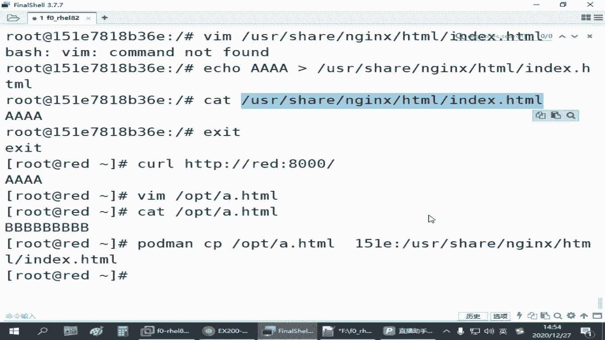

我们可以再用co 2来访问，你看这就是我们刚刚传进去的文件，对吧是吧，这是从我们的相当于从真机传输一个文件啊，到我们的容器里面去啊，这个传输，来再看一个刚才我们讲过那个钢v啊。

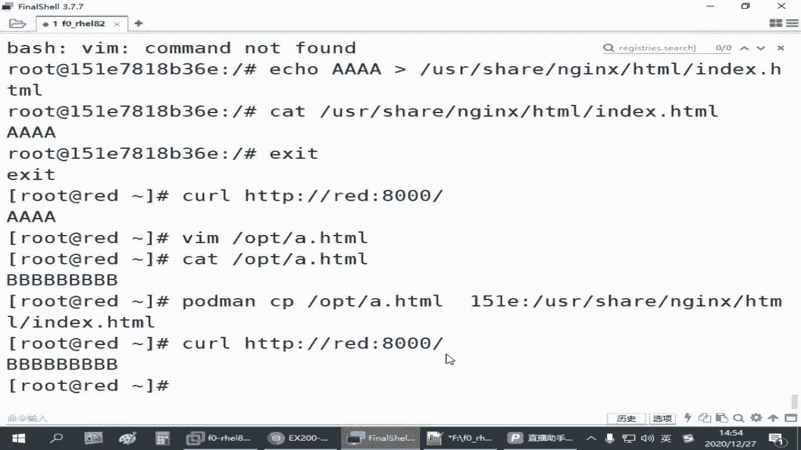

如果我希望这个容器在运行的时候一直用我们增肌的一个目录啊，这个一般建议大家在我们的运行容器的时候就指定啊，不要后面再来改，比方说我们madr，来创建一个目录啊，叫外部root啊。

在web root下面呢，我们建一个文件啊，它的内容呢写一个pdman test放到我们这个目录下面，七个文件名叫index。html，就是创建一个在你略的主机上创建一个网页目录，创建一个网页。

那如果我希望我开的一个容器，它使用我们真机的这个目录作为它的网页目录，我们是不是可以pdman run杠地，一方面呢我们可以给他指定端口，方便测试gp，比方说8001对应到八零端口。

另一方面呢杠v把我们真机的o p t下的外部路透冒号分隔作为容器，里边的tn gx是识别的u的，线下的angx html对吧，作为它的网页目录，后面启用我们这个容器，啊你如果要指定名称的话呢。

就刚刚内蒙加前面指定一个名称，假的叫卖web 1，是吧，那这个就比较完整了啊，再启用一个容器，它的名字叫卖外不一，它使用的网页目录是我们征集的op下的web，他端口用我们征集的8001里面的端口是八零。

在后台运行啊是吧，那这个运行起来之后呢，我们用c u r l再去访问一下led的8001这个端口，你看是不是看到一个pdm test，ok吧是吧，那这就是刚刚我们登记的啊。

这个时候你这个容器删了也没关系啊，停了也没关系，因为你如果n g x它需要修改我这个目录，改完之后，其实改的也很真正的目录，那它是一直保存的，这就是我们说的这个目录映射啊，持久挂载啊，杠v啊。

有一个杠v。

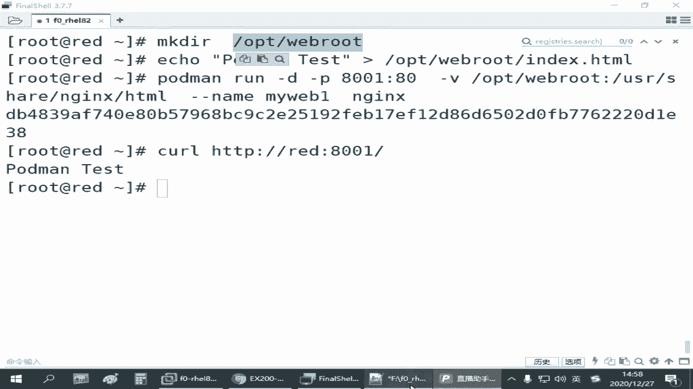

唉刚才我们讲到的还有几个没讲的，运行查看容器啊，列出所有容器执行一个命令，然后交互模式复制啊，还有一个停止启用是吧。

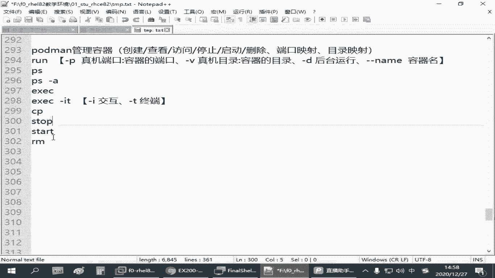

删除删除，刚才也讲了是吧，呃停止容器呢看一下，破的慢，stop啊，如果我们这只有一个啊，你可以用高原路，我们也可以用钢试一下，停止最近的填的是db 48是吧，奥特曼p看一下，停止你看见没了是吧。

刚那个db 48没了，但是停止它并没有删除啊。

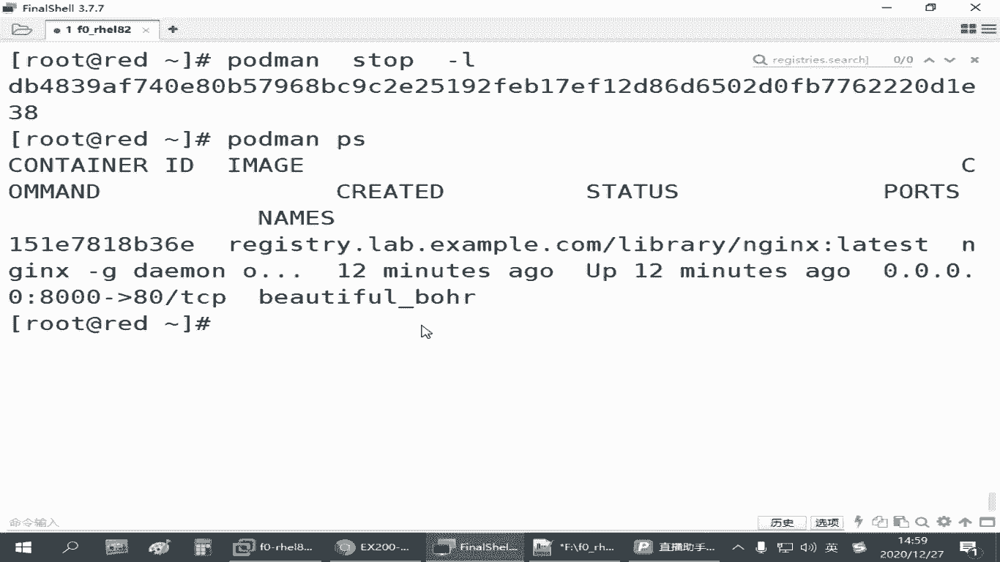

你可以杠a再去看有一个db 48在上面，他的状态变成了退出，当前是退出状态，如果我想让他再启用怎么办，codman start啊，你分不清楚哪一个就建议大家还是分i d是吧。

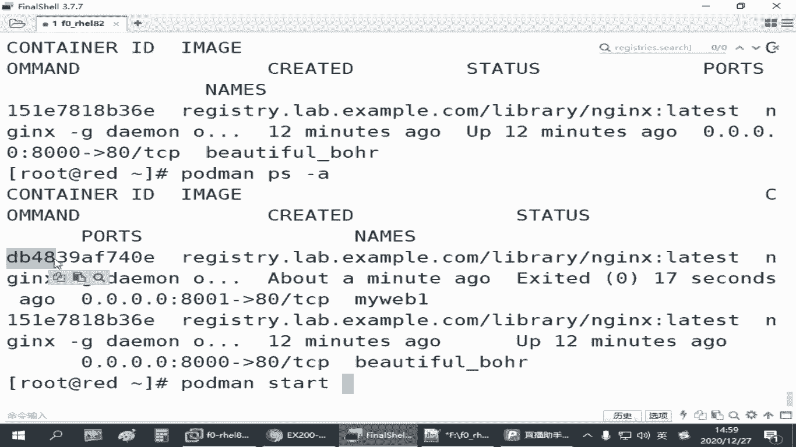

像这里的d b48 ，你如果最近只有一个是建议大家用那个杠也是没问题的，这比较这个看你们自己啊，你喜欢用哪个都行啊，就你最重要确认结果，你别控制错了就行啊。

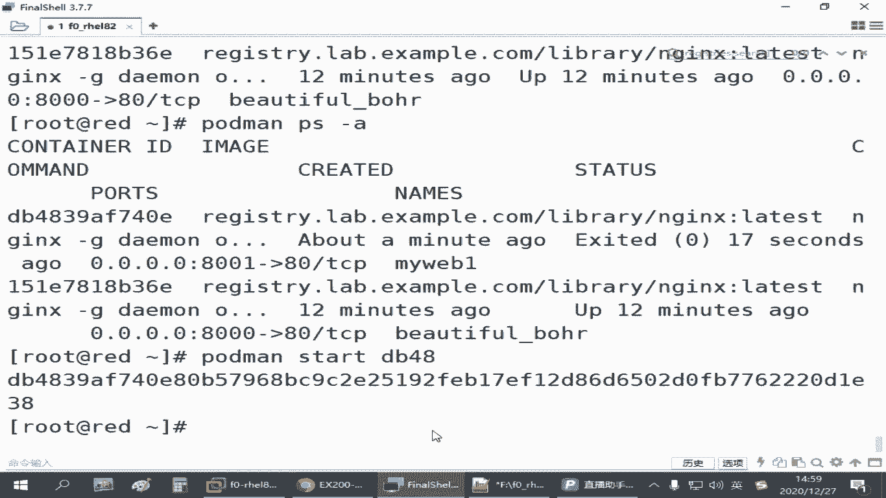

那启用完成之后，我们再pdm p杠a看一下，你看是不是也启用了对吧，就是这stop和stop启用和停止。

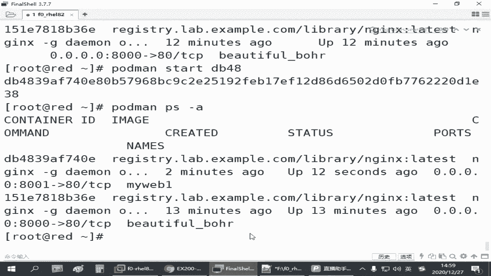

好差不多了是吧，还有一个你看容器的那个定义，运行当中和我们静态的这个也不常用啊，但是大家也要了解一下吧，说一下，但是我们说一美金是吧，特别跟上我们的那个镜像的名字，可以看镜像的那个配置定义。

那如果想看容器的呢，后面跟一个container，container inspect，跟上容器的id或者gl，在里面定义，那如果这个容器呢，他有些信息可能是运行起来之后，它是有有一些变化的啊。

你可以通过这种方式去验证，比方说你可以看它的p地址，那可能它没有运行的时候，就是没有ip的是吧，这跟我们的虚拟机一样，你虚拟机存在磁盘里面，它没有启用，是不需要占用ip的，但启用之后它可能就有啊。

当然不是所有的容器都需要有ip啊，有些容器它不需要这种网络服务的，那可能就没有ip地址啊，这个可以去检查的一种手段啊，就是powder man container inspect。

后面更容器id或者最近一个容器，如果是image跟上镜像的名称啊，那是看镜像的定义啊。

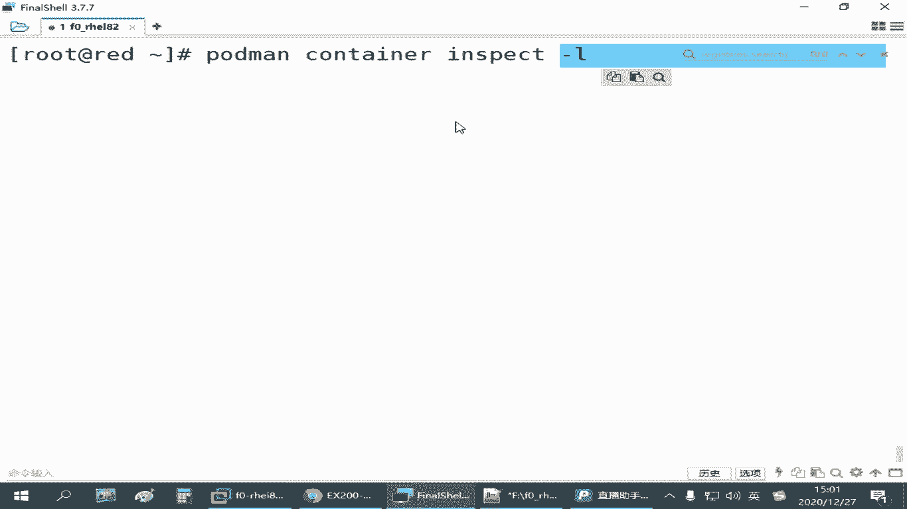

这是刚才也讲了一个相当于是container，像老船长了，不过可以推波线是吧，inspect，inspect检查视察是吧，后边跟上容器的id啊，这几个指令大家熟悉了之后。

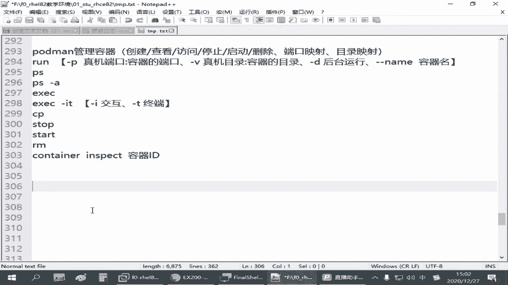