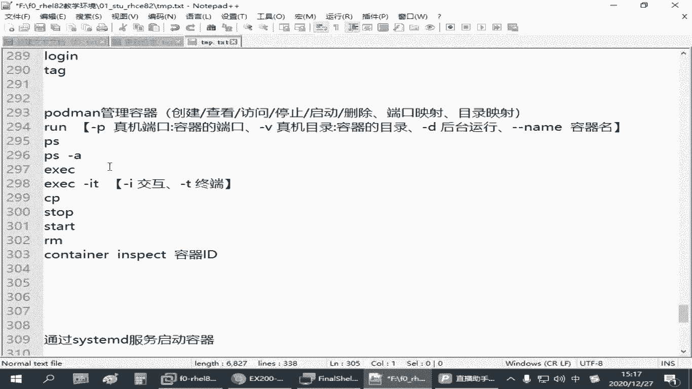
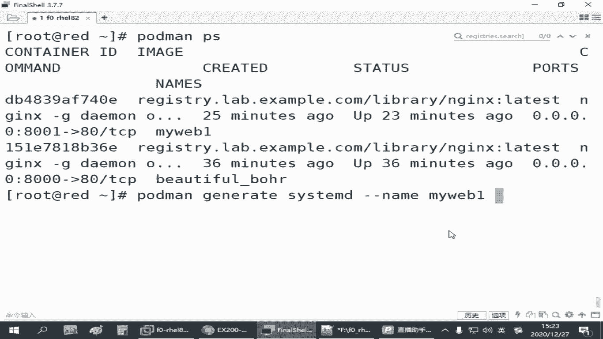
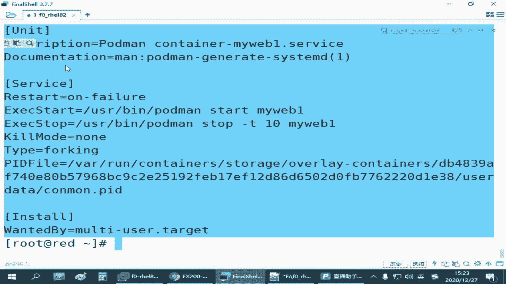
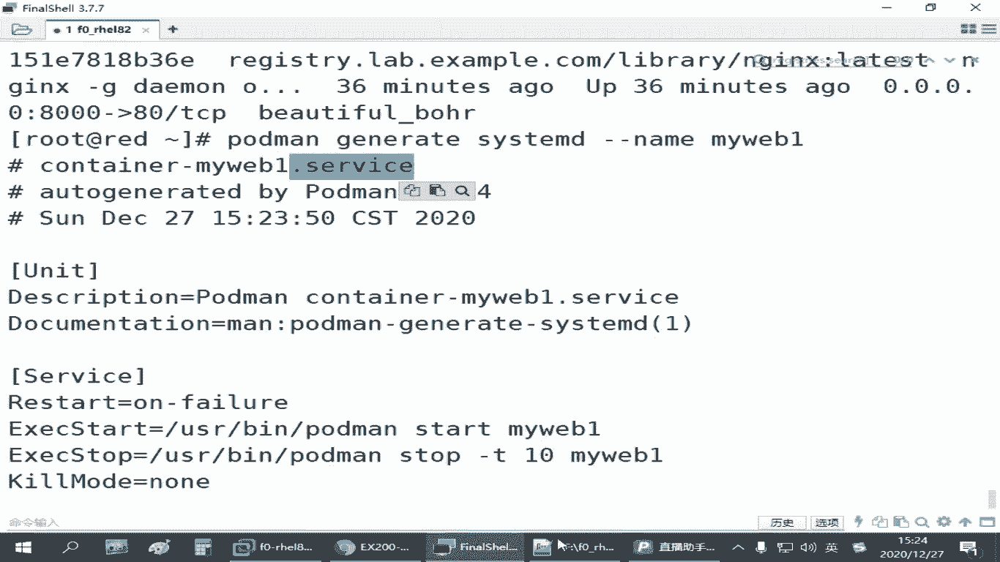
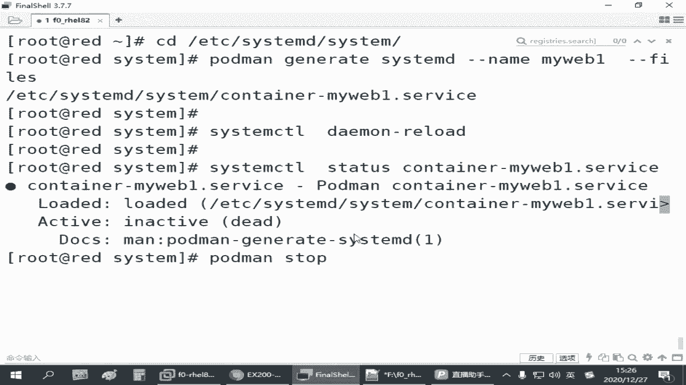
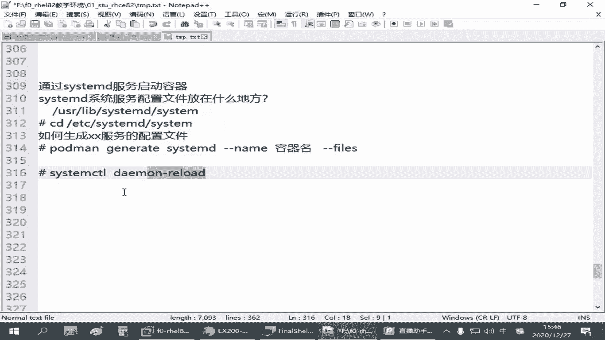

# 全网最全RHCE红帽认证全套入门教程 - P28：4.05-容器服务化 - 达内-程序猿 - BV1f64y1q7b5

来那刚才我们学会了这个容器的操作啊，从仓库里面下载镜像，然后把镜像拷起来是吧，就变成了容器，让大家通过容器来提供了一个网站服务是吧，呃但是它有个问题啊。

就是我们手动开启的这些容器，他是临时的啊，啊怎么个意思呢，就跟我们开了个系统服务一样，跑程序一样，它不是永久开的啊，一旦我们这个red这台主机呢重启它，其实这个容器呢每一次都能让我们手动去跑一次对吧。

他没有办法实现开机自启啊，像刚才我们那刚才我们通过pman run这个命令啊，在我们8001这个端口提供了一个呃angx的一个容器服务，并且给他指定一个名称，那这个你的六的主机一旦重启这个容器呢。

你都得手动来跑这一条命令啊，但你看我们这一条命令好像写起来老长了，是不是，那实际工作当中呢有可能还还需要有更多的参数，那你每次都这么敲的，敲的很累的，那所以我们后面有一个点啊，叫什么呢。

叫做容器的服务化啊，我能不能把这样一条命令变成一个系统服务，使得我们录的这台主机在开机的时候能够自动运行这个容器，那我们管理员不就轻松了吗，是不是这样的是吧，如果要通过c t m d服务启动容器。

那我们需要了解的地方啊，第一个方面就是我们linux系统服务，就关于这个cs steam d控制的是吧，它的系统服务的配置文件放在什么地方，对吧，这个要知道，其次呢就如何生成。

我们要求的某某服务的配置文件，大家不要想去手写啊，这手写太累了，就如何快速生存啊，某某服务的配置，最后呢就是关于这个服务怎么样怎么怎么样，让它把它给提供起来，那这两个搞定，那就没啥难的了啊。

那其中呢呃系统的啊，linux系统的c4 d就有那个cs team control控制的啊，那些配置的数据呢呃正常情况下应该是放在我们的有两个目录吧。

一个目录呢是在我们的user lab下边有一个叫sixt m d，下面还有一个叫csm啊，在这个目录下你会发现有一堆啊，扩展名是点servers的是吧，还有一些别的类型的啊，这些配置文件啊都在这里面啊。

这是一个目录是吧，这是系统的原始的那些系统配置啊，一般都在这，那除了这个以外呢，一般我们管理员如果我们自己另外在建的系统服务啊，一般建议大家放到我们的etc下。

etc下面有一个叫cs tmd c4 题目啊，这个c4 tmd就是我们另外一个支系统是用的比较新的，前面是不是讲过是吧，那个叫系统控制器啊，然后系统服务一般在一个cs这个目录目录底下。

你把那些配置文件放到这个底下，服务的配置呢，一般后面要加一个，它会有一个什么点servers啊，来个后缀的，你有这个之后，然后把那个启用啊，然后就可以了啊，所以这是它的目录。

如果我们要把容器作为一个服务启动，我们需要在这在这个目录下面，或者上面这个目录下面啊，建一个某某某某服务的配置啊，服务的配置啊，建好之后呢，然后我们再把它给重新加载一下，通知系统，说哥们。

我在多了一个服务，你帮我更新一下是吧，等你更新完成之后，那么我们以后就可以像管理其他的服务一样啊，来管理这个容器了，那如何生成这个呢，还有个指令叫pdman啊，pdman还是postman。

postman，那个叫什么叫什么呢，有个叫jjrate啊，一个叫sixt m d，这个到时候你敲的时候多用tab键啊，万一我就敲错了是吧，那后边要跟上一个什么呢。

杠杠类目指定你当前已经运行的容器的名字啊，这个是读取当前已经启用的容器的数据，这样的话它会快速生成一个配置啊，给我们，只不过这个配置呢是显示在我们的屏幕上的啊，然后我们看一下。

比方说我们pmp看一下刚才我们是不是有一个8001端，可能是吧啊，找这个吧啊名字我们给它定义成了外卖y回应，所以这已经开启了一个容器啊，那如果我要把这个容器把它变成一个系统服务，每次开机之后呢。

我就我就自动能访问8001端口，拿到它的一个网页，是不是，那这个时候怎么办呢，我们可以用pdman啊，generate table出来，jrc xd推不出来是吧，然后后边跟上杠杠name。

跟上my web一也能table啊，这个杠杆类在这里啊，可以简写成杠n啊，就一个杠一个n就行啊，这个操作我们直接回车。

你看它生成了一份这样的一个文件是吧，这个就是我们标准的啊，现在红毛七红毛八这些现在都用这种方式了。

在标准的那种系统服务的配置啊，啊它的内容你看它它生成的这个服务的配置啊，一般如果你把它存下来才会给你定义成一个叫container横杠，再跟上容器的名字，所以其实就是container杠跟容器名是吧。

就某某容器，它的系统服务的配置可以是这个样子的，但我们得把它保存下来啊，你不保存，那没得打，但是显示在屏幕上，如果要保存下来的话呢。

在后面加一个刚刚file，加一个这个就保存为文件，默认存在当前目录上，那比较简单的方式啊，你想想用起来这么简单的话呢，就我们可以先cd到这个目录，然后再执行下面这个命令。

就可以生成这个配置文件放到正确的位置，因为你只有放到正确的位置，系统以后才能找得到啊，要不然找到，所以刚才这个操作来我们cd到etc下面的题目d下载c4 题目，再把刚刚这个命令调出来啊。

后面加一个杠杠files啊，这个时候你看它是不是就生成了一个这样的一个配置价，那你在这个目录下有这个文件之后，我怎么样让它生效呢，系统里边直接执行sixteen，ctrl叫demon reload。

重新加载啊，这这个关键是进到正确的服务配置目录，然后使用你当前以及运行的mac web一叫这个名字的容器，为它生存一份服务配置吧，生存好了之后执行six control marenote，把它加起。

从现在开始，你在系统当中就多了一个这样的一个服务啊，就多了一个这样的一个服务，这个服务如果我们要用它的话，我们就可以用csm control titles来检查它的一个状态。

后面跟一个container table一下是吧，你看现在反应的一个状态啊，当然啊你现在看的时候呢，它是一个没起来的是吧，因为刚刚那个容器是我们手动写的啊，他没有看到啊，我们手动起的。

你现在通过这个服务的配置去管理它，那如果你想使用它怎么办呢，我们可以先破得慢啊，stop把你刚刚那个容器呢先停掉啊，先停止。

我们先确认一下id啊，8001这个db 48是吧，你先把它停止掉啊，然后通过服务的，通过服务的方式来控制它，就是pdman stop跟上这个id停止，注意啊，是停止啊，不是删除啊，千万别删。

你删除了之后以后用服务再控制它，会找不到这个容器啊，那那那你那那你到时候还得重新再运行一个容器，重新生成一遍啊，你是把它停止，别删啊，用stop。

然后我们就可以c team control start container啊，起起来啊，起来之后呢，再检查它的状态是不是正在运行呢对吧，这是正在运行的，那如果你要停止，就是staff嘛。

要重启就是认识大大家都会了是吧，那我前面讲过的，以服务的方式来控制，那现在我们说希望他重新开机之后自动运行怎么办，enable吧，对就这个哈会不会跟上我们这个服务的名称啊，my web一啊。

the servers就设成开机之后自动运行，那这个做完之后我们可以重新验证一下啊，既然开机自动运行了嘛是吧，我们把red重启一下，重启完成之后呢，我直接访问刚刚那个8001端口，如果好用。

那就没问题啊，当然你热爱的主机，它的这个防火墙什么要开这个端口啊，你假设你从别的机器去验证的话，要不然你防火墙不开也不行是吧，你本机测试呢可能就无所谓，重新启动我们的热爱的主机啊，稍微等一会儿。

起的慢是吧，重新打一下，还连过来了是吧，然后c u r l l就是咱们不管做的怎么样啊，一定要去验证啊，因为验验证结果是对的，才说明你这个做的是对的，不要太相信自己的眼睛是吧，8001。

好那这是刚才我们给大家讲到的呃，容器的服务化，我们先cd到这个目录啊，然后再执行这个命令是吧，还是要先是先运行这个容器啊，你甚至执行这个第二个命令的时候呢，我们打个井号方式，这就是咱们的两个操作嘛。

首先这个之后呢，你要做一个那个叫什么cs team ctrl是吧，然后后边跟上我们的那个叫demo reload啊，这会重新加载这些目录下的那些新增加的配置文件，或者有些配置文件里内容改过了是吧。

他会去重新读取啊，所以叫重载嘛，那叫沦落啊，你这个如果重载成功了，你那些配置文件，包括你s100 那个属性都没问题的话，你现在才能够看到那个服务，否则的话你直接去操作，它会告诉你没有这个服务的啊。

如果有那个服务之后呢，你就可以去把原来的容器停止，再把它用服务的方式啊，cs team ctrl去把它给start对吧，把那个start，然后你再把它设成enable。

