# 全网最全RHCE红帽认证全套入门教程 - P29：4.06-rootless无根环境 - 达内-程序猿 - BV1f64y1q7b5

考试的时候我们在用这个容器的时候，有一个叫root ex啊，无根环境的啊这样一个东西呃，指的是什么意思呢，root list就是你没有管理员权限的时候，我们也需要去运行容器，所以这个主要针对的是什么。

争论的是那个非非root用户，非root用户如何通过系统服务来启用，或者说来管理这个东西啊对吧，是做这个的，那这个操作呢和我们刚刚那个刚刚我们给他做实验的时候，是用管理员来说的是吧。

和管理员来做呢有一点点区别啊，有一点点区别，首先呢普通用户你在开，如果要开端口的话，正常情况下应该是只能开1024以上的端口啊，因为1024以下系统默认有一个保留范围啊，是不让我们非注册用户去开的。

如果要开端口的话，第二个呢普通用户他如果用容器，这个默认是允许的啊，默认是允许的，因为容器它的设计就是为我们用户有个隔离的一个环境嘛，每个容器都是独立的，所以普通用户它也可以运行容器。

请你注意一下这个端口，那容器没问题，那现在要解决是系统服务啊，系统服务普通用户怎么去添加我们自己的系统服务，那这个地方要注意一下它的一个配置，就系统服务那个配置目录啊。

为我们普通用户准备的那个配置目录呢，在我们的用户的加目录下，有一个特殊的目录，是点开头的config，下面有个cmd，然后下面有个叫user，有了这个目录，我们需要把那个配置呢放到这个目录下啊。

然后再去把它给更新系统服务配置，那用户的这些系统服务呢，大家还要注意用户的系统服务和我们整个管理员环境的那个系统服务，它是分开的啊，后面我们普通用户，你说你建一个容器叫卖卖外服三，那管理员看不见啊。

管理员看不见，管理员建在那两个服务呢，你普通用户你可能看见，但是你没权限啊是吧，所以这个是隔离的啊，隔离的那在一个普通用户在使用我们这个系统服务的时候，他是不是也需要用c4 d ctrl。

如果你操作的是你自己定义的这些服务，需要加上杠杠优子啊，要加这个东西，然后后面再去加了一些什么demo reload呀，什么start stop不要啊等等等等啊，做这些操作，所以差别主要责任。

当然在启用容器的时候，用户的容器它也是一个独立的目录啊，用户的容器也是在用户的主目录下有个点config，下面有个什么containers，所以用户的容器空间存储和我们的管理员也是分开的啊，也是分开的。

那意味着什么呢，意味着我们管理员刚刚我们下载的这些镜像啊，我们现在有一个ng镜像，但是普通用户呢他用不了啊，普通用户你得单独下是吧。

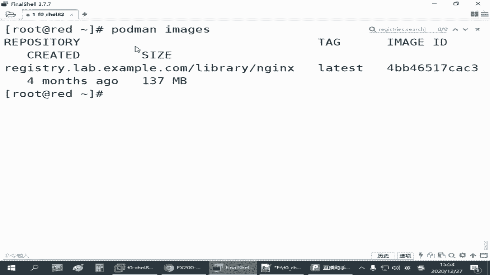

嗯而且呢。

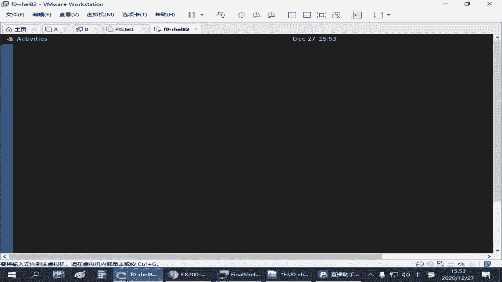

来再开一个啊，而且呢红帽官方教材上说，如果我们要为普通用户使用用户空间的这些服务，呃，不能是竖杠那种方式啊，你需要用s s h这种方式直接去登录到一个普通用户，就你不能管理员登过来。

像我们这边已经是管理员了啊，你输入刚好到一个用户张三这样的这个方式，它它会你会发现不生效啊，因为系统它没有你这种登录的过程，他没有办法为你准备相关的一些资源吗，因此那像我们考试的题目。

那这个用户呢我们提前创建一下，考试的时候是上午的，考试能有个训机是要去创建这个用户的啊，你不管怎么样吧，反正那个用户要么你就是自己建的，要么就有提前，有的我们建一个用户账号啊，叫tm给它设一个密码。

pass word s t t一啊，他们是，那我们现在这一次无根环节啊，就是以普通用户的身份，去使用他自己的服务，连接到right，连接过来之后呢，那他如果想用镜像coder man 1 mg。

一般就是你会发现没有任何迹象吧是吧，因为管理员建哪下载的镜像你看不见。

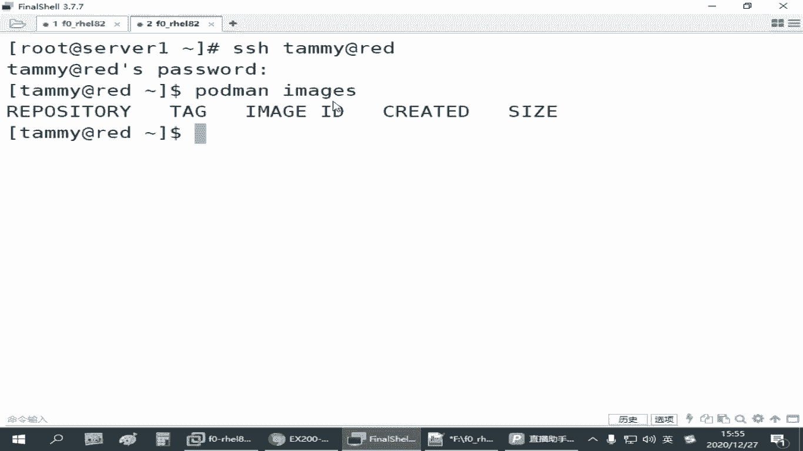

那如果你普通用户也想下载啊，一样啊，如果要下载的话。

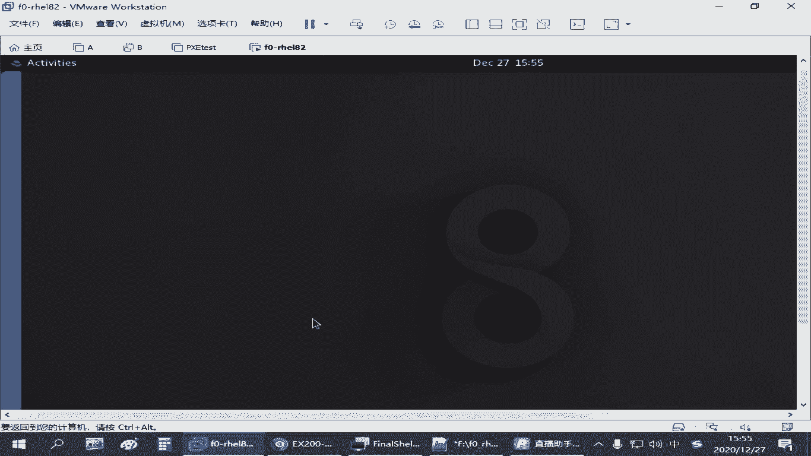

那我们再把那个跑起来啊，你就把那个虚拟机要开一下是吧。

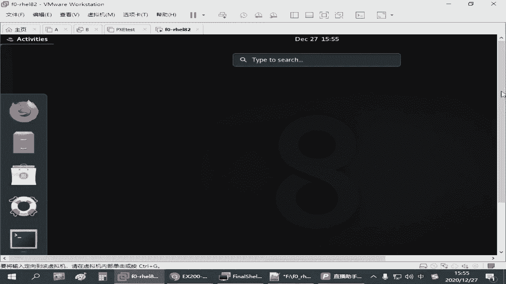

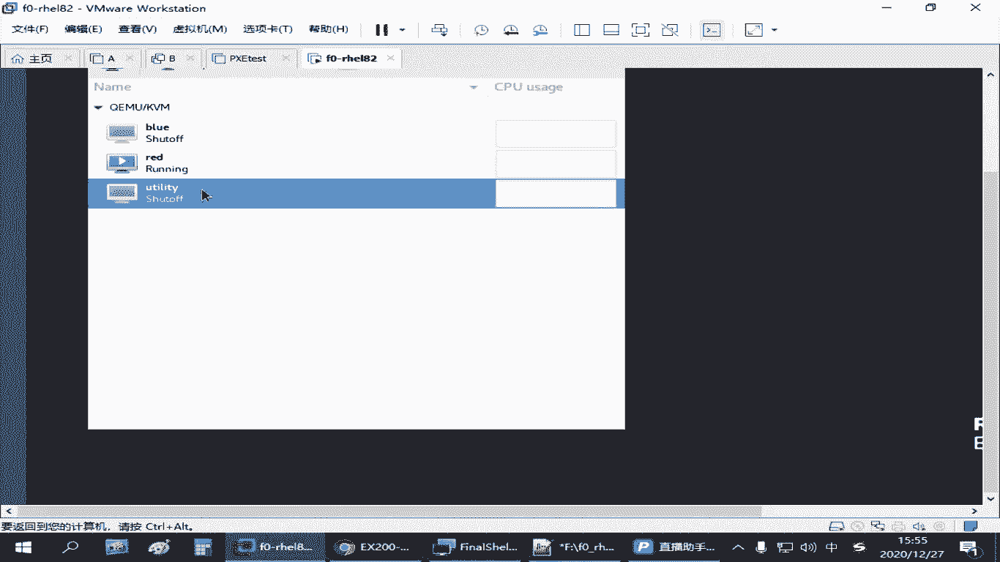

然后大家搜索的时候啊，就是你拖的慢啊，搜索啊，n g x，可以搜，但是它连接的是哪个服务器呢，用的是你管理员全局配置的那个文件指定的那个仓库啊，那如果我们这个仓库现在还没开起来呢是吧。

在虚拟机正在开启过程当中，那你是搜不搜不着的，他会告诉你无法连接啊，管理员已经配好了这个仓库，但是你连不上呀是吧，现在那个虚拟机没开啊，就连不上啊，大家用咱这个练习环境啊，有时候你发现报这个问题。

那就是你那个虚拟机没开好吧，还没开好，等开好之后呢，我们普通用户再去搜再去搜啊，现在还没开好是吧，刚才是no root to host，现在是连接被拒绝是吧，再试一下还是连接不去学。

那你看它慢慢的开的啊，现在是连接没有被拒绝了，然后又是什么v一那通讯那个协议版本不对是吧，那你碰到这些问题呢，基本上你都可以认为是咱们那个仓库还没准备好，仓库没准备好，等仓库准备好了之后。

我们正常收应该能收到啊，这啊这这些资源不够也是麻烦啊。

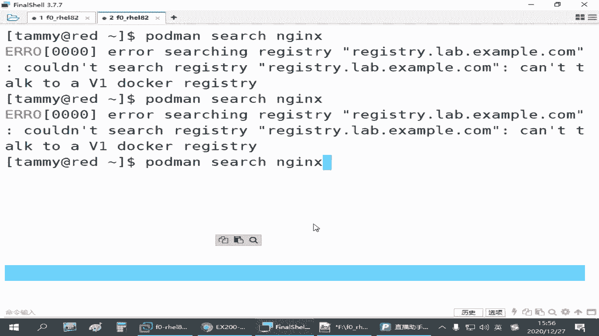

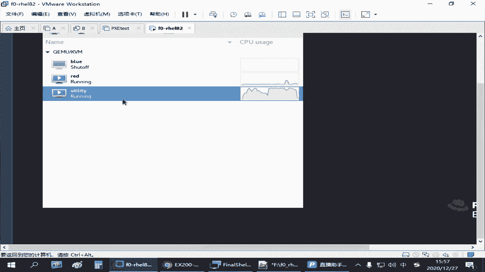

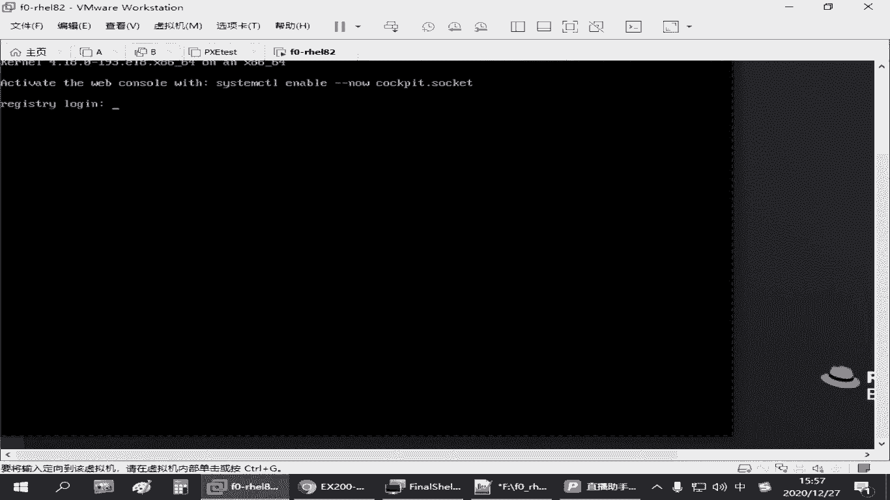

等的时间差不多了是吧。

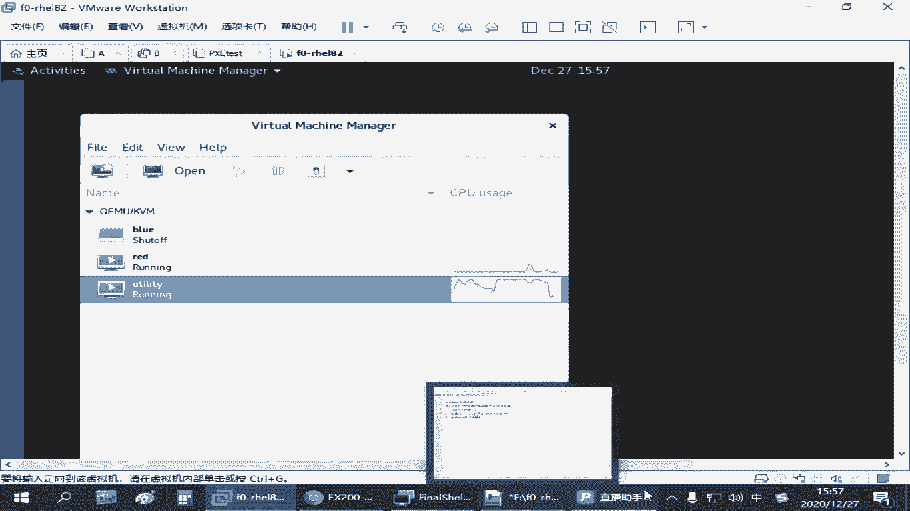

看一下啊，哎终于收到了，哈哈是吧，等了好老子好长时间了，中间经历了不同的错误，一开始告诉你没有路由，在后边告诉你拒绝连接，再告诉你版本不匹配，等下我给你尝试了好久啊，等到现在还没出发是吧，能搜到之后呢。

我们再去下载啊，for derman破啊，下载这个镜像啊，啊刚才那个某辉同学问的啊，就是说你下载回来之后，为什么有这个这个其实你从哪下载的啊，他自自动就给你做了这个名称的一个标记啊。

这个不需要我们配置啊，你下载的时候不是给的这个地址吗，所以下载回来之后呢，存到你当前这个呃用户的这个镜像库或者管理员那个镜像库啊，它都会有这个标记啊，等下载完成之后，这个时候用户他才能够看啊。

pd man in mage是吧，你看是不是也有了是吧，那后面的过程呢，你跑容器的思路是一样的啊，是一样的，用户的服务啊，我们也需要跑一个pman run啊，嗯比方说我们在我们的用户的家目录底下啊。

创建一个目录叫container log solo啊，在这个目录下面呢创建一个网页啊，叫index。html，写一个文件叫timmy s，是吧，写个这样的啊，嗯然后有这个网页之后呢。

我们pd man rua去运行一个容器，放后台运行杠p给它映射一个端口啊，不要和前面那些冲突啊，八零来个8080吧，对应到八零啊，然后杠v映射一下目录是我们home下载啊，大绝对路径。

timmy shut container log server是吧，用这个目录做网页目录，映射到我们user shell，html起个名字，杠杠类叫my web，三调用的是刚才我们那个n gx技巧方。

这也是按正常的方式去启用一个容器，使用容器之后呢，我们去测试一下，先测试一下访问乐的这台主机，它的8080端口啊，那这个时候你可以看到对吧啊，看到有这个网页啊，网页嗯，然后呢有这个网页之后呢。

啊说明这个容器没问题啊，那如果我们要把它变成我们用户的服务啊，我们需要做什么呢，需要make dr，在用户的主目录下，他有个子目录叫config，这个目录原来没有的，什么时候有的在你下载镜像的时候。

它自动生成的啊，有一个点confer在下面有个容器目录，就你运行之后有有这个目录啊，那现在我们不用这个容器目录啊，我用的是什么呢，有个叫c4 t5 d这个目录没有啊。

我们需要去创建有个叫user就用户的服务啊，make dn r个p啊，创建这个目录之后呢，cd到这个目录下，然后一样啊，pdman general csm d杠杠，name my web 3。

后边跟上我们的杠杠files，创建这样一份文件，那你看他文件是放在这里这里嘛是吧，那有这个文件之后呢，然后我们要把它更新成我们的系统服务，刚才有同学不是在问吗，你没有更新之前，其实是没有那个的啊。

那更新的时候呢还要注意我们需要用那个什么杠杠user，这个表示是我们普通用户的服务啊，后面再跟上dm软路的啊，这样是吧，这个操作做完之后，我们再用c4 d ctrl，然后跟上还是要跟上。

刚刚user titles去查看container table出来就有一个买web 3是吧，也一样，他现在状态是停的，我们也可以pdman啊，stop杠l啊，最近的容器先停止。

然后pdman起服务的时候也是要加杠杠user啊，再次大成，对吧，再把它启用，启用的时候呢，我们再去测试啊，啊还是能访问没问题吧是吧，是8080端口啊，这个那也一样啊，可能我们说诶这种方式。

那还那不就是加个user嘛是吧，加个user我们是不是也可以enable content这个呀对吧，也是把它设计成设置成开机自启，但是普通用户的服务，你关注这个不够啊，要你关注这个之后呢，他重启之后。

其实服务再起不来啊，跟刚刚我们管理员做这个还不一样，管理员你以为你是管理员，你设置完ennl之后的那个服务，每次开机它就自动起来了，就把那个容器服务在这，普通用户呢，它其实这个能力没有这么大。

尽管这个普通用户他希望这个容器服务每次开机之后自动运行，但是每次开机之后呢，这个用户他是不是根本就没有登录啊是吧，这个用户端没进这个系统，那这个时候默认情况下系统是不会给你起这个服务资源的啊。

那如果要齐怎么办呢，那你就得想一个办法让这个用户在没有登录的情况下，他也能够让你乐的这台主机为你去开启这个服务，这个呢有一个控制工具啊，叫log in ctrl enable，那个叫link啊。

link意思好像是逗留是吧，保持的意思后面可以跟上一个用户名，如果你是管理员的话啊，如果你是自己为自己做的话，那就直接敲这个就行了，这叫enable lingo，这个操作做完之后其实是通知管理员啊。

就哥们帮个忙啊是吧，我没进来的时候，让你帮我把壶开一下，做这个作用的啊，这个做完之后呢，大家可以去检查哈，检查有个show users啊，show user吧，然后跟上你自己这个用户名字。

他最后一行应该有个叫ngo，等于yes是吧，看到这个啊啊那个等于e，这就是说为用户保留，就是这样，当用户没有登录的时候啊，你为他保留这个呃起伏的一些资源啊是吧，一个是启用，一个是检查。

这个方法是来自于红帽官方的啊，但是他用的时候有些限制啊，就说你比方说你登录的时候呃，包括刚刚讲那个用那个什么刚刚用的那些服务啊，你是s s s连啊，不能用r s u或者用那个速度，要不然不管用。

那还有有可能考试环境有啊，咱们练习环境用这个恒定值啊，没说出来就仍然起不来啊，加了这个也起不来，但是既然是个考点，我们要把它还是要做是吧，这个要做了行吧，你步骤上是对的，那如果他起不来。

那我们得想办法呀，万一他这个不好使，我们得想办法让它能起来呀是吧，那我们可以做别的方法，你让一个服务开机自启人很多方法啊，这个只是其中的一组，那另外还有一种方法是什么呢，就是你可以写一个计划任务。

或者呢我们去改了个开机挂载的配置文件，开机开机自动运行那个配置文件，但是开机这个文件呢需要管理员去做啊，如果是计划任务的话呢，就是你可以这个用户的身份啊，自己去编辑一个计划任务。

可以ctron table杠一在后面呢加一个计划任务，让他在开机的时候执行一次这个计划，任务的时间表示我们可以写一个at reboot，这个就表示开机执行的任务啊，那后面这个任务怎么做呢。

就是我们那个c4 team control一般建议用绝对路径是吧，呃c s team ctrl应该是在那个叫什么user并一下对吧，把一个出来确认一下。

用c4 tm control杠杠user啊去启动啊，你打rs也行，像刚才我们不是说那个开机的时候第一次起步好不好使吗，然后我们再加这个是吧，restart启动一个container杠my web。

servers是吧，这个命令让它开机的时候自动运行啊，这个命令呢你手敲的话，避免别出错啊，尽量在我们命令行先测试一下是吧，确认它好用啊，确认它好用点，servers，这个加不加点设施都行啊，都行啊。

因为服务的扩展扩扩展名后缀嘛，来再确认一下是不是这个是吧，这是复制粘贴的问题啊，其实就是银行你复制过了，刚刚下被他自动给我换好了吗，好那这个测试完成之后呢，我们再去重新启动一下啊。

现在是可以看到这个网页是吧，来我们把read再重启一下吧。

现在镜像都下载完成了是吧，这个机器我们可以把它给关闭了啊，u t0 t。

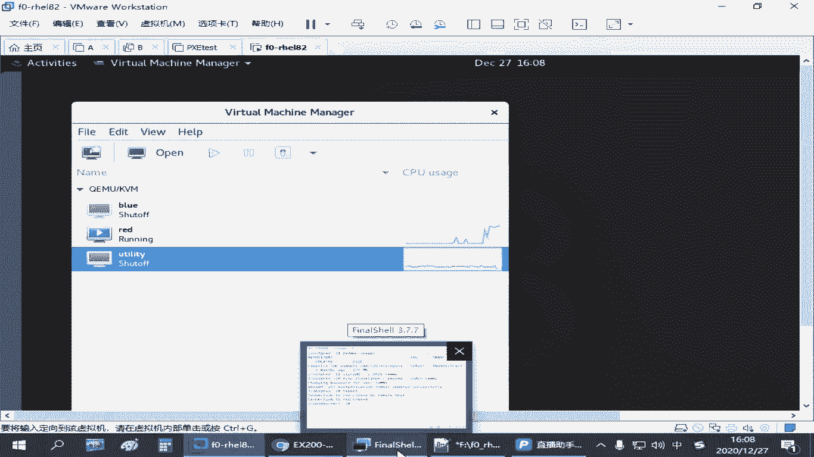

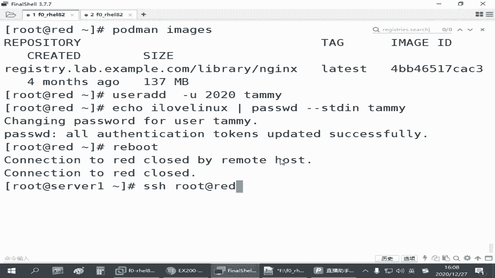

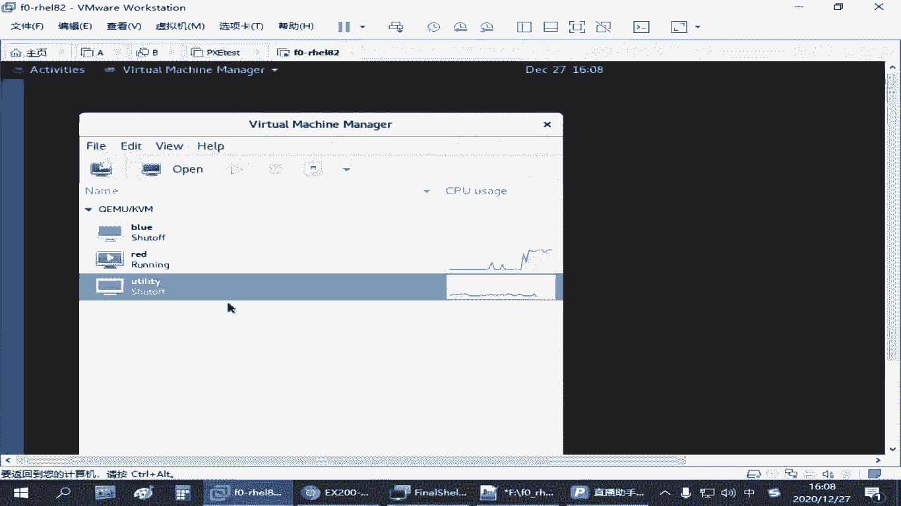

开机太慢了，还没起来，啊进来了再去测试我们的red的8080端口，来这个你看没问题，在普通用户这个啊好这是我们刚才给大家讲的，就是普通用户的啊，无根环境，就大家注意一下，我们这个配置的目录有点变化。

然后在添加服务的时候，什么叫价格杠杆优势是吧，嗯the road也好啊，start也好啊，这些都要啊注意啊，就是刚刚悠着后边跟着操作啊，这就它一个区别和我们管理员啊控制这个服务的时候，它有一个区别嗯。

当然他开机启动的那个怎么让它生效是吧，其实我们验证过就是做一个计划任务，这个还是挺好用的，就编辑的时候呢开机启动一次啊，一个叫reboot，后边跟上我们这个命令行，因为普通用户它虽然不能改管理员的文件。

跟他自己配计划任务时进去的是吧，计划任务的本质就是我不登录，你得帮我运行一个任务，那默认就是允许的，所以你直接写一个计划任务，后面写一条命令就行。

这个命令就是你用ccd control刚刚悠着去重启一下你那个服务啊。

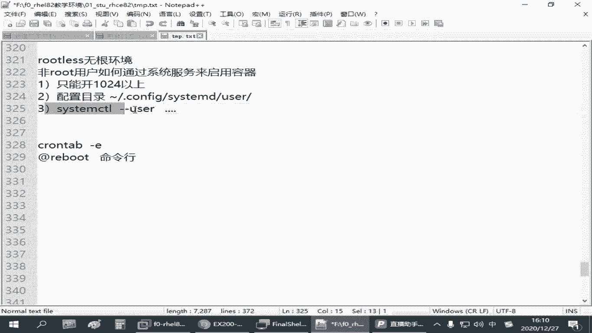