# 全网最全RHCE红帽认证全套入门教程 - P2：1.01-Linux命令基础 - 达内-程序猿 - BV1f64y1q7b5

嗯那下面我们要讲这个LINUX命令基础，嗯这一块的要解决的问题啊，就是帮助大家，你在对LINUX了解不是特别多的情况下，那有一些LINUX是我们需要去了解的，需要去掌握的，你掌握了这些命令呢。

那我们后面在学这些知识的时候，才能够更加顺利，嗯初步规划的我们大概包括这么几个部分吧，LINUX命令基础在一块啊，那第一个就是关于我们LINUX命令行去控制，我们操作系统它的一些基础的一些概念啊。

命令行概述啊，该说这一块的话，你可以包括它的命令行那些格式是吧，好快捷键，这可能有些同学听过啊，那没关系，你就当复习一下了，那第二个的话呢就是常用的一些命令，嗯常用的命令的话呢。

我们主要给大家讲解这么几个嗯，像R六S1样是吧，CD啊啊PWD啊，这个是要了解我们LINUX系统的文档目录结构啊，我们需要去了解的，那再一个呢就是在我们LINUX系统里面创建目录。

需要一个make it dr啊，然后呢创建文件的查看文件的，nice是吧，然后复制文档的CP啊，copy删除文档RM啊，还有改名移动文档MV对吧，这几个啊大家必须会的吧对吧，这很基础很基础的一些操作啊。

那第三个的话呢技术命令这一块啊，还希望大家了解我们命令的帮助，嗯为啥要学这个呢，因为我们在考红帽认证的过程当中，有很多东西你可能并不一定能够全都记下来，那当你记不住一些东西的时候，一定要学会用帮助对吧。

你要学会用帮助的话呢，嗯那很多资料你一查就能查出来，不需要全都记住，这个帮助指的是我们红帽系统里边啊，它为我们提供的这些帮助，不需要上互联网系统里面自带的啊，这个一般有一个叫手册的一个工具。

简写的就是一个MN非常强大的，那这个你要知道怎么去看，怎么去找资料是吧，我们后面有很多操作呢，你都要学会用这种方法，你这种方法呢你在考试的时候，你随便用，不算你作弊哈，这正大光明的看。

因为你谁能说我们工作的工作的时候，你不让我看资料啊，那谁记性也不是那么好的是吧，有很多东西我顺手就能找出来的，那我为啥不查呀，你做做能把问题解决啊就好了啊，这是命令帮助，这是一块。

那后边还有一个呢是VM编辑器啊，VM编辑器啊，这个编程器呢在我们最小化的安装里面，可能没有VM，只有一个vi，但是大家用的时候，这两个编辑器用法差别不是特别大，所以这是叫VM编辑器嗯，那基本上的话呢。

我们LINUX命令基础这一块大概就是这么多对吧，以后我们分别来看一下，讲完这一块，我们再给大家讲那个服务控制和安全开关啊，第一个命令行概述，呃命令行概述的话，其实这要写起来也挺多的啊，我说你不写了。

我就说吧，命令行开始说，你首先要知道什么是命令行是吧，什么是命令行啊，啥意思，我们说命令啥意思是吧，好你家养一条小狗，你跟他说来过来握个手对吧，他如果能听懂你说的这句话。

他是不是就伸个爪子过来给你问一下呀，对不对，那可能你刚新新认识一个女朋友，你带回家去，女朋友跟他说是过来，大王能握个手，可能你那时候就听不明白是吧，因为是你跟他说的那个语调啊，声音啊都不一样。

它不一定就理会这句话，所以呢我们控制LINUX主机，那这个LINUX主机对我们管理员来说，我们得让他听话呀，他就是我们养的一条小狗一样啊，是不是这样的是吧，那我们作为用户，我们作为管理员。

就得让LINUX主机听我们的话，所以我们需要给它去发命令行，那怎么发呢，其实就是在我们这个命令终端啊，你能输入这些指令的这个终端去敲一段代码，包括我们刚才敲的这个SH，这些都是命令。

所以我们说的命令行其实就是一个管理员，输入的一串字符是吧，这一串字符呢它的作用是用来干嘛的啊，是一套什么样的字符是吧，是用来完成，某一个系统任务的，你输一个字符，输一串字符，肯定是要干活的，你不干活。

你不啥事也不干，那是不是不是一个有意义的命令嘛是吧，你管理员输入的一串，用来完成某某系统任务的啊，或者不一定要系统任务是吧，有完成某一个任务的，国外人员输入的一串，用来完成某某任务的字符啊。

输出的形式就是你按回车键就是个按键提交，那么你按按键提交之前的这一串字符，你就可以把它当成一个命令行对吧，这就是个命令行，比方说啊我们前面说的各种啊，我们要看IP地址最小化安装的系统呢。

你可以IP js list对吧，可以用这种方式的网卡，不叫这个名字是吧，叫ENREMPES0，那么这就是一串命令，那我们在输入这一串字符的时候，如果他能认识能听懂。

那说明这个LINUX系统他就能够帮我们做一些事，如果他听不懂，他可能就会报错，那说明你敲的这条命令有问题，你就得去纠正了是吧，你像我们上面敲的这条命令好。

IP AD d list后面跟了个it t h0，然后他就告诉我啊，你这个主机上没有ETH0，这个网卡不行吧是吧，那没有这个网卡，我就想知道到底有哪个哪几个网卡呢，我就把后边ETH0给去掉了。

只敲了一个IP address list，他告诉我下边诶有一个回环接口，然后有一个第二个接口叫EMPES0是吧，这是一块以太网卡，然后它下边有IP地址，那这个命令的作用其实就是用来看IP接口啊。

它相关的一个地址信息，啊那为什么我们LINUX系统，你发一个指令他能听懂呢，那我要敲个别的，他为什么就听不懂呢是吧，所以呢这一块的话呢，大家还需要知道一个什么东西啊，还需要知道一个叫解释器啊。

有些概念啊，刚才我们讲到第一个案例叫命令行，你要知道命令行是啥，那解释器又是啥呢，这个指的是LINUX系统中的一个程序，这个程序是一个特殊的程序，怎么个特殊的特殊法，因为这个程序呢，它是用来翻译。

或者说叫解释管理员提交的命令行的，有一个这样的一个特殊程序，这个特殊程序就是我们的解释器，如果我们的LINUX操作系统没有这个解释器，那我们管理员啥也干不了啊，为啥呢，因为你敲一个命令没有人理你对吧。

就好像我们养了一条小狗，那小狗的耳朵可能被啥东西堵住了，听不见，那你给他说话，他不理你，对不对，那不行，所以我们LINUX系统呢，其实任何操作系统都需要有一个解释器啊，都需要一个解释器。

这个特殊程序呢通常就是有一个概念啊，它有个概念一般叫做笑啊，这就是我们所说的线，那为什么shell跟解释器挂上钩了呢，因为它的外它的那个英文的原意啊，叫外壳啊，为啥叫外壳啊，它是。

它是包在我们在包在我们的LINUX内核程序啊，就是操作系统的最核心的那个程序，外边的一层壳啊，这是包在LINUX内核外边的一层壳，所以叫外壳程序，这个外壳程序，它的作用就是用来为我们用户翻译命令。

那LINUX内核是干嘛的，对不对，可能又来一个概念，这是大家第一次，应该有一少部分同学可能刚接触LINUX啊，所以我们给他解释一下，那现在我们说的这个内核你可以忽略LINUX。

各种操作系统都有啊啊内核指的又是什么呢，指的是我们操作系统啊，操作系统指的是啥啊，越来越多了是吧，操作系统就是用来控制我们的计算机硬件的，这是用来控制，计算机硬件，它的一个软件平台，它的最核心的部分。

这叫内核，那用来控制计算机硬件的软件平台，这个平台叫什么呢，就叫操作系统，比方说我们平时用的windows是吧，这个指的是一种操作系统，那LINUX呢是另外一种操作系统。

那每一个操作系统都有一个最核心的部分啊，都有一个最核心的部分，那LINUX的内核一般叫克隆，然后微微软windows系统的内核一般叫NT吧，是吧啊，微软那个叫NT叫new tech拉拉机啊，叫新技术啊。

是这样一个核心呃，那操作系统最核心的部分就是内核，那操作系统这个最核心的部分用来干嘛呢，主要用来管理我们的CPU处理器，然后管理我们的内存，管理我们的各种硬件设备，包括你的磁盘，等等对吧。

是用来做这个的啊，资料和内核，但是你买回来一台计算机，它都是一堆硬件啊，我管理员我是想在电脑上打一个游戏，那个游戏咋出来的呀，我想编辑一个文件，这个文件咋出来的是吧，你得有操作系统平台。

然后你要用这个内核去操作你的显示界面，显示一段话，显示一段文字是吧，显示一个图片啊，怎么办呢，你是不是得向内核发送一个指令啊，但是操作系统的内核呢，它只能听懂计算机的那种指令啊。

二进制的E202120了是吧，这管理员哪知道呀，不知道，所以我们管理员能听懂的，这个指令是什么形式的，是这种形式的，哎我也写个IP，我知道这IP地址是吧，然后ADD那JS地址这个单词的前三个字母。

而历史的数列表，这个我们是能听懂，但是你操作系统的核心他听不懂，所以在你的操作系统内核的外边，还需要有一层壳，这个壳就叫像也是我们所说的这个解释器好，就这个，那这个解释器的作用就是帮我们管理员。

把我们管理员能听懂的这种指令，翻译成计算机内核能听懂的一个指令，所以这个就是解释器的一个作用啊，那它是负责，把管理员啊或者说用户啊，用户吧负责把用户提交的指令变成啊，就变成了变成内核能理解并执行的指令。

这是它的一个作用，那其实在我们LINUX系统里面呢，这个内核程序这个特殊的程序，通常情况下99。99%以上啊，指的是我们系统目录下面有一个文件，在根下有个B下面有个叫BASH对吧，是这样一个程序。

如果你把这个程序给干掉了，基本上你这个用户就登不进去了，除非你给他换另外一个解释器，如果你不换，默认就是这个解释器，那解释器没了，你就没法操作这个计算机了啊，所以这一块大家特别是刚接触的同学啊。

你要好好理解一下，那这里我们给大家解释了一个命令行解释器啊，再加上这个内核是吧，它们之间的一个关系啊，这些概念啊，一些概念好，然后我们再往下看，因为有这些概念，我们还是有必要去知道的呃。

那如果我们要控制我们的LINUX操作系统，嗯还需要去了解什么呢，就是我们这个命令行怎么去写是吧啊，命令行怎么去写，那这里衍生出来的一个概念，就是我们LINUX目录结构。

因为这个和windows长得不一样啊，和windows长得不一样。

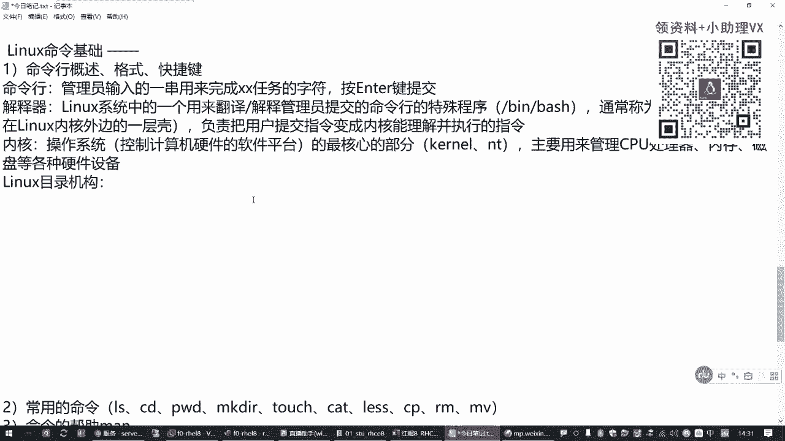

那大家如果想了解我们LINUX的目录目录结构，怎么办呢，我们可以在这个练习环境找活动啊。

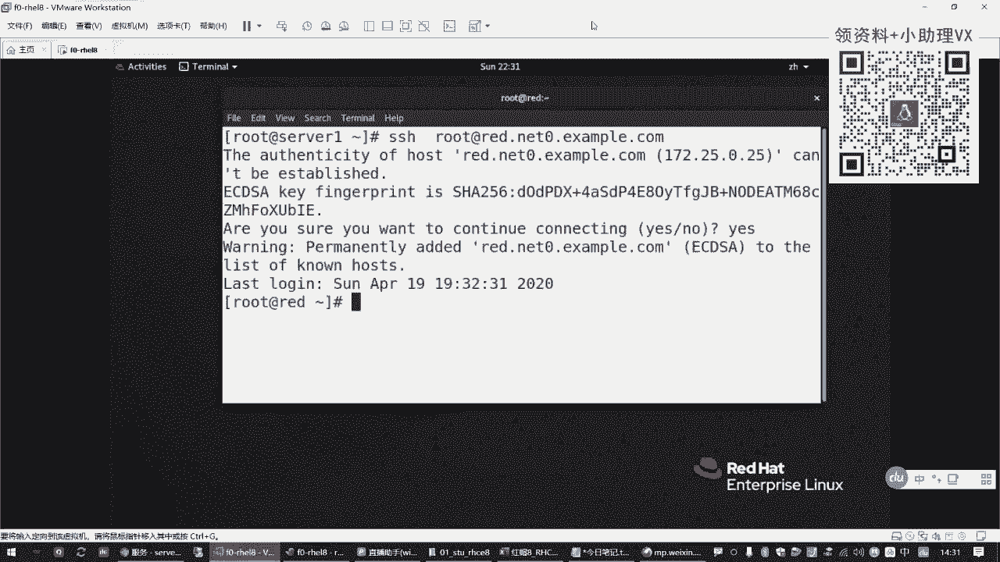

一个activity是吧，那第二个这有个files，这是看它的文件，你可以打开这个按钮。

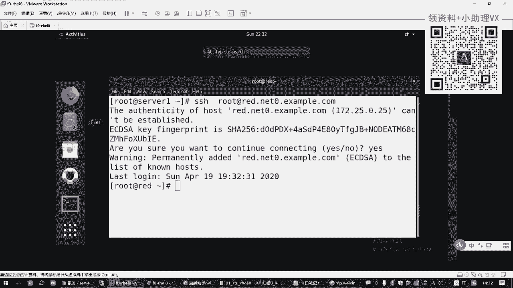

来了解我们系统里面有哪些文件，那默认情况下呢是在这个家的一个图标是吧，叫home，这是你用户的总目录，但是如果你想了解这个系统里面所有的文件，应该找最底下有一个other locations。

就其他位置啊，打开之后你可以看到上面有个计算机，这个打开之后就相当于我们那个windows主机，我的电脑一样啊，有个叫computer对吧，这个那你点击computer你就可以看到啊。

就可以看到我们呃这个系统里面所有的目录，你往下找是吧，这就这就是就是所有的对啊，就所有的那比如说下面有好多目录，那好多目录的话，你随便打开一个目录，你可以进去看里面有好多文件，还有好多子目录，对不对。

是一层一层的。

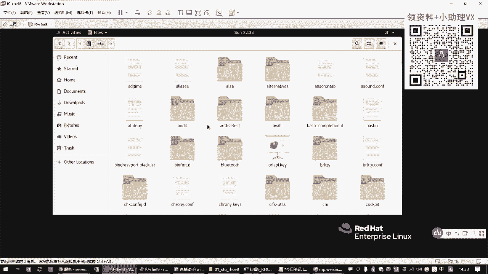

那对于LINUX系统这个目录结构来说，目录结构啊，它采取了一种塑形的结构，其实跟我们windows差不多啊，只不过呢它最上层就是我们刚才敲的啊。

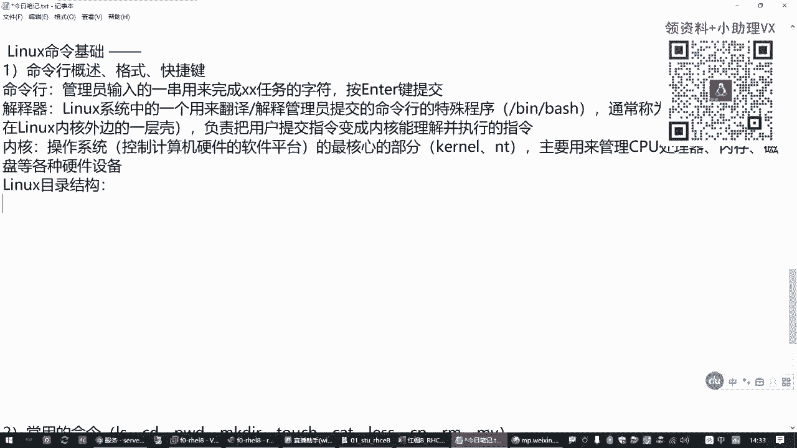

我们刚才敲的这个other location computer，这就是我的电脑吗，那我的计算机打开之后，这就最上层一个目录结构。

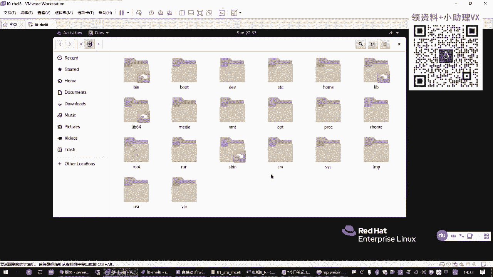

这是图形化的方式去表示啊，所以它的最上层就是一个叫computer啊，怎么打开的，怎么打开的，是不是通过你那个艾克TVT，然后打开之后有一个，files是吧，通过这个是打开的，打开之后呢。

还有一个什么other locations，这是图形界面啊，它不常见，待会给你写一下，用这种方式去打开啊，这是图形环境，好大家要知道的是吧，怎么去打开啊，嗯那我们也说了，你你工作的时候很少用这种环境。

所以我们要学会用命令行环境怎么去打开，那命令行环节的话呢，和这种图形的方式就不一样，那如果我想看LINUX系统目录结构图形的方式的话，那你得点好多次鼠标，但是你在命令行环境下边的话呢，不需要这么麻烦。

我们下面选择一个命令叫LS是吧，你直接执行LS后面空格，打一个斜杠就可以看到啊，比方说在这里你挑一个IOS斜杠，这就可以看到这一堆目录，那颜色不一样是吧，一般蓝色的表示是目录啊。

浅蓝色的呢表示这种快捷方式，就它不是原始的那个目录，它是指向别的目录的目录啊，这叫快捷方式，但是你看到内容，你看也是BEDV是吧，boot这些你重新界面。

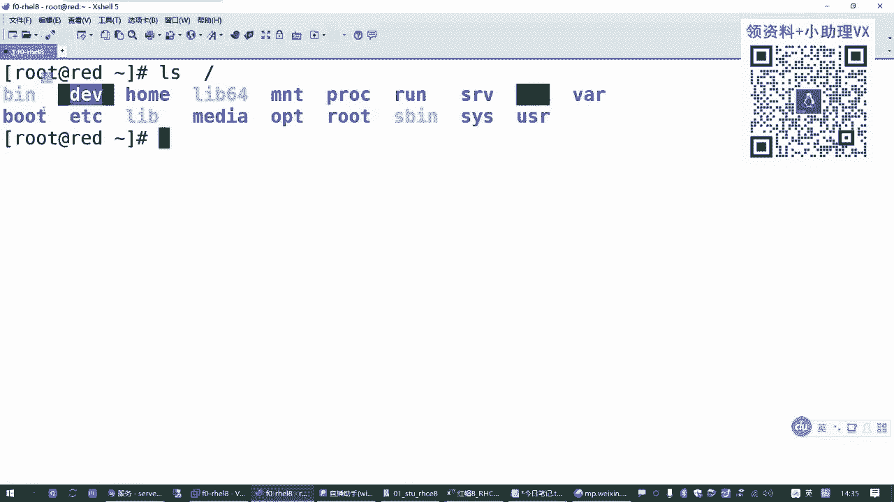

你看也是BEBOT第一位，这些是一回事，所以大家知道为什么我们搞it运维的。

要喜欢用命令行，因为你用图形界面太麻烦了，我命令行敲个LS空格斜杠，顶多敲四个字符，但是你在图形界面里面要干嘛。

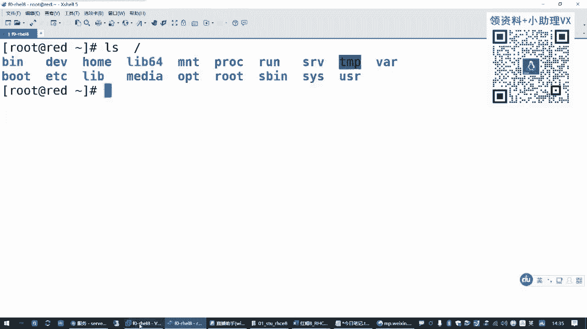

你现在打开这个点一下，然后点FI老师再点一下。

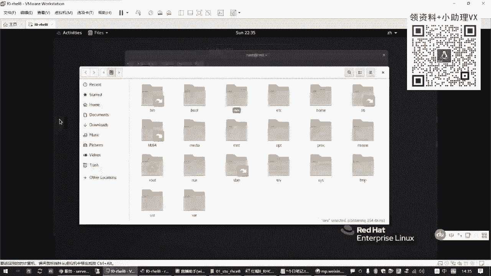

然后再找ADD k线再点一下，然后还在点computer，再点开，这也点了四下是吧啊，你还在肉眼去分辨这些这么多的东西，那你眼神不好，可能有些近视是吧，你点一下点错了呢。

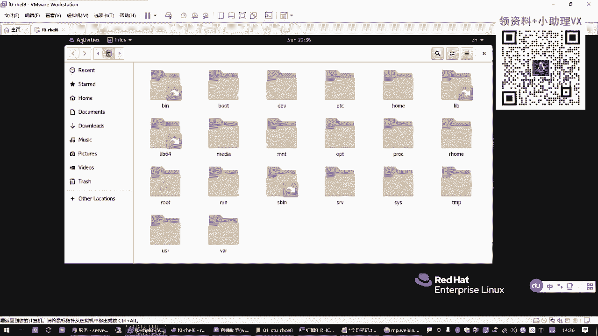

我activity，等下我点到这个火狐了呢，对不对。

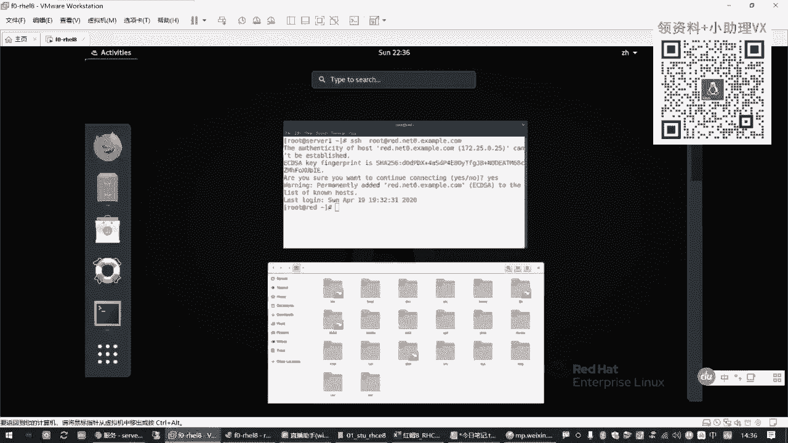

有这种问题吧，所以其实命令行的效率比我们图形的效率要快，你后面学了很多命令，你都会有这种感觉啊，那如果你后面要做那种批量化的管理，咱们红帽八不是针对我们这个云环境，提高这种批量化管理效率的嘛。

很多操作都是在命令行下来做的，如果你要去写一些脚本，写一些程序，那你更加不方便用这种图形啊。

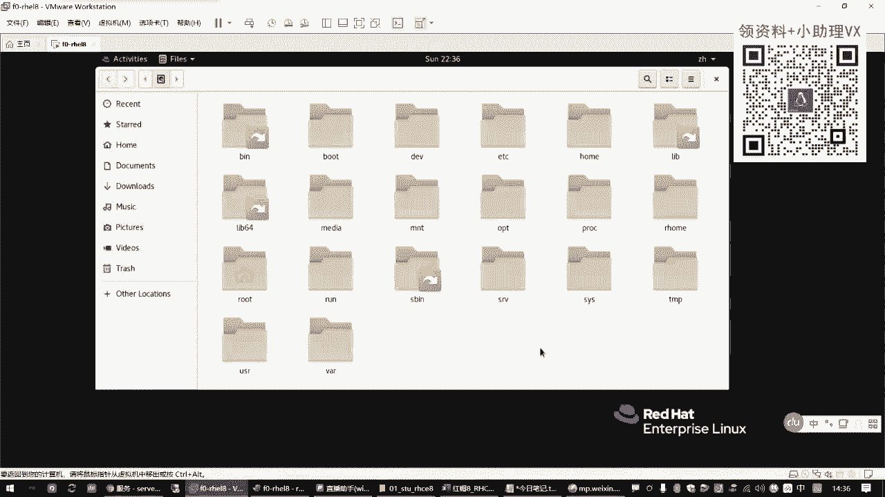

一定要熟悉我们的命令行操作啊，当然啊我们讲到这个目录结构了，那大家也了解一下我们的LINUX目录结构里边，常见的一些目录，它是用来干嘛的是吧，常见的一级目录好一级公路啊。

然后呢LINUX系统的目录它是分层次的，不管你是通过图形还是通过命那个命令行，用IOS去看那一层一层的目录。

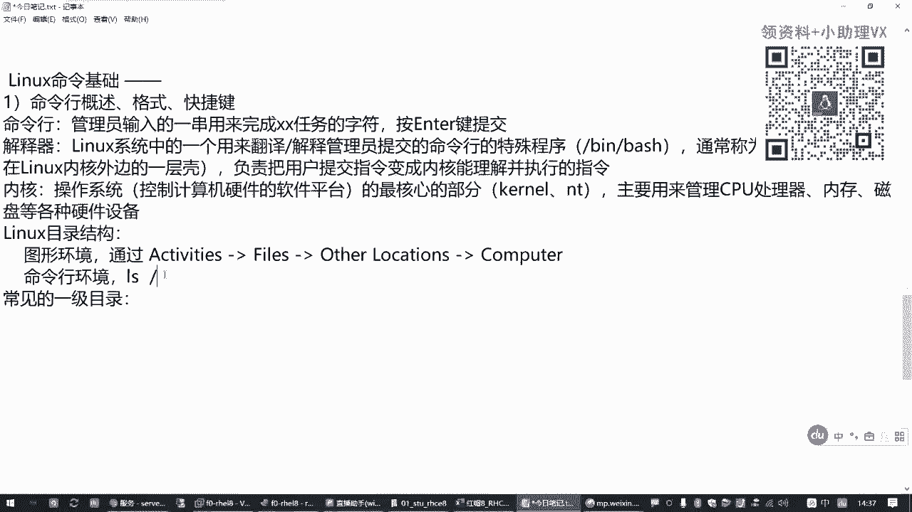

比如说我们这个bot这是一层目录，你双击进去之后是不是还有一层啊啊，还有好几层啊是吧，底下有个grub to是吧，双击里面还有那像这种路径呢，是一层一层一一分下去的，那如果我们在命令行下来看的话呢。

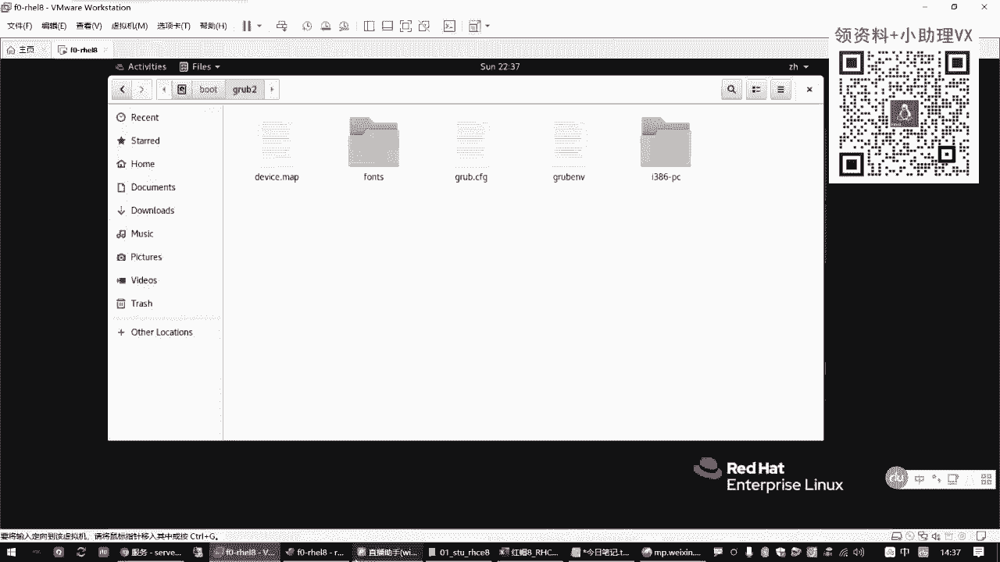

这就是目录层级结构，这种层级结构呢你不需要用肉眼去分辨，你直接敲就行，你要找boot目录下面打一个BO往下table一下是吧，这涉及到一个快捷键呃，你往下再找一个目录，就是grub to。

再table一下，是不是就出来了，所以作为一个基础的知识啊，那所以这里呢就又一个点，就是，LINUX目录在命令行下面来表示的时候，它的风格层次分隔，这个好理解啊，这个好理解，它的符号就是一个斜杠啊。

用了一个符号是斜杠，这个同时呢这个斜杠也表示我们LINUX目录最上层，那个特殊的目录呢叫根目录，这上面我们说的这个啊最顶的层次，写下来吧，最顶层，就是一个斜杠，这个也是通常我们所说的这个叫什么的角色。

根目录就整个操作系统的一个根啊，所有的目录都在他之下，人家说一人之上，一人之下，万人之上是吧，他这个就是整个系统的最上边啊，没有人在站在他上上边了，你再在它上面就是LINUX内核了啊，没了啊。

那这个斜杠呢，同时也作为我们不同目录层次的一个分隔，你比方说这个就是根目录，下面是一级子目录，这是一级子目录和二级子目录的一个分隔，这是二级子目录，再往下边还有呢是吧，一层一层分隔的。

这是LINUX目录的层次分隔啊，这个大家要知道，你要理解这个含义是吧，那常见的一级目录，常见的一级目录有哪些呢，嗯大家主要了解一些常见的目录用来干嘛的啊，就可以了，那怎么说呢。

就是刚才我们讲到的这几个目录，那我们把它复制出来，这个特别是刚接触LINUX不久的同学啊，还是有必要去了解一下的，我们把它归归类其中的病，这是英文单词二进制的意思啊，这个目录和我们这个SB。

都是用来存放可执行的程序文件的啊，就上面这两个主要用来存放可执行的文件对吧，就这个作用的那B和SB有啥区别呢，这个S代表的是super超级用户啊，叫super super b。

一般指的是在这个目录下面存的一些程序，是管理员才有权限去执行的，比方说做磁盘分区的，添加用户账号的是吧，管理用户用户账号数据的格式化的是吧，这些对系统的影响会比较大的啊，那前面这个病呢。

一般是所有的用户都可以去执行的，所以他还是有点区别的，还是有点区别的啊，没有好，再往下看，还有一个DEV，那D1V的话呢，这个指的是，用来存放设备文件的，存放各种硬件设备，那咱们的光盘呀，磁盘分区呀。

鼠标呀，显示器呀啊等等等等，那些硬件我们怎么去访问它，它也有对应的文件放在这个下面啊，第一位下面，然后再往下面这个home home呢就是系统各种用户，这是存放各种普通用户账号。

它的主目录我们每一个用户登进到系统之后呢，它都有一个目录，这个目录就是用来放这个用户账号的，一些基本文件的，对吧对吧，你要不然一个人你到这个系统之后，你啥也干不了啊，那没用啊，就像咱们老百姓一样。

我们都是追求那个叫安居乐业是吧，你首先得安居，你得有个地方住，那我们系统也是你一个账号进来之后呢，你得有个目录给你用，要不然你没有归属感哈，这就是home，所以大家刚刚在我们系统里面也看。

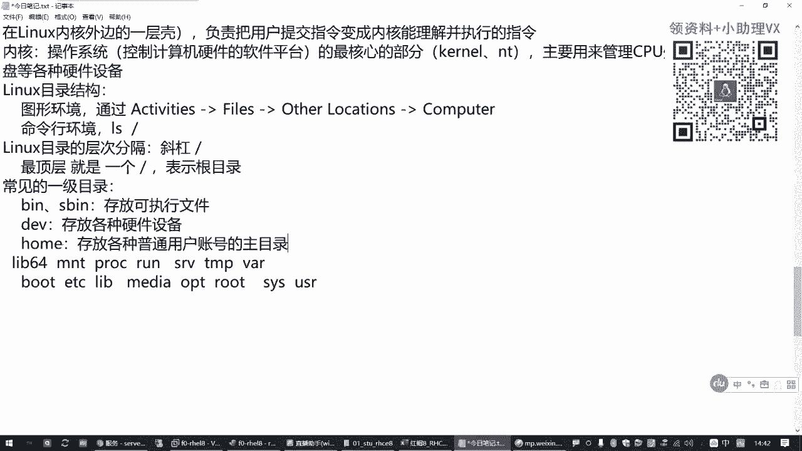

你这没有个home吗，我用管理员进来，这也有，也是有个home的，那上面有个标标志，画了一个房子的一个图片。

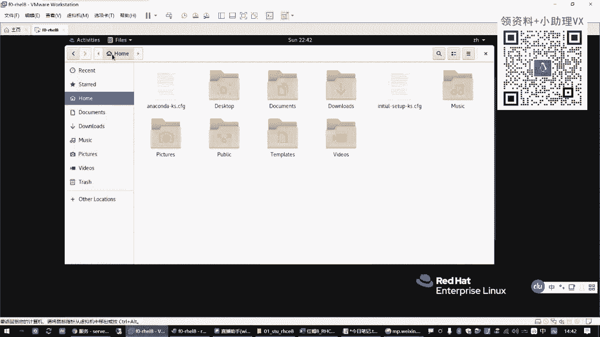

是吧啊，当然啊，管理员root这个用户，他的加目录不在home下面，他另外有一个目录就叫root啊，就叫root，所以你是管理员和普通用户不一样，诶把个后门敲没了，好，管理员的主目录。

和我们普通和那个普通用户不一样啊，我们说home目录呢，这是存放普通用户的主目录的啊，普通用户的主目录啊，那root这个目录呢是，管理员账号，他的主目录，他不用来存放目录，它本身就是管理员账号的总目录。

就跟下有个root，然后下面的话呢是存放普通用户的主目录啊，啥意思呢，比方说你有一个张三用户，他的主目录呢是在home下边再建一个小目录，叫张三，啊那如果还有一个李四，他下面可能会有home下的李四。

所以普通用户账号呢，他们是住集体宿舍的那root用户呢，他是做做那种独栋别墅的对吧，长得不一样啊，好底下还有一些嗯不太常不太常用的啊，这个我就不写了，这个我就说吧，一般的接收不到。

等你们后面接触到的时候，你自然就知道他啥意思了，这其实是放我们系统的一些模块和一些库，文件的啊，所以就不说了，那MIT呢这个是用来放我们的，系统的，用来挂载一些外部设备的。

目录这个目录下面默认应该是没有东西的啊，有没有东西无所谓啊，这是给我们管理员自己用的，就比方说你要访问一个U盘啊，要访问访问一个光盘呀是吧，你可以都可以把它挂载到这，你也可以在这个目录下面建一个子目录。

把设备挂过来也是可以的啊，都可以啊，嗯还有一个block，这是我们的主机那个内存数据的映射，它实际上呢不占用实际的硬盘空间啊，它是个虚拟的，就方便我们管理员呢去操作这个系统，这就是内存数据的一个映射啊。

最主要是内存啊，你可以把它加上CPU，CPU寄存器是吧，还就那个内容吧，一般就这个，嗯然后乱这是系统运行的数据，然后server啊，SRV这是放我们服务器的运行数据的啊，这个一般我们也很少会接触到。

所以我们也不讲了啊，那TMP，这是系统运行的一个临时文档目录和临时的啊，VR这个是用来干嘛呢，这是存放，临时的不是临时叫存放变化的数据的啊，比方说系统的日记啊，在计算机系统里边呢。

系统的日记一般不叫日记是吧，叫日志啊，就你系统那个什么时候出了，出了一些什么问题啊，我一个服务啥时候开启，啥时候关闭啊，啊什么时候有用户登录了是吧，所有这些信息LINUX操作系统它都有写日记啊。

记得一清二楚的就放在这里嗯，还有比方说你要搭一个邮件服务器啊，有些邮箱啊，邮件邮箱记录也是在这个目录下面的啊，等等等等吧，变化的数据，因为它不断在增长的，不断在更变变更的啊，嗯还有一个bot。

这是存放系统的启动文档，这个启动文档里边呢包括我们的内核是吧，上面讲过的，那大家知道这一点之后，再在这个boot目录你不要去删除，你如果把boot目录删除了，你这系统就挂了啊，你重启就进不来了啊。

呃因为LINUX系统呢有些目录不像windows，它有那种什么系统保护，那你如果是管理员，你要删一个东西，那有时候一删就直接删了，嗯即使你这个数据正在运行，因为系统正在运行的程序呢，它是拷贝了一份副本。

放到你们的那个内容里面的，再再再运行运作，所以那是呃那个系统的一些文档呢，不要轻易去删啊，呃然后etc这用来干嘛的呢，这是存放各种系统配置，存放各种系统配置文件啊。

这个的啊LLIB也是这32位的库文件啊，我也不写了啊，啊MEDI这个是用来做自动挂载的啊，可以对比一下，放到这个地方，那MIT呢是由管理员，手动挂载一些外部设备的目录啊，他建议你放这啊。

但你管理员有这个管理员权限，你要你你到底挂载不到，到底你挂着放不放到这个目录，人家再说是吧，你不乐意，你谁也管不了你啊，管理员自己你想挂哪挂了，那MEDIIT这个的话呢。

一般指的是LINUX系统自动识别到的，自动识别并挂载的，设备目录啊，你不要放到这，比方说你插一个移动，用移动硬盘啊，插一个光盘呢，它有时候会自动给你挂上是吧，跟windows一样啊。

那你去这个目录下去找就行啊，啊OP it这个一般是安装第三方的软件啊，用到的一个目录，第三方的就option，可以选择的，第三方软件的资源目录或者安装目录吧，啊cs是内核的系统数据，这个也不管了。

跟那跟差不多，一般自动建的就有了，就是你装好系统，那个cs目录肯定是有的，也是个虚拟的啊，那user呢这是存放与用户相关的，存放与用户相关的啊，各种数据对吧，各种文档都在这啊，差不多了是吧。

除了几个不常用的，我给你列出了啊，大部分的一级目录都给你讲完了啊，这这个刚才讲的这些呢不仅仅适用于红帽八，也适用于红帽七，红帽六，红帽五啊啊都是这样的啊，这常见的一级目录啊，常见一级目录。

好那刚才我们讲过了命令行的一些基本概念啊，然后呢也讲了我们的这个目录层次风格啊，常见的一级目录呃，那我们在用这个目录，用这个命令的时候呢，刚才我们讲的命令行吗，那我们使用这个命令行的时候。

启示作用是用来干嘛的，就是在管理这些文档对吧，最基础的目的就是管理这些文档，所以有一个叫命令行的基本格式，那大家后面要用各种命令，这个基本格式还是要了解一下嘛，对不对啊。

那基本的格式呢一般情况下就是命令的名字啊，命令的名字嗯，LINUX系统里面呢你每一个mini它都是有一个名字的，你名字敲错了，它就不认识是吧啊，你名字不能敲错，这个名字呢可能是一个指令的名字啊。

内核指令的一个名字，这讲细的又多啊哈哈，一个是那个解释器，它内容本身就识别的，还有一个是外边的其他的程序的名字，你都可以把它当成命令的名字，其实就是命令的命令的名字啊，比如说叫命令字，然后中间呢是选项。

命令选项在后边是参数，是这样的啊，是这个样子的，呃，什么意思呢，那其中的命令的名字是必须有的啊，这个必须有选项的话呢，很多时候是不是必须有的，所以大家后面看一些帮助手册，可能会看到一个方括号。

方括号括起来的，表示这个不是必须有的，后面这个参数也不是必须有的，啊举个例子，如果我们要看系统里面有哪些资源，IOS是吧，这个命令就是我们下面要讲的这个命令，这个命令的作用。

L这是用来列出目录下有哪些文件，或者用来列出文件的属性啊，为什么做这个用的，那这个命令就是他的名字，它的名字来自于l i s t list显示列出是吧，就他来一个来源来源啊。

那这个命令呢我们用最简单的一个用法，就直接回车啊，不给他任何选项，不给他任何参数，那选项和参数是用来干嘛的呢，选项用来控制你这个命令怎么干活，参数用来控制这个mini去操作哪一个文件，哪一个对象啊。

那刚才说了，我们说IOS用了列出目录下有哪些文件，但是默认情况下它只列出你这个文件的名字，而且呢系统里面有些隐藏的文件，它不会列出来对吧，那如果你想看这个文件的详细属性，那你不得参数就不行。

这个时候我们就得调整你这个命令，它的一个执行的方式对吧，那要调整它的执行方式呢，我们后面就得加选项，这个选项一般是一些特殊的字母，或者特殊的单词选项，前面一般情况下需要有一个横杠啊。

来引来跟一个字母或者说跟一个字符，那刚才我们讲了一个需求，如果我想列出这个文件的属性，那可能我要加一个杠L，看了结果就不一样了，这就是通过这个选项去控制这个命令的，他的执行的方式。

所以这是列出我们这个文件它的属性，那属性有哪些东西呢，那我们这个后面还会慢慢的提到啊，其中有一个1189，这就是这个文件的一个大小，这个默认是1689字节啊对吧，这就是它的一个大小。

但是你写一个1189，我告诉你这是1189字节，等你换个时候，你可能不知道呀是吧，那你记不住这个单位是什么啊，怎么办呢，嗯还有一个选项叫杠H加一个杠H之后呢，你会发现这是1。2KB是吧。

11189字节约等于1。2KB，这是不是就好看了，好看一点是吧，那杠H这个单词啊，这个H啊啊来自于那个叫后面being啊，应该是这个是吧啊具体也忘了啊，这大概是人类的意思啊。

所以这些选项我们LINUX系统里面啊，学这些命令它都是有含义的，唉那杠L是显示的这一行很长，所以来自于这个单词的叫LONG好杠S呢，你点赞的记就来自于那个后面，人类其实啥意思啊。

就是你说1189我听不懂啊，请你说人话，那介绍就说那好吧，说个人话给你听啊，叫1。2KB，这下你懂了吧，对不对，所以这选项选项是这么来的，那刚才我们跟着这个就叫选项，选项的作用。

用来控制我这个命令怎么去执行，我怎么去控制这个结果，所以是决定这个命令的执行的方式啊，这叫选项，选项啊选项，选项的作用是控制命令的执行方式和效果啊，后面这个参数呢参数的作用那就好好理解了啊。

参数的作用呢是用来为命令提供操作对象，比方说刚才我们执行LS命令，你有说看哪个目录吗，没说那怎么办，他看的就是你现在在哪个目录下，那他就列出哪个目录下的东西对吧，就这是哪个目录的东西。

那如果我想看根目录下有哪些东西呢，怎么办，那这个时候你得在后面加一个根，这个表是根目录对吧，这就跟上的，如果你想开根下的boot目录下，这没有个bot吗，它下面有哪些东西在后面加一个跟boot。

这就跟下载不同目录，你会发现看的东西都不一样，是吧，那选项和参数可以同时用啊，你杠杠H后面可以跟上，不有很多命令操作的对象，可以有多个，你可以用空格分开，我又看bot目录下有什么东西。

又看根下有什么东西对吧，都会列出来，这个大家要去分辨了啊，所以这是命令行的一个组成啊，选项可以有多个参数，也可以也可以有多个，所以在看手册的时候，很多时候他这个选项后边会打一个省略号。

参数后边也会打一个省略号，这就表示这条命令选项可以有多个参数，也可以有多个，那如果选项有多个呢，都是一个字母这种的，我们可以把它简写啊，管理员就要想各种办法怎么简单怎么来啊。

可以简写成杠H这个其实就相当于杠空格，杠H效果是一样的啊，效果是一样的，你看它分别列出跟下边有哪些目录是吧，每一个目录的属性，然后他也会列出bot下边有哪些目录，哪些文件。

然后每一个文件它的属性是不是都列出来了，好这是命令行的基本格式，大家要掌握一下，因为这个是我们在使用LINUX命令的一个，基本的一个规律啊，基本的一个规律，嗯再一个就是我们这个，快捷键。

咱们LINUX命令基础，这个挺琐碎的啊，但是呢大家还是有必要去掌握，那常用的快捷键，讲几个吧，最常见的一个TP那个table键是吧，这个可以自动补齐你的命令的名字，然后你要找一个文件。

它的文件的一个路径，在红帽八系统里边呢，这个tab键功能很强大，还有可以补齐，我们后边要管理的系统的服务的名字，软件的名字，什么叫自动补齐啊，就是我懒得写了，你敲个tab键，他就能给我补出来，举个例子。

我IOS我找根下的put，我打一个B开头的，后边我不想写了，敲一个tab键，他就会把可能的结果给你列出来啊，有个BIN有个bot，那你如果再敲一个O再推able一下，他直接把这个唯一的结果给你补上了。

那同样的你下回再打一个G啊，table把这个目录也给补上了，是吧对吧，就就就这这么这么简单啊，这叫自动补全，就帮助我们管理员啊快速去敲命令的，那另外呢还有一个，还有一个呢叫什么CTRLC，感觉L了吧。

这是这叫自动清屏啊，新屏你把屏幕上所有内容都清没了，就留一个命令行的提示符，CTRL它单独有个mini啊，叫可列，和你按快捷键作用是一样的啊，一样的啊，相当于，可莉命令，这两个用的会比较多啊。

其他的还有一些快捷键，就是管理进程跟哪啊，像KCCTRL加上那个C刚才也提了是吧，这个是放弃当前任务啊，放弃当前的任务，就你正在执行这条命令，你不想让他执行了，不想等了是吧，其实就是中断了中指。

还有一个CTRL换一个啊，求ESC加一个点后，这是快速，粘贴前一条命令，的最后一个参数啊，这个有时候大家偷懒的时候呢，你可以用这个这个键盘上的escape键加一个点号，比方说你按一下escape键点啊。

没有是吧，这可莉那这个执行一下，再按一下escape，这个点还没出来啊，LLS啊，这样能选啊，就前面的跟个命令的名字。

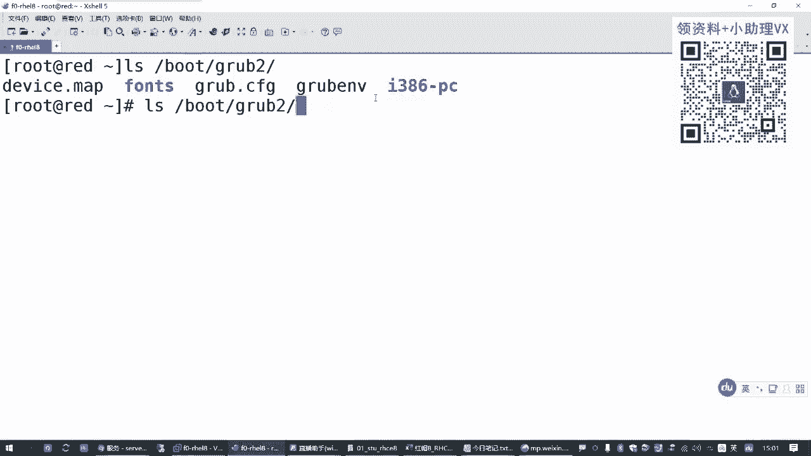

后面再来去贴一个参数，这可以把前一个mini最后一个参数给贴过来。

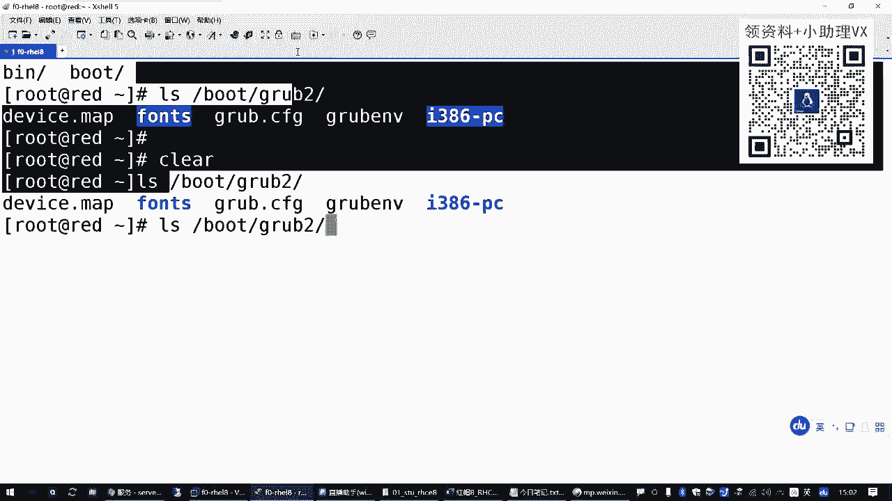

你就不用再敲了，你甚至你也不用再去打那个听不见了对吧，这些快捷键，所以我们把常见的这几个快捷键，给大家提了一下啊，OK吧这是呃我们在使用LINUX系统的时候啊，最基础的一些需要了解需要掌握的一些概念。

特别是关于这个目录结构，然后命令行解释器内核是吧，再加上刚才我们讲过的命令行的基本格式，再加几个快捷键啊，大家平时用的时候呢，你可以把这个好好体会一下，呃相信肯定有很多同学平时用过啊，那没关系。

就给你加深一下印象，加深一下印象啊，那从下节课开始呢，我们将会给大家讲我们的常用的命令，那咱们先休息15分钟哈。

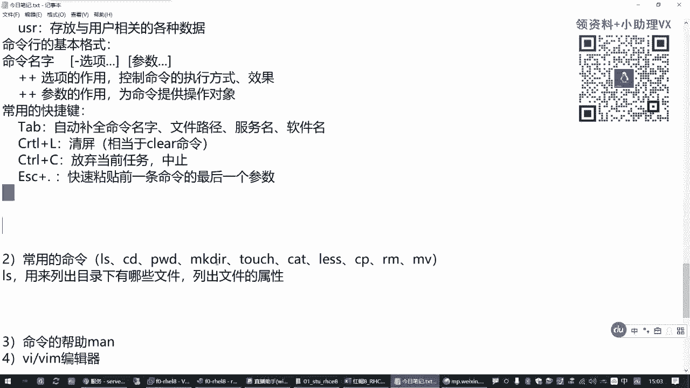