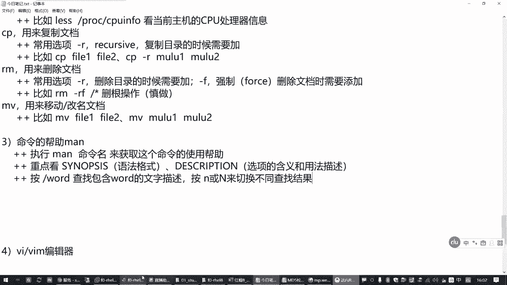

# 全网最全RHCE红帽认证全套入门教程 - P3：1.02-文档管理常用命令 - 达内-程序猿 - BV1f64y1q7b5

那咱接着往下看哈，因为咱们这个c18 的班呢是主要针对我们社招班的同学啊，是因为还有一部分的少部分的同学吧，嗯lily这块可能会接触的不是特别多，呃因此我们今天呢前面给大家讲了很多这种linux。

它的一些命令行的一些基本概念是吧，然后操作linux系统的一些方式，所以大家已经学过咱们云计算课程的同学呢，你不要觉得奇怪哈，这个对他们来说是有必要的有必要的。

好那我们了解了这个linux命令行的一些基本概念啊，也了解了他的一些目录结构之后啊，我们来学习一下我们的常用的一些linux命令，嗯，那这些命令呢啊大家重点啊，你后面要花时间去练习。

因为今天我们花了这个时间会比较短，命令会比较多，所以我们重点把这个格式作用给过一下，那具体操作的话呢啊在后边再一个礼拜啊，你中间花时间来把这些给补上去。

因为这一段知识呢我没有办法像那个呃正常的那个拓展班课程，花那么长时间来一个一个去练习哈，呃因为我们前面讲了这个命令行这个基本格式对吧，你要知道它这个规律就是命令的名字加选项加参数。

然后你再慢慢的去熟悉啊，这些常见的一些用法就好了啊，来我们看一下呃，刚才我们讲到的l s命令，那它的作用呢就是用来列出目录下有哪些文件，这是最常见的一个作用，然后它也可以用来列出我们文件的一个属性。

就看这个文件有多大，这个文件是属于谁的是吧，有什么权限啊，权限这一块我们后面还会专门讲的啊，不要着急啊，所以现在我们有时候你看到一些命令行的一个结果呢，呃可能有部分人不太理解，这都没关系啊。

慢慢的你就会理解了，呃那s命令基本的用法，刚才我们讲呢，其实它也是命令的名字加选项加参数，基本上后边的命令都是这种格式啊，但是不同的命令你首先要理解的啊，特别是新接触这个mini的同学。

你首先要理解的就是这个命令用来干嘛的，一旦你知道这个命令是用来干嘛的，你再去想这个命令应该怎么用啊，就好理解了，比方说你拿到s我要用来看目录的属性，或者说看目录下面有哪些文件。

那很容易想到的就是我要看哪个目录的属性啊是吧，要看哪个目录下有哪些东西啊，那l s命令不就出来了吗，你得给它参数，对不对，这就是ios啊，那再一个呢我们在列出这个目录下有哪些文件的时候。

我怎么去看是不是需要有很多选项啊，那常见的选项有哪些啊，这个是我们有必要去了解的，那比方说r6 s这个命令，这里呢呃基本的用法我就不多写了啊，差不多就是命令的名字加起来加参数呃，那rs命令呢。

不同的命令程序有不同的选项，ros命令它的常用的选项有这么几个干，我们在后边列一下吧，杠l的话呢是叫长格式列出你对方那个对的，那个你要操作的那个对象的详细信息啊。

这个详细信息里面呢包括你这个文件或者目录的大小，然后它的权限修改时间啊等等等等啊，好多呢是吧，这是杠l的含义，然后杠h这刚才我们讲过是什么，就在显示这个长格式的属性的时候，显示更加容易读懂了一个单位。

更易懂的容量单位，也就是刚才我们给大家说的那个说人话是吧，要不然你一般的用户听不懂吧，啊杠l杠h这类用的比较多的，然后有个杠d，这个只是这个是只看目录本身，他的信息啊，而不是看目录底下的信息。

我就看目录，自己不看它底下有哪些东西啊，而不是看目录下面有哪些内容啊，杠杠杠d啊，这几个用的非常多的，所以大家要掌握一下的，举个例子，那我们按照s看boot grub 2。

这个列出的是目录底下有哪些文件，哪些字录呃，然后呢如果我只想看这个目录自己，那你加一个杠就好了啊，那这种时候呢你会发现价格杠d就只看这个目录自己是吧，那底下啥东西你都没有了。

呃所以呢杠d很多时候呢一般都是和我们那个l结合在一起，用这种方式呢用来看目录本身的属性，因为你如果不加这个杠d的话呢，它列出来的是目录底下的文件的属性啊，或者目录底下的子目录的属性。

而不是你目录本身的属性，所以这是杠d的作用，d就是那个directory啊，啊那有很多这种选项呢，它来自于一些单词啊，像这个长格式指的就是这个l o n g，对吧。

然后那个杠h呢更易懂的容量单位就是有个那个叫什么，后面是吧，你就大概记这个单词就行啊，然后杠d只看目录本身的属性，它来自于单词呢叫directory啊，它是帮助大家记忆的。

但你要是说对这些单词完全陌生的，那咱就没办法了是吧，你要熟悉一下这些用法啊，这是l s命令啊，那m s命令呢刚才我们前面还讲过一个用法，就是如果我们直接执行，你没有说我要看哪个目录。

是不是应该默认有一个他也会给我一个结果呀，那这个时候他开的是哪个目录，这个叫你当前在哪个目录，他就看的是哪个目录，那当前到底是哪个目录呢，有个指令叫pw d，就是列出你当前在哪个目录。

那作为管理员来说呢，有时候我们想知道我现在到底在哪个目录下呀，那你直接敲一个pw d就好了，所以这是pdd这个命令，那这个命令的一个作用呢用来列出当前在哪个目录下，那其中这个l s呢用了列出目录。

其实它的单词呢就是这个list啊啊p wd这是列输入你当前在哪个目录，那这个作用怎么来的呢，这是叫打印或者输出，或者叫显示你当前的这个叫工作目录啊，简写成p w d是吧，就是看当前在哪个目录好。

那如果你现在在当前这个目录，我现在我不想看这个当前目录下的属性，但是我也希望用l s就能够看到那个目录下的东西，那怎么办呢，我们要改变工作目录，你不能我能这一辈子只在一个公司干活呀是吧，我可以跳槽了。

那我们cd这个mini呢就是用来跳槽的啊，你可以从当前所在的这个root目录去跳槽到另外一个目录下去，叫cd，你想到哪个目录下面去，那你会不会跟着呗啊是吧，比方说你想到更下面去，就cd空格杠。

那么现在你pw d这就在根目录下，你这个时候你敲一个看的就是你根目录下有哪些东西，是不是这个命令敲起来很简单呀对吧，那这个叫cd命令啊，cd命令用来干嘛呢，用来改变你当前的工作目录。

所以它的英文单词cd来自于change directory，改变目录，这是这么来的，这三个命令通常我们有时候把它叫做linux目录探索的三剑客，就是你想从命令行了解我们的那个系统里面有什么文件。

有哪些子目录，很多时候就用这三个命令啊，因为很简单呀，你可以切换目录，可以用rus列表，然后你可以用p wd去确认对吧，都很方便啊，你可以在linux系统里面呢来回去切换啊，再举个例子。

我想知道我们linux系统里边那个二进制的管理员能用的程序有哪些，我们是不是可以cd到s b下面去啊，然后你看一下，这好多呢啊好多好多，当然这个颜色区分我在这里不多说了啊，简单提一提就行了。

一般绿色的代表是可执行的文件，浅蓝色呢代表的是一种类似于windows的快捷方式，叫软链接啊，链接文件它是指向另外一个文件或者目录的一个文件，不是真正的文件啊，嗯然后我们前面看到的这种蓝色的就是目录。

所以一般大概能分出来啊，普通的那种黑色的呢就是常规的文件对吧，大概能区分，好然后我们想回去，你可以再敲一个cd，那么像这个命令cd这个命令呢它是用来切换目录的，那如果我没有指定我要回到哪去，那怎么办呢。

其实这个命令你也可以直接回车啊，回哪去了呢，n p w d确认一下是不是回到root这里来了，这也是切换目录，但是后面我没说回哪去啊，他回哪去了，回到路，他用户的家目录加目录。

当前在这个命令行提示符前面，你会看不到这个像我们之前这个sb这样的提示，它会显示一个波浪号啊，这里有个波浪号，那在linux系统里面呢，我们要表示一个目录的时候，有一个表示方法，就是一个波浪号。

这个不是一个实际的目录啊，这撇的真的不合适，换个地方，就我们用l s命令的时候，用cd命令的时候，这有个特殊的用法，就是，波浪号啊，你可以使用波浪号这个符号，哎来表示什么呢。

表示当前你自己这个用户它的主目录好，用这个来表示，那如果你想看某一个用户的主目的呢，在后边边上用户名，比方说你跟一个张三啊，如果有这个用户的话，那么这个就表示张三的总目录，比方说啊如果默认的情况。

这个目录可能就是后面下的张三，但是这是默认情况下，你谁也不能保证张三他一直待在这是吧，他以后人家挣钱了，盖大房子呢可能就会换地方，那换了地方之后呢，没关系，你仍然可以用波浪号张三去找到他对吧。

这其实说说说说通俗一点就是管理员想偷懒，在他也不确定张三的主动作在哪的时候，你就用一个波浪号跟一个张三就能找到这个用户在哪里，找到它的主目录在哪里啊啊这是一个特殊的用法，那c d这个命令呢。

如果你不指定回哪去，直接敲cd，那么他就回用户自己的家，你在外面游游荡半天了是吧，你也不知道回哪去，那回家呗，这叫cd，你可以敲一个cd播账号，可以直接敲cd，效果是一样的啊，这就是快速回到这个位置。

就是你当前用户的家目录，比方说你可以换到一个像咱们练习环节，有个用户叫test，还有个用户叫nl w又在零是吧啊，这是right是吧，我们环境这边有一个用户叫l l搭配user 0啊。

那这个时候它的家就在这对吧，你直接cd也是回到这，你可以cd回到切换到一个别的目录对吧，你再敲一个cd后面啥也不跟，那还是和他自己加是吧，这个注意，那这里顺便敲了一个新的命令是吧，有些同学可能没接触过。

没接触到的啊，但是我们会经常用有个数啊，给个数的命令，这个命令用来切换到另外一个用户的身份啊，这是用来临时切换用户身份的啊，但是如果你是管理员，管理员切换到其他用户，不需要密码，其他用户不需要密码。

但是如果你不是管理员，对不起，你现在知道对方的密码，要不然不让你切啊，光源切换到其他的用户不需要密码，但是普通用户不行，普通用户切换到，其他用户需要验证，你要切换到哪个用户，就验证哪个用户的密码啊。

对方的密码，但是对于我们用户来说，这个太方便了是吧，就像刚才我们给你举这个例子似的，我现在就想换个用户身份去验证一下这个目录有啥变化，直接竖杠到l w的零，那一般使用的时候呢要加一个横杠。

这个表示要模拟登录啊，要模拟登录的过程啊，这样的话切换的环境才会比较完整，建议加上一个横杠选项来模拟登录过程啊，这是宿命令啊，顺便补一下。

有这个命令有什么好处啊，你知道咱们这个练习环境，你不需要再点右上角这个用户在knock out注销你，否则的话你从图形界面你得弄个out退出来，再重新换l w等零登录，这多折腾是吧。

所以你学会这个秘密之后呢，这个就有好处啊，可以快速切换用户，这个我们考试的时候会经常用到这个啊，你切换到客户机之后，登录到登录过去之后呢，要切换到管理员啊，切换到其他的呀是吧，都有这个好。

这是前面这几个命令来再看创建目录，那创建目录的这个操作呢，叫midi啊啊啊，数数这个命令切换到另外一个用户，他的英文单词都会想一下叫什么来着，好像叫什么杀不死t tt是吧，老长了。

柚子这叫替换切换的更换的用户啊，所以叫su那麦克dr用来创建一个新目录，创建新的目录，那创建目录的时候呢，这一不小心又多删了些东西，普通用户切换到其他用户，不需要密码啊，要需要验证对方的密码。

来再回到make开店啊，那创建新的目录的话呢，是叫make directory是吧，这不就创建目录吗，啊就这来的，那你知道这个目录这个命令的作用之后，那你创建目录，创建哪个目录啊，对不对。

这不就是它的一个用法吗，那创建目录的时候呢，它的参数可以有多个意思，就是说它可以创建多个目录啊，可以同时创建多个目录，嗯那这个命令的常见的选项，常用选项啊，常规选项就是一个杠p其他的没了啊。

其他的都不常用，这个呢可以递归创建多层木，下面给大家举个例子啊，多层目录，呃啥意思呢，比方说我希望来返回去啊，再进到我们那个虚拟机，right现在乱的那个虚拟机里面操作啊。

省得把外面那个机器不小心给搞坏了，是吧啊，拉在这个虚拟机里边，你先看一下根目录上有哪些资源，我现在想在根目录下面呢建一个目录，a目录a下面建一个目录，b目录b下面再建一个目录c是吧。

多层目录就最终我们想要的是跟一下有个目录a那就写一个a吧，a下面有个目录b下边有个c需要有这样一种目录结构，但是这种目录结构呢你如果直接创建，它会报错，为啥呢，他创建目录的时候从最底层开始建。

所以他想创建目录c的时候，他现在看你系统里没有没有a一下有没有b啊，他发现没有啊，没有，那就创建不了呗，就跟盖房子一样，你说帮我盖个楼，我要盖个七楼，然后说下面六层还没有呢，你咋盖七了啊。

小黑你不能直接上来就盖七楼，不行吧，那就失败了啊，那如果你想get的话呢，怎么办呢，再加一个杠p啊，杠p这个选项，这个选项的作用就是如果你在gc的时候发现这个b目录没有，请把b目录先盖好。

如果在在b目录的时候发现a目录没有，请把a目录也先盖好，就你跟那个那个盖楼的那个对我说，你说我要干个七楼，那人家没那么笨是吧，人家在七楼可以啊，我从第一层给你盖，盖好，第一层再盖，第二层盖好。

第二层再盖第三层对吧，一层一层的累啊，累到你去了为止，这就是它的一个好处啊，那杠p这个选项这个单词来自于哪里呢，这个有点有点有点另类啊，叫parent，这是父母亲的意思，那在这里表示啥意思呢。

其实就是说我们在创建目录c的时候，它的上一层目录在linux系统里面呢叫复目录，就c目录，他爹现在你要建一个c目录，他爹还没有呢是吧，没他爹咋来个孩子，所以你现在给他找个爹哈，这就是杠p选项的一个作用。

所以创建多层目录啊，要加一个杠p选项，而且杠b选项呢还有一个含义，如果你要创建的目标目录已经存在，他不会报错，也不提示错误啊，这就是它的好处，所以呢刚才我们说的这个操作，你再做一次也没事。

这是用的比较多的一些用法啊，那其他的不常见的用法呢，我们这里就不讲了，就不讲了，刚刚这个竖杠，其实我们说的这个杠选项呢给你千鹤，也给你放下边，这其实也是一个选项，这个选项呢其实它叫杠。

一般呢这些用户都比较懒是吧，咱们你别不要觉得我们搞linux，搞it运维的人都很勤快啊，这些工程师呢都是变着法想着怎么怎么有更简便的方法啊，所以这个杠l选项呢一般就简写为一个杠啊，连个l都懒得打啊。

作用就是用来模拟登录啊，好这是创建目录，那touch这个命令呢实际上用途不是特别大，这个就是英文单词叫触摸的意思啊，那它的主要主要的作用是用来做测试，用来测试创建指定名称的文件，啊用用来做这个用途的。

他其实对这个文件呢不起什么实质性的作用，也不往里面存东西啊对吧，这个大家要知道嗯，那他在创建文件的时候呢，没有什么选项，就是你想用哪个文件，直接跟跟上那个路径就好了。

比方说我们cd到刚刚这个a abc下面去l s看现在没东西，你没东西，我就想看有文件啊是吧，用touch啊创建一个file 1 file 2 file 3，那么下面就多了三个文件啊，很简单。

这个咱们考试的时候为什么说要用这个呢，有时候他有些题目会告诉你，你你必须对某个目录有写入权限对吧，那人家也不关心你那个文件到底是啥内容，但你得往里边有一个文件，那你用touch检查一下就行了。

如果你能够写进去一个文件是吧，创建一个文件，那就有写入权限了吗，啊就这个目的，那真正的我们要创建一个有内容的文件的时候，一般不会用touch啊，我们用来测试创建指定名称的文件，这个内容是空的啊。

是没东西的啊，这是创建空文件的，真正要创建文件的时候呢，用下面这个vm编辑器，所以这个呢大家也了解一下，那有时候我们答题答完之后，你得验证一下是吧，那有时候就用touch，好再来看读系统文件的时候啊。

读系统文件的时候有个cat嗯，cat这个命令呢呃用来阅读，内容比较短的文件啊，所以是短文件，那它的作用呢为什么要阅读短文件呢，它可以直接写，直接显示整个文件的全部内容啊。

那和它相对的还有一个mini叫nice，按照e s s这个是用来阅读长的文件，那这个工具呢它不会直接显示整个文件啊，这个会先显示整个先显示这个文件的第一屏啊，相当于是第一个屏幕，看你屏幕大小。

第一频的内容，然后你看完了之后再看下一篇，那怎么翻页呢，可以通过键盘上的page up和那个什么page down是吧，这些按钮去翻页，一页一页去看对吧，这就它的好处，如果要退出的话，那按q退出。

这是在阅读文件的时候非常方便啊，举个例子，如果你这个机器改个主机名，你可以用那个cat命令去查看etc下面有个host name，这就是看你当前主机的主机名对吧，直接看那个配置文件啊。

那如果我们要看其他的，比方说还有一个etc下的什么hos，是这个文件是记录到你当前主机经常访问的啊，那些ip地址它的名字是什么，你像我们要访问red，要访问blu，因为在这个文件里面有ip地址记录。

那你直接访问和你直接访问这个ip地址效果是一样的，比方说你拼一下red和你拼一下172。二五点点251回事是吧，指的是同一个机器啊啊这是刚才我们看了一个host指文件，这个不管大家有没有接触过啊。

这里顺便就补充了，这叫本机映射的域名到ip地址的一个对应关系，等你学会改了之后，你可以直接改这个文件啊，都可以啊，好这是阅读文件啊，啊刚才讲的是短文件，那长文件怎么办呢，比方说有个文件内存映射的目录。

pk下面有一个叫cpu info，这个文件你就可以用来查看我们的cpu处理器的信息，但是这个软文件内容挺长的，如果你敲一个cat，你只能看到最后边一部分，上面还有好多呢，你还得往上翻对吧。

这个有时候就不方便，所以你可以改成nice啊，它会停留在第一页，停在这里，然后你按空格往下翻，或者按配置配置到啊，或者配件不往上下翻都行啊，扣退出，这叫分页浏览，分页阅读啊对吧，刚才我举了几个例子啊。

比如cat etc下的后四次，还有那什么cat etc下的host name，第一个呢是看地址映射文件啊，后面呢是看主机名配置文件，那下面nt这个地方呢我们也举了个例子，这是用来看什么呢。

因为跟nice去查看etc下的cpu info啊，不是etc是那个p r o c是吧，这是看当前主机，主机的cpu处理器的信息啊，这个慢慢再去分辨啊，啊这是阅读啊，后面还有copy i m木。

那这三个命令的话呢，copy就是复制嘛，用来复制文档，那这个放一块讲了啊，r和rm命令呢用来删除文档，默认命令用来移动文档，如果你移动文件之前和移动之后，他在同一个目录，那其实就是在改名。

所以在linux系统里边啊，移动和改名用的是同一个命令，呃那呃cp这个命令用来删除，用来复制一个文档的时候，那最基本的构成就是把文件复制到文件下去是吧，你要举例子的话啊。

啊比如c p f l一变成-2化是吧，这就是基本的啊，把文件一变成文件是最简单的，但是还有一些时候呢，我们要复制目录，cp啊，目录一到目录二，你复制目录的时候，复制软件也好，你都可以换位置啊。

在前面跟上目录的位置就行，但是你复制目录的时候要注意中间加一个选项杠r，所以cp这个秘密最常见的一个选项，常用选项杠r你在复制目录的时候需要加啊，你不加的话呢，他会跳过去，举个例子来。

现在我们看一下当前目录下有fil 3，然后我们copy file 3，把它变成fl 4，可以吧，你看就有了这个复制就把啥变成另外一个嘛是吧，再复制一份，重新创建一份新的嘛，那复制目录的话呢。

比方说我们copy，把根下的boot目录我想复制到当前目录下，好当前目录下我改个名字呃，如果你复制了当前目录，你前面就不用加路径啊，直接写新的名字叫bot new，可以吧，然后这个时候他就会告诉你。

你没有价格啊，所以呢忽略了你要复制的目录，那不给你复制，而罗老师在看，没有吧，那如果你想复制什么呢，怎么办呢，加一个杠小写的r，只有这样啊，你这个目录才能够复制过来对吧，你看这不就复制了新的一份嘛。

好这是cp命令啊，cp命令，然后rm命令这个好说就删除你哪个文件，你看着不顺不顺眼了，你不想用了是吧，你把它删掉，让rm命令呢常用的选项也有一个根r，所以你删除目录的时候也要用这个啊。

如果你要删除一个目录，也需要加加这个杠啊，那另外还有一个常用选项，杠f啊，这个选项的话呢是在强制删除文档的时候，需要添加，因为你不加的话呢，它就会提示你，你真的要删除吗，你真的要删除吗。

啊有时候管理员就会就会很烦啊，废话，我下的命令肯定要删除呀，是不是在哪是吧，那你这个时候呢加个杠f它就不会烦你了，主要就是这两个，那举个例子，传说中的从山根到跑路对吧，你要三根的话呢，就是rm杠rf。

这个操作在以前的linux系统里边是可以做的，但是现在在我们新版的linux系统里边，应该从七开始吧，好好像就不支持了啊，就不让这么做，因为因为什么呢，因为这个操作太危险了。

你下把根目录下的东西都删除了，你这个系统还玩个屁是吧，那没法玩了，所以linux类型他是拒绝这么做的啊，他不给你干啊，除非你管理员确实知道，那请你加一个这么老长的一串的一个选项，对吧，只要你不嫌麻烦。

你要删也行啊，请你把这个选项加上，当然管理员还有办法，你只要在后面加个心，这也表示三根，所以这个操作大家轻易不要做啊，你如果这么做了之后呢，你这个乐以后你就得去还原啊，要不然一重启你估计就进不去了。

所以轻易不要做，这就是三人操作啊，但大多数情况下呢，其实我们不会去三根啊，我们只是要删几个文件，比方说你rm我就把文件一删了，你如果还想把文件删删了是吧，f1 f3 ，这个时候它会提示你。

你要说一个y才能删了啊，你如果说一个n的这个文件它不会删的，但是每一个文件它都会提示你是吧，那管理员不就烦嘛，所以有时候我们就直接写一个杠f，你再看就没了啊对吧，一和三没了啊。

因此呢刚才我们讲过这个杠f强制删除啊，这个f呢就是force强力的对吧，那其实我们说的这个gr啊，为什么要加这个呢，这个杠r代表的是这个递归的意思，这个变成了一个词，就是他找到一个目录。

目录下面还有东西刨根问底，全都干掉啊啊这叫递归，所以它来自于一个叫recursive，我们就是好来自于这个下面那个一个意思啊，也是定位，你如果要操作目录要加这个东西啊，因此rm杠rf组合到一起。

这个还是比较危险的啊，大家操作要慎重，我要给你写个提示是吧，圣作，你如果要做呢，请提前做好备份，你感受一下，可以啊，好下面木木啊，木木和我们copy差不多哈，但是move的一般很少用选项。

那一般就举几个例子就行了，就你把这个copy可mv呗，然后复制目录的时候，因为本身就目录就包含了，所以你复制目录的时候不需要加杠啊，你可以目录一变成目录二，文件一变成文件二，这叫移动，如果目录不变。

那就是改名，那cp是一份变两份嘛，那木偶的话，那还是那一份，只是换个地方或者换个名字对吧，这是木偶啊，那这个算是我们比较常用的一些基础的命令了啊，比较常用的基础命令了，好那我们给大家讲了很多方法啊。

讲了很多常用的命令，如果正在咱们有很多同学，你是第一次接触这些命令，你肯定记不住对吧。

你要是头一次接触到这么多命令，一下能记住拉你就是我得佩服你啊啊那有时候我们考试的时候，或者我们工作的时候，万一碰到一些命令，我就是记不住怎么办呢，学会一个方法，命令的帮助看手册。

那这个用法的话呢其实很简单啊，你只需要执行main后边跟上你不了解的那个mini的名字，你只需要执行这个，他会告诉你这个命令怎么用好，来获取这个命令的使用帮助啊，那怎么看呢，举个例子。

刚才我们讲过的那个l s命令，如果阿拉斯命令我忘记怎么用了，或者说我忘记那个杠h怎么怎么个意思了是吧，慢l s回收往下看，那这就是一个手册啊，当然你系统是英文的，可能是英文的啊，如果你有中文环境。

有可能你开到中文的，那看的时候主要怎么看呢，第一个name这里是一段描述，第二个synopsis，这是语法格式，告诉你l s命令可以跟选项选项可以有多个，可以跟你要看的文件做参数，参数也可以有多个。

这就是关键吧，然后你再看描述，描述下面呢它会详细的告诉我们每一个选项是用来干嘛的，对吧等等等等。

这就是一个阅读工具啊，专门看手册头，因此我们重点看的就是这两个部分。

看帮助的时候重点看哪里是吧，重点这一块这一块呢是语法格式，就命令行怎么用，然后还有一块呢是描述，啊这个地方这是关于这个具体用法的一些选项，包括这命令的一些解释啊，选项的含义和用法描述对吧，你看这两块。

那还有一些同学会说，那我在这里边这东西太多了，问我咋这翻起来太累了是吧，咋办呢，要学会去查找，比方说我要查一个杠h，你打一个斜杠好，就在这个阅读界面，你打一个斜杠，就是我们的根目录那个斜杠哦。

你想找一个杠h就打斜杠杠h，这表示查找它可以快速找到你想要的这个选项，如果发现这个选项不是，你再按n键往下翻，所以大家看这个命令帮助的时候呢，要学会用查找啊，按什么斜杠跟上一个单词。

就是这个这个在这个帮助手册里面查找，包含word的那个文字描述，你可以按小写n和大写的n，大写n来切换不同的结果，小写的n呢是往后查，大写n呢是往前走往前走啊，因为你在这个阅读手册里边呢。

你查找一个关键词可能有很多结果呀，那你找到一个结果不是你想要的，怎么办是吧。

这是可以查找的啊，那查找的时候让我们往下往下看看，这里其实就有了杠h选项，他会告诉你它完整的选项这么老长啊，叫后面reable叫人类能读懂的啊，这个选项一般和杠或者杠s选项一起用。

它会显示一个文件大小啊，像一kb啊，234兆啊，两个g啊等等等等对吧，这就是他一个解释怎么，但你觉得这个陌生人大不知道，在必要的时候呢，你把它复制出来，去百度翻译一下嘛，对不对。

你也知道这个选项是干嘛的，我不想你了，所以刚才我们说杠h我翻译成说人话也对是吧，还没有什么错是吧，这个不就叫homer read able吗，人类能读懂的嘛对吧，ok那要退出来的话。

那按q键啊，退出这个阅读器一样可以上下键翻页，基本的方法大家要会啊，page up page down可以翻页，按q键退出对吧，这是看帮助的方法啊，看帮助的方法好。

这是针对相当于针对我们之前接触linux不多的同学啊，我们给大家补了一下这个课，那大家后面的这个笔记我分享给大家，分享到我们那个有个微信公众号里面啊，到时候大家去看一看啊，你把这个给巩固了。

离我们下次开课还有一段时间吧，到时候要巩固一下，再剩下的还有一个vim编辑器啊，再往后就是我们今天最后还有一块关于那个系统服务的管理，那咱们也休息15分钟吧。

