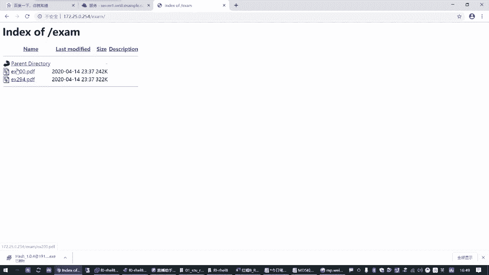

# 全网最全RHCE红帽认证全套入门教程 - P5：1.04-服务控制和安全开关 - 达内-程序猿 - BV1f64y1q7b5

服务控制和安全开关。那这一块的话是要讲的什么呢？两小块啊，这一块又分两小块，服务控制呢主要是一个工具。叫system controll。服务通制。呃，安全开关的话呢，主要是一个防火墙。

范尔沃啊你看范尔沃。Yeah。防火墙服务还有一个呢是叫做啊SElinux。嗯，因为中间可能后边还会涉及到一些策略。那今天我们给大家讲的话呢，主要学会的就是它的开怎么光啊，怎么开怎么光学会就可以了。呃。

那前面这个stem controltl服务控制。哎，我们了解一下。Yeah。来CSt controll服务控制。那这一块的话呢。systteem control那它的作用其实就是叫系统控制器。啊。

就叫系统控制器。它的作用主要用来。管理我们lininux操作系统。主要包括什么呢？包括我们linux操作系统的开机关机。都是由他来控制的。然后各种系统服务的资源的一个运行状态。也是由他来控制的对吧？

最核心的就是它啊。呃，那这个命令怎么用呢？来学习几个基本用法啊。直接执行。System control。这个可以列出。当前系统能够管理的这些资源。Yes。可以列出啊。就这个工具可以管理的系统资源。

其中包括各种系统服务。但这个直接执行呢用的不多啊。系统服务就是你一个计算机运行之后啊，要跑一个网站呀，或者跑一个什么游戏呀，是吧？他要提供一套资源。那针对这一套资源呢，我们要给它起个名字。😊。

这个一般就叫系统服务，是通过服务的方式去给客户去提供资源的嘛，是吧？那服务这个词啊在很多地方都有啊。那我们云计算其实也是在提供资源嘛，提供服务嘛。

那咱们这个运维工程师不也是在给客户给我们的呃公司提供服务嘛，对不对？那计算机也是这样的。他要搭网站，要提供一个网站啊，要跑一个游戏，要提供游戏啊，是吧？也是在提供服务资源啊。😊，呃。

然后具体控制符卧的一个状态啊是怎么控制的呢？是通过。system control。后边跟start跟上服务的名字。来启动一个服务。最最基本的操作方式啊，来启动一个服务。那如果要停止一个服务的话呢。

你把start换成stop。所这个树干我们表示或者的意思啊。start是开启，stop了是停止。那如果有时候你改变了这个服务的配置，你想重新启动一个re start。你如果想看这个服务的状态。

现在是在运行还是停止的那有个叫。Sts。好，看状态，这几个用的是非常多的。而且在红帽7和8的系统里边，你用CSctrl，它可以同时控制多个服务，只要在服务的名字后边打一个省略号就行了。好吧用空格。

分格写上服务的名字就行啊。我这里用省略号代替了。😊，举个例子。Okay。那在我们的这个环境里边，我们不是有个serv一嘛，是吧？啊，从下一次课开始，我们会给大家讲一些考点，一些题目。

那其实这个主机呢我们是跑了一个网站，你只要去访问这个网站就行。但是前提条件呢，你要把这个网站这个服务给启动起来。就是stem controllstar HTTPT。一旦你起了这个服务之后。

大家如果想看题目。练习题啊。从你的真肌。或者任何虚拟机啊，只要能连到你这个环境。后边敲1下点按5。0。254。喝完打一个examp。你就可以看到有两个文件，这两个文件呢就是我们后边。

后面的课程啊会讲到的2个PDF练习环境。

这有好多同学不是刚刚在群里问了是吧？😊，好，大家都迫不及待想看这个是吧？哎憋不住憋不住。呃，顺便在这里告诉大家了。但是如果你把这个网站停了啊。😊。

要停止这个服务，stop。你只要把这个服务一停止，你这边再刷新一下就防不了了。你看就会提示无法访问此网站啊，很简单吧，是吧？😊，所以这是用sem controll启动服停止服务。你要重启。

那就restar。😡，你想检查你这个服务有没有在运行呢？tus啊。😡。

就这个。那你可以用STATUS这是看服务的一个状态啊。

呃，重点看哪里呢？看activeitive。你看它会面提示的是inactive。它已经不活了是吧，不活动了，括号里面是带的死了。😡，你网这都挂了，你还怎么去看他资源是吧？不行，所以你要把它重新启动。😊。

当然他原来已经死了，你直接start就行。嗯，还有一些时候呢，我们就懒得去关注他到底是活的还是死的，直接ret也行，对吧？也行，但工作当中呢大家轻易别restar啊，因为它会把你的。一个服务先停掉。

再重新开。那你想这要是一个网游游戏服务器，你吧唧给他来一下瑞斯star那不行啊，是吧？那好多人真的打的真的杀的怪了，吧唧一下就掉线了啊，这个有用户体验不好啊，用户体验不好。所以大家要知道这个特点。😊。

啊，这是关于服务的状态一个控制。那另外一方面呢。这个相当于是直接控制我们的服务状态啊。控制这个服务的运行状态，当前的运行状态。那另外还有一个操作呢，也是用sctrl。但是呢它可以设置。

这些服务在开机的时候是否自动启动？这叫开机自启的状态。那我们管理一个服务器，它服务器上有很多服务啊，我不能指望着每一个服务，我每次服务器一重启，我还得管理员手动来做一次，那多麻烦。所以有很多服务呢。

我是希望它开机之后自动运行的。这个时候怎么办呢？做一个enable。这就是让这个服务开机之后自动运行。那如果有些服务比较浪费资源，我又用不到。😡，我不希望它开机自动运行怎么办呢？😡。

只要加一个diableable啊，diable。那A就是有能力的吧，一ab就是让他有能力的嘛。第一次A就是不让让他有能力。😡，就让这个服务上市这个能力啊叫disable。那因此。

如果我们希望我们这个环境网站这个服务每次开机之后自动运行，我们只需要做一个。enable的操作啊，其实咱们这个环境都已经帮大家设置好了。😊，那如果你不希望这个网站开机之后自动运行。

也打一个disable。这个时候你会看到它有一个提示，删除一个文件啊，这个文件删除之后，那这个网站你这个搜我一下次开机，你这个网站就看不了啊。除非你重新把它enable。对吧他又会把这个链接给加上。😊。

当然如果你已经加上了，你再来做inlaable，其实啥也不用做了啊，因为它已经是开机自体的了，你不用干啥了，是吧？😡，所以大家操作的时候呢，可能会看到有一些区别。那总结到这里，其实就这两条啊。

最常最常见的啊。就是控制你想要的某一个服务，立即开启，立即停止重启看状态。或者设置完一个服务，开机时候自动运行，或者禁止它自动运行。这个操作前面我们是不是用过呀，讲那个驾驶舱的时候。

是不是给大家讲了一个s control in lab啊，它用的就是这个工具啊。系统控制器这个工具，让我们驾驶舱这个资源开机的时候自动启动。当然这是一个特殊的资源啊，不是一个普通的服务。

所以它会我加了一个sockcket啊。那后面加一个杠杠道呢，这啥意思呢？这种用法相当于刚才我们讲的这个用法的一个二合一。因为你直接用上面这个操作，可以把服务马上启动。但是它不应并不影响开机是否自动启动。

然后你用enable可以让这个服务开机的时候自动启动，但并不决定你这个服务现在自动启动。是因此呢我们有时候把一个服务设置开机自动启动之后。90%以上的操作就是希望他现在也启动。

这个时候呢在后面加一个刚刚闹。但是这个是可选的。因为有些时候我们可能把一堆服务设置开机自启之后。我马上就把这个讯机重新开机了啊这个你没必要做说这是个可选的啊。对吧这个大家知道。

但是你加上杠刚到就会立即把这个服务也启动。啊，这是控制服务的一个启动状态，最基本的操作啊，就是上面这些啊。OK吧。😊，来拍一个。防火墙和slin。嗯，这两个东西呢呃防火墙后面我们还会讲到啊。

在下午那个考试讲安伯的时候，会讲防火墙策略的一个配置。嗯，那现在我们讲这个为啥呢？就是其实我们上午的考试。咱们从下周开始，不就正式讲那个上午的题嘛？上午的考试，他并没有要求我们配防后墙。

所以防火详情可以关闭。啊，你可以关闭，我不用。啊，可以的啊，那怎么关闭防火墙呢？😊，防火墙的作用这个不解释了吧，是吧？这就用来保护你的计算机的啊，不受外边的网络攻击啊什么什么的啊。😊，呃。

那防火墙状态的控制。骑士由什么决定呢？上面这个操作你会了之后，那这个很简单啊很简单。😊，因为防火墙它就是一个系统服务，叫fire卧地。你只需要把它禁止开机自动运行啊，fi word地。

而且呢立即禁止它开机自动运行，这就搞定了。啊，这就搞定了。但是如果你想启动它，那就是那就是那个enable呗，对不对？这是怎么向怎么去光防火墙啊？这个。那大家刚学lininux系统的时候。

你可以把这些给关闭。那比方说刚才我们这个真这个设备一这个机器。我们这个HTTBD是开着的是吧？😊，但是如果你把防火墙开着。fi卧地。那你从你的浏览器一样访问不了。啊，一样访问不了你这个试题啊。好。

看一下。fi卧地啊，都改过策略了是吧？就正常情况下呢，你这个应该是防不了啊。那你关了就可以啊，这防火墙如果你不配置的话，默认情况下你环境没有调过的话，它是阻止其他的任何访问。啊，阻止其他的任何房问。啊。

现在我们这个没没射出来是吧？啊，这个先不管了啊，就我们咱们这个黄金调过。所以如果大家刚学这个618啊，红帽8的话，建议大家把防火墙给关闭。😊，就是disable杠杠。啊，闹啊。O吧是吧。😊，好。

来再看另一个啊，另一个呢就是linux安全开关。这个同样啊。咱们下午的考试也会讲它具体的策略。但是现在我们如果用不到的话，你可以把它先关闭啊，你可以把它先关闭。那分2块吧哈，防火墙的作用。这是内核的。

一套网络保护机制啊。但是在用的时候呢，通过f word地服务。啊，这个系统服务来控制。那如何停止防火墙呢？就刚才我们讲的这个操速。那这两个安全开关我们发到一起啊。因为还有一个东西叫做是linux。

那slin的作用呢，它也是现在也是我们内核的一套保护机制。但是它的保护机制呢更更侧重于我们操作系统的保护机制。

这个是lininux最早的时候是时候呢是美国国防部啊推出来的那后来呢也引进到我们lininux系统里边来了。它是内核的一套系统保护机制，但是它不通过某个服务。他要通过什么呢？通过通过这个。

内核启动参数啊。所以操作会麻烦一点。通过内核启动参数来控制。或者。它的那个启动配置来控制。对吧用这个。呃，那如何去控制slin呢？是吧？如何关闭？来如何关闭？3linux啊。呃。

那这个地方比防火墙会稍微麻烦一点啊，你不能这么关。呃，那要关闭slinux机制，大家首先要理解它也有三种模式。或者有三种状态啊。其中呢。😡，不。默认的状态一般叫做infor。来。

刚才我们讲到s内一个机制，它有三种状态，默认情况下呢是也叫inforcing。😊，这叫强制。保护啊。很简单，就是强制保护。你想不让它保护的不行啊，举个例子，你后边要开一个网站啊。

如果你启用了slinux保护机制，你想开82端口。对不起，他不让你开。只要你slinux开着的，那么你这个服务就起不来。对吧你是管理员也不行啊，这叫强制保护。😡，他策略生效的时候，铁面无私啊。

管你是路材还是别的。那另外还一种状态呢叫宽松模式啊，叫permissive。这叫宽松模式。啥叫宽松模式啊？就是slinux知道你这个违规了。但是呢啊他说睁只眼闭只眼啊，你该开开吧。

但是我得给系统内核报告一下是吧？它会记录，但是它不会限制你啊，这叫宽松模式。那另外一个呢叫diabled。这个就好简好简单了，什么？就禁用。😊，那就完全不用神lininux啊，有这三种状态。

那如果我们要关闭它，怎么关闭呢？其实就是在这三种模式之间切换最简单的方式，那大家你要用VIM编辑器啊。去更改一下ETC下边有个配置文件叫slinux。底下有个文件叫confi。啊，要改一下这个文件。😊。

在这个文件里边呢。你可以找到它有一行配置叫slinux。等于。你只要把等于后边的那个值改成这三种模式中间的一种。那么重启这个系统之后，你的这个SElinux就是你想要的这种模式。对吧就这种状态。

那上午的考试呢，它默认应该是inforcing。啊，应该是invoice。那题目会有一道题目要求我们开82端口，那你是开不了的。那其实有一种选择，我们就可以把它改成pomissive。那就能开。

但是其实那道题目上没有要求我说我必须开着啊，再来做什么操作。😡，所以有时候它投机取消一些方法呢，就我可以把它关闭。对吧除非题目有明确说，那你必须开走。😊，然后还得让我这个网站能开啊，能启动起来。

那那再说嘛，是吧？😡，说这也是一种方法哈。那比方说我们到。red这台机器。我们可以看一下。🎼VI打开ETC下的slinuxconfi是吧？啊，就是这个文件啊，那这个文件呢我们打开之后呢。

你看它里面是不是就有一个slinin呀，是吧？这个在咱们练习环境，这个默认就是强制保护的。😊，那如果你不希望他强制保护。你就把后边这个呢等号后边这个删除。改成另外两两个值里边的任何一种都行。

记不住没关系，上面有提示。啊，直接复制粘贴。对吧。然后保存就好了啊。🎼。保存退出。当然啊这个配置文件需要重启之后才生效啊。如果你有更改的话，要重启主机之后才生效。那肯定有同学就问我不成绩。

我也想上生效怎么办，对不对？😊，那有一个操作就是立即让它不生效的exert enforce。0啊。这个可以立即让它不要强制保护。立即。变成。宽松模式啊。那其中呢你设成零，就是框松模式。

你也可以把它设成一。那这个就是强制模式啊。可以在这两种模式之间切换，但是它不能把这两种模式切换成diable。如果前两种模式你想变成后边这种模式，或者反过来你都应该重启。你想偷懒的话呢。

只能在这两种模式之间切换。如果你想看当前是什么模式呢？有个查看结果啊，有个get in force。这是查看结果。那这就是我们所说的呃，fire卧地防火墙的开关控制。核slinux的开关控制。

但具体的策略呢，咱们今天没法讲啊，我们计划的这个大纲里面也只讲这一小块。嗯，具体的策略的话呢，等我们后面用到的时候，再给大家讲那个策略怎么去做。😊。

OK吧，所以我们这个。咱们今天的内容啊，大概要讲的就这么多。因为今天呢一方面是给大家做一个缓冲啊，所以我们重点是讲了我们前面的这个考试考场练习环境，还有就是给大家补充的lininux命令基础啊。

不过大家你原来有没有基础是吧？那你要把这个给补上去。

你不熟的了给巩固是吧？熟悉的就复习嘛。啊，然后呢再就是服务控制和安全开关。那今天我们讲到的这些知识，在我们后边的课程里边经常都会用得到。那特别是对这些命令还不熟练的同学嗯，那大家课下的时候呢。

你一定要把这些资料好好去看一下。

那咱们今天就讲到这里了。

嗯，如果大家要网忙下载我们今天的那个就是我在记事本那边写的那个笔记。你可以直接访问现在屏幕上中间这个二维码。安维码中间那个4O7Y键是提取码。嗯，然后今天这个内容呢，我们也会补充到微信公众号上。

建议大家扫描一下我们右边这个二维码，你可以加关注一下这公众号。公众号里面有我们完整的红包八的备考的笔记资料。就后边我们的那个随堂笔记啊，有一份整理的比较完善的啊，也会慢慢的放上去。

Yes。