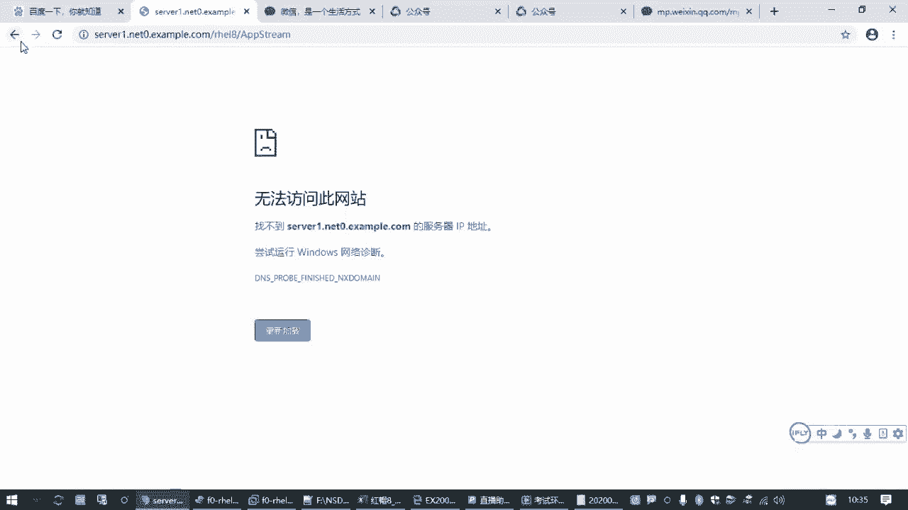
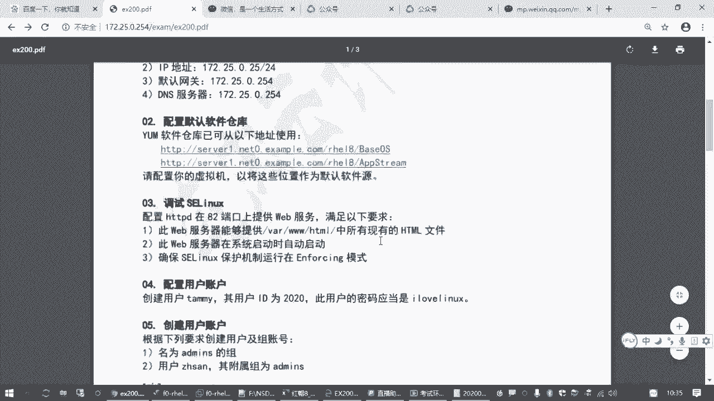
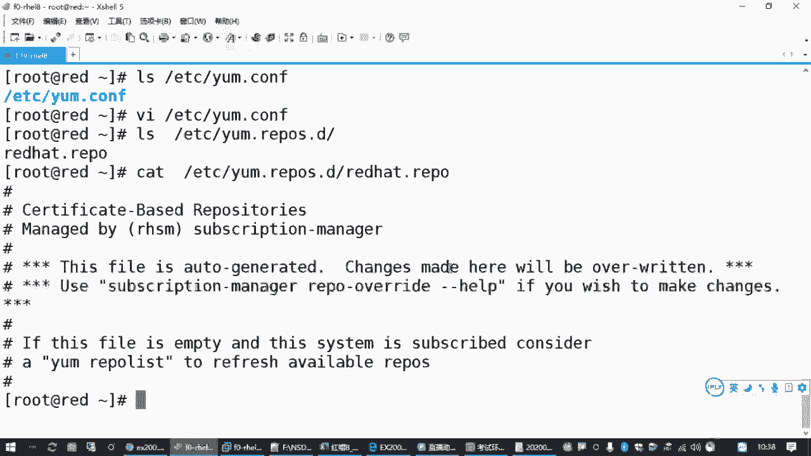
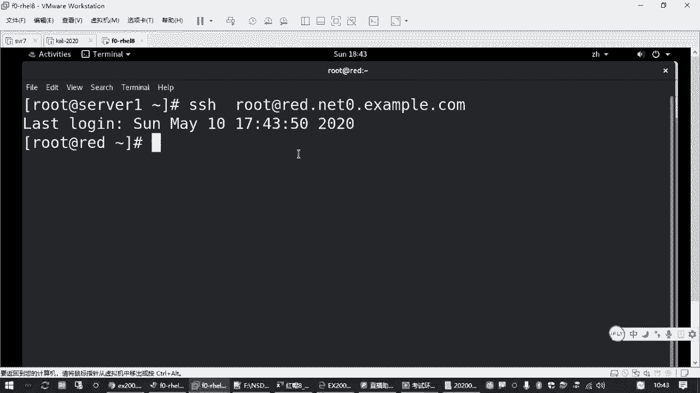
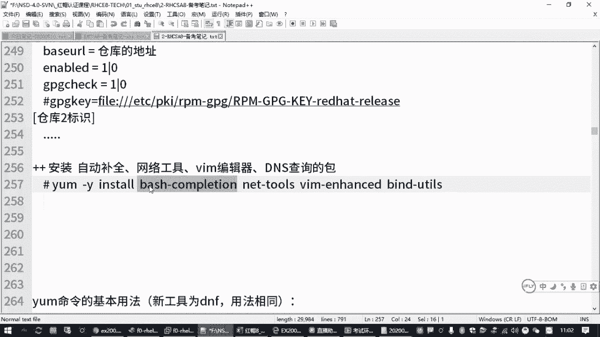

# 全网最全RHCE红帽认证全套入门教程 - P7：2.02-配置yum源 - 达内-程序猿 - BV1f64y1q7b5

来咱们回来接着开始哈，那刚才我们给大家讲过的是呃，第一道题目是吧，就是配置我们的网络地址，那考试的时候呢，你把第一个机器配好网络地址之后啊，然后第二个操作啊，一般就是建议大家呢要配好一个软件源呃。

考试考试的时候呢，它会有一道这样的一个题目啊，会有一道这样的题目嗯，因为上午我们两个虚拟机，他第一个虚拟机可能会专门有一道题目让你去配，但是下午的时候呢，他可能不一定有这个题目啊，但不管他有没有，反。

反正这个事你得做啊，你不做的话呢，你没法做软件包啊对吧，那题目的要求呢就是说你这台虚拟机如果想装软件的话，你需要去找到下面这两个地址，然后要做什么呢，要配置你的虚拟机。

把这两个位置作为你这台虚拟机安装软件的一个来源，是不是叫软件源啊，那对于红包的系统来说呢，你要装软件包，它需要提供一个软件仓库，这个软件仓库对于客户来说，那就是给他提供软件的一个地方嘛是吧。

所以有时候我们在配置的时候也把它叫软件园，那如果我们在设置一台linux主机啊，我们有时候说软件源，软件仓库其实指的是一个东西，除非你是在提供这个称呼对吧，否则的话呢我们指的是一个东西啊。

嗯然后在另一个系统里边呢，后边装软件包的时候用到了一个命令叫y u m，其实在红毛八的系统里面啊，它是更新了一个版本啊，就不叫ym的，叫d n f啊，这个大家了解一下啊。

但是呢嗯大家仍然可以用y u m，因为它和我们那个y u m是兼容的，这后面大家直接用dnf去装软件包也是可以的啊，然后你用那个y u m也是可以的，但是不管你用y u m还是用那个dnf啊。

它首先你需要去给他指定你的软件包在哪里对吧嗯，那原来的这个y u m是啥意思啊，什么yellow dog update modified哈，叫黄色的yellow dog叫黄狗啊，update升级啊。

modified就是修改版的啊，是这么来的嗯，这个呢从红帽我五开始是吧啊一直到567不都在用这个吗，所以相信大多数同学都是已经习惯用这个的，所以咱们后面的资料呢呀也都是啊，也都是在那个呃用的这个vm。

但大家后面用的时候可以改成dnf啊，这个以后大家可以练习一下，嗯，然后刚才大家有问了这个笔记啊，啊正好有时候我们随随堂讲的时候，有时候会更新一些东西嘛，所以更新的任务呢我们会给大家放到我们的那个。

就上次给大家发的不是有一个微信公众号嘛是吧，所以各位在这里边直接更新啊，那大家看的时候呢，你只要关注那个微信号就行了，我好像是那个公告里面有一个地址对吧，大家只要关注那个微信公众号云网小课堂啊。

然后右下角笔记获取就能看到咱们这个班的笔记资料啊，能看到咱们这个班的笔记资料，那个资料的话呢，这样方便大家去找啊，要不然每天每天都讲了，然后资料在不同的地方呃，放起来的话，那也麻烦，我给大家看一下啊。

就是通过那个微信公众号呢，这是这是我编辑的页面啊，就是大家通过微信公众号里面看的时候呢，应该是有一个这样的一个页面的，这里的资料比较全啊，包括我们那个csa的备考笔记，什么都在这里。

包括上次我们那个考试说明啊啊包括前面配网络地址，配arm的一个快速演示啊，都能够找到啊，所以这是一个资料的一个获取，好咱们再回到我们刚才这个样本仓库这里了啊，嗯那如果我们要装软件包的话呢。

需要有一个仓库是吧，那对应的这个样本仓库题目其实很简单，就是给你两个网址啊。

但是呢我们需要去把它给配置好啊，需要去把它给配置好。

那配置的时候我们需要了解什么信息呢，就是在linux系统里边啊，红帽678都这样了是吧，它对应的一个核心的一个工具啊，暂时咱们就当样本来做啊，那样么他要装软件包，正常的安装软件包的方式啊。

就是install这个y ym一般我们读作样啊，那样in store就表示安装后面跟上软件包的名字，比方说我们提了好多次，我们要做一个什么net tools网络工具包是吧，装了这个包之后。

你才有那个什么if config啊，没装的话，那没有的，但是呢你在装的时候，你你得有缘啊，如果如果没有一个软件源给你这个包，你是装不上啊对吧，那就不行，他会告诉你。

there are no enabled rap，就没有一个启用的能够给我们提供软件包的一个地方，那如果你希望有的话，怎么办呢，那题目告诉我了是吧，有这两个网址。

那现在的问题就是我这个机器我怎么知道是去找这两个网址，需要软件包，所以大家要了解这个命令它的配置文件怎么去设置啊，那对于ym来说呢，它的配置文件主要在两个地方，一个就是etc下的样点c o m f啊。

这个文件这个文件最核心的一个作用是控制y u m这个命令，它的全局的一些行为的啊，那大家用我们之前讲过的那个vi编辑器，你可以去打开是吧，打开看里面你看就几行，比方说他默认他要求做那个软件签名检查。

看一下这个软件包是不是这个操作系统官方发布的，对不对，或者一个软件作者官方发布的，如果不是，他是拒绝安装的啊，这是默认的一些设置都在这里啊，那其他的咱先不管了啊，那除了这个文件以外。

还有一些文件在哪里呢，是在我们的etc下面有个样点rebels，点d在这个目录下，那这个目录下面呢其实是有一堆文件，就允许我们管理员创建一堆文件，它的扩展名是点rap。

那这样的文件呢就叫做我们管理员自己定义的，你的软件仓库就软件来源在哪里，你要通过这些文件去设置，嗯，其实咱们这个环境里面，你你可以发现它已经有一个叫red hat。rap是吧。

但是这个文件呢基本上是连红帽官网的啊，你可以用vi去打开这个文件去看一下，或者你用cat先直接阅读一下也可以，你会发现这个文件的里面呢全都是井号开头的是吧。

那这个大家要注意啊，在linux命令行环境，包括它的配置文件里面，如果是井号开始的部分，99。99%以上的可能性啊，它的含义是说明这是一个注释，注释就是写了一段话告诉我。

我都告诉我们管理员这是干嘛的是吧，他不会真正发挥作用的啊。

啊这个要知道，所以其实这个文件呢你会发现那好像都没用，没有一个有效配置啊，那这个井号就好像我们执行一个什么l s命令，你可以直接l s命令是管用的，你前面要是加个井号，那就不管用了对吧。

所以是把后边的命令不起作用啊，这叫注释注释的一个标记啊，那因此呢刚才我们所说的压我这个配置，这个圆的配置其实啥都没有啊，对不对，他有个文件，但是里面不起作用啊，所以我们得自己创建一个圆的一个配置啊。

那大家考试的时候呢，你可以直接改这个文件，或者呢我们另外创建一个文件也是可以的啊，啊就是答题的时候你怎么办呢，要找到这个目录，在下面创建一个文件，这个文件名称随便起，但是扩展名必须是i e p o啊。

注意啊，扩展名的是这种啊，要不然他找不着啊，你可以写一个e l l8 ，这叫企业版00x8 是吧，扩展名叫i e p o好用vm编辑器打开，或者说叫创建这样一个文件回车啊，大家要是不熟悉vi的话。

应该在我再给你回顾一下啊，最近执行这个命令，可以打开一个新文件，然后默认叫命令模式，要按一下i键进来进入编辑状态，然后在编辑状态里边去指定啊，按照题目要求你要找哪一个圆对吧啊，当然在这个仓库配置里面。

他有些基本要求啊，这个大家要知道基本要求的格式是这个样子的啊，啊需要用一对方括号括起来，里边要给它起个名字，这叫仓库的标志，还有一个叫i d啊，仓库的i d叫标志，你如果有多个仓库呢。

要有多组方括号对吧，你可以仓库一仓库，1号库，2号库嘛是吧，你可以有很多个仓库指向不同的地址，你谁谁也不能说我这个主机我只能从一个地方做软件包啊，啊我可以从好几个地方做软件包呀是吧，所以要有个仓库标志。

在仓库标志里边呢啊我们下面有常见的设置是这些啊，有一个叫name，等于是用来描述一下这个仓库用来干嘛的，一般就是写一段话啊，那一会儿我们用的时候呢，你可以来查询一眼就知道诶，这个插图是用来干嘛的是吧。

那标志这一块的话呢，一般不建议大家用空格什么的啊，但是描述这里边可以对吧，嗯仓库这个标志呢也不要用特殊符号，不要有空格，就很简短的啊，那仓库描述呢是一个详细的说明啊，是一个详细的说明。

然后最核心的是这个base url，这叫基本的访问地址，你要指出仓库的那个圆啊，它的软件包来源在哪个地址能能找到，那这个其实就是我们考试的时候要求的这个地址嘛，对不对，那有两个仓库地址，你要配两份仓库。

要有仓库一仓库啊，嗯然后你这个仓库现在是建好放在那做样子的呢，还是要启用呢，有个配置叫enabled，这叫启用啊，enabled等于一就是启用，如果你设置于等于零，那就暂时暂时先不用啊。

我去做实验的是吧，我暂时先不用，那这个叫enab，呃然后还有一个叫gpg check啊，这个就是用来做软件签名检查的，软件签名检查啥意思呢，就是检查你这个圆里边啊，你这个仓库里面给我的包。

我要验证他是这个仓库官方发布的，如果不是官方发布的，我不敢装啊，那万一里面有病毒咋办是吧，所以有这样一种机制啊，啊所以大多数情况下提供软件的那个官方，它会给我们一个密钥啊，你把钥匙。

你通过这把钥匙呢可以去验证这个软件包是不是官方发布的对吧，像红包官方也会有啊，但是如果因为做软件包签名检查啊，这会会耽误时间，如果你确认你不需要这个检查，你可以设置gbt下载等于零，这个速度就快对吧。

咱们上午的考试呢没有要求做这个签名检查。

所以大家你就怎么简单怎么来啊，特别是我们刚开始考试进这个虚拟机的时候，那那个操作还用微软语说大家用的不太方便对吧。

所以简单怎么简单怎么来啊，考试没有要求，但是如果你要用g p t k等于一，那下面必须跟一个g p g k指定那个钥匙啊，等于什么什么从哪个地址能找到，当然我们这里写了一个井号，去掉了啊。

加个井号就是注释，就是给大家给大家展示这个用法啊，那如果你用gp check等于零，那这一行是不用的啊，所以按照我们这个题目要求，我们看一下怎么答题啊，题目要求就是给了我们两个网址是吧啊。

那一段我们在考试的时候，你已经连到这个机器了吗，那不就vi打开这个文件，往里面写方括号，指定仓库的名字，还有那个标记，这个标记题目如果没有要求你随便写对吧，一般我们就参考他那个名字写一个base os。

你如果愿意，你写一个a a a也行，对不对，但这个有点随意啊，但是大家我们可以直接用，建议大家用的比较比较规范一点啊，一般用那个软件资源那个目录的名字，然后下面给它起一个类目描述，如果你不讲究的话。

也用这个名字也可以是吧，然后你被10u l这个必须有吧，而bcl从哪来呢，考试的时候建议大家复制啊，复制链接地址，你考试的时候在那个红包图标打开之后也是可以复制的啊，因为你是远程过去的嘛是吧。

你如果是通过这个控制图标进的虚拟机显示界面里边啊，你可能不方便复制，但是你远程ssh过去是可以的对吧，来粘贴，这是第一个地址啊，然后那个enabled这个大家如果想偷懒的话呢，你就不用写了。

默认enell，你不写就是启用，是因为大家有时候有些同学，这个你要是背着莫属不写的时候就容易写错啊，never后面有没有d是吧，那不知道不知道咱就不写了，敲的越多越容易出错啊。

然后呢gp check gpg check啊，这个你得写，你如果不想当检查呢，你要写个零啊，写个零为啥要写零啊，为啥要显灵，然后我保存退出一下，因为它的全局配置文件里边jpg check是一啊。

如果你那个那个地方你也不想写，请大家把这个文件这个地方改成你那也行，那有这功夫咱就已经写完了是吧，所以大家一般改这个文件的时候呢，你就加一条gp check等于零，这样的话这是第一个仓库的一个配置。

那第一个仓库配置做完之后呢，你可以那就可以复制了嘛，对不对，复制四行，如果大家你vm用的图的话呢，我们直接四dd把光标移到第一行，4d不是四不四弟弟，四弟弟是删除四yy就复制四行是吧，你再粘贴也可以啊。

那你远程的话，你可以鼠标复制上更更方便是吧，不管你未来数不数，那复制一段去创建第二个仓库，来写一个a p p j，换个名字，对吧啊，注意啊，你如果有多个仓库，这个仓库的名字不能一样啊，必须区分开。

不能重复啊，然后第二个地址再复制粘贴呗是吧，其实你仔细看一下，就是后面这个名字不一样，你要是怕写错啊，怕写错就复制粘贴啊，这就是地址对吧，那就配完了，配完了，然后按escape键回到命令模式。

然后冒号到墨盒模式，输一个w q保存退出，那你配的这个圆好不好用呢啊咱们要检查一下，你可以执行young rap list，这是列出可用的仓库对吧，那这个是只是检查你仓库能不能看到。

然后能不能找到里面有多少个数据包啊，嗯有多少个那个软件包啊，所以这里是检查他一个状态，如果你发现执行的时候中间报错了，那没别的原因，就是你那个仓库配置文件写错了是吧，错在哪，那就有各种错误了啊。

可能你这些少个方括号啊，或者这个地址写错了，连不上啊对吧，就可能出各种错误，但是如果你的是正常的话啊，大家执行这个操作的时候，你要看到这样一个结果，你能够看到有这两个仓库，这下面就是一个仓库列表嘛对吧。

就一个仓库列表，那那就建完之后，你要看到这个列表下面有两行，这就是那个仓库的i d，这就是这一类啊，就这个内蒙那个描述，就是刚才我们给大家讲过的类目，就是描述啊，前面这个方括号里边就是i d的标志。

所以大家检查的时候呢，哎这个地方就是i d啊，第一列右边这中间这个呢就是描述是不是就是你设置好的是吧，那右边这个状态呢是它连接到那个圆之后，它能够查到的软件包的数量，能够看到这个基本上就没问题了。

那装软件包怎么装啊，正好咱们刚刚不是吹好的包吗，那建议大家顺便就测试一下，好样install啊，高y呢是自动确认啊，自动回答yes啊ym guy install就是安装软件包的一个基本方法。

然后边跟上你要装的软件包的名字，比方说咱们渴望已久的命令行的自动补齐是吧，那个叫bushcation啊，这个啊这自动补齐的包，然后还有我们缺少那个什么衣服跟vega呀，root那些兵令对吧。

有个叫net tools啊，还有做那个dns是域名查询的厚实的那些命令对吧，那这个呢用的是什么，有一个叫半个杠ut，对不对，那其他的比方说包括了个vm，有些同学可能用vm用习惯了，你可以装一个vm啊。

in h你直接写vm也行啊，你可以把这些包装一下，然后你观察他的一个过程啊，如果这个过程没问题，那这个包就就已经装上了，同时也说明你的这个软件源设置设置是正确的对吧，一举多得啊。

一举多得又验证了你这个装包好不好用，又验证你这个圆好不好用是吧，顺便把我们缺少的包给装上对吧，那装完之后呢，大家就盼盼望已久的那个tab键补齐，我们是不是可以去tb一下试一下啊。

enable sin control啊，你发现不好用不好用啊，你看enable补不出来，那为啥呢，因为你刚刚安装的这个bush completion啊，它还没有生效，如果你希望它生效的话。

请退出去重新连一下，重新连一下，你再来敲city control是吧，再敲一and a table好用了吧，哎这是解决我们这个环境的问题啊，考试的时候，如果你缺包一样，缺啥补啥就行，前提条件原要设好。

那包括刚刚我们前面讲过的n m c l i，你看c o n table是吧，s h table全都出来了，那如果你要去修改连接的配置，然后你可以ctrl modify，然后e and table。

你看连接都能table出来，i p v4 method table是吧，i mu，然后ipv 4点hs是不是都可以table啊啊这还是蛮好的啊蛮好的，嗯然后有同学问的那个等后面加不加空格是吧。

等号前面后面不加空格都行啊，都行啊，就刚才我们说的这个亚美元的一个设置啊，ok吧，就刚才我们说的有几个包是吧，一般建议大家安装的，我好像上次讲过啊哈哈，半血杠completion啊。

还有什么net杠tools vm enhanced是吧，还有什么band的杠，一小时就在这个包围，那这几个包的一个作用啊，我给你写一条，一会加到笔记里边啊，呃分别从左往右是自动补全的，就是安装。

自动补全的包是吧，然后还有一个是网络工具包，还有一个是vim编辑器，再一个是那个dns查询的，嗯考试的时候好像vm好像没装呃，自动补齐，我忘了啊，这这这个无所谓啊，你反正到时候你用呗。

