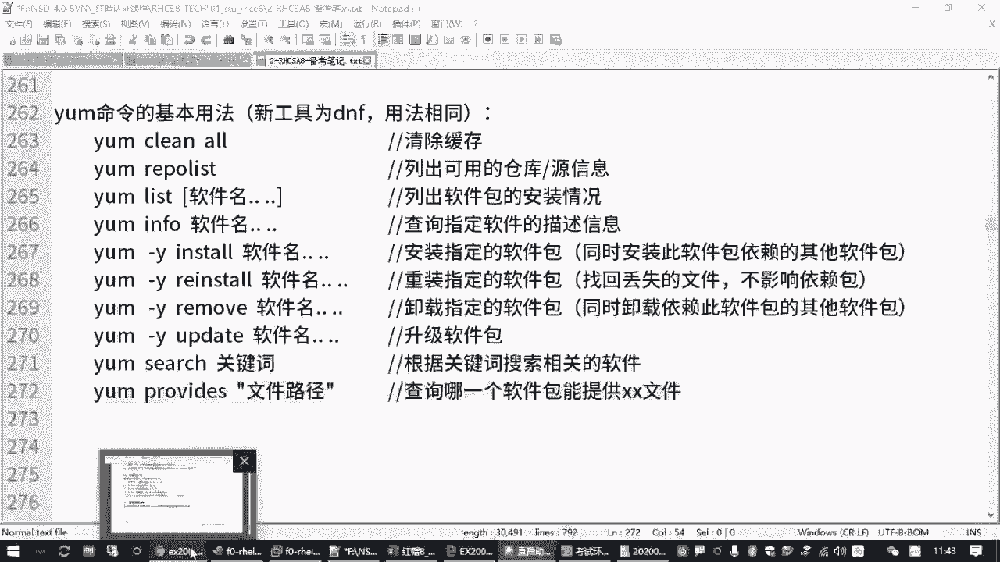
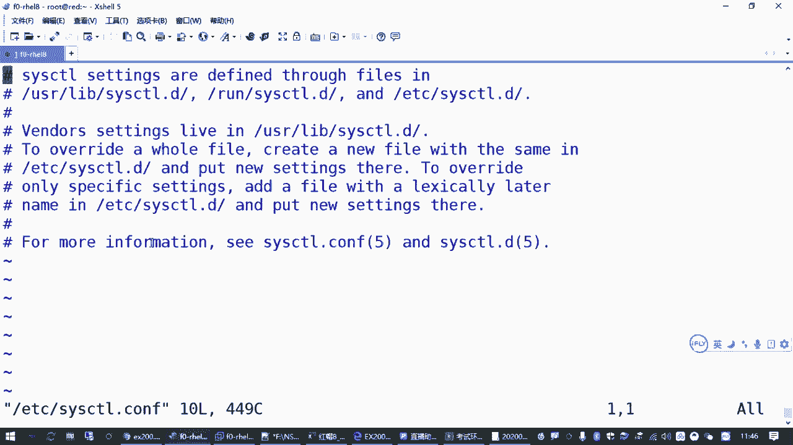
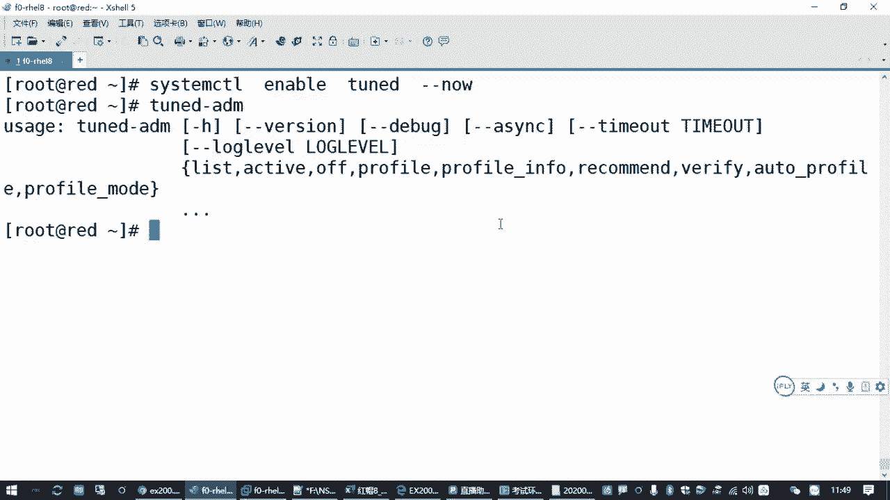

# 全网最全RHCE红帽认证全套入门教程 - P9：2.04-tuned系统调优 - 达内-程序猿 - BV1f64y1q7b5

那接下来我们再讲一个知识点啊，这个知识点的话呢。

在上午的考试主要是针对我们的那个另外一台虚拟机啊。

叫blue，那另外在训机里面有一个考点啊。

嗯看起来好像特别复杂，就是一个叫配置系统调优，就是你不做题的时候，你觉得这个卡呀好好麻烦呀是吧，你说要把一个linux主机呃，把它要调整的更加优秀是吧，更加优化运行更快啊，应该怎么弄啊是吧。

这个在我们红帽架构师的课程里面，原来是有一门课啊，专门叫系统调优的，那我们这个rh cs a怎么也考这个是吧，其实你别害怕，他考的就是让我们学会去使用红帽给我们准备好的调优的方案，就这个意思。

所以这个题目呢嗯非常容易啊，非常非常容易，那我们以后做的时候呢，因为咱们那个blue还没有讲那个破密码什么的是吧，咱先别管啊，就大家练习的时候，咱们现在乐子里边在这个乱的那个虚拟机里面先做一下，之后。

大家模拟答题的时候，你再放到那个blue里面再去做一下就行了啊。

嗯那关于系统调优这一块是什么意思呢。

我们所说的系统调优它有个英文单词啊，就叫做。

t u n e是吧，叫tm啊，那这个东西的话呢，呃它会有一个服务，有个系统服务叫tu n d，那在红帽七红方八的系统里面都有这个，其实原来红毛七也有，只不过红帽没有跟我们说是吧。

嗯然后我们也平时也很少用啊，那红毛七也好啊，八也好啊，他这个调优服务啊有什么好处啊，他给我们提供了大量预设的调优方案。

就是说你这个红帽的这个机器啊，这个主机你在不同的应用环境应该怎么去优化，红帽公司，它已经帮我们设好了一些不同的方案，那这些不同的方案的话呢，你只要去选择一下就好了啊。

当然一般情况下我们通常说诶linux要调优，调的是哪，一般我们以前肯定有同学也接触过是吧，你去百度去找很多资料，一般情况下都是要你去找那个嗯，用vm vm编辑器去改了个什么。

改了个什么p r o c下面的关于系统内核的一堆参数，对不对啊，具体路径好多啊，比如说打开路由功能啊，什么调整，那个tcb延迟啊什么啊，各种设置太多了啊，当然因为我们p r o c上次我们也讲过是吧。

这是内存里面的运行数据，它的一个映射，所以你改这个目录下的东西呢，那其实马上就能生效，所以呢达到优化我们linux操作系统，它的运行过程和它的性性能的一个这样一个目标啊，但是这么改的话都是临时的。

你要改很麻烦，所以有一种方案就是你得让这台另一个主机，每次一开机就把我们这些参数呢给设好啊，因为你这个linux主机你用来做负载均衡啊，或者你只是一个虚拟机，或者你是一个数据库服务器是吧啊。

网络流量要求比较高，或者你磁盘读写要求比较高，那有很多参数都需要去调的，对不对啊，那调整的时候呢啊还有很多时候我们就不是改这个了，我们改的是什么，改的是那个e d c下面那个什么c4 ctrl。

c o n f是吧，叫系统控制啊，原来是改这个以前老了系统一般就是我们手动改这个，改完之后呢，一重启就管用啊，然后这红毛八的系统里面的这个文件你打开看一下，它其实都给你注释的好啊。

他把很多的那种优化参数放哪去了，你看往往这些目录下面放了是吧，有好多东西，而且大家一般不建议改这个对吧，那为啥呢，就是他给我们提供了现成的优化方案啊。

优化方案，那如果我们要用这个优化方案需要怎么办呢。

我们需要去装一个包啊，这包呢就叫t u n e d，你只要把这个包装上就好了，而且我告告诉你们。

这个包红包的系统默认就是装好的，所以你考试的时候，这个包基本你都不用装，都是现成的啊，你看咱们这个练习环境，咱们练习环境给大家为了节省那个虚拟机资源啊，采用的是最小安装。

最小安装他都是装的那个包子啊对吧，这个装包都没管，那装好这个包之后，如果我们要用怎么用呢。

首先你要确保它的它的这个系统服务是开启的，所以你要enable to tune是吧，然后刚刚闹这个默认也是装好的啊，也是设好的啊，默认也是启动的，所以你说这个题，你看这两步都不用我们做了啊，包也装了。

服务也起了，那我们要干嘛，那要求就是要按照题目说的，要为你的虚拟机系统选择建议的那个调优配置极，这个配置集是它的英文名字翻译过来的啊，嗯咱们理解的话，你就可以认为是优化方案。

优化方案就是这个软件帮你装完之后呢。

它有很多现成的优化方案，我们只要去选择一下就行了，怎么选呢，最核心的一个管理工具叫td杠a d a m，这个你装了这个补齐这个功能之后。

你就可以补出来了，t u n e d杠and me对吧，就这个命令，所以大家只要熟悉一下这个命令怎么用就好了啊，答题的操作就一两步啊，但是我们还是要给大家把这个工具讲一下对吧。

呃这个工具如果你忘记怎么用了，没关系，直接运行啊，直接敲这个命令一回车。

他就会告诉你怎么用，因为你用的不对嘛。

他就告诉你正确用法，那t u n e d杠and me或者杠去看帮助这个看版本是吧，这些都不用管啊，那比较常见的指令在哪里呢。

在这一块这个花花括起来的这个指令里边。

我们要选择某一种对吧，就这些指令，那有哪几个是我们需要关心的呢，呃历史的是列出红帽这个包给我们提供了哪几套优化的方案啊，叫list列表吗。

啊然后呢i x t5 是查看你当前正在用的是哪一套方案活动的是吧，嗯然后呢还有一个就是recommand啊，这个大家要知道哎，recommand就是英文大师翻译过来是推荐的意思。

那为啥要做到这个，因为题目要求的为您的系统选择建议的优化方案对吧，谁建议的红包建议的啊，那这个建议的就是推荐的嘛。

所以怎么看tnt杠ame recommend，他就可以，你就可以知道红帽自动找出来的，适合你当前这个系统环境等优化方案是什么啊，所以这个要会，那如果推荐的不是我现在用的，我要改怎么改啊。

profile这个翻译过来就是这个叫配置级啊。

配置极唉，我们中文一般我们就叫叫叫那个优化方案对吧。

那只要t u n e d杠ame profile，在选上那个方案的名称就完事了啊，那刚才我们讲过list active profile，recommend，就这几个会了就可以了，其他的不常用。

比方说这个wifi，wifi呢是去验证他推荐的方案和你现在实际设置的效果有哪些差别啊，啊这个无所谓，因为主机情况不一样，他推荐的这个方案呢可能在你当前这个环境，那有时候呢cpu的细节可能不支持啊是吧。

那你就可以忽略，所以我们用到的就是刚才我们讲的这四个啊。

对吧，列出可用的查看推荐的，然后切换为指定的方案，然后查看那些活动的，你要关闭调音方案，可以off他这个其实也也不常用。

要么你开着就开着，开着就不用管是吧，关了干嘛，除非你那个系统出问题了是吧，那出问题直接把这个优化那个t u n d这个服务停了就行了，没对吧，所以其实刚才我们这个笔记里面最后这一条其实都是多余的啊。

写写着就留着吧，来来我们看一下具体用法啊，展示一下效果，t u n d t u n e d杠and me。

后面跟一个list回车，你看黄毛这个tnd这个包给我们推荐的可用的方案啊，1234567899种是吧，这个大家就具体看说明了啊，就比方说这个平衡模式就在正常的真实机里边啊，好像默认是这个平衡模式啊。

还有什么桌面环境低延迟的模式，什么网络延迟的模式啊，网络通透是穿透那个模式是吧，呃节省电的模式好等等等等啊，还有虚拟机的客户机，虚拟机的服务器好多吧，那后面就解释，然后他具体的方案的话呢。

其实好多文件啊，好多文件存在那个，那咱咱们都不用记存在，那他们用的目录在etc下的t e n d t e n e d，还有什么user lab，这下面有优化方案。

这就是大家如果有同学想了解它的细节的话啊。

大家你课下再去看这些目录下的不同的子目录，你看这些的是吧，比方说我们找了个什么net work 4 salute是吧，这些目录下就有一个文件，那在这个文件里面就是各种，各种优化配置可以。

这个大家不用记啊，就是你你了解一下就行，听一遍就行啊，就是一个配置文件啊，每一种方案下面都有一个这个文件是通过刚刚那个操作呢去切换的啊。

你看它下面有一堆设置啊，比方说你看网络这个地方它就加了几个什么设置tcp ip参数的啊。

那个什么读写缓存的啊，那些数值对吧，那这个单你要了解这个就肯定记不住了。

你得去找资料，对不对，这是增长，就说明是吧。

增长内核的什么缓冲区大小呀啊等等等等，所以这个是做课下课外啊，大家有兴趣再去了解，但是我们现在要做的话，这是了解他有哪些方案，那要想看他的推荐的方案怎么办呢，啊recommend还能tab键。

你看你tab键那个包装的就是好啊，他告诉你，你现在这个系统呢适合作为一个虚拟机的客户端，叫bal，对吧啊，那然后你要把你的系统改成虚拟机的客户端，这个方案怎么说呢，后边跟一个profile。

然后再加上virtual guest都能table，你看这就是选择，其实我告诉你考试的时候，这个默认就是选择这个说这道题你都不大，不用打了，知道吗，你不用做，好像就是这个啊，但是这个方法大家得会啊。

你得会去操作啊，会去操作，那你怎么知道你现在用的是哪一个呢啊有个叫active啊对吧，你看当前使用的活动的方案是叫virtual guest就完了啊，确保t u n d服务开启，开机之后自动运行。

确保当前的方案是wal guest就ok了嘛，大大你考试的时候你要去验证啊，你要去recommend看一下这个方案是否和你看到的是一样的。

如果不一样，那大家要做一下这个操作，如果一样，啥也不用干，ok吧好这是系统调优这道题目啊。

这个题目可能是上午最容易的一个题目了，有50%的可能性，考试的时候啥也不用做没有。

