# 红帽认证零基础入门教程：P11：2.05-SELinux调试 🛠️

在本节课中，我们将学习如何调试SELinux，以解决因SELinux安全策略导致的服务（如Web服务器）无法启动的问题。我们将从检查Yum源配置开始，逐步深入到SELinux的基本概念、排错方法以及Web服务器的相关配置。

## Yum源配置检查与排错 🔍

上一节我们介绍了Yum源的配置方法。本节中，我们来看看如何检查Yum源是否配置正确，以及遇到问题时的排错方法。

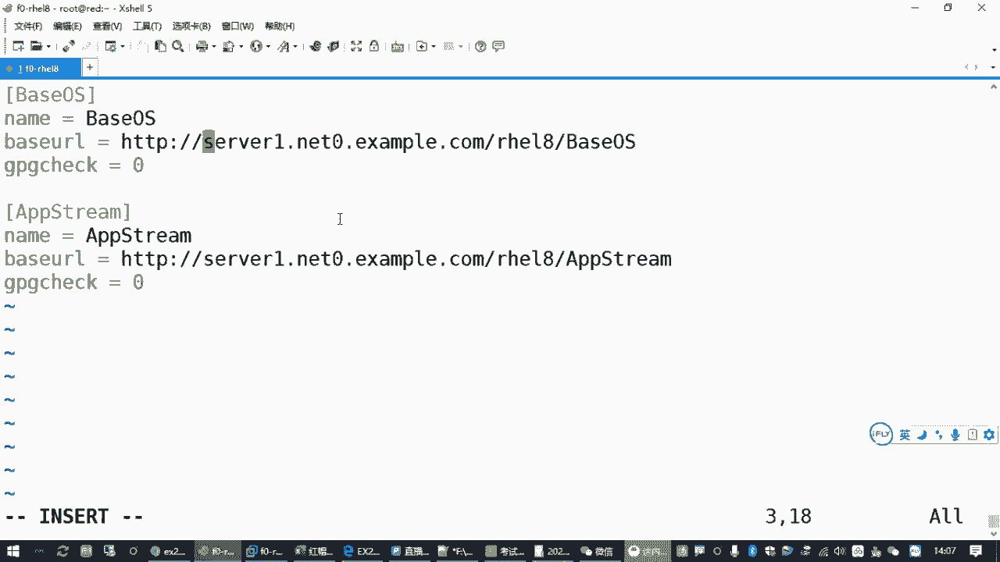

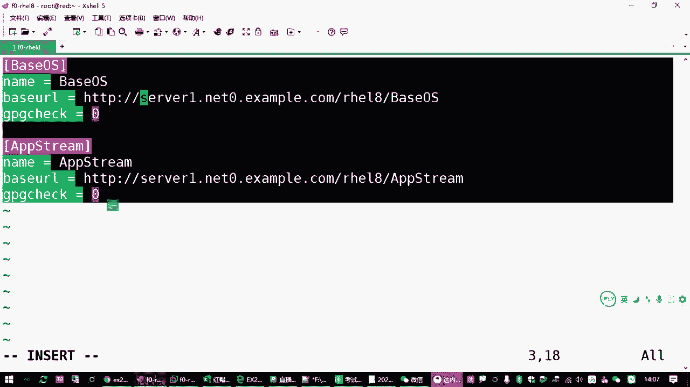

执行 `yum repolist` 命令可以检查Yum源的状态。如果命令执行成功并列出仓库信息，说明配置没有问题。如果配置有错误，该命令会报错，例如提示“无法同步缓存”或找不到源。

以下是Yum源无法访问的三种常见原因：

1.  **服务器端问题**：提供的Yum源服务器地址不可用（例如服务器未开启）。在考试或标准练习环境中，这种情况较少见。
2.  **客户端网络配置问题**：本地主机的IP地址、子网掩码、默认网关或DNS服务器配置不正确，导致无法解析域名或访问网络。
    *   检查IP地址：`ip address show`
    *   检查路由/网关：`ip route show` 或 `nmcli`
    *   检查DNS配置：`cat /etc/resolv.conf`
3.  **客户端配置文件错误**：`/etc/yum.repos.d/` 目录下的 `.repo` 文件内容有误，例如URL写错、括号内有空格等格式问题。

如果发现Yum源配置错误且难以排查，最直接的方法是删除现有配置文件并重新创建。

以下是重置Yum源配置的步骤：

1.  删除所有仓库配置文件：`rm -f /etc/yum.repos.d/*.repo`
2.  重新创建正确的 `.repo` 配置文件。
3.  执行 `yum clean all` 清理缓存。
4.  再次执行 `yum repolist` 检查。

## SELinux 调试基础 🛡️

现在，我们进入本节课的核心内容——SELinux调试。RHCSA考试中有一道题目要求调试SELinux，以确保Web服务能在非标准端口运行。

### SELinux 简介

SELinux（Security-Enhanced Linux）是一套由美国国家安全局（NSA）贡献的、基于内核的安全增强机制。它为Linux系统中的进程和文件提供了强制访问控制（MAC）。简单来说，它有一套预设的规则，规定了什么进程能访问什么资源（如文件、端口）。

SELinux有三种运行模式：
*   **enforcing**：强制模式。违反策略的行为将被阻止并记录。
*   **permissive**：宽容模式。仅记录违反策略的行为，但不阻止。
*   **disabled**：关闭模式。

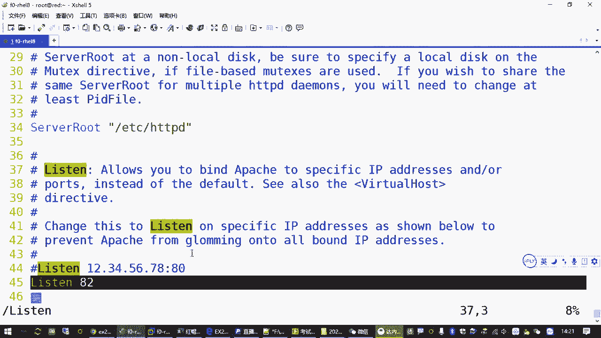

查看当前模式：`getenforce`
临时切换模式（重启后失效）：`setenforce 0`（宽容模式）或 `setenforce 1`（强制模式）
永久修改模式：编辑 `/etc/selinux/config` 文件，设置 `SELINUX=enforcing`（或其他模式）。

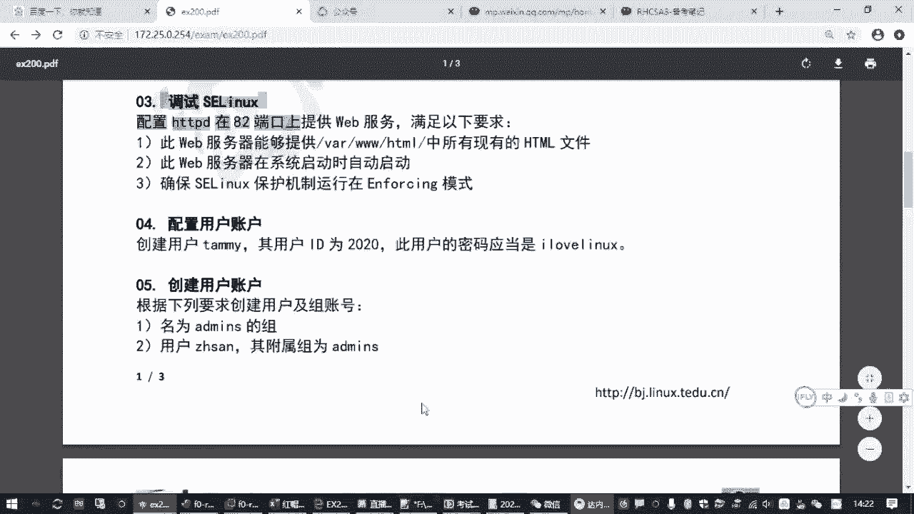

### 问题场景与排错思路

考试题目通常要求：让已安装的 `httpd`（Apache Web服务器）在 **82端口** 提供服务，并且保持SELinux为 **enforcing** 模式。

默认情况下，SELinux策略只允许 `httpd` 绑定像80、443、8080这样的常见端口。直接启动监听82端口的 `httpd` 服务会失败。

排错的核心思路是：修改SELinux策略，允许 `httpd` 服务使用82端口。

## SELinux 排错实战 🚀

上一节我们了解了问题背景，本节中我们来看看具体的排错步骤。

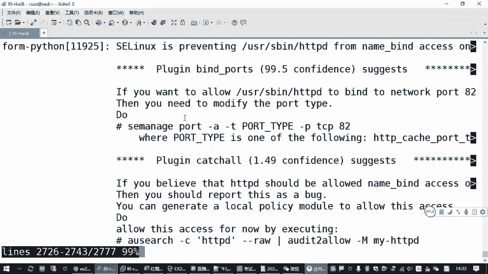

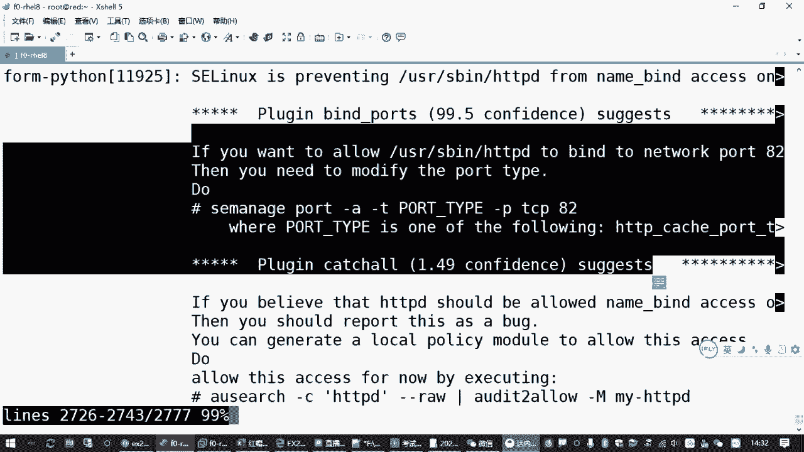

### 方法一：使用系统日志工具（推荐）

这是最直观快捷的方法。当服务因SELinux启动失败时，系统日志工具会给出修复建议。

1.  **故意触发错误**：在SELinux为 `enforcing` 的模式下，尝试启动 `httpd` 服务。
    ```bash
    systemctl start httpd
    ```
    此时服务会启动失败。
2.  **查看日志获取修复命令**：使用 `journalctl` 查看最新日志，并过滤出与本次启动相关的记录。
    ```bash
    journalctl -xe
    ```
    在输出的日志末尾附近，寻找包含 `SELinux is preventing` 字样的段落，其中通常会直接给出修复命令，例如：
    ```
    # 示例日志输出片段
    SELinux is preventing /usr/sbin/httpd from name_bind access on the tcp_socket port 82.
    run `sealert -l abc12345-xxxx-xxxx-xxxx-xxxxxxxxxxxx` for details.
    Or run: `semanage port -a -t http_port_t -p tcp 82`
    ```
3.  **执行修复命令**：直接复制日志中给出的 `semanage` 命令并执行。
    ```bash
    semanage port -a -t http_port_t -p tcp 82
    ```
    这条命令的含义是：向SELinux策略中添加（`-a`）一条规则，将TCP协议（`-p tcp`）的82端口标记为HTTP服务可用的端口类型（`-t http_port_t`）。
4.  **验证端口策略**：可以查看当前SELinux允许的HTTP端口列表，确认82端口已添加。
    ```bash
    semanage port -l | grep http_port_t
    ```
5.  **重新启动服务**：再次启动 `httpd` 服务，此时应该成功。
    ```bash
    systemctl start httpd
    systemctl status httpd
    ```

### 方法二：使用 `setroubleshoot` 工具（传统方法）

此方法步骤稍多，但有助于理解排错流程。


1.  **安装排错工具**：安装 `setroubleshoot` 软件包，它用于分析和记录SELinux拒绝信息。
    ```bash
    yum install setroubleshoot -y
    ```
2.  **触发并分析错误**：启动 `httpd` 服务触发错误，然后使用 `sealert` 工具分析日志。
    ```bash
    systemctl start httpd
    sealert -a /var/log/audit/audit.log
    ```
    在输出中查找针对 `httpd` 和 `port 82` 的拒绝信息，并获取详细的修复建议（同样会给出 `semanage port -a ...` 命令）。

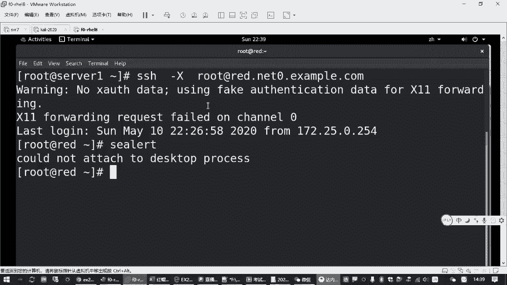

## Web服务器访问测试 🌐

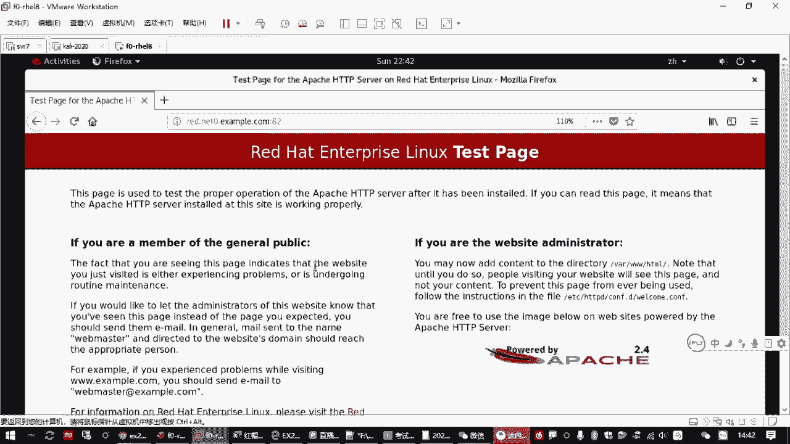

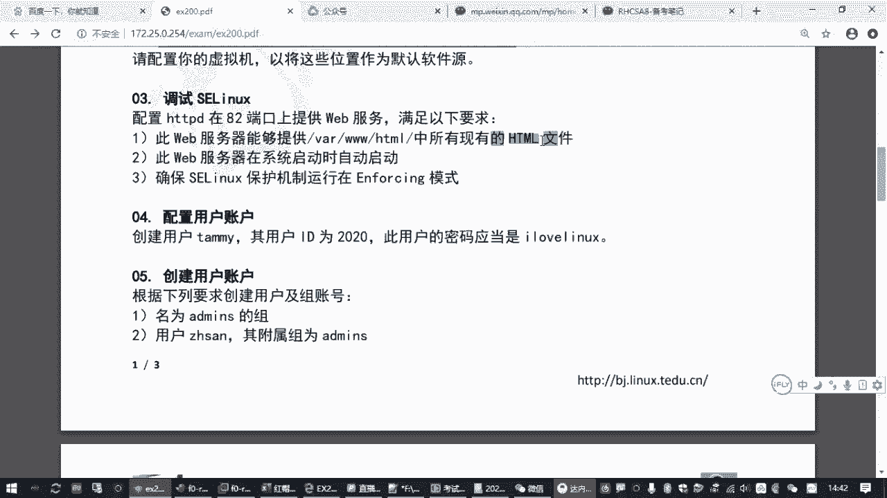

在解决了SELinux端口策略问题后，我们还需要确保Web服务器能被正常访问。

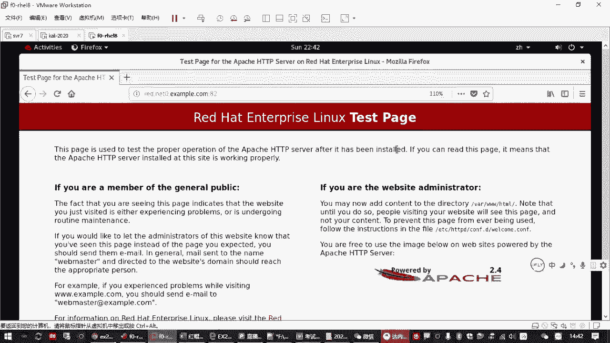

1.  **关闭防火墙**：默认的防火墙策略可能会阻止对82端口的访问。为了测试，可以先停止并禁用防火墙。
    ```bash
    systemctl stop firewalld
    systemctl disable firewalld
    ```
    > **注意**：在生产环境中，应配置防火墙规则开放特定端口，而非直接关闭。
2.  **创建测试网页**：在Web服务器的默认文档根目录 `/var/www/html/` 下创建一些HTML文件。
    ```bash
    cd /var/www/html
    touch file{1..3}.html
    ```
3.  **移除默认欢迎页（关键步骤）**：红帽系统默认配置会显示一个测试欢迎页，这会阻止浏览器直接列出目录下的文件列表。需要删除或禁用这个欢迎页配置。
    ```bash
    rm -f /etc/httpd/conf.d/welcome.conf
    ```
4.  **重启Web服务**：
    ```bash
    systemctl restart httpd
    ```
5.  **从浏览器访问测试**：在浏览器中访问 `http://<你的服务器IP地址>:82`。现在你应该能看到 `file1.html`, `file2.html`, `file3.html` 的文件列表，而不是默认欢迎页。
6.  **设置服务开机自启**：确保 `httpd` 服务在系统重启后能自动运行。
    ```bash
    systemctl enable httpd
    ```

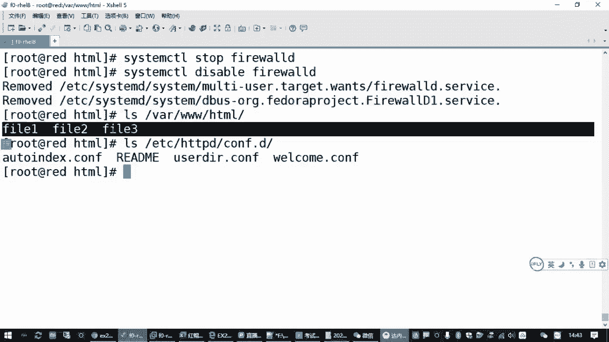

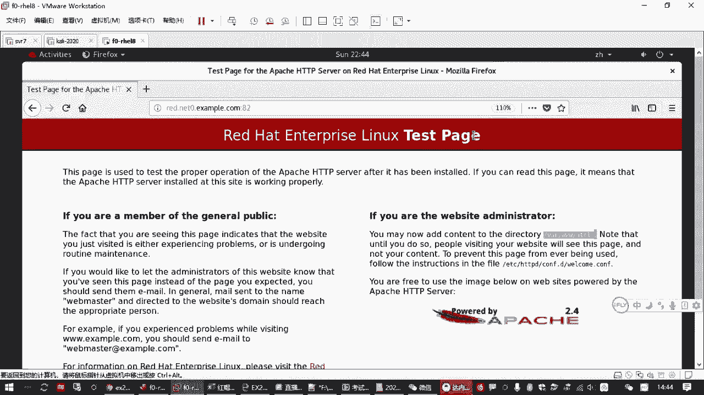

## 总结 📝

本节课中我们一起学习了SELinux的调试方法。主要内容包括：
1.  **Yum源排错**：从服务器、客户端网络、配置文件三个方面排查Yum源问题。
2.  **SELinux核心概念**：理解了SELinux的三种模式（enforcing, permissive, disabled）及其作用。
3.  **SELinux排错实战**：掌握了两种修改SELinux策略以允许服务使用非标准端口的方法：
    *   **推荐方法**：通过 `journalctl -xe` 查看日志直接获取修复命令。
    *   **传统方法**：安装 `setroubleshoot`，使用 `sealert` 分析日志。
    关键命令是 `semanage port -a -t http_port_t -p tcp <端口号>`。
4.  **Web服务完整配置**：在解决SELinux问题后，还需关闭防火墙（或配置规则）、移除默认欢迎页配置，并确保服务开机自启，才能完成整个题目的要求。


通过本课的学习，你不仅能够应对RHCSA考试中的相关题目，也掌握了在红帽系Linux系统中处理因安全策略导致服务异常的基本思路。