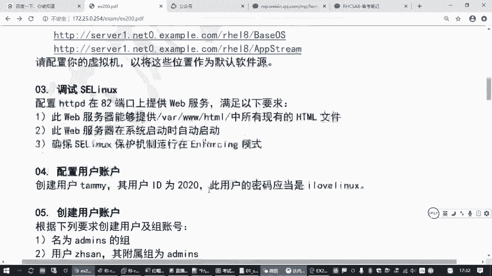
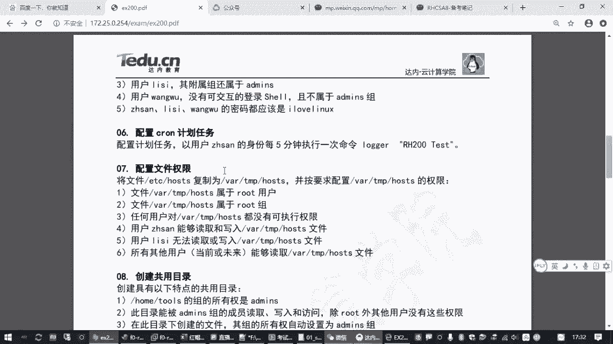
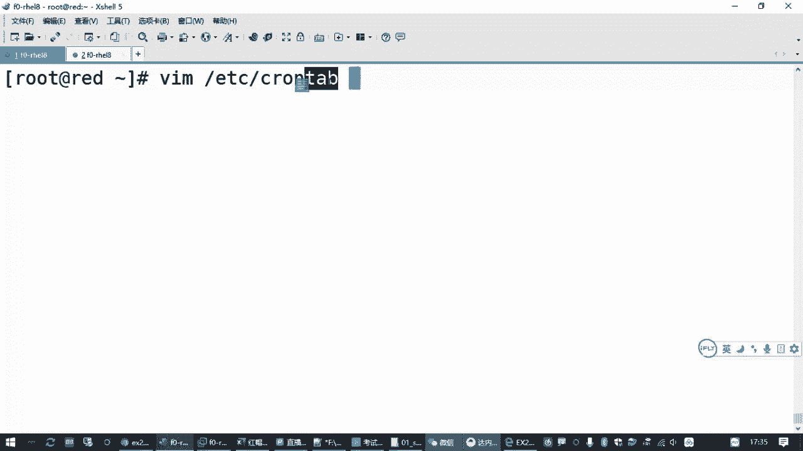
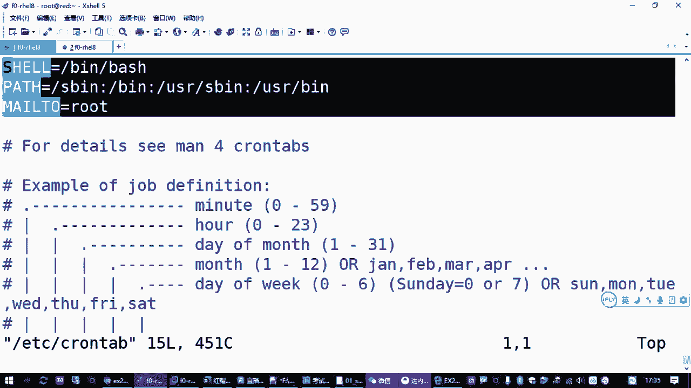
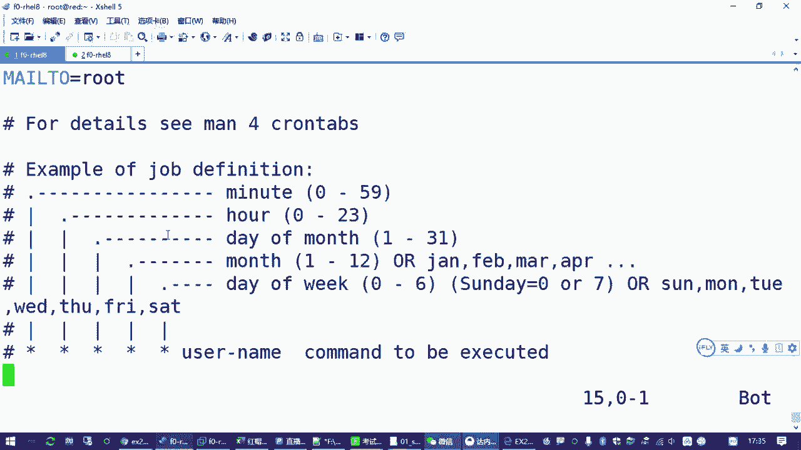
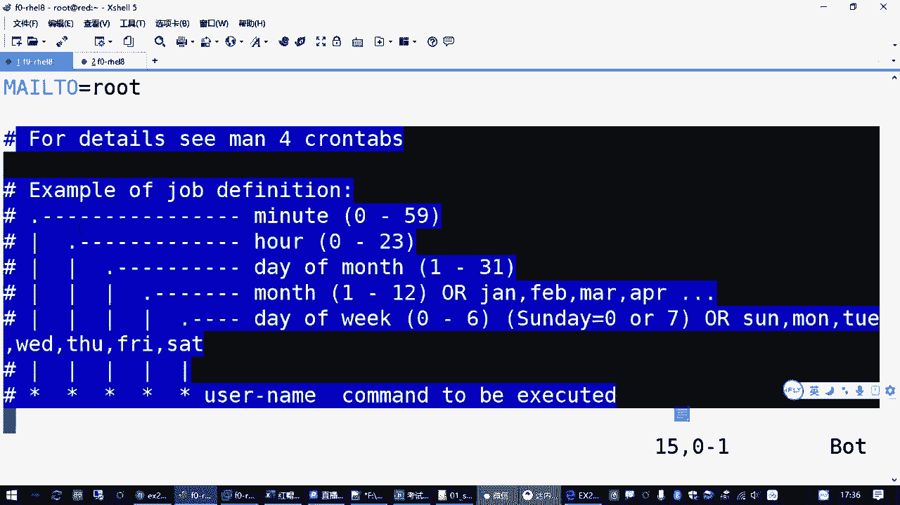
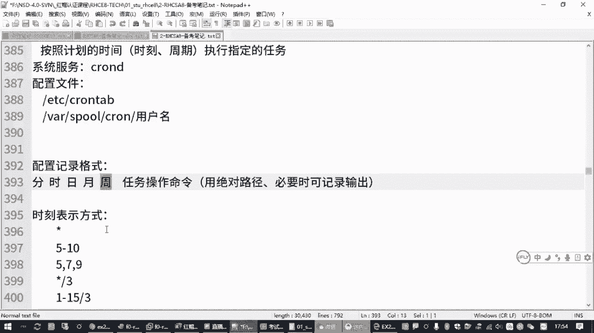

# 红帽认证零基础入门教程：P15：2.09-cron计划任务 📅





在本节课中，我们将要学习Linux系统中一个非常实用的功能——计划任务。我们将了解什么是计划任务，如何配置它，并通过一个具体的考试题目来实践操作。

## 概述：什么是计划任务？

上一节我们介绍了系统服务管理，本节中我们来看看如何让系统在指定时间自动执行任务。计划任务，顾名思义，就是由管理员预先规划好时间点，让系统在指定的时刻自动执行某个任务。例如，每周六晚上自动备份数据，或者工作日早上自动开启防火墙策略。在红帽（RHEL）系统中，这个功能由 `cron` 服务提供。

## 核心组件：cron服务与配置文件

实现计划任务功能的核心是一个名为 `crond` 的服务软件包。该服务通常是系统必备且默认安装并自动运行的。





**检查服务状态：**
```bash
systemctl status crond
```





计划任务的配置主要通过配置文件完成。系统有一个全局配置文件，用于定义整个操作系统的计划任务。

**全局配置文件路径：**
```
/etc/crontab
```

你可以查看这个文件，它会提供配置计划任务的格式样板和说明。

## 计划任务配置格式详解

在配置计划任务时，需要遵循特定的时间格式。每一条计划任务记录通常包含时间字段和要执行的命令。

**基本格式（在`/etc/crontab`中）：**
```
* * * * * username command-to-be-executed
```

这五个星号（`*`）从左到右分别代表：

1.  **分钟** (0 - 59)
2.  **小时** (0 - 23)
3.  **一个月中的第几天** (1 - 31)
4.  **月份** (1 - 12)
5.  **一周中的第几天** (0 - 7，其中0和7都代表星期日)

时间字段可以使用多种符号进行灵活定义：

*   **`*`**：代表该字段的所有有效值（例如，在分钟字段表示“每分钟”）。
*   **`-`**：代表一个范围（例如，`10-12`在小时字段表示10点、11点、12点）。
*   **`,`**：代表一个列表（例如，`15,30,45`在分钟字段表示第15、30、45分钟）。
*   **`/`**：代表间隔频率（例如，`*/5`在分钟字段表示“每5分钟”）。

**重要提示：** 在`/etc/crontab`文件中配置任务需要指定运行命令的用户身份（`username`）。但通常我们使用更便捷的管理工具。

## 管理计划任务的专用工具：crontab命令

为了避免直接编辑全局配置文件的复杂性，系统提供了 `crontab` 命令来管理用户级别的计划任务。这是更推荐的使用方式。

以下是 `crontab` 命令的常用选项：

*   **`crontab -e`**：编辑当前用户的计划任务列表。
*   **`crontab -l`**：列出当前用户的计划任务列表。
*   **`crontab -r`**：删除当前用户的所有计划任务。

**以管理员身份为其他用户配置任务：**
```bash
crontab -u username -e
```
使用此命令时，在编辑器中**无需**再指定`username`字段，直接编写时间字段和命令即可。

## 实战演练：配置每5分钟执行的任务

现在，让我们回到课程开头提到的考试题目：**以用户“张三”的身份，每5分钟执行一次指定的命令。**

以下是操作步骤：

1.  使用 `crontab` 命令为用户“张三”编辑计划任务。
    ```bash
    crontab -u 张三 -e
    ```
2.  命令会调用 `vi` 编辑器。按 `i` 键进入插入模式。
3.  根据题目要求，编写任务行。时间字段为“每5分钟”，即 `*/5 * * * *`，然后粘贴题目给出的命令。
    ```
    */5 * * * * /usr/bin/echo “Hello from cron” >> /tmp/cron_test.log
    ```
    **注意：** 在实际工作中，建议使用命令的绝对路径（如`/usr/bin/echo`），以确保任务在任何环境下都能找到命令。考试时可按题目要求直接复制命令。
4.  按 `ESC` 键退出插入模式，输入 `:wq` 保存并退出。
5.  如果格式正确，系统会提示“crontab: installing new crontab”，表示任务已成功添加。

**验证任务：**
*   列出张三的计划任务确认：
    ```bash
    crontab -u 张三 -l
    ```
*   查看计划任务的服务日志，观察任务是否按计划执行：
    ```bash
    tail -f /var/log/cron
    ```

## 注意事项与常见问题

在配置计划任务时，有几个关键点需要注意：

*   **时间字段的逻辑关系**：日期（月中的天）和星期几（周中的天）字段是“或”的关系。如果两者都被指定，那么任务会在满足**任一条件**时执行。为避免混淆，通常只使用其中一个字段。
*   **环境变量问题**：在`cron`环境中执行的命令可能没有完整的用户Shell环境变量。因此，在命令中使用**绝对路径**是最可靠的做法。
*   **命令输出处理**：如果计划任务中的命令会产生输出（如错误信息），最好将其重定向到文件或 `/dev/null`，以免系统通过邮件发送这些输出给用户。

## 总结



本节课中我们一起学习了Linux系统计划任务`cron`的配置与管理。我们了解了`crond`服务的作用，学习了计划任务配置文件中“分、时、日、月、周”的时间格式，掌握了使用`crontab -e/-l/-r`命令来编辑、查看和删除用户计划任务的实用技能，并通过一个“每5分钟执行”的实例进行了巩固。掌握计划任务，是实现系统运维自动化的基础一步。