# Linux系统管理：P17：3.02-find查找及grep过滤 🔍

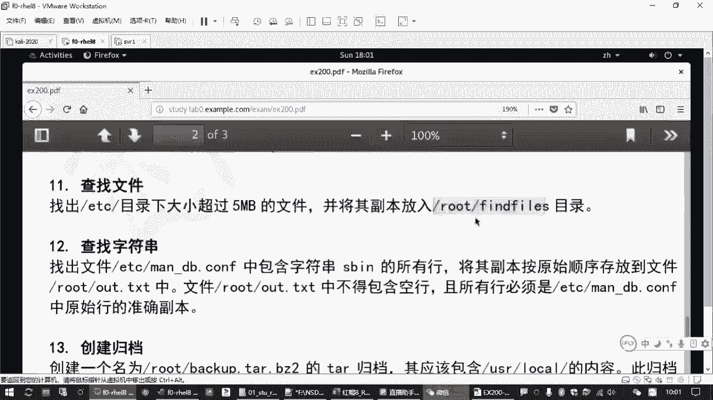

在本节课中，我们将要学习两个在Linux系统管理中至关重要的命令：`find`和`grep`。`find`命令用于在文件系统中搜索符合条件的文件，而`grep`命令则用于在文本内容中过滤出包含特定模式的行。掌握这两个命令是高效进行文件管理和文本处理的基础。

## 文件查找：find命令

上一节我们介绍了文件系统的基本概念，本节中我们来看看如何使用`find`命令精确地定位文件。

`find`命令的基本格式是：`find [目录范围] [查找条件]`。如果不指定目录范围，则默认在当前目录下查找；如果不指定查找条件，则列出所有文件。

以下是`find`命令常用的几种查找条件：

*   **按名称查找**：使用 `-name` 选项。例如，`find /etc -name "*.conf"` 查找`/etc`目录下所有以`.conf`结尾的文件。
*   **按类型查找**：使用 `-type` 选项。常见类型有：
    *   `f`：常规文件
    *   `d`：目录
    *   `l`：符号链接文件
    *   `b`：块设备文件
    *   `c`：字符设备文件
    例如，`find /dev -type b` 列出`/dev`目录下的所有块设备。
*   **按大小查找**：使用 `-size` 选项。可以用 `+` 表示大于，`-` 表示小于。单位需注意：`k`（小写）表示KB，`M`（大写）表示MB。例如，`find /etc -size +5M` 查找`/etc`目录下大小超过5MB的文件。
*   **按修改时间查找**：使用 `-mtime` 选项，单位是天。`-mtime +30` 表示查找30天以前修改过的文件。
*   **按所属用户/组查找**：使用 `-user` 或 `-group` 选项。例如，`find /home -user alice` 查找属于用户`alice`的文件。

多个条件可以组合使用：
*   **与关系**：使用 `-a` 或直接并列（默认就是与关系）。例如，`find /tmp -name "*.log" -size +1M` 查找`/tmp`下名称以`.log`结尾**且**大小超过1MB的文件。
*   **或关系**：使用 `-o`。例如，`find . -name "*.txt" -o -name "*.md"` 查找当前目录下所有`.txt`或`.md`文件。

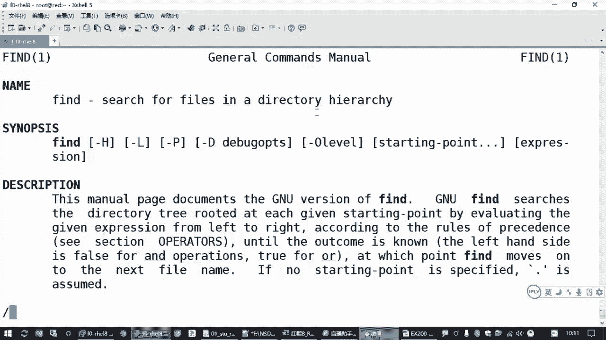

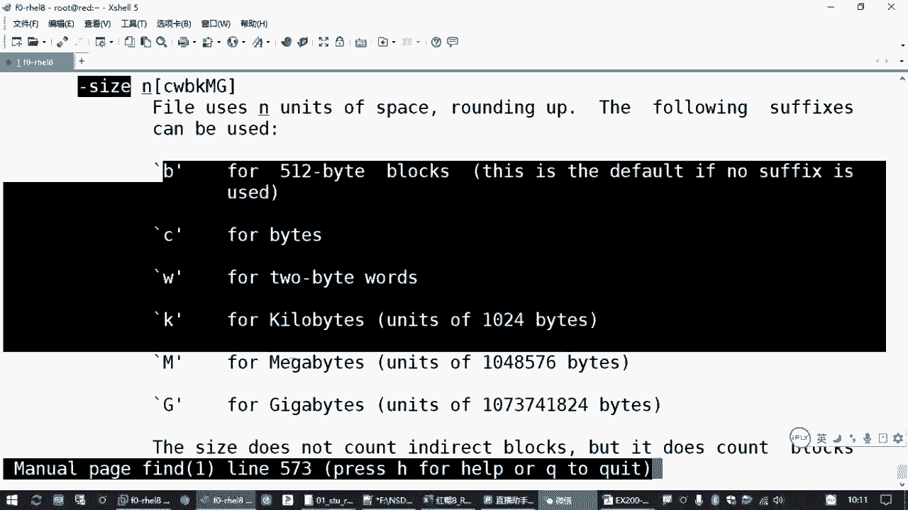

## 处理查找结果：-exec 选项

仅仅找到文件还不够，我们常常需要对找到的文件进行操作。`find`命令的 `-exec` 选项可以高效地处理每一个搜索结果。

其基本语法是：`find ... -exec 命令 {} \;`。其中，`{}` 是一个占位符，代表`find`找到的每一个文件路径，`\;` 表示命令结束。

例如，我们想查看`/etc`下所有超过5MB文件的详细信息：
```bash
find /etc -size +5M -exec ls -lh {} \;
```
这条命令会为每一个找到的文件执行一次 `ls -lh` 命令。

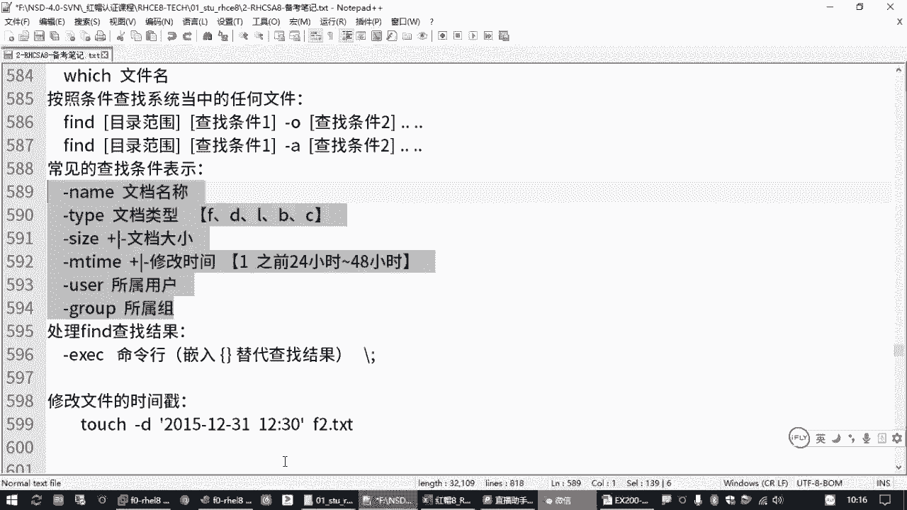

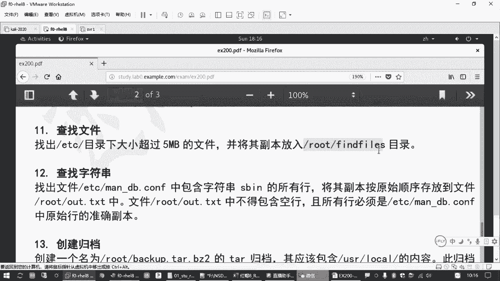

一个常见的应用场景是移动或复制找到的文件。例如，将`/etc`下所有超过5MB的文件复制到`~/large_files`目录：
```bash
mkdir ~/large_files
find /etc -size +5M -exec cp -p {} ~/large_files \;
```
这里 `-p` 选项用于保留文件原始属性（如权限、时间戳）。

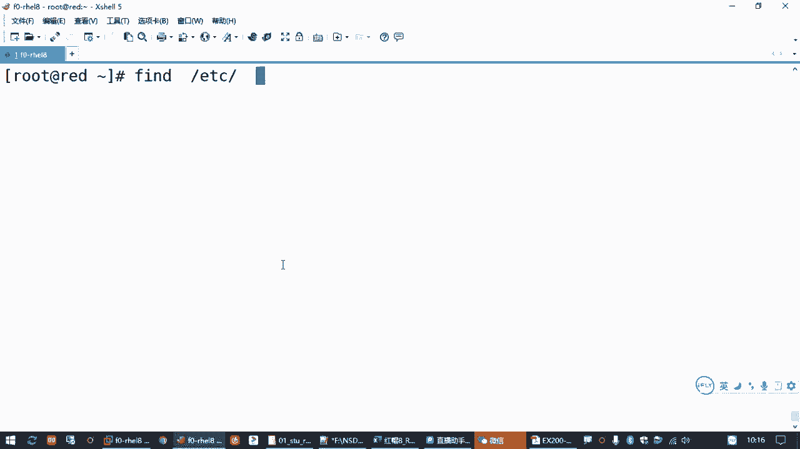

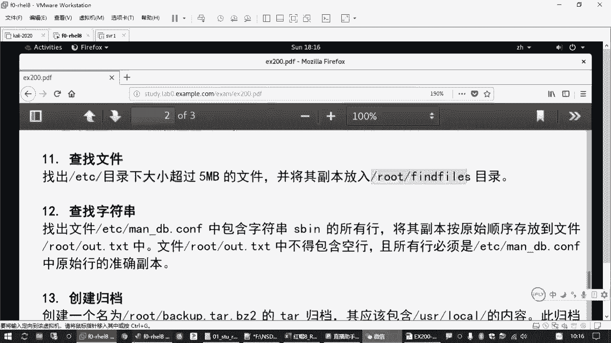

## 文本过滤：grep命令

学会了在文件系统中查找文件，接下来我们学习如何在文件内容中查找特定的文本模式，这就需要用到`grep`命令。

`grep`命令的基本用法有两种：
1.  **在文件中搜索**：`grep [选项] “模式” 文件名`
2.  **对命令输出进行过滤**：`命令 | grep [选项] “模式”`

例如：
*   `grep "127.0.0.1" /etc/hosts` 在`/etc/hosts`文件中查找包含`127.0.0.1`的行。
*   `ifconfig | grep "inet "` 在`ifconfig`命令的输出中，过滤出包含`inet `（注意空格）的行。

如果搜索模式包含空格或特殊字符，建议用引号括起来。

以下是`grep`命令的一些常用选项：

*   `-v`：反向选择，即输出**不包含**模式的行。
*   `-i`：忽略大小写进行匹配。
*   `-n`：显示匹配行及其行号。
*   `-o`：仅显示匹配到的模式本身，而非整行。
*   `-E`：启用扩展正则表达式，允许使用更复杂的模式，如 `|`（或）、`+`（一个或多个）等。`egrep` 是其等效命令。

例如：
*   `grep -v "^#" /etc/ssh/sshd_config` 查看SSH配置文件，并过滤掉所有以`#`开头的注释行。
*   `grep -i "error" /var/log/messages` 在系统日志中查找所有`error`信息，忽略大小写。
*   `egrep "WARN|ERROR" /var/log/myapp.log` 在日志中查找包含`WARN`或`ERROR`的行。

## 保存命令结果：输出重定向

无论是`find`还是`grep`，我们经常需要将它们的执行结果保存到文件中，而不是仅仅显示在屏幕上。这就需要用到输出重定向操作符 `>` 和 `>>`。


*   `命令 > 文件`：将命令的标准输出**覆盖**写入指定文件。如果文件不存在则创建。
*   `命令 >> 文件`：将命令的标准输出**追加**到指定文件的末尾。

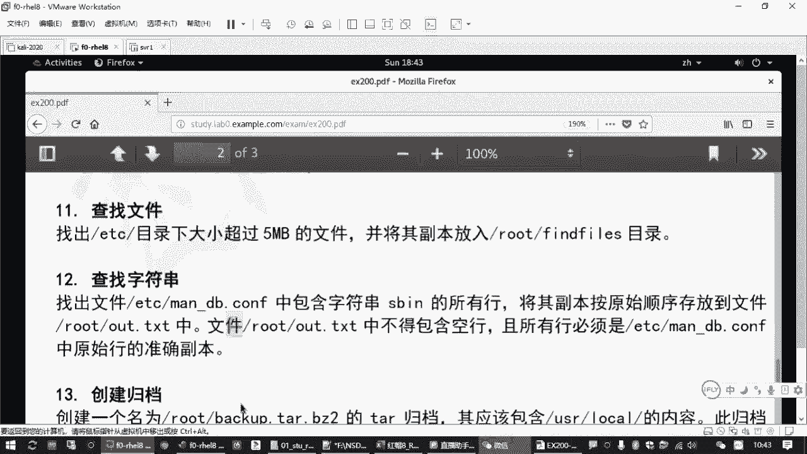

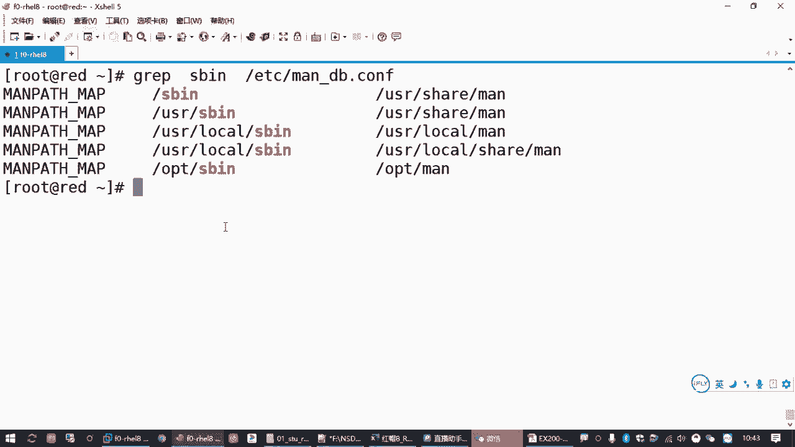

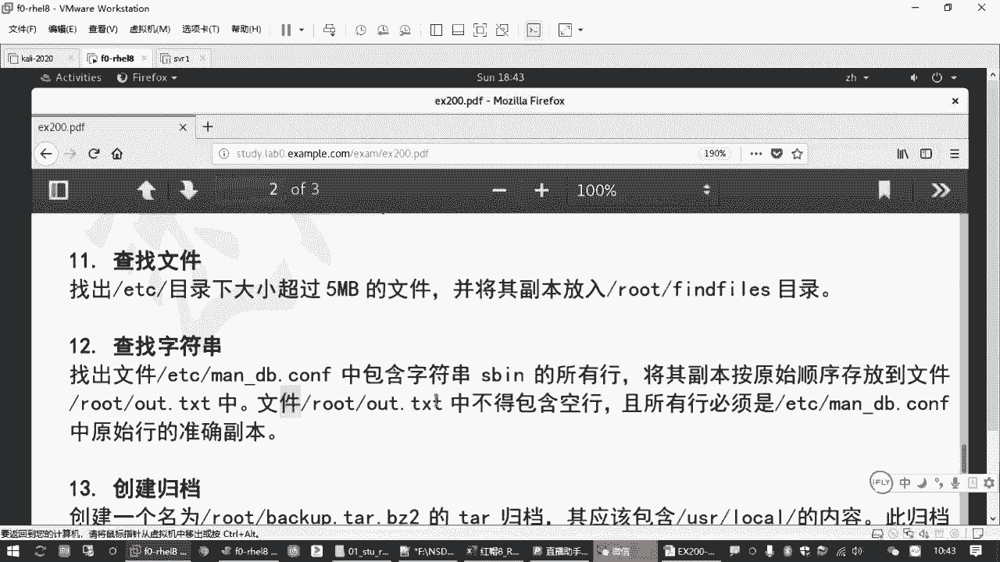

这与管道 `|` 不同，管道是将前一个命令的输出作为后一个命令的输入，而后面的部分仍然是命令。

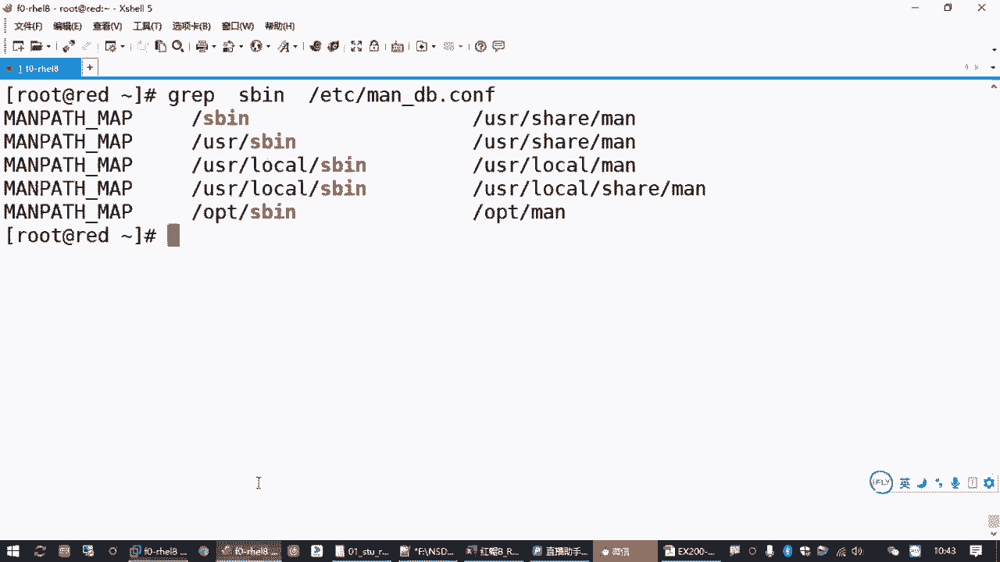

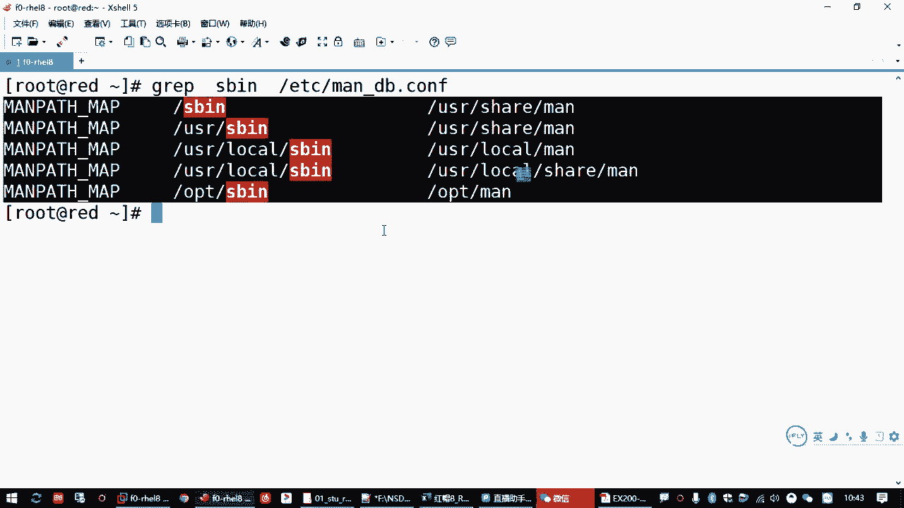

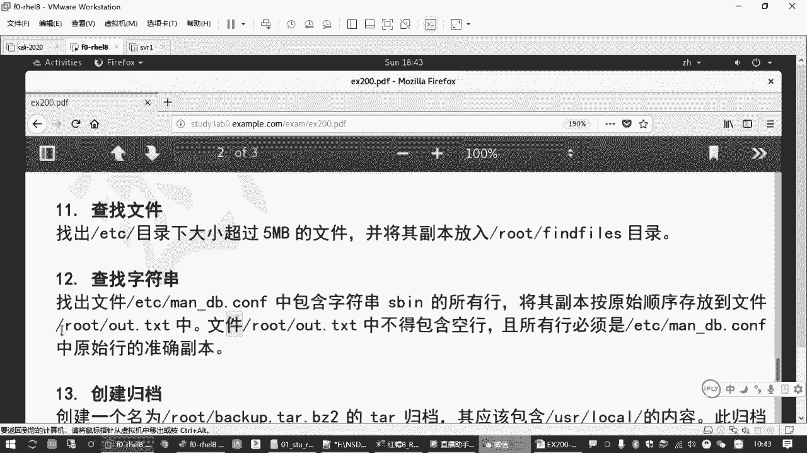

例如，将包含`SB`关键词的`/etc/man_db.conf`文件行保存到`~/result.txt`：
```bash
grep "SB" /etc/man_db.conf > ~/result.txt
```
这种方法比手动复制粘贴更准确、高效，能确保结果是命令输出的原始副本，避免引入多余的空行或格式错误。

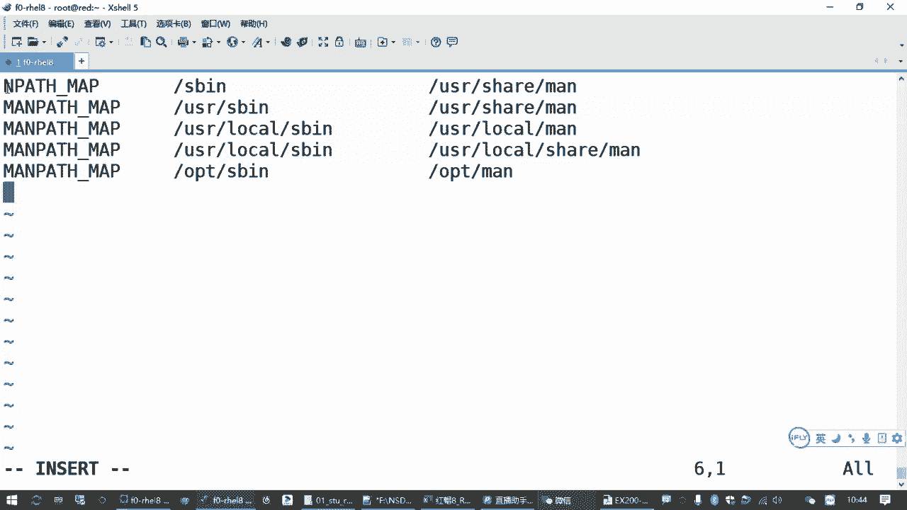

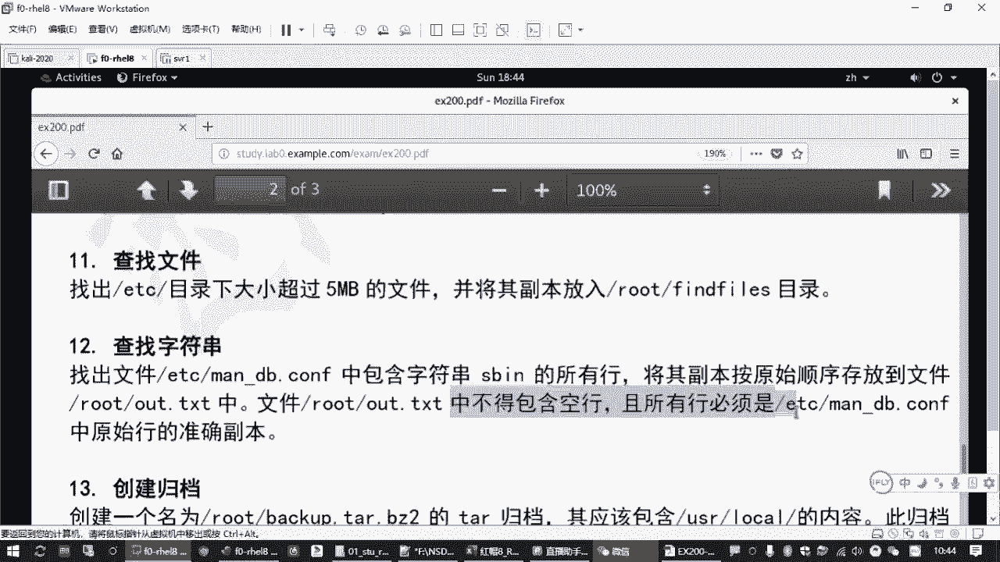

## 总结

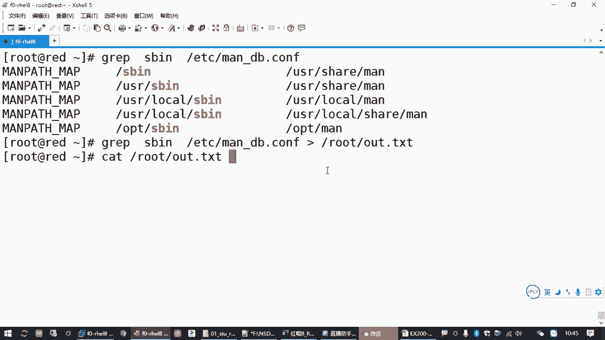

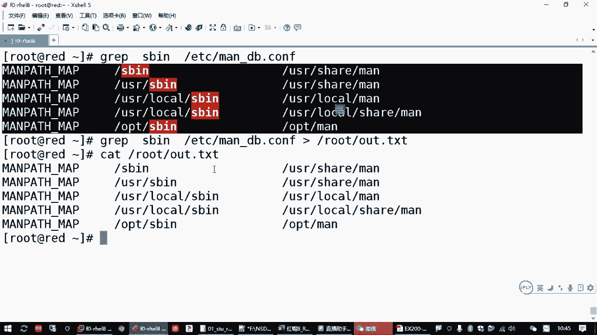

本节课中我们一起学习了Linux中两个强大的搜索过滤工具。
*   **`find`命令**：用于在**文件系统**中根据名称、类型、大小、时间等属性查找文件，并能通过`-exec`选项对找到的文件执行操作。
*   **`grep`命令**：用于在**文本内容**中根据模式（关键词或正则表达式）过滤出符合条件的行，是分析日志、查看配置的利器。
*   **输出重定向**：使用 `>` 或 `>>` 可以将任何命令的输出结果方便地保存到文件中，是保存工作结果的常用技巧。

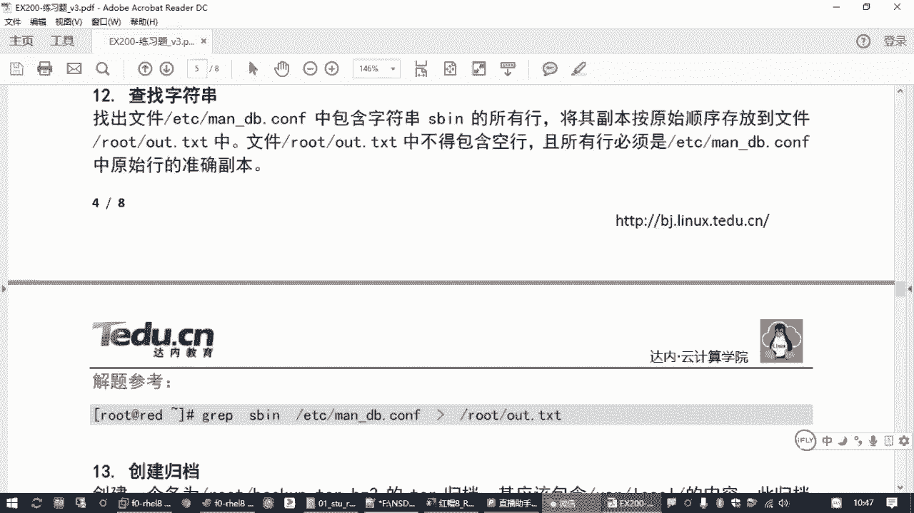

熟练掌握`find`和`grep`的组合使用，能够极大地提升你在Linux命令行下的工作效率。