# 红帽认证零基础入门教程：P18：3.03-tar归档及压缩 📦

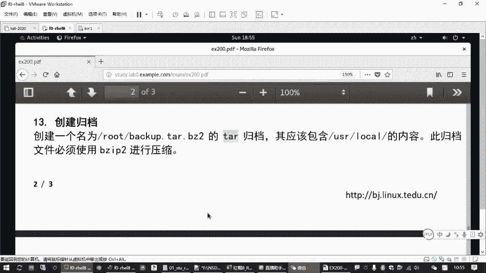

在本节课中，我们将要学习Linux系统中一个非常核心的命令：`tar`。我们将了解归档与压缩的区别，掌握使用`tar`命令进行文件归档、查看、恢复以及结合不同压缩工具进行压缩和解压的操作方法。

## 归档与压缩的概念 🔍

上一节我们介绍了文件管理的基础知识，本节中我们来看看如何将多个文件打包和压缩以方便携带或节省空间。

在Linux系统中，**归档**和**压缩**是两个不同的概念。
*   **归档**：指将多个文件或目录合并成一个单一的文件，便于管理和传输。归档本身**不减少**文件占用的总空间。例如，将10个各10MB的文件归档，得到的归档文件大小约为100MB。
*   **压缩**：指通过特定算法减少文件占用的磁盘空间。例如，将一个100MB的文本文件压缩后可能只有20MB。

Linux有独立的工具分别处理这两项任务：`tar`命令主要用于归档，而`gzip`、`bzip2`、`xz`等命令用于压缩。不过，`tar`命令可以通过添加选项，在归档的同时自动调用压缩工具，实现“一键归档并压缩”。

## tar命令基础用法 🛠️

`tar`命令是处理归档文件的核心工具。以下是其最基本的操作。

### 创建归档

要创建一个新的归档文件，需要使用 `-c` (create) 选项，并用 `-f` (file) 选项指定归档文件的名称。

**命令格式**：
```bash
tar -cf <归档文件名> <要归档的文件或目录1> <要归档的文件或目录2> ...
```

**操作示例**：
假设当前目录下有 `under` 和 `out.txt` 两个文件，要将它们归档为 `backup.tar`：
```bash
tar -cf backup.tar under out.txt
```
执行后，会生成一个名为 `backup.tar` 的归档文件。

### 查看归档内容

创建归档后，可以使用 `-t` (list) 选项来查看归档文件中包含哪些内容。

**命令格式**：
```bash
tar -tf <归档文件名>
```

**操作示例**：
查看刚才创建的 `backup.tar` 文件内容：
```bash
tar -tf backup.tar
```
选项可以合并书写，`-tf` 等同于 `-t -f`。

### 恢复（解压）归档

要将归档文件中的内容释放出来，需要使用 `-x` (extract) 选项。

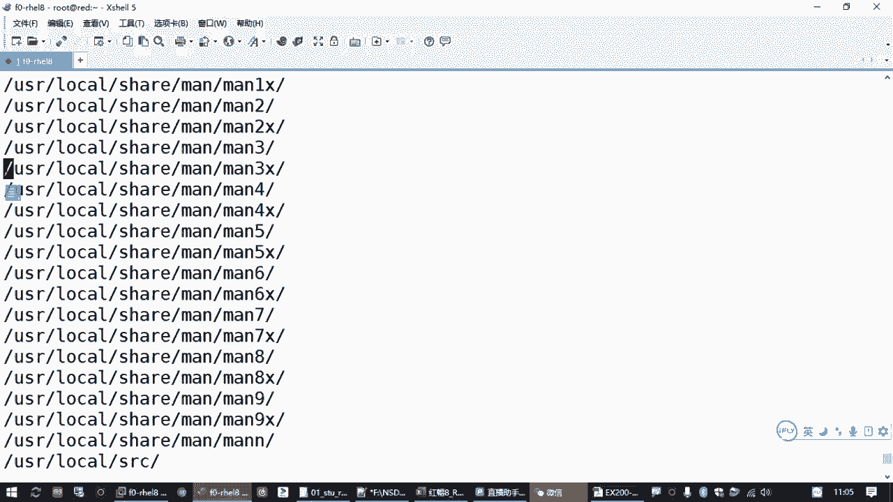

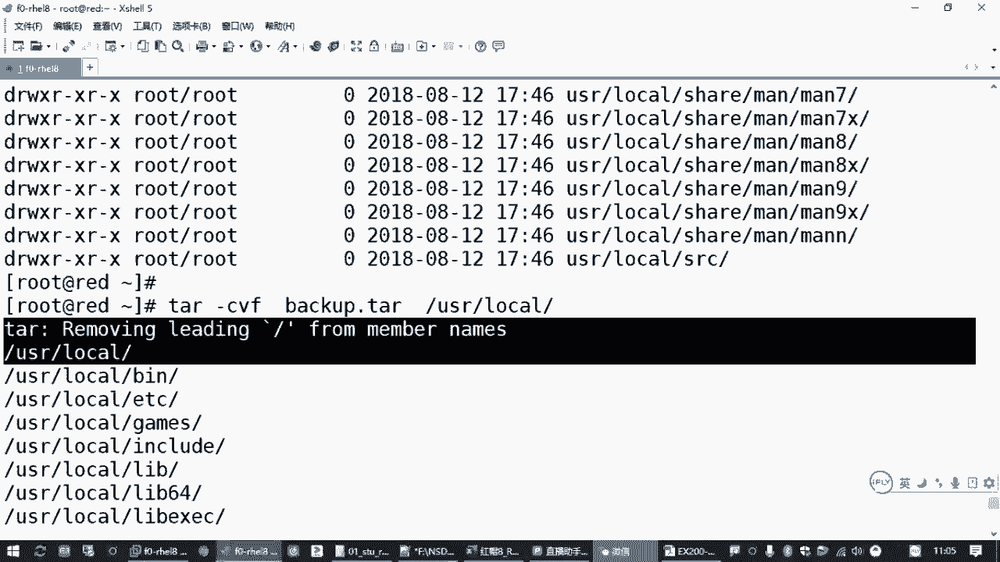

**命令格式**：
```bash
tar -xf <归档文件名>
```
默认情况下，文件会被解压到当前目录。如果需要解压到指定目录，可以使用 `-C` (大写) 选项。

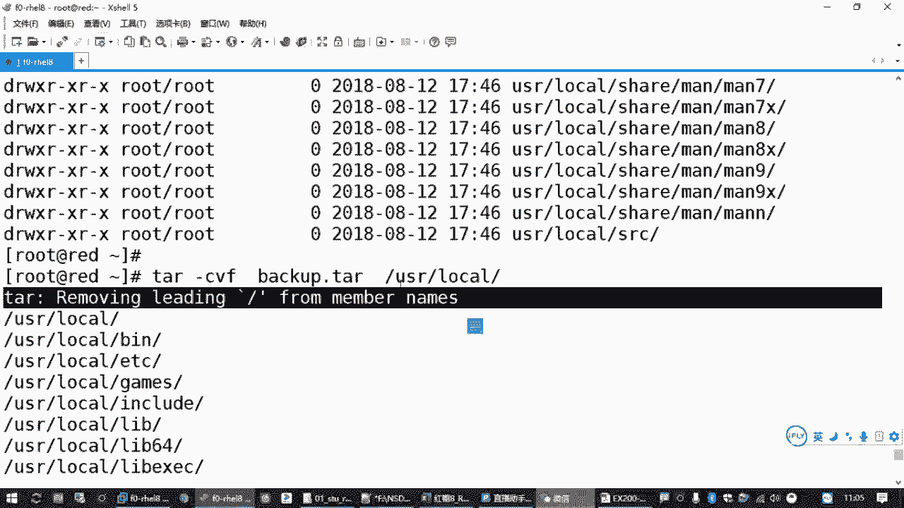

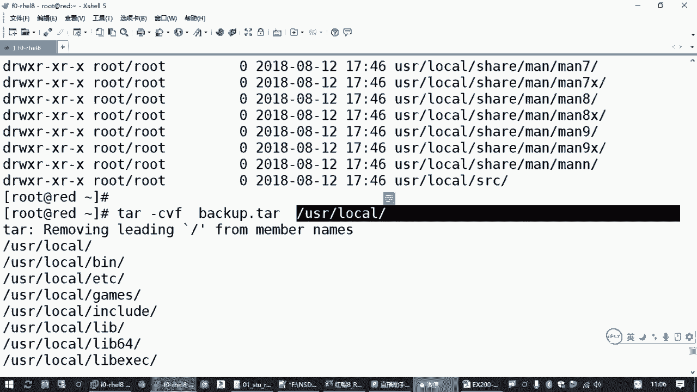

**操作示例**：
1.  将 `backup.tar` 解压到当前目录：
    ```bash
    tar -xf backup.tar
    ```
2.  将 `backup.tar` 解压到 `/opt` 目录：
    ```bash
    tar -xf backup.tar -C /opt
    ```

### 显示详细信息

在上述任何操作中，添加 `-v` (verbose) 选项可以显示命令执行过程的详细信息，方便跟踪。

**操作示例**：
创建归档并显示过程：
```bash
tar -cvf backup.tar under out.txt
```
解压归档并显示过程：
```bash
tar -xvf backup.tar -C /opt
```

## 高级选项：保留绝对路径 🗺️

在备份系统文件时，路径信息非常重要。`tar` 命令的 `-P` (大写) 选项用于保留文件的绝对路径。

**作用对比**：
*   **不使用 `-P`**：备份时，`tar` 会移除路径开头的根目录 `/`。例如，备份 `/usr/local` 后，归档内记录的路径是 `usr/local`。恢复时，若不加 `-C` 指定目录，文件会解压到当前目录下的 `usr/local` 中。
*   **使用 `-P`**：备份时，完整保留绝对路径（如 `/usr/local`）。恢复时，如果配合 `-P` 选项，文件会被精确地还原到原始路径 `/usr/local` 下。

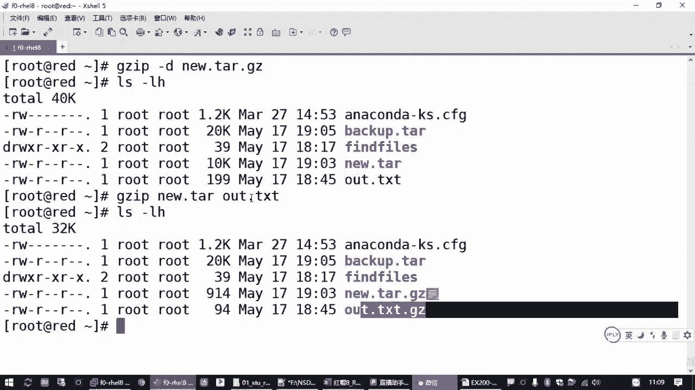

**操作建议**：
在实际备份工作中，建议组合使用 `-cP` 或 `-xP`，以确保路径的准确性，简化恢复操作。

**示例**：
1.  备份 `/usr/local` 目录并保留绝对路径：
    ```bash
    tar -cPf system_backup.tar /usr/local
    ```
2.  在系统损坏后，使用该备份还原到原始位置：
    ```bash
    tar -xPf system_backup.tar
    ```

## 结合压缩工具 🔄

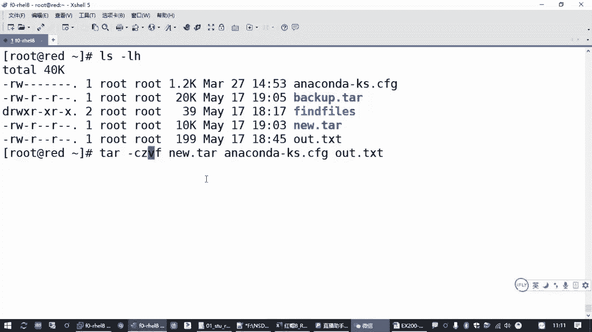

单独的归档文件体积较大，通常我们需要在归档的同时进行压缩。`tar` 命令可以集成调用常见的压缩工具。

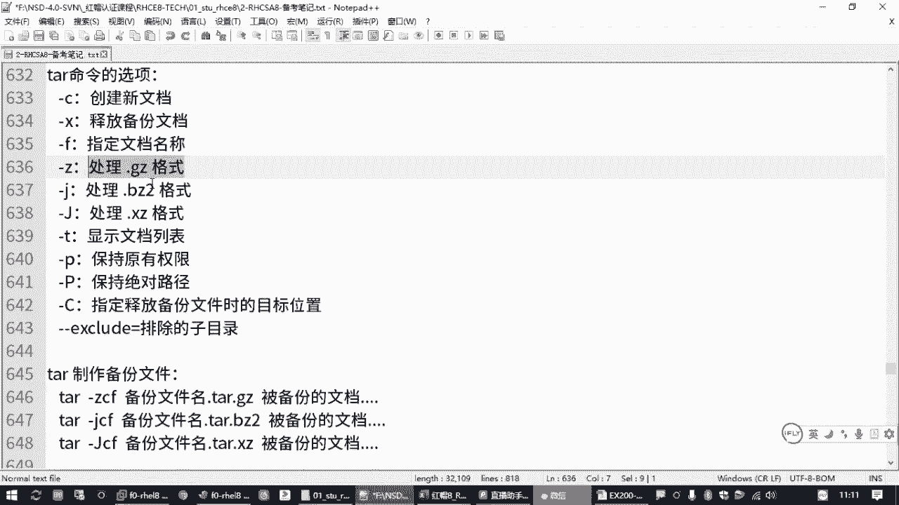

### 常见的压缩格式及对应选项

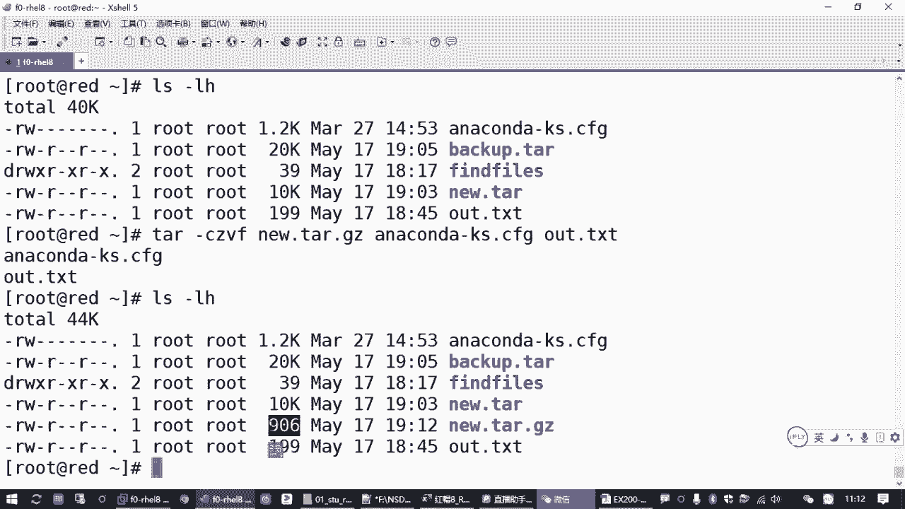

Linux下主要有三种常见的压缩格式，`tar` 命令通过以下选项调用它们：

| 压缩格式 | 文件扩展名 | `tar` 对应选项 | 说明 |
| :--- | :--- | :--- | :--- |
| gzip | `.tar.gz` 或 `.tgz` | `-z` | 压缩速度较快，通用性强。 |
| bzip2 | `.tar.bz2` 或 `.tbz` | `-j` | 压缩率通常比gzip高，速度稍慢。 |
| xz | `.tar.xz` 或 `.txz` | `-J` (大写) | 压缩率最高，但速度也最慢。 |

**注意**：使用 `-j` 或 `-J` 选项前，请确保系统已安装 `bzip2` 或 `xz` 软件包（`gzip` 通常默认已安装）。
安装命令示例：
```bash
yum install -y bzip2 xz
```

### 创建压缩归档包

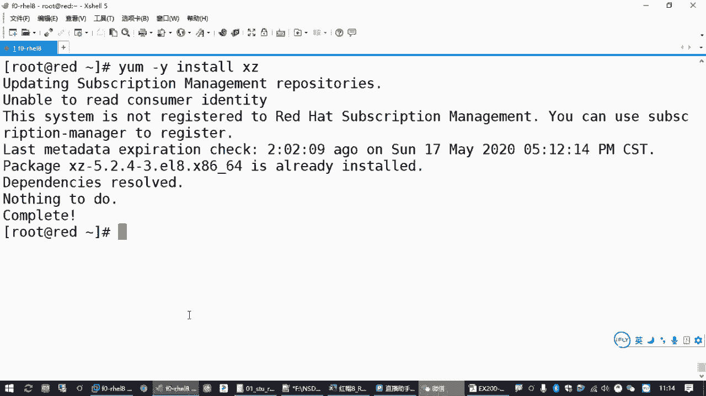

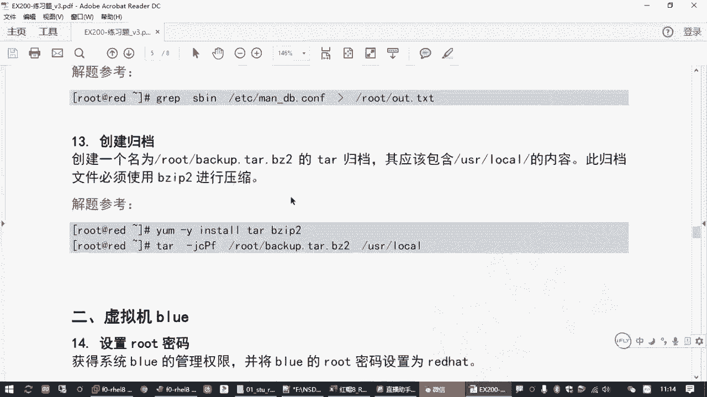

**命令格式**：
将创建归档的选项 `-c` 与压缩选项（`-z`, `-j`, `-J`）结合即可。

**操作示例**：
1.  将 `under` 和 `out.txt` 归档并用 **gzip** 压缩：
    ```bash
    tar -czf backup.tar.gz under out.txt
    ```
2.  将 `/usr/local` 目录归档并用 **bzip2** 压缩，保留绝对路径和详细信息：
    ```bash
    tar -cjPvf /root/backup.tar.bz2 /usr/local
    ```

### 解压压缩归档包

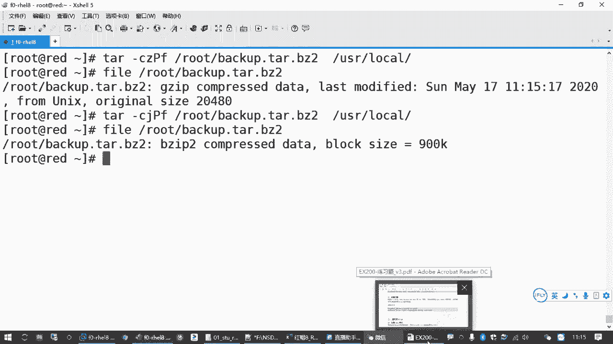

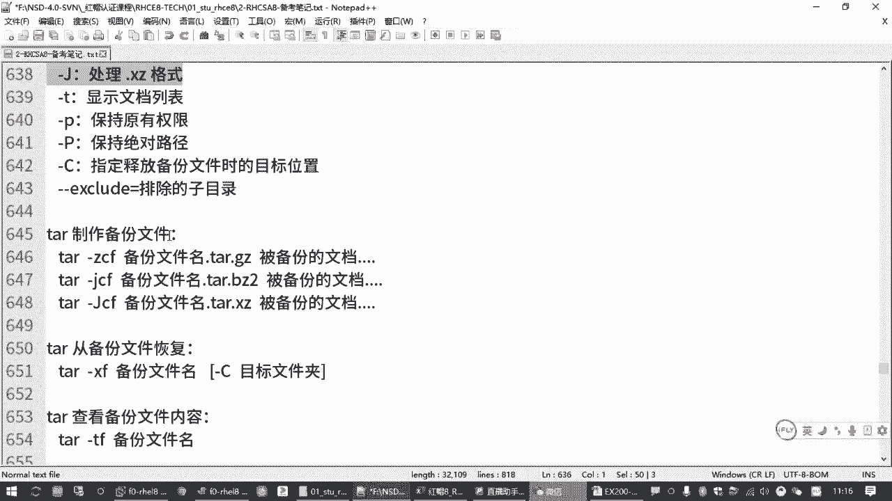

解压时，同样使用对应的压缩选项。

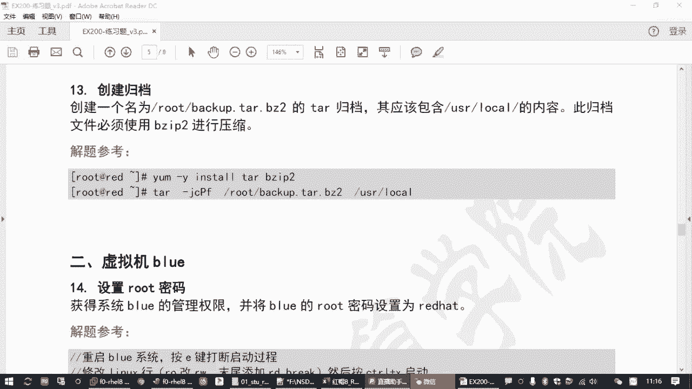

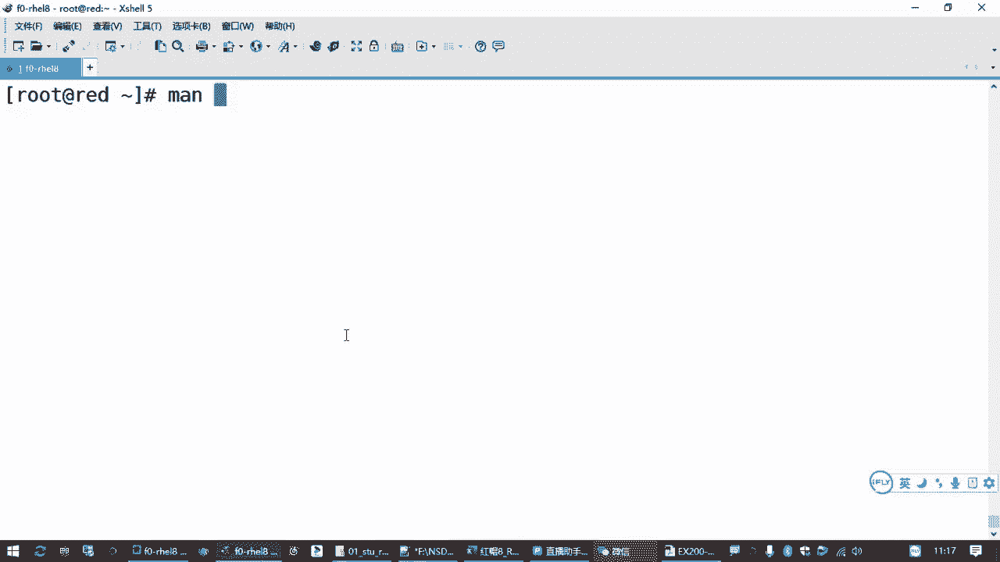

**命令格式**：
```bash
tar -x[z|j|J]f <压缩归档文件名> -C <目标目录>（可选）
```

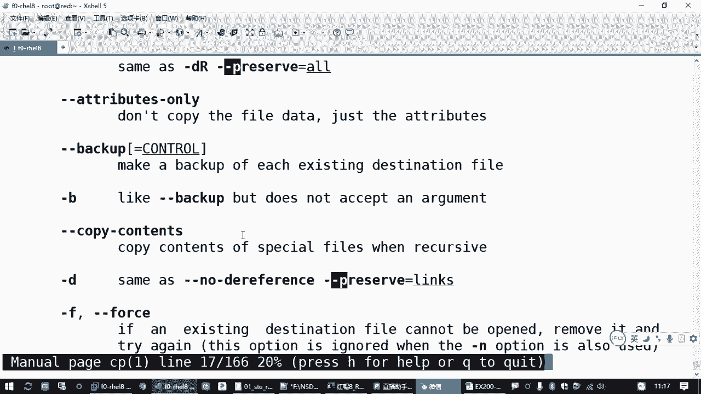

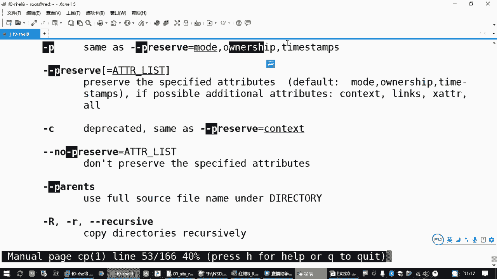

**操作示例**：
1.  解压 `backup.tar.gz` 到当前目录：
    ```bash
    tar -xzf backup.tar.gz
    ```
2.  解压 `backup.tar.bz2` 到 `/opt` 目录：
    ```bash
    tar -xjf backup.tar.bz2 -C /opt
    ```
**技巧**：如果记不清压缩格式，可以只使用 `-xf` 选项，`tar` 命令会自动检测并调用相应的解压程序。
```bash
tar -xf backup.tar.xz
```

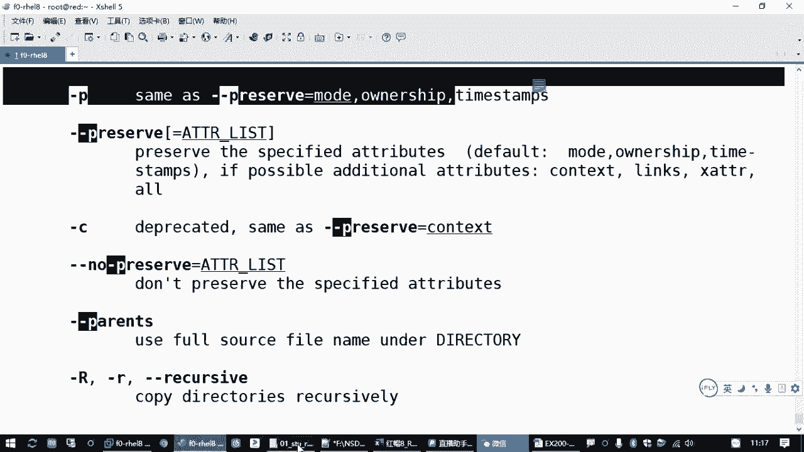

## 实战与技巧 💡

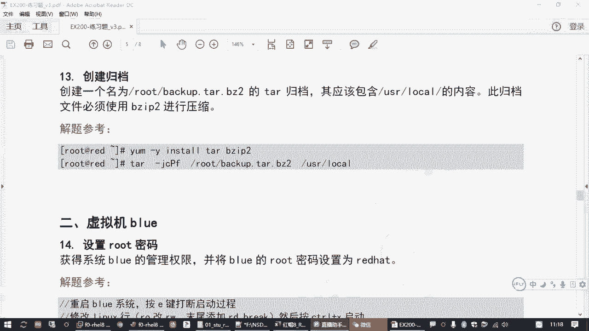

以下是结合题目要求与常见问题的操作汇总。

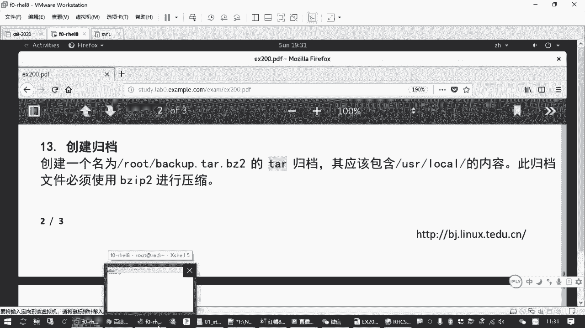

### 题目示例

**要求**：在 `/root` 目录下创建一个名为 `backup.tar.bz2` 的归档压缩文件，其中应包含 `/usr/local` 目录的内容。

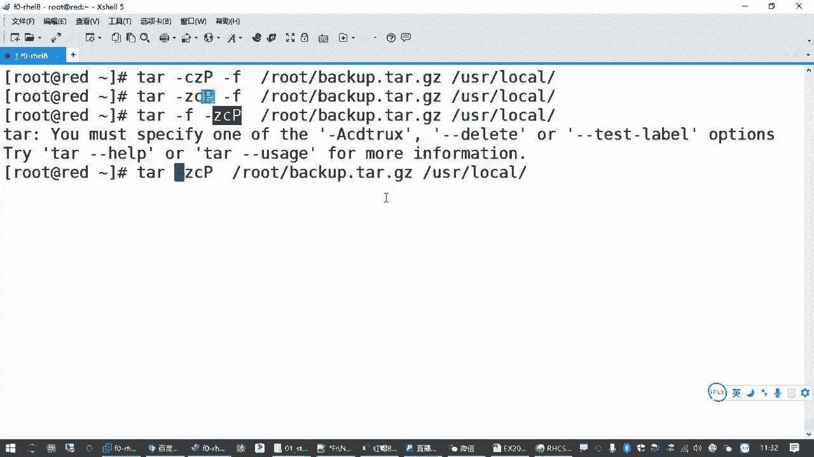

**解答命令**：
```bash
tar -cjPf /root/backup.tar.bz2 /usr/local
```
**验证命令**：
```bash
file /root/backup.tar.bz2  # 查看文件类型，确认是bzip2压缩的tar包
tar -tf /root/backup.tar.bz2 # 查看包内文件列表
```

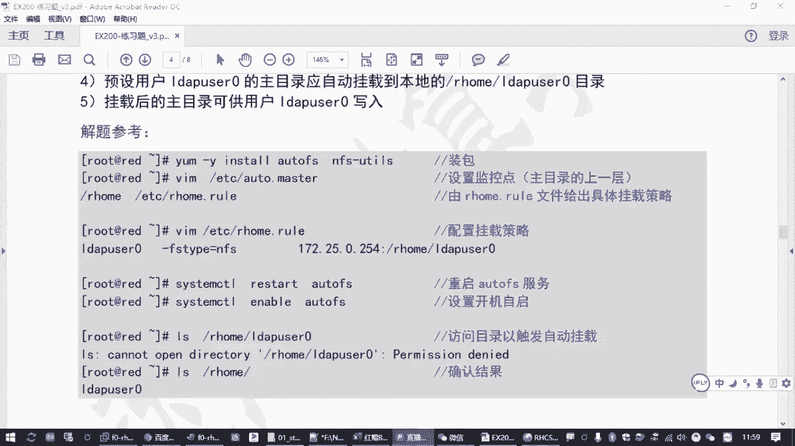

### 重要技巧与答疑

1.  **选项顺序**：`tar` 的选项顺序有一定灵活性，但 `-f` 选项**必须紧跟在文件名之前**。`-f` 与其后的文件名被视为一个整体。推荐将 `-f` 放在所有选项的最后。
    *   **正确**：`tar -czPvf backup.tar.gz /data`
    *   **可能报错**：`tar -cfzv backup.tar.gz /data`

2.  **保留属性**：`cp` 或 `tar` 命令的 `-p` (小写) 选项用于保留源文件的原始属性（如权限、所有权、时间戳）。这在备份恢复时非常重要。
    ```bash
    cp -p source_file dest_dir # 拷贝时保留所有属性
    ```

## 总结 📝

本节课中我们一起学习了Linux下强大的`tar`命令。
*   我们明确了**归档**与**压缩**的概念区别。
*   我们掌握了`tar`命令进行创建(`-c`)、查看(`-t`)、解压(`-x`)归档文件的基本操作。
*   我们学习了如何使用`-P`选项来保留文件的绝对路径，这对于系统备份至关重要。
*   我们了解了如何通过`-z`、`-j`、`-J`选项，让`tar`命令在归档时直接调用`gzip`、`bzip2`、`xz`工具进行压缩，实现高效的一站式打包压缩与解压。
*   最后，我们通过实战示例和技巧总结，巩固了命令的正确用法和选项顺序。

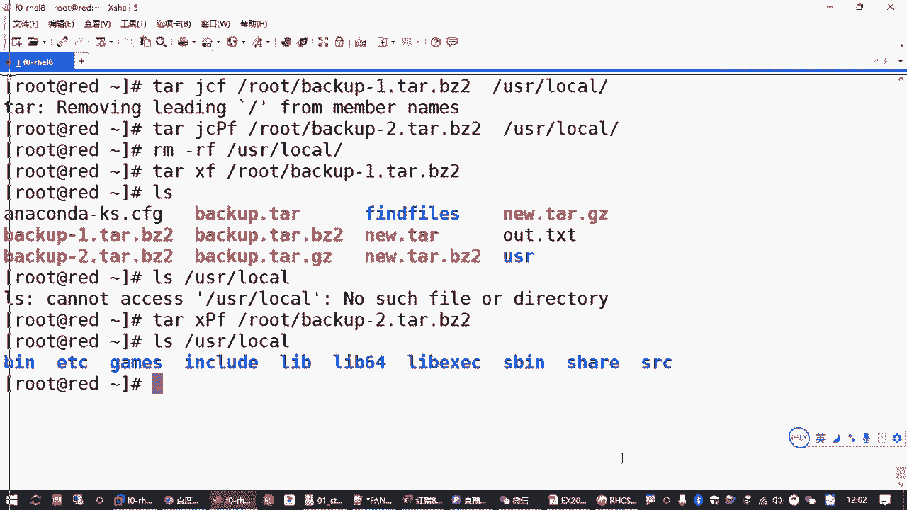

熟练掌握`tar`命令，是进行Linux系统管理、数据备份和迁移工作的基础技能。