# 红帽认证零基础入门教程：P20：3.05-重置root密码 🔑

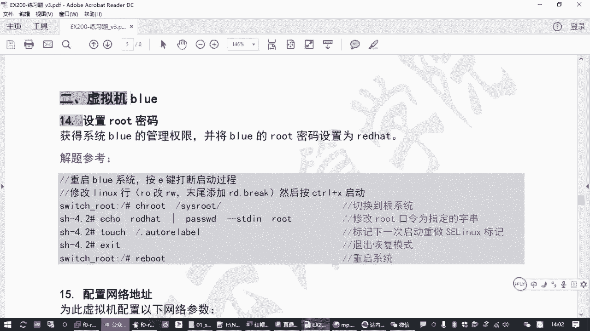

在本节课中，我们将学习如何重置红帽Linux系统的root用户密码。这是系统管理员必须掌握的一项关键技能，尤其当您忘记密码或需要接管一台未知密码的系统时。我们将重点介绍在红帽8系统上，通过修改启动参数进入恢复模式，并最终完成密码重置的完整流程。

上一节我们介绍了基本的系统管理任务，本节中我们来看看如何应对忘记root密码这一特殊情况。

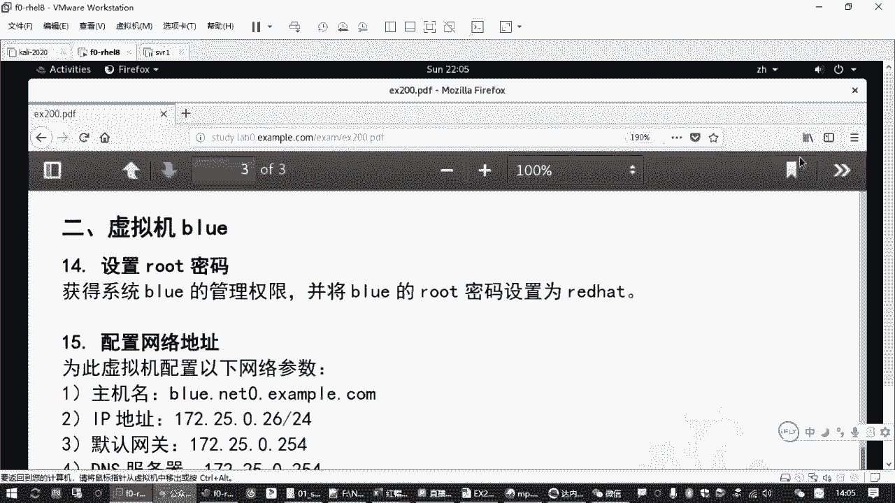

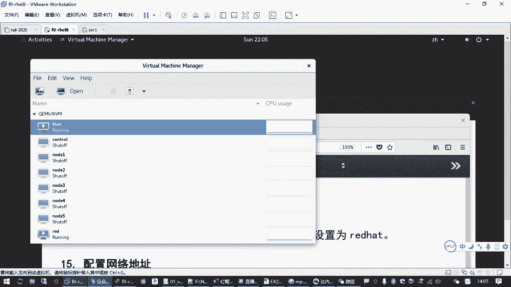

## 背景与目标 🎯

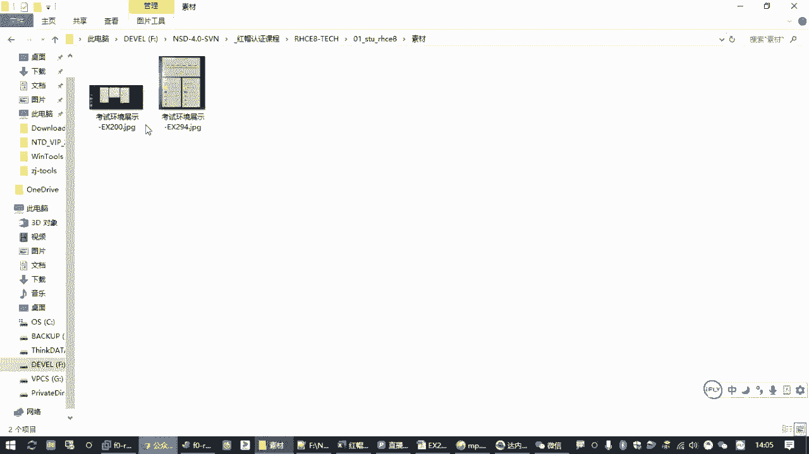

在红帽认证考试环境中，通常有两台虚拟机：`red`和`blue`。重置root密码的题目可能出现在任何一台机器上。本题的目标是**在不知道当前密码的情况下，获取系统的管理员权限，并将root密码修改为指定值**（例如`redhat`）。

核心挑战有两个：
1.  绕过密码验证，进入系统命令行界面。
2.  在修改密码时，正确处理SELinux安全机制，确保修改生效。

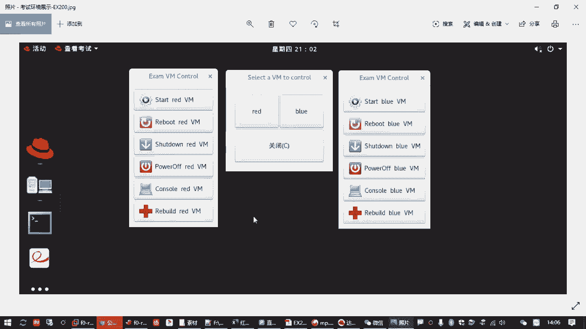

## 操作前提与准备 💻

操作前，请确保目标虚拟机（如`blue`）处于**关机状态**。如果机器已开机，需要先将其关闭。

以下是关机操作步骤：
1.  在虚拟机控制界面，登录系统。
2.  执行关机命令：`poweroff`
3.  或者，直接在虚拟机监控界面点击重启。

## 关键步骤：修改启动参数 ⚙️

这是整个流程的核心。我们需要在系统启动的瞬间，中断其正常引导过程，并修改内核启动参数。

操作要点是**快速连续按两次 `e` 键**。
*   **第一次按 `e`**：打断启动过程，显示被隐藏的启动菜单。
*   **第二次按 `e`**：编辑默认选中的启动项（通常是正常启动的Linux内核行）。

在出现的编辑界面中，找到以 `linux` 开头的那一行。进行两处修改：
1.  找到参数 `ro`（只读），将其改为 `rw`（读写），以便获得对根文件系统的写入权限。
2.  在该行末尾，添加参数 `rd.break`。这个参数告知内核在启动初期中断，进入恢复模式，从而绕过密码检查。

修改完成后，**按 `Ctrl+X`** 组合键（不是回车键）以使用修改后的参数启动系统。

## 进入恢复模式并修改密码 🔓

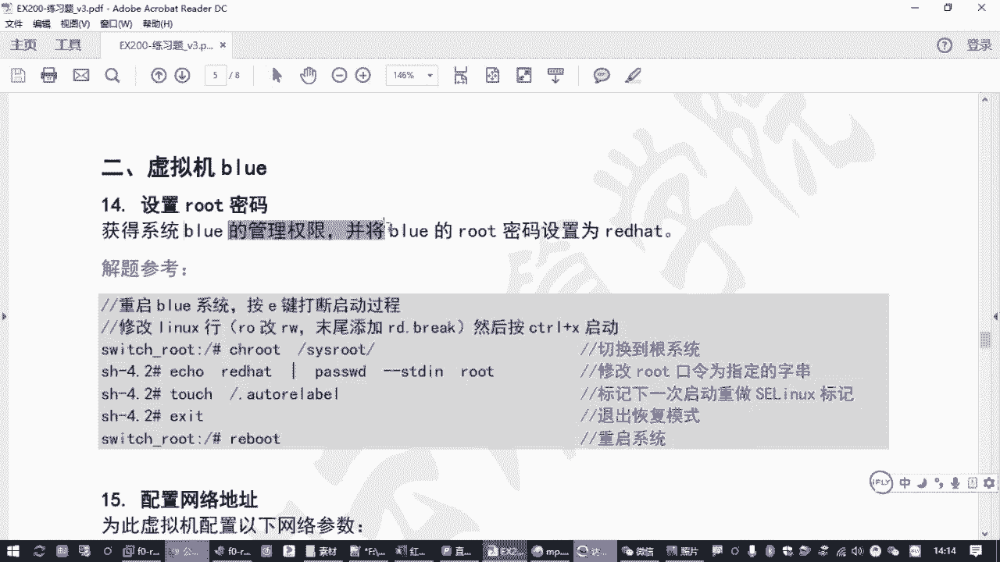

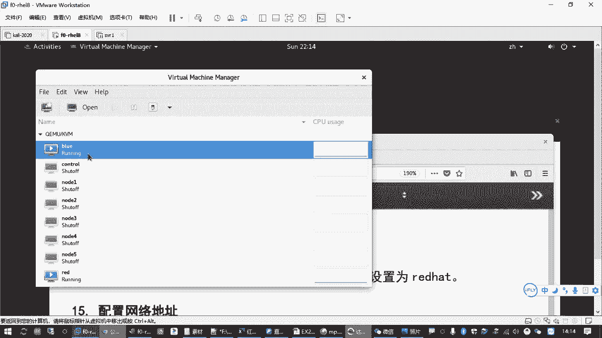

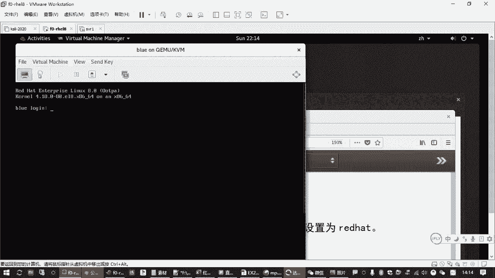

系统将以恢复模式启动，并给出一个 `switch_root` 提示符。此时，我们仍处于一个临时的内存文件系统中。

需要执行以下命令，切换到真实的硬盘系统环境：
```bash
chroot /sysroot
```

现在，您已进入真实的系统环境，可以修改root密码了：
```bash
passwd root
```
然后根据提示，输入两次新密码（例如 `redhat`）。

## 处理SELinux的“坑” 🛡️

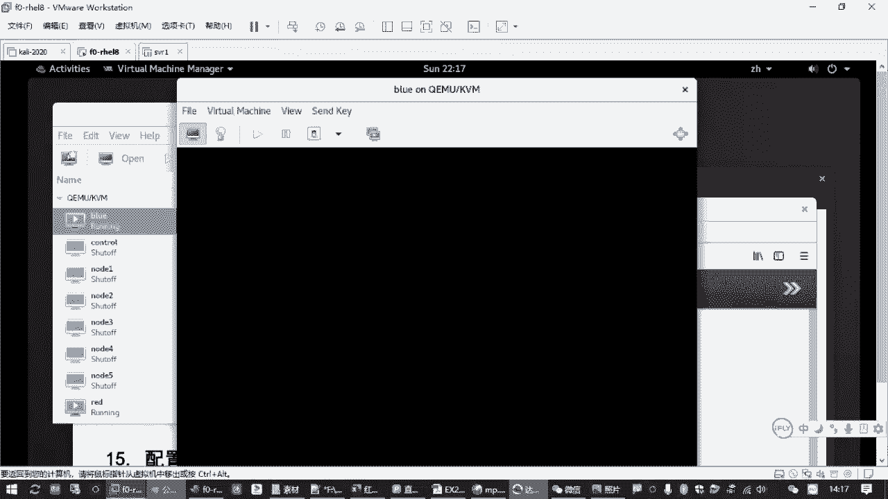

如果系统启用了SELinux（默认启用），直接重启会导致因安全上下文不匹配而无法登录。必须通知SELinux在下次启动时重新标记所有文件。

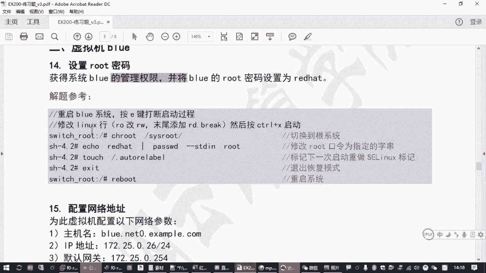

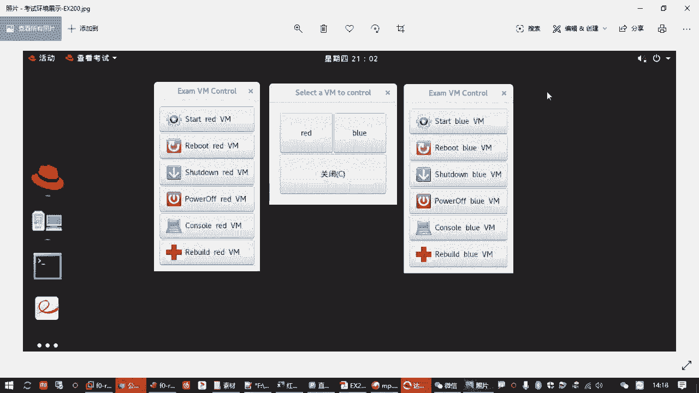

在`chroot`后的环境中，执行以下命令创建一个标记文件：
```bash
touch /.autorelabel
```
**注意**：文件名是 **`.autorelabel`**，不要拼写错误。

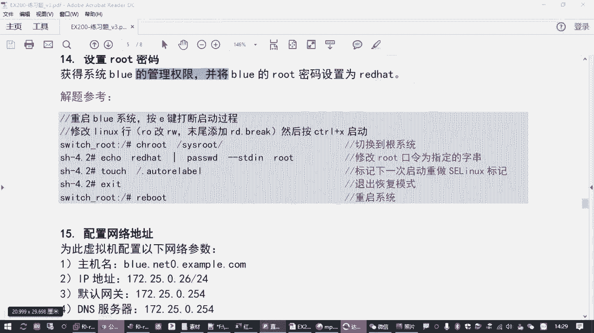

## 完成与验证 ✅

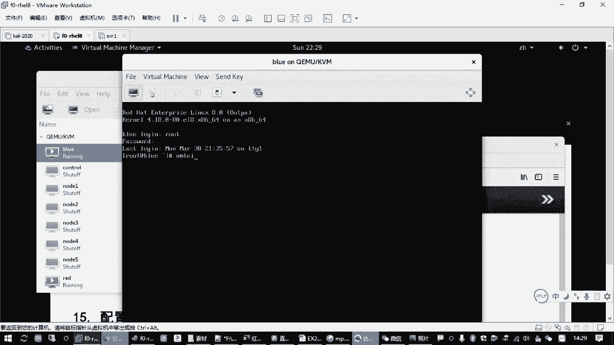

完成以上所有步骤后，依次执行退出和重启：
```bash
exit  # 退出chroot环境
reboot # 重启系统
```
系统重启时，SELinux会重新标记文件系统，这可能需要一些时间。启动完成后，即可使用新设置的root密码登录。

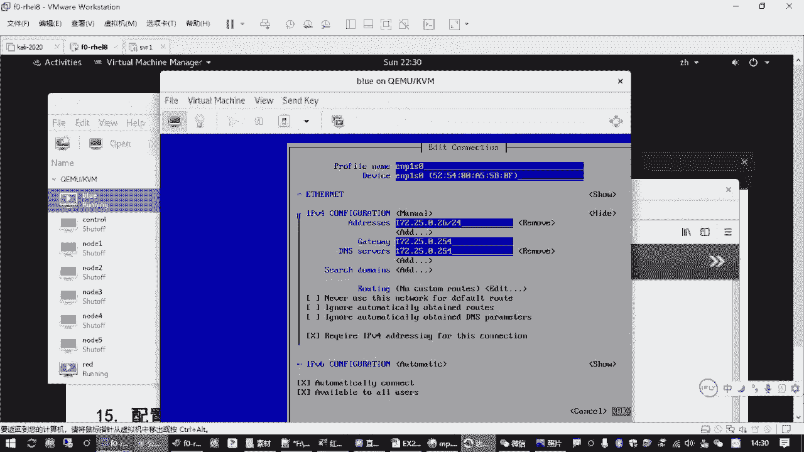

## 后续配置（示例） 🌐

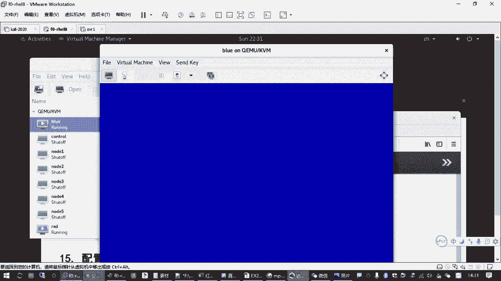

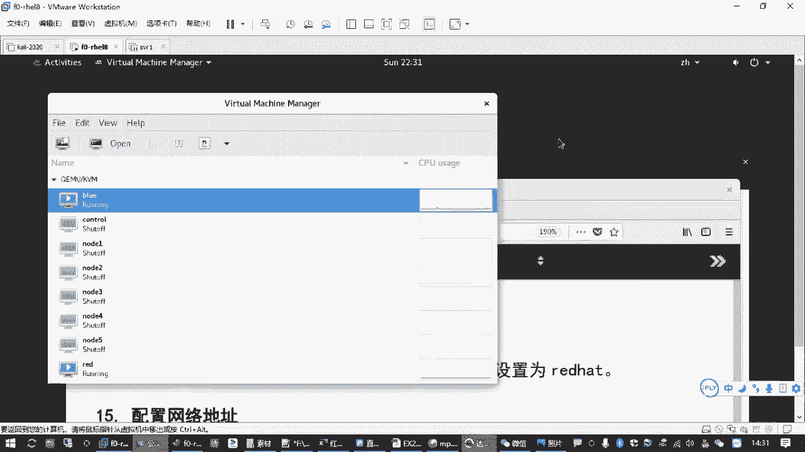

成功登录`blue`虚拟机后，通常需要完成一些基础配置，例如设置网络和Yum源，以便进行后续的考试题目操作。

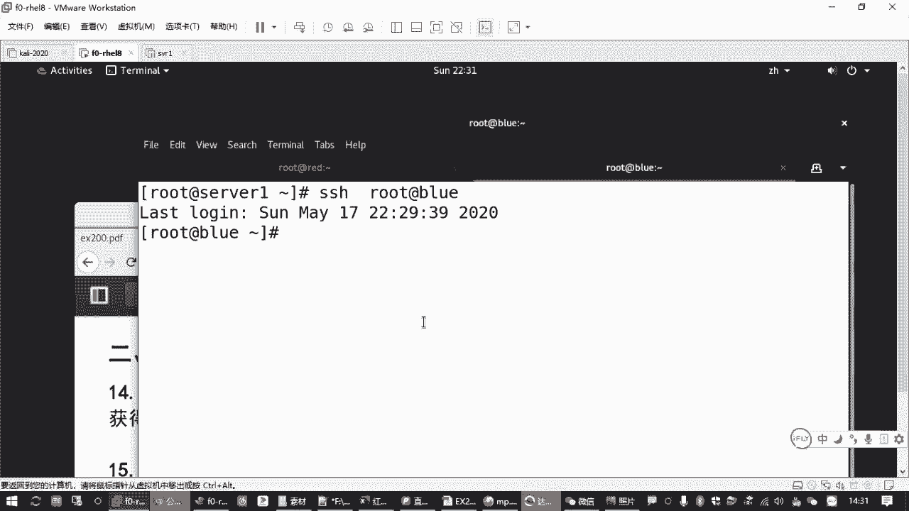

以下是配置网络的主机名和IP地址的示例步骤：
1.  使用 `nmtui` 命令打开网络配置工具。
2.  选择“Edit a connection”，编辑相应网卡。
3.  将IPv4配置改为手动（Manual），并添加指定的IP地址、网关和DNS（例如 `172.25.0.26/24`，网关 `172.25.0.254`）。
4.  保存并激活连接。

配置Yum源时，如果`red`虚拟机已配置好，可以直接将配置文件拷贝过来，更为高效：
```bash
scp /etc/yum.repos.d/*.repo root@blue:/etc/yum.repos.d/
```
最后，可以安装一些常用的工具包进行验证：
```bash
yum install -y vim-enhanced bash-completion net-tools bind-utils
```

---

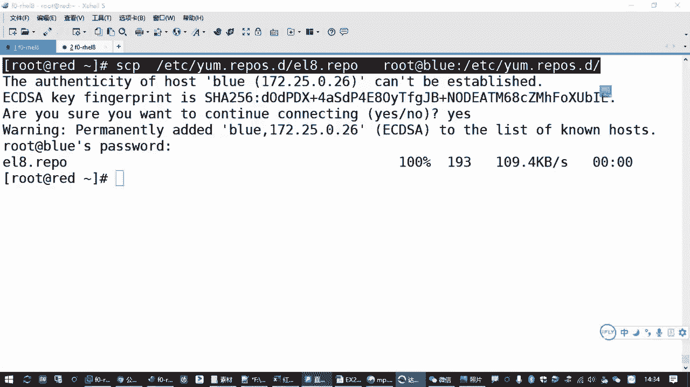

本节课中我们一起学习了在红帽Linux 8系统上重置root密码的完整方法。我们掌握了通过按`e`键修改启动参数进入恢复模式、使用`chroot`切换根环境、修改密码，以及创建`.autorelabel`文件以兼容SELinux的关键步骤。这项技能是系统故障恢复和安全管理的基础，请务必熟练掌握。