# RHCSA考前串讲：P24：3.09-RHCSA考前串讲 📚

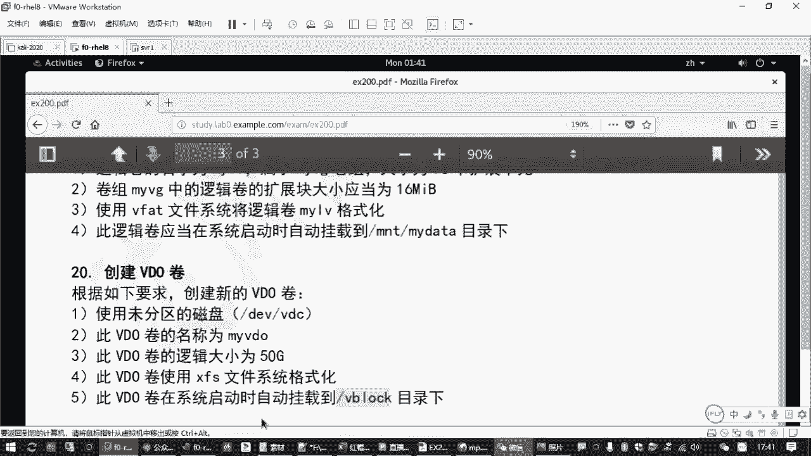

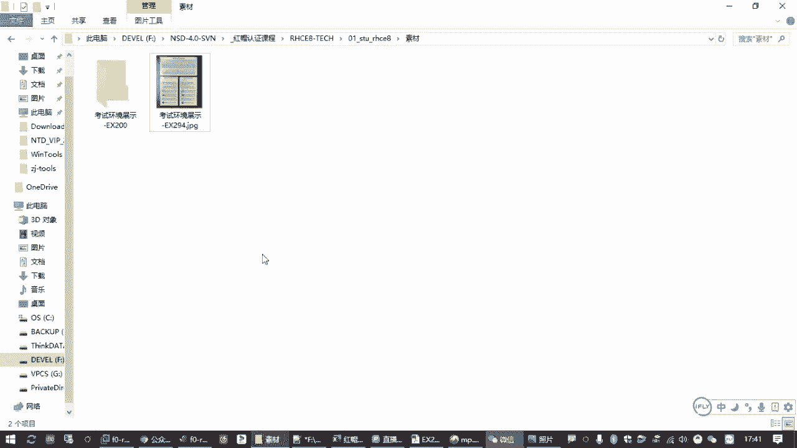

在本节课中，我们将对RHCSA上午考试的整个流程、环境、注意事项和核心考点进行一次全面的梳理和串讲，帮助大家做好考前准备。

## 考试环境与界面介绍 🖥️

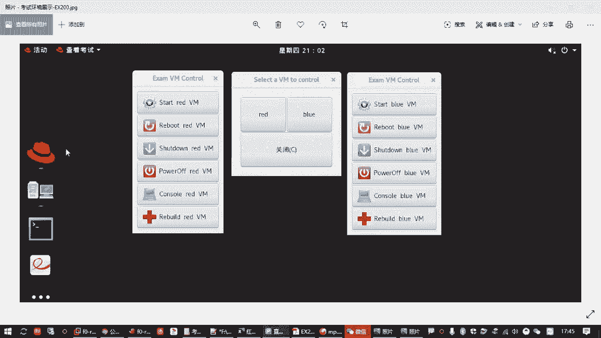

上一节我们介绍了考试的整体结构，本节中我们来看看具体的考试环境和操作界面。

考试时，每位考生会操作一台真实的物理机。你登录后看到的桌面环境如下图所示，这是你进行所有操作的起点。

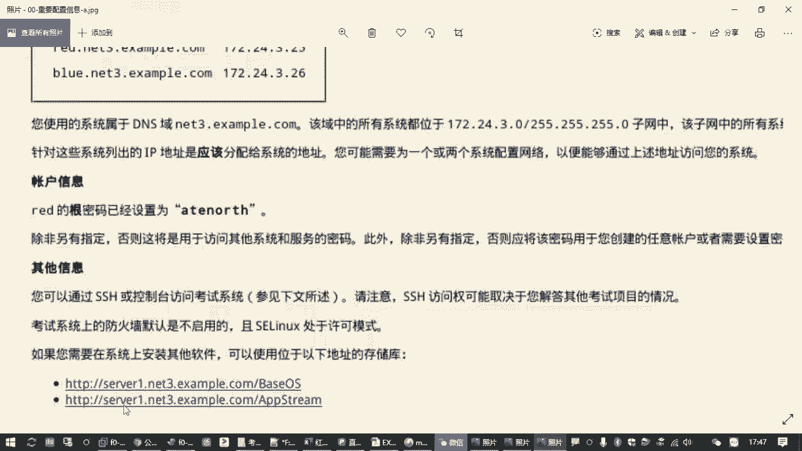

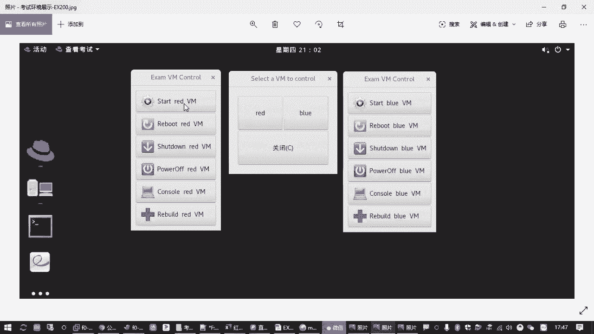

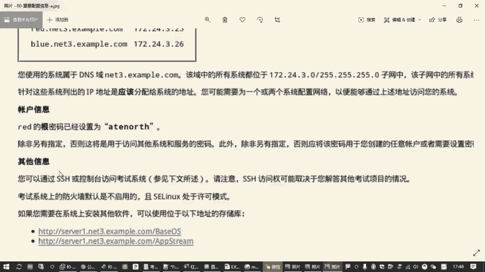

在真机桌面上，你主要会用到以下三个图标：
*   **红帽图标**：点击查看详细的考试要求和题目。
*   **虚拟机控制器图标**：用于控制考试用的虚拟机（如开机、关机）。
*   **终端图标**：用于打开命令行终端。

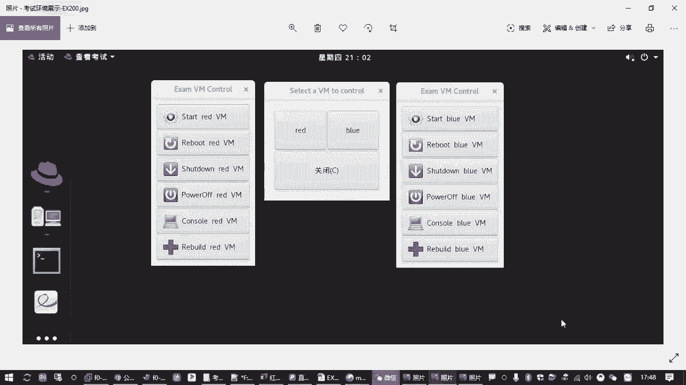

**核心概念**：所有具有管理员权限的操作都必须在指定的虚拟机中完成，真机环境没有管理员权限。

登录后，你是一个普通用户。点击红帽图标即可查看考试要求，其中会详细说明如何控制虚拟机以及如何答题。

上午的RHCSA考试需要操作两台虚拟机。
*   第一台虚拟机通常包含一些基础配置题目。
*   第二台虚拟机则包含与磁盘分区、破解root密码等相关的题目。

**重要提示**：
*   虚拟机的名称不一定是 `red` 或 `blue`，IP地址、用户名和密码也都会变化。
*   你需要通过虚拟机控制器来分别控制这两台虚拟机，熟悉每个按钮（开机、重启、关机、强制关机、显示界面、还原）的功能至关重要。

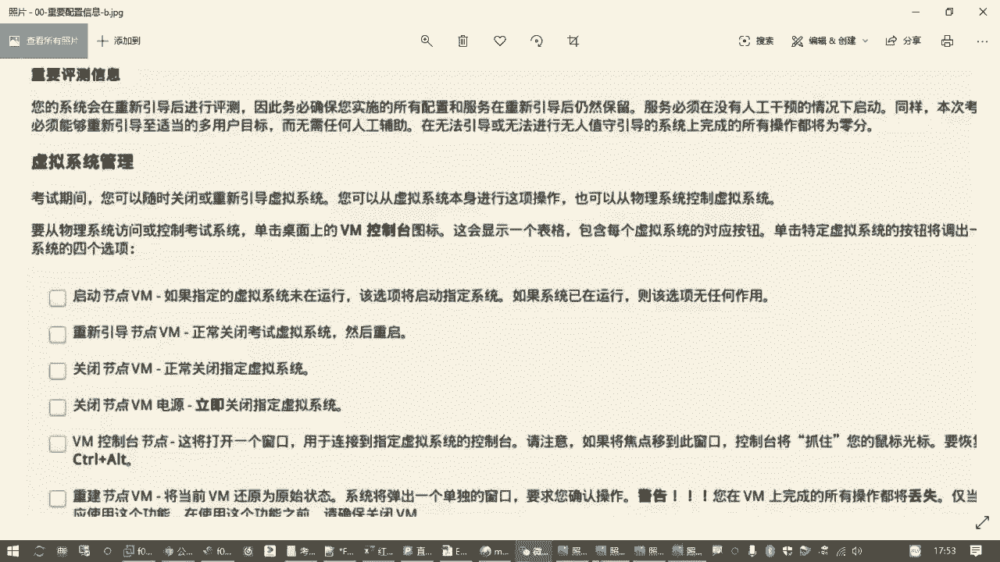

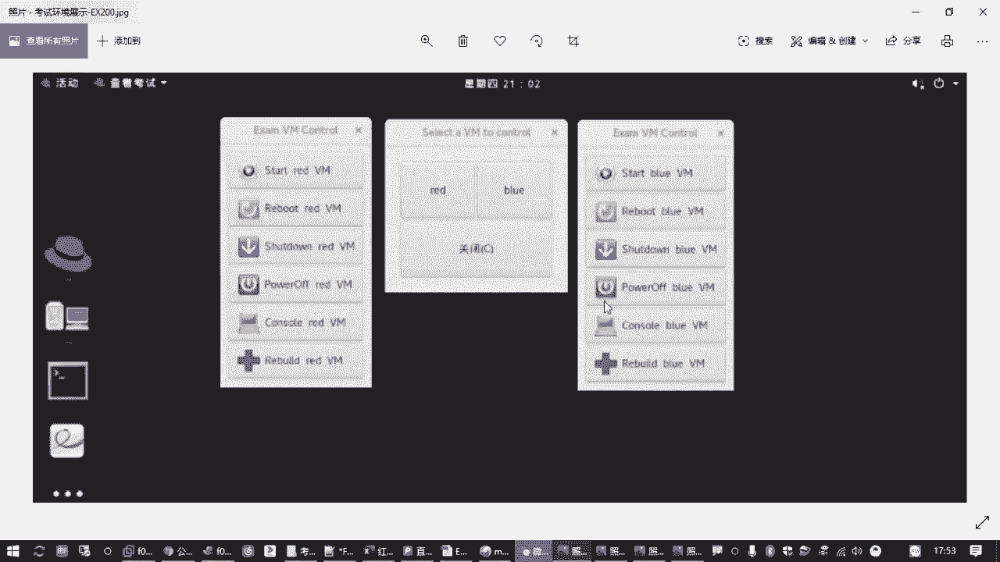

## 重要配置信息解读 📋

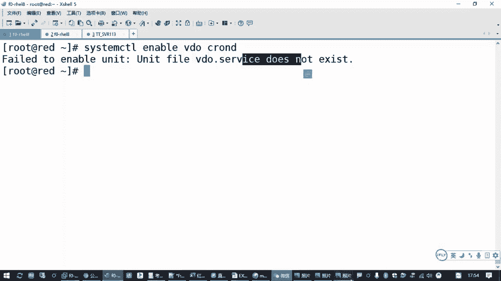

了解了操作界面后，我们来看看考试要求中的核心信息——重要配置信息。

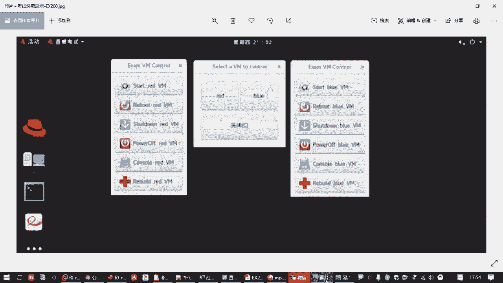

点击红帽图标后，会打开一个浏览器页面，其中包含“重要配置信息”部分。界面语言默认为中文，但可以切换。

这部分信息通常包含以下内容：

1.  **虚拟机信息**：列出考试用到的虚拟机的主机名和IP地址。**注意**：网段可能与练习环境不同，务必以考试信息为准。
2.  **管理员密码**：提供虚拟机的root密码。考试时的密码请以题目要求为准。
3.  **访问方式**：说明可以通过SSH或控制台访问虚拟机。
    *   **强烈建议使用SSH连接**，因为从真机终端通过SSH连接到虚拟机，可以方便地复制粘贴命令和路径，而通过控制台界面则无法复制粘贴。
    *   因此，需要先为虚拟机配置好IP地址。
4.  **防火墙与SELinux**：考试系统防火墙默认不启用，除非题目要求，否则无需操作。SELinux可能开启，需根据题目处理。
5.  **软件源**：会提供软件包仓库的URL地址。
    *   即使题目没有明确要求配置软件源，但如果后续有题目需要安装软件包，你必须自行配置。考试环境无法访问互联网，只能使用提供的软件源。
6.  **重要评测信息**：这是关键部分。考官在收卷前，会运行脚本将你的虚拟机**关机并重新启动**。
    *   **核心要求**：你必须确保所有配置和服务在系统**重启后依然有效**。这意味着你需要将服务设置为开机自启，并确保配置持久化。
    *   例如，`systemctl enable` 服务，在 `/etc/fstab` 中正确配置挂载等。
    *   如果重启后配置丢失，该题可能不得分。

## 答题策略与核心考点回顾 🎯

掌握了环境信息，现在我们回顾一下答题时的策略和需要注意的核心考点。

考试题目会分为两部分，明确要求在哪台虚拟机（如 `red` 或 `blue`）上完成。**务必看清题目要求，不要做错机器**。

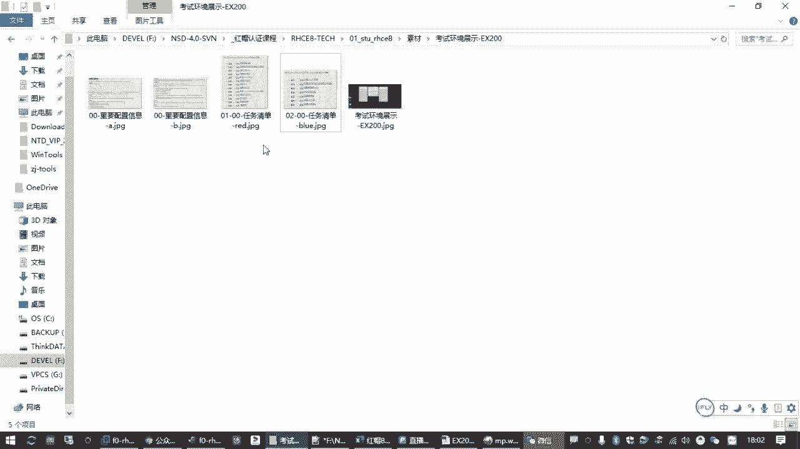

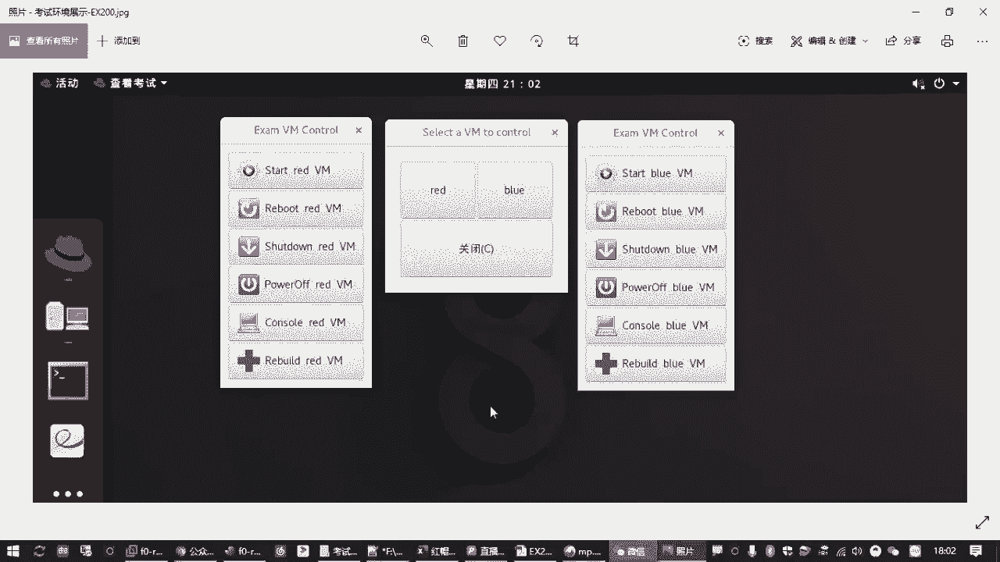

以下是各核心考点的简要回顾与注意事项：

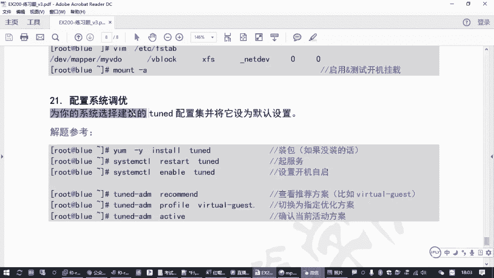

**在第一台虚拟机（如 `red`）上：**
*   **SELinux 排错**：这是相对较难的部分。
    *   需要在SELinux强制模式下，故意让服务（如Web服务）启动失败。
    *   根据错误日志安装排错工具包：`yum install setroubleshoot-server`
    *   再次启动服务，使用 `sealert -l [ID]` 或通过日志提示，获取并执行修复命令。
*   **AutoFS 自动挂载**：配置autofs服务，实现访问特定目录时自动挂载远程设备。
*   **用户与目录管理**：按要求创建用户、组、目录，并设置权限和归属。

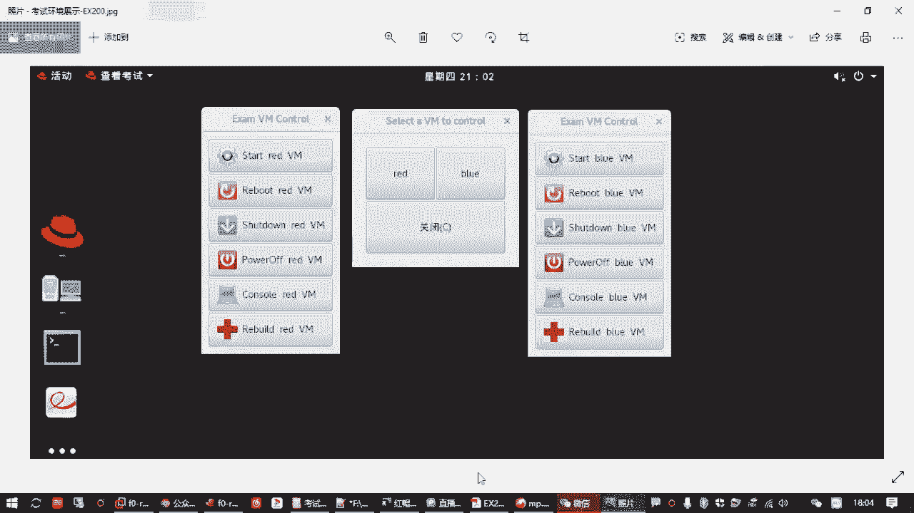

**在第二台虚拟机（如 `blue`）上：**
*   **破解Root密码**：必须非常熟练。在GRUB引导时添加 `rd.break` 参数，进入紧急模式后修改密码。
*   **磁盘分区与管理**：包括创建标准分区、逻辑卷（LVM）、VDO卷等。
    *   **小心操作**，避免破坏系统导致无法启动。
    *   对于VDO卷，在 `/etc/fstab` 中挂载时，需要添加 `_netdev` 或 `x-systemd.requires` 参数，确保网络就绪后再挂载。
*   **系统调优**：使用 `tuned-adm` 配置调优方案。

## 交卷流程与考场纪律 ⚠️

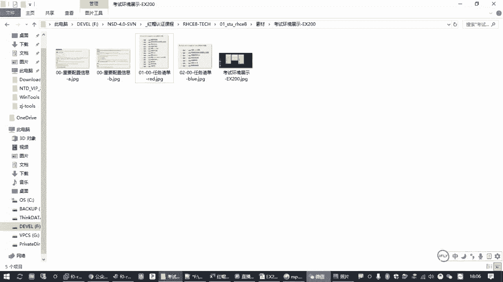

完成所有题目后，正确的交卷流程和遵守考场纪律是最后一步。

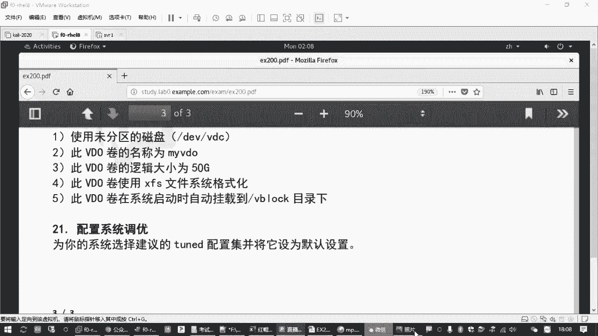

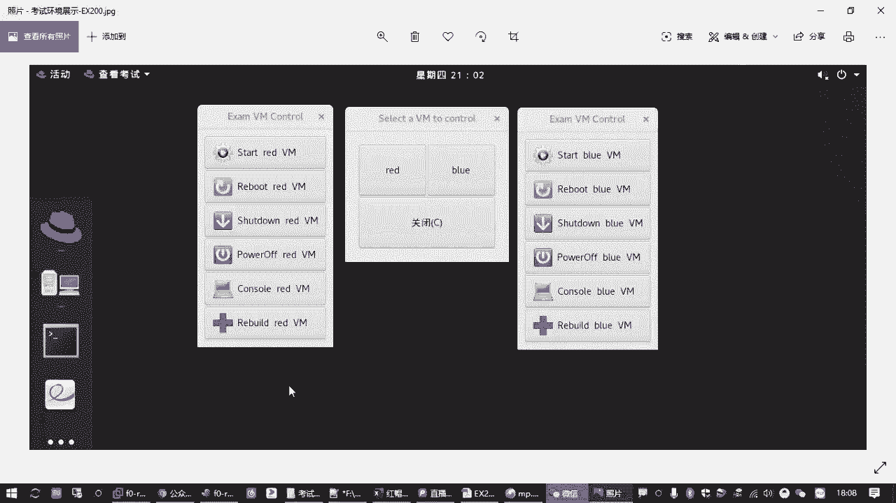

1.  **最终检查**：建议在交卷前，**手动将两台虚拟机关机，然后重新启动**。
2.  **再次验证**：重启后，通过SSH重新连接，逐一检查所有题目的要求是否仍然满足。
3.  **提交考试**：确认无误后，即可告知考官你已完成考试。
4.  **考场纪律**：
    *   考试时，身份证放在座位前，只能携带一支笔，考场会提供草稿纸。
    *   **交卷后，草稿纸必须留在座位上，不得带出考场**，否则可能被记零分。
    *   考试过程中严禁使用手机、资料等，禁止任何形式的作弊。
    *   离开考场后，不得与他人讨论考题。红帽考试有严格的保密协议，违规可能导致**3年禁考甚至终身禁考**。

## 模拟考试与成绩查询 🔍

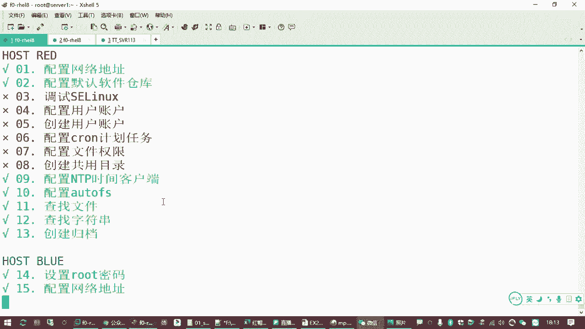

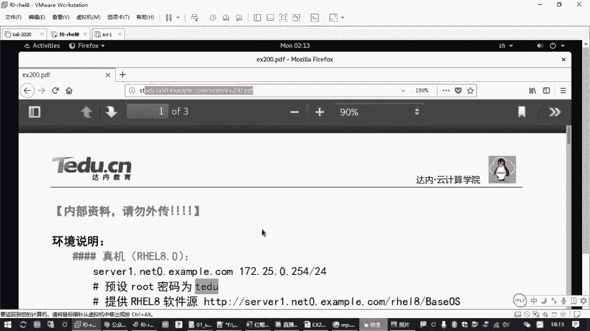

为了帮助大家更好地准备，这里介绍一下模拟练习和成绩查询。

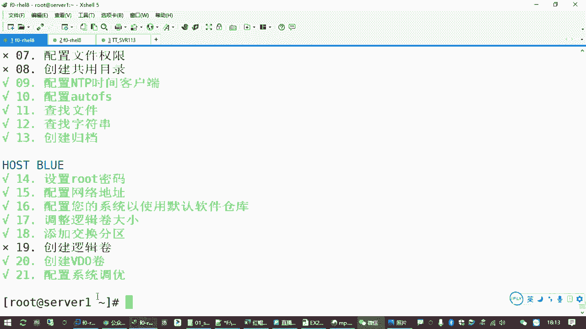

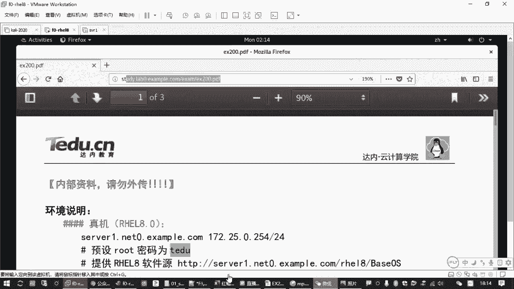

*   **模拟考试**：可以使用练习环境进行全真模拟。在课程QQ群文件中，可以找到一个名为 `RHT-lab-check-8` 的压缩包。
    *   将其上传到虚拟机并解压，在root目录下会得到 `RHT-check-CSA` 脚本。
    *   完成练习题后，运行此脚本可以检查答题结果。
    *   **目标**：在不看资料的情况下，能在1小时内完成所有题目，且脚本检查全部为绿色对勾（通过）。
*   **成绩查询**：考试结束后，通常会在**3个工作日（美国工作日）** 内收到红帽官方发送的邮件通知结果。

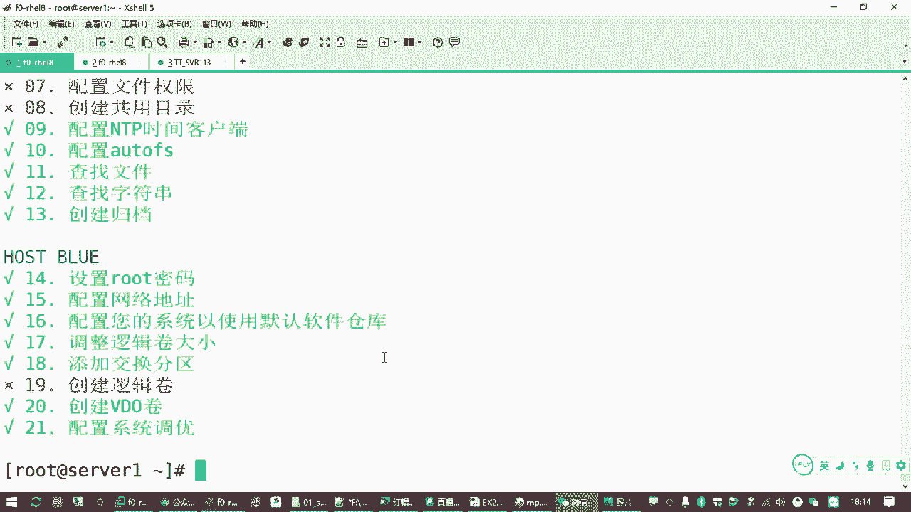

---
**本节课总结**：我们一起全面梳理了RHCSA上午考试的整个流程，从考试环境、重要配置信息解读，到各核心考点的答题策略、交卷前的检查步骤，以及必须严格遵守的考场纪律。请务必熟悉操作界面，理解“重启后配置持久化”的核心要求，并通过模拟考试熟练操作。祝大家考试顺利！