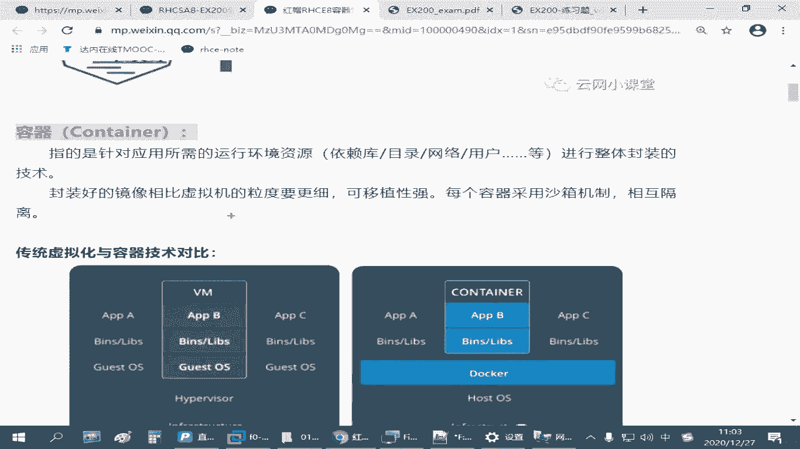

# 红帽认证零基础入门教程：P25：4.01-容器技术介绍 🐳

在本节课中，我们将要学习容器技术的基本概念。容器是一种轻量级的应用封装和交付技术，它可以帮助我们更高效地部署和管理应用程序。我们将了解容器与虚拟机的区别，以及容器技术的核心组件：镜像、容器和仓库。

## 容器技术概述

容器技术是一种应用封装技术。在红帽8系统中，使用 `podman` 工具来管理容器。`podman` 可以看作是 `docker` 命令的替代品，大部分操作是兼容的，但功能更完整，执行效率可能更高。

红帽8系统中的容器技术会整合到更高级的云架构中，例如 OpenShift 和 Kubernetes，这使得在云计算架构部署和迁移时更加方便。然而，在 RHCE 考试中，主要考察在单台红帽8主机上管理容器的能力。

## 核心概念：Podman 与容器

我们需要掌握的核心命令是 `podman`。`pod` 的英文含义是“豆荚”，一个 `pod` 就像一个豆荚，里面可以包含多个“豆子”，即容器。`podman` 就是管理这些“豆荚”的工具。

那么，容器具体是什么呢？对于初次接触这个概念的学习者，可以这样理解：容器是针对某种应用，将其所需的系统环境、依赖的软件包、目录结构、网络配置（如IP地址、端口）和用户账号等，封装在一起的一个整体单位。它就像一个瓶子，用来装东西，容器技术就是一种封装技术。

## 容器与虚拟机的对比

为了更好地理解容器，我们通常将其与传统的虚拟机技术进行对比。

以下是两者的主要区别：

*   **虚拟机**：需要完整的虚拟化平台（如 VMware、VirtualBox）。每个虚拟机都包含一个完整的客户操作系统（如 RHEL、Windows），是独立的、完整的系统环境。这带来了高度的隔离性，但也导致资源占用大、启动慢。
*   **容器**：直接运行在宿主机的操作系统内核之上。每个容器只包含应用及其依赖，共享宿主机的内核。这使得容器更加轻量级，启动更快，资源利用率更高，但隔离性略低于虚拟机。

简单来说，容器可以看作是一个“袖珍版”的虚拟机，或者一个“豪华版”的软件包。它比单个软件包封装了更多内容（依赖、配置），但又比完整的虚拟机更轻量、更灵活。

## 镜像与容器的关系

理解容器技术，必须分清两个核心概念：**镜像** 和 **容器**。

*   **镜像**：是容器的静态模板，是一个只读的文件层集合。它包含了运行应用所需的所有内容（代码、运行时、库、环境变量和配置文件）。镜像类似于虚拟机的“安装光盘”或软件包的“安装文件”。
*   **容器**：是镜像的运行实例。当镜像被启动后，就变成了一个正在运行的容器。容器是动态的、可操作的。这类似于用“安装光盘”安装好并正在运行的“操作系统”。

两者的关系可以概括为：**先有镜像，后有容器**。镜像用于存储和分发，容器用于运行和应用。

## 仓库：镜像的来源

既然需要镜像来创建容器，那么镜像从哪里来呢？答案是 **仓库**。

仓库是集中存放镜像的地方，类似于软件包的“软件源”或“应用商店”。我们可以从仓库下载镜像，也可以将自己构建的镜像推送到仓库。

以下是常见的仓库类型：

*   **官方仓库**：例如红帽的 `registry.access.redhat.com`，Docker 的 `docker.io`。
*   **私有仓库**：企业或个人自己搭建的仓库，用于内部镜像的存储和分发，例如考试环境中可能提供的 `registry.lab.example.com`。

`podman` 与 `docker` 的镜像格式是兼容的，因此通常可以从 Docker 的官方仓库获取镜像。

## 镜像、容器与仓库的协作流程

下图清晰地展示了镜像、容器和仓库三者之间的关系：

以下是这个流程中的关键操作：

*   **从仓库获取镜像**：使用 `podman pull` 命令从仓库下载镜像到本地。
*   **运行容器**：使用 `podman run` 命令，基于本地镜像启动一个容器。
*   **管理容器**：对运行中的容器，可以使用 `podman start/stop/restart` 等命令进行控制。
*   **导入/导出镜像**：可以将本地镜像导出为文件（`podman save`），方便分享或备份；也可以将文件导入为本地镜像（`podman load`）。
*   **推送镜像**：可以将本地构建的镜像上传到仓库（`podman push`）。

## 总结

本节课中，我们一起学习了容器技术的基础知识。我们了解到容器是一种轻量级的应用封装技术，通过 `podman` 工具进行管理。我们重点区分了 **镜像**（静态模板）、**容器**（运行实例）和 **仓库**（镜像存储中心）这三个核心概念，并理解了它们之间的协作关系。容器技术通过共享宿主机内核，实现了比虚拟机更高的效率和资源利用率，同时通过封装应用及其所有依赖，简化了应用的部署和交付流程，是现代云计算和 DevOps 实践中的重要基石。