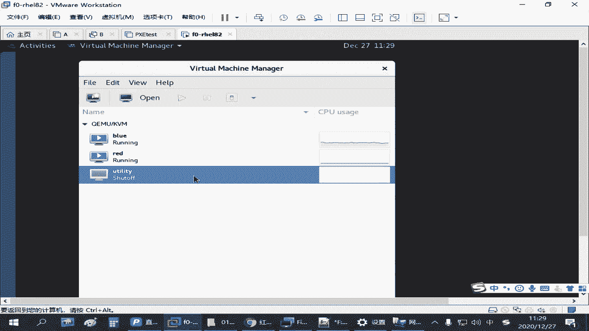
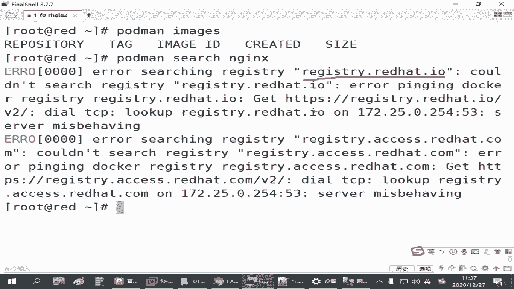
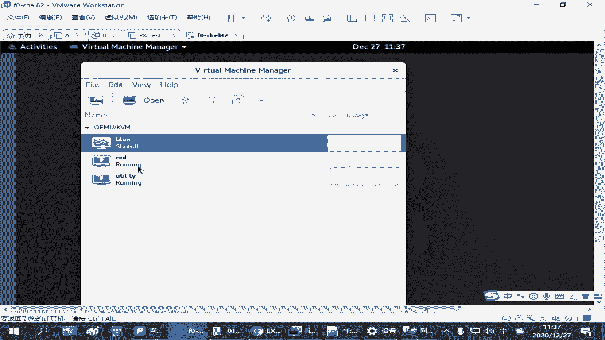
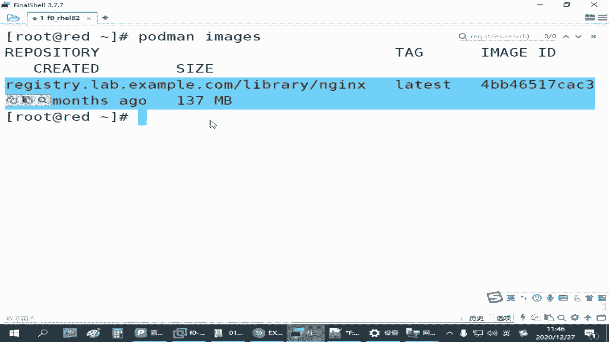

# 红帽认证零基础入门教程：P26：4.02-仓库环境配置 🛠️





在本节课中，我们将学习如何在红帽练习环境中配置容器仓库，以便后续下载和管理容器镜像。这是使用容器技术的第一步。

## 练习环境准备 🖥️

上一节我们介绍了容器的基础概念，本节中我们来看看如何配置仓库环境。首先，需要了解练习环境中提供的仓库服务器。


练习环境提供了一个名为 `utility` 的虚拟机，它专门用作私有容器仓库服务器。这个虚拟机默认已存在，但处于关闭状态以节省系统资源。**请勿删除此虚拟机**，因为它无法还原。

如果你需要练习容器相关操作（如下载镜像），则必须启动此虚拟机。练习完成后，可以将其关闭以释放资源。

## 配置容器主机 🔧

为了在红帽系统上使用容器，我们需要在练习主机（例如 `servera`）上安装必要的软件包并配置仓库。

首先，确保系统已正确配置软件源（YUM源）。然后，安装容器环境所需的模块。

以下是安装容器工具的命令：
```bash
yum module install -y container-tools
```

此命令会安装 `podman` 等核心容器管理工具。如果你习惯使用 `docker` 命令，可以额外安装兼容工具（考试非必需）：
```bash
yum install -y podman-docker
```

安装完成后，核心管理工具是 `podman`。

## 配置仓库访问 🔗

安装好环境后，默认的 `podman` 配置会尝试连接红帽官方仓库，这通常无法访问。因此，我们需要将其指向练习环境提供的私有仓库。





需要修改的配置文件是 `/etc/containers/registries.conf`。

以下是需要修改的两个核心配置项：

1.  **指定搜索仓库**：在 `[registries.search]` 部分，将仓库地址修改为练习环境提供的地址（例如 `registry.lab.example.com`），并移除其他地址。
2.  **添加不安全仓库**：在 `[registries.insecure]` 部分，添加同样的仓库地址。这是因为私有仓库使用的证书不被系统信任，此操作表示你接受此风险。

修改保存后，`podman` 就会从指定的私有仓库搜索和拉取镜像。

## 镜像管理操作 📦

配置好仓库后，我们就可以进行镜像管理了。主要操作包括搜索、拉取和查看镜像。

以下是核心的镜像管理命令：

*   **搜索镜像**：`podman search <镜像关键词>`
    *   此命令用于在配置的仓库中搜索可用的镜像。
*   **拉取镜像**：`podman pull <完整镜像地址>`
    *   此命令用于将远程仓库的镜像下载到本地。
*   **列出镜像**：`podman images`
    *   此命令用于查看本地已下载的所有镜像及其信息（如仓库源、标签、ID、大小）。

一个完整的镜像名称通常由仓库地址、镜像名和标签组成，格式为：`<仓库地址>/<镜像名>:<标签>`。例如：`registry.lab.example.com/nginx:latest`。标签用于区分同一镜像的不同版本。

## 实践步骤演示 🚀

让我们通过一个例子来串联以上步骤。假设我们需要获取一个 `nginx` 镜像。

1.  启动 `utility` 仓库虚拟机。
2.  在练习主机上安装 `container-tools`。
3.  编辑 `/etc/containers/registries.conf`，配置私有仓库地址。
4.  搜索 `nginx` 镜像：
    ```bash
    podman search nginx
    ```
5.  根据搜索结果，拉取镜像：
    ```bash
    podman pull registry.lab.example.com/nginx:latest
    ```
6.  使用 `podman images` 确认镜像已成功下载到本地。

现在，你就拥有了一个可以使用的 `nginx` 容器镜像。

## 总结 📝



本节课中我们一起学习了容器仓库环境的配置。我们首先认识了练习环境中的私有仓库服务器，然后在主机上安装了容器工具 `podman`。接着，通过修改配置文件，将 `podman` 的仓库源指向我们的私有服务器。最后，我们掌握了使用 `podman search`、`podman pull` 和 `podman images` 命令来搜索、下载和管理镜像的基本流程。这是后续运行和管理容器的基础，请务必掌握。