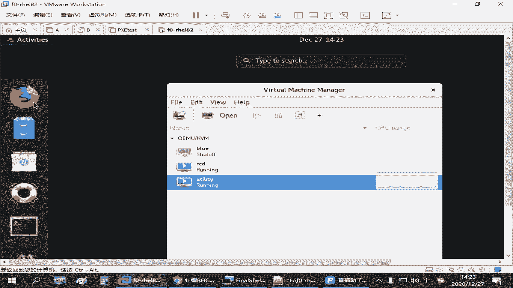

# 红帽认证/RHCE/RHCSA 零基础入门教程：P27：4.03-podman镜像操作

## 概述
在本节课中，我们将学习如何使用 `podman` 命令来管理容器镜像。这包括搜索、下载、查看、删除、备份和导入镜像等核心操作。掌握这些命令是有效使用容器技术的基础。

---

## 镜像管理基础操作
部署好容器环境后，需要单独管理镜像。`podman` 提供了多种指令来完成这些任务。

以下是管理镜像的几种主要方法：

*   **搜索镜像**：使用 `podman search` 命令。
*   **下载镜像**：使用 `podman pull` 命令。
*   **查看镜像**：使用 `podman images` 命令。
*   **删除镜像**：使用 `podman rmi` 命令。
*   **备份镜像**：使用 `podman save` 命令。
*   **导入镜像**：使用 `podman load` 命令。

> **注意**：上传镜像通常使用 `podman push` 命令，但这通常需要拥有特定仓库的账号和权限，因此本教程暂不涉及。

---

## 镜像仓库登录
上一节我们介绍了基本的镜像操作命令，本节中我们来看看一个可能需要的辅助操作：登录镜像仓库。

如果镜像仓库需要验证用户身份，则必须先登录才能进行上传或下载等操作。如果仓库是公开的，则登录不是必须的。

登录命令格式如下：
```bash
podman login <仓库地址>
```
执行命令后，系统会提示输入用户名和密码。例如，在练习环境中，用户名为 `admin`，密码为 `redhat321`。登录成功后，即可与需要认证的仓库进行交互。

> **提示**：大多数公共镜像仓库（如 Docker Hub 的公共镜像）允许直接下载，无需登录。

---

## 搜索与下载镜像
现在，我们来详细看看如何搜索和获取镜像。

要搜索镜像，使用 `podman search` 命令后跟关键词：
```bash
podman search <关键词>
```
如果仓库中存在相关镜像，命令会列出搜索结果。

要下载镜像，使用 `podman pull` 命令并指定完整的镜像地址：
```bash
podman pull <仓库地址/路径/镜像名:标签>
```
这是推荐的做法。如果镜像已存在，则不会重复下载。

---

## 查看与检查镜像
下载镜像后，我们需要知道如何查看它们。

使用 `podman images` 可以列出当前环境中已有的所有镜像。

如果想查看某个镜像的详细配置信息（如基于何种系统创建、创建时间等），可以使用 `inspect` 命令：
```bash
podman image inspect <镜像名>
```
指定镜像名时，如果简写（如 `nginx`）能唯一确定一个镜像，则可以直接使用。否则，需要提供完整的镜像路径和标签。

---

## 删除镜像
当某个镜像不再需要时，可以将其删除以释放空间。

删除镜像使用 `podman rmi` 命令：
```bash
podman rmi <镜像名或ID>
```
为了准确删除，建议使用完整的镜像名和标签（例如 `registry.lab.example.com/nginx:latest`）。如果只使用简写（如 `nginx`），可能会匹配到多个镜像，导致删除不准确。

镜像删除后，若需再次使用，可以从仓库重新下载或从备份文件导入。

---

## 备份与导入镜像
有时我们需要离线迁移或备份镜像，这时就需要用到导出和导入功能。

要将一个已有的镜像备份到本地文件，使用 `podman save` 命令：
```bash
podman save -o <备份文件路径> <镜像名>
```
例如，`podman save -o /root/pod_image_nginx.tar registry.lab.example.com/nginx:latest` 会将镜像导出到指定文件。

当需要从备份文件恢复镜像时，使用 `podman load` 命令：
```bash
podman load -i <备份文件路径>
```
导入时，可以指定新的镜像名称和标签。如果备份文件中的镜像层已存在，系统会跳过这些层。

---

## 管理镜像标签
在管理镜像时，我们有时需要修改其名称或标签。

可以使用 `podman tag` 命令为镜像创建一个新的标签（别名）：
```bash
podman tag <原镜像名:标签> <新镜像名:新标签>
```
执行后，会创建一个指向同一镜像层的新标签，而不会占用额外磁盘空间。之后，可以使用 `podman rmi` 删除旧的标签。




---


## 通过Web界面访问仓库
除了命令行，我们还可以通过浏览器直接访问镜像仓库的Web界面进行查看。

例如，在浏览器中访问 `https://registry.lab.example.com`，输入用户名 (`admin`) 和密码 (`redhat321`) 登录后，可以直观地看到仓库中可用的镜像列表，并进行搜索等操作。

这有助于更直观地理解镜像仓库的结构和内容。

---


## 总结
本节课中我们一起学习了使用 `podman` 管理容器镜像的全套基本操作。我们涵盖了从搜索 (`search`)、下载 (`pull`)、查看 (`images`, `inspect`)，到删除 (`rmi`)、备份 (`save`)、导入 (`load`) 以及修改标签 (`tag`) 和仓库登录 (`login`) 等关键命令。通过练习这些命令，你将能够有效地在本地环境中准备和管理容器镜像，为后续运行容器应用打下坚实基础。