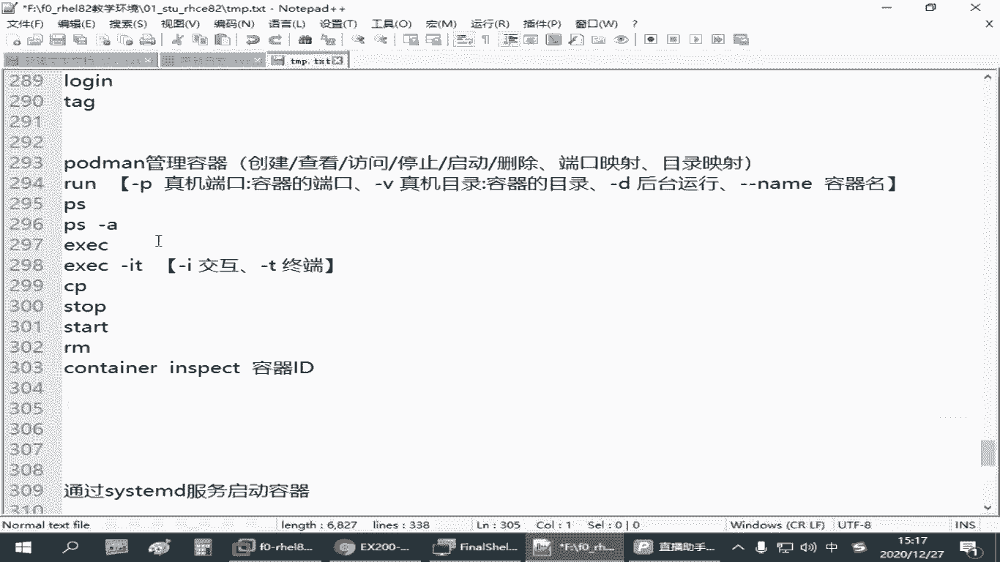
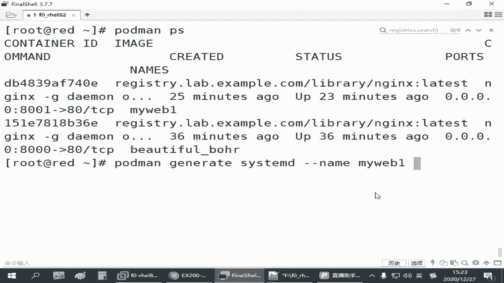
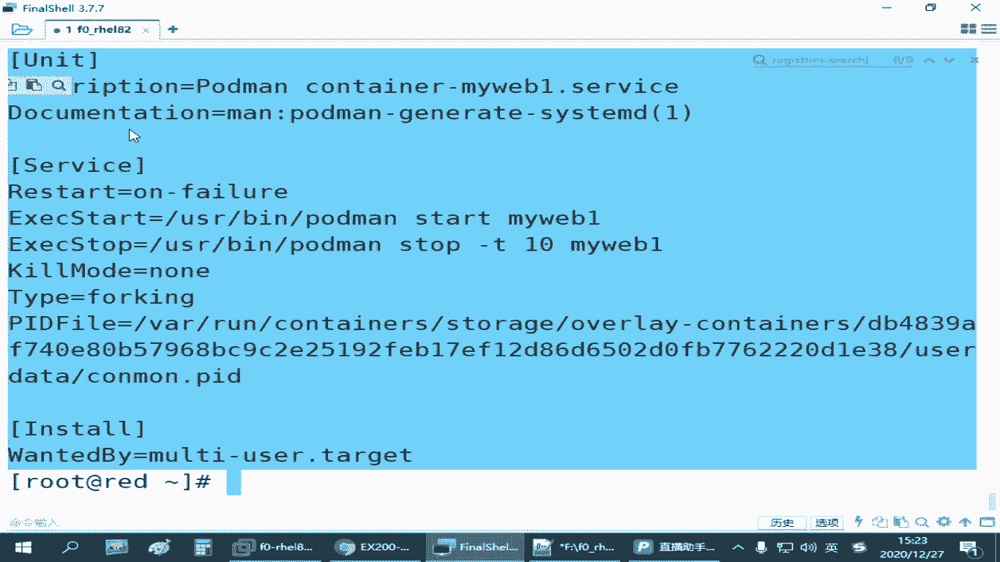

# 红帽认证零基础入门教程：P29：4.05-容器服务化 🚀



在本节课中，我们将学习如何将手动运行的容器配置为系统服务，实现容器的开机自启动，从而简化运维管理。

上一节我们介绍了如何手动运行容器并提供服务。本节中我们来看看如何让容器像系统服务一样，在主机重启后自动运行。

## 手动容器的局限性

手动通过 `podman run` 命令启动的容器是临时的。一旦 Red Hat 主机重启，容器不会自动启动，需要管理员再次手动执行命令。对于参数复杂的命令，每次手动操作效率低下。

## 容器服务化的目标

容器服务化的目标是将运行容器的长命令转化为一个系统服务。这样，Red Hat 主机在开机时就能自动运行该容器，减轻管理员负担。

## 实现容器服务化的关键步骤

要实现通过 systemD 服务启动容器，需要了解以下三个方面：
1.  Linux 系统服务的配置文件存放位置。
2.  如何快速生成指定服务的配置文件。
3.  如何启动和启用生成的服务。

以下是关于系统服务配置文件的说明：
*   **系统默认服务配置目录**：`/usr/lib/systemd/system/`。此目录存放系统原始的 `.service` 等配置文件。
*   **管理员自定义服务配置目录**：`/etc/systemd/system/`。建议将自定义的系统服务配置文件放在此目录下，文件后缀通常为 `.service`。

我们需要在 `/etc/systemd/system/` 目录下为容器创建一个服务配置文件。创建后，需要通知系统重新加载配置，之后便可像管理其他系统服务一样管理该容器。

## 生成服务配置文件

Podman 提供了快速生成服务配置的命令。该命令会读取一个**正在运行**的容器的配置信息，并生成对应的 systemD 服务文件。



命令格式如下：
```bash
podman generate systemd --name <容器名称>
```



例如，我们已有一个名为 `myweb1` 的容器在运行。要为其生成服务配置，可以执行：
```bash
podman generate systemd --name myweb1
```
执行后，配置内容会显示在屏幕上。为了将其保存为文件，需要添加 `--files` 参数。

更便捷的做法是，直接进入目标目录并执行生成命令，这样文件会自动保存在正确位置。操作步骤如下：
```bash
# 1. 切换到服务配置目录
cd /etc/systemd/system/


# 2. 生成并保存服务配置文件
podman generate systemd --name myweb1 --files
```
此命令会在当前目录生成一个名为 `container-myweb1.service` 的配置文件。

## 启用并管理容器服务

生成配置文件后，需要让系统识别并加载这个新服务。

以下是启用和管理服务的步骤：
1.  **重新加载 systemD 配置**：执行 `systemctl daemon-reload`，让系统识别新添加的服务配置文件。
2.  **停止原手动容器**：使用 `podman stop <容器ID或名称>` 停止之前手动运行的容器。**注意**：此处使用 `stop` 而非 `rm`，删除容器会导致服务因找不到容器而失效。
3.  **使用服务方式启动容器**：使用 `systemctl start container-myweb1.service` 命令通过服务启动容器。
4.  **检查服务状态**：使用 `systemctl status container-myweb1.service` 确认容器服务是否正常运行。
5.  **设置开机自启**：使用 `systemctl enable container-myweb1.service` 命令，将服务设置为开机自动启动。
6.  **验证**：重启主机后，通过访问容器提供的服务（如 `curl localhost:8001`）来验证是否成功实现开机自启。


## 操作命令总结

以下是实现容器服务化的核心命令流程：
```bash
# 进入服务配置目录
cd /etc/systemd/system/

# 基于正在运行的容器‘myweb1’生成服务文件
podman generate systemd --name myweb1 --files

# 重新加载systemD配置
systemctl daemon-reload

# 停止原手动容器 (假设容器ID为db48)
podman stop db48

# 通过服务启动容器
systemctl start container-myweb1.service

# 设置开机自启
systemctl enable container-myweb1.service

# 重启主机进行验证
reboot
```


本节课中我们一起学习了如何将 Podman 容器转化为系统服务。关键步骤包括：进入正确的配置目录，使用 `podman generate systemd` 命令生成服务文件，通过 `systemctl daemon-reload` 加载配置，最后使用 `systemctl` 系列命令启停和管理服务。掌握这个方法后，就能实现容器的持久化运行与自动化管理。