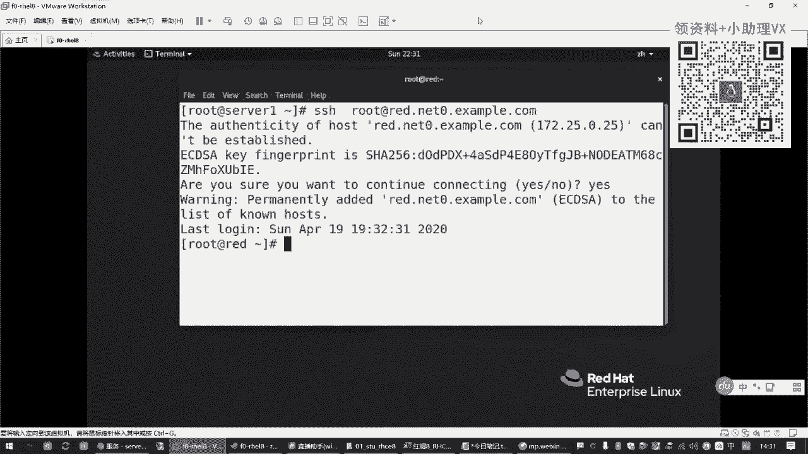
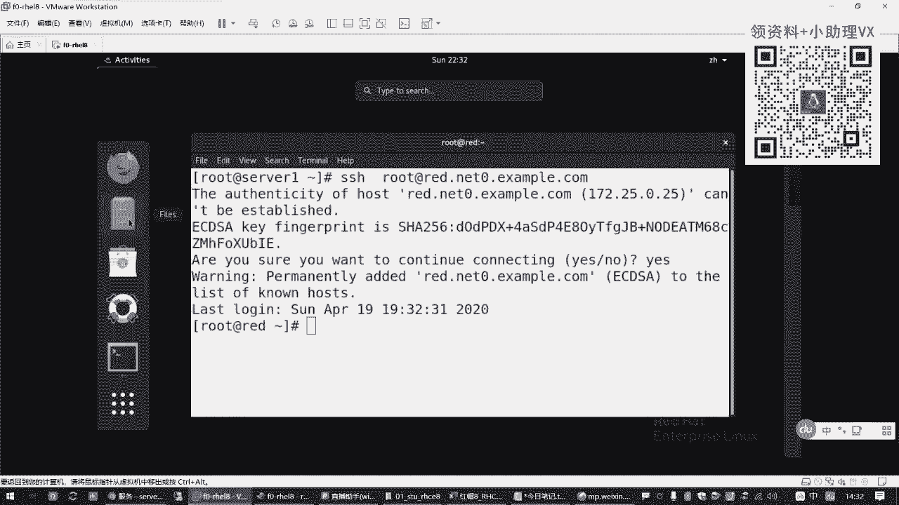
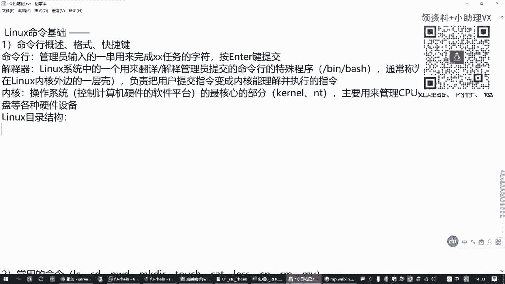
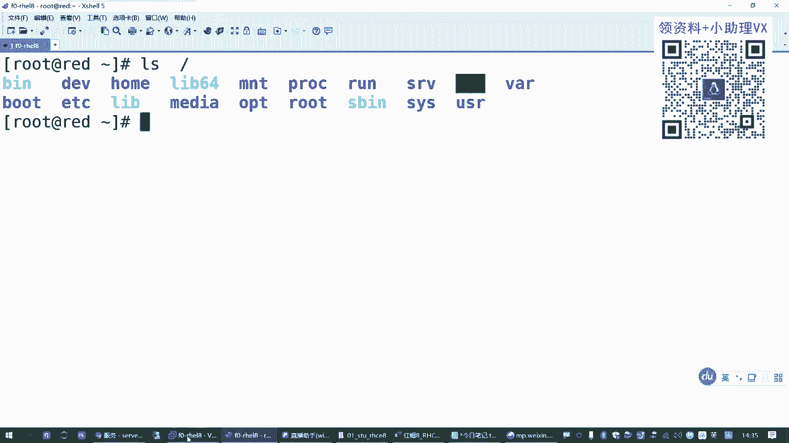
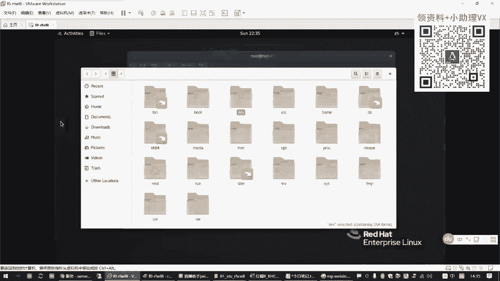
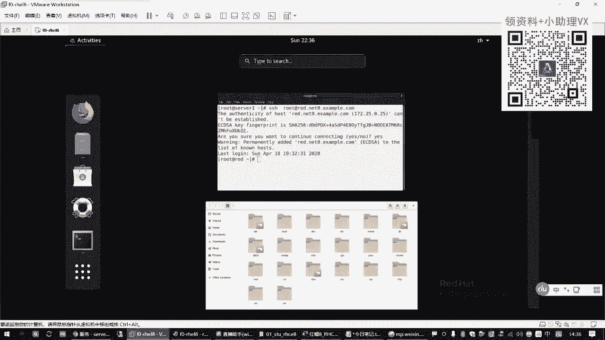
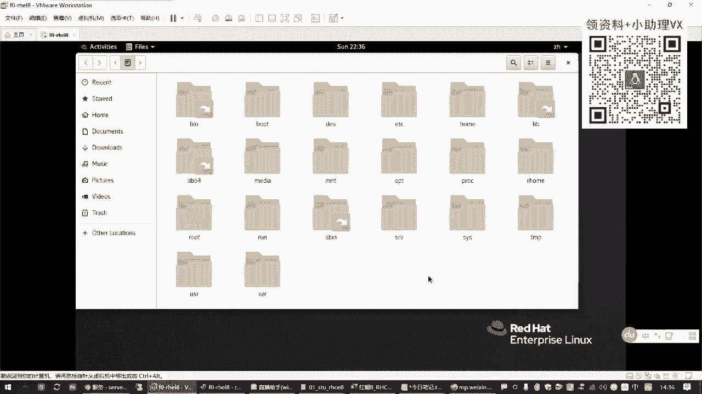
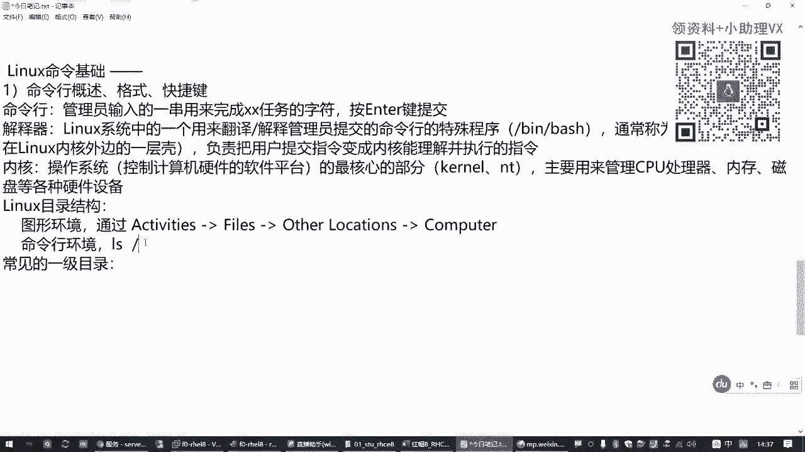
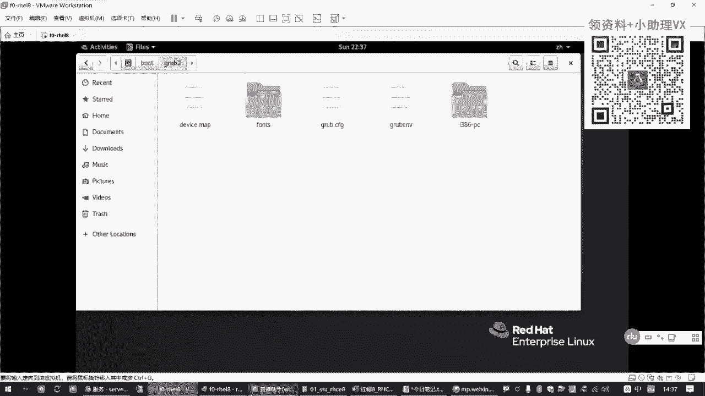
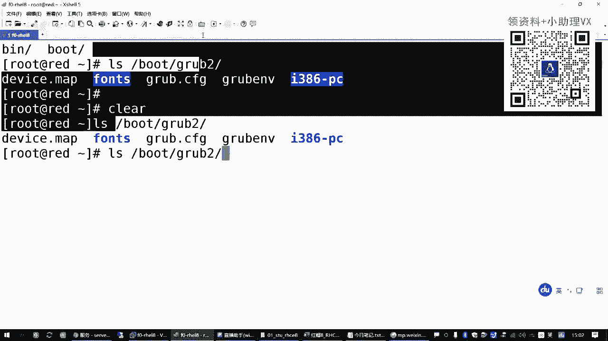

# Linux命令基础：1.01：命令行概述与基础概念 📚

在本节课中，我们将要学习Linux命令行的核心基础概念。这对于后续学习系统管理和服务配置至关重要。我们将从命令行是什么开始，逐步了解其工作原理、目录结构以及基本的使用格式和技巧。

## 命令行概述 💻

上一节我们介绍了课程的整体安排，本节中我们来看看什么是命令行。

命令行是由管理员输入的一串字符，其作用是完成某个特定的系统任务。在按回车键提交之前，这一串字符就是一个命令行。例如，输入 `ip address list` 命令可以查看网络接口的IP地址信息。如果系统能识别并执行这条命令，说明它“听懂”了管理员的指令。

## 解释器与内核 ⚙️

为什么Linux系统能“听懂”我们输入的命令呢？这依赖于一个特殊的程序——解释器。

解释器是Linux系统中的一个特殊程序，其作用是将管理员输入的、人类可读的命令行，翻译成操作系统内核能够理解和执行的指令。如果没有解释器，管理员将无法与系统交互。






在Linux系统中，这个解释器通常被称为“Shell”（外壳），其最常见的程序文件路径是 `/bin/bash`。它位于操作系统内核之外，充当用户与内核之间的翻译官。




*   **内核**：是操作系统的核心，直接管理计算机的硬件资源，如CPU、内存、硬盘等。它只能理解底层的机器指令。
*   **解释器 (Shell)**：接收用户命令，将其翻译成内核能执行的指令，并返回结果给用户。


它们的关系可以概括为：**用户 -> 解释器 (Shell) -> 内核 -> 硬件**。






## Linux目录结构 📁






要有效地使用命令行管理文件，必须了解Linux的目录结构。它与Windows系统不同，采用一种树形结构。





最顶层的目录称为“根目录”，用一个单独的斜杠 (`/`) 表示。所有其他目录和文件都位于根目录之下，形成层级关系。目录层次之间同样使用斜杠 (`/`) 进行分隔。

例如，路径 `/boot/grub2/grub.cfg` 表示：在根目录 (`/`) 下，进入 `boot` 目录，再进入其子目录 `grub2`，找到文件 `grub.cfg`。

以下是Linux系统中一些常见的一级目录及其用途：


*   `/bin` 与 `/sbin`：存放可执行的命令文件。`/sbin` 下的命令通常需要管理员权限才能执行。
*   `/dev`：存放设备文件，代表系统中的硬件设备，如硬盘、光盘等。
*   `/home`：普通用户的主目录所在地。例如，用户 `zhangsan` 的主目录通常是 `/home/zhangsan`。
*   `/root`：系统管理员 (`root`) 的专属主目录。
*   `/boot`：存放系统启动所需的文件，切勿随意删除。
*   `/etc`：存放系统的配置文件。
*   `/tmp`：存放临时文件。
*   `/var`：存放经常变化的文件，如日志、邮件等。
*   `/mnt` 与 `/media`：用于挂载外部存储设备（如U盘、光盘）的目录。`/mnt` 通常用于手动挂载，`/media` 用于系统自动识别并挂载。

## 命令行的基本格式 📝

了解了目录结构后，我们来看看命令行的书写格式。一条完整的Linux命令通常由三部分组成：

**命令字 [选项] [参数]**

*   **命令字**：即命令的名称，是必须的部分，表示要执行的操作。例如 `ls` (list)。
*   **选项**：用于调节命令的具体行为或输出格式，以短横线 (`-`) 开头。多个单字母选项可以合并，例如 `-l -h` 可以写成 `-lh`。
*   **参数**：命令操作的对象，通常是文件或目录的路径。一个命令可以有多个参数。

**示例：**
```bash
ls -lh /boot /etc
```
*   `ls` 是命令字，表示“列出”。
*   `-lh` 是选项（`-l` 表示以长格式显示详细信息，`-h` 表示以人类易读的格式显示文件大小）。
*   `/boot` 和 `/etc` 是两个参数，表示要列出这两个目录的内容。

## 常用快捷键 🚀

熟练使用快捷键可以极大提高命令行操作效率。以下是几个最常用的快捷键：

*   **Tab键**：命令/路径补全。输入命令或路径的前几个字母后按Tab，系统会自动补全。如果存在多个可能，按两次Tab会列出所有选项。
*   **Ctrl + C**：中断当前正在运行的任务。
*   **Ctrl + L** 或 **输入 `clear` 命令**：清空当前终端屏幕。
*   **Esc + .**：快速粘贴上一条命令的最后一个参数到当前光标位置。

## 总结 ✨

本节课中我们一起学习了Linux命令行的基础核心概念。我们首先明白了命令行是用户与系统交互的指令，然后了解了**解释器 (Shell)** 作为“翻译官”的角色，以及它与**内核**的关系。接着，我们熟悉了Linux独特的**树形目录结构**和几个关键目录的用途。之后，我们掌握了命令行**命令字 [选项] [参数]** 的基本格式。最后，学习了一些提高效率的**常用快捷键**。这些知识是后续所有Linux操作和学习的基石，请务必理解和掌握。





下一节，我们将开始学习具体的常用命令，从文件目录操作开始。