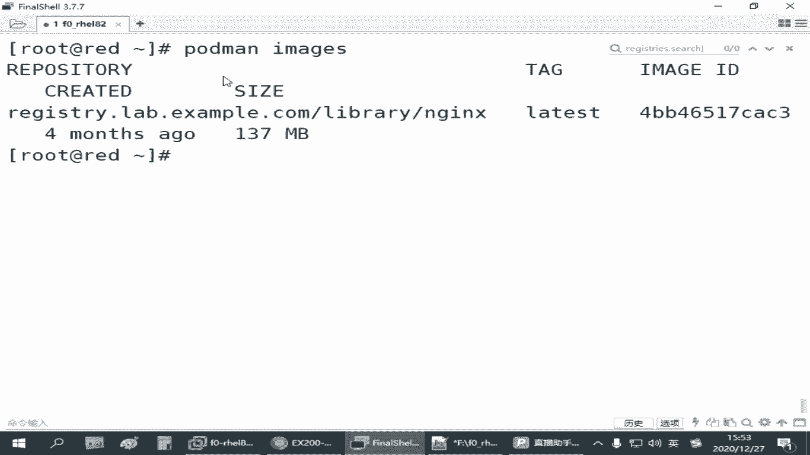
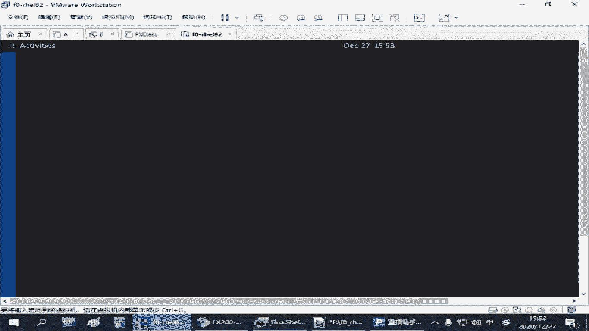
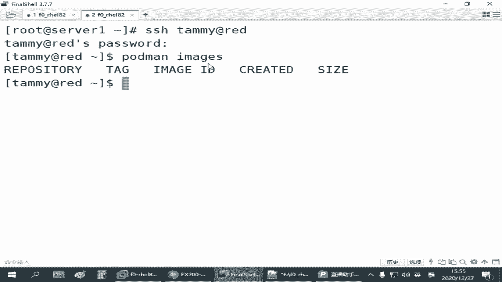
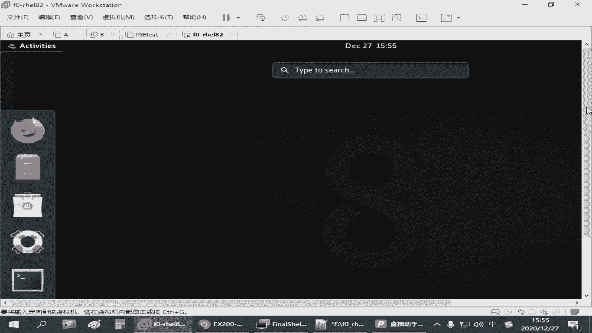
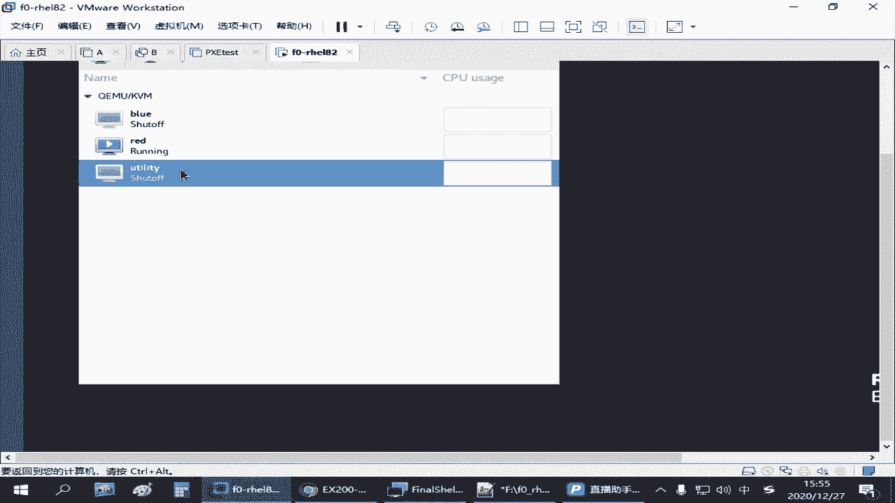
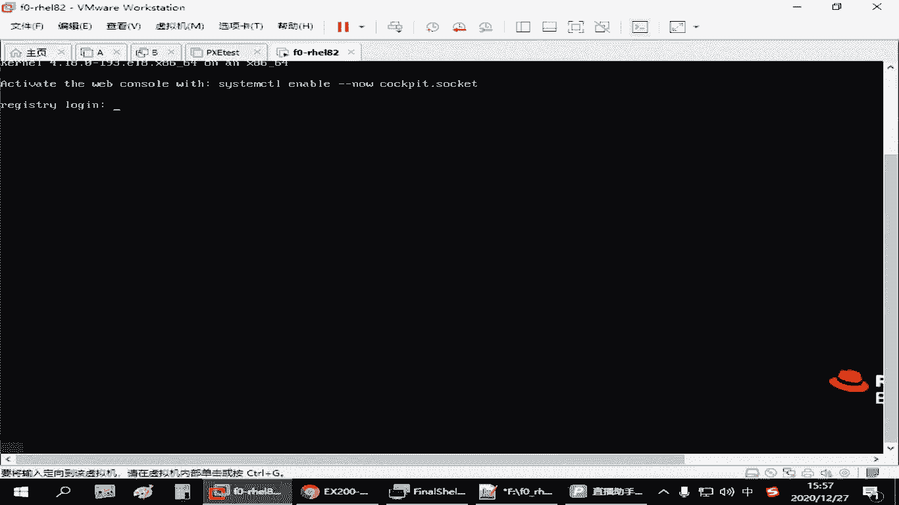
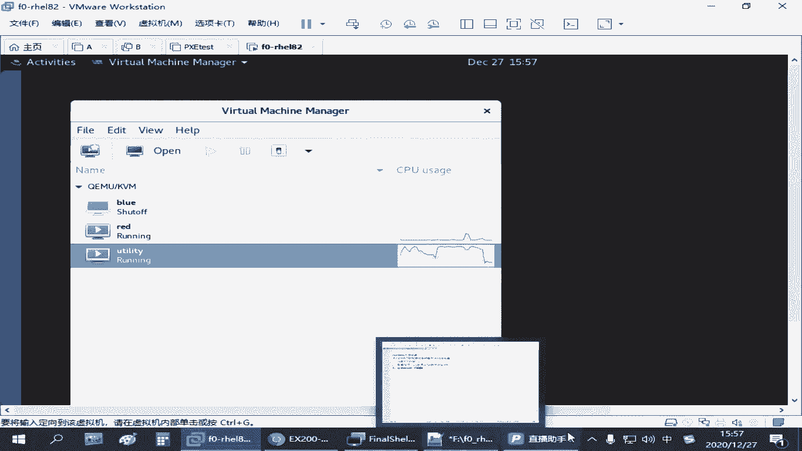
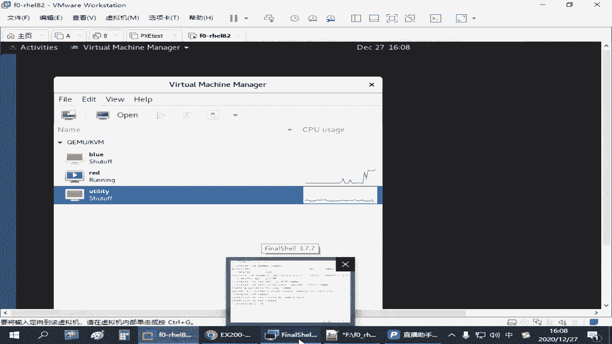

# 红帽认证零基础入门教程：P30：4.06-rootless无根环境 🐳

## 概述
在本节课程中，我们将学习红帽认证考试中的一个重要概念：**rootless无根环境**。我们将了解普通用户（非root用户）如何在没有管理员权限的情况下运行和管理容器，包括配置系统服务、处理端口映射以及确保服务开机自启。本节内容将帮助你理解容器技术在多用户环境下的应用和配置差异。

---

## 无根环境的概念
上一节我们介绍了管理员如何管理容器。本节中，我们来看看普通用户如何操作。

**rootless无根环境**指的是在没有管理员权限（即非root用户）的情况下运行和管理容器。这主要针对非root用户，探讨他们如何通过系统服务来启用和管理容器。

这个操作与之前用管理员身份进行的实验有一些区别。

---

## 普通用户运行容器的限制与许可
以下是普通用户运行容器时需要注意的几个关键点：



1.  **端口限制**：普通用户正常情况下只能开启1024以上的端口。1024以下的端口是系统保留范围，不允许非root用户使用。
2.  **容器运行许可**：普通用户默认被允许运行容器。因为容器的设计初衷就是为用户提供一个隔离的独立环境。
3.  **系统服务配置**：普通用户需要解决如何添加和管理自己的系统服务。



---

## 用户级系统服务的配置目录
普通用户的系统服务配置目录与管理员环境是分开的。

配置目录位于用户的家目录下，是一个以点开头的隐藏目录：
```
~/.config/systemd/user/
```
我们需要将服务配置文件放在这个目录下，然后更新系统服务配置。

用户的系统服务与管理员的系统服务是隔离的。例如，普通用户创建一个名为 `myweb3` 的容器服务，管理员是看不见的；反之，管理员创建的服务，普通用户可能看得见但没有操作权限。




---





## 管理用户服务的命令差异
普通用户在使用 `systemctl` 命令管理自己定义的服务时，需要加上 `--user` 选项。

命令格式如下：
```bash
systemctl --user [选项] [服务名]
```
选项可以是 `daemon-reload`、`start`、`stop`、`enable` 等。

---

## 用户容器的存储隔离
在启用容器时，用户的容器存储也是独立的。


用户的容器存储位于：
```
~/.local/share/containers/
```
这意味着管理员下载的镜像，普通用户无法直接使用。普通用户需要单独下载自己所需的镜像。





---

## 实践：以普通用户身份操作
根据红帽官方教程，要使用用户空间的服务，不能使用 `su` 或 `sudo` 切换到普通用户，而需要通过SSH直接登录到该用户账户。因为系统需要完整的登录过程来准备相关资源。

我们创建一个名为 `timy` 的用户来演示。

1.  创建用户并设置密码：
    ```bash
    useradd timy
    passwd timy
    # 设置密码为 tedu.cn
    ```

2.  通过SSH登录到 `timy` 用户。

3.  检查镜像。此时用户自己的镜像库是空的：
    ```bash
    podman images
    ```

4.  搜索并下载镜像（需要确保本地仓库已启动并可用）：
    ```bash
    podman search nginx
    podman pull nginx
    ```

5.  准备网页文件。在用户家目录下创建目录和网页：
    ```bash
    mkdir ~/container-www
    echo “timy’s site” > ~/container-www/index.html
    ```

6.  运行一个Nginx容器，映射端口和目录：
    ```bash
    podman run -d -p 8080:80 -v ~/container-www:/usr/share/nginx/html --name myweb3 nginx
    ```

7.  测试容器是否运行成功：
    ```bash
    curl localhost:8080
    # 应能显示 “timy’s site”
    ```

---

## 将用户容器配置为系统服务
如果我们要把容器变成用户级的系统服务，需要以下步骤：

1.  创建用户级systemd配置目录（如果不存在）：
    ```bash
    mkdir -p ~/.config/systemd/user/
    ```

2.  进入该目录，并生成容器服务的systemd单元文件：
    ```bash
    cd ~/.config/systemd/user/
    podman generate systemd --name myweb3 --files
    ```

3.  重新加载systemd配置，使新服务生效：
    ```bash
    systemctl --user daemon-reload
    ```

4.  停止之前直接运行的容器实例，改为通过服务管理：
    ```bash
    podman stop -l
    systemctl --user start myweb3
    ```

5.  可以设置服务开机自启：
    ```bash
    systemctl --user enable myweb3
    ```

---

## 实现用户服务的开机自启
对于普通用户的服务，仅使用 `enable` 可能无法在系统启动时自动运行，因为用户可能并未登录。

**方法一：使用 `loginctl` 启用用户驻留**
这个方法通知系统，即使该用户未登录，也为其保留并启动服务的资源。

1.  为用户启用驻留：
    ```bash
    loginctl enable-linger timy
    ```

2.  检查状态：
    ```bash
    loginctl show-user timy | grep Linger
    # 输出中应有 Linger=yes
    ```

**方法二：通过用户计划任务实现**
如果上述方法在某些环境下不生效，可以配置用户的cron任务，在开机时启动服务。

1.  编辑当前用户的cron表：
    ```bash
    crontab -e
    ```




2.  添加一行，使用 `@reboot` 表示在每次启动时运行：
    ```
    @reboot /usr/bin/systemctl --user restart myweb3.service
    ```
    *注意：请根据系统实际情况确认 `systemctl` 的绝对路径。*


这种方法利用了cron的特性，即允许用户设置不依赖登录的定时任务。

---

## 总结
本节课我们一起学习了 **rootless无根环境** 的核心概念与配置方法。

我们了解到：
*   普通用户可以在特定目录（`~/.config/systemd/user/`）下管理自己的系统服务。
*   管理用户服务时，必须在 `systemctl` 命令后添加 `--user` 选项。
*   用户的容器镜像和存储与管理员环境是隔离的。
*   实现用户服务开机自启有两种主要方式：使用 `loginctl enable-linger` 或配置用户的 `@reboot` cron任务。


掌握这些知识，能够帮助你在没有root权限的生产或考试环境中，有效地部署和管理容器化应用。