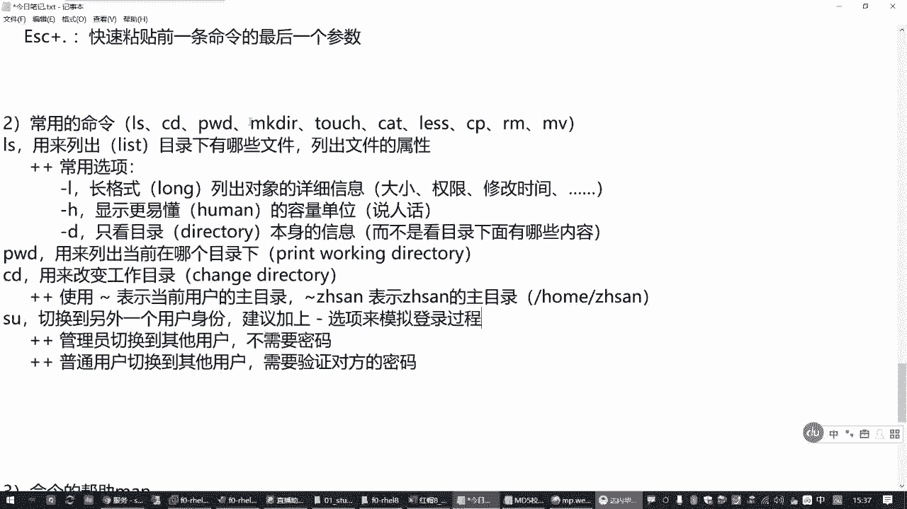
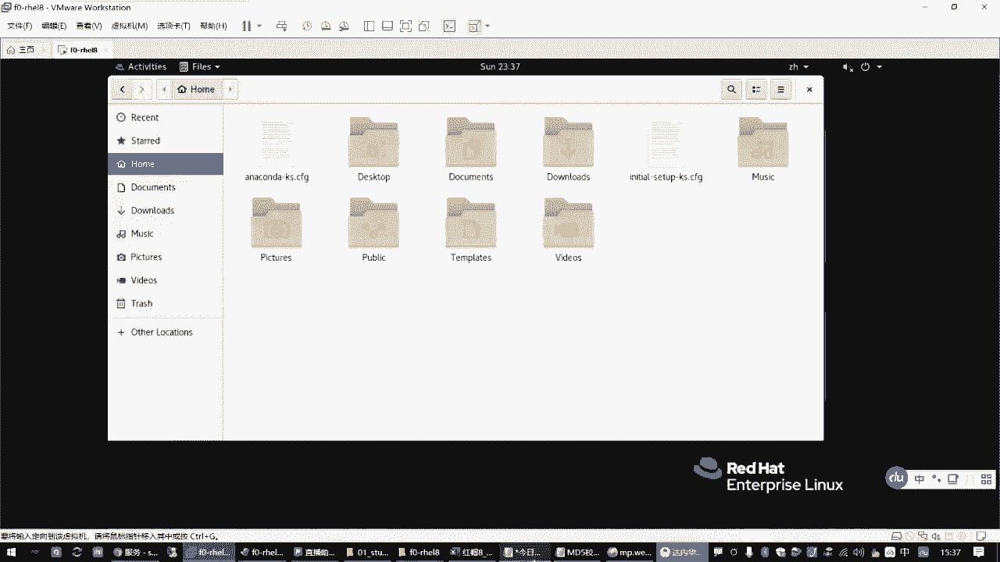
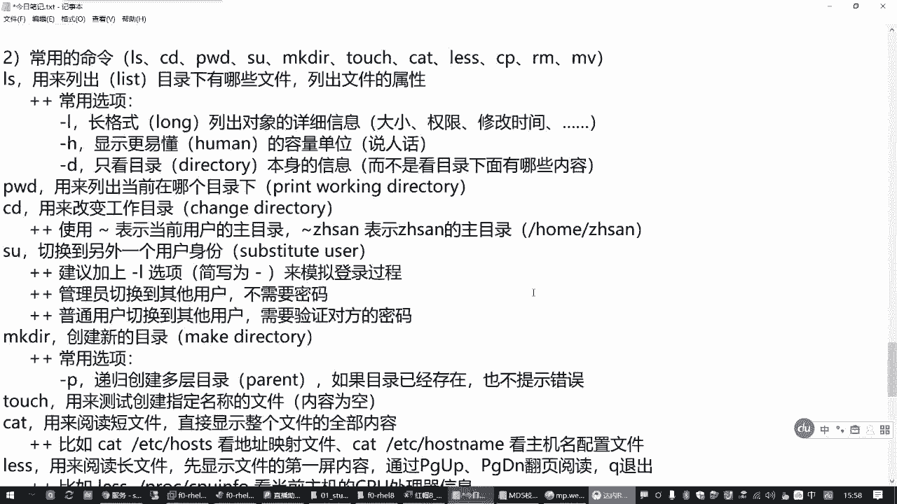
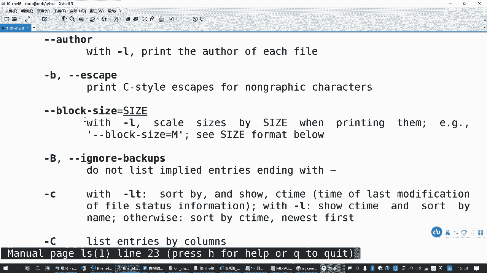
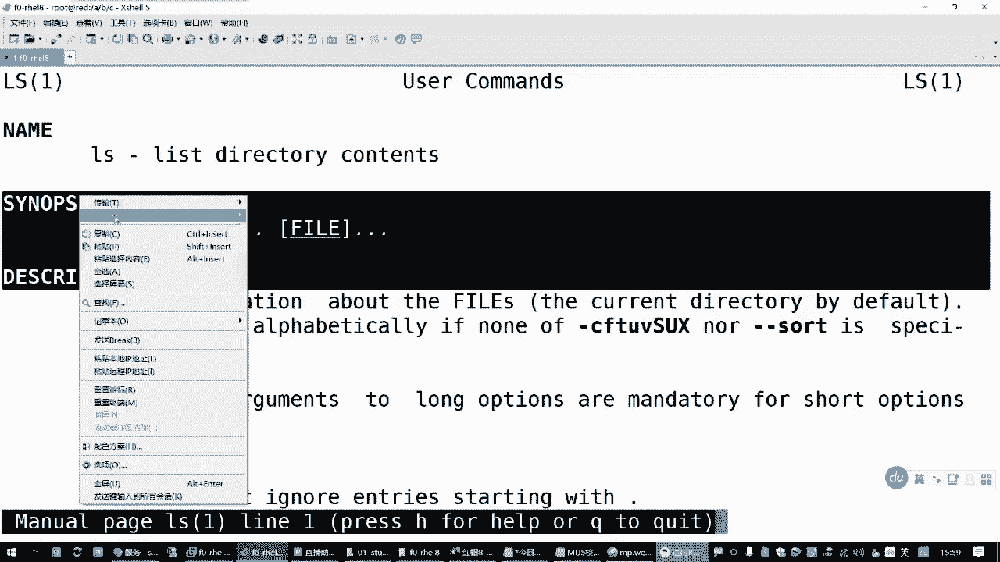
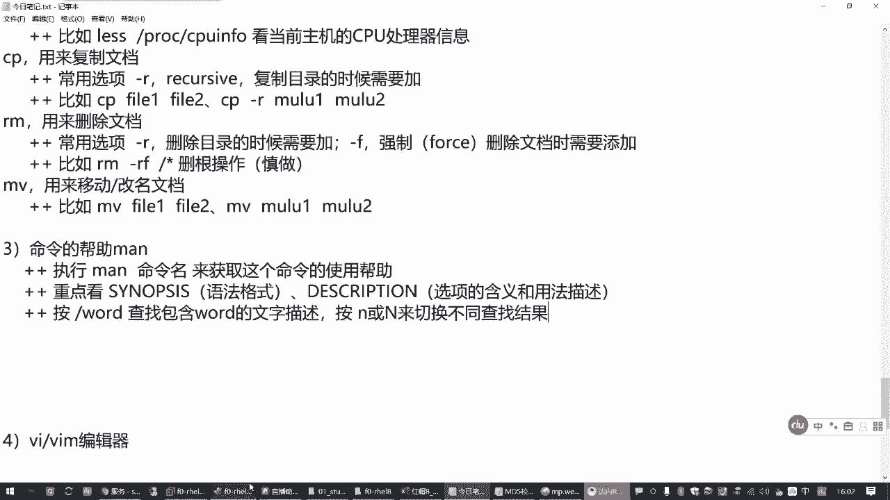
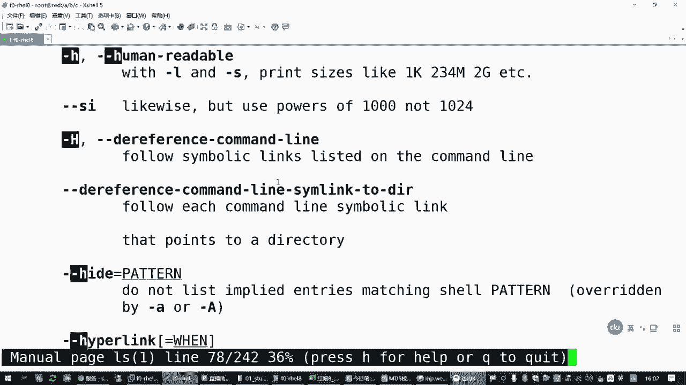
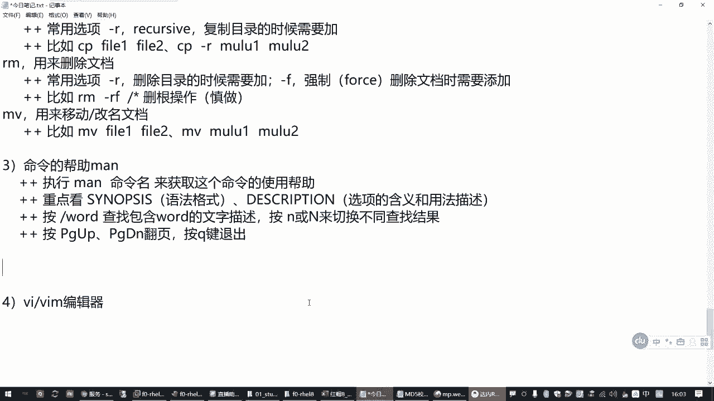

# Linux入门教程：P4：文档管理常用命令 📂

## 概述
在本节课中，我们将学习Linux系统中用于文档管理的一系列核心命令。这些命令是操作Linux文件系统的基础，包括查看、创建、复制、移动、删除文件和目录等操作。掌握它们是成为一名合格Linux用户或管理员的第一步。

---

## 命令行基本格式回顾
上一节我们介绍了Linux命令行的基本概念和目录结构。本节中，我们来看看具体的文档管理命令。首先，请记住Linux命令的基本格式：**`命令名 [选项] [参数]`**。几乎所有命令都遵循这个规律。

---

## 目录探索三剑客：`ls`、`pwd`、`cd`
以下是三个用于在文件系统中导航和查看的核心命令。

### `ls` 命令：列出目录内容
`ls` 命令用于列出指定目录下的文件和子目录。它也可以显示文件的详细信息，如大小、所有者和权限。

**常用选项：**
*   **`-l`**：以长格式列出详细信息。
*   **`-h`**：与 `-l` 结合使用，以更易读的单位（如K， M， G）显示文件大小。
*   **`-d`**：仅显示目录本身的信息，而不是其内容。

**示例：**
```bash
ls /boot          # 列出 /boot 目录下的内容
ls -lh /boot      # 以易读的长格式列出 /boot 目录内容
ls -ld /boot      # 仅查看 /boot 目录本身的属性
```

### `pwd` 命令：显示当前目录
`pwd` 命令用于打印当前工作目录的完整路径。

**示例：**
```bash
pwd
```

### `cd` 命令：切换工作目录
`cd` 命令用于改变当前的工作目录。

**特殊符号：**
*   **`~`**：代表当前用户的家目录。
*   **`~用户名`**：代表指定用户的家目录。

**示例：**
```bash
cd /              # 切换到根目录
cd ~              # 切换到当前用户的家目录
cd                # 同上，直接回车也返回家目录
cd /usr/bin       # 切换到 /usr/bin 目录
```

---

## 用户身份切换：`su` 命令
在探索不同用户的目录时，可能需要临时切换身份。`su` 命令用于切换到另一个用户。

**常用选项：**
*   **`-`** 或 **`-l`**：模拟完整登录过程，加载目标用户的环境变量。

**示例：**
```bash
su - lwuser0      # 切换到 lwuser0 用户，并模拟登录
```
**注意：** 管理员（root）切换到任何用户都无需密码；普通用户切换到其他用户需要验证目标用户的密码。



---



## 创建目录：`mkdir` 命令
`mkdir` 命令用于创建新的目录。

**常用选项：**
*   **`-p`**：递归创建多层目录。如果父目录不存在，则一并创建。

**示例：**
```bash
mkdir new_folder                     # 在当前目录创建 new_folder
mkdir -p /a/b/c                      # 递归创建 /a/b/c 目录结构
```

---

## 创建空文件：`touch` 命令
`touch` 命令主要用于创建新的空文件，或更新现有文件的时间戳。它常被用来快速创建测试文件。

**示例：**
```bash
touch file1.txt file2.txt           # 创建两个空文件
```

---

## 查看文件内容：`cat` 与 `less` 命令
以下是两种查看文件内容的常用工具。

### `cat` 命令：查看短文件
`cat` 命令会一次性显示文件的全部内容，适合查看内容较少的文件。

**示例：**
```bash
cat /etc/hostname                   # 查看主机名配置文件
cat /etc/hosts                      # 查看本机域名映射文件
```

### `less` 命令：分页查看长文件
`less` 命令用于分页浏览长文件内容，不会一次性加载全部内容。

**基本操作：**
*   按 **空格键** 或 **Page Down** 向下翻页。
*   按 **Page Up** 向上翻页。
*   按 **`q`** 键退出。

**示例：**
```bash
less /proc/cpuinfo                  # 分页查看CPU信息
```

---

## 文件操作：`cp`、`rm`、`mv` 命令
以下是文件复制、删除和移动/重命名的核心命令。

### `cp` 命令：复制文件或目录
`cp` 命令用于复制文件或目录。

**常用选项：**
*   **`-r`** 或 **`-R`**：递归复制目录及其所有内容。

**示例：**
```bash
cp file1.txt file1_backup.txt      # 复制文件
cp -r /boot /tmp/boot_new          # 递归复制目录
```

### `rm` 命令：删除文件或目录
`rm` 命令用于删除文件或目录。**请谨慎使用，尤其是与 `-rf` 组合时。**

**常用选项：**
*   **`-r`** 或 **`-R`**：递归删除目录及其内容。
*   **`-f`**：强制删除，不进行确认提示。

**示例：**
```bash
rm old_file.txt                    # 删除文件（会提示确认）
rm -f old_file.txt                 # 强制删除文件（无提示）
rm -rf old_directory/              # 强制递归删除目录（危险操作！）
```
**警告：** `rm -rf /*` 是极其危险的命令，会尝试删除根目录下的所有文件，可能导致系统崩溃。切勿在正式环境中尝试。

### `mv` 命令：移动或重命名文件/目录
`mv` 命令用于移动文件/目录，或者在同一个目录内操作时实现重命名。



**示例：**
```bash
mv file1.txt /tmp/                 # 将文件移动到 /tmp 目录
mv old_name.txt new_name.txt       # 重命名文件
mv dir1/ /opt/                     # 将目录移动到 /opt 下
```

---





## 获取命令帮助：`man` 命令
如果忘记了某个命令的用法，可以使用 `man` 命令查看其详细手册。

**使用方法：**
```bash
man ls
```

**在 `man` 手册中的操作：**
*   按 **空格键** 或 **Page Down** 向下翻页。
*   按 **Page Up** 向上翻页。
*   按 **`/`** 后输入关键词（如 `/ -h`）进行搜索。
*   按 **`n`** 跳转到下一个搜索结果，按 **`N`** 跳转到上一个。
*   按 **`q`** 键退出手册。



**阅读重点：**
1.  **SYNOPSIS（语法格式）**：了解命令的基本用法。
2.  **DESCRIPTION（描述）**：查看命令和各个选项的详细说明。



---



## 总结
本节课中我们一起学习了Linux文档管理的核心命令。我们从目录导航的 `ls`、`pwd`、`cd` 开始，学习了如何创建目录 (`mkdir`) 和空文件 (`touch`)，掌握了查看文件内容的 `cat` 和 `less` 命令，并深入练习了文件复制 (`cp`)、删除 (`rm`)、移动/重命名 (`mv`) 等关键操作。最后，我们介绍了如何使用 `man` 命令在遇到困难时自助获取帮助。请务必多加练习，这些命令是您后续所有Linux学习与实践的基石。