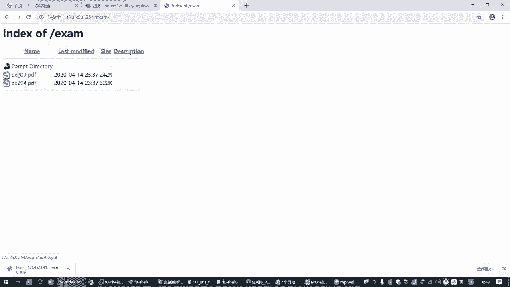
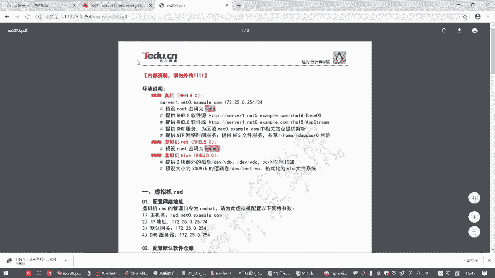
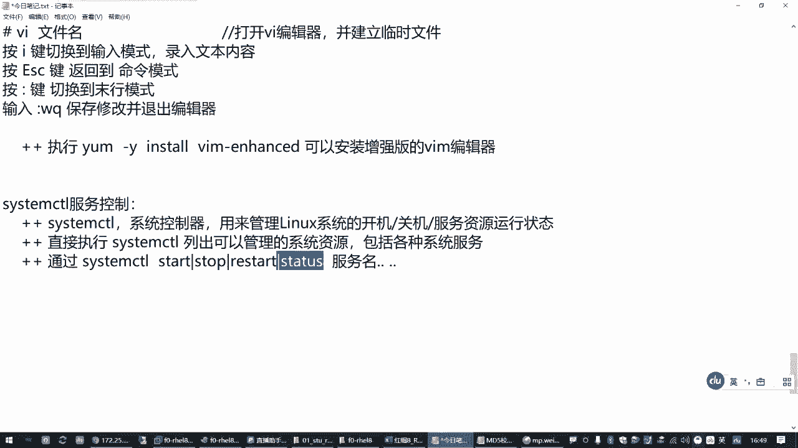
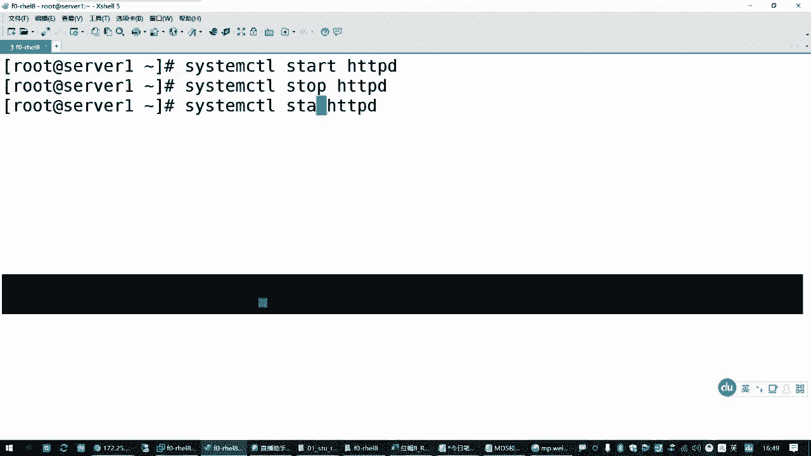
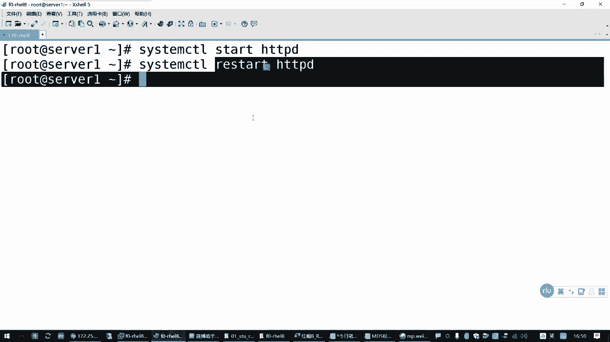
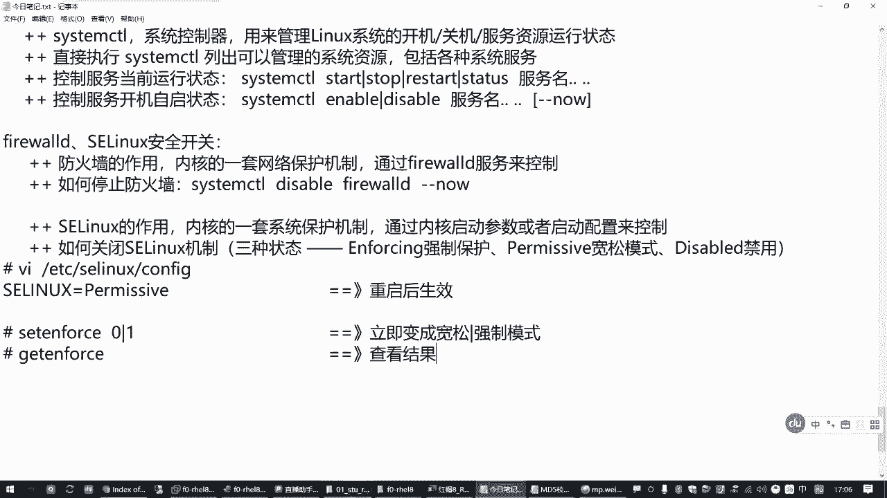
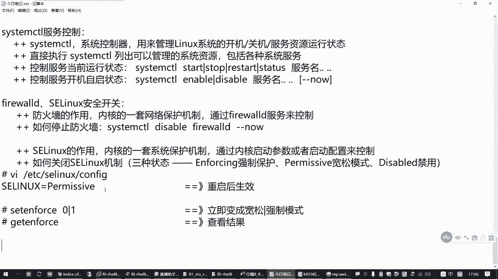
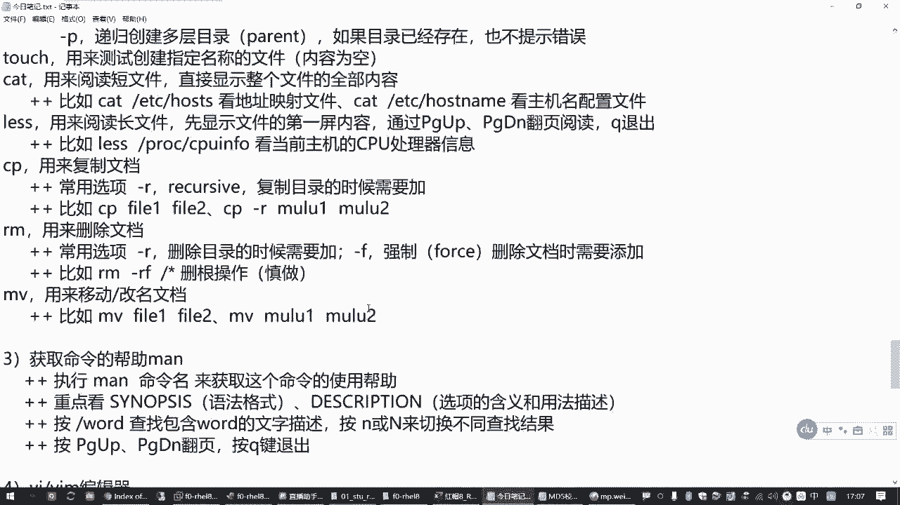
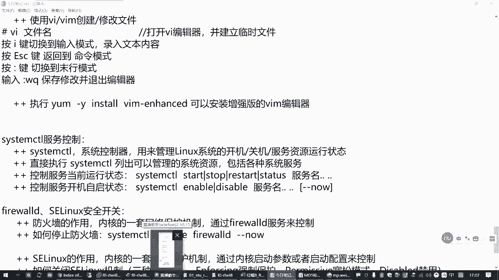

# 红帽认证零基础入门教程：P6：1.04-服务控制和安全开关 🔧

在本节课中，我们将要学习Linux系统中两个重要的管理概念：服务控制与安全开关。服务控制是管理后台程序运行状态的核心技能，而安全开关则关系到系统的网络和内核级安全策略。掌握这些基础操作，是后续深入学习系统管理和应对红帽认证考试的关键。

## 服务控制：systemctl工具

上一节我们介绍了Linux的基础命令，本节中我们来看看如何管理系统服务。服务控制主要使用一个名为`systemctl`的工具，它是Linux操作系统的系统控制器。

`systemctl`的作用是管理Linux操作系统，包括系统的开、关机以及各种系统服务的运行状态。系统服务是指计算机启动后，为提供特定功能（如网站、数据库）而运行的后台程序。

以下是`systemctl`命令的基本用法：



*   **列出可管理的资源**：直接执行`systemctl`可以列出当前系统能够管理的所有资源，包括各种系统服务。
*   **启动服务**：`systemctl start <服务名>` 用于启动一个服务。
*   **停止服务**：`systemctl stop <服务名>` 用于停止一个服务。
*   **重启服务**：`systemctl restart <服务名>` 用于重启一个服务。这会先停止再启动服务，在重要生产环境中需谨慎使用。
*   **查看服务状态**：`systemctl status <服务名>` 用于查看服务的当前运行状态。关键信息是`Active`行，显示为`active (running)`表示正在运行，`inactive (dead)`表示已停止。
*   **同时控制多个服务**：在红帽7和8系统中，可以在服务名后用空格分隔，同时控制多个服务，例如：`systemctl start httpd vsftpd`。



例如，要启动一个名为`httpd`的Web服务器服务，命令是：
```bash
systemctl start httpd
```





## 设置服务开机自启

除了控制服务的即时运行状态，我们还需要管理服务在系统开机时是否自动启动。



以下是设置服务开机自启状态的命令：

*   **启用开机自启**：`systemctl enable <服务名>` 让服务在开机后自动运行。
*   **禁用开机自启**：`systemctl disable <服务名>` 禁止服务在开机后自动运行。
*   **启用并立即启动**：`systemctl enable --now <服务名>` 这是一个组合操作，既设置开机自启，也立即启动该服务。

## 防火墙控制

上一节我们介绍了如何控制普通服务，本节中我们来看看两个重要的安全组件。第一个是防火墙。防火墙（`firewalld`服务）是Linux内核的一套网络保护机制，用于控制网络访问，防御外部攻击。

在初学阶段或某些考试场景（如RHCSA上午考试）中，若不涉及防火墙策略配置，可以将其关闭以简化操作。

因为防火墙本身也是一个系统服务，所以我们可以使用`systemctl`命令来控制它。

以下是控制防火墙服务的方法：

*   **关闭防火墙（并禁止开机启动）**：`systemctl disable --now firewalld`
*   **启动防火墙（并设置开机启动）**：`systemctl enable --now firewalld`

## SELinux 控制

第二个安全组件是SELinux。SELinux同样是Linux内核的一套强制访问控制安全机制，它从更底层保护操作系统，其控制方式与普通服务不同。

SELinux有三种运行模式：

1.  **强制模式（`enforcing`）**：策略完全生效，违反策略的操作将被阻止并记录。这是默认模式。
2.  **宽松模式（`permissive`）**：策略生效，但只记录违规操作而不阻止。用于调试。
3.  **禁用模式（`disabled`）**：完全关闭SELinux功能。

### 永久修改SELinux模式

要永久修改SELinux模式，需要编辑其配置文件并重启系统。

1.  使用文本编辑器（如`vim`）打开配置文件：`/etc/selinux/config`
2.  找到 `SELINUX=` 这一行。
3.  将其值修改为 `enforcing`、`permissive` 或 `disabled` 之一。
4.  保存文件并**重启系统**以使更改生效。

### 临时切换SELinux模式（仅限前两种模式）

如果不想重启，可以在`enforcing`和`permissive`模式之间临时切换。

*   **切换到宽松模式**：`setenforce 0`
*   **切换到强制模式**：`setenforce 1`
*   **查看当前模式**：`getenforce`

**注意**：`disabled`模式与`enforcing/permissive`模式之间的切换必须通过修改配置文件并重启系统来完成。




## 总结



本节课中我们一起学习了Linux系统管理的两个基础且重要的部分。






*   我们掌握了使用 **`systemctl`** 工具来控制服务的**启动（`start`）、停止（`stop`）、重启（`restart`）** 状态，以及查看服务状态（`status`）。
*   我们学会了设置服务的**开机自启（`enable`）或禁用（`disable`）**。
*   我们了解了两个关键的安全开关：**防火墙（`firewalld`）** 和 **SELinux**。我们学习了如何关闭和启用防火墙服务，以及如何通过修改配置文件或使用`setenforce`命令来设置SELinux的运行模式（强制、宽松、禁用）。


这些操作是日常Linux系统管理和红帽认证考试中的常见任务，请务必熟练掌握。