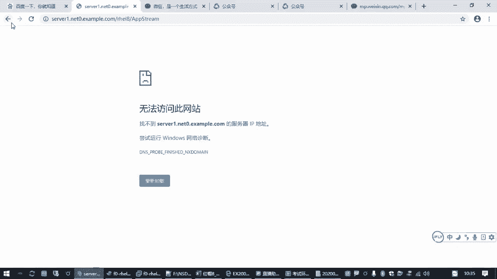
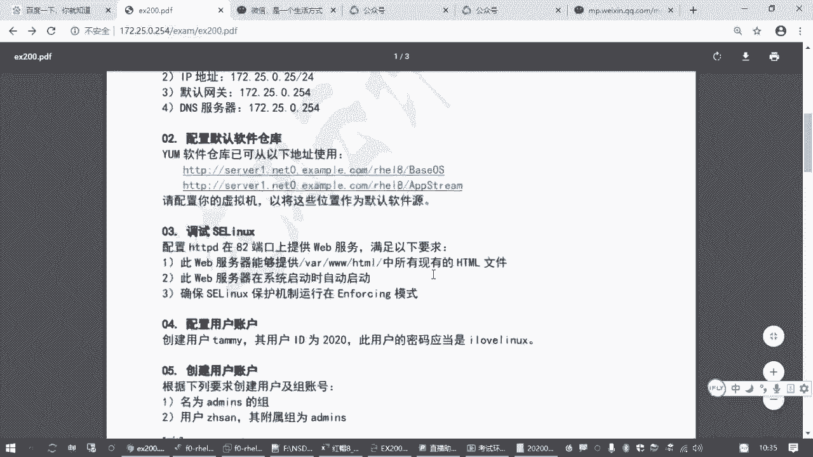
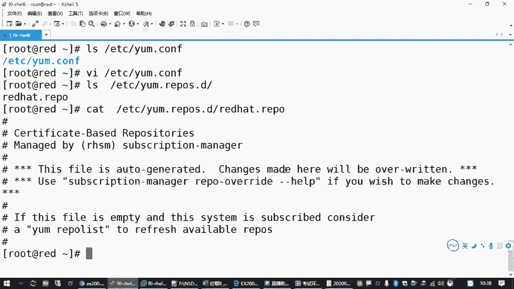
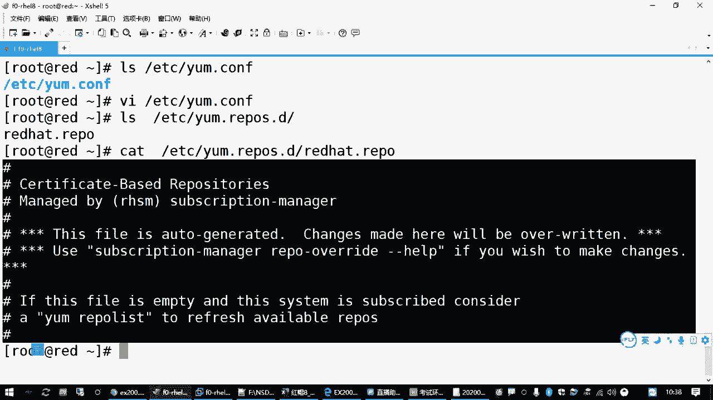
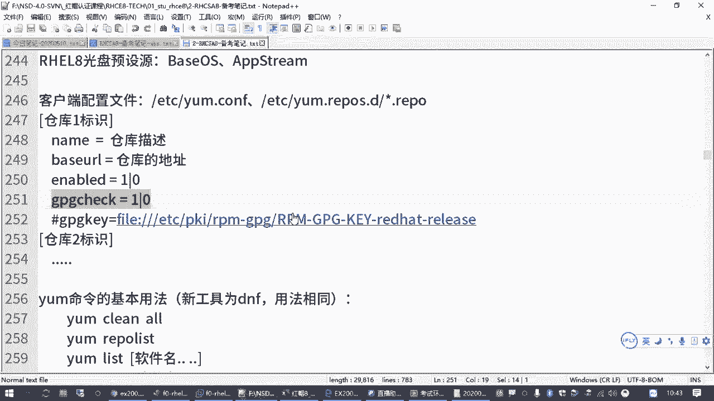
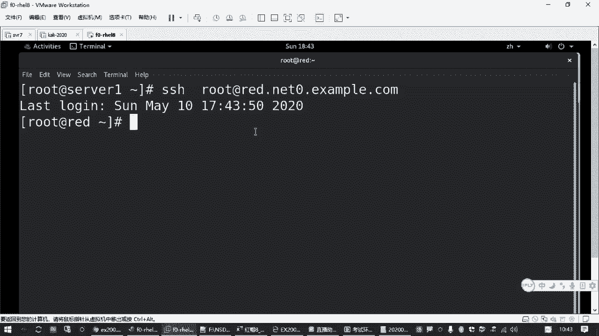
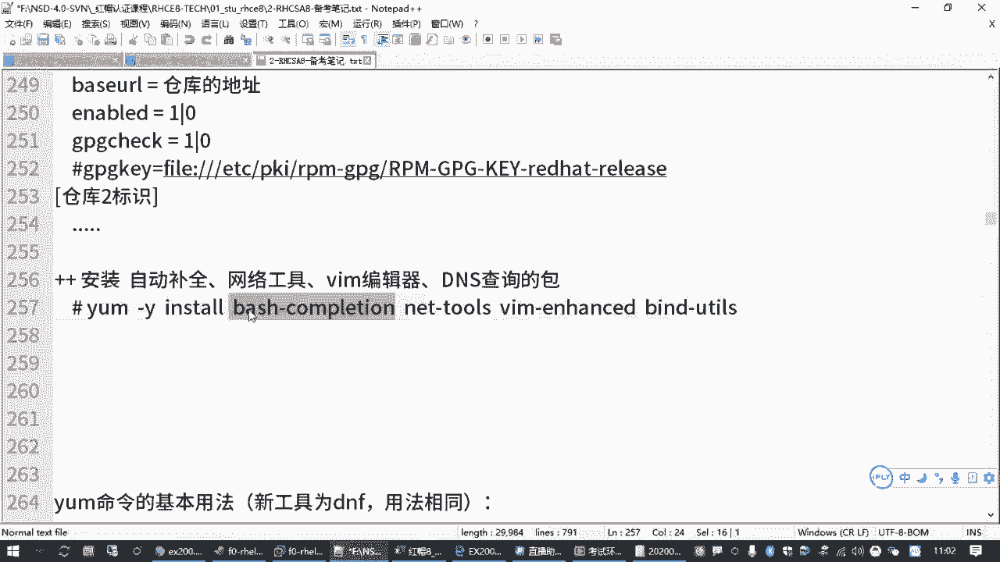

# 红帽认证零基础入门教程：P8：2.02-配置yum源 📦


在本节课中，我们将要学习如何在红帽系统（RHEL 8）中配置软件源（yum仓库）。这是安装和管理软件包的基础，也是RHCSA/RHCE考试中可能涉及的重要操作。

上一节我们介绍了如何配置网络地址，确保虚拟机能够连接到外部网络。本节中我们来看看如何配置软件源，以便系统能够从指定的服务器下载和安装软件包。

## 什么是yum源？🤔

在红帽系统中，安装软件包需要一个提供软件的地方，称为“软件仓库”或“软件源”。对于使用该仓库的客户端机器来说，这就是“软件源”。配置yum源就是告诉系统：“当你需要安装软件时，请去这里找。”

红帽8系统中，默认的软件包管理工具已更新为`dnf`，但它完全兼容传统的`yum`命令。无论是使用`yum`还是`dnf`，都需要先指定软件包的来源位置。





## yum配置文件结构 📁

yum工具的配置文件主要位于两个位置：

1.  **全局配置文件**：`/etc/yum.conf`
    *   此文件控制yum命令的全局行为，例如是否进行软件包签名校验。
2.  **仓库配置文件目录**：`/etc/yum.repos.d/`
    *   此目录下存放着具体的软件仓库定义文件，扩展名必须是`.repo`。管理员可以在这里创建多个文件来定义不同的软件源。



系统初始可能已存在一个`redhat.repo`文件，但其中的配置行通常以`#`开头，表示注释，因此并未实际启用任何仓库。我们需要创建自己的`.repo`文件。



## 配置仓库文件 ✍️

以下是创建一个有效仓库配置文件的基本格式和核心参数：

```ini
[repository_id]
name=Repository Description
baseurl=软件仓库的URL地址
enabled=1
gpgcheck=0
```

以下是每个参数的含义：

*   **`[repository_id]`**：仓库的唯一标识符，不能重复，建议不要使用空格和特殊字符。
*   **`name`**：仓库的描述信息，便于管理员识别。
*   **`baseurl`**：**最核心的参数**，指定软件仓库的具体网络地址。考试时会直接提供此URL。
*   **`enabled`**：是否启用此仓库，`1`为启用，`0`为禁用。此项可省略，默认为启用。
*   **`gpgcheck`**：是否进行GPG签名校验以确保软件包来源可信。`1`为检查，`0`为不检查。为了简化考试操作，通常设置为`0`。若设置为`1`，则必须额外配置`gpgkey`参数。

## 实战演练：配置考试要求的yum源 🛠️





假设考试题目给出了两个软件源地址：
*   `http://content.example.com/rhel8.0/x86_64/dvd/BaseOS`
*   `http://content.example.com/rhel8.0/x86_64/dvd/AppStream`

我们的操作步骤如下：

1.  **创建仓库配置文件**
    使用`vim`编辑器在`/etc/yum.repos.d/`目录下创建一个新文件，例如`local.repo`。

    ```bash
    vim /etc/yum.repos.d/local.repo
    ```

2.  **编写第一个仓库配置**
    按`i`键进入编辑模式，输入以下内容（注意替换`baseurl`为实际考试给出的第一个地址）：

    ```ini
    [BaseOS]
    name=BaseOS Repository
    baseurl=http://content.example.com/rhel8.0/x86_64/dvd/BaseOS
    gpgcheck=0
    ```

3.  **编写第二个仓库配置**
    在下方继续添加第二个仓库的配置（注意`[repository_id]`不能重复）：

    ```ini
    [AppStream]
    name=AppStream Repository
    baseurl=http://content.example.com/rhel8.0/x86_64/dvd/AppStream
    gpgcheck=0
    ```

4.  **保存并退出**
    按`ESC`键返回命令模式，输入`:wq`保存文件并退出vim。

## 验证与测试 ✅

配置完成后，必须验证仓库是否可用。

1.  **列出可用仓库**
    执行以下命令，查看配置的仓库是否被正确识别。

    ```bash
    yum repolist
    ```
    如果配置正确，你将看到类似下面的输出，其中包含`BaseOS`和`AppStream`仓库及其软件包数量。
    ```
    repo id                          repo name
    BaseOS                           BaseOS Repository
    AppStream                        AppStream Repository
    ```

2.  **安装测试软件包**
    使用新配置的源安装几个常用软件包，一举两得：既测试了源，又完善了系统环境。
    ```bash
    yum -y install bash-completion net-tools bind-utils vim-enhanced
    ```
    这条命令的含义是：
    *   `bash-completion`: 为Bash shell提供命令自动补全功能。
    *   `net-tools`: 提供传统的网络诊断命令（如`ifconfig`, `route`）。
    *   `bind-utils`: 提供DNS查询工具（如`host`, `nslookup`）。
    *   `vim-enhanced`: 提供功能更强大的Vim编辑器。

    **注意**：安装`bash-completion`后，需要**重新登录终端**或开启新的Shell会话，自动补全功能才会生效。

## 总结 📝



本节课中我们一起学习了红帽系统下yum软件源的配置方法。我们了解了yum配置文件的结构，掌握了在`/etc/yum.repos.d/`目录下创建`.repo`文件来定义仓库的步骤，并通过`yum repolist`和安装软件包验证了配置的正确性。这是后续所有软件安装操作的基础，请务必熟练掌握。