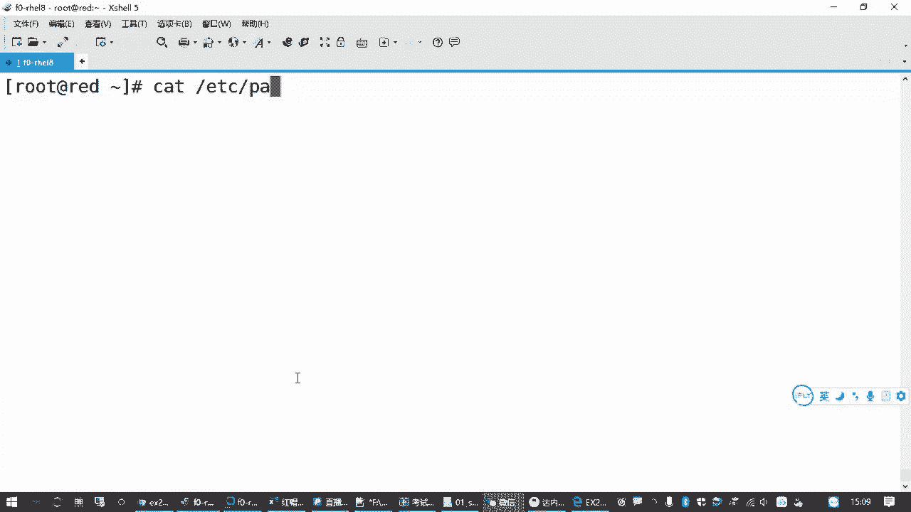
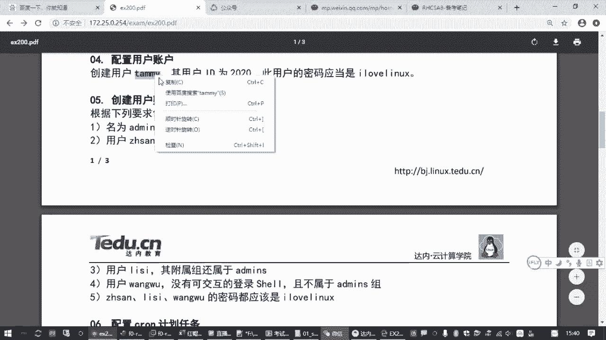

# 全网最全红帽认证／RHCE／RHCSA 零基础入门教程 - P12：2.06-账号管理 - 达内-coding头号粉丝 - BV1z54y177Zk

那接下来我们用户账号管理这一块的话呢，大概有两道题目左右吧。啊，大概两道题目左右。呃，其中呢用户账号管理这个题目啊，考试的时候还是蛮容易的。呃，就是大家你要知道用户管理相关的一些基本的一些操作。呃。

一方面呢就是怎么样怎么样去添加用户账号，再一方面呢怎么样去给他设置密码。然后呢嗯要学会怎么样把一个用户账号添加到某一个组，对吧？嗯，就大概就是这些内容啊。呃，那关于用户账号管理这一块的话呢。

我们来了解一下相关的一些知识啊。

呃，对于lininux主机来说。用户账号主要就是用来控制一个呃使用计算机的人啊，或者说使用lininux的人是吧？啊，他有什么样的一个权限去操作我们的一些文件啊，一些程序等等等等。

这个就是我们用户账号吧。呃，那另外一方面呢，用户账号在控制权限的时候，怎么控制的呀？是根据你这个文档属于谁的。然后用户能能够对你这个文件有什么样的一个权限？

所以其实用户也是在呃决定我们能对一个文件做什么样的一个操作。在这个环节当当中呢起到一个非常关键的一个作用。所以我们接下来两节课呢，就先看用户账号啊，再看我们的归属和权限。呃，那用户账号的话呢。

它除了控制权限以外，它第一个还有一个很大的作用就是登录系统。对吧。像我们平时用的windows系统一样啊，它其实系统里面分成用户账号和主账号啊。

但是呢更常见的我们最关心的也是最常接触到的就是这个用户账号。因为它可以根据你的用户名和密码来登录到你一台主机。啊，最基本的就是你知道它的IP地址，知道它的端口，然后验证的时候，你要用那个用户名和密码吧。

是吧？所以登录和控制权限。😊，呃，linux系统里面呢，它的用户账号信息都是存在我们ETC下边的password文件和s文件啊这两个。

啊，这两个文件呢就大家了解一下，你要知道啊，是吧？考试的时候也不考啊。😊，呃，我们系统里面有一个文件是在。😊，开着看一下，一个是在ETC下的1个pasword。😊。

这个文件里边记录了每一个用户，然我们看第一行嘛。记录了每一个用户的用户名，然后他的密码，然后他有一个每一个用户有一个ID数字的标记，然后它属于哪一个组是吧？有个基本组的。

有一个ID有个组的标记然后它的全名，然后它的主目录，啊，主目录啥意思啊？就每一个用户你进到一个系统之后，操作系统都会给你分配一个目录。你对这个目录呢是有完全控制权限的啊，这叫主目录啊，或者叫加目录是吧？

😊，呃，最后呢是你这个用户进来之后，你要执行命令，它会有一个命令行环境。这个命令行环境呢是有一个程序来组成的。在上次我们讲过是吧？一个叫拜命令行解释器。那默认你如果没有做过设置。

就是并一下的by啊啊就是这个。😊，🎼所以在这个文件里面会有所记录，你添加一个账号，它就会有一条记录啊，这是password文件的一个作用。另外还有一个文件呢叫shadow。😊。

现在的叫影子文件。刚才我们前面讲过password文件呢，看起来好像是记密码的，是吧？😊，但是在很多很多年之前哈，lininux系统的密码就不存在这个文件里面了。😊，啊，为了安全起见呢。

它的密码呢在这个password文件里面的密码都用一个X来表示。那啥意思呢？就表示它真正的密码就加密的那个密码啊，是放在我们这个影子文件里面。

就这个影子文件呢就是是和我们pass word文件相对应的，就你人一走路，那个影子是跟着你走的是吧？所以是一一对应的。但是影子文件它的密码控制非常严格，一般的用户是看不了的，只有管理员能看啊，对吧？

这个要注意，所以这是密码的管理和存储一种机制。那在下载文件里边呢啊我们也可以看一下是吧？😊。

你看root用户。那他的密码就是加密的这一枚长串啊啊，咱也不知道它密码是多少是吧？反反正你看加密的，你是看不出来的那后边还有一堆就是关于这个密码的什么有效期呀，是吧？最近什么时候改过的呀。

一堆乱七八糟的东西，那这里咱们也不展开说了啊。😊。

嗯，但是大家要知道用户账号管理有这两个文件啊，你要知道一个是pasword，一个是下。啊，你最终影响用户用户这个这个账号呀，登录啊，主目的在哪里啊，都是在这两个文件里面记录的啊。

当然哎咱们管理账号的时候，你不需要直接去改这个文件啊，那要不然多麻烦呀，是吧？呃，另外一块除了用户账号以外呢，还有一个叫主账号吧。啊，那主账号呢主要就是用来控制权限的。

就好像是把我们lininux主机上的用户分成几个群小群。对吧分成几个小团队。那比方说我们在公司里边，公司所有的用户啊，员工账号我们都添加了。然后开发部就作为一个部门，这一个部门我就可以给他设一个组。啊。

因为开发部呢可能对某一个那个文档，某一个目录，它是需要有相同的权限的。那你一个一个的给来给员工开发部的每一个同事，你都给他分一个权限，这么麻烦嘛？是吧？所以就是为了方便啊。

我们可以把一堆他的权限相同的这些用户，或者说它的属性类似的这些用户啊为了方便起见，我们可以把它放到同一个组。😊，啊，所以有个叫主账号。对吧就是把用户做做分类的啊，那主账号的话呢。

也有ETC下角有ETC下边有个什么个lo，还有什么G shadow头呃，作用和上面这个password和下载的类似，就是文件换了个名字啊。😊，这是账号的属性，它存在的。呃。

那如果我们要设置用户账号的时候呢，那我们还要知道用户账号它的一个基本属性。

一般我们在添加用户账号的时候啊，就是用户账号的管理啊，增删改查有这么几个命令啊，这个大家要要了解的是吧？啊，有这么几个命令。那一个命令呢就是增加账号，增加用户账号就是U者AD啊U者AD。

然后使用这个命令的时候呢，那你想你要添加一个用户，最简单的方法是什么？

就是在后面正跟上用户名，对不对？这个用户名就是用户登录的时候使用的那个登录名啊。这个名字不要用数字啊不要用数字，或者说你不要用数字开头。也不要用纯数字。因为我们在lininux主机里边。

它用会专门有一个数字的ID啊，为了避免混淆，你要会用用个数字的话，这个不是个好习惯啊。有时候lininux内核它会分不清楚。所以不要不就是不要用纯数字吧，也不要用数字开走啊。

那这个userAD就是最简单的添加用户的方法。用户账号添加之后，它有密码吗？没有你没给他设呀。😡，对不对？所以你还要给他设密码之后，他才能够去正常使用。呃，设置密码的操作呢就是password。啊。

就是pass word那你要给要给这个张三改密码，就是pass word张三，然后根据提示，你输几次密码，输两次。对吧当然这两次密码呢，如果你是普通用户改密码的时候，就给自己改密码的时候。

你还还要去验证原来的密码，再输两次新的密码，而且密码不能太简单，啊，要做少在8位以上，要符合一定的复杂性复杂度。😊，啊，但是呢你现在是管理员是吧？你是管理员，那这个那个系统，那你对你无可奈何呀。

所以他虽然有个提示，他抗议了一下，说你这密码不对呀，这密码太短了，我写了个123456是吧？但是他也就抗议一下啊，嘴上抗一下就算了，最后还是设置成功了啊。😊，这是最简单的创建账号设置密码。

那这个账号密码设置完成之后呢，呃其实你比方说我另外再开一个中端啊。在你的收一这个环境。我从说到一，我就可以用SSH的方式。注意刚刚我们添加的这个账号登录过去啊。登录到哪到readd。对吧登录过去之后呢。

根据提示输入对方的密码，123456。是不是登录过来了？😡，那刚才给大家看到的就是最简洁的啊，最省事的添加账号和密码的方法。那这样添加好的这个账号呢，是使用的是默认的一些属性啊，默认的一些属性。

比方说它的主目录是放在home下边，给我们这个用户名同名的啊，再比方说他的那个用户的IDID你可以这个用户自己查一下啊，他的ID可能是从1000开始的。因为低于1000的认为是系统账号，那个ID是零的。

就是管理员自己啊，你ro上用户自己看一下。对吧ID是零，用户的ID啊是零，就是管理员。然后普通用户在红帽八开始，一般默认是从1000开始的。对吧啊，然后呢用户使用的那个登录环境，就是你用户登录进来之后。

你看他一一方面他能登录，登录进来之后，他也能执行命令，对吧？也能执行这些命令啊。😊，所以这是默认的情况，我们添加一个用户招的一个属性。🎼啊，但是在某些情况下呢，我们就不希望用这种默认的属性啊，那怎么办？

😊，我们要去改。

啊，所以我们在添加用户账号的时候呢，有很多时候我们就不希望用优的ADD张三这么简单的这种方法。我们在中间可能要控制它的属性。比方说我要添加一个账号。😡，我不想用这个1000桌ID我想用1234。对不对？

或者我就想用一个另外的。😡，一个数字号。比方说我要添加一个李四，我就想他的ID号呢是666，行不行，对不对？我觉得这个数字很特别吉祥哈，那怎么办呢？这个时候要加一个选项叫杠U。😊。

这就是呃使用指定的ID号啊。后面再跟上用户名。对吧这也可以。😊，那这样的话呢，我们可以去检查这个李四的ID。如果你是管理员啊，你可以用ID去跟上一个用户账号，去看这个用户的ID号是多少。啊。

你看这是666，对吧？嗯，普通用户能不能查，我试一下啊。ID李四哎也能查是吧？你看张三可以查李四的ID。😊，就检查我又不改是吧？查一下是可以的，可以知道它是666。

所以这个就是在添加用户账号的时候去控制它的UID。😊，啊，一般叫UID啊，叫用户的数字标记叫UID。那添加账号的时候，除了改ID还可以改什么呢？😊，还可以改它属于哪一个组啊，还可以属改它属于哪一个组。

那那大家看这个账号属性的时候啊，ID就是用来检查账号的属性。看他的那种数字标记。那你可以发现它有1个UID这叫用户的ID还有一个GID这叫主的ID你还会发现后面还有一个给录不。

那主ID和group是啥意思？😡，好，但家这里要区分一个概念啊，主的ID其实对应到一个组叫李四是吧？那个los后面你看也有个李四。😊。

这有啥区别呵。😡，那这里有个概念叫做什么呢？叫做基本组，还有一个叫附加组啊。基本组织的是啥意思呢？😡，附加组又是啥意思呢？基本组指的是。每一个用户账号。你在lininux系统里边啊。

你创建的每一个用户账号必须属于一个组啊，必须属于一个组。所属的最主要的主。所以有时候也叫做主要组。那大多数情况下，这个组里边只有一个用户啊，通常。这个组只有一个用户。所以大多数情况下呢。

这个基本组就是和我们这个用户账号同名的。就好像我们公司招一个员工，你这个员工进到公司之后呢，我也不知道你放到哪个部门，那我就给你成立一个部门，就只有你一个人，对吧？这个方便管理啊。

因为在这个编制上就好像我给你写工牌的时候，你工牌上必须属于一个部门。😡，在没有跟你分配到属于哪个部门的时候，那你至少有一要有一个基本的部门是吧？这个就是和用户同名的这叫基本组。😡，呃。

也正因为这个组通常只有这一个用户啊，所以呢有时候我们把它叫做私有组。啊，或者叫主主要的主啊。或叫祖主有点绕口啊。主要的主。叫法有很多啊，但是一般最常见的就叫基本组啊，这个知道是吧？啊。

但是当你一个账号添加好了之后。😊，用着用着，有些时候我就希望你这个账号。要加到别的别的组啊，比方说咱们老师啊有时候属于教学部，那可能呢要做一些研发工作，可能要属于研发部。

那谁也不能说我一个用户只能在一个部门干活是吧？那我既然在多个部门干活，那有时候我就需要去访问多个部门的一些资源。那这个时候怎么办？我怎么方便去给你分权限啊？来这个时候出来一个概念叫副家族啊。😡。

就是附加组指的是啥意思呢？就是相对每一个用户账号来说啊。除了。基本组以外的啊。除了猪基本主以外。意外啊不是意外。😊，还属属于的啊还隶索的其他的组。那么这个组对这个用户来说呢，就叫附加组。额外的嘛是吧？

😡，那可能我在编制在教学部，但是我同时又有研发部的权限啊，又有那个运维部的权限是吧？那么运维部和和那个研发部就是对我来说他就是我的附加组。那我的基本组可能就是教学部啊，明白这意思吧，是吧？啊。

有这两个东西。😊，啊，那如果我在添加账号的时候要管理这个啊，添加账号的时候一般有两个选项。

杠小写的歌或者叫G是吧？这是指定你属于哪个基本组。😊，啊，但是呢基本组一般我们很少去用啊很少去用，就大家要了解。因为很正常情况下，就你用户是叫啥名字，就自动给你创建一个基本组，很少会去改啊。

但是附加组呢，那有时候我们就会去设置。😊，你这个用户账号添加的时候，我就跟你说啊，那来我们公司，我就直接让你加到呃那个什么研发部，对吧？可以通过一个杠大写的G去指定。啊，用这个去指定。啊。

然后用户账号呢加目录可以用杠D去指定。如果你不指定，那默认就是home下。然后按用户名起一个名字，建一个目录。呃，附加组呢你如果不指定，那你不属于任何别的组，只有一个基本组啊。基本组如果不指定。

就是和你用户名同名的。😡，对吧就有这几个选项啊，然后杠S指定的是用户的登录效。什么叫登录效？就是你这个用户账号登录到linux主机之后，哪一个程序负责帮你解释这个命令。

大家还记得我们讲过的这个命令解释器的概念嘛，是吧？那刚才我们在这个入制账号这里边。😊。

给大家看过我们的ETC passwordsword。

在这个文件里面，第一行不就是root账号的信息吗？最后这一个部分就是登录下。正因为有他在啊，所以我们就能够执行命令。那minux系统里边呢，还有一些用户账号，它是不能够远程登录的啊。

不允许他是远程登录的。

那可能有些同学觉得奇怪，你不允许我登录，你借我干嘛呀？是不是啊？呃，大家可能不了解。那还有一些用户呢，他只是在服务器上用来跑一些服务程序用的啊，用来跑一些服务程序用的。

比方说阿巴奇我们在运行我们这个网站的时候，需要他有一个普通用户的身份。但是这个用户他不允许登录。你看后面有一个叫SB no。😊。

一方面我没有给他设密码。另一方面就是说你给他设了密码，他也登不上来。😡，因为他他不需要执行命令啊。他只需要去运行一些程序，有管理员告诉他，你现在的身份是阿帕奇，你的责任就是跑一个网站。对吧有一堆用户啊。

大家可以看到这里都是SBn那E。🎼那除了我们平时讲到的正常的命令航解释器，就是那个。

并伴醒。那另外还有一个比较常用的叫RS并下的n log in，这个就是专门用来禁止一个用户登录的啊。通常来说就是用来添加一些特殊的系统用户账号啊。因为你不想让他登录嘛。😡。

那如果我们要设置怎么办呢？还是刚才我们讲到的这个UerAT这个命令。然后后面加一个杠S，指定你用哪一个像。

所以如果你想再加一个账号。好，优着ADD。来，我们指一个杠S后面写上S并下的no log in。加一个王五对吧？然后你也给他设一个密码。玩五。123456。123456。那么这个用户呢，他是登不上的啊。

登不上的。😡，啊，你怎么试呢？这帮助大家理解啊，考试是不考这个啊，考的是另外一个用户啊。来，我们退出去来测试一下，我们刚刚张三是不是能登进来啊，因为它默认是用的正常的泄尔环境啊。啊。

就正常那个命令航显示器呃，那现在我们换成王5。😊，也输密码123456。你是不是登不上，你会看到一个提示，this account is currently not available。

就当前账号现在不可用。啊，你登不进啊登不进，不允许你远程登录的啊。😊。

好，这是刚才我们说到的添加用户账号的时候啊，UAD这个操作。

那一般建议大家直接创建账号的时候，就把你想要的这些属性给修改好。那如果我忘记了呢。也没关系，你可以用user MOD啊MOD呢就是修改。😊，你可以用UerMOD啊，去修改一个用户。

把他的这个登录chell啊，用户名啊、UID啊再去改也是可以的。

来举个例子。刚才我们的这个用户李四是吧？他的UID是不是666啊？哎，我觉得666又不行，我现在又喜欢888了是吧？啊，那咋办呢？你可以用UZMOD杠U去跟上我们的。😊，啊，杠又要跟上要改的那个IP号。

最后跟上你要操作的这个用户账号回车。再确认。是不是就改过来了？对吧就改过来。呃，那userAD是添加用户账号，user MOD是修改用户账号啊。

刚才我们在添加用户账号的时候，使用到了这些属性。那大家在使用UMOD的时候，一样可以用。意思就是说你可以先加账号，加完我再改。那当然这你要换两步是吧？如果你呢在添加账号的时候，同时就指定这是最省事的嘛。

一步到位啊一步到位。啊，这是创建账号啊，然后呢。Oh。呃，我们改密码的操作啊，咱们考试的时候。

来回头看一下这个题目。

嗯，你看这个用户账号，你是不是要给他设密码呀？啊，然后底下呢又有几个账号，是不是都要给他设密码呀？而你每次都设密码，刚才我们跟大家讲的操作呢是pass word吧。😊。

跟一个用户名。呃，如果你是管理员啊，你可以这么做啊。如果你是普通用户，你没权限，普通用户不能改别人密码，只能改自己密码啊。只要你password空格，会不会更一个名字，系统就不让你干你是管理员可以啊。

然后你根据提示输几次密码。😊，啊，输两次嘛是吧，验证，因为你是管理员。但是考试的时候呢这样速度不够快啊不够快。因为你设一次密码，你得敲两次，你万一你两次敲的不一致了，你还得再敲好几次。😡。

所以给大家推荐一个简单的方法。啊，有个什么方法呢？有个工具可以连接两条命令。我要给这个网五用户设密码的时候，我密码可以在前边用另外一条命令直接把密码告诉他。这叫Aco。A课英文单词反译过来呃。

翻译过来就是回显的意思。就你在后边显示一段什么话，它就显示在屏幕上。对吧这是A命令的一个作用啊，你随便写啥，它照着照着给你输出一遍啊，对吧？这叫A命令。那我现在是用A命令来显示密码。

那后面我们加载树杠啥意思啊？这个树杠在命令系统里面叫管道。😊，就一个水管一样。我把一个水管呢连连接这头和那头。你可以从这头能装一个老鼠进去，老鼠从这头管子这头进去，从管子那头出来，对吧？

那我现在把123456这串密码从管子这边输进去就不在屏幕上显示了啊。😊，不在屏幕上显示，而是从管道输进去，交给管道右边的另外一条命令，password。然后跟上一个用户账号。

这个意思就是说我们要用这个密码交给password这个命令来用去设置王五这个账号啊。

当然啊password这个命令，它本来是不理你给他的密码的啊，你你给这么给他密码，人家是不理会你的。😡，你如果希望他接受你管道给他的密码。😡，说你别让管理员敲了啊，我我通过广道，我把密码给你要干嘛呢？

在红帽七系统里边，或在红帽七或者八或者6都是啊。呃，在红帽的系统里边呢，我们可以加一个杠杠STDN。😊，就表示那那行，你管道给我个密码也行，那我就不不麻烦管理员了，是吧？😡。

这个操作是快速改密码啊快速改密码。嗯，那如果你想再改李四的密码是吧，你再往上一调呗，然后把后面这个用户删了，换成李四。这种省事是吧，你改多个用户的密码，这上键头调出来一改用户名就改完了吧啊。

这是改密码操作啊。好，那刚才我们讲过，增加用户账号，查看用户账号，修改用户账号啊，包括设置密码，查看用户账号是不是就是ID呀，是吧？就看账号的属性。那还有时候账号我不想要了怎么办？删除。

那意着ADD是添加呃，MOD是修改。那delete啊就是删除U着 deleteele杠R。会不会更一个用户名，比方说我们跟一个张三。那杠R的选项呢表示递归啊。就斩草要除根啊。

就是我们不仅要把张三用户删除，我还要把他家的房子也推了。就他这个主目录，他的邮箱全部都给干掉啊，这叫彻底删除一个用户。当工作的时候呢啊大家要小心，就实际工作当中啊，删除一个账号。

你要确认这个用户的那些文件已经做好备份了啊。要不你这么一删，他的那个主目录下的东西全没了是吧？啊，有点危险。😊，这是删除，删除之后，你再来看张三。没了吧，对不对？那你要删除李四也是彻底删除。

要三往五也是啊。对吧都没了，你删除用户之后，这些用户就用不了了啊。😡，嗯，用不了了啊，就是添加用户账号啊，添加用户账号。嗯，那刚才我们讲过添加用户账号的时候，如果要指定它属于哪一个组怎么办呢？

那我们重新再添加一个。😊，又的ADD给大进演示一下相关的一些用法啊。那如果你要指定它属于一个组，我们说我们说的这个基本组很少用是吧？一般用的最多的就是这个杠大G啊，指定它属于附加的哪一个组。😊。

那我们添加两个账户对比一下。呃，我们默认的方式添加一个用户账号叫STU01。然后呢，我再加一个杠大学的G。啊，来让这个用户账号呢属于root组。啊，系统里面默认有个root组啊。😊，啊。

换个用户名STU02，那么添加STU02属于root组。那看这两个用户账号有什么区别嘛，是吧？😊，这是STU01，这是STU02区别在哪里？就第二个用户账号的话呢，他也有个基本组，和他名字是同名的。

但是除了基本组以外，它是不是另外又属于一个新的组啊，是吧？这就叫附加组啊附加族。好，那我们工作当中有时候说我不想放root组啊，我想成立一个我们自己的组呀，是吧？😊，你说你那个市场部不好听。

我换个名字叫营销部行不行，对吧？我另外要成立一个新的组。😊，那这个涉及到主账号的管理啊，那主账号的管理的话呢和用户账号管理类似。但是呢哎比我们用户账号管理呢要简单多了啊。

要添加一个组个lo aD啊，就不是用的AD了啊，后面跟上组的名字。😊，如果你这个组不想要了，给lo deleteelete啊，删除主。😡，对吧那其实下边呢你还可以把一个用户账号添加到一个组。😡。

如果你没有添加的话，专门有个命令叫Gpas word杠A用户名再跟上一个主名。那咱们考试的时候，这个大家如果记不住，一般不用这个命令啊，为啥我们用在ADD添加用户账号的时候，不是可以直接杠G附加组嘛？

是吧？就可以指定这个用户发到一个组。😊，这看来的你习惯啊，你如果愿意呢，你用这个Gpassword杠A就是添加ADD嘛，杠Ddele删除，可以从一个组里边啊删除一个添加一个用户和删除一个用户都行。啊。

你要查一个用户属于哪些组，可以用那个groups。对吧这个所以账号管理这个呢命令有很多啊。比方说你用us IDDU用那个us mode啊，us mode也可以把一个账号添加到一个组。

但是呢它用法就有点别扭。啊有点别扭，就在一个用户已经建好了。😊，我要重新把它加到主，要么呢你用奇 password杠A把这个用户加到主，要么呢你可以用user mod。去更改杠G组的名字，用户名。

对吧就更改这个用户所处的附加组，但是。啊，大家记住啊，如果这个用户原来属于研发部，属于那个呃技术部。你如果再添加在修改这个账号属性的时候，你不加杠A。那么这个用户你说右着默杠G财务部跟上这个用户名。

那么这个用户呢，他的附加组就只有财务部啊，他之前属于什么研发部啊，技术部啊，不管用，你就把它给抹抹抹除了。所以呢有个叫追加模式，就要加个杠A。啊，这种模式呢就这个用户它原来属于哪些组，不管啊还不受影响。

我现在给你增加一个组啊，增加一个复属组，属于某一个组。😊，对吧有这些啊。😊。

就比方说你看我们刚刚这个STU01现在是不是已经有了，它现在不属于root组。对不对？那也不属于别的组。那我想让这个STU01属于哪一个组怎么办呢？有好几种方法啊好几种方法。那如果。

我们用user MOD这种方式。对吧你可以直接杠A杠大写的G去添加，让它属于look的组。对吧。然后后边跟上你的STU01这个用户，这样是可以的。啊，然后呢呃你也可以再来一个。

让它属于再给它加一个属于usus组，默认的默认的组啊，就是。那这样的话，你再去看STU。01。是不是属于三个组了？哎，但家大家注意，你如果这个杠A杠G，你你中间没有加杠A，它是什么效果啊？啊。

又在MOD。直接杠G对吧？我写1个ADBADMSTU01。再去看。Yes。你如果没有加杠A这个账号呢，你改它的复数组是不是就只属于这一个组了？它原来本来属于user时属于root，那没了是吧？

那这样不行了哈。所以大家如果你想用这种用着 user着末的方式去把一个账号增加到一个组啊，又不影响原来的组，请添加杠A啊，请添加杠A。😊，呃，然后呢那如果刚才我们也讲到了，如果要增加新组怎么办？

来测试一下给路虎。ADD。😊，起个名字呀啊ABC。或者叫技术部tack。这不就增加一个新组吗？然后你就可以把这个账号呢，然后我们把这个STU01杠A。增加到。我们的。TECH这个组。

你再用ID去检查SDU01。他是不是属于t这个组了？对吧就这样。添加账号就是直接用杠大机啊，U着MOD杠A杠大机啊。这是增加一个用户到一个图，当然你也可以用这个G pass word。

杠A添加一个用户STU02。把STU02这个用户呢也添加到TECH的个组。对吧你去检查STU02，那这个用户他也是属于这个组的。没问题吧。好，给大家讲了一堆哈。😊。

主要是关于我们这个用户账号的管理。

大家要熟悉我们的用户账号的增删改查和我们的主账号的增删改查这些基本的操作啊，要理解我们的基本组和附加组它的一个概念啊。

对吧那这些了解了之后呢，那这个题目就很简单啊。😊。

来，我们看题目操作。

那再过一遍答案啊，参考答案啊，配置用户账号创建一个用户叫temy，用户ID2020，密码是i love lin，对吧？那这个命令你看创建一个用户账号ID是不是一条命令就搞定了，改密码是另外一条命令。😊。

那怎么办？你可以把这个用户名复制出来。

记住他的ID2020啊，你看考试的时候肯定这个会变啊。呃，那操作的时候呢又在ADD你要记住，改ID呢是杠U。2020，然后写上这个用户名。好了吧。改密码，因为考试的时候好几道题啊。

都要呃就是要添加好几个用户。所以呢大家就用刚才我们讲过的这个方法A。然后他要求了这个密码啊，注意别写错了是吧？I love。レクス。管道啊就把这个密码先显示出来。

然后通过这个管道符号交给我们的password命令去处理。杠杠STDE接受这个密码。然后去设置timed。密码是不是你搞定了？那这是这道题目。那另外还一道题目呢，要求我们创建一堆用户和主账号。

创建一个名为ad me的组。用户张三要属于这个组附属组啊。

用户李四也要属于这个组。那刚刚如果练习的时候，大家做过这个呢，你把那个用户先删了是吧？重新来，省得你分不清楚啊啊，然后用户网五没有可登录效。😊。

是不是就那个no log in那个是吧？而且不属于这个组。😡，你创建一个账号，你没有说让他属于这个组，他不会属于这个组的。对吧然后3304文5密码都改成指定的值。

所以这个操作呢，你一条一条照着往下写就行了。😊，比录 AD。添加一个组叫ad means。是这个吧，然后又在ADD添加一个账号大写的G它的附属组属于ad means，然后用户名呢叫张三。对不对？

然后再添加一个用户账号呢，它叫李四。还要添加一个用户账号，它不属于这个组。去掉吧，然后它要属于呃他要使用那个S并一下的。🎼No那个 in。这个吧是吧就这个路径啊，大家知道他是干嘛的啊。

这个一般就对应到我们题目的没有可交互的登录效。就你登录不了啊，你没法去给他发指令。😊。

对吧那用到的就是我们S变下的n log一啊，这比较规范的一个做法。好啊，换个用户叫5万五是吧？那添加第三个用户，然后改密码的时候，考试的时候，一般这个密码和你上面那个密码都是一样的啊。

所以大家操作的时候呢，就会就可以很快。😊。

你用上箭头把命令调出来。啊，改密码不就是。这个吗你把后边的用户名换一下，换成张三，再调出来，把用户名换成李四，再调出来，把它换成王五。

好，这两道题目。就搞定了。对吧就咱们那个练习题，第四题和第五题啊。

