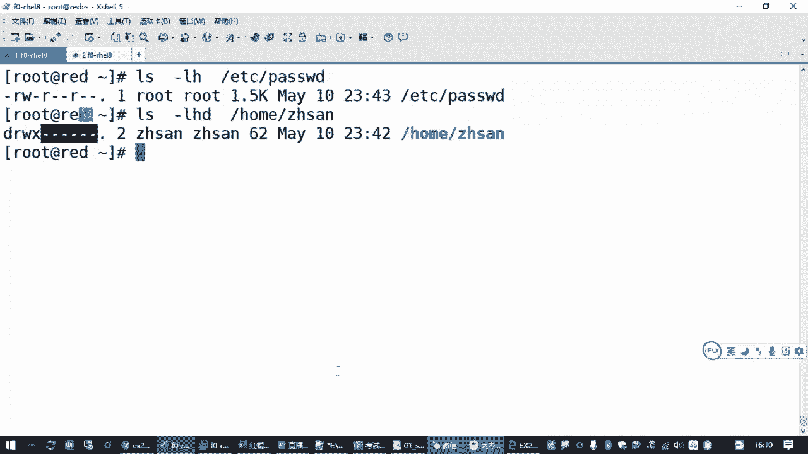

# 全网最全红帽认证／RHCE／RHCSA 零基础入门教程 - P13：2.07-归属、权限及ACL - 达内-coding头号粉丝 - BV1z54y177Zk

那大家了解了我们这个用户账号和主账号的一个管理之后啊，我们来看一下文档的权限和归属。呃，那这一块的话呢，在我们的系统里边啊，就考试环境里面有好几道题目啊，有好几道题目。

呃，比方说呢刚刚我们做的是第四题第五题是吧？那接下来我们呃第六题先跳一下啊，把账号权限相关的去看一下。那还有一道题目呢是配置文件权限。呃，另外还有一道题目呢是创建共用目录。呃。

这两道题的考点会覆盖到我们的。

用户账号和主账号相关联的，就针对文档的归属权和文档的权限，对吧？这2块。那通常来说呢，我们有了账户之后，我们要考虑的就是你这个用户登录到我系统之后。对我一个目录，他能怎么操作？然后呢。

这个目录是属于谁的对吧？所以在系统里面有两个东西啊，一个叫归属，一个叫权限。

这就是我们要学到的后背这22块啊。呃，权限和归属这2块是lininux系统里边呢比较关键的两个东西。那归属的话指的是啥意思啊？就说一个文件归哪个用户所有，就好像我们在那个呃一个公司里边一台笔记本电脑。

你最终是不是要落落实到一个人啊，这个所有权所有权是属于谁在用的，所以有个归属。那另那个是系统的话呢，把一个文件的归属权，它做了两个标记，主要是上面这两个啊。就这个文件是属于哪个用户，属于哪个组的。

就好像你去公司上班之后，公司要给你配一个笔记本是吧？那这个笔记本暂时就属于你在用。然后你属那个笔记本属于哪个部门的，你在哪个部门，就属哪个部门的。😡，是吧那这个基本的关系啊，那每一个文件都有这两个标记。

啊，都有这两个标记。那它的一个概念的话呢叫属主和属主，对吧？啊，一个指的是这个文件属于哪个用户。那么这个文件的用户就叫所鼠。当然对应的是那个用户名啊，这个属组的是个概念，具体你是属于张三的那就属于张三。

属于李四的那就属于李四。呃，然后呢，你这个文件属于哪一个主账号啊，就属于哪个部门是吧？那这个也是有一个关系。😊，那这个关系这个标记标记在哪呀？我们怎么去看呀？😡。

这就是我们之前学过的LS杠L这个命令。你你可以你可以用1个个LS杠L命令，我们随便找一个文件。加个杠牙水啊。来比方说找ETC下的password。那在看这个文件的属性的时候呢，中间除了前面这一堆以外。

中间会有两个用户账号的名字。那第一个root表示password这个文件属于root用户。然后第二个这个root表示password这个文件属于root组，对吧？这么表示的。

那么在每一个文件它都有这个标记啊，你换一个也是一样的。比方说我们看root这个组。啊，换一个别的啊，换home下的张三。😊，我就看他的目录啊，加一个杠D。啊，那你看张三的这个目录，home面下的张三。

他就属于张三用户，属于张三组，对吧？这是他的归属关系啊。那另一个系统控制这个归属关系的时候。那为啥要控制这归属呢？因为它会影响权限。那这个文件现在属于张三用户，张三张三祖。

那root用户来访问有什么权限啊？你是来访问又有什么权限，是吧？那归属权是用来做这个用途的。那我们考虑这个文档归属的时候呢，要考虑什么呢？一个就是。

呃，除了这个文件属于这个用户和属于这个组以外，那别的人你怎么说呀？是不是？那别的人除了你这个用户和组以外啊，其他的任何账号过来。都把他算成另外一类人啊，叫其他人，叫阿走。

就除了鼠主和鼠足以外的任何用户啊。对吧。任何其他人来访问这个文件都只能归到其他人。那后面我们在设置权限的时候，如果你希望设一个权限是满足这三类用户，是不就表示所有人啊，这个时候呢应该用or来表示啊。

就所有的。但这个很少用啊，就我写在这里，就是我们判断一类人来访问我一个文件的时候。这个文件对这个人来说，他是一个什么样的一个关系？那你这个人反过来也一样的嘛，是吧，你这个人是这个文件的所有者。

还是和他共同拥有这个文件的一个组的人，还是属于其他人？对吧一般分这三个类别。那么归属关系呢，所有人是我们在设置权限的时候才用的啊，这个7个我给你去了也行。对吧这就是所有者同属的人，其他人啊。

这叫归属关系。那你知道这个归属关系，那有什么用呢？😡。

我们是不是要调权限的呀？这个归属不是独立存在的是吧？我们设置归属，设置说你属于哪个用户，哪个组是吧，那一定是有关系的，用来干嘛用来设置它的权限。😡，权限在哪里标记？

权限就是我们LS杠LH看文件或者LD看目录的时候，第一段这个标记每一个文件它都有这些标记啊，这些标记呢就反映了。什么样的人对这个文件或者是目录有哪些权限啊？那这个特点怎么来的呢？

那我们要认识一下这个权限，在linux系统里边，基本权限。

有三种类别。

Yeah。这次呢我就懒得敲了，那个笔记里大家有都有，我就给大家看一下。那基本权限的类别呢，三个字符表示或者三种字符表示啊，分别表示的是RWX。😊，R代表的是read读取权限。

W代表的是right写入X可执行。啊，当然这三个权限呢。在标记的时候，是用这三种符号来表示啊啊，但是实际上在我们看文件属性的时候，哎，你会发现你像password。😊。

那前面是好几个R呀，是吧？😡，然后这里你看又是RWX后面怎么预读杠呢？是吧？那啥意思啊？😡，就是我们在标记一个文档的属性的时候，是针对我们刚刚讲过的。

文档的归属来标记的。啊，针对文档的归属来标记的，咋标记的？

就是拥有这个文件的人，他有什么权限，和这个用户同组的人属于哪一个组的人有什么样的权限？然后除了用户和组以外，别的人有什么样的一个权限啊，这么去标记的。

那标记的地方在哪里呢？我们刚才只是讲的这三种类型。

那他标了好几个地方呀，是吧？😡，其实这终标记就是针对蜀主和属主，还有其他人。

好，从哪里可以看到LS看权限的时候，LS杠L啊长格式显示第一个字符先别管，那后边有9个字符。针对的就是这个文档的权限。或者文件的权限或者目录的权限，对吧？那为啥有9个字符呢？😡。

因为刚才我们讲过了。这个文档的归属不有三种类别吗？😡，呃，拥有这个文件的人，拥有这个文件的主，还有其他人三种类别吧。那每一种类别都有三个标记RWX。那可不33得9嘛，是吧？9个标记啊，9个字符标记。

而且呢它有顺序。😊。

这9个标记从左往右。啊，记住啊，第一个你先别管啊这个可简简单介绍一下啊。第一个就是这个文件类型啊，如果是一个普通文件，第一个是一个横杠，如果是一个目录，就是一个D啊de。😊，啊，这个你先放一边。

那我们现在考虑的是权限权限第一个字符除外，从第二个开始9个字符。9个字符你把它切成三段。左边这三个字符表示的是拥有这个文件的用户，他有什么样的一个权限？

中间这三个字符表示的是拥有这个文件的主有什么样的一个权限？最后边这三个表示的，除了用户和组以外的啊，别人。有什么样的一个权限？对吧所以这个权限呢是针对这个文档属于谁。

属于哪个组和其他人分别有什么样的一个权限啊？那这个权限的标记呢，按照顺序。RWX就读取写入执行。啊，三个标记。如果这个权限你希望这个人有，那么就是一个R权限。😡，就要标出来，如果没有写上一个横杠。😡。

啊，就个减号啊，那同样的W权限如果有也写出来，没有没有的话，就是写一个很一个减号。😊，所以你看像我们pasword这个文件。😊，那咱们要学会去看是吧？这个文件呢是属于root用户的。

他root用户对这个文件有读取权限，有写入权限，有没有执行权限啊？没有。因为这个文件它不是一个程序，它只是一个普通文件是吧？所以没有X权限。

啊，XX就是我们的这个叫可执行exeec啊，就像我们windows里面那个EXE文件一样，是吧？啊，来自于这个X。😊。

就是你要学会看文件，开这个权限。😊，那同样的。root组的用户就除了这个用户以外啊，除了root用户本人以外，同样属于root组的别的人啊，就是说这个组的权限是什么？😡。

也对pass word这个文件它有读取权限，但是不能写入。啊，也没有执行权限啊，以此类推吧，除了root用户本人和root组的别人。再剩下其他的任何用户。😡，只能读，没有别的权权限。

对吧那再看我们下面这个目录，那这个目录的话呢，是属于张山用户的。张三对这个目录可以读，可以写，可以执行。但是张三组的用户其实张三组就张三用户一自己是吧？那张三组的用户，如果有别人。

他对这个目录有什么权限，啥权限都没有。😊，啊，RWX全都标成了横杠，什么权限都没有啊。那李四有权限吗？也没有。😡，啊，进不去啊进不去。对吧。就是看权限它的一个对应关系。好，那这个看的方法大家会了之后啊。

我们再来理解一下，然RWX权限对用户它意味着什么呀？是吧？那我如果对一个文件有类的权限，我能干啥呀？我对一个目录我有类的权限又能干啥呀？😊，啊，是有区别的啊，但是它字面的意思就是读执写啊，读写可执行啊。

但是呢如果一个用户对一个文件有读取权限，意味着他可以看这个文件的内容。

那表示什么呢？就表示这个用户他可以用cat啊VIM啊等等等等。这些命令去打开这个文件去查看啊，这叫read文件的权限。那如果他对这个文件有写入权限，意味着啥？意味着它可以去修改啊啊。

GGP editit什么VM或者其他的各种工具。😊，啊，这有些工西我没讲啊，就你们知道有一堆东西啊，可以去改这个文件的内容，这叫写入嘛修改嘛。😡，啊，那对于这个文件来说，X权限意味着什么？

意味着可以执行。这个意味着如果你有一个程序，它必须有X权限，否则的话呢这个程序跑不起来。Yeah。就好像你把一个人的脚给给给给咔嚓了一下了是吧？他走不了路了，那不行。😡。

所以windows系统里面有很多病毒文件，你把它拷贝到lininux。首先它机制不符啊，其次就算你专门做的针对lininux病毒。😡，你如果是下载的这种方式，如果你拷贝的方式，大多数情况下你拷贝过来。

或者你下载回来，默认它是不给你X权限的。😡，跑不起来啊，除非你用户知道这是咋回事，你通过一些手段给他人为的加上X权限。😡，对吧那为什么说lininux相对来说有很多时候会安全一点，对吧？

所以这是针对文件的权限。那对目录来说，哎，如果张三对一个目录，他有类的权限意味着啥？也是读啊，但是读的是目录的内容啊。😊，读目录的内容其实就是LS。啊，我就看一下目录下有什么东西吗？

LS啊那如果是改目录的内容呢，也是写入修改目录的内容，意味着你可以在目录下边增加子目录啊，创建目录，可以增加新的文件，可以拷贝一些文件进来，可以移动一些文件进来，也可以删除目录底下的资源。

也可以去后面我要讲的那些改权限什么的这些东西都可以。😊，对吧这就是变更目录的内容啊，叫修改。😡，然后X权限意味着什么？😡，对目录来说，你目录需要执行啥是吧？啊。

它意味着是你这个用户能不能进到这个目录里面去叫CD。啊，叫CD。所以一个用户对文件和对目录的RWX权限。虽然标记啊都叫这几个标记，但是它的含义不一样。啊，含义不一样，我们举几个例子啊举几个例子。😊。

比如说现在张三的这个目录，那后我们换一个终端。我们这边登过来啊，来登一个李四。刚才我们不是加了一个李四吗？是吧？😊，密码是啥来着？叫I lovelin是吧？ILOVE。Minux。啊，好了是吧。

那现在呢你是李四啊，看提示信息啊。😊，那现在张三的目录的权限是home下的张三，那大家可以思考一下，你觉得李四能不能进去啊？😊，李四对这个目录有什么样的一个权限？😡。

这个目录是属于张三的那李四访问的时候，李四是张三组的吗？不是，对不对？那李四就是其他人啊。😡，那其他人的话，他怎么办？😡，你比方说你CD到home下的张三。过不去。

permission denies是吧，被拒绝了啊。😡，因为啥呢？因为他没有给你X权限。那有没有读取权限，你LS看一下。😡，也看不了是吧，无法打开这个目录啊，因为张三的目录并没有给别的用户开放。

我们再换个目录。😡，来看一下管理员root的目录。那一样的是吧，也是其他人没有任何权限。😡，你进不来吧，是吧？😡，所这些权限呢，刚才课下的时候，如果有同学不太熟悉啊，你可以去参照我们的笔记这里的资料。

你去验证一下啊，他是不是能做这些操作。如果一个用户对一个目录没有X权限，他进都进不去啊。

而且这种情况下，你如果对目录没有X权限，你给他类的权限也没用。😡，进不去是吧？看不了啊。😊，所以目录的权限大多数情况下，一般都是R和X权限都要给。

要不然。你也看不了。对吧这个要注意啊，这是关于这个权限啊。😊，啊，那权限和归属啊，但一方面要学会查看啊LS杠LH是吧？看目录的话呢，LS杠LHD。呃，那如果查看以外，我还想去改怎么办，是不是啊？

比方说张三的这个目录，我能不能把它改成李4呀？我说张三这个房子没收成公了，我送给李四了是吧，过户。可以改啊可以改呃，那改这个归属是一种方式，会影响这个文档的权限。那另外呢我直接改这个权限标记。

也可以影响这个文件或者目录的权限都可以啊。啊，因为时间关系，咱们不可能一个一个全都给大家演示啊，我们举几个例子。😊，比方说。刚才。李四是不是看了看不了张三的目录啊，没权限吧。那假设我把张三的这个目录。

把他的所有者改成属于李四。那结果是什么样的对吧？我们可以去验证。那这里呢我们需要用的两个工具啊，一个就是改这个文件或目录的所有权。还有一个呢改这个文件或目录的具体的权限的种类。那其中呢改归属关系啊。

改所有权这个命令叫CHOWN叫庆介own啊。😊，英文单词就这么来的，CH呢就是庆几啊，对吧？改变所有权。简写成CHOWN。那这个命令在用的时候呢，后边我们直接跟那你这个要把一个目录改成谁的呀，是吧？

所以改成属于哪个用户的，你要在前面写上用户名字。呃，然后呢后边你要改要跟上你改哪一个目录啊。对吧就这样，那这个操作就可以把这个目录的所有者改成李四。就这么简单啊，改完之后我们再回头看一下张三的属性。

你看是不是所有在改成李四了，那改成李四之后，现在对于这个目录来说，李四他有没有权限，哪里会受影响？😊，我们看权限的时候，左中右左边这9个字符啊，左边这三个是不是对应到所有者的权限啊？

那么现在领四能不能进？能进吧，对不对？李四能进能看能写啊，所以我们回头到这个终端再看一下，刚刚李四看不了，我们再来看一下呗。是没包错了啊，但是这个目录下有一些隐藏文件，我们看不见啊。😊。

你要看隐藏文件的话，我这我这个忘了给有没有给大家讲啊，加一个杠A是吧？好像我记得印象当中是讲过的，可以列出隐藏的文档。😊，你同样你可以CD到这个目录也是可以的。直接LS看当前目录价格杠大A。

也是列出隐藏文档也可以吧，对吧？所以这个权限就发生了变化。其实我们不是直接改的权限标记，我们改的是什么？改的是归属关系啊。ok吧，那这个大家学会了之后呢。😊，这个大家学会了之后呢，那我们。😊。

还要再掌握几种用法。刚才我们是改的是这个目录属于哪个用户，那我要改属于哪个主播怎么办？对不对？那如果你想改属于哪个组呢？仍然是嵌接own了这个命令。但是在属于哪一个组，要加一个冒号啊，后边写上主的名字。

比方说我把home张三改成属于usus这个组。改完之后呢，看一下。这个地方是不是发生了变化，对吧？😡，这是改啊改这个目录属于哪个组？当然啊，如果你说你说这个目录，我就同时又改用户，又输又改组。

那怎么办呢？😡，那就是二合一嘛，多简单的事是吧？就是你把这个用户这个冒号前面写上用户名呗。这张三冒号usus。对吧。😊，这个方法跟刚才的效果是一样的，就相当于先做了。😊。

chanowner你是在做了 change机ownerus。那举个例子，我把这个目录再还给张三啊。啊，刚刚是李四是吧啊，那我这里是还给了张三。😊，我把那个主也还给张三啊，那其实就是应该是张三旺号张三啊。

这是把一个目录改成既属于账三用户，又属于账三组啊。所以在修改归属关系的时候，用冒号分隔前边是属于哪个用户，后边呢是属于哪个组？然后大家记住。这种修改方法只改这个目录本身。如果这个目录底下还有一堆文件。

那些文件不受影响啊。😡，如果你希望在改一个目录的同时，把这个目录底下所有的东西。也都改成属于这个用户，属于这个组。啊，这有个选项啊，叫杠大写的R，这叫递归啊，这叫递归。对吧这叫地位。😊，这就改完了是吧。

这就全改过来了啊。😊，好，这是改归属关系啊，来改完之后，我们再确认现在还是这个样子的是吧？啊，那如果我不想改这个归属关系，我想改权限。😊，举个例子，就这两个我不不能动，还是属于张三的。

但是现在呢那我们恢复之后。我们再用LS去看一下home下的张三。来大A是不是又没权限了？因为张三把这个目录又收回去了啊，你是管理员替他收回去的。那现在我权限不动，呃，就不是归属关系不动，我要改这个。

如果想办法让李四能够访问怎么办？对吧那要学会一个命令，怎么去改这个权限的标记？改权限的标记呢，换一个命令。刚才改归属是chanown，改权限， change末啊，有个MODE叫模式。

其实我们这里呢翻译过来叫权限啊，改权限的标记。那改权限标记的时候，这个时候就要熟悉一下我们前面讲到的。

这个归属关系的三个词了啊，user格 other。就是你改这个权限标记，咱们不是有9个字符吗？那你改哪一串的标记呀？😡。

因为每一串里面是不是都有RWX，你要改哪一串的标记呢？😡，如果你要改用户的标记。请在这里写一个U。那你要给U增加权限，就是加什么什么。如果要减去权限，就是减什么什么啊。😡。

如果你要把用户的这三个权限直接设置成什么，就用U等于什么啊。比方说U等于RX。你设置一下，那么这个时候就把这三个字符改成RX。其实中间省略了一个减号，啊，可以不写啊，就写个IX就行。😊，来看一下。

是不是在样的W权限没有了吧。😡，对吧这就等于啊如果你原来的权限，你不想看它原来权限是多少是吧？你可以直接设置新的权限。😊，啊，如果你原来已经有一部分权限了，我想给他增加一个权限。😊。

那就就本号U变成加号啊，叫U加上什么权限？那原来有RX了，我给它加一个W。对吧哎，你看权限又还原了是吧？😊，说这个基本的用法啊。加减等于，然后这个操作符号前边要标记你操作的是拥有这个文件的用户。

还是拥有这个文件的主，还是拥有这个文件的其他人，对吧？就别人啊。那如果你要去给给一个组播设权限怎么办？就是G加减等号等于。如果你要给其他人设权限，那就是O啊。

比方说我们otherO就是other其他人的意思。我给它加上RX权限。😊，嗯，大家看一下有什么特点。那刚刚我们做的末O加RX啊。增加读取权限和执行权限。对吧啊然后呢你看这个地方就是那9位9个字符。

最右边的三个字符啊，变成了R杠X。😊，没错吧，这就是设置它的权限啊。那如果你这样设完之后，你李四有没有权限啊？现在这个文件这个目录是属于张三用户张三组。那你四对这个目录来说呢，就是一个陌生人，其他人嘛？

但是陌生人的权限呢，我们给了他读取权限和X权限。你不能改我的东西，但是你可以进来访问一下呀。来验证一下效果。是不是也可以了，对吧？啊，这是权限的设置啊。那同样的道理。😊，同样的道理啊。

如果你想把这个目录下边所有的子目录啊文件全都设成这个权限。你可以加一个杠大写的R。然后如果你希望同时又改用户的权限，又改主的权限，你只需要在这里面用逗号分开就行。啊。用户等于RWX逗号。

你可以设主的是吧？加上一个RX，然后在逗号阿着加RX都行啊。你想设哪几个用逗号分割。没问题吧，这个很灵活啊很灵活。而且如果你发现这个同组的权限和其他人的权限哎是一样的。😊，那我干嘛要写两回呀。

你可以写一回啊，怎么写呢？你写1个GO加X加加RX。😊，都行啊。啊，明白明白。那大家再想一下，我们这个目录怎么还原回去。对吧原来他的权限是啥？是同组的人和其他人都没权限啊。😊，那咋们？

那我们只需要用一个轻机墨的，它也有一个更大啊。嗯，递规设置。然后我们可以chanmod杠大啊呃同组的人和other都减去任何权限啊，我管你原来什么权限呢？如果有RWX都给我去掉。然后跟上这个目录。

你再看。又还原回去了吧，对不对？好，这是权限的操作啊，权限的操作。

好，那刚才我们给大家讲的是我们文档的基本的权限啊和它的归属。那权限的种类呢就是RWX。

但是呢它可以作用于这个文件的所有者，然后同组的人和其他人。

所以大家在看linux文档的时候，你LS杠L是吧，去看文档或者目录，它来标记呢，你要认识这个文档属于哪个用户，属于哪个组，然后它的权限分别是什么样子的啊，用户有什么权限，组有什么权限。

其他人有什么权限啊，然后呢大家学会两个命令就是一个 change节own啊，还有一个就是那个。庆记墨对吧？怎么用？啊，这也是一大块知识啊。呃，如果大家之前接触过，这个应该就不难。但大家如果没有接触过。

那可能课下大家要另外再花点时间啊。呃，反正这些吃道都给大家留在这里。😊。

这是基本权限啊。😡，先告一段落是吧啊，但是大家再继续思考。😊，我们考试的时候，你光掌握这些还不够啊还不够啊，还需要掌握一些其他的知识。比方说来，我们先看题目。

比方说你看有一个题目呢是让我们把一个文件复制，复制之后呢，要修改它的一个权限。对吧啊，你看这个权限要属于哪个用户，属于哪个组，这个大家可能会是吧？啊，你要顶多用一下倩姐owner嘛，对不对？

然后你后边要改他的权限，这个文件任何用户对他没有可执行权限嘛，是不是要去掉？然后其中张三。😊，要能够写入读取和写入你四要能读取啊，你四要不能读取和写入。其他用户都能读，但是这个地方你会发现这不是矛盾吗？

😡，你都说说这个文件属于路ot用户，属于路ot组，这个就不能动了。你现在又来一个张三李四，那这个时候怎么办？这个文件它已经确定好属于root用户root组了。那不管是张三还是李四。

他是不是都属于其他人啊？😡，对这个文件来说就是陌生人。😡，那他没有别的权限怎么办？😡，对吧你要给他设置，但设置的时候呢，这个问题就来了，张三他要能读能写，李四，他要不能读不能写。😡。

但是刚才我们讲过基本归属是不是只有三种类别？

那现在张三也好，李四也好，都属于阿走，我还要给他区分权限怎么办？😡，对吧那这个时候你基本的这三种归属关系就不管用了，不够用了，不是说不管用不够用了啊啊，那咋办呢？这个时候又出了一个额外的权限操作啊。

啊，额外的权限操作就除了这9个字母以外。我们可以另外给它加一个标记啊，可以另外给它加一个标记。啊，那个权限在哪里呢？😡，啊，可能要标记到后边这个地方啊。你现在看到有个点是吧？

那这种方式就是在我们的所有者、同组、其他人这三种归属关系之外啊，另外加了一个控置，这个控制机制。

叫访问控制列表。访问控制列表很简单，就是针对个别用户或者个别组设置特别的权限，设置设置独立的权限。就是说呢。刚才不是说我们张三李四要对这个文件有不同的权限吗？那我可以给你张三开个小灶，给你加个白名单。

我就让你读能你能让你能读能写。😊，那你是呢，我就看你不爽是吧？这是个黑客用户是吧？我就不让你读，不让你写。😡，你可以区分对待啊。😡，这样的话是不是我们控制权限又精细了一步啊，哎，怎么做呢？

有个命令叫st FACL。基本的用法用1个杠M来设置独立的ACL访问控制列表。那ACL就是access啊，access list啊，中间这个C叫contrl前面这个access。访问访问是吧。

ctrol控制L列表。那刚M设置这样一个列表加什么权限呢？user冒号用户名权限组合。然后跟上你要设置的文档。那举个例子，像刚才这个文件，如果你希望招商能读能写。

你只需要只需要执行set FACL杠MU着冒号张三，冒号RW呃RX是吧？看下叫什么啊，可图可写，那就是RW嘛。😊，然后跟上你这个文件不就好了吗？😡，是这样了吧是吧，如果你是这针对于主播设权限。

那就是给路啊。😡，就是给路。啊，如果你设错了，你下清空清空SAL有个杠B。对吧杠B呃，然后这几个操作如果你设置了后面是一个目录，你一样可以加上那个杠大啊啊，咱这没写了是吧？一样可以去递柜设置。

如果是单个的文件呢，你直接设计好了啊。😊，呃，如果你想看这个文件有没有额外的权限，有个get FSL。

对吧有个盖粉色了。所以。来，我们看一下这个题目怎么做是吧？顺便就把这个例子给讲了，呃，复制一个文件到另外一个文件。😊，这个上次我们第一天讲过了是吧，copy。CP。CP这个操作。这个命令吧。

然后复制哪个文件到哪个文件，被复制的文件放前面。复制之后的新的文件放后边空格分开回车复制完成了吧？复制完成之后，让LS去检查一下吗？😊，Yes。那那个学房权限呢学完归属了是吧，你就要知道这个啥意思了。

是吧？😊，啊，你看这个文件默认，因为我是管理员考的啊，这个文件是不是默认属于root用户，属于root组啊。然后root用户有可读可写权限，root组的用户可以读，其他的用户呢也可以读。😊。

那你对比一下题目的要求，哎，这个文件属于root用户，这个文件属于root组，哎，都已经给我设好了。然后最后所有其他用户都能够读。是不是也给我设好了，你看。😡，其他人都可以读，那就不用管了吧。😡。

但是我们现在张三李四不行吧，张三要能读能写，张三现在能读能写吗？不行，张三现在是属属于陌生人，读不了吧。李四不能读，李四现在也是陌生人，他能读的。😊，那所以我们要做权限控制访问控制列表啊。

那刚才我们说的这个。呃，然后第三条再也看一下，任何用户对这个文件没有可执行权限，这个是不是也设好了，都没有L权限吧。😊，所以这个题目大家答题的时候拷贝一下啊，copy拷贝完成之后呢。

第123和第六就已经做完了。我们只需要做第四和第五啊，只需要做第四和第五，那怎么做呢？先get FACL你看一下是吧？你答题的时候不用看啊，但是咱们这里来看一下。就是看他原来的权限啊，用户什么权限。

主什么权限，其他人什么权限吧啊没有张三李四张三李四跟你这个没关系。😊。

你要添加怎么添加呢？😡，st FACL那st就设置F就是文档ACL就是访问控制列表。跟一个选项叫杠M，你可以把它认为是modify啊。😊，是吧编辑嘛编辑访问控制策略，后面写上user。给谁？

冒号分格张三能读能写是吧？那就是张三冒号RW。再跟上这个目录。这就是给张三可以读，可以写，就张三用户啊对这个目录开了一个小灶啊。Okay。然后李四用户呢，是不是换一个叫李四啊？哎，这个单子你敲除了之后。

你如果想省点事，这个U的可以简写成U啊。和你写全的是一个意思啊，然后李四的话呢，对这个目录是不能有读有企业权限那这个你你不能空着啊，空着这个用法就不对啊，你得有个东西表示。😊，啊。

那如果什么权限都没有呢，那其实王整的写法是不是三个横杠，你就这么写就行啊，就这么写就行。😡，当然你想偷奶的话也可以。你写一个横杠就行啊，效果是一样的啊，效果是一样的。那这样的话呢，就把这个目录。啊。

把这个文件啊，这个文件呢张三能读能写，李四不能读不能写啊。来再get FSAL看一下。

你看。😊，能看到吧？张三可以读，可以写李四呢啥权限都没有。

OK吧，那这个题就搞定了。😊，啊，这个题就搞定。Yes。来，大家也花了几分钟啊，把这个题目做一下啊，刚刚前面给大家讲了一堆啊，但是答题的时候其实很简单啊，数字标记咱先放一遍啊。

在考试的时候不用数字标记都行。😊。

但是大家要理解我们这个权限的种类，理解归属关系，然后学会使用清洁own，学会使用清洁mod。对吧就数字标记呢。如果大家不好理解，有些同学原来原来没接触过的，咱先不管啊，一会下一道题我再跟你说好，来。

我们先看一下我们。

这是第几题了。

不说。第七题是吧。所以这个操作呢就三条命令哈。

啊，大家也花个几分钟吧，先把这个做完，我们再稍微缓一下是吧？我们再把另外一道有个共用目录啊，这个题再讲。😊，嗯，权限这一块题呢是linux系统里面比较重要的一个知识点。所以大家还是要学会。

