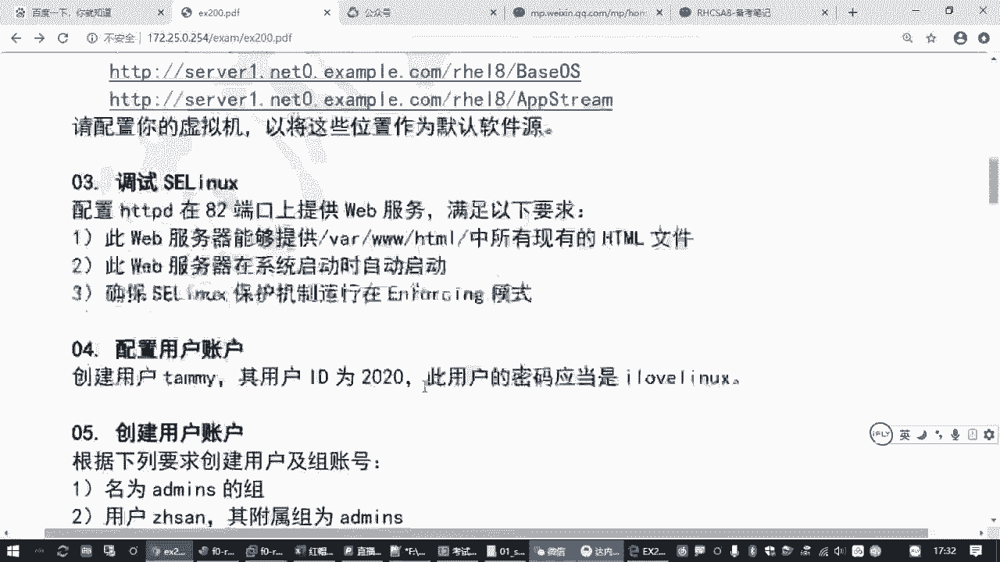
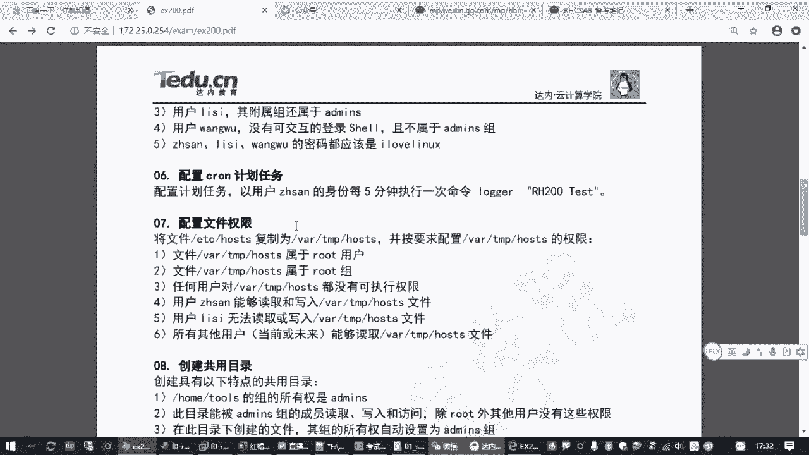
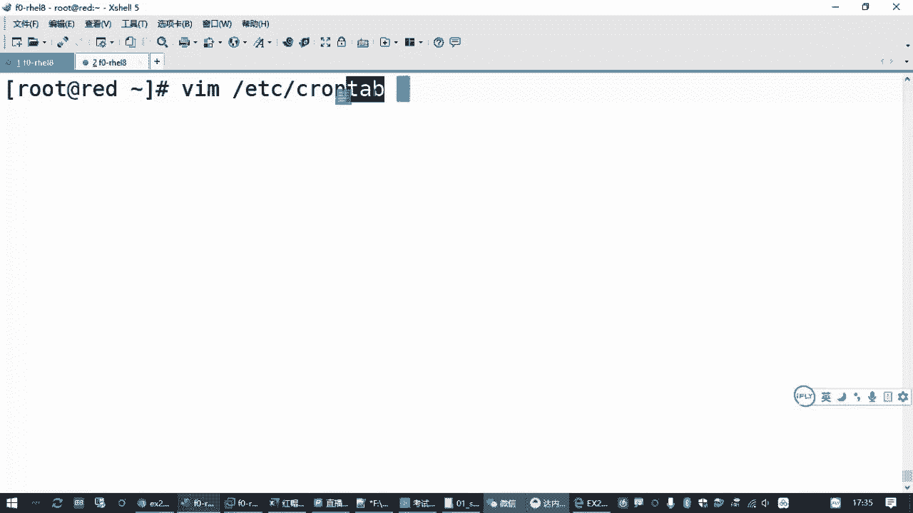
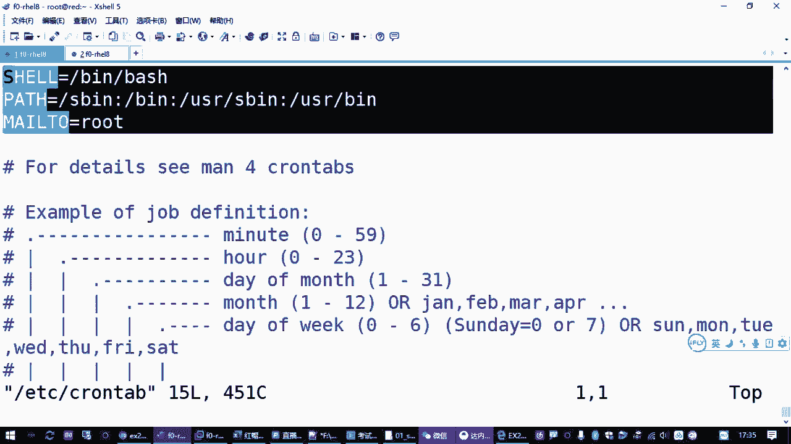
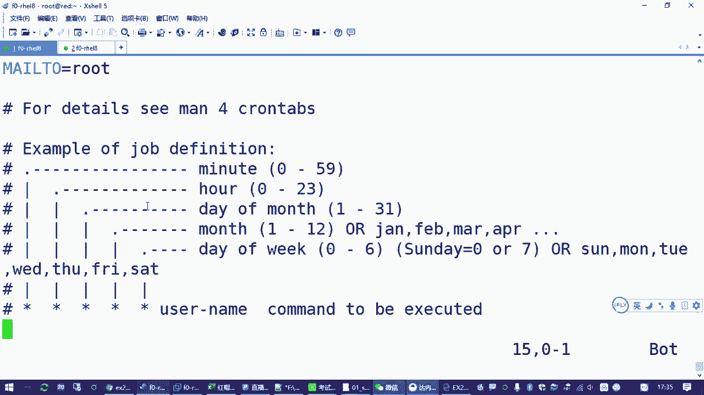
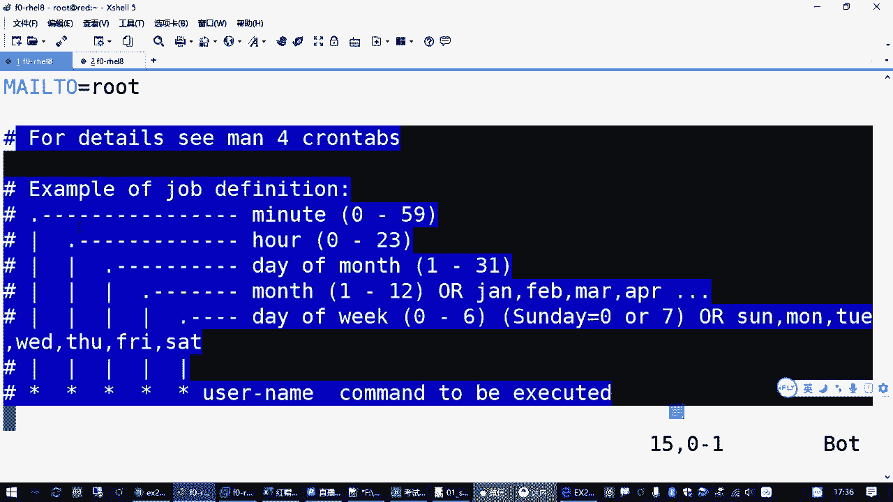
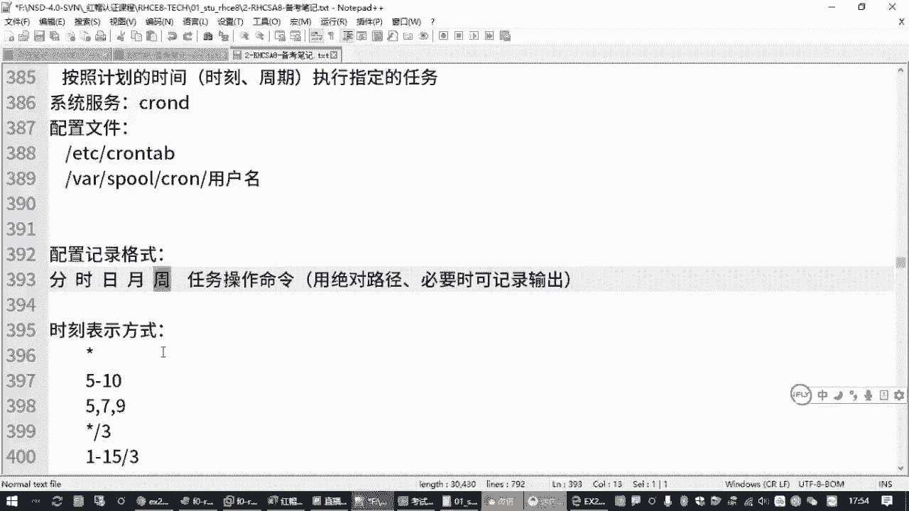

# 全网最全红帽认证／RHCE／RHCSA 零基础入门教程 - P15：2.09-cron计划任务 - 达内-coding头号粉丝 - BV1z54y177Zk

计划任务啊，咱们考试的时候有一道题目是这个样子的。嗯，我上找一下。

啊，这里有一个咱练习题，有一个第六题是吧？你看他操作就一段话啊，要求配置一个计划任务，以用户张三的身份，每5分钟执行一次命令。

就这样吧啊，所以计划任务这一块的话呢，大家一方面要知道什么叫计划任务。然后第二个方面，我们怎么样去配置这个计划任务，是吧？知道这个就就就搞定了啊。Yeah。Yeah。Yeah。啊。

那相关的知识点这一块的话呢。来，我们看一下，那首先一个要知道计划任务它的含义。其实很简单，就是按照我们管理员规划好的时间点。在指定的时刻，按照那个时间点呢去执行某一个任务。所以叫计划任务嘛。

就是你管理员提前安排好的啊，到那个时间就自动执行，到那个时间就自动执行。😡，比方说我每个星期六晚上做个备份啊。对不对？就类似这种的啊，然后每天早上星期一开始的时候，给我把那个网防火墙打开，禁止员工上网。

访问那些什么电影网站呀，对不对？这都叫计划任务吧。😊，所以大家等你们以后做这个运维工作的时候，肯定会经常用到这个东西啊，就是按照计划的时间去执行指定的任务。那在红modt系统里边呢呃要实现这个功能。

需要有个软件包叫cleonD。这个一般不需要我们自动去装啊，不需要我们手动去装啊，为啥？因为这是一个系统必备的一个东西啊，几乎所有的红包系统都要用到这个计划任务，有很多系统任务也需要用它来完成。

所以对应的软件包是自动装好的啊，自动装好的。嗯，你要去了解的话呢，应该有一个包叫做。查一下吧。这叫craowntables是吧？啊能找到，但一般我们一般都不管啊，一般都不管，你就知道一下就行。😡，呃。

那有这个服务之后呢，而且在红帽的系统里面，这个服务默认也是自动运行的，你会发现它默认就是自动运行的。你除非哪天红红包抽风了，给你给你把它给关了是吧？一般很很少啊，一般不会有这种情况。

所以这个服务默认都是开机自自启的。😊，但是你要知道这个方式啊，你要做到一个服务。那万一它关了呢，你要知道怎么把它打开是吧？所以这个状态啊你要注意知道怎么去检查。呃，那这个服务启动之后。

如果我们管理员希望他在某个时间点去执行一个任务怎么办呢？😊，那大家就要知道它的一个配置文件。那配置文件的话呢？对啊，有一个全局的配置文件是在ETC下边叫cleron table。

这是针对所有就整个操作系统的啊，有个文件呢在ETC下边叫。Clron table。啊logTAB就表格嘛，就计划任务表格嘛是吧？啊，你可以打开这个文件去看它有一些命令环境的一些设置，对吧？然后呢。

它下面是具体的一些任务。😊。

但是下面都注射掉了啊，其实就没有啊，没有设置啊。呃，这个文件为什么呢大家了解呢？有个好处。他可以告诉我们，你在添加一个在指定时间执行的任务的时候，怎么去做哈，怎么去做。

那这里呢我们可以看到它这有个样板是吧？😊，学的还挺好的哈。😊，你看正常的记录就是下面这一条。这是一个例子啊，那从左到右有5个星号，这5个星号呢在配置这个计划任务的时候，你要把它改成具体的时间。

第一个信号对应的是分钟，你看这个箭头指过来的。第二个信号呢对应的是小时，第三个一个月里的第几天，第四个一年的第几第几个月，然后第五个一个星期里的第星期几。😊，那其中呢，星期天可以用零表示。

也可以用7表示。这星期天星期七嘛。这就是时间的表示。然后呢，最后这一点是你要执行的那个任务的那个命令。就这样的吧，那如果你在这个文件里面去添加一个任务。😡，那你中间要写这个任务是属于哪个用户的？

因为运行一个任务呢，它需要指定一个用户嘛。所以大家如果你按这种方式，你写星号空格，新号空格，新号空格。你写5个星号，中间可以写一个root，后面再写一个命令，对吧？写一个命令，比方说。

你定期做一个备份啊，或者做一个什么什么操作，那随便什么什么操作吧。😡，这这个不是重点，你在后面写上那个命令就行了。😡，比方说你要配个IP啊，或者做个什么，做个备份啊啊，创建一个文件呀，是吧？啊。

并下的麦爹啊创建一个。目录。对吧这都行。那么这一段话的意思就表示。每分钟啊，为啥每分钟啊？因为这个星号就代表你看在分钟这里边，它代表的是0到59分钟。然后小时这里的信号代表的是0到23分钟啊。

0到23小时，0点到23点嘛，是吧？所以你如果写5个星号，就是每一分钟。😊，但是如果你希望是。每一个小时整点的时候只执行一次，那你要把第一个分钟改成一个具体的数，比方说零分钟对吧？

那就是每一个小时的零分钟执行这个任务啊。那因此大家在写这个任务的时候。要注意的一点啊，就这个时间的格式，分时日月中。然后表示具体的时间的时候呢，有几种表示方式啊，大家要知道啥意思呢？

如果是星号表示每一个时间点啊，就对应的分钟或者小时，每一个时间点。😊，那如果是一个时间范围，用减号分开。如果是一个，比方说第15分钟，第7分钟、第9分钟用逗号分开。然后星号斜杠三，这表示每多少多少啊。

这一串放到分钟这里边啊，分钟这里就是每三分钟放到小时，这里就是每三个小时，放到日期，这里就是每三天放到月份，这里就是每三个月。😊，对吧然后你变的小的时间点，那打个比方。😡，你如果第一个写一个星号。

要避免一些误区啊，然后分十日月周是日啊，这个日期在里啊，每个月第几天你写一个。呃，比方说写一个5。那分时日月周，那这里是每个月的5号吧。但是这个操作你要注意啊，要特别注意这个操作。

它不是说在每个月的5号去执行啊执行一次。它是会在每个月的5号去执行，但是呢它会执行N多次，为啥？因为到每个月的5号的时候，每一个小时每一分钟都会执行啊。如果你希望每个月的5号执行一次。

那你一定要写一个具体的时间点。比方说每个晚每个月每个月5号晚上22点，对吧？这时间表示要注意。然后刚才我们讲过了，如果是每5分钟要怎么表示啊？星号斜杠5。那后边星号没有说哪一天是吧？都是星号。

这叫星号斜杠5，这就表示在每一分钟，但是呢要有个隔断，间隔斜杠5不是除以5啊，不是除以5啊。是每5分钟啊，你放到分钟这个地方。然后前面不能有空格啊不能有空格。这是时间表示。但是。

大家不要直接改这个文件啊。😡，一方面这个文件它要写用户名麻烦是吧？啊，大家如果你要去写的话，也可以写啊，但是不建议大家这这么做。😊，那如果我要给一个普通用户写一个计划任务怎么办呢？你不要直接改这个文件。

为什么呢？我们在配计划任务有专门的工具。😡，还有专门的工具啊，这个工具叫cleon table。要编写计划任务conon table杠1啊，一代表的意思是edit啊。啊，编辑的意思。对吧所以简写是E。

你要查看你的任务呢，杠L。要删除任务杠RL就是list啊。列表对吧？那R是啥意思啊？水木5啊。删除。所以有这个工具，如果你是管理员，你可以控制普通用户的计划任务。啊，为啥要有这个东西啊？

因为计划任务是在后台运行的，不需要用户登录。但是有些特殊的任务呢，就是给普通用户用的是吧？你要给他指一个身份。😊，所以刚才我们说在全局配置文件里面，是不是有个叫U the name嘛？

🎼但是如果你指定给某一个用户去设置。那你就不用。😡，不用指定用户用户名的啊。就是因为你在命令行已经指定了。比方说我们给张三用户设置计划任务，要加一个杠U。张三普通用户，他可以给自己定义计划任务啊。

定义好的计划任务存在哪呢？存在。VNR底下s这个目录上有个on。然后在cleon底下呢。有一个用户名同名的文件，但是不要直接用VIM去编辑啊，为啥我们cloon table杠一。

它就是在帮我们调用VIM编辑器。这样最简洁，而且你编辑好了之后，一旦你保存，它就自动通知你那个con run计划任务的那个服务，告诉他啊，用户添加了一个任务啊，你帮我帮我装一下是吧？就起这个作用的啊。

来，我们先看一下管理员自己的。table杠L这是看root的计划任务。那如果你要看张三的计划任务呢，加杠U张3。对吧这两个用户默认都是没有计划任务的啊。😊，那如果我们要添加一个计划任务。

就把这个杠L改成杠一。那回到我们的题目里边来。😊，是不是要求我们配一个计划任务，让张三。张三啊以张三用户的身份每5分钟执行一次命令啊。那然后大家记住这个时间的表示格式啊，然后我们可让这个杠一表示编辑。

指定用户编他的计划任务回车。这个操作呢它会临时调用VI编辑器，打开一个临时文件。你如果后来有修改，再保存退出，这个文件就存在。如果你没有改过退出，那这个文件就消失了啊。

然后按I键就跟用VI编辑器一样的啊。去编辑刚才我们说了分时日月中，对吧？你就记住这个顺口溜，分时日月中。然后第二列，刚才我们看全局配置的一个格式，是不是应该中间要写个用户账号啊？张三的后面再写了个命令。

但是现在你已经管理员指定了，我编写的就是张三的计划任务，这个用户你就不用写了啊。😡，直接写计划任务那个命令操作，这个命令操作，那题目给你怎么怎么写，你就复制粘贴呗。最后那个句号别复制啊。😊，是这意思吧？

复制这条命令贴进来。就这个。其实在工作当中啊，大家应该用抉对路径哎，为啥呢？因为系统里面。因为系统里边。你这个任务在后台运行的，他可能找不到你那个命令。😡，所以比方说我们找一下那个lge这个程序。

对吧一般是用用用这这个路径的啊，工作当中，就刚才大家你看我们改完任务之后，它会有个提示啊，安装了一个新任务是吧？刚进去的时候是没有的啊，所以用了一个空的。然后我们再打开。那就是说工作当中啊。

大家注意听啊，工作当中呢建议大家用这个绝对路径，这是最靠谱的做法啊。但是考试的时候呢，咱就别这么麻烦了啊，因为你也不知道这个也记不住这个在哪，对吧？一般考试的时候最省事的做法，怎么节省时间，怎么来。

直接复制这一段命令，贴进来就好了。前面时间不能写错。刚才我们说的是每5分钟，那所以大家一定要记住每5分钟怎么表示那应该星号斜杠5是吧？放到第一个段落这里啊，分时日月周嘛，你要念一下是吧？星号斜杠5。

那你确认没有问题，然后再保存退出去。安装新的计划任务表就可以了。对吧。😡，Yeah。那我们这个计划任务有没有执行啊，我咋知道啊？😡，那这个大家如果想测试，那像刚才我们这个任务，你编辑完了之后呢。

一方面你可以杠L去看一下呀。如果发现这个任务没有问题，那就是对的。这是最省事的做法哈呃，但是为什么还有一个方面呢？就是大家看的时候啊，编辑的时候，如果你这个时间写的不对，它会报错的啊。😊。

比方说小时这里我写了个25。这对不对？分10日月周，每天的25点没这个东西吧。那你在保存的时候存不了的啊。他会报错。啊，会一个提示，你看第一行bad now是吧，小时写错了。他出错了，那你没法保存啊。

那你要不要重试是吧？你输一个ES进去再改，所以这也是检查错误的一种方法啊。所以你不能写错，格式要对，格式错，它就会提示你，直到你格式正确，然后保存退出去。对吧它要提示你安装一个新的计划任务为止。OK吧。

呃，那到底有没有真的执行呢？那你就得只能等到那个时间点了，要么你改时间也麻烦啊，他方法还是有很多，你等5分钟之后，你可以去检查什么呢？😊，你可以去这有个命令叫tail啊，tail是看一个文件的最末尾。

你可以看一下哇下的n底下有个cown。这系统里边有一个日记本啊，这个日记本呢记录了计划任务他都做了哪些操作，在什么时间做的？😡，计划任务啊，那个时间记录。你要看这个文件，最末尾。啊。

最茂尾你要看到了哪个时间点的时候，他会去执行这个任务。啊，你可能要等几分钟，对不对？如果你能够看等等5分钟之后，你看到它有那一条，那说明就执行了。你比方说上边我们往上看一下。

上面我们一开始是不是没有改那个时间啊，是不是每分钟执行一次啊？所以你看他这里以张三的身份执行了一条这个命令。就说明你这块任务管用了呗。OK吧是吧。😊，那这是计划任务啊，计划任务这道题目。

那因此呢这道题目大家在做的时候，我们刚才给大家也讲了一堆啊。那它的要点在哪里啊？就你要知道cloronD这个服务要确保它是运行的。然后第二个要点写计划任务的时候，那个日期那个日期呀那个格式。

日期和计划任务那条那条命令是吧？怎么去写？如果你忘了的话呢，请参考EDC下的可run tape这个文件。当然我们参考的时候呢，你可以找到分时日月周，虽然是英文的是吧？但是你有肯肯定比没有好呀。

你看从左到右分时日月周。然后你用的时候呢，就是这一串。啊，你把用户明确掉。那这是第二个要点。那第三个我们在改任务的时候呢，就是这个计划任务cron table它的时间表示方式啊。

不间隔的啊不连续的连续的所有值和每多少多少值是吧？都要学会。然后包括下面这种，比方说你写一个1到15斜杠3，你要放到。日期在里边就是每个月的1到15号，这一段时间就上半个月。每三天啊对吧？

所这个表示方式很灵活啊很灵活。呃，然后配置工具呢就主要是这三个用法，要知道怎么去编辑，怎么去查看，怎么去删除。其实编辑你删除你不会都没关系，你大不了你编辑进去再手动删吧。嗯。

使用contable杠一就是调用1个VI编辑器啊，所以和VI编辑器的用法是一样的，就改就好了。查计划任务执行情况OK吧。那今天咱们就讲到这个计划人务这最后一个啊。

然后下一次我预计啊有可能会时间会长一点啊。今天咱们就先讲到这吧，好吧，那大家呢啊还剩下10分钟时间啊，可以把我们的。计划任务这道题。做一下啊，其实操作啊，你看看操作你简简单到什么程度啊。

其实上面这两条你考试的时候根本就是不用做。你直接可on tape杠1-U杠3，然后写好时间，复制粘粘贴就完事了啊，就这一个操作啊。那大家剩下的时间呢，你把这个题做一下，然后呃针对我们今天讲的内容啊。

如果有什么疑问的话，也可以反馈一下啊。我们再做个答疑，好吧。大家思考一下，刚才我们讲到的这个日期在表示，分时日月周决定你这个任务在每个月第几天执行的，是不是又有一个几月几号，然后又有一个星期几啊。

这两个时间点都可以决定你是第几天做。那这两个有个关系啊。那假设你写一个每个月的5号，然后星期这里也有个每个月每个星每个星期五。嗯。那这个时候呢只要满足一个条件就行啊，就每个月第五号也会做。

然后星每个星期五也会做。😊，一般星期几这个我们一般很少用。除非是有那种特殊的任务，就是周末的那种要执行的那就是日期这里呢我就不用，就日和周这个地方一般就用一个。你要不想自己纠结的话呢，就只用一个就行。

