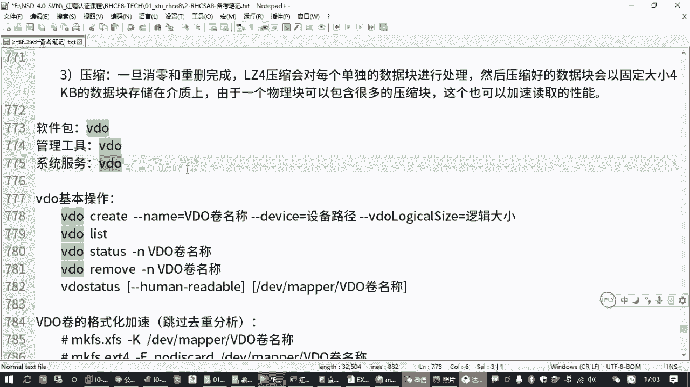

# 全网最全红帽认证／RHCE／RHCSA 零基础入门教程 - P23：3.08-VDO虚拟卷 - 达内-coding头号粉丝 - BV1z54y177Zk

Yeah。那VDO卷这个题目的话呢。出了一个新的存储方案啊，但是这个存储方案呢其实用的不多啊，但是。在红帽7里面其实就有，只不过呢红帽也没怎么推，然后在红包八里面又推出来了。是一个新鲜玩意，但是。

反正我们也没怎么用，用的也不多啊，就我是我我们的感觉就是好像跟红包7里面那个什么300呀嗯，什么那个名客户有点福气一样子啊，就是很少用，但是感觉好像挺有用的，他是用的也不多。那VDO是个什么东西啊。

我们先认识一下。😊。

哎，一会操作特别简单啊。那VDO啊它是一个缩写，叫做虚拟数据优化器啊，什么叫虚拟数据优化器是吧？它其实在我们的红包八的系统里边呢，它是一个内客模块。😊。

这个100度一大码啊。它的作用对于我们管理员来说，它的一个作用是把我们磁盘里面有一些文件数据，如果是重复的。他可以把它给删除，减少啊。啊，就大概是这样一个思路。

那它的好处就是可以减少我们磁盘的一个空间占用啊，减少我们的一个磁盘的空间占用。来啥意思呢？就假设我有一个。嗯，有1个200G的一个文件，这200G的一个文件的话呢，我在我的这个存储设备上。

可能我要存好几份。因为你存好几份，你给不同的人用嘛，是吧？给不同的人用的时候呢，它访问路径不一样。😡，对吧那这种情况下呢，你如果存三份200G乘以3，是不是就600G啊？对吧那就600G。

但是呢如果你用这种VDO券的话，那么它其实是不需要占用600G的啊。😡，他只需要占一份就在200G。但是给用户的感觉，每一个用户他都会觉得唉我用的是200G。对吧有这样一种特点啊啊那具体实现的机制。

具体实现的机制啊，它这里有详细的解说，我就不啰嗦了啊。比方采用了一些什么叫零区块排除啊啊，重复数据删除啊这样的对不对啊，像这种效果，那咱们打个比方嘛。😊。

一须。他这里这是我百度到的一个资料啊，说是用水杯里的水和砂纸混合是吧？啊，像滤纸什么把那沙纸分离空间给过滤出来这一堆。😊，那我给你换个比方哈。😊，比方说咱们现在应应该有很多同学都用那个百度网盘。

那假设我们是百度网盘的服务器。那咱们有10个同学，每个同学都有两个T的空间。😡，那大家有没有想过我们在百度那个存储服务器上，是不是真的我们每一个同学都真正的占用了两个T的空间呢？肯定不是是吧。

那百度没有那么大没没有那么阔气的啊。😡，但是我有10个百度网盘的会员，那每一个同学你都觉得自己有2T的空间。😡，但是你实际上中间有一个同学，你传了一个红帽八的一个镜像，假设这个镜像是5个G。

那你这5个G你分享给另外一个同学的时候，另外一个同学存到他的这个网盘空间去，他是不是觉得哎也占用了5个G啊，对吧？但是实际上呢。😡，我10个同学，假设假设这10个同学每一个同学都存了红包八的镜像。😡。

这个镜像在百度那边其实只需要存一份。因为他那边和检检释到你这个数据是一样的，是重复的数据吧，是吧？但是用户感觉不一样呀，用户感觉我这用的就是两个T的空间啊。但是我这两个T的空间中间可能有一大部分的数据。

别的用户早就有同样的数据了。😡，那对百度来说，这个可以节省空间的。😡，不需要重复吧是吧，这叫去重啊去重。所以减少重复的数据。对吧这是他的好处。那对我们的管理员，我们感觉的是什么？

我们就是相当于给用户分配了很多个。😡，那个存储的设备分出去的时候有很大的空间，但是用户觉得有很大的空间。但我们管理员要知道。对吧我们管理员要知道，假设你那10个会10个百度会员用户啊。

每一个用户全部上传的都是你自己录制的视频。全部都是新的，没有重复的那这10个人同时都要把两个T空间占满。😡，那是不是就是20个T啊？😡，但是百度那边的话呢。它其实没有20T的空间。

它可能那个存储服务器就准备了10T的空间。但是他可以给用户说，我给了你10个用户，每个人2T，你们可以用20T的空间。百度不需要真正提供暗示T。甚至在某些情况下夸张一点，他可能两个T都都不用，对吧？😡。

所这有一个虚拟空间啊，有个膨膨胀是吧？它可以用个10个T的空间。去真正的提供20T的服务。啊，这就是他的好处。但是对用户来说呢，你不知道啊。😡，反正你用的空间到那个数量之后呢，它能够给你满足。

如果有重复的数据呢，他悄悄的给你删除。除非啊哪一天你这10个会员用户全部都是两T，全都在忙，全部都是新数据。百度那个服务器就挂了。😊，啊，但是这个打个比方啊。

百度那边会有其他的一些防止出现这种情况的一些措施，一些检测，不会一下子就挂的啊。但是咱们在做练习的时候，如果你遇到这种情况。😊，比方说你拿一个10个G的磁盘。你给别人说，我这给你1个50G的磁盘。

那假设你正的往里边存1个10个G的数据，你这个磁盘就挂了啊，你再往里面加数据加不进去的啊，有这种情况，所以其实它有一个虚拟空间或者叫逻辑空间啊。😡，啥意思呢？就是说你给一个原始磁盘啊。

我在这里给你敲一下。原始四方形可能是10个G。但是你把这10个G给别人用的时候，有个叫逻辑磁盘。说计算机领域这个还是蛮神奇的是吧？这个逻辑磁盘呢，别人看到的时候可能是50G。😊，只是只限于看到啊。

只限于感觉这是50G的磁盘。但是它并不能真正超过50G啊，其实呢并不能真正超过10个G。所以只是一个表面上找心理作用，是吧？😡，其实我们心理作业，我感觉我用百度网盘用两个T也可以啊。哎。

但是呢根本就用不了那两个T。😊，对吧这是他的感觉啊。😡，呃，那我们做这个题目的时候呢，也就是获得一个虚拟的一个磁盘大小啊，来看题目。😊。

那要求我们呢用没有分区的磁盘VDC。考试的时候没有标这个啊，这是我们我给大家标的。就是他只是说了一个使用没有分区的那一块盘啊来做这个题目。呃，然后呢要求创建一个叫VDO券。

名字叫卖VDO逻辑大小是50个G，是不是就刚才我们说的这个虚拟大小啊，对吧？呃，为什么叫虚拟大小呢？那咱们看一下呗。

LS blocklock。你看一下VDC是多大，只有10个G。但是你要利用这10个G的磁盘呢创建出一块虚拟的大小是50个G的存储设备出来。

这种机制就叫VDO券啊。😡，然后你创建完了完成之后呢，你要把它格式化，用叉FS格式化。格式化完成之后呢，你看它的大小就是5G。😊，对吧你从用户层面的那些程序，他是不知道你这是10个G的啊。Yeah。

最后你格式化要挂载啊，大家能够看到这个效果就可以。😡，所以考试的时候很简单啊，当你课下有空的时候呢，你可以再去往里边存一个。😊，镜像你找一个比较大的一个镜像，往里边拷好几份，换个不同的名字。

你看看它到底占用了多大是吧，你感受一下嘛。😡，来我们试一下啊，那如果要做这个VDO券的话呢，我们需要装一个包啊，装包配置啊，起服务嘛，是吧？那装包的话呢。

啊，那个包叫一般我们就记一个包叫VDO就行啊。

杠Yinstore VDO。把这个包给装上。然后装上这个包之后呢，然后对应的系统服务。也叫VDO啊也叫VDO啊。呃，那我们在管理这个viddeo卷的时候，用到一个工具啊，我们不需要去改配置文件。

但是有一个工具，这个工具叫什么呢？叫。

V丢还就叫VD啊。啊，这个好记是吧？你看呃软件包叫VDO后面这个是依赖包，它一般会自动装上，咱就不用记装这个包，它自动就记就把那个包装上了，管理工具也叫VDO，然后系统服务也叫VDO啊。

你就记住这个关键词。😊。

呃，用VDO怎么操作呢？这个命令。😡，后边有几个常见的操作啊，如果要创建一个新的video卷，create。创建啊，后面呢一般情况要指定三个东西。第一个东西就是你要建的这个虚拟卷啊啊VDO卷。

你说念谁不好不好不好记你叫虚拟卷也行是吧？啊，或者还是叫VDO件也行，无所谓啊。就是你要给他指个指定一个名字，用杠杠类等于来指定它的一个名字。😊，哎，你看咱们考试题不要求吗？名称叫卖V丢是吧？

然后又指定它的一个大小。

对吧那你除了名称和大小以外，还要指什么？😡，我们做逻辑卷的时候，你要指定从哪个卷组画空间。那你现在做VDO卷，你得给它设备呀，是吧？所以呢除了名称。

再有一个呃大小呢就是杠杠VDO logical size啊，叫逻辑卷的大小逻辑大小啊，就这个虚拟大小。😊。

还有一个杠杠device，这是设备的路径。刚刚类目呢是名称，所以你要指定这这三个东西。啊，名称设备大小。那这个大小就是那个虚拟大小。刚才我们说要把VDC。是吧要把VDC。10个G做成50个G。

那它的逻辑大小呢就应该写50个GB啊。这是操作最核心的一条命令。当你建完之后呢，你可以用刚刚用那个Vdeo list来查看结果，你也可以用那个video statuss去看它的详细状态。

如果你一个不小心建错了，你可以轮轮我啊，把它去删除，对吧？可以去把它去删除，你要去统计看到具体的信息呢，有个工具叫VDO status啊。😊，它两个展示的方式有一点区别啊，上面是直接用VDO去看。

我们以后可以对比一下，对吧？这是创建，创建完成之后呢，也要格式化。呃，然后格式化的时候呢，注意一下。😊，如果我们用那个叉FS的方式去格式化，建议大家加一个杠K。啊，建议大家加一个杠K呃，为什么呢？😊。

如果你不加杠K，你实际的磁盘，你把它变成50个GB，这空间是不是好大呀？那他会老老实实按照50个G去格式化，那会很慢很慢啊。呃，因为本身我们做的就是一个虚拟券。那你在格式化的时候呢。

你让它跳过重复数据的一个分析。因为这个本身VDO就在做这个了。所以你要跳过去重分析啊，怎么跳过来？加一个杠K。啊，这一个技巧啊，加一个刚K之后呢，那么这个50GB的或者你50T的是吧？格式化都会很快。

那如果要求你格式化的时候是EXT4。那大家要加一个杠大写的E，有一个叫no discard啊。然后再跟上你这个卷组那那个VDO卷的一个名字。呃，VDO卷建好之后啊，默认也是在D一V下有个meal。

再直接写VDO卷的一个名字。啊，这是它的一个要点。你如果忘记加这个的话呢，嗯不行，你就ctrl C重新来。否则的话会很慢啊会很慢啊，你可能会受不了是吧？😊，呃。

最后呢题目会要求你开机之后自动挂载到一个目录，那就同样的道理，你要创建一个挂载点是吧？啊，然后呢再去写开机挂载配置文件。😊。

开机快的配置文件呢大家注意啊，要加一个参数，这个参数叫什么呢？叫。好长啊，一个叫叉杠sstemD点request等于VDO点service。啥意思啊？😡，就说我这个VDO券在挂载的时候。

他要先把我们的VDO这个服务启动。为等这个VDO服务启动起来之后啊，我们再去挂载这个VDO券。哎，要不然的你挂不上啊，所以要加一个这个参数，否则的话一重启就会卡在那里啊。

这个是大家可能会碰到的一个问题啊，可能会碰到的这个问题。当然这个操作呢。😊，我相信大家都觉得不好进。我们也觉得不好记。😊，但是这是正规军做法啊，就官方教材里边说就应该这么写，它原原本本的就应该这么写。

但是呢咱们可以走偏门啊，你看大家如果想简化一下的话。可以走偏门啊。偏门参数啥意思呢？你可以把这个这一长串。Okay。可以换成。下划线net DV啊。当这是不是正规做法，我就跟大家这么一说。

那为什么我们说换成这个也好使呢？😡，你想呀，我们开机的时候，lininux不是要起很多服务吗？那他在挂载这个VDO券的时候，是不是要等这个VDO服务启动起来之后再去挂载呀？嗯，那你如果写这个是可以的。

但是我们换成netDV，这个又是啥意思呢？这个是表示。等你的网络地址、网卡设备都正常以后啊。这是等网络启用之后。再来刮我我们的这个设备。那其实呢根据我们实际测试的效果，当你的网络都已经好了的时候。

你Vo这个服务其实也已经起来了啊。所以大家你只要加一个这个也行。但你要是愿意，这两个都加上也无所谓啊。😊，所以你加这个或者加这个随便加一种都行啊，就看你能记住哪个。但是你不加不行啊。😡。

不加可能会导致你这台机器开机的时候起不来，它会提示你这有一个设备呢挂不上，请你输入管理员密码进去修复。那你考试的时候，这个地方可能这个不录这个机器去挂。是吧你自己要进去改正，然后再重启才好使。

所以千万这个地方注意。好，那这一对讲完之后，我们来看操作啊，还有一个记不住的是吧？VDO这么一长串命令我哪记得住啊？😊。

那怎么办呢？但你用的多了就记住了啊，你用的不多呢，大家学会找帮助。😡。

那刚才我们是装好这个包了是吧，然后怎么去用？MANVDO。看帮助。回收打开往下去查找啊。打开帮助手册这个往下去翻。😡，如果你有时间呢，就慢慢去翻。如果你没有时间呢，打开之后请输入一个斜杠。

就根不住这个斜杠查找啊，查找一个jupo。

EXAM。这有一个样板啊，示例。在示例下边，井号找到这里，这就是那条命令。这条命令的操作呢是创建一个名字叫VDO0的使用第一V下的SDBE的这个设备，虚拟大小是10个T的。啊，这一个VDO券。

那你看到这个你就会了啊，复制退出来啊，粘贴。

改呗是吧。😡，根据题目要求名字改成题目要求的，比方说叫卖VDO。然后设备我们是不是用的是DEV下的VDC呀，虚拟大小改的是50个GB。对吧。😡，来确认一下卖VDO50G。

VDC。

然后回撤。正在创建创建成功是吧？创建成功之后呢，设备在哪啊？他后面是不是告诉我了，在这。😡，这就创建好了，创建好了之后呢，我们VDO有个list，你看一下可以列出来会有一个新的VDO券。

那如果要看状态的话呢，stats是吧？这是看状态。😡，然后这个就看到信息很多啊，特别多。那你可以去找到。😡，你可以慢慢看是吧？你找到它具体的那个设备啊，这不用了1个第一位下载VDC吗？是吧？

大对应的这个设备状态啊，现在正在已经启用。你做好之后呢，它默认就是启用的啊，默认就是启用的这是存储设备，然后虚拟的设备在这。😊，对吧这个大家能看到吧是吧？它物理的大小呢是10个GB啊慢慢找啊。

逻辑大小呢是50个GB。😊，这就是看详细信息啊，叫VDO statuss。然后刚刚我还讲了几个。啊，就这几个了是吧？嗯，还有一个VDO直接写的是tto啊，这个能直接全全列出来不？VDO statuss。

这个是个简洁的啊简洁的。刚才我们这个呢中间加一个空格，这是另外一个命令哈，是吧？上面这个命令直接写VDOt啊，你可以看到这个设备，然后它的。😊，大小。这大小多大可用的是吧，已经用的用了40%了。

然后你看这个单位看不明白是吧？啊，怎么办呢？加一个杠杠homanreadable啊，就让他说人话是吧？homanreadable嘛说人能看懂的话啊。😊。

你从这里面去看一下，看能不能有有效的信息。VDO status。

那这是哪个选哪个命令呢？刚杠horead apple。

VDO statuss命令没找着。啊，多敲这个东西啊。STATS。是吧这样你看这个大小就好看一点了，是吧？10个G。😊，现在你是看实际的大小啊，用VDO states看实际的大小。

因为你是在管理VDO卷嘛，你看到它的实际大小是10个G。呃，那用户看到的是多大呀？

我们要用是吧，怎么用呢？格式化叉FS。

那格式化叉FS类型的时候，make FS点叉FS杠大K。是吧跟一个大K啊，然后跟上第一位下载mle，然后卖VDO这个吧。这据刚才这个设备啊。

快速格式化记得加杠K啊，记得加杠K。如果要求做EXT4，就加这一段啊。这你倒记不住了，你到时候要去查查手册，要不就背下来啊。

回收很快是吧？格式化完成之后，还要求我们做什么？😊。

开机自动挂载啊，未必block是吧？未block啊，copy创建一个目录。

挂载点。makeDNR跟下的V block。然后用挂载吧，那挂载的时候呢。😡，YIMETC下的FSTB。大部分的操作跟前面这些差不多，你哪怕你复制一下来是吧？😡，然后把这个设备改成。

刚刚我们的这个VDO券mle底下的myVDO。挂在点呢挂载点写成我们刚刚创建的那个目录。为 block是吧，文件系统类型改成你刚刚格式画的叉FS。如果你不重启，那后边你不用改，现在也能用。

对吧然后用的时候呢，就是你手动去启一下VDO这个服务。然后记着呢比较零碎啊，enbel。然后我们mount杠A。挂载一下啊，如果挂载成功了，我们也可以去检查一下是吧？你看一下V block这个下边啊。

看一下大它它的大小是多大。啊，你看你用DAF，这相当于是我们用户的程序了嘛，是吧？你在看你的这个挂在点的时候，你看是不是50个G啊。😊，50个G吧是吧，但告时你用的是现在可用50个G。

已经用了300多这忽略不计了嘛？然后你用那个VDO statuss啊，VDO states啊这个。

我看一下这个。啊，这里写错了是吧，给你纠正一下啊，后边笔记里更新一下啊，VDOstate啊这多一个U啊。😊。

应该是这个命令，看VDO的统计数据，你可以看它实际的大小是10个G。是吧然后你虚拟大小是50个G啊，用户他会觉得他用的是50个G的一个呃一个设备。嗯，那。我们可能这个考点，你得找一个比较大的文件啊。

这文件比较小，可能看不出效果。我们看有没有系统里面有没有现成的文件。刚sS超过100兆的有没有？Yeah。都没有了是吧？😊，大家到时候你在课下的时候找一个比较大的文件去测试啊，可能看效果会更明显。啊。

我们先看一下这个文件。艺术。LS杠LH。还，没贴上。Yes。でし。Yes。boot下边有一个。你那是吧。是叫这个吗？0。啊，57兆是吧？我们用这个试一下啊，可能效果不明显啊。嗯，意思是什么意思呢？

就是我们可以考几个考一个文件，比较大的一个文件，你把它复制。😊，把这个文件呢复制到我们的挂载点啊，就VDO券的挂载点。比方说这里的V block是吧？目录下边改个名字叫范一。第一个文件吧是吧？嗯。

然后我们看看它的一个大小啊。VDO刚他前面这逃命令。你看它实际占用的大小。现在是使用了4。1个G。然后我们再拷贝几次。拷贝一个范号2，再拷贝一个范号3。再拷贝一个范号4。来多烤几个。

是吧那应该考了好几分嘛，考了好几分之后呢，我们再来检查一下。😊，你观察一下这个右右侧的啊，右侧的啊，你会发现这个大小好像没怎么变，是吧？😡，对不对？但是其实呢我拷贝是不是拷贝了5份文件啊？😡。

从第一份之后，是不是又加了4份啊？四份的话，就算这个文件一个文件是57兆，那四份也应该是200多兆了呀。但是你看他用的空间有加吗？😡，是不是还是4。1G啊？😡，没加多少吧。😡。

所以大家你们自己课下练习的时候呢，你你哪怕你从你真集想办法传一个镜像进去啊都行啊，那个效果就更明显。你可能往里面考了好几个G啊，四五个G是吧？但是呢它其实这个大小呢用的就是那一份，增加的不不会特别多啊。

嗯，但是你想我们从用户的角度来说，他看大小大小的时候。😊，DF。杠HT看我们的V block。你看是不是用了600多兆了。对不对？它原来不是有一道吗？这个要前后对比啊，你现在加了好多空间。

但是我们刚刚用的那个，其实是不就是他要准备这5世G的空间啊，它要有一些虚拟的数据。所以你要和它拷贝之前和之后去对比。你不要看他原来用多少，我们刚才考了5分文件，加起来不也就才。😡，不到300兆嘛，是吧？

😡，所以你要看他原来考文件之前多大，你考了几份文件之后又多大，你同样的文件，你多复制几份，又是变成多大是吧？😡，那你看我们这个文件，你放到。V block底下。LS看一下，这不5个文件吗？

但是它数据是重复的这就是我们说去重嘛。😡。

那红包这个考题呀，考的就是这个。啊，那其实这个点为什么说不难呢？😡。

你现在大家觉得难吗？😊，我们是不是。

就是装一个包，然后呢提一下服务，然后通过慢手册找到那条命令，把命令复制出来，改写一下格式化，然后配置创建挂载点目录，然后开机挂载嘛？其实本来就是有点繁琐是吧？

而且。

刚才我们说了改开机挂载配置文件的时候。你如果不重启，没事啊，一重启它可能就会卡在这里。那插在哪呢？就插在这个defor这个地方啊。按照默认的配置，它不会等你那个VDO开启再去挂载。

所以它挂载的时候一看VDO没开好，就卡在这里了。😊，他不知道干嘛了是吧，等你Vo起来之后，也不会主动去告诉他，所以就是你等我，我等你啊，就停在那里就开不了机了。😡，所以大家要把这个dforce呢。

你在后面加一个。😊。

就刚才我们所说的这一串。啊。

这个其实你有这个非默认的设置，你在后边加上这个是可以的啊。呃，如果你觉得呢懒得敲，你把这个deportS不要也是可以的。如果你觉得这一串太长了，我也不想写。刚才讲了一个偏门的方法是吧？

你写一个下划线netDEV也行啊也行。这样的话一重启。还能还是能够正常挂载的啊。那这是VDO卷啊，VDO卷这道题目。

来，大家也测试一下吧，好吧。😊。

呃，其实如果你想看效果呢，这个考试的时候不用做啊，看效果的话呢，就是大家做这个操作和你用那个DFDF去对比。看它的占用大小的变化和它实际大小的使用的空间量的一个变化。但是呢你要去测试效果呢。

就是你要不断的考不同的，就考那个同一个文件，把它换成不同的名字。啊，这是最直接的方式啊最直接的方式。

好吧。😊，Yeah。查找字母是吧？是。打一个斜杠，后边完整的单词是叫examples。一般你不用敲全了，就敲前面那个EXA就差不多了。

我给你测试一下。漫威DO斜杠大写的EXA回车啊，你看就过来了是吧？你不用全全记住，你就记住前三个字母就行。

