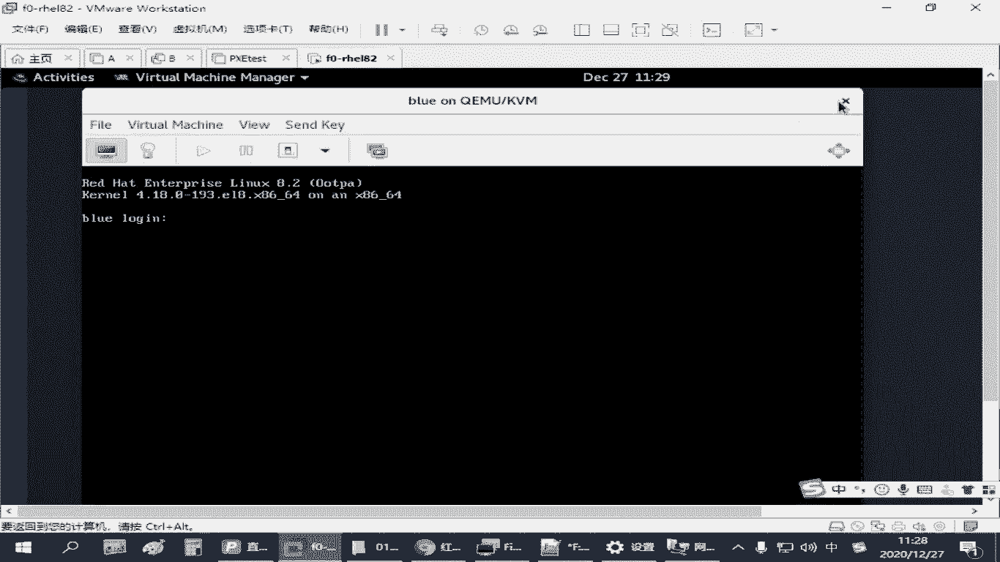
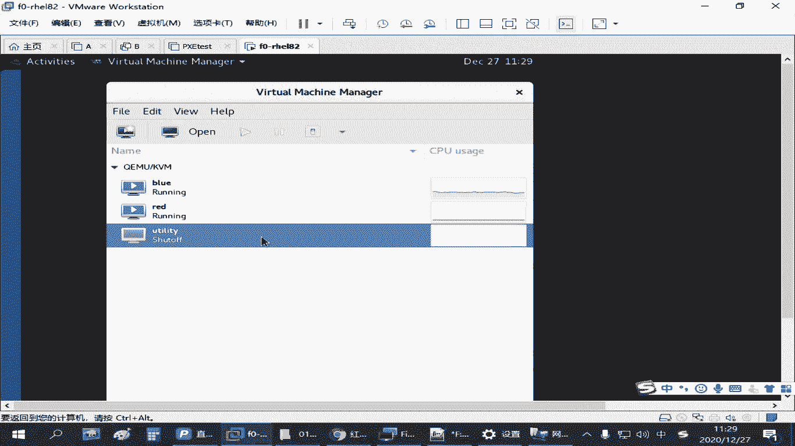
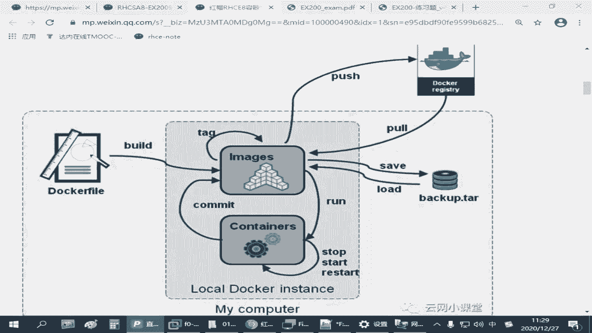
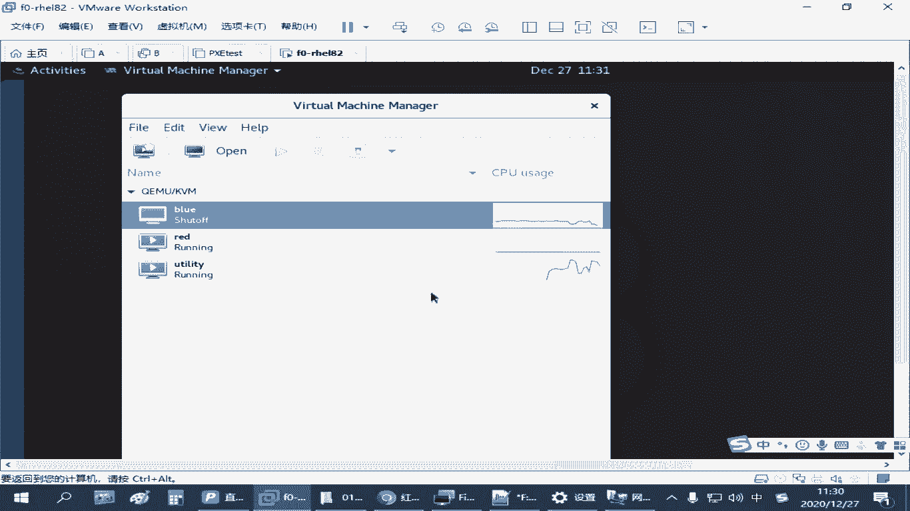
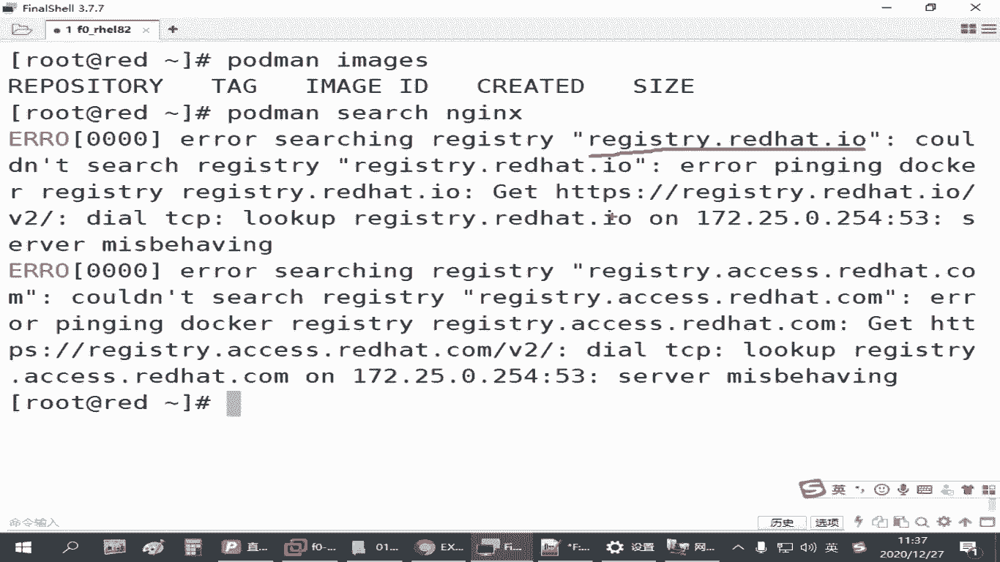
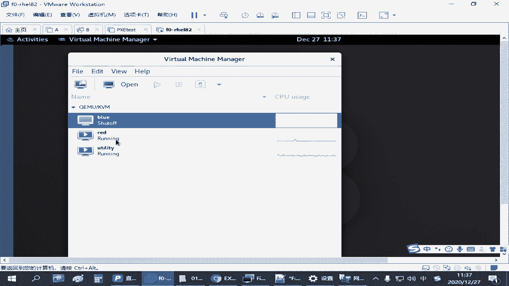
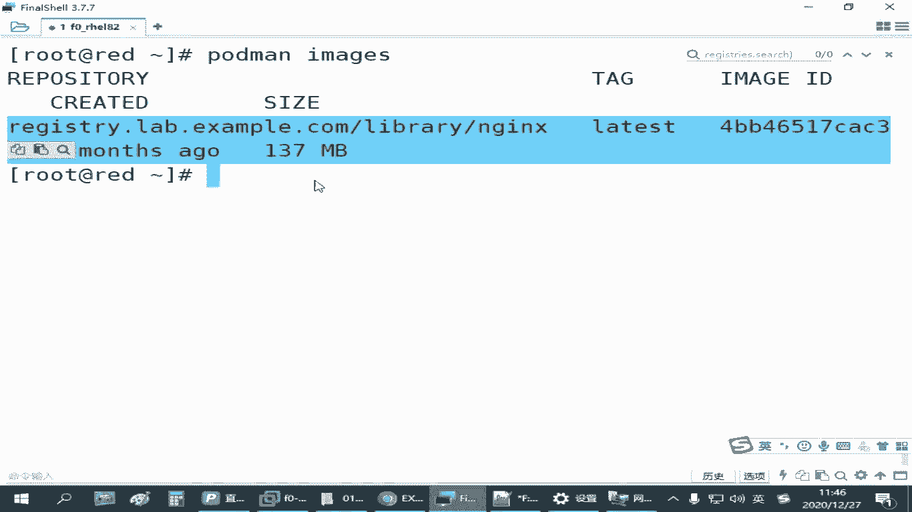

# 全网最全红帽认证／RHCE／RHCSA 零基础入门教程 - P26：4.02-仓库环境配置 - 达内-coding头号粉丝 - BV1z54y177Zk

呃，在红帽这个练习环境里面，我们给大家准备了一个训机，叫UT立体啊。这个讯拟机大家打开之后默认就有。这个虚拟机不能还原啊，所以大家你别把这个虚拟机给删了。这个顺序我们不需要给他做任何的修改程数。

这个讯机就是为我们提供私有仓库的啊。啊，知道这个意思吧，是吧？😊，那如果我们要用这个仓库。啊，怎么办？你要把这讯音机启动起来啊。

。那为什么我们这个环境没有。我们在调环境的时候啊，没有给大家把这熏机默认开启啊，因为这个环境比较占资源啊。比较占资源，应该在4个G以上啊。所以平时大家如果你不练习容器，这个讯机是我是给大家设的。

默认是关闭的。但是如果你想去下载镜像，大家需要把这个。环境啊，把这个虚拟机先开启。开启完成之后，你在配置的时候呢，你都可以用。下载镜像的时候可以用，也需要用。但是当你下载完镜像之后，你觉得哎有镜像了。

我不用了，大家就可以把这个讯拟机关闭了，是吧？这可以节省资源啊，要不然在你练习的时候，有时候可能会比较卡。甚至有时候呢那个虚拟机刚开可能要等很久啊，你才能联系上这个仓库。对吧，在我们环境里面这个瞬机啊。

那如果你暂时要练容器的话呢，其他的虚拟器我们用不到像blue，你就可以把它给关机啊。这也是为了节省资源啊为了节省资源。如果你增机都能跑得起来，那无所谓，都开得出无所谓啊。我们上午的考试两台虚拟机。

下午的考试6台虚拟机，你全跑起来，只要你增肌扛得住。😊，是吧都开着没事啊，就是怕大家有些同学机器可能啊有点吃力是吧？就这么调整一下啊。😊，好，这是我们练习环境，准备这个仓库服务器。

那有了仓库服务器之后呢，相当于我们在我们的。

一个红帽八的主机上来练习这个容器的使用。因为考试是在那个第一个训集上中，所以我们就用我们的那个read啊。连接到我们的red这台机器啊，在这个机器上来练习容器的管理和使用。

那如果要使用这个容器环境的话呢，第一个你需要装一些包啊。需要先装一些不。所以一样你这个圆一定要配好啊。哎，我这个是不是又没配啊？刚刚打了一个环境的是吧，我需要配一下啊。Yeah。

这大家看那个快速配养原表的是了是吧？Okay。道。等候。嗯。Thank。Yeah。那配好样源之后呢，如果要安装容器环境啊呃，y么后边有个操作叫什么呢？叫model。定时个啊在这个。

跟普通的音时多兰不一样啊，加了一个模块啊。后面安装的那个目标呢叫contain。tos啊，需要装这个。这样的一个模块啊，它会把这个软件包和它对应的一些模块配置一起给装上啊，这是我们需要用到的啊。

这个在我们那个笔记上有啊，所以大家先仔细听，一会练习的时候再用啊来说一下安装环境啊，安装环境是mod掉 install杠Y。这个好记啊，叫容器杠ts容器工具嘛，是吧？

装一个这个下面这个操作呢考试的时候不用做。但大家如果有些同学你原来用过docker，你还习惯用dock那个命令是吧？或者你还有一些脚本啊，可能就用dock这个命令的那大家可以装一个这个包。

这是port曼和刀cker兼容的一个工具啊。叫炮的慢杠到开。考试的时候我们就用的portman就行啊，下面这个不需要装啊，这所以这个这个给大家提一下。那装好这个环境之后，我们如果要访问我们的这个仓库。

最核心的那个工具啊就是PODMON。那其中呢我们在管理镜像的时候。其实我们说访问仓库咋访问，不就是用那个命令来联系这个仓库嘛，是吧？去下载这个镜像嘛？但是你在没有下载镜像的时候。

你本机是没有任何镜像的啊。但有一个最基础的命令啊，叫什么呢？叫。一面解释啊，就是我们下面这个镜像管理。镜像管理的操作的话呢。他有个叫什么呢？下载镜像。查看镜像啊叫images啊，下载镜像的话呢叫那个。

破刚才讲的是吧？image是是列出镜像，或是下载镜像啊。都是跟在我们那个port man后边。跟着我们portman后面。那我们先看刚才我们这个这包还没装上。就大家一会先检查一下有没有镜像。

如果没有再去下载。那下载之前我们是不是要查询一下你服务器上给我们提供了哪些镜像。那这个操作呢叫售气啊SEAROHH受气空格后面可以跟上关键词。我要知道有哪些镜像呀，能用的呀，是吧？再去搜索。

比方说我们那个考试题目。他会要求我们利用仓库服器上面的某某镜像，那你得找到。根据他给的这个名字去找到那个镜像的地址，再把它下载回来。那这个注册表服务器呢，在我们的那个考试环境，它会有一个说明会告诉你。

嗯，咱们这个地方应该也有个说明会说啊。有一个容器仓库位于什么什么。考试的时候可能会叫做什么容注册表服务器什么什么啊那账户名ad me密码呢啊readd hat321是吧？这是有用的信息啊，如果需要的话。

哎咱们就可以用。如果不需要呢，咱们也可以不用啊。他给我们这个账号不一定要求你一定用的啊。要看实际情况。来，我们看一下，我们把这个环境包装完之后，我们可以用port man这个命令啊。

images看一下当前有哪些镜像，现在是不是任何都没有是吧？它会列出你这个镜像从哪个仓库来的，它的标记是什么啊，它的ID。还有它的大小。还有创建的一些相关的一些设置是吧？都在这里。

现在是没有任何的镜像的啊。如果我们想查镜像的话呢，有个指名叫。就在port man后边啊跟一个source。寿星。比方说我想搜索一个呃NG镜像。就起一个这个名字啊，指定这个名称去查询。那查询的时候。

如果你装完环境之后，你直接就这么去查，它就会报错。那大家通过这个报错呢，你会发现他在收哪一个仓库啊？在搜红mod的。他原来默认的配置是找的这个不是找那个access那个是吧？

找的是register去点readhead点IO。他告诉你无法连接。连不上呀，是不是连不上。那既然连不上，那我们等该怎么办？我们是得配置一下，告诉你这个port man去找我们自己那个私有仓库。

或者咱们在你们自己家练习的时候，你没有环境，自己找一个正常的机器，你要把它改成我们那什么刀口点IO是不是也可以啊？

是吧你都可以都可以去测试啊，那怎么去改呢？😡，Yeah。刚才我们的这个讯机啊，Uity它为我们准备的就是咱们的练习环境的。刚刚那个叫reg缺点lab点一个点com啊。

那把那个讯拟机开启之后，我们要去改一个配置文件，这个配置文件就放在ETC底下，叫container。containers啊下边有个叫reg trace点CONF这就是我们所说那个注射表服器嘛。

是吧那叫rech它的配置文件EDC下面的容器目录啊。找到这个配置文件之后呢，打开啊往下看。有一段配置叫做搜索的仓库地址啊。如果搜索仓库地址有多个，在这个regtry后边啊，等号后边放括号括起来。

里面用逗号分隔，每一个地址用引号引起来啊。那现在我们练习的时候，那只有一个是吧？那只有一个的话呢，那我们就把多余的要删除啊。就留一个就行啊。然后里边改成练习环境，给我们那个地址啊。叫这个是吧。

等考试的时候，他给你的那个地址是多少就多少。因为因为你要下镜向，你得求着别人啊，是吧？人家告诉你地址，你都不用，那你怎么连上呢？所以这是一个。😡，那这个改完之后呢，我们就可以再去搜索。这是叫搜索啊。

决定搜索哪个仓库。来，我们可以再搜索。那搜索的时候你会发现又报错了，是吧？😡，那你会发现光改了这一个还不够，但是他现在报错呢比刚刚我们那个报错好像少一点，是吧？呃，没有说我连不上那个仓库了啊。

但是他告诉我没有办法搜索。为啥没有办法搜索呢？他告诉我有个什么证书。签名是被未知的授权机构颁发的。哎，啥意思呢？就是我们这个仓库，他是要求HTTPS加密的那加密的话呢，他给了我们一个网站证书。

这个证书呢，现在你也不能联网，它也不是一个什么第三方的那种权威机构发的。所以他觉得这个不可靠。那不可靠的机构给你一个证书，你敢用吗？是吧？那默认他是觉得不应该用啊。😡，那咱们这个练习环境。

考试环境有可能可以啊。在练习环境呢，这个他的证书应该是过期了，反正你也不能上网去验证。那不管怎么样啊，不管是考试文境还是练习环境。如果我觉得我就想用怎么办是吧？还是刚刚这个配置文件。

除了指定去哪搜索以外，往下找啊。还有一个。有一些仓库是不安全的，我知道它不安全是吧？但是我也想用。你需要把它列到。这一段啊。叫resch点in circle是吧？就不安全，不安全没关系，我不在意啊。

我不介意。那你需要加到我们的register里边啊，这里边来啊。记住配置格式啊，里边要用单引号引起来，写上你的这个仓库的地址。那就是缺定nb点sample点com。那这个再保存。

是吧如果你这个已经声明了啊，就相当于你已经告诉port man这个命令。所以我知道这个仓库不安全，不安全无所谓，你就帮我去搜就行。改完这两个地方啊，再来搜索。是不是就能查到一个结果？

对吧这个时候你会发现。😊，啊，你找到了一个结果啊，他给我的结果呢，你看到。他的地址啊，这一长串。这是他的一个标记下载的一个标记啊。是在我们指定的这个仓库服务器下面啊，有个路径，你给他指定镜下的名称。

根据这个标记来下载就行。后面还有一些什么屏。呃，几芯的啊是吧，自动生成的什么什么的，这东西咱不就别管啊，还有是否是官方发布的有些标记，它后面这分看不着嘛，是吧？还有这个stars是这个。😊。

就好像我们有时候在网上找一些资料。他会给他评级。因为NG这个镜像呢，有很多人都会提供。除了官方这个网站，他能提供，那官方网站上还有别的用户上传的。比方说我也做一个N这个是镜像，我上传到。😡。

红帽那个官方上去或者刀ck那个官方上去，你可能都会搜索出来。那你有时候大家可能要看一下这个评分。一般那个屏幕那个数字是最大的，就是就是还影的，用的最多的是吧？当咱们这个镜像仓库里面，你就搜搜索。

只能搜到一个啊。搜索到这个镜像之后，如果你想把它拿下来啊，我们要去下载啊。下载的操作呢，刚才我们讲叫什么？破是吧，PULL下载。下载的时候呢，会面跟上你刚刚搜到的这个。地址啊把它复制。粘贴啊。然后回车。

他就会去联系我们这个仓库服务警。把它下载回来啊。下载回来的镜像会放在我们。系统里面的某一个固定的一个目录。啊，基本上在那个VIRLIB下面啊，它下载回来之后呢，这个金效呢展开的话应该是。晚晓得你来不？

容器是吧，工作目录应该在这啊，它一个存储。是吧缓存啊等等等等，这个目录结构不是一个单个单个的文件啊，咱不用管，你大概知道存那个就行。你下载的容器越多，它占用的空间越大。

是吧这是他的一个主要的一个镜像的一个目录啊。那工作的时候，后面我们跑去跑跑了个镜像，镜像跑起来就变成容器，应该有一个望。乱是吧，现没跑是没有，后来运行的时候，这个是运行状态，咱也不用管了，对吧？

但是呢你下载完镜像之后，你知道啊有个地方会存在。但是谁没事记这个去啊是吧？不记。那我们管理镜像的时候呢，都是holdman images列表。这个时候你会发现啊有一个镜像啊来自于这个地方的啊。😊。

他现在占用的大小是137兆。然后他后边有个叫什么凯瑞的，是4个月之前创建的这个镜像啊。我是现在下载的啊，但是这个镜效呢是4个月之前别人创建的上传。对不对？然后中间还有个标记。

这个标记呢相当于是它一个版本啊，目前是最新版。我们后边在管理这个镜像的时候呢，呃前面这个是来自于哪个仓库，以及它的名称，后面这是一个版本标记啊，一个叫tag标记。我们在用这个某一个镜像的时候。

中间啊如果指这个镜像完整的名字，一般是把这个repoory啊和这个tag合起来写，中间用冒号分隔啊。来唯一区分一个镜像啊。对吧这是比较方便的一种方式。为什么呢？😡，因为你单凭这个NJ这个名字。

有时候我这个主机上我可能要下好几个版本的镜像啊，一个是N这个是1。7的，另外一个是NG个11。9的，可以吧，是吧？它是可以同时存在的。那如果你要区分，你光用一个NG可能就不准确。

那这个时候我们就可以把这个名称冒号分割加后币这个名称一起写上。这个标记可能叫n，这叫最新版，也可能叫1。9。可能呢这是另外一个镜像，可能还有一个镜像呢，可能叫1。7，这是允许的。知道吧？

所以我们说NG作为一个容器。在运行的时候会非常方便，做一个镜像也一样，你可以多个不同的版本呢同时存在你当前这个主机上。但如果你没有容器，我在我这一个组织上，你要装多个不同版本的软件包。

你用RPM那种方式可能就很费劲。你用原码包的方式呢，可能还方便一点，你放几个录和不同的目录就行，是不是？OK吧，这在管理镜像的时候啊，一会呢大家做完我们这个环境，把这个镜像下载回来啊。

用port man email解释啊，要能够看到。好吧。来，大家先把我们这个环境先部署上啊。然后确保把这个镜像下载回来。

Yeah。