# 全网最全红帽认证／RHCE／RHCSA 零基础入门教程 - P30：4.06-rootless无根环境 - 达内-coding头号粉丝 - BV1z54y177Zk

考试的时候，我们在用这个容器的时候，有个叫lutenous啊，无根环境的啊这样一个东西。呃，指的是什么意思呢？root list就是你没有管理员权限的时候。我们也需要去运行容器。

所以这个主要针对的是什么？针对是那个非非root用户啊，非root用户。如何。通过系统服务。来启用或者说来管理这个东西啊。对吧是做这个的。那这个操作呢和我们刚刚那个。刚刚我们给他做实验的时候。

是用管理员来做的是吧？和管理员来做呢嗯有一点点区别啊有一点点区别。首先呢普通用户你在开，如果要开端口的话，正常情况下应该是只能。开1024以上的端口啊，因为1024以下，那系统默认有一个保留范围啊。

是不让我们非注册用户去开的。如果要开端口的话。第二个呢，普通用户他如果用容器，这个默认是允许的啊。默认是允许的。因为容器它的设计就是为我们用户有个隔离的一个环境嘛，每个容器都是独立的。

所以普通用户他也可以运行容器。请你注意一下这个端口。Yeah。那容器没问题，那现在要解决是系统服务啊。系统服务普通用户怎么去添加我们自己的系统服务？是吧那这个地方呢要注意一下，它的一个配置。

就系统服务那个配置目录啊，为我们普通用户准备的那个配置目录呢，在我们的用户的。加目录下有一个特殊的目录是点开头的confi。下面有个ssD。然后下面有个叫user啊。有个这个目录。

我们需要把那个配置呢放到这个目录上啊，然后再去把它给更新系统服务配置。那用户的这些系统服务呢，大家还要注意用户的系统服务。和我们整个管理员环境的那个系统服务，它是分开的啊。后边我们普通用户。

你说你建一个容器叫卖卖we3。那管理员看不见啊管理员看不见管理员建在那两个服务呢，你普通用户。你可能能看见，但是你没权限呀，是吧？😊，所以这个是隔离的啊隔离的。

那再一个普通用户在使用我们这个系统服务的时候，他是不是也需要用Ct目ctrl啊？如果你操作的是你自己定义的这些服务，需要加上杠杠U则啊。要加这个东西。然后后面再去加了一些什么demore呀。

什么star呀，stop呀，enbel啊等等等等。啊，做这些操作。所以差别主要在这。Yeah。当然，在启用容器的时候。用户的容器它也是一个独立的目录啊。用户的容器也是在。用户的主目录下有个点confi。

下面有一个什么coners。所以用户的容器空间、存储和我们的管理员也是分开的。啊，也是分开的。那意味着什么呢？意味着我们管理员刚刚我们下载的这些镜像啊。Yeah。我们现在有一个N这个镜像。

但是普通用户呢。他用不了啊。普通用户你得单独下。

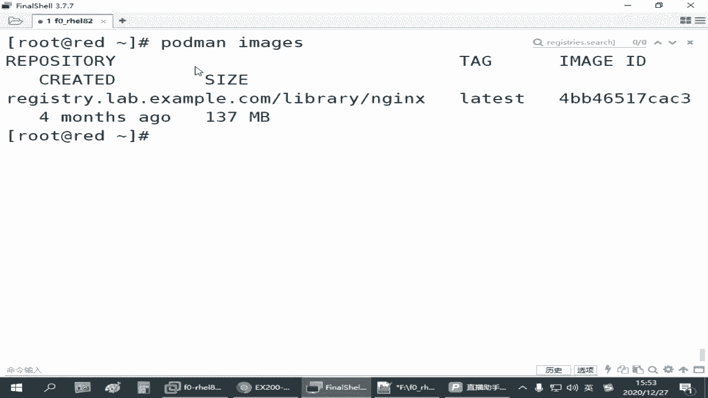

是吧。呃，而且呢。

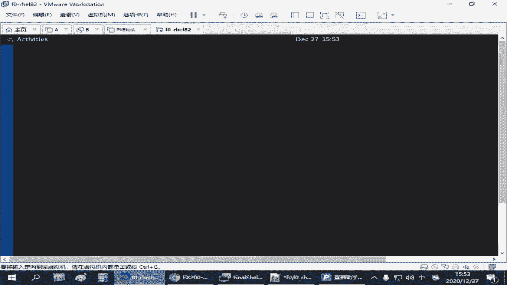

来再开一个啊，而且呢红贸官方教程上说，如果我们要为普通用户使用用户空间的这些服务。呃，不能是竖杠那种方式啊，你需要用SSH这种方式直接去登录到一个普通用户。就你不能管理员登过来。

像我们这边已经是管理员了啊，你输入刚好到一个用户张三这样的这个方式他他会。你会发现不生效啊。因为系统它没有你这种登录的过程。他没有办法为你准备相关的一些资源。因此，那像我们考试的题目。

可能有一个用户账号叫什么他米是吧？那这个用户呢我们提前创建一下。考试的时候是上午的考试那有个训机，是要求创建这个用户的。啊，你不管怎么样吧，反正那个用户要么你自己自己建的，要么就有有提前有的。好。

我们建一个用户账号啊，叫他米。给他设一个密码。Password。是TDE啊，看你。是吧那我们现在这一次无根环节啊，就是以普通用户的身份。去使用他自己的服务。连接到 rat。连接过来之后呢。

那他如果想用镜像holdman image卖机。另外解释，你会发现没有任何镜像吧，是吧？因为管理员这哪下载的镜像，你看不见。

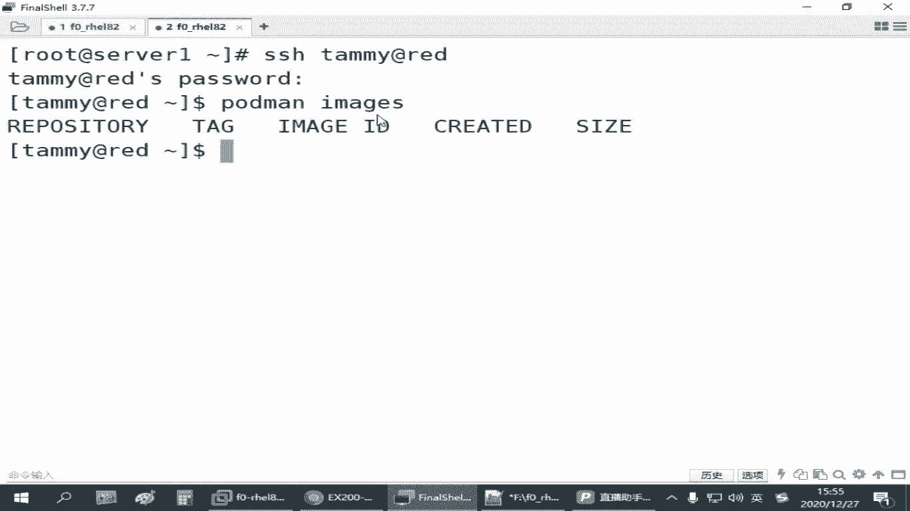

那如果你普通用户也想下载啊一样啊。如果要下载的话，那我们再把那个跑起来啊。

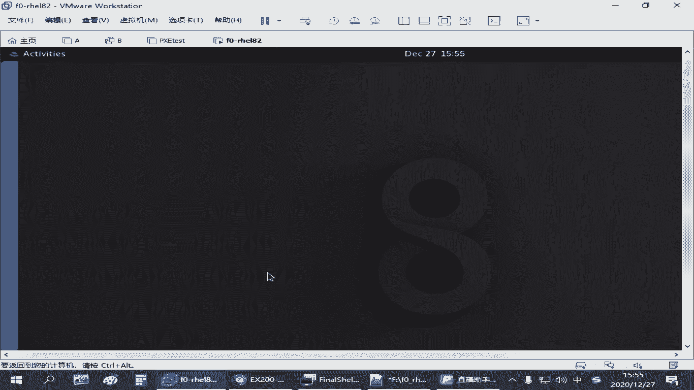

你就把那个讯印机要开一下是吧？

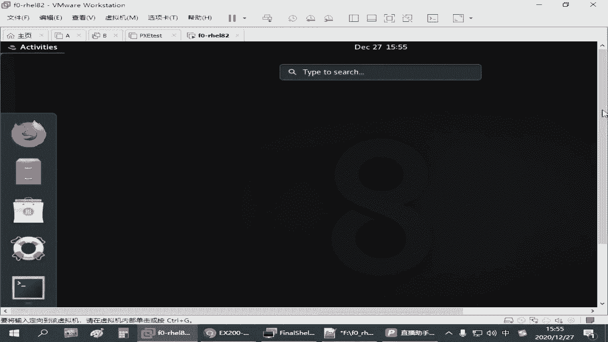

。

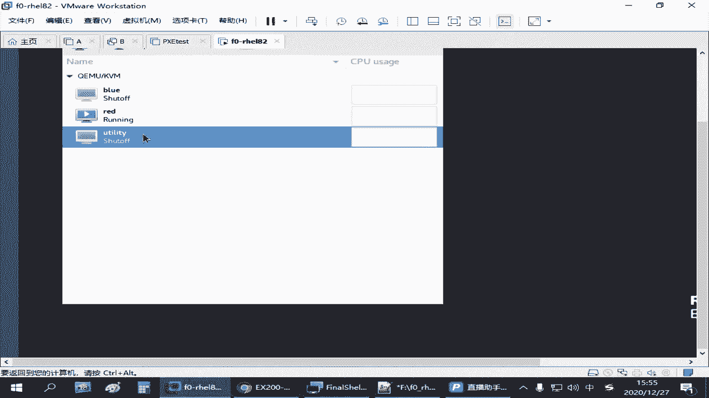

Yeah。然后大家搜索的时候啊，就你抛的慢啊，搜索啊N这。可以搜，但是它连接的是哪个服务器呢？用的是你管理员全局配置的那个文件，指定的那个仓库啊。那如果我们这个仓库现在还没开起来呢，是吧？

在熏机正在开启过程当中，那你是收不收不着的。他我告诉你无法连接啊。管理员已经配好了这个仓库，但是你连不上呀，是吧？现在这个虚拟机没开啊，就连不上。啊，大家用咱这个练习环境啊，有时候你发现报这个问题。

那就是你那个虚拟机没开好啊。😊，还没开好，等开好之后呢，我们普通用户再去搜。再去搜啊。现在还没开好是吧，刚才是no rootot to host，现在是连接被拒绝是吧？再试一下，还是连接不就去。

那你看它慢慢的开的啊，现在是连接没有被拒绝了，然后又是什么V一通讯那个协议版本不对，是吧？啊，你碰到这些问题呢，基本上你都可以认为是咱们那个仓库还没准备好啊，仓库没准备好。等仓库准备好了之后。

我们正常收啊，应该能收到啊才行况。那这这些资源不够也是麻烦啊。

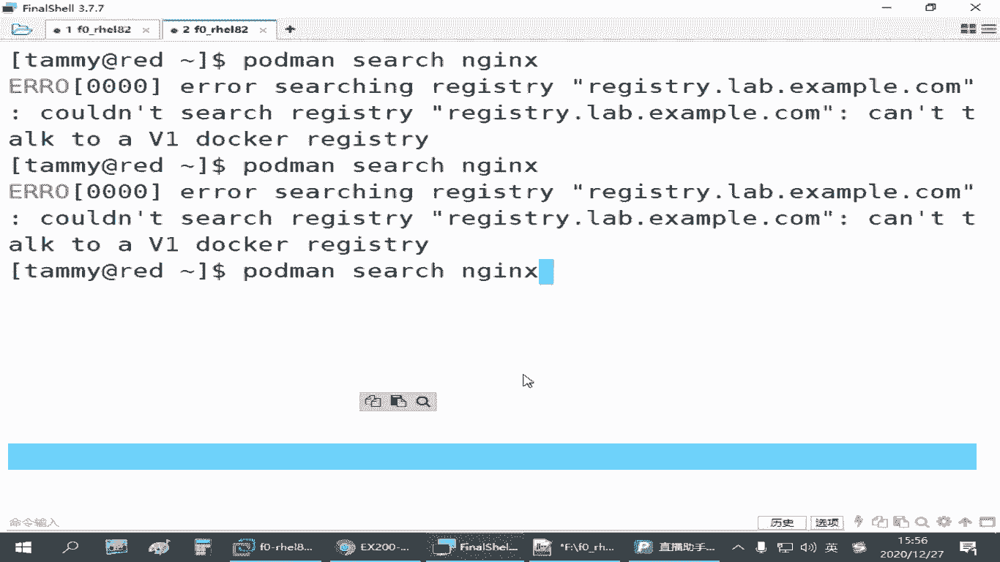

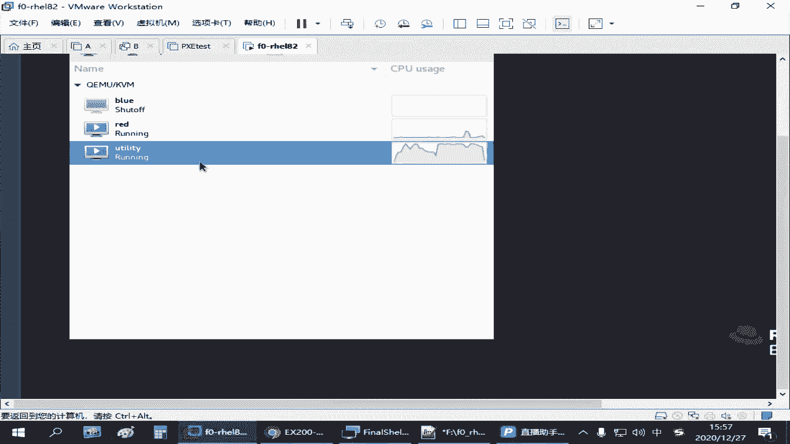

。

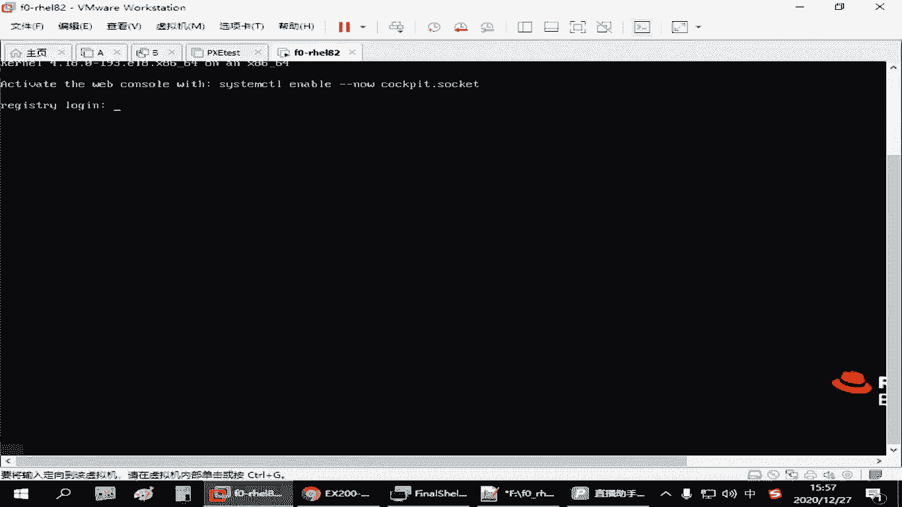

Okay。等的时间差不多了是吧？

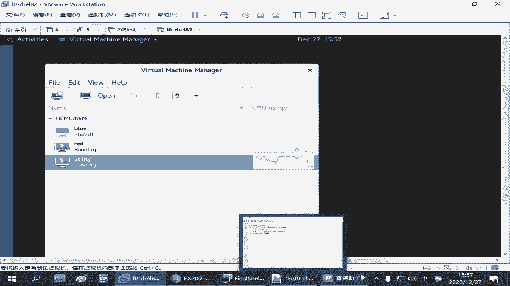

看一下啊。哎，终于收到了是吧，等了好老老长时间了，中间经历了不同的错误。一开始告诉你没有路由，再后面告诉你拒绝连接，再告诉你版本不匹备。你看我给你尝试了好久啊，等到现在哎能收到了是吧？能收到之后呢。

我们再去下载啊，抛的慢破啊，下载这个。😊，镜像啊。啊，刚才那个萌辉同学问的啊，就是说你下载回来之后，为什么有这个这个其实你从哪下载的啊，它自自动就给你做了这个名称的一个标记啊。这个不需要我们配置啊。

你下载的时候不是给了这个地址吗？所以下载回来之后呢，存到你当前这个呃用户的这个镜像库或者管理员那个镜像库啊，他都会有这个标记啊。等下载完成之后，这个时候用户他才能够看啊，port的慢im是吧？

你看是不是也有了是吧？那后面的过程呢，你跑容器的思路是一样的啊。是一样的。用户的服务啊，我们也需要跑一个portman乱啊。呃，比方说我们在我们的。用户的加目录对象。创建一个目录。叫can德eno。

logg搜啊。在这个目录下面呢，创建一个。网页啊。叫index点H点MM写一个文件啊，叫tmy set。是吧写一个这样的啊。呃，然后有这个网页之后呢，我们拖的慢乱。去运行一个容器。

放后台运行杠P给它映射一个端口啊，不要和前面那些冲突啊。80嗯来个8080吧。对应到80啊。然后杠V映射一下目录。是我们home下的啊打决的路径。

t me shut containerlog server是吧？用这个目录做网页目录，映射到我们user share。安这个。HTML。起个名字，杠杠内姆。叫卖we3啊。调用的是刚才我们这个N技巧。

这也是按正常的方式去启用一个容器啊。形容容器之后，呢我们去测试一下啊，先测试一下。访问。的这台主机，它的8080端口。那，这个时候你可以看到。🤧对吧啊，看到有这个网页啊这个网页。呃。

然后呢有这个网页之后呢啊说明这个容器没问题啊。😊，那如果我们要把它变成我们用户的服务啊。我们需要做什么呢？需要make DIR在用户的主目录下，它有个子目录叫confi啊。这个目录原来没有的。

什么时候有的？在你下载镜像的时候，它自动生成的。啊，有一个点confi，它下面有个容器目录，就你运行之后有组置有这个目录啊，那现在我们不用这个容器目录啊，我用的是什么呢？

有有个叫CSt目D这个目录没有啊，我们需要去创建啊。有个叫优者，就用户的服务啊。Yeah。makeDIR杠P啊。创建这个目录之后呢，CD到这个目录下。然后一样啊，port的慢接容。CS team目。

杠杠类 my web3。后边跟上我们的。杠杠fis啊，创建这样一份文件。那你看他文件是放在这里这里嘛，是吧？那有这个文件之后呢，然后我们要把它更新成我们的系统服务。刚才那有同学不是在问吗？

你没有更新之前，其实是没有那个的啊那更新的时候呢，还要注意，我们需要用那个什么杠杠U则啊，这个表示是我们普通用户的服务啊，后面再跟上。Demonre啊。这是吧。这个操作做完之后，我们再用CS进行crl。

然后跟上。还是要跟上刚刚usertats去查看conal。table出来就有一个买we3是吧，也一样，它现在状态是停的。我们也可以port的慢啊，stop。杠L啊，最近的容器先停止。

然后破的慢起服务的时候也是要加杠杠U子啊，暂时大车。对吧再把它启用使用的时候呢，我们再去测试啊。他还是能访问，没问题吧，是吧，这8080端口啊这个。那也一样啊。

可能我们说哎这种方式那还那不就是加个user嘛，是吧？加个user，我们是也可以enla。啊，看电。这个呀。对吧也是把它设计成设置成开机字体。但是。普通用户的服务，你光做这个不够啊。因你关注这个之后呢。

它重启之后，其实服务它起不来啊。跟刚刚我们管理员做那个还不一样，管理员，你以为你是管理员，你设完inbel之后，他那个服务每次开机它就自动起来了，就把那个容器服务。在这普通用户呢。

他其实这个能力没有这么大。尽管这个普通用户，他希望这个容器服务每次开机之后自动运行。😊，但是每次开机之后呢，这个用户他是不是根本就没有登录啊？是吧这个用户他没进这个系统。那这个时候默认情况下。

系统是不会给你起这个服务资源的啊。那如果要提怎么办呢？那你就得想一个办法，让这个用户在没有登录的情况下，他也能够。让你乐的这台主机为你去开启这个服务。这个呢有一个。

控制工具啊叫log in controltl。enable一个叫link啊，link意思好像是逗留是吧？保持的意思。后边可以跟上一个用户名。如果你是管理员的话呃，如果你是自己。为自己做的话呢。

就直接敲这个就行了，这叫enling。这个操作做完之后，其实是通知管理员。啊，就哥们帮个忙啊，是吧？我没进来的时候呢，你帮我把服务开一下是吧？做这个作用的啊。😊，嗯。这个做完之后呢，大家可以去检查啊。

检查有个秀U是啊，秀U着吧。然后跟上你自己这个用户名字。他最后一行应该有个叫linggo等于yes是吧？看到这个啊。啊，那个的yes。这就是说为用户保留。就是当当用户没有登录的时候啊。

你为他保留这个呃起服务的一些资源啊，是吧？一个是启用，一个是检查。这个方法是来自于红帽官方的啊。但他用的时候有一些限制啊，就是说你比方说你登录的时候，呃，包括刚刚讲那个用那个什么刚刚U的一些服务啊。

你是SSH连啊，不能用SU或者用那个速度，要不然不管用。那还有有可能考试环境有啊，咱们练习环境用这个很平时。呃，没说出来。就仍然起不来啊，加了这个也起不来。但是既然是个考点，我们要把它还是要做，是吧？

这个要做了，起码你步置上是对的。那如果他起不来，那我们就想办法呀。万一他这个不好使，我们得想办法让他能起来呀，是吧？😊，那我们可以做别的方法。你让一个服务开机之前里很多方法啊，这个只是其中的一组。

那另外还有一种方法是什么呢？就是你可以写一个计划任务，或者呢我们去改那个开机挂载的配置文，开机开机自动运行那个配置文件。但是开机这个文件呢需要管理员去做啊。如果是计划任务的话呢。

就是你可以以这个用户的身份啊，自己去编辑一个计划任务啊，可以conon table杠1。在后面呢加一个计划任务。让他在开机的时候执行一次。这个计划任务的时间表示我们可以写一个艾特 boot。

这个就表示开机执行的任务。那后面这个任务怎么做呢？就是我们那个Ctctrl。一般建议用绝对路径是吧？呃，CS team control应该是在。那个叫什么？user并一下对吧？把一个出来确认一下。

用Ctctrl杠杠U着。去启动啊，你打la start也行。你看刚才我们不是说那个开机的时候，第一次起不好不好使吗？然后我们再加这个是吧？瑞 start启动一个container。

杠麦web3点service。是吧这个命令让它开机的时候自动运行。啊，这个命令呢你手敲的话，避免别出错啊。尽量在我们命令行先测试一下啊吧。确认它好用啊确认它好用。The answer was。

这个加不加点450都行啊，这么都行啊。因为服务的扩展扩税扩展名单后缀嘛。来再确认一下，是不是这个是吧？这是复制粘贴的问题啊。其实就一行，你复制过了，刚刚下面他自动给我换好了。好，那这个测试完成之后呢。

我们再去重新启动一下啊。现在是可以看到这个玩意儿是吧？来，我们把。的再重启一下吧。

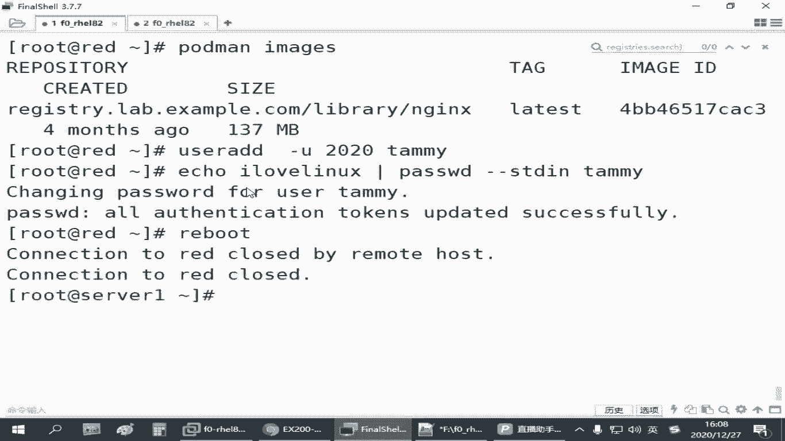

啊，现在镜像都下载完成了是吧？这个机器我们可以把它给。关闭了啊。Uility。Yeah。

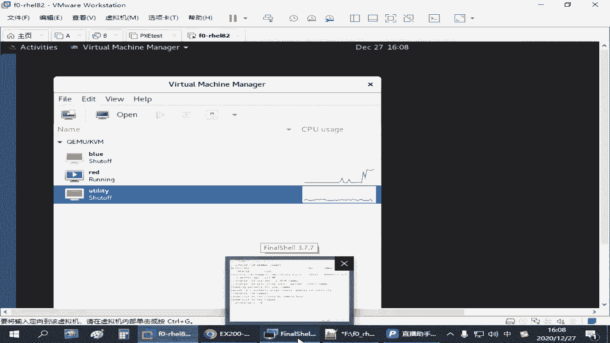

。嗯。

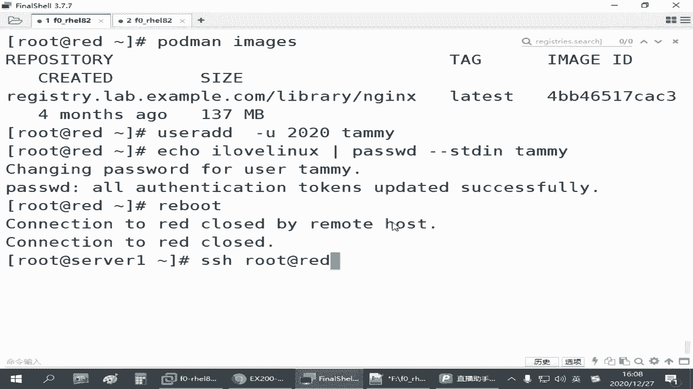

开机太慢了。😔。

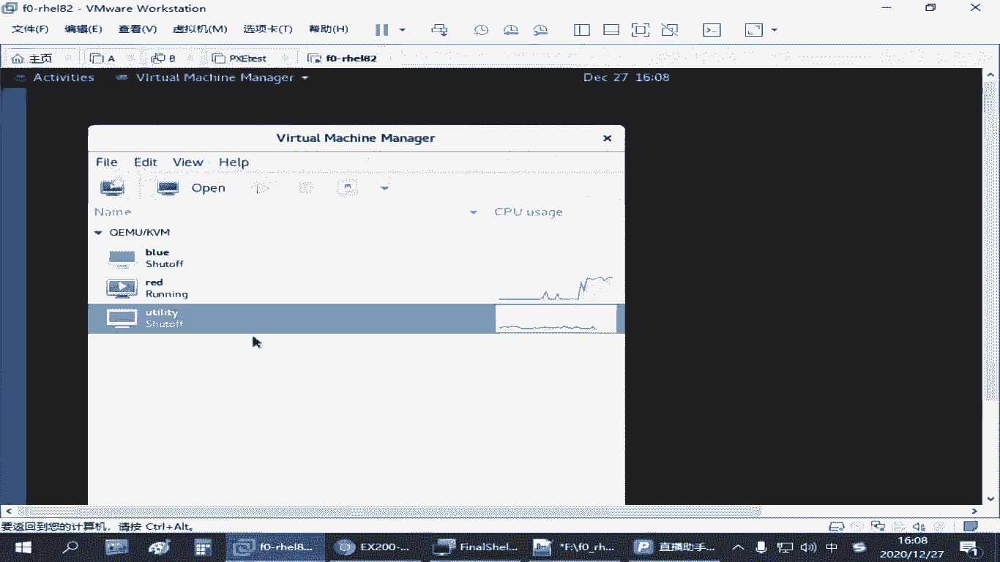

。还没起来。Yeah。嗯，进来了再去测试我们的。re的8080端口啊。哎，这个你看没问题是吧？在普通用户这个啊。好，这是我们刚才给大家讲的，就是普通用户的啊无根环境。就大家注意一下。

我们这个配置的目录有点变化。然后在添加服务的时候，是不是要加个杠杠user是吧？呃，reode也好啊，star也好啊，这些都要啊注意啊。就是刚刚U着后边跟这些操作啊。这就它一个区别。

和我们管理员啊控制这个服务的时候，它的一个区别。嗯，当然它开机启动的那个怎么让它生效是吧？其实我们验证过就是做一个计划任务，这个还是挺好用。就编辑的时候呢，开机启动一次啊。

一个要reboot后边跟上我们这个命令行。因为普通用户他虽然不能改管理员的文件，但他自己配计划任务是允许的，是吧？计划任务的本质就是我不登录，你也得帮我运行一个任务。那默认就是允许的。

所以你直接写一个计划任务，后边写一条命令就行。这个命令就是你用st controll刚刚U着去重启一下你那个服务。

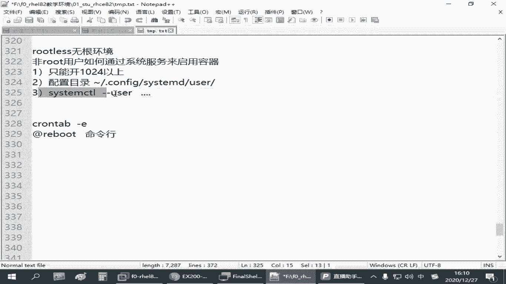

，明白这意思吧。