# 全网最全红帽认证／RHCE／RHCSA 零基础入门教程 - P3：1.01-Linux命令基础 - 达内-coding头号粉丝 - BV1z54y177Zk

嗯，那下面我们要讲这个linux命令基础。嗯，这一块的要解决的问题啊。就是帮助大家，你在对lininux了解不是特别多的情况下，那有一些命令是我们需要去了解的，需要去掌握的。你掌握了这些命令呢。

那我们后面在学这些知识的时候才能够更加顺利。Yeah。嗯，初步规划的我们大概包括这么几个部分吧。Yes。lininux命令基础这一块啊。Okay。那第一个就是关于我们linux。

命令行去控制我们操作系统。它的一些基础的一些概念啊。命令行概述。啊，甘数这一块的话呢，你可以包括它的命令行的那些格式是吧？好，快捷键。这可能有些同学听过啊，那没关系，你就当复习一下了。那第二个的话呢。

就是常用的一些命令。嗯，常用的命令的话呢，我们主要给大家讲解这么几个，嗯，像LS呀是吧CD呀啊PWD呀。这个是要了解我们lininux系统的文档目录结构啊，我们需要去了解的。

那再一个呢就是在我们linux系统里边创建目录需要一个mateDIR啊，然后呢。创建文件的。查看文件的。Kt。nice是吧？然后复制文档的CP啊copy。删除文档RM。🤧啊，还有改名移动文档MV对吧？

这几个啊大家必须会的吧，是吧？这很基术很基础的一些操作啊。Yes。那第三个的话呢，技术命令这一块呃，还希望大家了解我们。命令的帮助。嗯，为啥要学这个呢？因为我们在考红包认证的过程当中，有很多东西你可能。

并不一定能够全都记下来。那当你记不住一些东西的时候，一定要学会用帮助。对吧你要用户学会用帮助的话呢，嗯那很多资料你一查就能查出来，不需要全都记住。这个帮助指的是我们红帽系统里边啊。

他为我们提供的这些帮助，不需要上互联网系统里面自带的啊。这个一般有一个叫手册的一个工具，简写的就是1个MAN啊，非常强大的那这个你要知道怎么去看，怎么去找资料是吧？我们后面有很多操作呢。

你都要学会用这种方法。😊，嗯，这种方法呢你在考试的时候，你随便用，不算你作弊哈，在正大光明的看。😊，因为你谁能说我们工作的工作的时候，你不让我看资料啊，啊谁记性也不是那么好的，是吧？

有很多东西我顺手就能找出来的那我为啥不查呀？你做做能把问题解决啊就好了。😊，啊，这是命令帮助，这是一块。那后边还有一个呢是VIM编辑器啊，VIM编辑器。嗯，这个编辑器呢在我们最小化的安装里面。

可能没有VIM只有1个VI。但是大家用的时候，这两个编辑器用法差别不是特别大。所以这是叫VM编辑器啊。呃，那基本上的话呢，我们lininux命令基础这一块大概就是这么多，对吧？一会我们分别来看一下。

讲完这一块，我们再给大家去讲那个服务控制和安全开关啊。没。第一个命令行概述。呃，命一行概述的话，其实。这要写起来也挺多的啊，我所以不写了，我就说吧。呃，命令行开始时，你首先要知道什么是命令行是吧？😊。

什么是命令行啊，啥意思？我们说咪令啥意思是吧？啊，你家养一条小狗，你跟他说来过来握个手。😊，对吧他如果能听懂你说的这句话，他是不是就伸个爪子过来给你问一下呀，对不对？😡，那可能你刚新新认识一个女朋友。

你带回家去，女朋友跟他说是过来的大黄能握个手。😊，可能你那条狗就听不明白，对吧？因为是你跟他说的那个语调啊声音啊都不一样，他不一定就理会这句话。😡，所以呢我们控制lininux主机。

那这个lininux主机对我们管理员来说，我们得让他听话呀，它就是我们养着一条小狗一样啊，是不是这样的是吧？那我们作为用户，我们作为管理员，就得让lininux主机听我们的话。😊。

所以我们需要给他去发命令行。那怎么发呢？其实就是在我们这个命令终端啊，你能输入这些指令的这个终端去敲一段代码。你包括我们刚才敲的这个SSH这些都是命令啊。所以我们说的命令行其实就是有个管理员。

输入的一串。字符是吧。这一双制符呢，它的作用是呢用来干嘛的？啊。是一套什么样的字符啊，是吧？是用来完成。某一个系统任务的。你输一个字符，输一串字符肯定是要干活的。😡，你不干活，你不不啥事也不干。

那这不是不是一个有意义的命令嘛，是吧？你管理员输入的一串用来完成某某系统任务的啊，或者不一定要系统任务是吧？有完成某一个任务的。😡，管理员输入的一串用来完成某某任务的制符啊，输入的形式。就是你按回色键。

就这个ant键。提交。那么你按按键提交之前的这一串字符，你就可以把它当成一个命令行。对吧这就是一个命令行。比方说啊我们前面说的各种啊。嗯。我们要看IP地址，最小化安装的系统呢。

你可以IP address list。对吧可以用这种方式。这网卡不叫这个名字是吧？叫EN啊EMPES0，那么这就是遗串命令。那我们在输入这一串字符的时候，如果他能认识，能听懂。

那说明这个lininux系统呢。他就能够帮我们做一些事。如果他听不懂，他可能就会报错。那说明你敲的这条命令有问题，你就得去纠正啊是吧？你像我们上面敲的这条命令啊，IPADlist后面给了1个ATH0。

然后他就告诉我啊，你这个主机上没有ETH0这块网卡。😊，不行吧，是吧？啊，那没有这个网卡，我就想知道到底有哪颗哪几个网卡呢？我就把后备E你给去掉了，只敲了1个IP address list。😊。

他告诉我，下边哎。有一个回还接口LO然后有一个第二个接口叫EMPES0是吧？这是一块以太网卡，然后它下边IP地址。那这个命令的作用呢，其实就是用来看IB接口啊，它相关的一个地址信息。Yeah。啊。

那为什么我们ininux系统，你发一个指令，它能听懂呢？😡，那我要敲个别的，他为什么就听不懂呢？😡，是吧所以那这一块的话呢，大家还需要知道一个什么东西啊。😊，还需要制造一个叫解释器啊，有些概念啊。

刚才我们讲到的第一个案件叫命令行，你要知道命令行是啥，那解释器又是啥呢？这个指的是lininux系统中的。一个程序。这个程序是一个特殊的程序。怎么个特殊的特殊法。因为这个程序呢。它是用来翻译。

或者说叫解释。管理员提交的命令行的啊。有一个这样的一个特殊程序。这个特殊程序就是我们的解释器。如果我们的lininux操作系统没有这个解释器。那我们管理员啥也干不了。啊，为啥呢？因为你敲一个咪令。

没人理你，对吧？就好像我们养了条小狗，那那小狗的耳朵可能被个啥东西堵住了，听不见。😊，那你给他说话，他不理你，对不对？😡，那不行，所以我们的lininux系统呢，其实任何操作系统都需要有一个解释器啊。

都需要有一个解释器。这个特殊程序呢通常就是。有一个概念啊。他有个概念，一般叫做笑。啊，这就我们所说的线。那为什么线要跟解释器挂上钩了呢？因为它的外它的那个英文的原意啊叫外壳啊，为啥叫外壳啊？它是。

它是包在我们在包在我们的linux内核程序啊，就是操作系统的最核心的那个程序外边的一层壳啊。这是包在linux内核外边的。一层壳，所以叫外壳程序。这个外壳程序它的作用就是用来为我们用户翻译命令。

那linux内核是干嘛的？对不对？可能又来一个概念。😊，这大家第一次应该有少部分同学可能刚接出lininux啊，所以我们给他解释一下。那现在我们说的这个内核，你可以忽略lininux。

各种操作系统都有啊。啊，内核指的又是什么呢？指的是我们。操作系统吗？😡，操作系统指的是啥啊？越来越多了是吧？操作系统就是用来控制我们的计算机硬件的啊。😊，这是用来控制。计算机硬件。它的一个软件平台。

它的最核心的部分，这叫内核。那用来控制计算机硬件的软件平台，这个平台叫什么呢？就叫操作系统。比方说我们平时用的windows是吧？这个指的是一一种操作系统。那lininux呢是另外一种操作系统。

那每一个操作系统都有一个最核心的部分。啊，都有一个最核心的部分。那lininux的内核一般叫柯隆。然后微微软windows系统的内核一般叫NT吧，是吧？啊，微软那个叫NT。😊。

叫new technology啊叫新技术吧。啊，是这样一个核心。呃，那操作系统最核心的部分就是内核。Sure。Yes。那操作系统这个最核心的部分用来干嘛呢？主要用来管理。我们的CPU处理器。

然后管理我们的内存，管理我们的各种硬件设备。包括你的磁盘。等等对吧？是用来做这个的啊。😊，这要和内核。但是你买回来一台计算机，它都是一堆硬件呀。我管理员我是想在电电脑上打一个游戏，那个游戏咋出来的呀？

我想编辑一个文件，那个文件咋出来的呀，是吧？你得有操作系统平台。😡，然后你要用这个内核去操作你的显示界面，显示一段话，显示一一段文字是吧？显示一个图片啊，怎么办呢？你是不是得向内核发送一个指令啊？

但是操作系统的内核呢，它只能听懂计算机的那种指令。🎼啊，二进制的120啊120啊是吧，这管理员哪知道呀，不知道。所以我们管理员能听懂的这个指令是什么形式的，是这种形式的。😊，哎。

我你写个IP我知道这个IP地址是吧？然后ADD来address地址这个单词的前三个字母啊，历子的设列表，这个我们是能听懂。😊，但是你操作系统的核心，他听不懂。所以在你的操作系统。

内核的外边还需要有一层壳，这个壳就叫相，也是我们所说的这个解释器。啊，就这个。那这个解释器的作用就是帮我们管理员把我们管理员能听懂的这种指令翻译成计算机内核能听懂的一个指令。

所以这个就是解释器的一个作用啊。那他是负责。把管理员啊或者说用户啊。用户吧。负责把用户提交的。指令。😊，变成。就变成啊变成内核能理解并执行的指令。这是它的一个作用。😡。

那其实在我们lininux系统里边呢，这个内核程序，这个特殊的程序啊，通常情况下。99。99%以上啊指的是我们系统目录下边有一个文件，在跟下有个B，下边有个叫BASH。对吧是这样一个程序。

如果你把这个程序给干掉了，基本上你这个用户就登不进去了。除非你给它换另外一个解释器，如果你不换，默认就是这个解释器，那解释器没了，你就没法操作这个计算机了啊。😡，所以这一块大家特别是刚接触的同学啊。

你要好好理解一下。那这里我们给大家解释了一个命令行解释器啊，再加上这个内核是吧？它们之间的一个关系。😊，啊吧这一些概念啊一些概念。😊，好，来我们再往下看啊，因为有这些概念我们还是有必要去知道的啊。呃。

那如果我们要控制我们的lininux操作系统。嗯，还需要去了解什么呢？就是我们这个命令行怎么去写是吧？啊，命令行怎么去写。😊，嗯，那这里衍生出来一个概念，就是我们linux目录结构。

因为这个和windows长得不一样啊。和windows长得不一样。

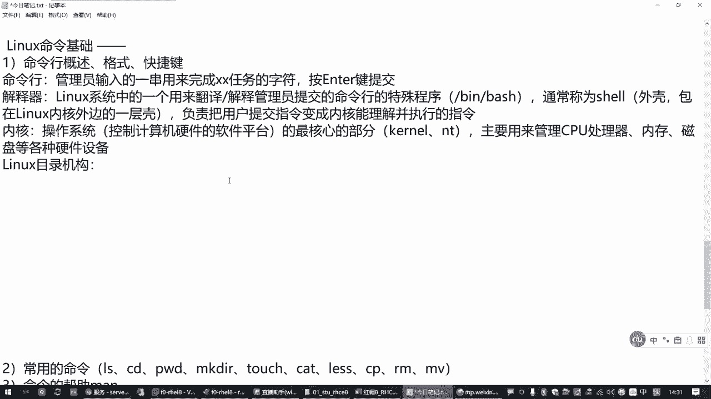

那大家如果想了解我们lininux的目目录结构怎么办呢？我们可以在这个练习环境。

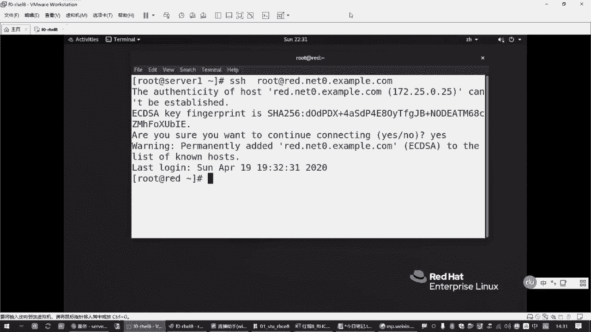

找活动啊，一个activ是吧？那第二个这有个fis，这是看它的文件。你可以打开这个按钮。

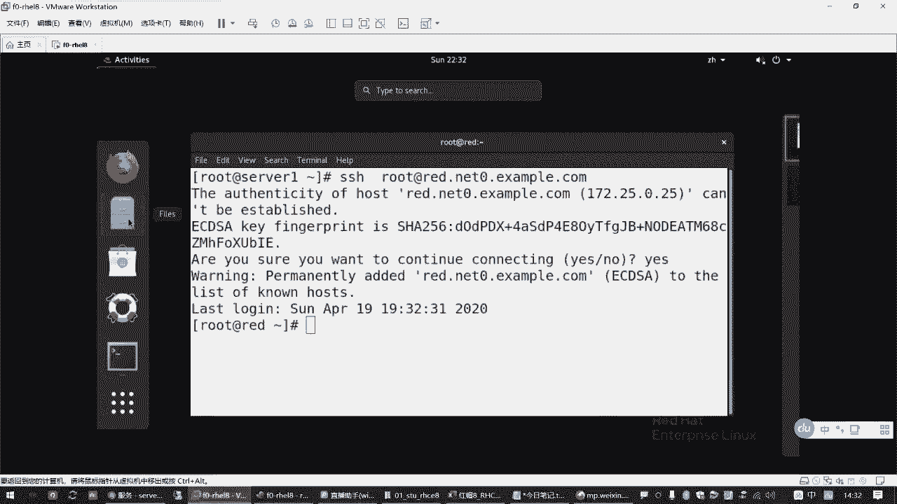

来了解我们系统里面有哪些文件。那默认情况下呢是在这一个加的一个图标是吧？叫home，这是你用户的总目录。但是如果你想了解这个系统里面所有的文件，应该找最底下有一个otherloc。就其他位置啊。

打开之后，你可以看到上面有个计算机。😊，这个打开之后就相当于我们那个windows主机，我的电脑一样啊，有个叫computer。对吧这个那你点击computer，你就可以看到啊。

你就可以看到我们呃这个系统里面所有的目录。你往下走是吧，这就就是就是所有的。对啊，就所有的。那比如说下边有好多目录，那好多目录的话，你随便打开一个目录，你可以进去看里边有好多文件，还有好多子目录。

对不对？是一层一层的。

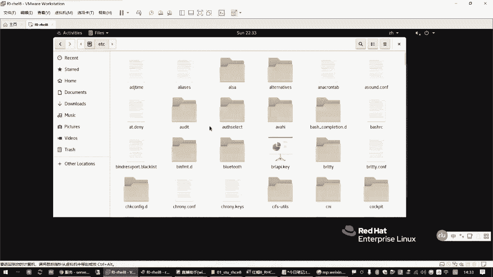

那对于lininux系统这个目录结构来说呢。目录结构啊，它采取了一种树形的结构，其实跟我们windows差不多啊，只不过呢它最上层就是我们刚才敲的啊，我们刚才敲的这个othercomputer。

这就是我的电脑嘛。那我的计算机打开之后，这就最上层一个目录结构。

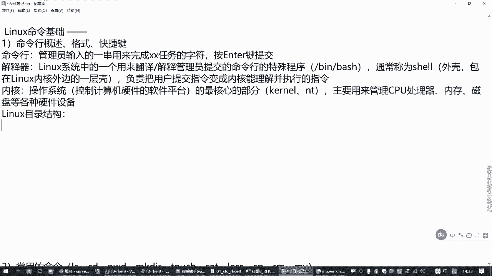

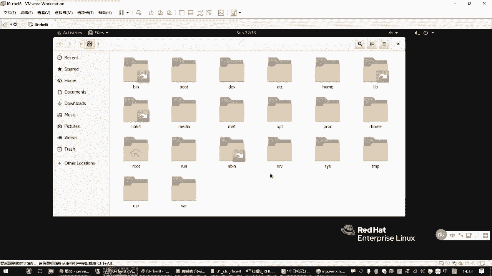

这是图性化的方式去表示啊。所以它的最上层。就是一个叫。computer。啊，怎么打开的？😊，怎么打开的？😊，是不是通过你那个activity。然后打开之后有一个。files是吧，通过这个是打开的。

打开之后呢，还有一个什么other。😊，Locations。这是图形界面啊，它不常见，等会给你写一下。嗯。用这种方式去打开啊。这是图形环境。啊，大家要知道的是吧，怎么去打开啊。呃，那我们也说了。

你你工作的时候很少用这种环境，所以我们要学会用命令行环境。怎么去打开？那命令行环节的话呢，和这种图形的方式就不一样。那如果我想看lininux系统目录结构图形的方式的话呢，你得点好多次鼠标。

但是你在命令行环境下边的话呢，不需要这么麻烦。😡，我们下面学的一个命令叫LS对吧？你直接执行LS。😊，后面空格打一个斜杠。就可以看到啊。🎼比方说在这里你敲1个LS斜杠。这就可以看到这一堆目录。

那颜色不一样是吧？一般蓝色的表示是目录呃，浅蓝色的呢表示那种快捷方式，就它不是原始的这个目录，它是指向别的目录的目录啊，这叫快捷方式。但是你看到内容，你看也是BDEV是吧，bo这些你重新界面。

你看也是beboDV这些是吧，一回事。

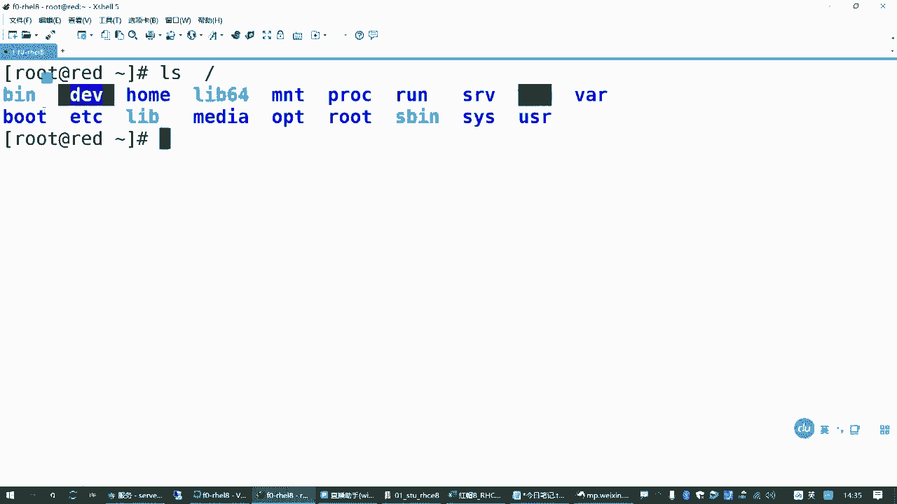

所以大家知道为什么我们搞IT运维的要喜欢用命令行，因为你用图形界面太麻烦了，我命令行敲个L空格斜杠，顶多敲4个字符。😊。

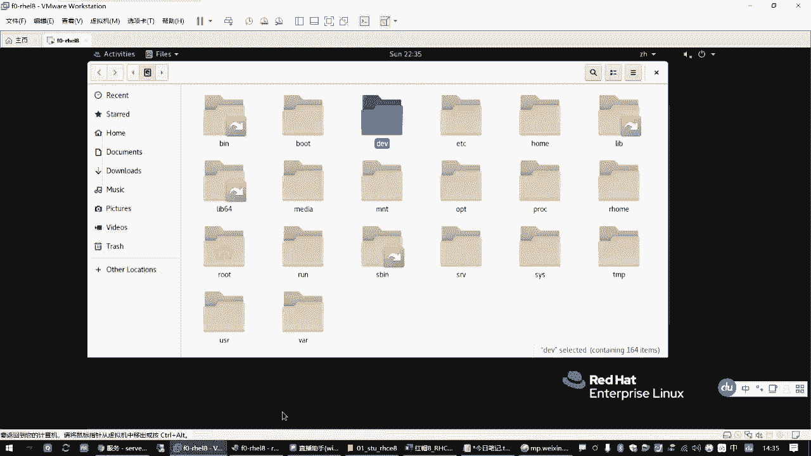

但是你在重新界面里面要干嘛？你现在打开这个点一下，然后点fire老师再点一下，然后再找other location再点一下，然后还得点computer再点开。😊。

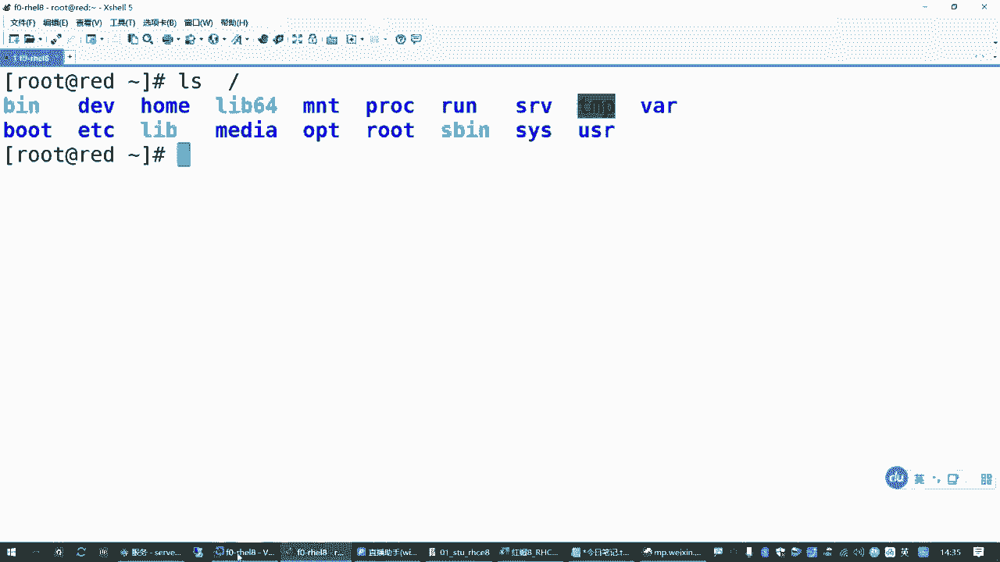

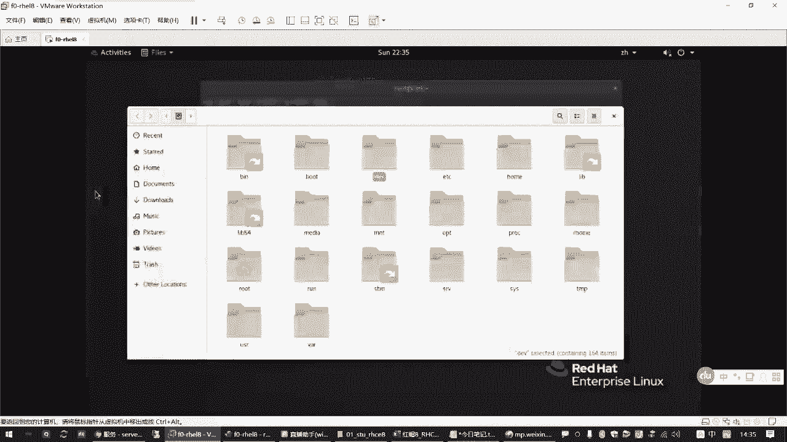

这也点了4下是吧？啊，你还在肉眼去分辨这些这么多的东西。😊，那你眼神不好，可能有些近视是吧？你点一下点错了呢，我activity点我点到这个火狐了呢，对不对？😊。

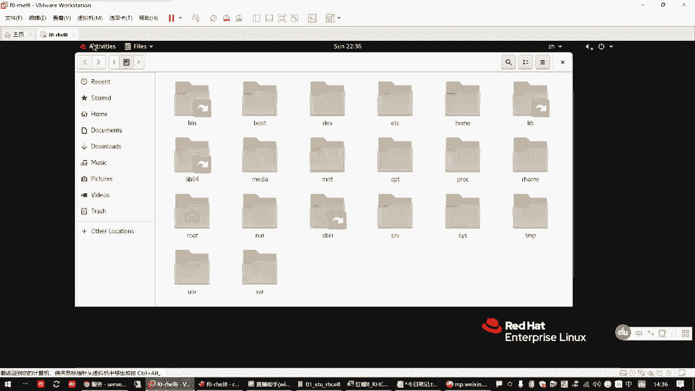

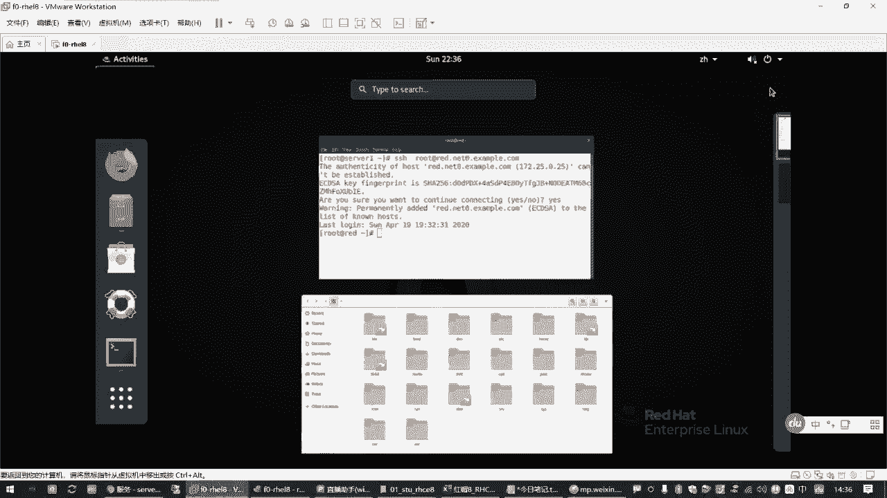

有这种问题吧？所以其实命令行的效率比我们图形的效率要快。😡，你后边学了很多命令，你都会有这种感觉啊。😡，那如果你后面要做那种批量化的管理，咱们红帽八不就针对我们这个云环境，提高这种批量化管理效率的嘛？

很多操作都是在命令行下来做的。如果你要去写一些脚本，写一些程序。那你更加不方便用这个图形啊，一定要熟悉我们的命令行操作。

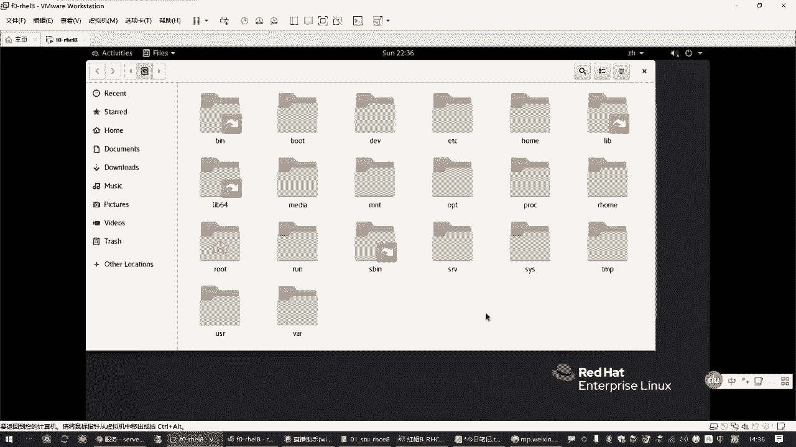

啊，当然啊我们讲的这个目录结构了，那大家也了解一下我们的。😊，linux目录结构里边常见的一些目录，它是用来干嘛的，是吧？常见的一级。沐录。啊，一级公路。呃，然后呢lininux系统的这目录。

它是分层次的。不管你是通过图形，还是通过命那个命令行用L去看，那一层一层的目录。

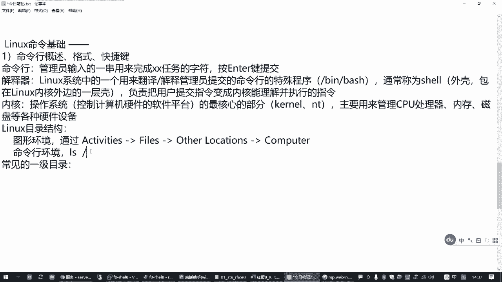

比如说我们这个。bo。😡，这是一层目录，你双击进去之后是不是还有一层啊啊，还有好几层啊是吧？底下有个gb two是吧？双击里面还有那像这种路径呢是一层一层11分下去的。😊。

那如果我们在命令行下来看的话呢，这就是目录层级结构。

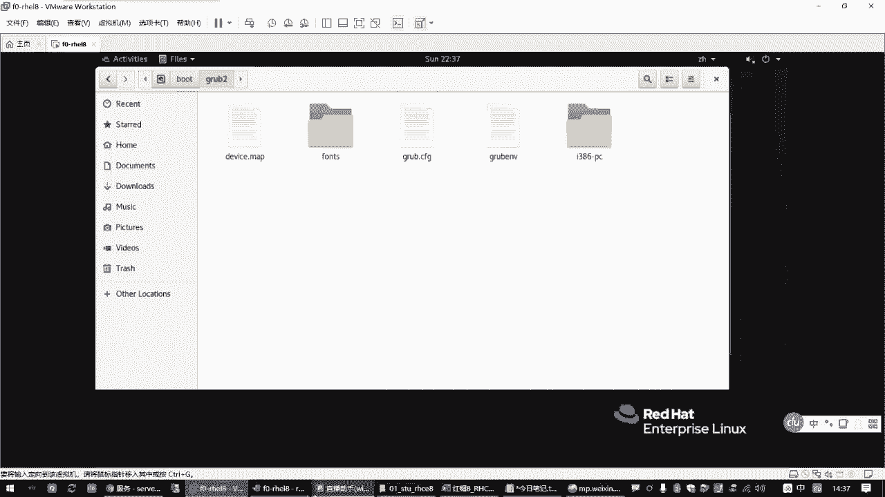

这种层积结构呢你不需要用肉眼去分辨，你直接敲就行。😡，你要找bot目录下面打1个BO往下tableable一下。是吧这涉及到一个快捷键。😊，呃，你往下再找一个目录，就是grab to再table一下。

是不是就出来了？😡，所以作为一个基础的知识啊，那所以这里呢就又一个点就是。lininux目录在命令行下面来表示的时候。它的风格。层次分隔。这个好理解啊这个好理解它的符号就是一个斜杠啊。😊。

用的一个符号是斜杠。这个。同时呢这个斜杠也表示我们lininux目录最上层。那个特殊的目录呢叫根目录。就上面我们说的这个啊最顶的层次。写下面吧。最顶层。就是一个。谁个？

这个也是通常我们所说的这个叫什么呢？角是根目。就整个操作系统的一个根啊。😡，所有的目录都在他之下，人家说一人之一人之下，万人之上是吧？它这个就是整个系统的最上边啊，没有人再再在它上上面了。

嗯再在它上面就是lininux内核了啊，没了啊。😊，那这个斜杠呢同时也作为我们不同目录层次的一个分隔。你比方说这个就是根目录，下边是一级子目录，这是一级子目录和二级子目录的一个分隔，这是二级子目录。

再往下边还有呢是吧，一层一层分隔的这是lininux目录的层次分隔啊，这个大家要知道。你要理解这个含义是吧？那常见的一级目录。😊，常见的一级目录有哪些呢？嗯，大家主要了解一些常见的目录。

用来干嘛的啊就可以了。那怎么说呢？就是刚才我们讲到的这几个目录。来我们把它复制出来。这个特别是刚接触lininux不久的同学啊，还是有必要去了解一下的。我们把它归归类，其中的并。

这是英文单词二进制的意思啊。这个目录和我们这个SB。都是用来存放可执行的程序文件的啊。这上面这两个。主要用来存放可执行的文件。对吧做这个作用的那并和S并有啥区别呢？这个S代表的是surer。超级用户啊。

😡，叫serser一般指的是在这个目录下边存的一些程序是管理员才有权限去执行的。比方说做磁盘分区的添加用户账号的是吧？管理用户用用户账号数据的格式化的是吧？这些对系统的影响会比较大的啊。😊。

那前面这个病呢，一般是所有的用户都可以去执行的。嗯。所以它还是有点区别的啊，还是有点区别的啊。😊，好，再往下看，还有1个DEV。那DEV的话呢，这个指的是。用来存放设备文件的啊。存放各种硬件设备。

那咱们的光盘呀、磁盘分区呀、鼠标呀、显示器呀啊等等等等。那些硬件我们怎么去访问它，它也有对应的文件放到这个下边啊，第一位下边。然后再往下面这个home。后面呢就是系统各种用户。这是存放各种普通用户账号。

它的总路。我们每一个用户登进到系统之后呢，它都有一个目录。这个目录就是用来放这个用户账号的一些基本文件的对吧，对吧？你要不然一个人你到这个系统之后，你啥也干不了啊，那没用啊。😡，就像咱们老百姓一样。

我们都追求那个就安居乐业是吧？你首先得安居，你得有个地方住。那我们系统也是你一个账号进来之后呢，你得有个目录给你用，要不然你没有归属感啊。😊，这就是home。所以大家刚刚在我们系统里面也看。😊。

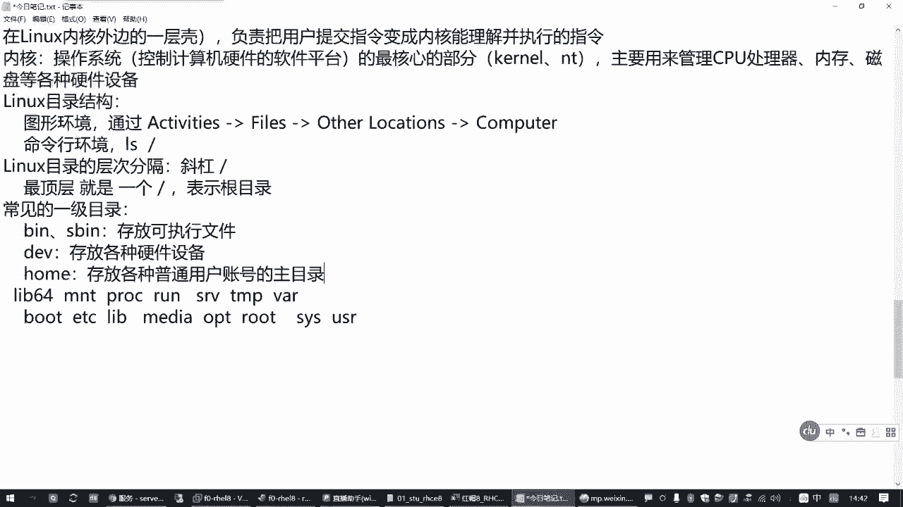

你这不有个home吗？我用管理员进来，这也也是有一个home的。😊，那上面一个标标志画了一个房子的一个图片是吧？啊，当然啊，管理员root这个用户，他的加目录。

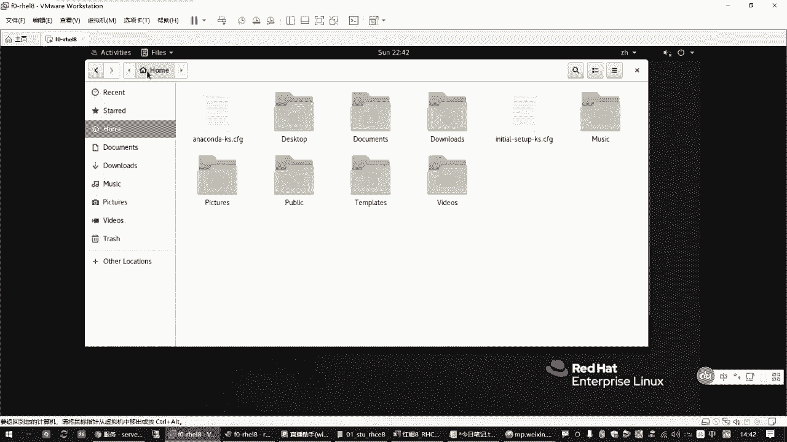

不在home下边啊。😡，他另外有一个目录。就叫root。啊，这叫root。所以你是管理员，和普通用户不一样。よか。哎，把个破门敲没了。啊，管理员的总目录和我们普通和那个普通用户不一样啊。

我们说home目录呢，这是存放。普通用户的主目录的啊。普通用户的主目录。呃，那root这个目录呢是。管理员账号他的准目录。他不用来存放目录，它本身就是管理员账号的主目录，就跟下有个root。

那home下面的话呢是存放普通用户的主目录。嗯，啥意思呢？比方说你有一个张三用户。它的主目录呢是在home下边再建一个小目录，叫张三。啊，那如果还有一个李四，他下面可能会有home下的李四。

所以普通用户账号呢，他们是住集体宿舍的。那root用户呢，他是做。住那种独栋别墅的对吧？长得不一样啊。😊，好，底下还有一些嗯不太常不太常用的啊。这个我就不写了，这个我就说吧，一般的接触不到。

等你们后边接触到的时候，你自然就知道它啥意思了。这其实是放我们系统的一些模块啊，一些库文件的啊，所以我不说了。😊，那MNT呢这个是用来放我们的。系统的。用来挂载一些外部设备的。

目录这个目录下面默认应该是没东西的啊，也没东西无所谓啊，这是给我们管理员自己用的。😊，呃，就比方说你要访问一个U盘啊，要访问个访问一个光盘呀是吧？你可以都可以把它挂着到处。

你也可以在这个目录下面呢建一个子目录，把设备挂过来也是可以的。😊，好，都可以啊。😊，嗯，还有一个plock。这是我们的主机那个内存数据的。映射。他实际上呢。不占用实际的硬盘空间啊。它是个虚拟的。

就方便我们管理员呢去操作这个系统，这就内存数据的一个映射啊，最主要是内存啊，你可以把它加上CPU。CPU寄存器是吧？就留留个内存吧。一般就这个。嗯，然后乱，这是系统运行的数据。

然后搜网啊SRV这是放我们服务器的运行的数据的啊，这个一般我们也很少会接触到，所以我们也不讲了啊。那TMP这是系统运行的一个临时文档。目录还临时的。啊，V人R。这个是用来干嘛的？这是存放。

临时的不是临时，叫存放变化的数据的。比方说系统的日记。啊，在计算机系统里边呢，系统的日记一般不叫日记是吧？叫日志啊。就你系统那个什么时候出了出了一些什么问题呀，我一个服务啥时候开启，啥时候关闭呀啊。

什么时候有用户登录了呀，是吧？所有这些信息那那个操作系统它都有写日记啊，记得一清二楚的啊。😊，就放在这里。嗯，还有比方说你要搭一个邮件服务器啊，有一些邮箱啊，邮寄邮箱记录也是在这个目录下边的啊。

等等等等吧，变化的数据。因为它是不断在增长的，不断在更变变更的啊。嗯，还有一个boott，这是存放系统的启动。文档这个启动文档里边呢包括我们的内核。是吧上面讲过的。那大家知道这一点之后。

大家这个boot目录你不要去删除。你如果把bot目录删除了，你这个系统就挂了，对吧？你一重启就进不来了啊。😡，呃，因为lininux系统呢有些目录不像windows，它有那种什么系统保护。

那你如果是管理员，你要删一个东西，那有时候一删就直接删了。嗯，即使你这个数据正在运行，因为系统正在运行的一些程序呢，它是拷贝了一份副本放到你们的那个内存里边的，在在在运行运作啊。

所以类呃那个系统的一些文档呢不要轻易去删啊。呃，然后ETC这用来干嘛的呢？这是存放各种系统配置。存放各种系统配置文件啊，这个的啊LIB也是这32位的库文件啊，我也不写了啊。啊，media。

这个是用来做自动挂载的啊。可以对比一下。Okay。放到这个地方，然后MNT呢是由管理员。手动挂载一些外部设备的目录。哎，他建议你放这啊啊，但你管理员有这个管理员权限，你要你你到底挂载不到。

到底你挂载放不放到这个目录人家再说是吧？你不乐意，你谁也管不了你啊，管理员自己你想挂哪挂哪。😊，然后media这个的话呢，一般指的是lininux系统。自动识别到的自动识别并挂载的。设备目录啊。

也没要放到这。比方说你插一个移动硬移动硬盘啊，插一个光盘啊，它有时候会自动给你挂上是吧？跟windows一样啊，那你去这个目录下去找就行啊。😊，啊，OPT这个一般是安装第三方的软件啊。用大的一个目录。

第三方的就option可以选择的。第三方软件的。资源目录或者安装目录吧。啊，ss是内核的系统数据，这个也不管了，跟那根差不多，一般自动键的就有了。就是你装好系统，那个ss目录肯定是有的，也是个虚拟的啊。

那右着呢这是存放。与用户相关的。存放与用户相关的啊。各种数据。对吧各种文档都在这。啊，差不多了是吧？😊，除了几个不常用的，我给你略出了啊，大部分的一级目录都给你讲完了。😡，嗯，这是这个刚才讲的这些呢。

不仅仅适用于红帽八，也适用于红帽七、红帽六、红帽五啊啊都是这样的啊。这常见的一级目录。啊，长江一级目录。好，那刚才我们讲过了命令行的一些基本概念啊，然后呢也讲了我们的。这个目录层次分隔啊。

常见的一级目录。呃，那我们在用这个目录，用这个命令的时候呢，刚才我们讲的命令行嘛，那我们使用这个命令行的时候，其实作用是用来干嘛的？就是在管理这些文档。😊，对吧最基础的目的就是管理这些文档。

所以有一个叫。命令行的基本格式。那大家后面要用各种命令，这个基本格式还是要了解一下嘛。😡，对不对？嗯，那基本的格式呢，一般情况下就是。😊，命令的名字。啊，命令的名字。嗯，另系统里面呢。

你每一个命令它都是有个名字的，你名字敲错了，它就不认识是吧？啊，你名字不能敲错。这个名字呢可能是一个指定的名字啊，内核指令的一个名字。😊，这讲细的又多一个是那个解释器，它内部本身就识别的。

还有一个是外别的其他的程序的名字，你都可以把它当成命令的名字。😊，其实就是命令的命令的名字啊。😊，比如说叫命令字，然后中间呢是选项。命令选项。再后边是参数，是这样的啊。啊，是这个样子的。呃，什么意思呢？

那其中的命令的名字是必须有的啊，这个必须有选项的话呢，很多时候是不是必须有的。所以大家后面会看一些帮助手册，可能会看到一个放括号。那放括号括起来的表示这个不是必须有的。😊，后面这个参数也不是必须有的。

啊，举个例子，如果我们要看系统里面有哪些资源。LS是吧？😊，这个命令就是我们下边要讲的。LS这个命令啊。这个命令的作用。LS。这是用来列出目录下有哪些文件。或者用来列出文件的。属性啊用来做这个用的。

那这个命令LS就是它的名字。它的名字来自于LIST叫list显示列出是吧？就它的来一个来源来源啊。那这个命令呢，我们用最简单的一个用法就直接回收。啊，不给他任何选项，不给他任何参数。

那选项和参数是用来干嘛的呢？选项用来控制你这个命令怎么干活？参数用来控制你这个mini去操作哪一个文件。哪一个对象啊？那刚才说了，我们说LS用了列出目录下有哪些文件？但是默认情况下。

它只列出你这个文件的名字。而且呢系统里面有些有隐藏的文件，它不会列出来。对吧那如果你想看这个文件的详细属性。那你不带参数就不行。😡，这个时候我们就得调整你这个命令，它的一个执行的方式。

对吧那要调整它的执行方式呢，我们后面就得加选项。😊，这个选项一般是一些特殊的字母或者特殊的单词。选项前边一般情况下需要有一个横杠啊，来引来跟一个字母，或者说跟一个字符。那刚才我们讲了一个需求。

如果我想列出这个文件的属性，那可能我们要加一个杠L。看的结果就不一样吧。😡，这就是通过这个选项去控制这个命令的它的执行的方式。所以这是列出我们这个文件它的属性。那属性有哪些东西呢？

那我们这个后面还会慢慢再提到啊，其中有1个1189，这就是这个文件的一个大小。😊，这个默认是1689字节啊是吧，这就是它一个大小。但是你写1个1189，我告诉你，这是1189字己，等你换个时候。

你可能不知道呀，是吧？😡，那你记不住了这个单位是什么啊，怎么办呢？嗯，还有一个选项叫杠H。加一个杠H之后呢，你会发现这是1。2KB。😊，对吧11189字节约等于1D2KB嘛。这是不就好看了？

好看一点是吧？那杠H这个单词啊，这个H啊啊来自于那个叫homan being啊。应该是这个是吧？啊，具体也忘了啊，这大概是人类的意思啊。😊，所以这些选项，我们lininux系统里边啊学这些命令。

它都是有含义的。呃，那杠L是显示的这一行很长，所以来自于这个单词呢叫LONG。而，杠H呢你简单的机就来自于那个后面人类。其实啥意思啊？就是你说1189我听不懂啊，请你说人话。😡，那经上就说那好吧。

我说个人话给你听啊，叫1。2KB，这下你懂了吧？😊，对不对？所以这选选项是这么来的。😡，那刚才我们跟的这个就叫选项。选项的作用用来控制我这个命令，怎么去执行，我怎么去控制这个结果。

所以是决定这个命令的执行的方式啊，这叫选项。Yes。选项啊选项。选项的作用是控制命令的执行方式和效果。啊，后边这个参数呢参数的作用，那就好好理解了啊。参数的作用呢。是用来为命令提供操作对象。

比方说刚才我们执行LS命令，你有说看哪个目录吗？没说。那怎么办？他看的就是你现在在哪个目录下，那他就列出哪个目录下的东西。😡，对吧就店说哪我么那些东西。😡，那如果我想看ga目了下有哪些东西呢？怎么办？

😡，那这个时候你得在后面加一个根，这也表示跟不住。对吧这就跟上的。如果你想看跟下子bo目录下，这不有个bo吗？它下边有哪些东西，在后面加一个跟bo。这就跟下载不程目录，你会发现看的东西都不一样。😡。

是吧那选项和参数可以同时用啊。你杠L杠H后边可以跟上不准。有很多min令操作的对象可以有多个，你可以用空格分开，我又看不同目录下有什么东西，又看根下有什么东西。对吧都会列出来，这个大家要去分辨了啊。😊。

所以这是命令行的一个组成啊，选项可以有多个参数，也可以也可以有多个。所以在看手册的时候，很多时候它这个选项后边会打一个省略号。参数后边也会打一个省略号，这就表示这条命令选项可以有多个参数也可以有多个。

那如果选项有多个呢，都是一个字母，这种的，我们可以把它简写。啊，管理员就要想各种办法，怎么简单怎么来啊，可以简写成杠LH，这个其实就相当于杠L空格杠H。效果是一样的啊效果是一样的。你看它会分别列出。

跟下边有哪些目录是吧？每一个目录的属性，然后它也会列出步骤下边也有哪些目录，哪些文件，然后每一个文件它的属性是不是都列出来了？好，这是命令行的基本格式，大家要掌握一下。

因为这个是我们在使用linux命的一个基本的一个规律啊，基本的一个规律。嗯，再一个就是我们这个。快捷键。咱们命令ux命令基础这个挺琐碎的啊，但是呢大家还是有必要去掌握。那常用的快捷键。讲几个吧。

最常见的一个t那个t键是吧？这个可以自动补齐。😊，你的命令的名字。然后你要找一个文件，它的文件的一个路径。在红帽8系统里边呢，这个t键功能很强大。还有可以补齐我们后边要管理的系统的服务的名字。

软件的名字。什么叫自动补齐啊？就是我懒得写了，你敲个table键，它就能给我补出来。😡，举个例子。🎼我LS，我找跟下的bo头，我打一个B开头的，后边我不想写了，敲一个table剑。

他就会把可能的结构给你列出来。😡，啊，有个BIN有个boot。那你如果再敲一个O，再推拨一下，他直接把这个唯一的结果给你补上了。那同样的你下边再打一个G啊，table把这个目录也给补上了，是吧？😡。

对吧就就就这这么这么简单啊，这叫自动补全，就帮助我们管理员啊快速去敲命令的。那另外呢还有一个。还有一个呢叫什么ctlC啊。感就L吧。这是这叫自动清屏啊。清品。你把屏幕上所有内容都清没了。

就留一个 mini令行的一个提示符啊，看就完了。😊，它单独有个命令啊，叫可列。和您按快捷键作用是一样的。啊，一样的啊。相当于。可怜啊， mini令。这两个用的会比较多啊。

其他的还有一些快捷键就是管理进程的了啊，像Ccttrol加上那个C，刚才也提了是吧？这个是放弃当前任务啊。放弃当前的。任务。就你正在执行的这条命令，你不想让他执行了，不想等了是吧？其实就是中断了终止。

还有一个can。换一个啊。求ESC。加一个点号。这是快速。粘贴。前一条命令。Okay。的最后一个参数。这个有时候大家偷懒的时候呢，你可以用这个这键盘上的exscape键啊，加一个点号。

🎼比方说你按一下exc键点。🎼啊，没有是吧，它是颗粒嗯，那这个执行一下，再按一下Escape一个点没出来呀。LS。🎼啊，这样来转，反正前面的根根命令的名字，后面再来去贴一个参数。

这可以把前一个命令最后一个参数给贴过来，你就不用再敲了，你甚至你也不用。

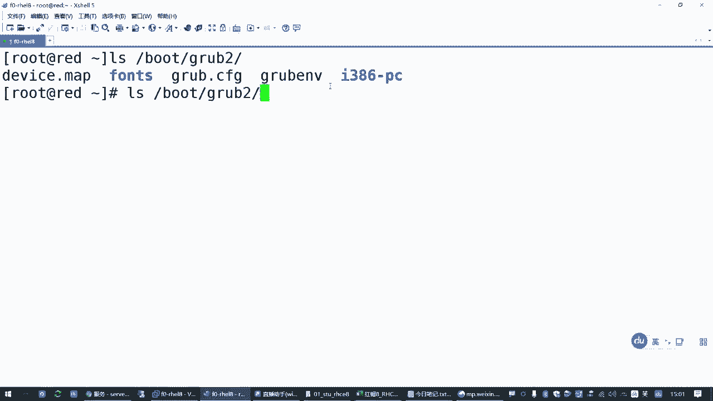

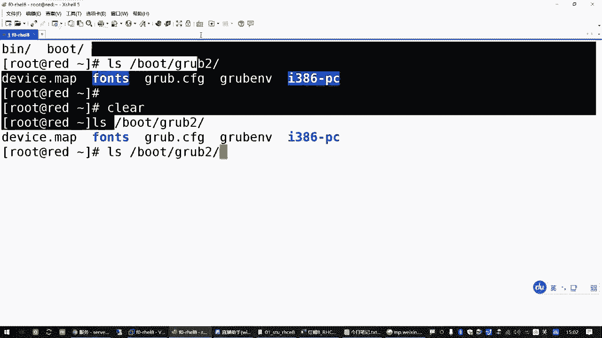

再去打那个。退不见了。对吧这些快捷键。所以我们把常见的这几个快捷键给大家提了一下啊。OK吧，这是呃我们在使用lininux系统的时候啊，最基础的一些需要了解，需要掌握的一些概念啊。

特别是关于这个目录结构，然后命令行解释器内核是吧？再加上刚才我们讲过的命令行的基本格式。再加几个快捷键啊，大家平时用的时候呢，你可以把这个呢好好体会一下。呃，相信可能有很多同学平时用过啊，那没关系。

就给你加深一下印象啊，加深一下印象。😊，啊，那从下节课开始呢，我们将会给大家讲我们的常用的命令。那咱们先休息15分钟啊，休息15分钟。

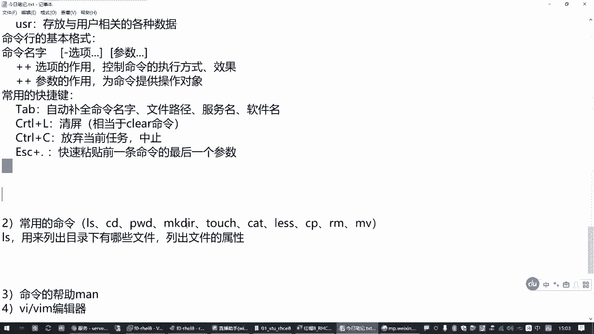